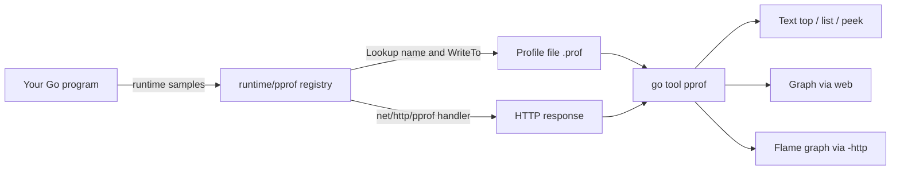
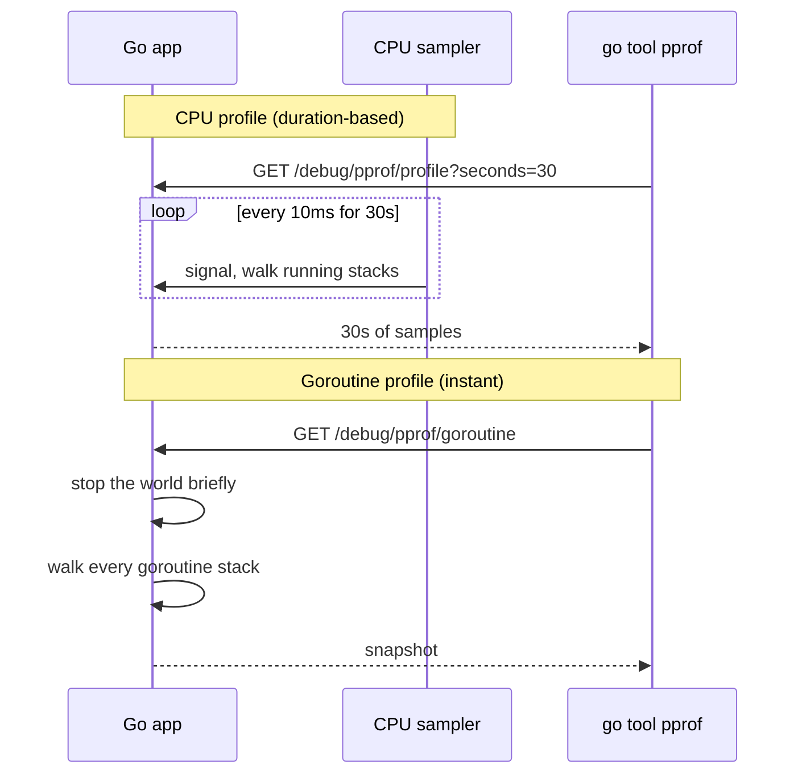

# pprof and Profiling Tools — Junior Level

## Table of Contents
1. [Introduction](#introduction)
2. [Prerequisites](#prerequisites)
3. [Glossary](#glossary)
4. [Core Concepts](#core-concepts)
5. [Real-World Analogies](#real-world-analogies)
6. [Mental Models](#mental-models)
7. [Pros & Cons](#pros-cons)
8. [Use Cases](#use-cases)
9. [Code Examples](#code-examples)
10. [Coding Patterns](#coding-patterns)
11. [Clean Code](#clean-code)
12. [Product Use / Feature](#product-use-feature)
13. [Error Handling](#error-handling)
14. [Security Considerations](#security-considerations)
15. [Performance Tips](#performance-tips)
16. [Best Practices](#best-practices)
17. [Edge Cases & Pitfalls](#edge-cases-pitfalls)
18. [Common Mistakes](#common-mistakes)
19. [Common Misconceptions](#common-misconceptions)
20. [Tricky Points](#tricky-points)
21. [Test](#test)
22. [Tricky Questions](#tricky-questions)
23. [Cheat Sheet](#cheat-sheet)
24. [Self-Assessment Checklist](#self-assessment-checklist)
25. [Summary](#summary)
26. [What You Can Build](#what-you-can-build)
27. [Further Reading](#further-reading)
28. [Related Topics](#related-topics)
29. [Diagrams & Visual Aids](#diagrams-visual-aids)

---

## Introduction
> Focus: "How do I look inside a running Go program and see what its goroutines are doing?"

When a Go program misbehaves — it leaks memory, it goes slow, it spawns too many goroutines, it stops responding — the temptation is to read source code and guess. `pprof` removes the guessing. It is a built-in profiler that ships with the Go standard library and the `go` toolchain. You attach it once, point a tool at it, and within seconds you have a list of every active goroutine, the stack each one is parked on, and a clickable map of where your CPU and memory are going.

`pprof` is two things glued together:

1. **A runtime sampler** inside `runtime/pprof`. It collects profiles in a compact binary format.
2. **A toolchain** — `go tool pprof` — that reads those profiles and renders them as text, graphs, and interactive flame graphs.

Layered on top is `net/http/pprof`, a tiny package that exposes the profiles over HTTP so you can grab them from a live server without restarting it.

For goroutine lifecycle and leak work, pprof's most important profile is the **goroutine profile**: a snapshot of every live goroutine in the process and the stack it is sitting on. If your program has 50,000 goroutines and you only expect 200, the goroutine profile tells you exactly which lines of code are responsible.

After reading this file you will:

- Know what a profile is and where it comes from.
- Add pprof to your program in two ways — programmatic and HTTP.
- Pull a goroutine profile using all three debug levels (`0`, `1`, `2`).
- Open a profile with `go tool pprof` and use `top`, `list`, `peek`, `traces`.
- Open the interactive web UI with `go tool pprof -http`.
- Read a flame graph for the first time.
- Know the difference between goroutine, heap, allocs, mutex, block, threadcreate, profile, and trace.
- Avoid exposing pprof to the public internet.

You do not yet need to know about goroutine labels, continuous profilers, or how the sampler decides what to record. Those come at middle and senior level.

---

## Prerequisites

- **Required:** Go 1.21 or newer. Check with `go version`. The HTTP pprof handler shipped before this, but newer Go versions render labels and trace data better.
- **Required:** Comfort writing a basic Go program with a `main` function and a `goroutine` or two. Read `01-overview/junior.md` first if not.
- **Required:** A working `go` toolchain on your PATH. `go tool pprof` is included automatically — no separate install.
- **Helpful:** `graphviz` installed (`brew install graphviz` on macOS, `apt-get install graphviz` on Debian). Without it the visual graph commands fall back to text.
- **Helpful:** A modern browser. The web UI runs locally on `127.0.0.1`.

If you can run `go version` and you have written at least one program that uses `go f()`, you are ready.

---

## Glossary

| Term | Definition |
|------|-----------|
| **Profile** | A collection of samples gathered by the Go runtime that describes some aspect of execution: which functions ran, which goroutines exist, where memory was allocated, where locks were contended. Stored as a compressed protobuf file. |
| **Sample** | One unit of measurement in a profile. For CPU profiles, a sample is "the runtime was running these functions at this instant." For goroutine profiles, a sample is "this goroutine is sitting on this stack." |
| **`runtime/pprof`** | The standard library package that produces profiles programmatically. You call it from inside your code to write a profile to a `Writer`. |
| **`net/http/pprof`** | A package that registers HTTP handlers on `/debug/pprof/...`. Importing it for its side effects exposes all profile types over HTTP. |
| **`go tool pprof`** | The command-line tool that reads a profile file (or fetches one over HTTP) and lets you inspect it interactively. |
| **Goroutine profile** | A snapshot of every currently-live goroutine and the stack it is parked on. The single most useful profile for leak hunts. |
| **Heap profile** | A sample of currently-allocated memory by call site. Helps find memory leaks and oversized allocations. |
| **CPU profile** | A periodic stack-sampling of running goroutines. Default rate is 100 samples per second. Helps find CPU hot spots. |
| **Mutex profile** | Samples of contention on `sync.Mutex` and `sync.RWMutex`. Off by default; enable with `runtime.SetMutexProfileFraction`. |
| **Block profile** | Samples of goroutines waiting on channel sends/receives, locks, and other synchronisation. Off by default; enable with `runtime.SetBlockProfileRate`. |
| **Trace** | A different artefact from a profile: a full event log of scheduler events, syscalls, GC pauses, and goroutine state changes. Inspect with `go tool trace`. |
| **Flame graph** | A visualisation where each rectangle is a stack frame, width is proportional to time, and stack depth is on the y-axis. The wide rectangles are your hot paths. |
| **Debug level (0/1/2)** | A query parameter on the goroutine endpoint. `0` is the compact pprof binary format, `1` is human-readable grouped text, `2` is one verbose stack per goroutine. |
| **Endpoint** | A URL under `/debug/pprof/` such as `/debug/pprof/goroutine` that returns a profile when fetched. |

---

## Core Concepts

### A profile is a sample, not a log

When you take a CPU profile, the runtime is not recording every function call. It is waking up roughly every 10 milliseconds and noting which goroutines are running and on which stack. After 30 seconds you have ~3000 samples. The functions that show up most often are the ones that were running most of the time. The function that ran for 0.001 ms once does not show up at all.

The goroutine profile is different — it is a **point-in-time snapshot**. At the moment you hit the endpoint, the runtime walks every goroutine in the program and records its stack. Not a sample; the full set. That is why a goroutine profile from a leaking process can tell you exactly which line of which file holds 47,000 goroutines hostage.

This distinction matters: a goroutine profile is precise; a CPU or heap profile is statistical.

### `runtime/pprof` writes profiles, `net/http/pprof` exposes them

The work of collecting and serialising profiles lives in `runtime/pprof`. It is a normal Go package. You can call it from code:

```go
import "runtime/pprof"

f, _ := os.Create("goroutine.prof")
defer f.Close()
pprof.Lookup("goroutine").WriteTo(f, 0)
```

That writes a goroutine profile to disk in pprof binary format (`debug=0`). Later you analyse it with `go tool pprof goroutine.prof`.

`net/http/pprof` adds nothing new in terms of profile types. All it does is register HTTP handlers that, when hit, call into `runtime/pprof` and stream the result back. The trick to enabling it is **importing it for side effects**:

```go
import _ "net/http/pprof"
```

The blank identifier (`_`) means "I do not need the symbols, I just want the package's `init()` to run." That `init()` adds routes to the default HTTP mux.

### The default mux gets the endpoints automatically

When you `import _ "net/http/pprof"`, the routes go on `http.DefaultServeMux`. If you also have an `http.ListenAndServe(":8080", nil)` somewhere, pprof is now on port 8080 at `/debug/pprof/`. If you use a custom mux you must register the handlers explicitly — covered in middle level.

### A goroutine profile is just a "Lookup"

Inside `runtime/pprof` there is a registry of named profiles. You access them via `pprof.Lookup(name)`:

| Name | What it samples |
|------|-----------------|
| `goroutine` | Every live goroutine and its stack |
| `heap` | Memory still in use (sampled allocations) |
| `allocs` | Every sampled allocation since program start |
| `threadcreate` | Stack at the point each OS thread was created |
| `block` | Goroutines blocked on synchronisation (if enabled) |
| `mutex` | Contended mutex acquisitions (if enabled) |

Plus the CPU profile, which is a special case started via `pprof.StartCPUProfile` and stopped via `pprof.StopCPUProfile`. And the execution trace, which lives in `runtime/trace`.

### Three debug levels for the goroutine endpoint

This is the part most beginners miss. The same URL `/debug/pprof/goroutine` returns three different things depending on the `debug` query parameter:

- `debug=0` (default if you do not pass it via `go tool pprof`) — pprof binary format. Compact. Meant to be fed to `go tool pprof`.
- `debug=1` — human-readable text. Each unique stack is shown once, with a count of how many goroutines share it. **This is the format you read with `curl` for a quick leak check.**
- `debug=2` — human-readable text. Every goroutine is printed individually with its full stack and its current state (running, runnable, IO wait, chan receive, etc.). Long output.

A leak audit usually starts with `?debug=1` because grouping by stack tells you "47,000 goroutines are all sitting on this same line."

### `go tool pprof` is interactive

When you run `go tool pprof <profile>`, you drop into a REPL:

```
(pprof) top
(pprof) list MyFunc
(pprof) web
(pprof) peek MyFunc
(pprof) traces
(pprof) quit
```

The same commands work whether the profile came from a file, from `curl`, or from an HTTP URL passed directly:

```bash
go tool pprof http://localhost:8080/debug/pprof/goroutine
```

For a hands-on web UI, use `-http`:

```bash
go tool pprof -http=:9090 goroutine.prof
```

This launches a local web server with flame graphs, source views, and graph views.

---

## Real-World Analogies

### Profiles are like a crime-scene photo, traces are like CCTV footage

A profile is a single photograph: "at this moment, these goroutines were stuck on this line." A trace is the security camera that recorded everything that happened over the last 5 seconds: every context switch, every channel send, every GC pause. The photo is cheaper to take and faster to read. The footage is more complete but heavier.

### `pprof` is a smoke detector with a microphone

Most of the time it sits silent, sampling occasionally. When you want to know what's going on, you query it and it tells you in detail. Unlike print debugging, you never have to change your code: the data was always there, you just had to ask.

### Flame graphs are like a city skyline seen from a plane

Each tower is a function. Tall towers are deep call stacks. Wide towers are popular code paths — functions where lots of time was spent. The widest skyscraper at the top of the picture is the function that ate the most CPU. Click on it and you see the streets below: the functions it called and where they went.

### Goroutine labels are like coloured badges at a conference

By default every goroutine looks the same on the profile. Add labels — "user=alice", "stage=checkout" — and now the runtime stamps each badge. When you filter by label later, you only see the goroutines that were doing that specific work.

---

## Mental Models

### The two-step shape of a pprof session

Almost every pprof investigation has the same two steps:

1. **Collect.** Either programmatically (`pprof.Lookup(...).WriteTo`) or over HTTP (`curl http://localhost:8080/debug/pprof/goroutine`).
2. **Analyse.** Either with `go tool pprof` in the terminal, or with `-http` for the web UI, or with `curl ?debug=1` for a one-line text dump.

You can collect and analyse in one shot:

```bash
go tool pprof http://localhost:8080/debug/pprof/goroutine
```

The tool fetches the profile, saves it under `~/pprof/`, and drops you into the REPL.

### Where does the CPU profile go in this model?

CPU profiles are an exception. They are not point-in-time — you must **start** them and **stop** them after a window. The HTTP endpoint `/debug/pprof/profile?seconds=30` does this for you: it starts a CPU profile, waits 30 seconds, then sends the result.

Goroutine, heap, allocs, mutex, block, threadcreate — all of these are instant. CPU and trace require a duration.

### Why import for side effects?

The pattern `import _ "net/http/pprof"` is unusual to newcomers. It does not create a symbol you can reference. It runs the package's `init()` function, which has the side effect of adding routes:

```go
// inside net/http/pprof
func init() {
    http.HandleFunc("/debug/pprof/", Index)
    http.HandleFunc("/debug/pprof/cmdline", Cmdline)
    http.HandleFunc("/debug/pprof/profile", Profile)
    http.HandleFunc("/debug/pprof/symbol", Symbol)
    http.HandleFunc("/debug/pprof/trace", Trace)
}
```

If your service does not run an HTTP server, that import does nothing useful. You either need to also start `http.ListenAndServe`, or skip the HTTP package and call `runtime/pprof` directly.

---

## Pros & Cons

### Pros

- **Built into the standard library.** No external dependencies. Available in every Go installation.
- **Cheap.** Goroutine and heap profiles can run safely in production. CPU profile has roughly 5% overhead.
- **Sample-based.** Long-running collection does not bloat your binary or your memory usage.
- **Multiple profile types.** One toolchain covers CPU, memory, lock contention, goroutine state, and execution traces.
- **Great visualisation.** Flame graphs and graph views via `-http` are best-in-class compared to most languages.
- **Symbolised by default.** Stacks show your function names, file paths, and line numbers without extra work.

### Cons

- **Not safe to expose publicly.** Profiles can leak source structure and let attackers force expensive CPU profiles. Always bind to localhost or an admin network.
- **Goroutine profile takes a stop-the-world.** For very large processes (hundreds of thousands of goroutines) the pause can be noticeable.
- **Mutex and block profiles are off by default.** You have to opt in, and they have overhead.
- **CPU profile resolution is coarse.** 100 Hz default means functions running for under 10 ms are invisible.
- **Trace files are large.** A 5-second trace on a busy server can be tens of megabytes.

---

## Use Cases

| Symptom | Profile to start with |
|---------|----------------------|
| "Memory keeps growing" | `heap`, then `allocs` |
| "Service uses 100% CPU" | `profile` (CPU) for 30 seconds |
| "`runtime.NumGoroutine()` keeps climbing" | `goroutine?debug=1` |
| "Latency p99 spikes randomly" | `trace` for a few seconds |
| "Locks feel contended" | `mutex` (after enabling) |
| "Goroutines spend time waiting" | `block` (after enabling) |
| "Too many OS threads" | `threadcreate` |

---

## Code Examples

### Programmatic profile from inside the program

```go
package main

import (
    "log"
    "os"
    "runtime/pprof"
    "time"
)

func main() {
    // Spawn a few goroutines that block forever — easy leak.
    for i := 0; i < 5; i++ {
        go func() {
            ch := make(chan int)
            <-ch // blocks forever
        }()
    }

    time.Sleep(100 * time.Millisecond)

    f, err := os.Create("goroutine.prof")
    if err != nil {
        log.Fatal(err)
    }
    defer f.Close()

    if err := pprof.Lookup("goroutine").WriteTo(f, 0); err != nil {
        log.Fatal(err)
    }
    log.Println("wrote goroutine.prof")
}
```

Run it:

```bash
go run main.go
go tool pprof goroutine.prof
```

Inside the REPL:

```
(pprof) top
Showing nodes accounting for 6, 100% of 6 total
      flat  flat%   sum%        cum   cum%
         5 83.33% 83.33%          5 83.33%  main.main.func1
         1 16.67%   100%          1   100%  runtime.gopark
```

Five goroutines parked in `main.main.func1` — the closure. Visit the file:

```
(pprof) list main.main.func1
ROUTINE ======================== main.main.func1 in main.go
        0          5   |  go func() {
        0          5   |      ch := make(chan int)
        5          5   |      <-ch
        0          0   |  }()
```

Five goroutines blocked on `<-ch`. That is your leak.

### HTTP profiling on a live server

```go
package main

import (
    "log"
    "net/http"
    _ "net/http/pprof"
)

func main() {
    go func() {
        log.Println(http.ListenAndServe("127.0.0.1:6060", nil))
    }()

    select {} // pretend this is a long-running app
}
```

Now from another terminal:

```bash
curl http://127.0.0.1:6060/debug/pprof/goroutine?debug=1
```

Sample output of `debug=1`:

```
goroutine profile: total 4
2 @ 0x100123abc 0x100456def 0x100789012
#       0x100123abc     runtime.gopark+0x123    /usr/local/go/src/runtime/proc.go:380
#       0x100456def     main.worker+0x45        /home/me/app/main.go:21
#       0x100789012     main.main.func1+0x30    /home/me/app/main.go:14

1 @ 0x100abcdef ...
#       0x100abcdef     net/http.(*conn).serve   ...
```

Read it as: "2 goroutines are stacked on stacks starting with `runtime.gopark` → `main.worker` → `main.main.func1`."

### Debug level 2 — every goroutine, full stack

```bash
curl http://127.0.0.1:6060/debug/pprof/goroutine?debug=2
```

Sample:

```
goroutine 1 [running]:
runtime.goroutineHeader(...)
main.main()
        /home/me/app/main.go:13 +0x55

goroutine 18 [chan receive]:
main.worker(...)
        /home/me/app/main.go:21
main.main.func1(...)
        /home/me/app/main.go:14 +0x40
created by main.main in goroutine 1
        /home/me/app/main.go:13 +0x44

goroutine 19 [chan receive]:
main.worker(...)
        /home/me/app/main.go:21
...
```

Each goroutine has its **state** in square brackets — `running`, `chan receive`, `IO wait`, `select`, `sleep`, `sync.WaitGroup.Wait`. That state is the single most useful signal in a leak hunt.

### Quick goroutine count from curl

```bash
curl -s http://127.0.0.1:6060/debug/pprof/goroutine?debug=1 | head -1
# goroutine profile: total 50000
```

If you only want the count, the first line of `debug=1` has it.

### CPU profile via HTTP

```bash
go tool pprof http://127.0.0.1:6060/debug/pprof/profile?seconds=30
```

The tool blocks for 30 seconds while the server samples CPU usage, then drops you into the REPL.

### Heap profile via HTTP

```bash
go tool pprof http://127.0.0.1:6060/debug/pprof/heap
```

By default this shows **in-use** memory (`-inuse_space`). To see total allocations since start:

```bash
go tool pprof -alloc_space http://127.0.0.1:6060/debug/pprof/allocs
```

### Web UI

```bash
go tool pprof -http=:9090 goroutine.prof
```

Open `http://localhost:9090` in a browser. The dropdown at the top has **Top**, **Graph**, **Flame Graph**, **Source**, **Peek**. For goroutine profiles, **Flame Graph** is the most useful: the widest bar is the stack with the most goroutines.

### Custom mux registration

If you do not use `http.DefaultServeMux`:

```go
import (
    "net/http"
    "net/http/pprof"
)

mux := http.NewServeMux()
mux.HandleFunc("/debug/pprof/", pprof.Index)
mux.HandleFunc("/debug/pprof/cmdline", pprof.Cmdline)
mux.HandleFunc("/debug/pprof/profile", pprof.Profile)
mux.HandleFunc("/debug/pprof/symbol", pprof.Symbol)
mux.HandleFunc("/debug/pprof/trace", pprof.Trace)

http.ListenAndServe("127.0.0.1:6060", mux)
```

You lose nothing by using a custom mux — you just have to wire it manually.

---

## Coding Patterns

### Pattern: separate admin port

Run pprof on its own port bound to localhost, separate from your main API:

```go
go func() {
    log.Println(http.ListenAndServe("127.0.0.1:6060", nil))
}()
```

The main API on `:8080` is public. The admin port on `:6060` is private. SSH-tunnel to it when you need to debug:

```bash
ssh -L 6060:127.0.0.1:6060 prod-host
```

### Pattern: snapshot to a file on signal

When you suspect a leak, dump a snapshot to disk so you can compare snapshots later.

```go
func dumpGoroutines(path string) error {
    f, err := os.Create(path)
    if err != nil {
        return err
    }
    defer f.Close()
    return pprof.Lookup("goroutine").WriteTo(f, 0)
}

c := make(chan os.Signal, 1)
signal.Notify(c, syscall.SIGUSR1)
go func() {
    for range c {
        ts := time.Now().Format("20060102T150405")
        _ = dumpGoroutines(fmt.Sprintf("/tmp/goroutine-%s.prof", ts))
    }
}()
```

Send `kill -SIGUSR1 <pid>` and a snapshot lands in `/tmp`.

### Pattern: in-process profile on startup health check

Some services dump a goroutine profile if they detect more than N goroutines, to capture evidence before restart.

```go
if runtime.NumGoroutine() > 10_000 {
    _ = dumpGoroutines("/tmp/goroutine-overflow.prof")
}
```

---

## Clean Code

- Always put pprof on a **separate port** bound to **localhost**, never alongside your public API.
- Use named functions, not anonymous closures, for long-running goroutines. `main.main.func1` is useless in a stack trace; `worker.processOrder` is informative.
- Keep one canonical way to dump profiles in your service. Multiple ad-hoc paths confuse on-call engineers.
- Document the pprof endpoint in your service README — including the SSH tunnel command.

---

## Product Use / Feature

- A **/healthz** check that returns goroutine count. Cheap, no full profile needed.
- A **scheduled snapshot** to S3 every hour. Cheap insurance: when something breaks at 03:00 you have history.
- A **deploy gate**: refuse to roll out a new version if the goroutine count two minutes after start exceeds a baseline by 50%.

---

## Error Handling

Pprof itself rarely errors. A few cases:

- `pprof.Lookup("foo")` returns `nil` if the name is unknown. Always check.
- `pprof.StartCPUProfile` returns an error if a profile is already running.
- The HTTP handler returns 404 for unknown profile types.

```go
p := pprof.Lookup("goroutine")
if p == nil {
    return errors.New("goroutine profile not available")
}
```

---

## Security Considerations

**Never expose `/debug/pprof/` on a public port.** Reasons:

- `/debug/pprof/profile?seconds=600` lets an attacker pin one CPU at 5% overhead for 10 minutes.
- The `cmdline` endpoint reveals your binary's flags, which may include secrets.
- Profile output leaks function names, file paths, and the rough structure of your code, useful for reconnaissance.
- The trace endpoint can write tens of megabytes per request — a cheap DoS vector.

Always bind to `127.0.0.1` or to an admin-only network. Use SSH tunnels or VPN to reach it. If you must put it behind your normal server, gate it on authentication and aggressive rate limiting.

---

## Performance Tips

- **Goroutine profile**: cheap for ~1k goroutines, noticeable pause for >100k. Avoid hitting it in a tight loop.
- **Heap profile**: cheap. Default sample rate is one allocation in 512 KB; controlled by `runtime.MemProfileRate`.
- **CPU profile**: ~5% overhead during collection.
- **Trace**: 1–10% overhead, large output. Use short windows.
- **Mutex/block profiles**: off by default for a reason — enabling them costs.

---

## Best Practices

1. Import `_ "net/http/pprof"` in your main package, never inside a library.
2. Start pprof on `127.0.0.1` only.
3. Name your long-running goroutines via named functions.
4. Take a baseline goroutine profile right after startup and stash it. Future profiles compare against it.
5. Install `graphviz`. The visual graphs are far easier to read than text.
6. Use `?debug=1` for quick text checks, `?debug=2` for individual stacks, `debug=0` (default for tools) for full analysis.
7. Use `go tool pprof -http=:9090` for the best UX.

---

## Edge Cases & Pitfalls

- **The HTTP profile endpoint defaults to `debug=0`** if you pass `?debug=` with no value. Always be explicit.
- The default mux contains pprof routes — but only if `import _ "net/http/pprof"` ran. Removing that import silently disables the endpoint.
- `runtime.NumGoroutine()` includes system goroutines (GC workers, network poller). On a quiet program, expect 3–5 even with no user goroutines.
- A goroutine profile from a process with many goroutines (>50k) can take a real fraction of a second to collect. The runtime briefly stops the world.
- CPU profiles only capture goroutines that are **running on a P**. Goroutines waiting on I/O do not appear.

---

## Common Mistakes

1. **Confusing goroutine count with goroutine leak.** A program legitimately running 10,000 connections has 10,000 connection goroutines. That is not a leak unless the number keeps climbing under stable load.
2. **Reading `?debug=2` first.** The output is enormous. Start with `?debug=1` to group.
3. **Forgetting the HTTP server.** `import _ "net/http/pprof"` does nothing if no `http.ListenAndServe` is running.
4. **Exposing pprof publicly.** Already covered, but the most common security mistake by far.
5. **Comparing CPU profiles taken over different durations.** Always use the same `seconds=` value.
6. **Ignoring the `[state]` next to each goroutine in `debug=2`.** That state — `chan receive`, `IO wait` — is half the diagnosis.

---

## Common Misconceptions

- **"pprof slows down my program."** Only CPU profiles and trace cost noticeable overhead. Snapshot profiles (goroutine, heap, threadcreate) are essentially free.
- **"You need to compile with special flags."** No. pprof is always linked in.
- **"Goroutine profile shows OS threads."** It shows goroutines. For OS threads, use `threadcreate`.
- **"Flame graphs show time."** For CPU profiles, yes. For goroutine profiles, the width is the number of goroutines sharing a stack, not time.
- **"`go tool pprof` needs the source code."** It needs the symbols (function names), which are embedded in the binary by default. Source listings need the file paths to resolve.

---

## Tricky Points

- The first line of `?debug=1` output (`goroutine profile: total N`) is your single fastest leak check. Curl it, parse the number, log it.
- `pprof.Lookup("heap")` and the HTTP `/debug/pprof/heap` endpoint default to **in-use** samples. To see total allocations, use `/debug/pprof/allocs`.
- The `gc=1` parameter (`/debug/pprof/heap?gc=1`) forces a GC before sampling, giving you a clean view of *live* memory. Without it, recently-freed memory may still appear.
- `go tool pprof` accepts a profile URL or a file path interchangeably.
- For a CPU profile, `seconds=N` is a query parameter — leave it off and it defaults to 30.

---

## Test

A small sanity test for your pprof integration:

```go
package main

import (
    "io"
    "net/http"
    "net/http/httptest"
    _ "net/http/pprof"
    "strings"
    "testing"
)

func TestPprofEndpoint(t *testing.T) {
    srv := httptest.NewServer(http.DefaultServeMux)
    defer srv.Close()

    resp, err := http.Get(srv.URL + "/debug/pprof/goroutine?debug=1")
    if err != nil {
        t.Fatal(err)
    }
    defer resp.Body.Close()

    body, _ := io.ReadAll(resp.Body)
    if !strings.HasPrefix(string(body), "goroutine profile: total") {
        t.Fatalf("unexpected body: %q", string(body[:80]))
    }
}
```

---

## Tricky Questions

1. **Why does `?debug=0` print binary garbage in my terminal?** Because it is the protobuf format meant for `go tool pprof`. Pipe it to a file or use `?debug=1`.
2. **My goroutine count is huge but the program seems fine — is that a leak?** Maybe not. Re-measure under steady load. A leak shows monotonic growth over time, not a high steady-state.
3. **`go tool pprof` says "no samples." What does that mean?** For CPU profiles, the window was too short or the program was idle. For heap, there were no sampled allocations.
4. **Can I take a heap profile of a panicked program?** Not via HTTP — it's dead. But a `defer` that writes a profile on panic recovery can capture one.
5. **Does `runtime.GC()` affect the heap profile?** It cleans up garbage so the "in-use" numbers are more accurate. `?gc=1` does this for you on the HTTP endpoint.

---

## Cheat Sheet

```bash
# Live HTTP profile collection
curl http://localhost:6060/debug/pprof/goroutine?debug=1   # text, grouped
curl http://localhost:6060/debug/pprof/goroutine?debug=2   # text, every goroutine
curl -o g.prof http://localhost:6060/debug/pprof/goroutine # binary

# CLI analysis
go tool pprof g.prof
go tool pprof http://localhost:6060/debug/pprof/goroutine
go tool pprof http://localhost:6060/debug/pprof/profile?seconds=30
go tool pprof http://localhost:6060/debug/pprof/heap

# Web UI
go tool pprof -http=:9090 g.prof

# REPL commands
(pprof) top
(pprof) top10 -cum
(pprof) list FuncName
(pprof) peek FuncName
(pprof) web
(pprof) traces
(pprof) help

# Programmatic
import "runtime/pprof"
f, _ := os.Create("g.prof")
pprof.Lookup("goroutine").WriteTo(f, 0)

# Standard pprof imports
import _ "net/http/pprof"

# Run pprof on a private port
go func() { log.Println(http.ListenAndServe("127.0.0.1:6060", nil)) }()
```

---

## Self-Assessment Checklist

- [ ] I can add pprof to a service in two ways.
- [ ] I understand the three debug levels of the goroutine endpoint.
- [ ] I can run `go tool pprof` against a file and a URL.
- [ ] I know `top`, `list`, `peek`, `web`, `traces` and what each shows.
- [ ] I can open the web UI with `-http`.
- [ ] I know not to expose pprof on a public port.
- [ ] I can read a flame graph in broad strokes.
- [ ] I know which profile type to start with for memory, CPU, and goroutine problems.

---

## Summary

`pprof` is your built-in microscope for a Go program. The Go runtime samples behaviour into compact profile files; `runtime/pprof` writes them; `net/http/pprof` exposes them over HTTP; `go tool pprof` reads them as text, graphs, or interactive flame graphs. The goroutine profile is the most important for leak hunts, with three debug levels (`0` binary, `1` grouped text, `2` per-goroutine full stack) tuned to different audiences. Heap, allocs, CPU, mutex, block, threadcreate, and trace cover the rest of the diagnostic surface. Keep pprof on a private port, learn the REPL commands, and you have a tool that turns "the service is slow" into "this exact line is the problem" in minutes.

---

## What You Can Build

- A `/debug/pprof/` wrapper that requires a shared-secret header before serving profiles.
- A "goroutine watchdog" that dumps a snapshot to disk whenever `runtime.NumGoroutine()` crosses a threshold.
- A test helper that asserts no new goroutines remain after a function call (compare two profiles).
- A CI gate that diff-runs a service for 30 seconds and fails the build if the new commit grows the goroutine count.

---

## Further Reading

- Standard library: `runtime/pprof`, `net/http/pprof`, `runtime/trace`.
- "Profiling Go Programs" — official Go blog post.
- Felix Geisendörfer's "Go Profiling in Production" series.
- `go help testflag` for `-cpuprofile`, `-memprofile`, `-blockprofile`, `-mutexprofile`.
- Brendan Gregg's flame-graph essays (language-agnostic foundation).

---

## Related Topics

- `01-overview/junior.md` — what a goroutine is, prerequisite reading.
- `07-goroutine-lifecycle-leaks/01-lifecycle/` — what a goroutine looks like over its lifetime.
- `07-goroutine-lifecycle-leaks/02-detecting-leaks/` — leak-detection patterns; pprof is the main tool.
- `07-goroutine-lifecycle-leaks/03-preventing-leaks/` — once you have found a leak, here is how to stop it recurring.
- `01-goroutines/04-runtime-management/` — `GOMAXPROCS`, `runtime/metrics`, related tuning.

---

## Diagrams & Visual Aids

### Profile collection flow



### Three debug levels of the goroutine endpoint

```mermaid
flowchart TD
    A[/debug/pprof/goroutine] --> B{debug=?}
    B -->|0 default| C[Binary pprof format - feed to go tool pprof]
    B -->|1| D[Grouped text - one stack, count of goroutines]
    B -->|2| E[Every goroutine printed individually with state and full stack]
```

### CPU sampler vs goroutine snapshot


