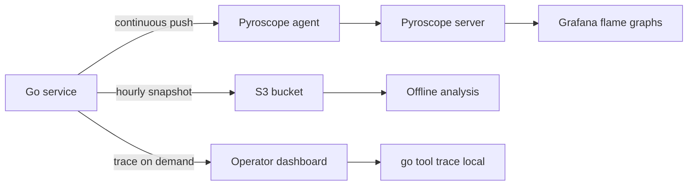

# pprof and Profiling Tools — Professional Level

## Table of Contents
1. [Introduction](#introduction)
2. [The Sampling Mechanics](#the-sampling-mechanics)
3. [The Pprof Profile Format](#the-pprof-profile-format)
4. [Symbolisation and DWARF](#symbolisation-and-dwarf)
5. [Async Preemption and CPU Profiles](#async-preemption-and-cpu-profiles)
6. [The Runtime's Goroutine Walk](#the-runtimes-goroutine-walk)
7. [Trace File Internals](#trace-file-internals)
8. [eBPF-Based Profiling](#ebpf-based-profiling)
9. [Building a Custom Profile Pipeline](#building-a-custom-profile-pipeline)
10. [Self-Assessment](#self-assessment)
11. [Summary](#summary)

---

## Introduction

At professional level you understand how pprof works underneath. You can read the runtime source, debug a misbehaving sampler, write a tool that parses the protobuf, set up an eBPF-based profiler that bypasses the runtime entirely, and decide which trade-offs each layer makes. This file is about internals: timer-driven sampling, stack walking, the protobuf schema, DWARF symbolisation, and where Go's profilers differ from system-level ones.

You do not need this material to use pprof daily. You need it when:

- Your profile is missing data.
- Your symbols are wrong.
- Your sampler is broken or you suspect a runtime bug.
- You are building tooling that consumes pprof output.
- You compare Go's in-process profiler with eBPF-based alternatives.

---

## The Sampling Mechanics

### CPU profile timer

Go's CPU profile uses an OS timer. On Linux it is `setitimer(ITIMER_PROF, ...)` with a default 10 ms period, fielded by `SIGPROF`. Each tick:

1. The kernel delivers `SIGPROF` to an arbitrary thread in the process.
2. The Go runtime signal handler is invoked.
3. It walks the stack of whichever goroutine is currently executing on that thread.
4. The stack is encoded as a sample and pushed onto a lock-free queue.
5. A consumer goroutine drains the queue into the profile buffer.

Consequences:

- Goroutines blocked in syscalls do **not** appear in a CPU profile. The signal hits some thread, but if no Go code is running on it, the walk yields nothing useful.
- The profile resolution is the timer period. Functions running for less than 10 ms have probabilistic visibility.
- The runtime asserts at most one CPU profile may run at a time. Starting a second returns an error.

The CPU profile rate is configurable:

```go
import "runtime"

runtime.SetCPUProfileRate(500) // 500 Hz instead of default 100
```

Be careful: higher rates inflate overhead and trace size. 100 Hz is right for most cases.

### Heap profile sampling

The heap sampler is **not** timer-driven. The runtime tracks bytes allocated and, every `runtime.MemProfileRate` bytes, samples the *next* allocation: it walks the stack at the allocation site, records the size, and tags the allocation so the GC tracks whether it lives or dies.

`MemProfileRate` defaults to 512 KB. Smaller values sample more allocations but increase overhead. `0` disables sampling. `1` records every allocation.

```go
runtime.MemProfileRate = 0       // off
runtime.MemProfileRate = 1       // every allocation, very expensive
runtime.MemProfileRate = 512<<10 // default
```

The "in-use" view is computed by walking sampled allocations that are still tracked. The "alloc" view is the cumulative count.

### Block and mutex sampling

Block and mutex samples are recorded by the runtime when a goroutine becomes blocked or contended. They are gated by `SetBlockProfileRate` and `SetMutexProfileFraction`. The runtime caches a stack at the blocking site and either always records (fraction 1) or records based on a per-event random check.

A subtle point: the mutex profile measures the holder's stack, not the waiter's. The goroutine that *caused* the contention is the one tagged, because that is the actionable site.

### Goroutine profile

This is the only profile that is fundamentally synchronous. Calling `pprof.Lookup("goroutine").WriteTo(...)` triggers `runtime.stopTheWorld`, walks the `allgs` array, captures each goroutine's stack, and resumes. The stop-the-world is brief for normal goroutine counts but scales with the number of goroutines.

For very large processes, the **debug=2** path is somewhat lighter because it does not have to deduplicate by stack — but it still walks every goroutine.

---

## The Pprof Profile Format

Profiles are encoded as a protobuf message defined in `github.com/google/pprof/proto/profile.proto`. The top-level message is `Profile`. Its key fields:

```proto
message Profile {
  repeated ValueType sample_type = 1;  // names like "samples", "cpu", "alloc_space"
  repeated Sample    sample      = 2;  // the data
  repeated Mapping   mapping     = 3;  // binary regions
  repeated Location  location    = 4;  // PC-level entries
  repeated Function  function    = 5;  // symbolised entries
  repeated string    string_table = 6; // string interning
  int64              time_nanos  = 9;
  int64              duration_nanos = 10;
  ValueType          period_type = 11;
  int64              period      = 12;
}

message Sample {
  repeated uint64 location_id = 1;
  repeated int64  value       = 2;  // one entry per sample_type
  repeated Label  label       = 3;  // tags
}
```

Each `Sample` is a stack (`location_id` list, deepest frame last) plus N numeric values aligned with `sample_type`, plus optional labels.

A goroutine profile has `sample_type = [{count, 1}]`. Each sample's value is 1 — one goroutine per sample. The labels are the `pprof.Labels` attached to that goroutine.

A heap profile has four sample types — `alloc_objects`, `alloc_space`, `inuse_objects`, `inuse_space` — so each sample has four values.

### Parsing profiles yourself

```go
import "github.com/google/pprof/profile"

f, _ := os.Open("goroutine.prof")
p, err := profile.Parse(f)
if err != nil {
    return err
}
fmt.Printf("samples: %d\n", len(p.Sample))
for _, s := range p.Sample {
    fmt.Printf("  count=%d frames=%d labels=%v\n", s.Value[0], len(s.Location), s.Label)
}
```

This unlocks custom analysis: feeding profile data into your own dashboards, alerting on specific stacks, joining profiles with trace IDs.

---

## Symbolisation and DWARF

A raw profile contains PC addresses (program-counter values). Turning a PC into "function `processRequest` at `handler.go:42`" requires symbol information.

Go binaries ship with three symbol sources:

1. The Go-specific symbol table (`gopclntab`), always present, used by `runtime.FuncForPC`.
2. DWARF debug info, optional, included by default unless stripped with `-ldflags="-s -w"`.
3. The Go-specific function table, used by `go tool pprof` for inlined function expansion.

Stripped binaries (`-w`) drop DWARF. PProf still works because `gopclntab` is enough for function names and file/line. The cost of stripping is mainly debugger usability — pprof itself stays functional.

### Remote symbolisation

If your production binary is stripped but you keep an unstripped binary on a build server:

```bash
go tool pprof -symbolize=remote http://symbol-server:9000/symbolicate goroutine.prof
```

Most teams skip this complexity and ship unstripped binaries. The size cost is real but rarely operationally significant.

### Inlined functions

When the compiler inlines `b()` into `a()`, the call stack at sample time shows only `a()`. The profile contains an `Inline` entry per inlined frame in the `Function` table, and `go tool pprof` expands them. The web UI shows inlined frames in a different colour.

---

## Async Preemption and CPU Profiles

Before Go 1.14, CPU profiling missed tight loops. A goroutine in a non-preemptible loop could run for seconds without ever being interrupted by `SIGPROF` (the signal was queued behind a cooperative checkpoint). Functions that did not call into the runtime were invisible to the profiler.

Go 1.14 introduced **async preemption**: the runtime sends `SIGURG` to a thread to force it out of a non-preemptible loop. The same mechanism makes `SIGPROF` reliable — the sampler can now interrupt any goroutine on demand.

Practical implications:

- Pre-1.14 CPU profiles undercounted hot loops. Disregard older profile data when reasoning about hot paths.
- On rare platforms without async preemption support, the old problem persists.
- Setting `GODEBUG=asyncpreemptoff=1` reverts the behaviour for debugging — leave it alone in production.

---

## The Runtime's Goroutine Walk

`runtime.allgs` is a slice holding pointers to every `g` (goroutine descriptor) ever created. Dead goroutines remain in the list until reused. The walk:

```go
// Sketch from runtime/mprof.go
stopTheWorld("profile")
n := 0
forEachG(func(gp *g) {
    if isSystemGoroutine(gp) && !includeSystem {
        return
    }
    record(gp.atomicstatus, gp.sched.pc)
    n++
})
startTheWorld()
```

The runtime distinguishes "user" goroutines from "system" ones (GC workers, finalizers, network poller). By default the profile excludes system goroutines. Pass `?debug=2` to see them.

### Why stop the world?

Walking `gp.sched` while the goroutine is running is unsafe — the PC and SP move. The simplest safe approach is to pause everyone. For large goroutine counts (hundreds of thousands), this pause is measurable. Tools like `gopsutil` and continuous profilers respect this by capping the rate at which they take goroutine profiles.

---

## Trace File Internals

A `runtime/trace` file is a binary log of events. The format is documented in `runtime/trace.go`. Events include:

- `EvGoCreate`, `EvGoStart`, `EvGoEnd`, `EvGoBlockSend`, `EvGoBlockRecv`, `EvGoSysCall`
- `EvGCStart`, `EvGCDone`, `EvGCSweepStart`
- `EvUserTaskCreate`, `EvUserRegion`, `EvUserLog`

Each event has a timestamp (since boot), the affected goroutine ID, and event-specific fields. `go tool trace` reads the file, builds an in-memory event database, and serves a small HTTP UI.

The trace is **complete**, not sampled. That is why it is much larger than a profile.

### Custom trace events

```go
trace.Log(ctx, "category", "message")
```

Adds an event to the trace. It shows up in the timeline. Used for marking domain events ("connected to upstream", "started GC") that help align profile data with business logic.

---

## eBPF-Based Profiling

Parca, Polar Signals, and several commercial tools profile from outside the Go runtime, using eBPF. The kernel walks process stacks on a timer and reports them. Benefits:

- Works on **any** language. C extensions and cgo calls appear.
- No code change to the target. Useful for profiling third-party binaries.
- Symbols are resolved from `gopclntab` on disk, so even stripped binaries work.

Drawbacks:

- Requires a privileged daemon on each host.
- Goroutine labels are invisible — eBPF does not know about them.
- Goroutine profile is not available — only sampled CPU.
- Trace is not available.

The takeaway: eBPF profiling is a system-level complement to Go's in-process profiler, not a replacement. For goroutine work specifically, the in-process profiler is irreplaceable because only it sees the runtime data structures.

---

## Building a Custom Profile Pipeline

A production-grade pipeline often looks like:



Three streams, three audiences:

1. **Continuous profiling** for developers to spot regressions across releases.
2. **Hourly snapshots** for post-incident forensics.
3. **On-demand trace** for engineers debugging a specific report.

Each stream has different cost, retention, and access controls.

### Hand-rolled pipeline

If you cannot adopt a continuous profiler:

```go
func profileUploader(ctx context.Context, bucket string) {
    t := time.NewTicker(time.Minute)
    defer t.Stop()
    for {
        select {
        case <-ctx.Done():
            return
        case <-t.C:
            uploadOnce(bucket)
        }
    }
}

func uploadOnce(bucket string) {
    var buf bytes.Buffer
    if err := pprof.Lookup("goroutine").WriteTo(&buf, 0); err != nil {
        return
    }
    key := fmt.Sprintf("goroutine/%s.pb", time.Now().UTC().Format(time.RFC3339))
    _ = s3PutObject(bucket, key, buf.Bytes())
}
```

Repeat for `heap`, `allocs`, `mutex`, `block`. Compress with gzip first if storage is a concern.

---

## Self-Assessment

- [ ] I can describe how CPU profiles use `SIGPROF`.
- [ ] I understand the difference between cooperative and async preemption and its profile impact.
- [ ] I can parse a `.pb.gz` profile with `github.com/google/pprof/profile`.
- [ ] I know what DWARF contributes and what stripping costs.
- [ ] I can describe `runtime.allgs` and the stop-the-world during goroutine profile.
- [ ] I understand when eBPF profiling is the right tool.
- [ ] I have built or can sketch a custom profile pipeline.

---

## Summary

Professional pprof work is mostly about internals. The CPU profiler is a `SIGPROF`-driven sampler that needs async preemption to be reliable. The heap profiler samples allocations every N bytes. The goroutine profile is a stop-the-world walk of `allgs`. The trace is a complete event log. The output format is a documented protobuf, parseable by any language. Symbols come from `gopclntab` plus optional DWARF. eBPF profilers are powerful for cross-language environments but cannot replace the in-process profiler for goroutine work. Knowing where each layer ends helps you debug the profiler itself, build custom tooling, and choose the right tool for each new question.
