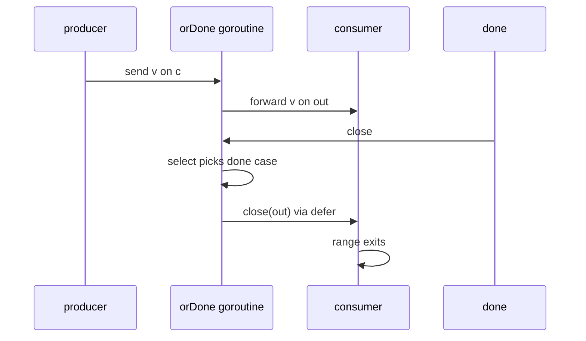

# Or-Done-Channel — Junior Level

## Table of Contents
1. [Introduction](#introduction)
2. [Prerequisites](#prerequisites)
3. [Glossary](#glossary)
4. [Core Concepts](#core-concepts)
5. [Real-World Analogies](#real-world-analogies)
6. [Mental Models](#mental-models)
7. [Pros & Cons](#pros-cons)
8. [Use Cases](#use-cases)
9. [Code Examples](#code-examples)
10. [Coding Patterns](#coding-patterns)
11. [Clean Code](#clean-code)
12. [Product Use / Feature](#product-use-feature)
13. [Error Handling](#error-handling)
14. [Security Considerations](#security-considerations)
15. [Performance Tips](#performance-tips)
16. [Best Practices](#best-practices)
17. [Edge Cases & Pitfalls](#edge-cases-pitfalls)
18. [Common Mistakes](#common-mistakes)
19. [Common Misconceptions](#common-misconceptions)
20. [Tricky Points](#tricky-points)
21. [Test](#test)
22. [Tricky Questions](#tricky-questions)
23. [Cheat Sheet](#cheat-sheet)
24. [Self-Assessment Checklist](#self-assessment-checklist)
25. [Summary](#summary)
26. [What You Can Build](#what-you-can-build)
27. [Further Reading](#further-reading)
28. [Related Topics](#related-topics)
29. [Diagrams & Visual Aids](#diagrams-visual-aids)

---

## Introduction

> Focus: "I have a goroutine that reads from a channel forever. How do I tell it to stop, without rewriting every receive into a `select`?"

The **or-done-channel** pattern solves one of the most common pipeline bugs in Go: a stage that loops over an input channel with `for v := range inputCh` and has no way to exit early when the caller has decided to give up.

The fix in three sentences:

1. You pass two channels into the stage — the data stream `inputCh` and a cancellation signal `done`.
2. A tiny helper, traditionally called `orDone`, combines those two channels into a single new channel that closes when *either* of them closes.
3. The stage loops over the combined channel with plain `for v := range`. No `select` clutter inside the loop body. Cancellation is automatic.

The pattern was named and standardised in Katherine Cox-Buday's book *Concurrency in Go* (O'Reilly, 2017), Chapter 4. It belongs to a small family of channel combinators — `or-done-channel`, `tee-channel`, `bridge-channel`, `fan-in`, `fan-out` — that turn raw channels into a reusable pipeline vocabulary.

After reading this file you will:

- Understand exactly which leak the pattern prevents.
- Know how to write the generic `orDone[T any]` adapter from memory.
- Recognise the pattern in real Go codebases (even when it is inlined or unnamed).
- Be able to compose multiple done signals.
- Know when `context.Context` should be used instead, and when the channel form is still the right answer.

This is the first of the *advanced channel patterns*. Once it clicks, the rest become much easier.

---

## Prerequisites

- **Required:** You can write a goroutine and read from a channel. You have used `for v := range ch`.
- **Required:** You understand that a `range` loop over a channel exits when the channel is *closed*, not when it is empty.
- **Required:** You have used `select` to read from multiple channels.
- **Required:** Go 1.18 or newer, because the canonical modern form is generic. Pre-1.18 versions of the pattern (using `interface{}`) still work but are awkward.
- **Helpful:** Familiarity with `context.Context`. We compare and contrast.
- **Helpful:** Some experience with channel pipelines (producer → stage → consumer).

If you can read this snippet and predict the output, you are ready:

```go
ch := make(chan int)
go func() { ch <- 1; ch <- 2; close(ch) }()
for v := range ch { fmt.Println(v) }
// 1
// 2
```

---

## Glossary

| Term | Definition |
|------|-----------|
| **Stream channel** | A channel that delivers a sequence of values over time. Producer sends, consumer receives, eventually the producer closes. |
| **Done channel** | A channel — usually `chan struct{}` — whose *closure* signals "stop, give up, exit." It carries no data; the closure itself is the message. |
| **`done` signal** | The convention of using a closed channel to broadcast cancellation. A receive on a closed channel returns immediately with the zero value, so every reader is notified at once. |
| **Or-done-channel** | An adapter that takes a `done` channel and an input channel `c`, and returns a new channel that closes when *either* `done` closes *or* `c` closes. |
| **Pipeline stage** | A goroutine that reads from one channel, transforms values, and writes to another channel. Composed in series, stages form a pipeline. |
| **Cancellation** | The action of telling running goroutines to stop. In Go, cancellation is typically broadcast by closing a `done` channel or cancelling a `context.Context`. |
| **Leak** | A goroutine that is still alive but no longer doing useful work and will never exit on its own. Holds memory, file descriptors, and any captured state. |
| **`context.Context`** | The standard-library type for carrying cancellation, deadlines, and request-scoped values across API boundaries. `ctx.Done()` returns a channel that closes when the context is cancelled — effectively a built-in done channel. |
| **Ok pattern** | The two-value channel receive `v, ok := <-c`. `ok` is `false` exactly when the channel is closed and drained. The or-done loop uses this to detect upstream closure. |
| **Combinator** | A higher-order function that takes channels and returns channels. `orDone` is the smallest interesting channel combinator. |
| **Generic function** | A function parameterised by a type parameter, written `func name[T any](...)`. Introduced in Go 1.18. |

---

## Core Concepts

### The problem: a `for ... range` loop cannot be cancelled

Imagine a stage in a pipeline:

```go
func process(in <-chan int) {
    for v := range in {
        doWork(v)
    }
}
```

This is idiomatic and clean. But it has a hidden contract: **the only way this function returns is if `in` is closed**. If the producer of `in` blocks forever, this goroutine blocks forever. If the consumer of `process`'s output dies, `process` keeps consuming. The goroutine leaks.

In a small program, this rarely matters. In a long-lived server with thousands of pipelines per minute, it is the most common source of memory growth.

### The naive fix: `select` everywhere

The natural first reaction is to replace `range` with `select`:

```go
func process(done <-chan struct{}, in <-chan int) {
    for {
        select {
        case <-done:
            return
        case v, ok := <-in:
            if !ok {
                return
            }
            doWork(v)
        }
    }
}
```

This is correct. It is also verbose, and it leaks the cancellation concern into every stage of the pipeline. If you have ten stages, you write the same boilerplate ten times. Any junior who forgets the `if !ok` check creates an infinite loop reading zero values.

### The or-done-channel pattern

Instead of repeating the `select` in every stage, you write the `select` *once*, inside a small helper:

```go
// orDone returns a channel that delivers values from c until either
// done is closed or c is closed, whichever happens first.
func orDone[T any](done <-chan struct{}, c <-chan T) <-chan T {
    out := make(chan T)
    go func() {
        defer close(out)
        for {
            select {
            case <-done:
                return
            case v, ok := <-c:
                if !ok {
                    return
                }
                select {
                case out <- v:
                case <-done:
                    return
                }
            }
        }
    }()
    return out
}
```

Now every stage of the pipeline can use plain `range`:

```go
func process(done <-chan struct{}, in <-chan int) {
    for v := range orDone(done, in) {
        doWork(v)
    }
}
```

The body is back to the clean version. Cancellation is handled in one place — the `orDone` adapter — and is reused everywhere.

### Why two `select` statements?

The implementation has *two* selects, and the reason matters. The outer one waits for either a value from `c` or the done signal. The inner one waits for either the consumer to receive `out` or the done signal.

If you forget the inner one — if you just write `out <- v` — then `orDone` will block forever on `out <- v` after `done` has been closed, when no consumer is reading from `out`. The pattern would leak the very goroutine it was supposed to protect against.

Both selects must observe `done`. Every blocking operation in a cancellable pipeline must observe the cancellation signal.

### Why `defer close(out)`?

The output channel `out` belongs to the `orDone` goroutine. By Go convention, the producer of a channel closes it. The `defer close(out)` ensures the consumer's `range orDone(...)` exits cleanly on every return path: when `done` fires, when `c` is closed, and even if a panic occurs inside the goroutine.

### The shape of the API

The function takes `done` first, `c` second, and returns the wrapped channel. This order matches the standard library convention (`context.Context` is also commonly the first parameter, though strictly speaking `context.Context` is the canonical "first parameter" and `done` is a lower-level analog).

```go
func orDone[T any](done <-chan struct{}, c <-chan T) <-chan T
```

The parameter directions matter:

- `done <-chan struct{}` — read-only, the helper does not close it.
- `c <-chan T` — read-only, the helper consumes from it but does not close it.
- Return value `<-chan T` — read-only for callers; only `orDone` itself can close it.

This is the type system enforcing the *ownership* of `out`.

### Composition

Because `orDone` returns a channel of the same shape it takes, you can compose it:

```go
ch := orDone(globalDone, orDone(requestDone, source))
```

This new channel closes when *any* of `globalDone`, `requestDone`, or `source` closes. You can extend this to arbitrarily many done signals, though in practice two is the common case and three is the limit before you should switch to `context.WithCancel` chains.

---

## Real-World Analogies

### The kitchen ticket printer

A kitchen ticket printer prints orders as they arrive (the input stream). The head chef has a "service is over" bell (the done signal). The cook reads tickets one by one. The moment the bell rings, the cook stops — even if more tickets are still printing. The `orDone` adapter is the cook's wrist: it watches both the printer and the bell, and reports "no more work" the moment either source is exhausted.

### The radio with a kill switch

Imagine listening to a radio station (the input channel). You have a kill switch (`done`) on the wall. Without the kill switch you have to wait for the station to sign off. With the switch, *either* the station ending *or* you flipping the switch silences the radio. `orDone` is the radio.

### A water tap with two valves

The water keeps flowing as long as both the inlet (input channel) is connected and the master valve (`done`) is open. Close either one, and the water stops. The output of `orDone` is the spigot at the end.

### Reading a book until the lights go out

You read pages from a book (`c`) one at a time. At some moment the room's lights might go out (`done`). When that happens, you stop reading immediately — you do not finish the current chapter. `orDone` is the rule "read until the next page is missing OR the lights are out."

---

## Mental Models

### Model 1: "Logical OR over closure"

`orDone` is a logical OR applied to channel-closure events. The output channel closes iff `done` closes OR `c` closes. Both inputs are "events at most once" (a closed channel cannot reopen), so the OR is monotonic — once closed, always closed.

### Model 2: "A retainer wall in front of `range`"

`for v := range ch` is fragile because it depends on `ch` actually closing. `orDone` is a retainer wall placed in front: it presents `range` with a channel that is *guaranteed* to close as soon as cancellation arrives. The body of your loop never has to think about cancellation.

### Model 3: "A goroutine you do not have to manage"

When you call `orDone(done, c)`, you spawn a goroutine. You never join it explicitly. The contract is: this goroutine will exit when `done` closes, when `c` closes, or when the caller stops reading and `done` later closes. As long as `done` eventually closes for *some* reason, the goroutine cannot leak.

### Model 4: "The same idea as `context.Done()`, but explicit"

`context.WithCancel` gives you exactly the same primitive. The difference is that `ctx.Done()` is a channel built into the context tree; `done` here is a channel you supply yourself. The pattern is older than `context` and is the building block from which `context` was constructed.

---

## Pros & Cons

### Pros

- **One line to add cancellation to any pipeline stage.** Wrap `range c` as `range orDone(done, c)`.
- **No `select` in every stage.** The cancellation logic lives in exactly one place.
- **Composable.** `orDone(done1, orDone(done2, c))` is well-defined and behaves intuitively.
- **Generic.** With Go 1.18+, one definition works for every channel element type.
- **No `context` dependency.** Useful in libraries that do not want to pull in `context` for a simple cancellation signal.
- **Mechanically simple.** Around fifteen lines. You can read it once and remember it.

### Cons

- **Adds one extra goroutine per use.** Cheap, but not free. For pipelines with thousands of short-lived stages, the overhead is measurable.
- **Adds one channel handoff per value.** Every value flows producer → `orDone` goroutine → consumer. That is one extra send/receive (~50–100ns) per element.
- **Hides the cancellation point from the caller.** The caller cannot tell whether iteration ended because of `done` or because `c` closed naturally. Both look the same: `range` exits.
- **No deadline support out of the box.** `done` is a binary signal. Deadlines and timeouts require building on top of `time.After` or `context.WithTimeout`.
- **Re-implements part of `context`.** In code that already uses `context.Context`, an extra `done` channel is redundant.
- **The two-select trap.** The pattern is small but easy to mis-implement. Forgetting the inner `select` reintroduces the leak.

---

## Use Cases

| Scenario | Why or-done-channel helps |
|---|---|
| Multi-stage pipeline where any stage may need to bail out | Each stage uses `range orDone(done, in)`; one cancellation closes the entire pipeline cleanly. |
| Generator goroutine producing infinite values | The consumer wraps the generator with `orDone` to stop it on demand. |
| Library that exposes a channel as part of its API | Wrap the internal channel with `orDone(done, internal)` and return the wrapped one, so the caller's `range` is naturally cancellable. |
| Pre-`context` code or code that wants no `context` dependency | A bare `chan struct{}` is enough. |
| Composing cancellation from multiple sources | `orDone(localDone, orDone(globalDone, c))` merges signals. |

| Scenario | Where or-done-channel is *not* the right tool |
|---|---|
| Single short-lived computation with no streaming | Just call the function; no pipeline, no cancellation channel needed. |
| Code that must propagate deadlines and request-scoped values | Use `context.Context`. `orDone` does not carry deadlines or values. |
| Performance-critical hot loops emitting millions of values per second | The extra goroutine and channel hop become measurable. Inline the `select` instead. |
| Buffered channel where you want to drain remaining values before exit | `orDone` exits on `done` even if `c` still has buffered values. If you must drain, you need a different policy. |

---

## Code Examples

### Example 1: The leak this pattern fixes

```go
package main

import (
    "fmt"
    "time"
)

func generator() <-chan int {
    out := make(chan int)
    go func() {
        defer close(out)
        for i := 0; ; i++ {
            out <- i
        }
    }()
    return out
}

func main() {
    src := generator()
    for v := range src {
        if v == 5 {
            break
        }
        fmt.Println(v)
    }
    time.Sleep(time.Second)
    // The generator goroutine is still alive, blocked on out <- v, forever.
}
```

The `generator` goroutine sends `6`, blocks on the unbuffered channel because no one is receiving, and stays blocked for the lifetime of the program.

### Example 2: The naive fix with `select`

```go
package main

import (
    "fmt"
    "time"
)

func generator(done <-chan struct{}) <-chan int {
    out := make(chan int)
    go func() {
        defer close(out)
        for i := 0; ; i++ {
            select {
            case <-done:
                return
            case out <- i:
            }
        }
    }()
    return out
}

func main() {
    done := make(chan struct{})
    defer close(done)

    src := generator(done)
    for v := range src {
        if v == 5 {
            break
        }
        fmt.Println(v)
    }
    time.Sleep(time.Second)
}
```

This works, but every generator in the codebase must do the same `select`. We can do better.

### Example 3: The `orDone` adapter

```go
func orDone[T any](done <-chan struct{}, c <-chan T) <-chan T {
    out := make(chan T)
    go func() {
        defer close(out)
        for {
            select {
            case <-done:
                return
            case v, ok := <-c:
                if !ok {
                    return
                }
                select {
                case out <- v:
                case <-done:
                    return
                }
            }
        }
    }()
    return out
}
```

This is the canonical form. Read it once, remember it forever.

### Example 4: Using `orDone` in a consumer

```go
func main() {
    done := make(chan struct{})
    defer close(done)

    src := generator(done) // even a non-cancellable generator works if we wrap it
    for v := range orDone(done, src) {
        if v == 5 {
            break
        }
        fmt.Println(v)
    }
}
```

The consumer's `range` exits the moment either the source closes or `done` closes.

### Example 5: A two-stage pipeline

```go
func square(done <-chan struct{}, in <-chan int) <-chan int {
    out := make(chan int)
    go func() {
        defer close(out)
        for v := range orDone(done, in) {
            select {
            case out <- v * v:
            case <-done:
                return
            }
        }
    }()
    return out
}

func main() {
    done := make(chan struct{})
    defer close(done)

    src := generator(done)
    squared := square(done, src)

    for v := range orDone(done, squared) {
        fmt.Println(v)
        if v > 100 {
            break
        }
    }
}
```

Three goroutines (`generator`, `square`, the inner `orDone` consumer) all exit when `main` returns and `done` is closed.

### Example 6: Composing two done signals

```go
func main() {
    globalDone := make(chan struct{})
    requestDone := make(chan struct{})

    src := generator(globalDone)
    wrapped := orDone(globalDone, orDone(requestDone, src))

    go func() {
        time.Sleep(100 * time.Millisecond)
        close(requestDone) // ends iteration without closing global done
    }()

    for v := range wrapped {
        fmt.Println(v)
    }
    fmt.Println("done")
}
```

When `requestDone` closes, the inner `orDone` goroutine exits and closes its output channel, which causes the outer `orDone` goroutine to exit and close *its* output, which makes the `range` loop terminate.

### Example 7: Wrapping a channel returned by a library

```go
func tailLogs(done <-chan struct{}, path string) <-chan string {
    raw := externalTail(path) // some library that returns <-chan string
    return orDone(done, raw)
}
```

The library does not know about your `done` signal. `orDone` is the bridge that gives you a cancellable stream from an unprotected one.

### Example 8: Read at most N values, then stop

```go
func take[T any](done <-chan struct{}, c <-chan T, n int) <-chan T {
    out := make(chan T)
    go func() {
        defer close(out)
        i := 0
        for v := range orDone(done, c) {
            if i >= n {
                return
            }
            select {
            case out <- v:
                i++
            case <-done:
                return
            }
        }
    }()
    return out
}

func main() {
    done := make(chan struct{})
    defer close(done)
    for v := range take(done, generator(done), 5) {
        fmt.Println(v)
    }
}
```

The `take` combinator is a sibling of `orDone`; building it shows how the same pattern repeats for slightly different needs.

### Example 9: Comparing with `context.Context`

```go
func generatorCtx(ctx context.Context) <-chan int {
    out := make(chan int)
    go func() {
        defer close(out)
        for i := 0; ; i++ {
            select {
            case <-ctx.Done():
                return
            case out <- i:
            }
        }
    }()
    return out
}

func main() {
    ctx, cancel := context.WithCancel(context.Background())
    defer cancel()

    for v := range generatorCtx(ctx) {
        if v == 5 {
            break
        }
        fmt.Println(v)
        cancel() // not reached, but you get the idea
    }
}
```

`ctx.Done()` returns a `<-chan struct{}`. It is the same shape as `done` in our examples. The difference is that contexts compose into trees with `WithCancel`, `WithTimeout`, `WithDeadline`, and `WithValue`. For plain cancellation, the two are interchangeable.

### Example 10: Bridging `context` and `orDone`

```go
func orDoneCtx[T any](ctx context.Context, c <-chan T) <-chan T {
    return orDone(ctx.Done(), c)
}
```

Because `ctx.Done()` is itself a `<-chan struct{}`, `orDone` accepts it directly. This little adapter lets you use `orDoneCtx(ctx, src)` in code that already speaks `context`.

---

## Coding Patterns

### Pattern 1: Wrap every external channel at the boundary

When a library hands you a channel, wrap it once at the API boundary and use the wrapped channel everywhere else:

```go
events := orDone(done, lib.Subscribe())
```

Now every consumer of `events` is automatically cancellable.

### Pattern 2: Build a pipeline of stages, each using `orDone` on its input

```go
out1 := stage1(done, orDone(done, source))
out2 := stage2(done, orDone(done, out1))
out3 := stage3(done, orDone(done, out2))
for v := range orDone(done, out3) { ... }
```

Closing `done` once unwinds the entire pipeline.

### Pattern 3: Combine with `WaitGroup` for clean shutdown

```go
var wg sync.WaitGroup
for i := 0; i < N; i++ {
    wg.Add(1)
    go func() {
        defer wg.Done()
        for v := range orDone(done, src) {
            process(v)
        }
    }()
}
close(done)
wg.Wait()
```

`close(done)` makes every worker's `range` exit; `wg.Wait()` joins them.

### Pattern 4: Encode "cancelled" as the return value

Sometimes a function needs to know whether iteration ended because of done or because of natural EOF:

```go
func consume[T any](done <-chan struct{}, c <-chan T) (cancelled bool) {
    for {
        select {
        case <-done:
            return true
        case v, ok := <-c:
            if !ok {
                return false
            }
            handle(v)
        }
    }
}
```

Here we drop `orDone` and use `select` directly, because the caller wants the cancellation outcome.

---

## Clean Code

- **Name the helper `orDone`, not `wrap` or `withCancel`.** The name is part of the pattern's identity and is recognised across Go code.
- **Put `done` first in the parameter list.** Mirror the `context.Context`-first convention.
- **Use `chan struct{}` for done, not `chan bool`.** It carries zero bytes per signal and the convention is to *close*, not to send.
- **Never close `c` from inside `orDone`.** Closing a channel you did not create is a bug magnet.
- **`defer close(out)` always.** Without it, every early return leaks the output channel — and your consumer's `range` hangs.
- **Keep `orDone` in a single shared `internal/concurrent` package** in real codebases. Defining it five times in five packages is duplication.
- **Document the closure semantics.** Even three lines: "the returned channel closes when either done or c closes." Saves every future reader a guess.

---

## Product Use / Feature

| Product feature | How or-done-channel delivers it |
|---|---|
| Live log tailer in a CLI | The tail goroutine is wrapped with `orDone(done, lines)`; Ctrl-C closes `done` and shutdown is clean. |
| Server-side event stream cancellable by client disconnect | When the HTTP handler returns, `done` closes; the producer goroutine exits. |
| Background analytics aggregator | A worker `range`s over `orDone(stopCh, events)`; on graceful shutdown the orchestrator closes `stopCh`. |
| Chat room broadcaster | Each subscriber gets a wrapped channel; when they leave, the wrapper exits without leaking. |
| Streaming database query | The query goroutine emits rows; the caller can cancel by closing `done`, which unwinds the query. |
| Periodic ticker in a daemon | A `tick` channel from `time.NewTicker` is wrapped, so cancellation also kills the ticker loop. |

---

## Error Handling

`orDone` itself produces no errors — it is purely a topology adapter. But the channels it wraps may need to carry errors. The two common approaches:

### 1. Embed the error in the value type

```go
type Result struct {
    Val int
    Err error
}

for r := range orDone(done, results) {
    if r.Err != nil {
        log.Printf("error: %v", r.Err)
        continue
    }
    use(r.Val)
}
```

### 2. Use a sibling error channel

```go
errCh := make(chan error, 1)
out := orDone(done, dataCh)
for v := range out { ... }
if err := <-errCh; err != nil { ... }
```

Either is fine; the first composes more naturally with `orDone` because there is only one channel to wrap.

A pattern *not* to use: panicking inside the upstream producer. A panic in the producer goroutine will not be observed by `orDone` or the consumer — it will terminate the process. Always `recover` at the producer boundary if the work can panic on bad input.

---

## Security Considerations

- **Slow-loris denial of service.** A goroutine that produces values slowly and never closes can pin downstream stages forever — even with `orDone`, if `done` is never closed. Always have an upstream deadline (`context.WithTimeout`) to guarantee `done` fires.
- **Unbounded fan-out under cancellation.** If you launch one `orDone` adapter per request and forget to close `done` on early returns, each request leaks one goroutine. Use `defer close(done)` from the very first line.
- **Sensitive data lingering in flight.** When `done` fires, values already in transit through `orDone` are *discarded* by the goroutine, not delivered. If the upstream is sending tokens or credentials, the in-flight value is dropped (a feature, not a bug, for cancellation).
- **Producer panics.** A panic in the producing goroutine crashes the whole process. `orDone` does not isolate panics. Apply `recover` inside any producer that processes untrusted input.

---

## Performance Tips

- **Each `orDone` adds one goroutine and one extra hop per value.** Budget ~50–100 nanoseconds per value on modern hardware.
- **Do not stack `orDone` more than two or three deep** without measuring. Each layer adds the overhead above.
- **For very hot loops** — millions of values per second — inline the `select` directly into the stage instead of wrapping with `orDone`. The inlined form is one goroutine and one select; the wrapped form is two of each.
- **Use a buffered output channel only if you understand the cost.** A buffer of 1 in `out` smooths jitter but lets a few in-flight values escape after `done` fires. For most uses, unbuffered is correct.
- **Reuse `orDone` outputs when feasible.** If five consumers all need the same wrapped stream, share one `orDone` channel through a `tee-channel` or broadcaster, not five separate `orDone` instances.

---

## Best Practices

1. Define `orDone` once in a shared utility package, generic over `T`.
2. Always pair `done := make(chan struct{})` with `defer close(done)` in the spawner.
3. Use `chan struct{}` for the done signal, never `chan bool`.
4. Document the closure semantics of any function that returns a wrapped channel.
5. Prefer `context.Context` in any API that already uses it; reach for the bare `done` channel only when a context is overkill.
6. Test that your `done` actually unblocks every goroutine — write a `goleak` test that closes `done` and asserts zero leaks.
7. Combine multiple done signals by nesting `orDone`, not by ad-hoc `select` statements.
8. Keep the inner `select` in your `orDone` implementation. Removing it is the most common bug.
9. Never close the input channel `c` from inside `orDone` — that is the producer's job.
10. When in doubt, write a test that exercises the cancellation path.

---

## Edge Cases & Pitfalls

### A `nil` channel passed as `done`

A receive on a `nil` channel blocks forever. If you pass `nil` as `done`, the cancellation case in `select` is permanently disabled — effectively the same as having no cancellation at all. The `orDone` goroutine then exits only when `c` closes. This may be exactly what you want for "no cancellation here" semantics, but the bug is silent.

### A `nil` channel passed as `c`

Same story: the receive blocks forever. `orDone` will close `out` only when `done` closes, never delivering any values. The bug is silent.

### Double cancel

Calling `close(done)` twice panics with "close of closed channel." Guard with `sync.Once`:

```go
var once sync.Once
cancel := func() { once.Do(func() { close(done) }) }
```

Or simply use `context.WithCancel`, which provides idempotent cancellation out of the box.

### Sending to `out` blocks forever after `done` fires

This is the failure mode that motivates the *inner* `select` in `orDone`. Without it, the goroutine reads from `c`, blocks on `out <- v`, and never observes the closed `done`. The pattern leaks the leak it was supposed to prevent.

### A buffered input channel `c` still has values when `done` fires

`orDone` exits immediately on `done`, discarding any buffered values still in `c`. If you need to drain before exit, write a `drain` combinator instead, or pick a different cancellation policy.

### `done` closes after the consumer stops reading

If the consumer is already gone and `out` has no receiver, the `orDone` goroutine is blocked on `out <- v`. When `done` finally closes, the inner `select` observes it and the goroutine returns. Goroutine cleaned up. Good.

But if `done` *never* closes, the goroutine waits forever. This is the same leak you started with. **`done` must always close eventually**, or the pattern provides no guarantee.

### Both `done` and `c` ready in the outer `select`

When both cases are ready simultaneously, Go's `select` chooses pseudo-randomly. Sometimes the value is delivered; sometimes the goroutine exits with the value still in `c`. Depending on either behaviour is a bug; the contract is "either may happen, both are correct."

---

## Common Mistakes

| Mistake | Fix |
|---|---|
| Forgetting the inner `select` and writing plain `out <- v` | Always wrap the output send in `select { case out <- v: case <-done: return }`. |
| Closing `c` from inside `orDone` | Remove the `close(c)`. Only `out` is yours. |
| Using `chan bool` instead of `chan struct{}` | Switch to `chan struct{}`. The `true` value is meaningless; you signal by closing. |
| Sending on `done` instead of closing it | Always close. A send to one reader only signals one reader; closing signals all. |
| Calling `close(done)` twice | Use `sync.Once` or `context.WithCancel`. |
| Forgetting `defer close(out)` | Add it. Without it, every early return makes the consumer's `range` hang. |
| Implementing `orDone` separately per element type | Use Go 1.18+ generics. One definition. |
| Wrapping `ctx.Done()` and the same `c` twice in the same pipeline | Wrap once at the boundary. Repeated wrapping multiplies goroutines for no gain. |
| Treating `range orDone(done, c)` as "always drains c" | It does not — when `done` fires, in-flight values are dropped. |

---

## Common Misconceptions

> *"`orDone` flushes everything before exiting."* — No. The moment `done` closes, the goroutine returns. Any value that was about to be sent is lost.

> *"`orDone` is just `context.Context`."* — Functionally similar for plain cancellation, but `context` also carries deadlines, request values, and forms a tree. `orDone` is a primitive; `context` is a system.

> *"I can implement `orDone` with one `select`."* — Not without leaking the output goroutine when `done` fires while `out <- v` is blocked. You need two.

> *"`done` must be a `chan bool`."* — Convention is `chan struct{}`. The value is unused; the closure carries the signal.

> *"I need a separate `orDone` for each element type."* — Only in Go < 1.18. Generic `orDone[T any]` is the modern form.

> *"`orDone` is slow."* — One goroutine and one extra channel hop. For non-hot paths, negligible. For hot paths, inline the `select`.

> *"`orDone` works on send-only channels."* — No. `orDone` *reads* from `c` and *writes* to `out`. You can adapt the idea for sending, but the standard signature is for receiving.

> *"If I never close `done`, my code still works."* — It "works" in the sense that no panic happens, but the cancellation guarantee disappears. The goroutine leaks if `c` never closes either.

---

## Tricky Points

### `select` cases are evaluated pseudo-randomly

When two cases are ready, Go does not pick the textually first one. It picks randomly. This means if `done` and a value from `c` are both ready, *either* may win. This is not a bug — it is the design — but it means tests that assume "done always wins" are flaky.

### A closed channel is always ready to receive

Once `done` is closed, `<-done` returns immediately *every time it is evaluated*. If the goroutine ever enters the outer `select`, the `case <-done` arm is always selectable. This is what makes the pattern work.

### Goroutine exit ordering

When `done` closes:

1. The outer `select` in `orDone` observes it (next time it is reached).
2. The goroutine returns.
3. `defer close(out)` fires.
4. The consumer's `range orDone(...)` sees `out` close and exits.

If the goroutine was blocked in the *inner* `select` (trying to send `out <- v`), the same sequence applies — that inner `select` also observes the closed `done`.

### The producer of `c` is not informed of `done`

`orDone` does not signal back to whoever is producing into `c`. If you also want to stop the upstream producer, that producer must observe `done` itself. `orDone` is unidirectional: it stops the *consumer* side of the pipe.

### Receiving from a closed channel returns the zero value

After `close(c)`, every `<-c` returns `(zero, false)`. The `ok` in `case v, ok := <-c` is `false`. The pattern relies on this to detect natural EOF and exit cleanly.

### Generics changed the pattern's idiom in Go 1.18

Before generics, `orDone` was usually written for `interface{}` and required type assertions on the consumer side. Generics turned it into a one-line drop-in for any element type, with full type safety.

---

## Test

```go
package ordone_test

import (
    "sync"
    "testing"
    "time"
)

func orDone[T any](done <-chan struct{}, c <-chan T) <-chan T {
    out := make(chan T)
    go func() {
        defer close(out)
        for {
            select {
            case <-done:
                return
            case v, ok := <-c:
                if !ok {
                    return
                }
                select {
                case out <- v:
                case <-done:
                    return
                }
            }
        }
    }()
    return out
}

func TestOrDone_PassesThroughUntilSourceCloses(t *testing.T) {
    done := make(chan struct{})
    defer close(done)
    in := make(chan int, 3)
    in <- 1
    in <- 2
    in <- 3
    close(in)

    var got []int
    for v := range orDone(done, in) {
        got = append(got, v)
    }
    if len(got) != 3 || got[0] != 1 || got[1] != 2 || got[2] != 3 {
        t.Fatalf("expected [1 2 3], got %v", got)
    }
}

func TestOrDone_ExitsOnDone(t *testing.T) {
    done := make(chan struct{})
    in := make(chan int) // unbuffered, never sent to

    out := orDone(done, in)
    close(done)

    select {
    case _, ok := <-out:
        if ok {
            t.Fatal("expected closed channel, got value")
        }
    case <-time.After(time.Second):
        t.Fatal("orDone did not close output within 1s after done")
    }
}

func TestOrDone_NoLeakOnEarlyCancel(t *testing.T) {
    done := make(chan struct{})
    in := make(chan int)
    go func() {
        for i := 0; ; i++ {
            select {
            case <-done:
                return
            case in <- i:
            }
        }
    }()

    var got []int
    out := orDone(done, in)
    for v := range out {
        got = append(got, v)
        if len(got) == 3 {
            close(done)
        }
    }
    // Just ensure we got something and the loop exited.
    if len(got) < 3 {
        t.Fatalf("expected at least 3 values, got %d", len(got))
    }
}

func TestOrDone_ConcurrentDoneClose(t *testing.T) {
    done := make(chan struct{})
    in := make(chan int)
    out := orDone(done, in)

    var wg sync.WaitGroup
    wg.Add(1)
    go func() {
        defer wg.Done()
        for range out {
        }
    }()

    time.Sleep(10 * time.Millisecond)
    close(done)
    wg.Wait()
}
```

Run with the race detector:

```bash
go test -race ./...
```

And add a `goleak` check in production tests to assert no goroutines outlive the test.

---

## Tricky Questions

**Q.** Why does `orDone` need *two* `select` statements?

**A.** The outer one waits for either the next value from `c` or `done`. The inner one waits for either the consumer to receive on `out` or `done`. Without the inner one, after reading `v` from `c`, the goroutine could block forever on `out <- v` if the consumer has already given up — defeating the purpose.

---

**Q.** What is the difference between `orDone` and `context.Context`?

**A.** Functionally for plain cancellation, almost nothing. `context.Context` adds three things: a tree of cancellations with parent-child relationships, deadlines (`WithTimeout`, `WithDeadline`), and per-request values (`WithValue`). `orDone` is a single, flat channel signal. Most modern Go code uses `context`; `orDone` is the building block beneath it.

---

**Q.** What happens if I pass `nil` for `done`?

**A.** The receive on `<-done` blocks forever, so the cancellation case in `select` is permanently disabled. `orDone` then closes `out` only when `c` closes. No panic, but no cancellation — usually a bug.

---

**Q.** Can I close `done` twice?

**A.** No. The second close panics with "close of closed channel." Wrap with `sync.Once` or use `context.WithCancel`, which makes cancellation idempotent.

---

**Q.** What does this code print?

```go
done := make(chan struct{})
in := make(chan int, 3)
in <- 1; in <- 2; in <- 3
close(done) // closed before any read
for v := range orDone(done, in) {
    fmt.Println(v)
}
```

**A.** Indeterminate. The outer `select` may pick `<-done` (printing nothing) or the buffered receive from `in` (printing one or more values). Both behaviours are correct. Do not rely on either.

---

**Q.** What if I want to drain remaining values from `c` before exiting on `done`?

**A.** That is a different policy — call it `drainOrDone`. Implement it as:

```go
func drainOrDone[T any](done <-chan struct{}, c <-chan T) <-chan T {
    out := make(chan T)
    go func() {
        defer close(out)
        for {
            select {
            case <-done:
                // drain c without cancellation
                for v := range c {
                    out <- v
                }
                return
            case v, ok := <-c:
                if !ok {
                    return
                }
                out <- v
            }
        }
    }()
    return out
}
```

Note the lost cancellation during drain; this is the cost of the policy.

---

**Q.** Is `for v := range orDone(done, c)` equivalent to `for { select { case <-done: ...; case v, ok := <-c: ...; } }`?

**A.** Behaviourally yes for the consumer. Structurally, `orDone` adds one goroutine and one channel hop, but isolates the cancellation logic from the loop body. The trade is overhead for clarity.

---

## Cheat Sheet

```go
// The canonical or-done-channel
func orDone[T any](done <-chan struct{}, c <-chan T) <-chan T {
    out := make(chan T)
    go func() {
        defer close(out)
        for {
            select {
            case <-done:
                return
            case v, ok := <-c:
                if !ok {
                    return
                }
                select {
                case out <- v:
                case <-done:
                    return
                }
            }
        }
    }()
    return out
}

// Consumer side
for v := range orDone(done, source) { use(v) }

// Cancellation
done := make(chan struct{})
defer close(done) // simplest form
// or
var once sync.Once
cancel := func() { once.Do(func() { close(done) }) }

// Compose multiple done signals
ch := orDone(globalDone, orDone(requestDone, source))

// Bridge to context
ch := orDone(ctx.Done(), source)
```

---

## Self-Assessment Checklist

- [ ] I can write `orDone[T any]` from memory.
- [ ] I can explain why the *inner* `select` is required.
- [ ] I know the channel direction conventions for the parameters and return value.
- [ ] I know what happens when `done` is `nil`.
- [ ] I know what happens when `done` is closed twice.
- [ ] I can explain the difference between `orDone` and `context.Context`.
- [ ] I know how to compose two done signals.
- [ ] I know that values in flight when `done` fires are dropped.
- [ ] I know to use `chan struct{}` for the done channel.
- [ ] I can write a test that asserts no goroutine leaks when `done` is closed.

---

## Summary

The or-done-channel pattern is a small adapter — about fifteen lines — that lets you write `for v := range orDone(done, c)` instead of repeating a `select` block in every pipeline stage. It guards against the most common Go pipeline bug: a goroutine that loops over a channel and cannot be told to stop.

The implementation is two nested `select` statements. The outer one watches the input and the done signal. The inner one watches the output and the done signal — preventing a leak on the way out. `defer close(out)` makes the consumer's `range` exit cleanly. Generics make it reusable across element types.

`orDone` is the smallest interesting *channel combinator*. Once you have it, you have the start of a vocabulary — `tee`, `bridge`, `fanIn`, `take`, `drain` — that builds rich pipelines from tiny pieces. In modern Go this vocabulary is usually rooted in `context.Context`, which is itself a more elaborate form of the same idea. Knowing both — when to use a bare done channel and when to lean on context — is the mark of a comfortable Go programmer.

---

## What You Can Build

After mastering this material:

- A cancellable file-tail utility that watches a log and prints new lines until Ctrl-C.
- A pipeline of N pure transformations where any external signal terminates the whole chain.
- A small library of channel combinators (`orDone`, `tee`, `take`, `bridge`) used across your services.
- A "long poll" HTTP handler that streams events to a client and stops cleanly on disconnect.
- A worker pool that consumes from a wrapped source channel and exits cleanly on shutdown.
- A subscriber-side wrapper around a third-party Pub/Sub client to make consumption cancellable.

---

## Further Reading

- *Concurrency in Go* by Katherine Cox-Buday (O'Reilly, 2017), Chapter 4 — names and standardises the pattern.
- Go Blog — *Pipelines and cancellation*: <https://go.dev/blog/pipelines>
- `context` package docs: <https://pkg.go.dev/context>
- Sameer Ajmani — *Go Concurrency Patterns: Context*: <https://go.dev/blog/context>
- Rob Pike — *Go Concurrency Patterns* (Google I/O 2012): <https://www.youtube.com/watch?v=f6kdp27TYZs>

---

## Related Topics

- `tee-channel` — split one stream into two.
- `bridge-channel` — flatten a stream of streams.
- `fan-in` — merge many streams into one.
- `fan-out` — distribute one stream to many consumers.
- `context.Context` — the standard cancellation system built on the same idea.
- `select` statement — the primitive `orDone` is built from.
- Goroutine leaks — the failure `orDone` prevents.

---

## Diagrams & Visual Aids

### Without `orDone`: leak on early exit

```
producer --> [ c ] --> consumer
                          |
                          v
                       break (early)
                          |
producer (still alive, blocked on c <- v forever)
```

### With `orDone`: cancellation unwinds both sides

```
                     done ------+
                                |
producer --> [ c ] --> orDone --+--> [ out ] --> consumer

  close(done):
    - orDone exits
    - defer close(out) fires
    - consumer's range exits
    - producer (if it also observes done) exits
```

### The two `select` statements

```
+--------------------------------------+
| outer select                         |
|   case <-done:    return             |
|   case v, ok := <-c:                 |
|     if !ok: return                   |
|     +------------------------------+ |
|     | inner select                 | |
|     |   case out <- v:             | |
|     |   case <-done: return        | |
|     +------------------------------+ |
+--------------------------------------+
```

### Pipeline of stages, each wrapped

```
source --> orDone --> stage1 --> orDone --> stage2 --> orDone --> sink

close(done) ==> every orDone exits, every stage's range exits, full unwind.
```

### Composition of done signals

```
                  globalDone -----+
                                  |
                  requestDone --> orDone --> source-wrapper --> ...
                                  |
                  source ---------+
```

Closing either `globalDone` *or* `requestDone` collapses the chain.

### Lifecycle of an `orDone` goroutine


