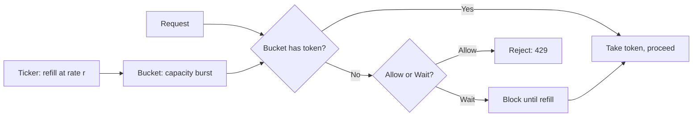
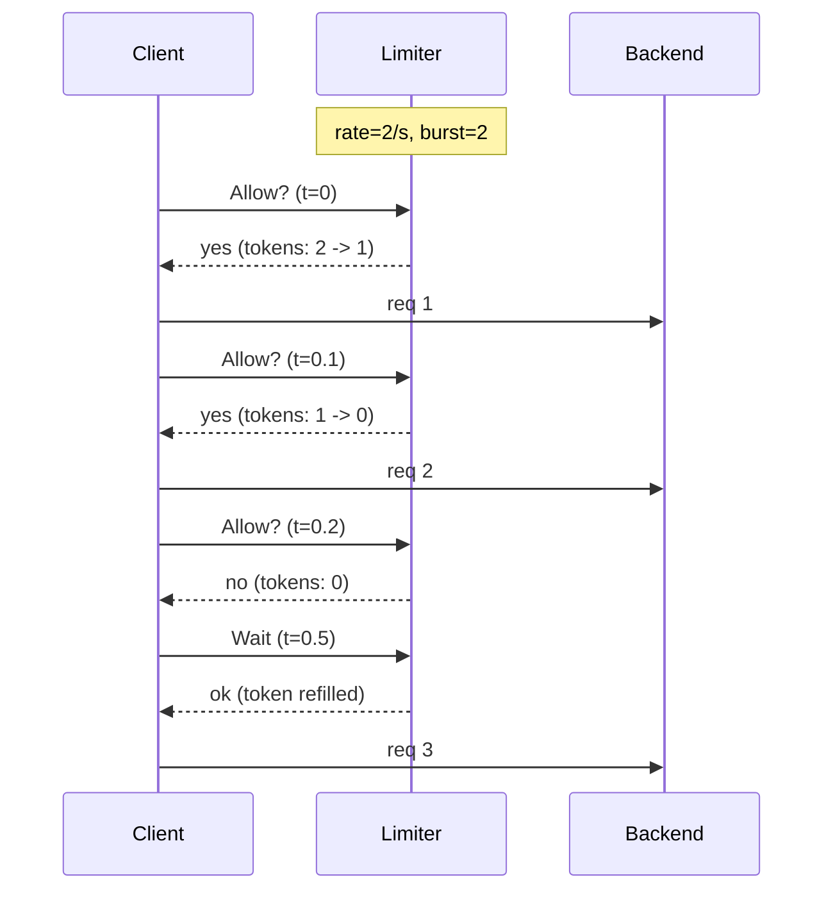
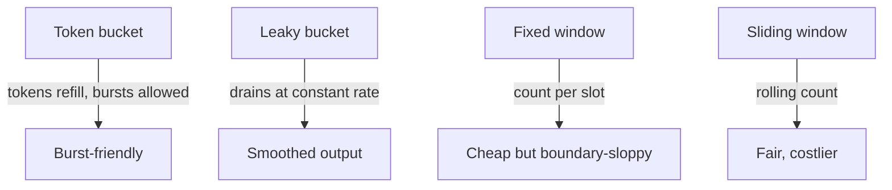

# Rate Limiter — Junior Level

## Table of Contents
1. [Introduction](#introduction)
2. [Prerequisites](#prerequisites)
3. [Glossary](#glossary)
4. [Core Concepts](#core-concepts)
5. [Real-World Analogies](#real-world-analogies)
6. [Mental Models](#mental-models)
7. [Pros & Cons](#pros-cons)
8. [Use Cases](#use-cases)
9. [Code Examples](#code-examples)
10. [Coding Patterns](#coding-patterns)
11. [Clean Code](#clean-code)
12. [Product Use / Feature](#product-use-feature)
13. [Error Handling](#error-handling)
14. [Security Considerations](#security-considerations)
15. [Performance Tips](#performance-tips)
16. [Best Practices](#best-practices)
17. [Edge Cases & Pitfalls](#edge-cases-pitfalls)
18. [Common Mistakes](#common-mistakes)
19. [Common Misconceptions](#common-misconceptions)
20. [Tricky Points](#tricky-points)
21. [Test](#test)
22. [Tricky Questions](#tricky-questions)
23. [Cheat Sheet](#cheat-sheet)
24. [Self-Assessment Checklist](#self-assessment-checklist)
25. [Summary](#summary)
26. [What You Can Build](#what-you-can-build)
27. [Further Reading](#further-reading)
28. [Related Topics](#related-topics)
29. [Diagrams & Visual Aids](#diagrams-visual-aids)

---

## Introduction
> Focus: "How do I make sure this loop only runs N times per second? Why is my `time.Tick` slowly leaking memory? What does `x/time/rate` actually do?"

A **rate limiter** is the throttle valve on a code path. It accepts a question — "may I run this operation right now?" — and returns one of three answers: yes, no, or yes-but-wait-a-bit. Underneath, it counts how many operations have run recently and compares that count to a configured rate.

In Go you meet rate limiters in two shapes. The first is a hand-built one using a buffered channel and a `time.Ticker`. The second is `golang.org/x/time/rate.Limiter`, the standard token-bucket implementation that ships with the Go project. Both are worth knowing: the channel version teaches the algorithm, and `x/time/rate` is what you actually deploy.

After reading this file you will:

- Build a working rate limiter from a channel and a ticker.
- Understand the four canonical algorithms — token bucket, leaky bucket, fixed window, sliding window.
- Know the API of `rate.Limiter`: `Allow`, `Wait`, `Reserve`, `NewLimiter`, and what `burst` means.
- Know the difference between `time.Tick` (leaks) and `time.NewTicker` (must `Stop`).
- Recognise the most common rate-limiter bugs: ticker leak, unbuffered token channel, shared limiter without synchronisation.
- Be ready to apply rate limiting to an HTTP handler, an outbound API client, and a worker pool.

You do not need to implement distributed limiting on Redis, write per-tenant hierarchies, or design custom sliding-window algorithms yet — those land in middle and senior. This file is the moment you write your first throttle.

---

## Prerequisites

- **Required:** Go 1.18+ installed. Check with `go version`.
- **Required:** Comfort with channels — sending, receiving, buffered vs unbuffered, ranging.
- **Required:** Knowing what a goroutine is and how to start one.
- **Required:** Basic `time` package familiarity: `time.Sleep`, `time.Duration`, `time.Now`.
- **Helpful:** Awareness of HTTP middleware shapes (`func(http.Handler) http.Handler`).
- **Helpful:** Seen `context.Context` once.

If you can write a `for v := range ch` loop and you understand why `time.Sleep(time.Second)` blocks for a second, you are ready.

---

## Glossary

| Term | Definition |
|------|-----------|
| **Rate limiter** | A component that admits at most *N* operations per unit of time, optionally allowing short bursts. |
| **Rate** | A target frequency, expressed as events per second (or per minute, per hour). Often written `r`. |
| **Burst** | The maximum number of operations allowed back-to-back before the limiter must wait. The bucket's capacity. |
| **Token bucket** | An algorithm: a bucket holds up to *B* tokens, refilled at rate *r*. Each operation consumes one token. If the bucket is empty, the operation waits or is rejected. |
| **Leaky bucket** | An algorithm: requests enter a queue (bucket) and leave at a constant rate, like water leaking from a hole. Bursts smooth into a steady stream. |
| **Fixed window** | An algorithm: count requests inside a fixed wall-clock window (e.g. each minute). Reset at the boundary. |
| **Sliding window** | An algorithm: count requests over a rolling window relative to *now*, smoothing the boundary jumps of fixed windows. |
| **`time.Tick(d)`** | Returns a channel that delivers ticks every `d`. **Cannot be stopped.** Garbage-collected only when the ticker is unreachable — and the ticker is reachable as long as the channel is. Source of leaks. |
| **`time.NewTicker(d)`** | Returns a `*Ticker` with `.C` (channel) and `.Stop()`. The correct primitive when the ticker has a finite lifetime. |
| **`rate.Limiter`** | Standard token-bucket limiter in `golang.org/x/time/rate`. |
| **`rate.Limit`** | A typed `float64` representing events per second. `rate.Limit(10)` means 10 ev/s. `rate.Inf` means no limit. |
| **`Allow()`** | Non-blocking check: returns `true` if a token is available, `false` otherwise. |
| **`Wait(ctx)`** | Blocks until a token is available or the context is cancelled. |
| **`Reserve()`** | Reserves a token and returns a `Reservation`. You can ask how long to wait, or cancel the reservation. |
| **Lazy fill** | The optimisation used by `rate.Limiter`: tokens are not added on a timer; the bucket is updated arithmetically each time `Allow`/`Wait` is called. |
| **Token bucket throughput** | Long-run average equals the refill rate `r`; short-run peak equals `b` over one burst. |
| **Distributed rate limiter** | A limiter whose state lives in a shared store (Redis, a database) so multiple processes share one budget. |

---

## Core Concepts

### A rate limiter answers one question: "may I go now?"

Every rate limiter, however elaborate, exposes some version of this:

```go
type Limiter interface {
    Allow() bool                            // non-blocking: yes/no
    Wait(ctx context.Context) error         // blocking: wait until yes (or ctx fires)
}
```

The implementation details — buckets, tickers, sliding windows — are different ways of computing the answer. The contract is the same.

### The simplest limiter: a buffered channel and a ticker

```go
// 10 operations per second.
limit := make(chan struct{}, 1) // bucket capacity = 1 (no burst)
go func() {
    ticker := time.NewTicker(100 * time.Millisecond)
    defer ticker.Stop()
    for range ticker.C {
        select {
        case limit <- struct{}{}:
        default: // bucket full, drop the token
        }
    }
}()

for i := 0; i < 5; i++ {
    <-limit            // wait for a token
    doWork(i)
}
```

A goroutine drips tokens into a buffered channel at the configured rate. Callers `<-limit` to consume one. If the channel is full, the producer drops the token (bucket is at capacity). If it is empty, the caller blocks.

That is a token bucket. Six lines.

### `time.Tick` vs `time.NewTicker` — the silent leak

```go
ticker := time.Tick(100 * time.Millisecond) // BAD inside a function
for range ticker {
    work()
}
```

The variable `ticker` here is a `<-chan Time`. The underlying `*Ticker` is **never stopped**, never garbage-collected as long as anything holds the channel. If you call this function repeatedly, you spawn one zombie ticker per call — and they keep firing forever, holding a runtime goroutine each.

The fix is `time.NewTicker` with a `defer t.Stop()`:

```go
t := time.NewTicker(100 * time.Millisecond)
defer t.Stop()
for range t.C {
    work()
}
```

`time.Tick` is acceptable only at package scope, for tickers that live as long as the program. Anywhere else it is a leak.

### `rate.Limiter` — the one Go actually ships

```go
import "golang.org/x/time/rate"

lim := rate.NewLimiter(rate.Limit(10), 5) // 10 ev/s sustained, burst up to 5

if lim.Allow() {
    doWork() // proceed
} else {
    rejected() // throttle: no token available
}

if err := lim.Wait(ctx); err == nil {
    doWork() // proceed after waiting (or returned ctx.Err())
}
```

This is a token bucket with **lazy fill**. The struct stores `tokens float64` and `last time.Time`. On every call it computes `tokens += elapsed * rate`, caps at `burst`, and consumes one. No background goroutine, no ticker, no garbage. This is the right default in production.

### The four algorithms

| Algorithm | One-line idea | Bursty? | Memory | Fairness |
|-----------|---------------|---------|--------|----------|
| **Token bucket** | Tokens refill at rate `r`, capacity `b`. Burst up to `b`. | Yes | O(1) | First-come first-served |
| **Leaky bucket** | Queue drains at rate `r`. Excess overflows. | Smoothed | O(b) | FIFO |
| **Fixed window** | Count requests per fixed slot (e.g. each minute). Reset at boundary. | Yes at the seam | O(1) per key | Sloppy at edges |
| **Sliding window** | Count requests in a rolling window of width `w`. | Smooth | O(w/r) or O(1) approx | Fair |

Pick token bucket for general API throttling, leaky bucket when you must smooth bursts into a steady stream (TCP-style traffic shaping), fixed window for cheap dashboards, and sliding window for fair quota enforcement.

### Burst is not "extra rate" — it is "saved-up rate"

A common confusion: `rate=10/s, burst=5` does not mean "10 sustained + 5 extra forever." It means "10 sustained, with up to 5 tokens stockpiled when idle." If callers go quiet for 500 ms, the bucket fills with 5 tokens; the next 5 calls go through instantly. After that the rate is back to one every 100 ms.

A `burst` of 1 means strict pacing — no bunching at all. A burst of 0 with the standard limiter means **nothing ever passes** (the bucket has zero capacity).

### A rate limiter is shared state

`rate.Limiter` is safe for concurrent use. The channel-based limiter is also safe (channel ops are atomic). But if you wrap a limiter in your own struct with extra fields (counters, last-hit timestamps), you must add a mutex. The pitfall is creating one limiter per request — defeats the purpose.

---

## Real-World Analogies

### Toll booth on a highway

Cars arrive in bursts (rush hour) but the booth processes them at a steady rate. Token bucket = the booth lets a few queued cars through quickly when idle (burst), then settles into a steady tempo (rate). Leaky bucket = every car takes exactly the same time, regardless of arrival pattern.

### Buffet refill

Token bucket: trays of food refilled every minute (rate). Capacity = how many trays fit on the table (burst). If you come back after an hour, you do not get 60 trays — the table is full. If you arrive when the tray is empty, you wait.

### Stadium turnstiles (fixed window)

10,000 people allowed in between 7:00 and 8:00. Once the hour starts, 10,000 can pour in any way — even all in the first minute. At 8:00 the counter resets. This is the boundary problem: 10,000 in the last minute of one hour and 10,000 in the first minute of the next gives 20,000 in two minutes, which the dashboard reports as "within limits."

### Rolling speed-camera average

Sliding window: averages your speed over the last 60 seconds. No matter when you accelerate, you cannot escape detection by waiting for the "next hour."

---

## Mental Models

### "Tokens are timestamps"

A token in a token bucket is really a permission slip with an issue time. The bucket adds one slip every `1/r` seconds, up to `b`. When you take a slip, you spend the right to do one operation. The bucket is just an accounting trick — the underlying truth is the clock.

### "The limiter is a state machine in time, not in events"

The bucket is not driven by request arrivals. It is driven by *time*. Requests merely *observe* the bucket. This is why `rate.Limiter` does not need a goroutine: it just looks at `time.Now()` and computes the answer.

### "A rate limiter is a queue you can see through"

Leaky-bucket variants make the queue visible — requests literally line up. Token-bucket variants hide the queue and expose a yes/no/wait API. Same end result, different mental shape.

### "Burst absorbs jitter; rate sets the budget"

Real traffic is never perfectly even. Burst lets a brief spike pass without rejection; rate enforces the long-run budget. Set burst around the *jitter* you tolerate, set rate around the *capacity* you can serve.

---

## Pros & Cons

### Pros
- **Protects downstreams.** Prevents one rogue caller from saturating a database, an API, or a third-party service.
- **Provides backpressure.** Rather than crashing, slow callers down.
- **Cheap.** `rate.Limiter` is a few words of memory and a few arithmetic ops per call. The channel version is a goroutine + a ticker.
- **Composable.** Per-tenant, per-route, global — layer them.
- **Predictable.** Once the algorithm is chosen, behaviour is deterministic given the rate and burst.

### Cons
- **Shared mutable state.** Limiters need to be shared across goroutines or callers, which makes lifecycle, testing, and observability harder than one-off objects.
- **Distributed rate limiting is hard.** Single-process limiters do not coordinate. Multi-instance services need Redis or similar — and that adds latency, failure modes, and clock-sync concerns.
- **Choosing rate and burst is policy, not technology.** Setting them wrong either over-restricts (lost throughput) or under-restricts (no protection).
- **Bursty algorithms can mis-fire.** Fixed-window limiters allow 2× the rate at the boundary.
- **Failure mode unclear.** When the limiter rejects, should the caller drop, retry, or queue? That decision is the caller's, not the limiter's.

---

## Use Cases

- **HTTP middleware.** "No client may exceed 100 req/s." Limit per IP, per API key, per route.
- **Outbound API clients.** Stripe, AWS, Twilio publish rate limits; your client must respect them.
- **Background workers.** A cron job that batch-imports records should pace itself, not flood the database.
- **Email/SMS sending.** Anti-spam policies require steady pacing.
- **CLI tools and scripts.** A polite scraper that respects `robots.txt` and rate-limits itself.
- **Cost guards.** OpenAI and similar billable APIs — runaway loops cost money. Rate limit the caller.
- **Login attempts.** Bound the number of password attempts per username per minute. (Security-flavoured rate limit.)

When **not** to use a rate limiter: when you actually want backpressure on a queue (use a buffered channel of bounded size), when you want concurrency limits (use `semaphore.Weighted` or a buffered "slot" channel), when the load is internal and naturally bounded by your worker pool size.

---

## Code Examples

### Channel-and-ticker token bucket

```go
package ratelimit

import "time"

// TokenBucket is a simple channel-backed rate limiter.
type TokenBucket struct {
    tokens chan struct{}
    quit   chan struct{}
}

func NewTokenBucket(ratePerSecond, burst int) *TokenBucket {
    tb := &TokenBucket{
        tokens: make(chan struct{}, burst),
        quit:   make(chan struct{}),
    }
    // Pre-fill the bucket.
    for i := 0; i < burst; i++ {
        tb.tokens <- struct{}{}
    }
    interval := time.Second / time.Duration(ratePerSecond)
    go func() {
        t := time.NewTicker(interval)
        defer t.Stop()
        for {
            select {
            case <-t.C:
                select {
                case tb.tokens <- struct{}{}:
                default: // bucket full
                }
            case <-tb.quit:
                return
            }
        }
    }()
    return tb
}

func (tb *TokenBucket) Allow() bool {
    select {
    case <-tb.tokens:
        return true
    default:
        return false
    }
}

func (tb *TokenBucket) Wait() {
    <-tb.tokens
}

func (tb *TokenBucket) Close() { close(tb.quit) }
```

The pre-fill loop is the part beginners often forget. Without it, the first `burst` calls wait one tick each, defeating the point of burst.

### Using `x/time/rate`

```go
package main

import (
    "context"
    "fmt"
    "time"

    "golang.org/x/time/rate"
)

func main() {
    lim := rate.NewLimiter(rate.Every(200*time.Millisecond), 3) // 5 ev/s, burst 3
    ctx, cancel := context.WithTimeout(context.Background(), time.Second)
    defer cancel()

    for i := 0; i < 10; i++ {
        if err := lim.Wait(ctx); err != nil {
            fmt.Println("timed out:", err)
            return
        }
        fmt.Printf("%d at %v\n", i, time.Since(time.Time{}).Truncate(time.Millisecond))
    }
}
```

First 3 calls return instantly (burst); the rest are paced 200 ms apart.

### Allow vs Wait vs Reserve

```go
// Non-blocking: drop excess immediately.
if !lim.Allow() {
    http.Error(w, "rate limited", http.StatusTooManyRequests)
    return
}

// Blocking: pace, but honour context.
if err := lim.Wait(ctx); err != nil {
    return err
}

// Reserved: ask "how long would I wait?" and decide for yourself.
r := lim.Reserve()
if !r.OK() {
    return errors.New("would exceed burst")
}
delay := r.Delay()
if delay > 50*time.Millisecond {
    r.Cancel() // give the token back
    return errors.New("too slow")
}
time.Sleep(delay)
```

### Naive `time.Tick` pacing (correct only at package scope)

```go
var tick = time.Tick(time.Second)

func everySecond() {
    for range tick { // package-scope ticker: cannot leak
        work()
    }
}
```

If `tick` were a local variable inside a function called repeatedly, this would leak one ticker per call.

### Fixed-window counter

```go
type FixedWindow struct {
    mu       sync.Mutex
    count    int
    limit    int
    window   time.Duration
    start    time.Time
}

func (fw *FixedWindow) Allow() bool {
    fw.mu.Lock()
    defer fw.mu.Unlock()
    now := time.Now()
    if now.Sub(fw.start) > fw.window {
        fw.start = now
        fw.count = 0
    }
    if fw.count >= fw.limit {
        return false
    }
    fw.count++
    return true
}
```

Simple but suffers from the boundary problem: at `t = window - epsilon`, up to `limit` requests; at `t = window + epsilon`, up to `limit` more.

### Sliding-window log

```go
type SlidingWindow struct {
    mu     sync.Mutex
    times  []time.Time
    limit  int
    window time.Duration
}

func (sw *SlidingWindow) Allow() bool {
    sw.mu.Lock()
    defer sw.mu.Unlock()
    now := time.Now()
    cutoff := now.Add(-sw.window)
    // Drop expired timestamps.
    i := 0
    for ; i < len(sw.times) && sw.times[i].Before(cutoff); i++ {
    }
    sw.times = sw.times[i:]
    if len(sw.times) >= sw.limit {
        return false
    }
    sw.times = append(sw.times, now)
    return true
}
```

Exact, but stores up to `limit` timestamps per key. For high-volume keys, prefer sliding-window-counter (covered in `middle.md`).

---

## Coding Patterns

### Pattern 1: Per-tenant limiter map

```go
type LimiterMap struct {
    mu       sync.Mutex
    limiters map[string]*rate.Limiter
    r        rate.Limit
    b        int
}

func (lm *LimiterMap) get(key string) *rate.Limiter {
    lm.mu.Lock()
    defer lm.mu.Unlock()
    l, ok := lm.limiters[key]
    if !ok {
        l = rate.NewLimiter(lm.r, lm.b)
        lm.limiters[key] = l
    }
    return l
}
```

One limiter per API key, per IP, per tenant. Eviction is the missing piece — covered in middle.

### Pattern 2: HTTP middleware

```go
func RateLimit(lim *rate.Limiter) func(http.Handler) http.Handler {
    return func(next http.Handler) http.Handler {
        return http.HandlerFunc(func(w http.ResponseWriter, r *http.Request) {
            if !lim.Allow() {
                http.Error(w, "Too Many Requests", http.StatusTooManyRequests)
                return
            }
            next.ServeHTTP(w, r)
        })
    }
}
```

### Pattern 3: Outbound API client

```go
type StripeClient struct {
    http *http.Client
    lim  *rate.Limiter
}

func (c *StripeClient) Do(ctx context.Context, req *http.Request) (*http.Response, error) {
    if err := c.lim.Wait(ctx); err != nil {
        return nil, err
    }
    return c.http.Do(req)
}
```

### Pattern 4: Pacing a `for` loop

```go
lim := rate.NewLimiter(rate.Every(100*time.Millisecond), 1)
for _, id := range ids {
    if err := lim.Wait(ctx); err != nil {
        return err
    }
    if err := process(id); err != nil {
        return err
    }
}
```

---

## Clean Code

- **Inject the limiter, do not create it inside a function.** A function that builds its own limiter cannot be rate-limited globally, cannot be tested deterministically, and leaks if the function is called repeatedly.
- **Configure rate and burst at boot.** Read them from config, log them, expose them on `/metrics`.
- **Wrap the limiter in a typed adapter.** `RateLimit("uploads")` reads better than passing `*rate.Limiter` everywhere.
- **Name limiters.** `apiClient.uploadLimiter` not `apiClient.lim`. You will end up with many.
- **Document the contract.** "This client paces requests at 10 req/s." A comment saves the next reader from grepping for `NewLimiter`.

---

## Product Use / Feature

- **API gateways.** Cloudflare, Kong, Envoy — every gateway exposes rate-limit policies. Most use token bucket under the hood.
- **Stripe.** 100 read req/s, 100 write req/s per account; their docs spell out the algorithm. Your client must respect it.
- **OpenAI.** Token-bucket rate limit on requests *and* on tokens consumed. Two limiters layered.
- **GitHub.** 5,000 req/hour authenticated, 60/hour anonymous. Plus secondary rate limits on bursts. Sliding-window flavour.
- **Login throttling.** "Five failed attempts per username per 15 minutes." Sliding-window log.
- **Cron jobs.** A nightly job that processes 1 M rows uses a limiter to pace database writes — protects production from the batch.

---

## Error Handling

- **`Wait(ctx)` returns `ctx.Err()` when the context fires.** Do not swallow it — propagate to the caller.
- **`Allow()` returns `false`, not an error.** The caller decides what "rejected" means: drop, retry-with-backoff, queue, or `429 Too Many Requests`.
- **`Reserve()` can return a reservation with `OK() == false`** when the request would exceed burst by more than the limiter can handle. Always check `OK()`.
- **The limiter never panics.** It is safe to call from any goroutine, at any rate, with any input. The error surface is small on purpose.

```go
if err := lim.Wait(ctx); err != nil {
    if errors.Is(err, context.Canceled) {
        return nil // caller gave up, not our problem
    }
    return fmt.Errorf("rate limit wait: %w", err)
}
```

---

## Security Considerations

- **Rate limiting is a baseline DoS defence.** Per-IP, per-user, per-token. It does not stop a determined attacker with a botnet, but it stops the casual one.
- **Login throttling.** Five attempts per 15 min per username — but also a global limit per IP, so a botnet cannot enumerate accounts.
- **Per-tenant isolation.** One tenant must not be able to consume the global limit. Use a hierarchy: per-tenant on top of global.
- **Information leak.** A `429` response tells the attacker their limit is per-IP/per-user/per-key. Sometimes you want this; sometimes you do not.
- **Replay protection is not rate limiting.** Rate limiters cap frequency, not authenticity. Pair them with signed timestamps.
- **The limiter itself must not be a side-channel.** If reject latency differs from accept latency by milliseconds, an attacker can probe internal state. In practice this rarely matters, but worth noting.

---

## Performance Tips

- **Prefer `x/time/rate` over channel limiters for hot paths.** No goroutine, no channel ops, no GC pressure. A `Limiter.Allow` call is a few nanoseconds.
- **Share one limiter across all callers** that share a budget. A limiter per request is a no-op.
- **Avoid `Wait` on a hot path with a tiny timeout.** `Wait` schedules a timer; under heavy load, timers compound.
- **Use `Allow` for "drop-if-busy" semantics.** Use `Wait` only when blocking is acceptable.
- **For per-tenant maps, evict idle entries.** Otherwise memory grows unboundedly. Use a TTL cache (e.g. `golang.org/x/time/rate` paired with `hashicorp/golang-lru/v2`).

---

## Best Practices

- **Default to `x/time/rate`.** Reach for a channel-based limiter only when you need shaping semantics (leaky bucket) or for teaching purposes.
- **Pick burst around the natural jitter of your workload**, not arbitrarily. Often 1× to 5× the rate.
- **Test both happy and rejected paths.** Most bugs hide in the rejection branch.
- **Log every rejection — at first.** Tune verbosity once you know normal volume.
- **Expose limiter state to `/metrics`.** Allow count, deny count, current tokens. Surface the rejection rate as an alert.
- **Document the policy.** `400 req/s burst 50` is a contract with callers; write it down.
- **Combine with `context.Context`.** Always plumb context through `Wait`.

---

## Edge Cases & Pitfalls

### The `time.Tick` leak

Already noted, worth repeating in red. `time.Tick(d)` returns a channel from a `*Ticker` you cannot reach. The ticker is **never stopped**. Use `time.NewTicker` everywhere except `init()` and `main()`.

### Shared limiter without locking — usually fine, except your wrapper

`*rate.Limiter` is concurrency-safe. But if you wrap it:

```go
type MyLimiter struct {
    lim    *rate.Limiter
    rejected int // BAD: data race
}

func (m *MyLimiter) Allow() bool {
    if !m.lim.Allow() {
        m.rejected++ // race
        return false
    }
    return true
}
```

Use `atomic.Int64` or a mutex for any counter you add.

### Pre-filling the bucket

Forgetting to pre-fill a channel-based bucket means the first `burst` requests wait one tick each. The fix is the loop in the `NewTokenBucket` example above.

### Limiter per request

Allocating a new `*rate.Limiter` inside the request handler defeats the limiter — every request gets its own bucket of `burst` tokens. Always share the limiter via a struct field or middleware closure.

### Clock skew on multi-instance systems

Two processes each running `rate.Limit(100)` admit 200 ev/s combined. If you actually want 100 ev/s across the fleet, you need a distributed limiter (Redis, see middle/senior).

### Burst = 0

`rate.NewLimiter(rate.Limit(10), 0)` admits **nothing**. The bucket has zero capacity. Always set burst ≥ 1.

### `rate.Inf` with finite burst

`rate.NewLimiter(rate.Inf, 5)` admits unlimited requests — `rate.Inf` means infinite refill speed, so the bucket is always full. Useful as a "disabled limiter" sentinel.

### Limiter created from non-deterministic config

Reading rate and burst from environment variables without validation: a typo like `RATE=ten` parses as zero and silently blocks every call.

---

## Common Mistakes

### Mistake 1: `time.Tick` inside a request handler

```go
// BAD
func handle(w http.ResponseWriter, r *http.Request) {
    tick := time.Tick(time.Second)
    <-tick
    work()
}
```

One leaked ticker per request. Memory grows forever.

### Mistake 2: A new limiter per request

```go
// BAD
func handle(w http.ResponseWriter, r *http.Request) {
    lim := rate.NewLimiter(10, 1) // useless: every request gets a fresh bucket
    if !lim.Allow() {
        ...
    }
}
```

The limiter must outlive a single request to do its job.

### Mistake 3: Confusing `rate.Limit(N)` with "N per call"

`rate.Limit(10)` is **10 events per second**. Not "10 per call," not "every 10 seconds." Use `rate.Every(d)` if you prefer the interval form.

### Mistake 4: Forgetting to `Stop` a ticker

```go
go func() {
    t := time.NewTicker(100*time.Millisecond)
    for range t.C { ... } // no defer t.Stop(); leak when the goroutine returns
}()
```

Always `defer t.Stop()` immediately after `NewTicker`.

### Mistake 5: Calling `lim.Wait(ctx)` without checking the error

```go
lim.Wait(ctx) // BAD: silently proceeds even if ctx cancelled
work()
```

If the context fires, you still do the work, defeating cancellation.

### Mistake 6: Hand-rolling a sliding window with a slice that never shrinks

```go
sw.times = append(sw.times, now) // grows forever if nothing trims
```

Trim expired entries on every check, or use a ring buffer / counter approximation.

### Mistake 7: Using `lim.Allow()` and `lim.Wait(ctx)` in the same code path expecting consistent semantics

`Allow` says "no" immediately if no token; `Wait` says "yes" after waiting. Mixing them in one handler confuses readers and metrics.

### Mistake 8: Treating the limiter as a queue

A limiter is *not* a queue. Rejected calls are dropped. If you need queueing, use a bounded channel feeding a worker pool.

---

## Common Misconceptions

- **"Token bucket and leaky bucket are the same."** They are duals, not identical. Token bucket allows bursts; leaky bucket smooths them out. Same average rate, different shape.
- **"Rate limiting prevents DoS."** It prevents *unintended* overload and slows down casual attackers. A determined botnet routes around per-IP limits.
- **"Burst is a separate budget."** No. Burst is the *maximum saved-up tokens* from idle periods. Once spent, you are back to the steady rate.
- **"A limiter at 100 req/s admits exactly 100 per second."** It admits *at most* 100 per second long-run. Short windows may see more (within burst) or less.
- **"Channel-based limiters are faster."** Usually slower. A channel op is many ns; a `rate.Limiter.Allow` is faster and allocation-free.
- **"Distributed limiting just means putting the counter in Redis."** That ignores clock skew, Redis latency, network partitions, and the cost of one Redis call per request.

---

## Tricky Points

- **`time.Ticker` does not deliver missed ticks.** If a tick is not consumed by the next tick, the channel has at most one item buffered; you lose the older ones. Do not assume one tick per `interval` if your consumer is slow.
- **`Reserve` and `Wait` interact.** A reservation already-counted-against-the-bucket; cancelling it returns the token, but only if it has not been "used" yet (`Cancel()` knows from the time you call it).
- **`rate.Limit` is a `float64`.** Fractional rates work (`rate.Limit(0.5)` = once per 2 s). Negative rates panic.
- **`burst > 0` is required for `Allow` to ever return true.** Burst 0 makes the limiter reject everything.
- **The first call to a fresh limiter is free.** The bucket starts full at `burst` tokens. Plan accordingly in tests.

---

## Test

### Verify the basic rate

```go
func TestLimiterRate(t *testing.T) {
    lim := rate.NewLimiter(rate.Every(100*time.Millisecond), 1)
    ctx := context.Background()
    start := time.Now()
    for i := 0; i < 5; i++ {
        if err := lim.Wait(ctx); err != nil {
            t.Fatal(err)
        }
    }
    elapsed := time.Since(start)
    if elapsed < 400*time.Millisecond {
        t.Errorf("ran too fast: %v", elapsed)
    }
}
```

Five calls at 100 ms each: at least 400 ms total (first is free, then four waits of 100 ms).

### Verify rejection counts

```go
func TestLimiterRejects(t *testing.T) {
    lim := rate.NewLimiter(rate.Limit(1), 1)
    allowed, rejected := 0, 0
    for i := 0; i < 10; i++ {
        if lim.Allow() {
            allowed++
        } else {
            rejected++
        }
    }
    if allowed != 1 || rejected != 9 {
        t.Errorf("got %d allowed, %d rejected; want 1/9", allowed, rejected)
    }
}
```

### Synctest for deterministic timing (Go 1.24+)

```go
//go:build go1.24

func TestLimiterDeterministic(t *testing.T) {
    synctest.Run(func() {
        lim := rate.NewLimiter(rate.Every(time.Second), 1)
        ctx := context.Background()
        for i := 0; i < 5; i++ {
            _ = lim.Wait(ctx)
        }
        // Time advances virtually; the test runs in microseconds, not seconds.
    })
}
```

### A failing race test

Run any limiter test under `go test -race`. If your wrapper has a counter without atomics, the race detector will catch it.

---

## Tricky Questions

1. **What does `time.Tick` return, and why is it a leak inside a function?**
   It returns a channel from a `*Ticker` that has no `Stop` method exposed. The ticker is unreachable but still firing — the runtime keeps it alive because the channel is reachable. Wrap with `time.NewTicker` + `defer t.Stop()` instead.

2. **What is the difference between `rate.Limit(10)` and `rate.Every(10*time.Millisecond)`?**
   `rate.Limit(10)` = 10 events/second = one every 100 ms. `rate.Every(10*time.Millisecond)` = one every 10 ms = 100 events/second. They are different rates expressed in different units.

3. **Why is a fresh `rate.Limiter` non-blocking for the first `burst` calls?**
   Because the bucket starts full. The first `burst` tokens are pre-loaded.

4. **What happens if `burst = 0`?**
   The bucket has capacity zero. `Allow()` always returns false; `Wait` blocks forever (or until ctx fires). Always use `burst ≥ 1`.

5. **You have ten worker goroutines, each holding its own `rate.Limiter(10, 1)`. What is the actual rate?**
   100 ev/s combined. Each limiter is independent. Share one limiter to enforce a global limit.

6. **Difference between token bucket and leaky bucket?**
   Token bucket allows bursts (up to capacity). Leaky bucket smooths bursts into a steady rate (the queue drains at constant speed). Same long-run rate; different short-run shape.

7. **Why is fixed-window rate limiting "sloppy" at boundaries?**
   At minute 59:59 and minute 60:01, up to `2 × limit` requests can occur in two seconds. Sliding window fixes this.

8. **Is `*rate.Limiter` safe for concurrent use?**
   Yes. All public methods are protected by an internal mutex. You may share one across many goroutines.

9. **When should you choose channel-based limiting over `rate.Limiter`?**
   When you need the queueing/shaping semantics of leaky bucket (requests literally wait in a FIFO queue), or for pedagogy. Otherwise `rate.Limiter` is faster and simpler.

10. **What is "lazy fill"?**
    The optimisation `rate.Limiter` uses: instead of a goroutine adding tokens on a timer, the bucket is updated arithmetically on each call (`tokens += elapsed * rate`). No background goroutine, no ticker. Cheaper.

---

## Cheat Sheet

```go
// 1. The standard limiter.
lim := rate.NewLimiter(rate.Limit(100), 50) // 100/s, burst 50

if lim.Allow() { /* non-blocking */ }
if err := lim.Wait(ctx); err == nil { /* blocking */ }
r := lim.Reserve(); time.Sleep(r.Delay()); /* manual */

// 2. Channel limiter (pedagogical).
tokens := make(chan struct{}, burst)
for i := 0; i < burst; i++ { tokens <- struct{}{} }
go func() {
    t := time.NewTicker(interval)
    defer t.Stop()
    for range t.C {
        select { case tokens <- struct{}{}: default: }
    }
}()

// 3. Per-tenant.
limMap := map[string]*rate.Limiter{}
var mu sync.Mutex
get := func(k string) *rate.Limiter { ... }

// 4. HTTP middleware.
func RL(lim *rate.Limiter) func(http.Handler) http.Handler {
    return func(next http.Handler) http.Handler { ... }
}

// 5. NEVER use time.Tick inside a function.
// 6. ALWAYS defer t.Stop() after time.NewTicker.
// 7. burst >= 1.
```

---

## Self-Assessment Checklist

- [ ] I can write a token-bucket limiter using a buffered channel and a ticker, with `Stop` correctly deferred.
- [ ] I know why `time.Tick` is unsafe inside a function.
- [ ] I can use `rate.NewLimiter`, `Allow`, `Wait`, and `Reserve` correctly.
- [ ] I understand what burst means and what `burst = 0` does.
- [ ] I can name the four algorithms and explain when each fits.
- [ ] I would never allocate a new limiter per request.
- [ ] I plumb `context.Context` through `Wait` and check the error.
- [ ] I would add per-tenant limiting via a map keyed by tenant ID.
- [ ] I understand that `rate.Limiter` is concurrency-safe but any wrapper counters need atomics.
- [ ] I can identify the fixed-window boundary problem.

---

## Summary

A rate limiter is a yes/no/wait gate that caps how often something runs. The channel-and-ticker version is a few lines and is excellent for learning. In production, reach for `golang.org/x/time/rate.Limiter` — it uses lazy fill, has no goroutine, and is fast.

There are four canonical algorithms: token bucket (bursty, simple, default), leaky bucket (smooth, FIFO), fixed window (cheap, boundary-sloppy), sliding window (fair, more expensive). For HTTP, wrap a shared limiter in middleware; for outbound clients, embed it in the client; for per-tenant policies, keep a `map[key]*rate.Limiter` with eviction.

The mistakes are stable: `time.Tick` leaking, fresh limiter per request, burst = 0, missing `defer t.Stop()`, unsynchronised counters in wrappers. Avoid those and you have a tool that protects every downstream you depend on.

---

## What You Can Build

- An HTTP middleware that limits each API key to 100 req/s.
- A polite web scraper that paces itself.
- A worker pool that drains a queue at exactly N items per second.
- A Stripe (or any third-party API) client that respects the published rate limit.
- A login throttle that caps password attempts per username per 15 minutes.
- A CLI tool flag `--rate 10/s` that wraps an arbitrary operation in a limiter.

---

## Further Reading

- `golang.org/x/time/rate` — package docs.
- *Concurrency in Go*, Katherine Cox-Buday, O'Reilly. Channel-based throttles.
- Stripe Engineering blog: "Scaling your API with rate limiters."
- Cloudflare blog: "How we built rate limiting capable of scaling to millions of domains."
- Redis docs on `INCR` with expiry — the canonical distributed counter pattern.
- `redis_rate` (go-redis/redis_rate) — a production-ready distributed limiter.

---

## Related Topics

- **`x/sync/semaphore`** — concurrency limits, the cousin of rate limits.
- **Bounded queues** — when you want backpressure rather than rejection.
- **Circuit breakers** — when you want to *stop* calling a failing dependency, not slow down.
- **HTTP `429 Too Many Requests`** — the right status code to return on rejection.
- **`Retry-After` header** — tells callers how long to wait before retrying.
- **Context cancellation** — `Wait(ctx)` ties rate limiting to request lifecycle.

---

## Diagrams & Visual Aids






