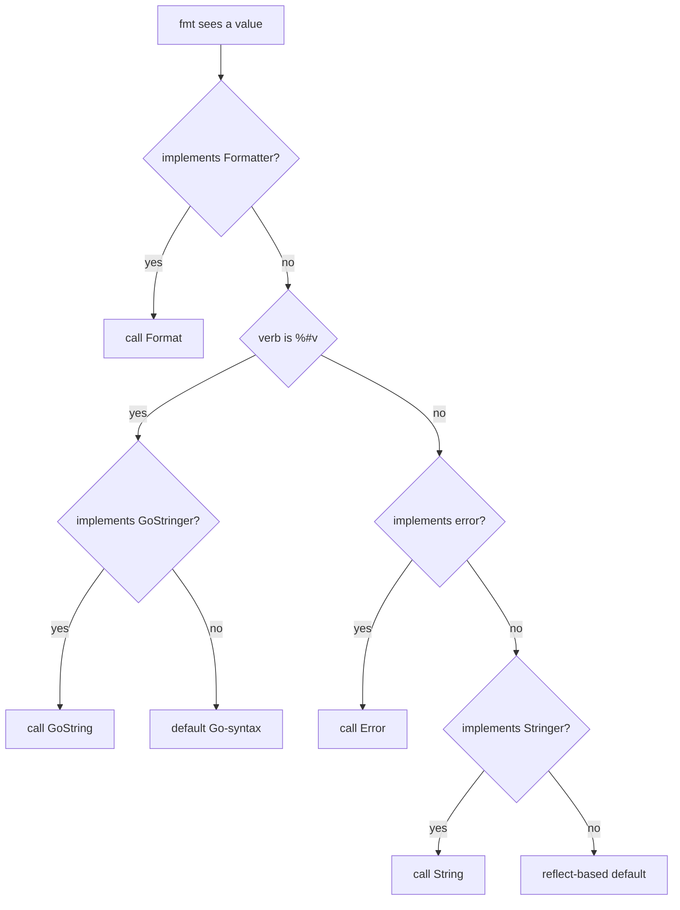

# Go fmt — Middle Level

## 1. Introduction

At the middle level, `fmt` is a tool you use deliberately: formatting
goes through `Sprintf` only when the cost is acceptable; error
wrapping uses `%w` (never `%v`); structured logs go to `slog`; and
you read a format string at a glance.

This leaf covers the patterns that distinguish day-one users from
people who own production code: choosing between `Sprintf` and
`strings.Builder`, designing custom error chains, formatting tabular
data with `text/tabwriter`, and recognising when `slog`, `strconv`,
or hand-rolled bytes belong instead of `fmt`.

---

## 2. Prerequisites

- Junior-level `fmt` content.
- `io.Writer`, `bytes.Buffer`, `strings.Builder`.
- Go errors (`errors.Is`, `errors.As`, `errors.Unwrap`).
- Reading-level acquaintance with [`slog`](../07-slog/) and
  [`strconv`](https://pkg.go.dev/strconv).

---

## 3. Glossary

| Term | Definition |
|------|-----------|
| Wrapping | Embedding an error so `errors.Is/As` walks the chain |
| Sentinel | A package-level error compared with `errors.Is` |
| Format directive | `%[flags][width][.precision]<verb>` |
| Indexed argument | `%[N]v` — refer to the Nth argument |
| Stringer | Method `String() string`; called by `%s` and `%v` |
| Tabwriter | `text/tabwriter` aligns `\t`-separated columns |
| pp | `fmt`'s internal printer state, pooled in `sync.Pool` |

---

## 4. Core Concepts

### 4.1 The Verb Table You Need by Heart

| Verb | Type | Notes |
|------|------|-------|
| `%v` | any | Default; uses `String()` if defined |
| `%+v` | struct | Adds field names |
| `%#v` | any | Go-syntax; uses `GoString()` if defined |
| `%T` | any | Type, e.g. `*main.User` |
| `%d` | int | Decimal |
| `%b` `%o` `%x` `%X` | int | Binary / octal / hex (lower / upper) |
| `%c` `%U` | rune | Character / `U+1234` |
| `%f` `%e` `%g` | float | Decimal / scientific / auto |
| `%s` `%q` | string | Plain / Go-quoted |
| `%p` | pointer / slice / map / chan / func | `0xAddress` |
| `%t` | bool | `true` / `false` |
| `%w` | error | **Errorf-only** — wrap |

### 4.2 Width, Precision, Flags

```
% [flags] [width] [.precision] [argument index] verb
```

Flags: `-` left-align, `+` always sign, `#` alternate form (`0x`),
`0` zero-pad, ` ` space for sign.

```go
fmt.Printf("%+d %+d\n", 5, -5)    // +5 -5
fmt.Printf("%#x %#o\n", 255, 8)   // 0xff 010
fmt.Printf("%5d|%-5d|\n", 42, 42) //    42|42   |
fmt.Printf("%6.2f\n", 3.14)       //   3.14
```

### 4.3 Indexed Arguments

`%[N]verb` references the Nth argument. After an explicit `[N]`,
the next non-indexed verb refers to argument `N+1`.

```go
fmt.Printf("%[1]d in hex is %[1]x\n", 255) // 255 in hex is ff
```

### 4.4 Sprintf vs strings.Builder vs strconv

```go
// One-shot, readable, allocates.
key := fmt.Sprintf("u:%d:%s", id, kind)

// Hot loop, low allocations.
var b strings.Builder
b.Grow(32)
b.WriteString("u:")
b.WriteString(strconv.Itoa(id))
b.WriteByte(':')
b.WriteString(kind)
key := b.String()

// Single conversion, fastest.
s := strconv.Itoa(id)
```

Rule of thumb: until profiling says otherwise, use `Sprintf`. When a
benchmark shows it in the top, switch to `Builder` + `strconv`.

### 4.5 Errorf and the %w Verb

```go
return fmt.Errorf("load %s: %w", path, err)
```

Why this matters:

- `errors.Is(returned, os.ErrNotExist)` walks the chain.
- `errors.As(returned, &netErr)` finds `*net.OpError` within.
- The string includes both messages, separated by `: `.

Multiple `%w` (Go 1.20+):
```go
return fmt.Errorf("step: %w; cleanup: %w", primary, cleanup)
// errors.Is matches either.
```

Without `%w`, the wrapped error is just text — `errors.Is` cannot
see it.

### 4.6 Fprint into an io.Writer

```go
fmt.Fprintf(w, "Hello, %s\n", user)               // HTTP
fmt.Fprintf(logFile, "[%s] %s\n", ts, msg)        // file
var buf bytes.Buffer
fmt.Fprintf(&buf, "page %d of %d", n, total)      // buffer
```

### 4.7 The Stringer Interface (Preview)

Any type with `String() string` is automatically formatted by `%v`
and `%s`:

```go
type Direction int
const (North Direction = iota; East; South; West)

func (d Direction) String() string {
    return [...]string{"N", "E", "S", "W"}[d]
}

fmt.Println(North) // N
```

Senior-level material covers `Stringer`, `GoStringer`, and
`Formatter` in depth.

### 4.8 When NOT to Use fmt

| Situation | Use instead |
|-----------|-------------|
| Long-running service logs | [`slog`](../07-slog/) |
| Building a large string | `strings.Builder` |
| Single int → string | `strconv.Itoa` |
| Single float → string | `strconv.FormatFloat` |
| Building bytes | `bytes.Buffer` or `append` |
| User-facing translations | `golang.org/x/text/message` |
| Tabular CLI output | `text/tabwriter` |
| Pretty-printing structs | `encoding/json` with `MarshalIndent` |

`fmt` is the right answer for one-shot formatting and `Stringer`
support; the wrong answer for hot paths and structured logs.

### 4.9 Tabular Output with text/tabwriter

```go
w := tabwriter.NewWriter(os.Stdout, 0, 0, 2, ' ', 0)
fmt.Fprintln(w, "name\tqty\tcost")
fmt.Fprintln(w, "apple\t3\t$0.50")
fmt.Fprintln(w, "watermelon\t1\t$4.00")
w.Flush()
// name        qty  cost
// apple       3    $0.50
// watermelon  1    $4.00
```

`tabwriter` aligns `\t`-separated columns. Use it instead of
hand-tuned widths for variable-length data.

### 4.10 Scan and Sscan

```go
fmt.Scan(&name, &age)                                  // stdin
fmt.Sscan("Ada 36", &name, &age)                       // string
fmt.Sscanf("name=Ada age=36", "name=%s age=%d", &n, &a) // formatted
fmt.Fscan(r, &name, &age)                              // io.Reader
```

Whitespace separates tokens. For non-trivial input, reach for
`bufio.Scanner` or `encoding/json`.

### 4.11 Print Spacing Rules in Detail

`Print(a, b)` adds a space only if neither is a string; `Println`
always adds a space.

```go
fmt.Print("a", "b")  // ab
fmt.Print(1, 2)      // 1 2
fmt.Print("a", 1)    // a1   (one is a string — no space)
fmt.Println("a", 1)  // a 1
```

### 4.12 The String/Error Promotion Rule

When `fmt` formats a value it checks, in order:

1. `Formatter` — use it.
2. (`%#v` only) `GoStringer` — use it.
3. `error` — use `Error()`.
4. `Stringer` — use `String()`.
5. Otherwise reflection.

`error` is checked **before** `Stringer`, so a type implementing
both uses `Error()` for `%s`/`%v`.

---

## 5. Real-World Analogies

**Tax form.** The format string is the printed text; verbs are
boxes; width and precision size the boxes. `%w` is "see schedule
attached" — the wrapped error is the schedule that auditors
(`errors.Is`) walk.

**Receipt printer.** `Println` is the kitchen ticket: quick and
unstructured. `slog` is the structured POS log: known fields,
queryable. Match the tool to the consumer.

---

## 6. Mental Models

```
fmt.Errorf("read %s: %w", path, ioErr)
        │     │     │
        │     │     └── %w wraps ioErr (only in Errorf)
        │     └── %s prints path
        └── format string
```

`%w` does two things: formats the inner error like `%v` and links it
via `Unwrap` so `errors.Is/As` walk the chain.

```
errors.Is(err, fs.ErrPermission) → walks Unwrap chain
```

---

## 7. Pros & Cons of fmt at Middle Scale

### Pros

- The verb table is stable and well documented.
- `%w` makes wrapping a one-liner.
- `Sprintf` builds keys, paths, and SQL fragments quickly.
- `Fprintf` works with anything that implements `io.Writer`.

### Cons

- Allocates per call; bad in tight loops.
- Format strings are checked only by `vet`.
- Reflection-based; type errors surface at runtime as `%!d(...)`.
- For multiline structured data, `text/template` or `slog` is cleaner.

---

## 8. Use Cases

1. Wrapping errors in a service layer.
2. Building cache keys and Redis keys.
3. Producing CLI tables with `tabwriter`.
4. Writing HTTP handler responses for small sites.
5. Generating SQL fragments (without user input).
6. Pretty-printing config dumps with `%+v`.
7. Producing fixture strings in tests.
8. Implementing `String()` methods.
9. Hex dumping bytes with `%x`.

---

## 9. Code Examples (Worked Examples)

### Example 1 — Layered error wrapping

```go
type AppError struct{ Op string; Err error }

func (e *AppError) Error() string { return fmt.Sprintf("%s: %v", e.Op, e.Err) }
func (e *AppError) Unwrap() error { return e.Err }

func loadUser(id int) error {
    _, err := os.Open(fmt.Sprintf("users/%d.json", id))
    if err != nil {
        return &AppError{Op: "loadUser", Err: fmt.Errorf("open: %w", err)}
    }
    return nil
}

err := loadUser(42)
fmt.Println(err)                              // loadUser: open: open users/42.json: no such file or directory
fmt.Println(errors.Is(err, os.ErrNotExist))   // true
```

The `%w` inside both layers preserves the chain.

### Example 2 — Sprintf vs Builder benchmark

```go
func BenchmarkSprintf(b *testing.B) {
    for i := 0; i < b.N; i++ {
        _ = fmt.Sprintf("u:%d:%s", i, "profile")
    }
}

func BenchmarkBuilder(b *testing.B) {
    for i := 0; i < b.N; i++ {
        var sb strings.Builder
        sb.Grow(20)
        sb.WriteString("u:")
        sb.WriteString(strconv.Itoa(i))
        sb.WriteString(":profile")
        _ = sb.String()
    }
}
```

Typical Go 1.22 / amd64:
```
BenchmarkSprintf-8   18000000   65 ns/op   24 B/op   2 allocs/op
BenchmarkBuilder-8   60000000   17 ns/op    8 B/op   1 allocs/op
```

`Builder` wins by ~4x. Use `Sprintf` for clarity, `Builder` when the
bench says so.

### Example 3 — Custom Stringer

```go
type Money struct {
    Cents int64
    Code  string
}

func (m Money) String() string {
    return fmt.Sprintf("%d.%02d %s", m.Cents/100, m.Cents%100, m.Code)
}

m := Money{Cents: 1234, Code: "USD"}
fmt.Println(m)         // 12.34 USD
fmt.Printf("%+v\n", m) // 12.34 USD  (Stringer wins over %+v)
fmt.Printf("%#v\n", m) // main.Money{Cents:1234, Code:"USD"}
```

Only `%#v` bypasses `Stringer` (it prefers `GoStringer`).

### Example 4 — Fprintf to http.ResponseWriter

```go
func health(w http.ResponseWriter, r *http.Request) {
    w.Header().Set("Content-Type", "text/plain; charset=utf-8")
    fmt.Fprintf(w, "ok %s %d\n", r.Method, r.ContentLength)
}
```

### Example 5 — Hex dump and Sscanf

```go
b := []byte{0xde, 0xad, 0xbe, 0xef}
fmt.Printf("%x\n", b)   // deadbeef
fmt.Printf("% x\n", b)  // de ad be ef
fmt.Printf("%#x\n", b)  // 0xdeadbeef

var id int
var ip string
fmt.Sscanf("user=42 ip=10.0.0.1", "user=%d ip=%s", &id, &ip)
// id=42, ip=10.0.0.1
```

`Sscanf` is fragile for variable input — use a real parser when the
shape is not fixed.

---

## 10. Coding Patterns

```go
// Pattern 1 — Wrap-then-check
return fmt.Errorf("step %d: %w", n, err)
// caller
if errors.Is(retErr, sentinel) { ... }

// Pattern 2 — Builder for keys in hot loops
func userKey(id int, kind string) string {
    var b strings.Builder
    b.Grow(8 + len(kind))
    b.WriteString("u:")
    b.WriteString(strconv.Itoa(id))
    b.WriteByte(':')
    b.WriteString(kind)
    return b.String()
}

// Pattern 3 — Indexed args for translations
fmt.Printf("user %[1]s logged in (id=%[2]d)\n", "ada", 7)

// Pattern 4 — Fprintln for log lines
fmt.Fprintf(os.Stderr, "[%s] %s: %v\n",
    time.Now().Format(time.RFC3339), op, err)

// Pattern 5 — Sprintf for SQL placeholders
placeholders := make([]string, len(ids))
for i := range ids {
    placeholders[i] = fmt.Sprintf("$%d", i+1)
}

// Pattern 6 — Stringer for enums
type Status int
const (StatusPending Status = iota; StatusRunning; StatusDone)

func (s Status) String() string {
    switch s {
    case StatusPending: return "pending"
    case StatusRunning: return "running"
    case StatusDone:    return "done"
    }
    return fmt.Sprintf("Status(%d)", int(s))
}
```

---

## 11. Clean Code Guidelines

1. Wrap with `%w` whenever the caller might use `errors.Is/As`.
2. Keep format strings as constants; never build them at runtime.
3. Use `%v` for one-off debugging; pick a specific verb for
   user-visible output.
4. Implement `String()` once per type instead of repeating `Sprintf`.
5. Run `go vet` in CI; treat its `printf` warnings as errors.

```go
// Good
const tmpl = "user=%d action=%s"
return fmt.Errorf(tmpl+": %w", id, action, err)

// Bad — dynamic format string
tmpl := "user=" + actionName + "=%d"
fmt.Errorf(tmpl, id)
```

---

## 12. Product Use / Feature Example

A request logger middleware using `fmt`. Production code would use
`slog`; this is a clean illustration:

```go
type lwriter struct {
    http.ResponseWriter
    status int
    bytes  int
}

func (w *lwriter) WriteHeader(c int) { w.status = c; w.ResponseWriter.WriteHeader(c) }
func (w *lwriter) Write(b []byte) (int, error) {
    n, err := w.ResponseWriter.Write(b)
    w.bytes += n
    return n, err
}

func logger(out io.Writer, h http.Handler) http.Handler {
    return http.HandlerFunc(func(w http.ResponseWriter, r *http.Request) {
        lw := &lwriter{ResponseWriter: w, status: 200}
        start := time.Now()
        h.ServeHTTP(lw, r)
        fmt.Fprintf(out, "%s %d %dB %v %s %s\n",
            r.Method, lw.status, lw.bytes,
            time.Since(start).Round(time.Microsecond),
            r.RemoteAddr, r.URL.Path)
    })
}
```

For real services, swap the `Fprintf` for `slog.Info`.

---

## 13. Error Handling

### 13.1 Wrapping vs Stringing

```go
return fmt.Errorf("load: %v", err) // text only — errors.Is can't see cause
return fmt.Errorf("load: %w", err) // wrapped — errors.Is walks chain
```

### 13.2 Multiple %w (Go 1.20+)

```go
return fmt.Errorf("step: %w; cleanup: %w", err1, err2)
// errors.Is matches either chain.
```

### 13.3 Custom errors with Format

A type implementing both `error` and `fmt.Formatter` controls its
own representation:

```go
type Q struct{ Op, Key string; Err error }

func (q *Q) Error() string  { return q.Op + " " + q.Key + ": " + q.Err.Error() }
func (q *Q) Unwrap() error  { return q.Err }
func (q *Q) Format(s fmt.State, verb rune) {
    switch verb {
    case 'v':
        if s.Flag('+') {
            fmt.Fprintf(s, "%s %s\n  caused by: %+v", q.Op, q.Key, q.Err)
            return
        }
        fmt.Fprint(s, q.Error())
    case 's':
        fmt.Fprint(s, q.Error())
    case 'q':
        fmt.Fprintf(s, "%q", q.Error())
    }
}
```

`pkg/errors` and `cockroachdb/errors` use this pattern for stack
traces under `%+v`.

---

## 14. Security Considerations

1. **Format strings must be constants.** A user-controlled format
   string is a verb-injection bug. `staticcheck SA1006` catches
   `fmt.Printf(userInput)`.
2. **Avoid printing whole structs that contain secrets.** Implement
   a redacting `String()`:
   ```go
   func (c Credentials) String() string {
       return fmt.Sprintf("Credentials{User:%q, Pass:[redacted]}", c.User)
   }
   ```
3. **Don't build SQL with `Sprintf`** — use parameterised queries.
4. **Don't use `fmt.Sscanf` on attacker input** — its parsing rules
   are surprising; use `encoding/json` or a real parser.

---

## 15. Performance Tips

1. `Sprintf` allocates ~2 allocs per call. Invisible at 1k/s,
   top hotspot at 1M/s.
2. `Println` allocates an `[]any` for the variadic args.
3. `Builder` plus `strconv` is the fastest portable option.
4. `bytes.Buffer` is fine for `[]byte` building.
5. The `fmt` package pools its printer state (`pp`) in `sync.Pool`;
   reuse is automatic.

---

## 16. Metrics & Analytics

- `pprof` heap: `fmt.Sprintf` over 5% of allocations is a signal to
  switch hot paths to `Builder` + `strconv`.
- `pprof` cpu: `fmt.(*pp).doPrintf` near the top suggests the same.
- For service logs, `slog`'s zero-alloc `JSONHandler` outperforms
  `Printf` lines by a wide margin.

---

## 17. Best Practices

1. Use `%w` for wrapping — never `%v` for that purpose.
2. Keep format strings constant; let `vet` check them.
3. Use `Println` for human output, `Errorf` for errors, `Sprintf`
   for IDs and keys.
4. Prefer `slog` over `Printf` in long-running services.
5. Implement `String()` for types you print or log frequently.
6. Use `text/tabwriter` for variable-width columns.
7. Profile before micro-optimising; only switch to
   `Builder`/`strconv` if it shows up.

---

## 18. Edge Cases & Pitfalls

### Pitfall 1 — Stringer Recursion

```go
type T struct{ X int }
func (t T) String() string { return fmt.Sprintf("%v", t) } // infinite!
```

`%v` re-enters `String()`. Hand-build instead:

```go
func (t T) String() string { return fmt.Sprintf("T{X:%d}", t.X) }
```

### Pitfall 2 — Pointer Receiver vs Value

```go
type T struct{ X int }
func (t *T) String() string { return "T!" }

var t T
fmt.Println(t)  // {0}      — value, no String() called
fmt.Println(&t) // T!       — pointer, String() called
```

Define on the value receiver if you want both to work.

### Pitfall 3 — %w in Sprintf

```go
s := fmt.Sprintf("err: %w", err) // "err: %!w(...)"
```

Use `%v` in `Sprintf`; `%w` only in `Errorf`.

### Pitfall 4 — Width on Strings

```go
fmt.Printf("%5s|\n", "hi")     //    hi|
fmt.Printf("%.3s|\n", "hello") // hel|  (precision = max width)
```

Precision on a string truncates.

### Pitfall 5 — %v on nil interface

```go
var e error
fmt.Printf("%v\n", e) // <nil>
```

To detect a real error, use `if err != nil` first.

### Pitfall 6 — Print spacing rules

```go
fmt.Print("a", 1, "b") // a1b — strings bracket the int
fmt.Print(1, 2)        // 1 2 — both non-strings; space inserted
```

---

## 19. Common Mistakes

| Mistake | Fix |
|---------|-----|
| `fmt.Errorf("...: %v", err)` for wrapping | Use `%w` |
| Building format strings at runtime | Keep them constant |
| `Sprintf("%d", x)` in tight loop | `strconv.Itoa(x)` |
| `Println` for service logs | `slog.Info` |
| Pointer-receiver `String()` then printing the value | Use value receiver |
| `Sprintf("%w", err)` | Use `Errorf` |

---

## 20. Common Misconceptions

**"`%v` always calls `String()`."** It calls `String()` only on
values whose type implements `Stringer`. For `%+v` of a struct,
field values still go through their own formatting rules.

**"`%w` makes wrapping invisible."** `%w` formats the inner error
like `%v` AND makes `errors.Is/As` walk it. Same text — different
unwrap chain.

**"`Sprintf` is the canonical int → string."** `strconv.Itoa(n)` is
canonical, faster, and zero-alloc for small ints.

**"`Println` is faster than `Printf`."** `Println` reflects every
argument and adds spacing; benchmarks usually find it on par or
slower than `Printf("...\n")` with a fixed format.

**"Width/precision do nothing on strings."** Width pads; precision
truncates.

---

## 21. Tricky Points

1. Interface order: `Formatter` → `error` → `Stringer`. `error`
   beats `Stringer`.
2. `%v` of a struct uses `String()` if defined, even when fields are
   also Stringers.
3. `%[N]v` reuses an argument; the next non-indexed verb continues
   from `N+1`.
4. `%w` only inside `Errorf`; elsewhere falls back to `%!w`.
5. `%T` on `nil` prints `<nil>`; on a typed nil it prints the type.

---

## 22. Test

```go
func TestErrorChain(t *testing.T) {
    inner := fs.ErrNotExist
    outer := fmt.Errorf("load: %w", inner)
    if !errors.Is(outer, fs.ErrNotExist) {
        t.Fatal("expected chain to contain fs.ErrNotExist")
    }
    if !strings.Contains(outer.Error(), "load: ") {
        t.Fatal("expected prefix")
    }
}

type customError struct{}
func (customError) Error() string  { return "boom" }
func (customError) String() string { return "stringer" }

func TestStringerVsErrorf(t *testing.T) {
    // error wins over Stringer
    if s := fmt.Sprintf("v=%v", customError{}); s != "v=boom" {
        t.Fatalf("got %q", s)
    }
}
```

---

## 23. Tricky Questions

**Q1**: A type implements both `Stringer` and `error`. Which method
does `%v` call?
**A**: `Error()`. `error` beats `Stringer`.

**Q2**: What does `fmt.Printf("%[2]d %[1]s\n", "x", 7)` print?
**A**: `7 x` — indexed args reorder.

**Q3**: After `fmt.Errorf("x: %w; y: %w", a, b)`, does
`errors.Is(err, a)` return true? `errors.Is(err, b)`?
**A**: Both true (Go 1.20+).

---

## 24. Cheat Sheet

```go
fmt.Errorf("op: %w", err)            // wrap
fmt.Printf("%+v\n", obj)             // fields named
fmt.Printf("%#v\n", obj)             // Go syntax
fmt.Printf("%[1]s = %[1]q\n", s)     // indexed
fmt.Printf("%-10s %5.2f\n", n, v)    // width / precision
fmt.Printf("% x\n", b)               // hex dump
key := fmt.Sprintf("u:%d:%s", id, kind)

// Hot loop?
var sb strings.Builder
sb.WriteString("u:")
sb.WriteString(strconv.Itoa(id))
key := sb.String()
```

---

## 25. Self-Assessment Checklist

- [ ] I know all the verbs in the table.
- [ ] I use `%w` only inside `Errorf`.
- [ ] I keep format strings constant.
- [ ] I implement `String()` on types I log frequently.
- [ ] I know when to swap `Sprintf` for `Builder` + `strconv`.
- [ ] I recognise the cases where `slog` beats `Printf`.
- [ ] I know the order: `Formatter` → `error` → `Stringer`.
- [ ] I run `go vet` and read its `printf` warnings.

---

## 26. Summary

At the middle level you treat `fmt` as a tool with sharp edges:
fluent for one-shot formatting, costly in hot paths, perfect for
error wrapping, mediocre for structured logs. You wrap with `%w`,
keep format strings constant, lean on `Stringer`, and reach for
`slog`, `strconv`, or `Builder` when the situation calls for it.

---

## 27. What You Can Build

- A logging middleware with `Fprintf`.
- A CLI tool with aligned columns via `tabwriter`.
- An error type with `Format` for stack traces.
- A small DSL parser using `Sscanf` (for fixed input).
- A REPL where `Print` and `Println` build the loop.
- A health-check handler with `Fprintf(w, ...)`.

---

## 28. Further Reading

- [pkg.go.dev/fmt](https://pkg.go.dev/fmt) — full docs.
- [Working with Errors in Go 1.13](https://go.dev/blog/go1.13-errors) —
  original `%w` writeup.
- [staticcheck SA1006 / SA9006](https://staticcheck.dev/docs/checks/) —
  printf-style checks.
- [`text/tabwriter`](https://pkg.go.dev/text/tabwriter).

---

## 29. Related Topics

- 8.7 `log/slog` — structured logging.
- 5.4 `fmt.Errorf` — focused deep dive on `%w`.
- 8.1 `io` and file handling — every `Fprintf` writes to a writer.
- 8.16 `sort/slices/maps` — companion ergonomic stdlib helpers.

---

## 30. Diagrams & Visual Aids

### Verb dispatch with interfaces



### Wrapping chain

```
fmt.Errorf("a: %w", fmt.Errorf("b: %w", io.EOF))

err.Error() → "a: b: EOF"
Unwrap chain: err → inner1 → inner2 (= io.EOF)
errors.Is(err, io.EOF) → true
```
