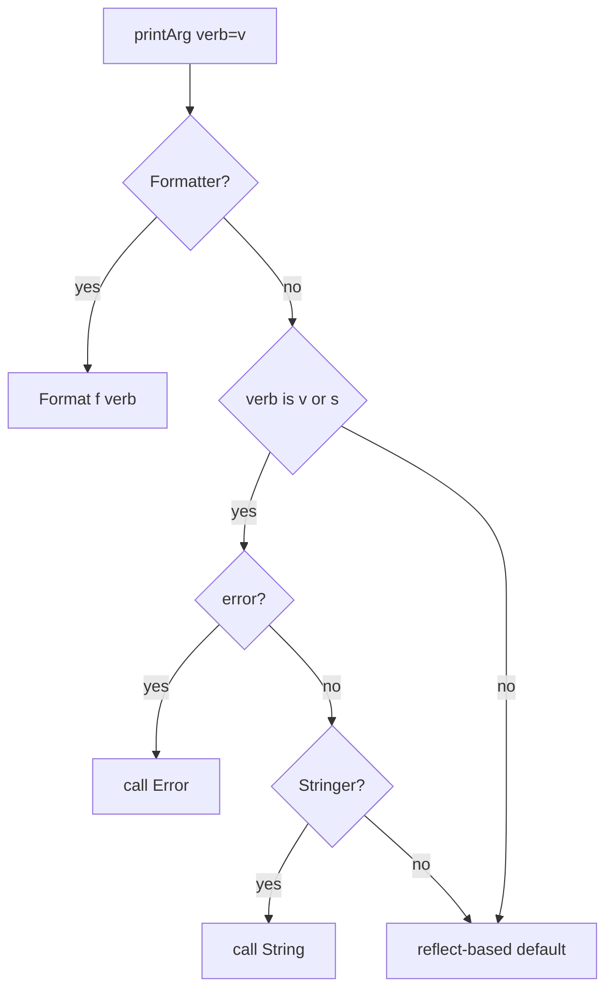

# Go fmt — Senior Level

## 1. Overview

Senior-level mastery of `fmt` means precise understanding of the
three customisation interfaces (`Stringer`, `GoStringer`,
`Formatter`), the dispatch order in `src/fmt/print.go`, the cost of
reflection-based fallback, the `pp` printer-state pool that
amortises that cost, and the rules `vet`'s `printf` analyzer applies.

This level is what distinguishes someone who uses `fmt` from someone
who designs types that `fmt` formats correctly under every verb,
including the edge cases that bite in code review.

---

## 2. The Three Customisation Interfaces

### 2.1 Stringer

```go
type Stringer interface { String() string }
```

Used by `%s` and `%v`. Half the stdlib implements it: `time.Time`,
`time.Duration`, `net.IP`, `bytes.Buffer`, `*os.File`, `time.Weekday`.

```go
type Color int
const (Red Color = iota; Green; Blue)

func (c Color) String() string {
    return [...]string{"Red", "Green", "Blue"}[c]
}
```

### 2.2 GoStringer

```go
type GoStringer interface { GoString() string }
```

Called by `%#v`. Should return Go syntax that recreates the value.

```go
type ID [16]byte
func (id ID) GoString() string { return fmt.Sprintf("ID{%#x}", id[:]) }
```

### 2.3 Formatter

```go
type Formatter interface { Format(f State, verb rune) }
```

`Formatter` overrides everything: when implemented, neither
`String()` nor `GoString()` is consulted. `State` embeds `io.Writer`
plus `Width()`, `Precision()`, `Flag(c int)`.

```go
type Q struct{ Op, Key string; Err error }

func (q *Q) Format(f fmt.State, verb rune) {
    switch verb {
    case 'v':
        if f.Flag('+') {
            fmt.Fprintf(f, "%s %s\n  caused by: %+v", q.Op, q.Key, q.Err)
            return
        }
        fallthrough
    case 's':
        fmt.Fprintf(f, "%s %s: %v", q.Op, q.Key, q.Err)
    case 'q':
        fmt.Fprintf(f, "%q", fmt.Sprintf("%s %s: %v", q.Op, q.Key, q.Err))
    }
}
```

`fmt.Fprintf(f, ...)` writes through the `State`. Never call
`fmt.Sprintf("%v", q)` inside `Format` — it re-enters and recurses.

### 2.4 Dispatch Order

Inside `printArg`/`printValue` (`src/fmt/print.go`):

1. `Formatter` → call `Format(f, verb)`.
2. Verb `v`/`s` and value implements `error` → use `Error()`.
3. Verb `v`/`s` and value implements `Stringer` → use `String()`.
4. Verb `#v` and value implements `GoStringer` → use `GoString()`.
5. Otherwise reflection-based default formatting.

Two consequences: `error` is checked **before** `Stringer`;
`Formatter` overrides everything, including `error`.

---

## 3. Stringer Recursion Trap

```go
type T struct{ X int }
func (t T) String() string {
    return fmt.Sprintf("%v", t) // ← infinite recursion
}
```

Fix with explicit fields, or the alias trick (a local type that
does not inherit the `String()` method):

```go
func (t T) String() string { return fmt.Sprintf("T{X:%d}", t.X) }
// or
func (t T) String() string {
    type alias T
    return fmt.Sprintf("%+v", alias(t))
}
```

---

## 4. Pointer vs Value Receiver

```go
type T struct{ X int }
func (t *T) String() string { return "T" }

var t T
fmt.Println(t)  // {0}   — value, no String() called
fmt.Println(&t) // T     — pointer, String() called
```

`*T`'s method set includes pointer methods; `T`'s does not.

Rule: define `String()` on the **value** receiver unless the type
is meant to be used only by pointer (`*os.File`). Same for `Format`
and `GoString`.

---

## 5. The pp Printer State

`fmt`'s formatting goes through a `pp` (printer) struct holding the
output buffer, verb state, and flags. To avoid one allocation per
call, the package keeps a `sync.Pool`:

```go
// src/fmt/print.go
var ppFree = sync.Pool{ New: func() any { return new(pp) } }

func newPrinter() *pp {
    p := ppFree.Get().(*pp)
    p.panicking, p.erroring, p.wrapErrs = false, false, false
    p.fmt.init(&p.buf)
    return p
}

func (p *pp) free() {
    if cap(p.buf) > 64<<10 { return } // don't pool huge buffers
    p.buf = p.buf[:0]
    p.arg = nil
    p.value = reflect.Value{}
    p.wrappedErrs = nil
    ppFree.Put(p)
}
```

Consequences: subsequent calls don't allocate the `pp`; a 1 MB
struct dump drops the buffer to GC instead of pinning it.
`fmt.Sprintf` still allocates the result string and sometimes a
`[]any` for variadics.

---

## 6. Reflection Cost

Without `Formatter`/`Stringer`, `fmt` falls back to reflection:
`reflect.ValueOf(arg)` → switch on `Kind()` → recurse for
struct/slice/map → write leaves with `strconv.AppendInt`/`AppendFloat`.

```
BenchmarkSprintfInt-8       30000000   45 ns/op   16 B/op   2 allocs/op
BenchmarkSprintfStruct-8     5000000  240 ns/op  144 B/op   5 allocs/op
BenchmarkStrconvItoa-8     200000000    7 ns/op    0 B/op   0 allocs/op
```

A struct of N fields costs roughly `O(N)` allocations through the
recursive walk.

---

## 7. The %w Verb in Errorf

`fmt.Errorf` is the only entry point that recognises `%w`. Inside
`pp.doPrintf`, when verb is `w`:

1. Argument must implement `error`; else `%!w(<type>=<value>)`.
2. Error is appended to `pp.wrappedErrs`.
3. After formatting, the result is `*wrapError` (one) or
   `*wrapErrors` (two or more).
4. `wrapError.Unwrap()` returns the single error;
   `wrapErrors.Unwrap()` returns `[]error`.

```go
err := fmt.Errorf("primary: %w; cleanup: %w", e1, e2)
errors.Is(err, e1) // true
errors.Is(err, e2) // true
```

In any other call, `wrappedErrs` is ignored and `%w` becomes a
malformed-verb placeholder.

---

## 8. The vet printf Analyzer

`go vet` parses literal format strings at compile time and flags:

- Wrong type: `Printf format %d has arg "x" of wrong type string`.
- Missing/extra arguments.
- `%w` outside `Errorf`.
- Non-constant format strings (with `--printfuncs`).

The analyzer is in `golang.org/x/tools/go/analysis/passes/printf`.
Treat `vet` warnings as build errors — the cost is one minute per
team-month, the savings dozens of `%!d(string=...)` outages.

---

## 9. The stringer Code Generator

`golang.org/x/tools/cmd/stringer` generates `String()` methods for
constant blocks:

```go
//go:generate stringer -type=Status
type Status int
const (StatusPending Status = iota; StatusRunning; StatusDone)
```

After `go generate`, `status_string.go` contains:

```go
// Code generated by "stringer -type=Status"; DO NOT EDIT.
const _Status_name = "StatusPendingStatusRunningStatusDone"
var _Status_index = [...]uint8{0, 13, 26, 36}

func (i Status) String() string {
    if i < 0 || i >= Status(len(_Status_index)-1) {
        return "Status(" + strconv.FormatInt(int64(i), 10) + ")"
    }
    return _Status_name[_Status_index[i]:_Status_index[i+1]]
}
```

Real-world consumers: `time.Weekday`, `time.Month`, every
Kubernetes `apimachinery` enum. The generator handles
non-contiguous values via `map[T]string` lookup.

---

## 10. Custom Formatter for Stack Traces

`pkg/errors` and `cockroachdb/errors` use `Formatter` to expose
stack traces under `%+v`:

```go
type withStack struct {
    error
    stack []uintptr
}

func (w *withStack) Format(s fmt.State, verb rune) {
    switch verb {
    case 'v':
        if s.Flag('+') {
            fmt.Fprintf(s, "%+v", w.error)
            for _, pc := range w.stack {
                fn := runtime.FuncForPC(pc - 1)
                file, line := fn.FileLine(pc - 1)
                fmt.Fprintf(s, "\n%s\n\t%s:%d", fn.Name(), file, line)
            }
            return
        }
        fallthrough
    case 's':
        fmt.Fprint(s, w.Error())
    case 'q':
        fmt.Fprintf(s, "%q", w.Error())
    }
}
```

Three observations: `s.Flag('+')` switches between short and
verbose; `Fprintf(s, ...)` writes through the `State`; you must
handle `s`, `v`, and `q` for error-like values.

---

## 11. Reflection vs Fast Paths

`fmt` has fast paths for the common kinds:

```go
// pseudo-code in src/fmt/print.go
switch f := arg.(type) {
case bool:    p.fmtBool(f, verb)
case float32: p.fmtFloat(float64(f), 32, verb)
case float64: p.fmtFloat(f, 64, verb)
case int:     p.fmtInteger(uint64(f), signed, verb)
case string:  p.fmtString(f, verb)
case []byte:  p.fmtBytes(f, verb, "[]byte")
default:      p.printValue(reflect.ValueOf(arg), verb, 0)
}
```

The type switch avoids reflection for primitives; formatting `int`
is ~5x cheaper than formatting a struct of one `int`.

---

## 12. State Interface Details

```go
type State interface {
    Write(b []byte) (n int, err error)
    Width()     (wid int, ok bool)
    Precision() (prec int, ok bool)
    Flag(c int) bool
}
```

A `Format` that respects width:

```go
func (q Q) Format(f fmt.State, verb rune) {
    s := q.string()
    if w, ok := f.Width(); ok && len(s) < w {
        pad := strings.Repeat(" ", w-len(s))
        if f.Flag('-') { s = s + pad } else { s = pad + s }
    }
    fmt.Fprint(f, s)
}
```

Most custom `Format` methods ignore width/precision; document this.

---

## 13. Buffer Sharing

The `pp.buf` is reused via the pool. Implications:

1. The output of `Sprintf` is a freshly allocated string; the buffer
   is recycled.
2. Inside `Format`, the underlying buffer is shared — do not retain
   it. If you need formatted bytes:

```go
var sb strings.Builder
fmt.Fprint(&sb, q)
text := sb.String()
```

---

## 14. The Errors Chain Today

- Go 1.13: `errors.Is`, `errors.As`, `errors.Unwrap`, `%w`.
- Go 1.20: multiple `%w` per call, `errors.Join`.

Canonical multi-error pattern:

```go
var errs []error
for _, x := range items {
    if err := process(x); err != nil {
        errs = append(errs, fmt.Errorf("item %s: %w", x.ID, err))
    }
}
return errors.Join(errs...)
```

`errors.Join` is clearer than `Errorf("...; %w; %w", a, b)` for
collected errors.

---

## 15. Custom Verbs

`fmt` doesn't support **defining new verbs**, but `Format` lets you
respond to any rune:

```go
type Color struct{ R, G, B uint8 }

func (c Color) Format(f fmt.State, verb rune) {
    switch verb {
    case 'h': fmt.Fprintf(f, "#%02x%02x%02x", c.R, c.G, c.B)
    case 'r': fmt.Fprintf(f, "rgb(%d,%d,%d)", c.R, c.G, c.B)
    default:  fmt.Fprintf(f, "(%d,%d,%d)", c.R, c.G, c.B)
    }
}
fmt.Printf("%h\n", Color{255, 128, 0}) // #ff8000
```

`vet` will warn about unknown verbs unless you tag the call site.

---

## 16. Production Anti-Patterns

| Anti-pattern | Why it's bad |
|--------------|--------------|
| `fmt.Errorf("...: %v", err)` | Cause unrecoverable via `errors.Is` |
| Format string built from variables | `vet` cannot check |
| `Printf(userInput)` | Verb-injection bug |
| `Sprintf("%v", obj)` for hot path | Use `Stringer` or `strconv` |
| `String()` calling `%v` of self | Infinite recursion |
| Pointer-receiver `String()` on value-formatted type | Never fires |

---

## 17. Internals at a Glance

```
src/fmt/
  doc.go      package doc — verb table is here
  print.go    printer state (pp), Sprintf/Printf/Fprintf entry points
  format.go   verb-by-verb byte writers (fmtInteger, fmtFloat, ...)
  scan.go     scanner state (ss), Scan/Sscan/Fscan
  errors.go   Errorf, wrapError, wrapErrors
```

The hot loop in `doPrintf` walks the format string, decodes each
directive, calls `printArg`, advances the argument index, and
appends literal text in between.

---

## 18. Edge Cases & Pitfalls

```go
// 18.1 Format calling fmt on self → recursion
func (q Q) Format(f fmt.State, verb rune) {
    fmt.Fprintf(f, "%v", q) // ← bad
}

// 18.2 Stringer returning Sprintf("%v", self) → same trap

// 18.3 Custom verb (e.g. %h) unknown to vet → document supported verbs

// 18.4 Multiple %w with nil — panics in Go 1.20+
fmt.Errorf("a: %w; b: %w", e1, nil) // panics

// 18.5 GoString recursion — same trap
func (id ID) GoString() string { return fmt.Sprintf("%#v", id) } // bad

// 18.6 reflect.Type and %T
t := reflect.TypeOf(42)
fmt.Printf("%v\n", t) // int
fmt.Printf("%T\n", t) // *reflect.rtype  — internal type leak
```

---

## 19. Common Mistakes

| Mistake | Fix |
|---------|-----|
| `String()` calling `%v` of self | Explicit fields or alias |
| `Format` writing to `os.Stdout` | Use the `State` |
| Pointer-only `String()` | Promote to value receiver |
| Multiple `%w` with nil | Filter or use `errors.Join` |
| Custom verbs without `vet` exemption | Document; expect warnings |
| Implementing `Stringer` and `error` and expecting both | `error` wins |

---

## 20. Common Misconceptions

**"`String()` is enough for `%v` and `%+v`."** Yes for `%v`/`%s`/`%+v`;
`%#v` prefers `GoString()`.

**"`Format` overrides `error`."** Yes — `Formatter` beats `error`. If
you want both, your `Format` must call `q.Err.Error()` itself.

**"The `pp` pool means `Sprintf` is alloc-free."** The `pp` is
pooled, but the result string is freshly allocated.

**"Width/precision apply to structs."** Default formatting ignores
them on composites; they only apply to leaf primitives unless you
implement `Format`.

**"`%w` is just `%v` plus magic."** `%w` formats like `%v` AND
records the wrapped error. Outside `Errorf`, the recording is
dropped.

---

## 21. Tricky Points

1. `error` beats `Stringer`; `Formatter` beats both.
2. `%v` of a typed nil pointer is `<nil>` only with a nil-aware
   `String()`; otherwise it dereferences and panics.
3. Width/precision flow into `Format` via `State.Width()`/
   `Precision()`; you have to implement them.
4. The `pp.wrappedErrs` slice is reused via the pool; do not retain.
5. `vet` recognises a fixed list of `printf`-likes; for custom
   wrappers, add a comment or staticcheck rule.

---

## 22. Test

```go
type ec struct{ Op string; Err error }

func (e *ec) Error() string  { return fmt.Sprintf("%s: %v", e.Op, e.Err) }
func (e *ec) Unwrap() error  { return e.Err }
func (e *ec) Format(f fmt.State, verb rune) {
    if verb == 'v' && f.Flag('+') {
        fmt.Fprintf(f, "%s\n  cause: %+v", e.Op, e.Err)
        return
    }
    fmt.Fprint(f, e.Error())
}

func TestFormatterFlag(t *testing.T) {
    e := &ec{Op: "load", Err: errors.New("inner")}
    if fmt.Sprintf("%v", e) == fmt.Sprintf("%+v", e) {
        t.Fatal("expected %v and %+v to differ")
    }
}
```

---

## 23. Tricky Questions

**Q1**: A type implements `Stringer`, `error`, and `Formatter`. What
does `fmt.Println(t)` call?
**A**: `Format(state, 'v')`. `Formatter` overrides everything.

**Q2**: Can `String()` be called on a typed nil pointer?
**A**: Yes, if you write it that way:
```go
func (t *T) String() string {
    if t == nil { return "<nil T>" }
    return t.s
}
```

**Q3**: Why does `fmt.Errorf("a: %w", nil)` panic?
**A**: `nil` cannot be unwrapped; Go 1.20 added a runtime panic
instead of silently producing a non-wrapping error.

**Q4**: What does `%T` print for `nil`?
**A**: `<nil>` — `nil` has no type.

---

## 24. Cheat Sheet

```go
// Stringer / GoStringer / Formatter
func (T) String() string { return "..." }
func (T) GoString() string { return "..." }
func (T) Format(f fmt.State, verb rune) { fmt.Fprintf(f, "...", ...) }

// Stringer recursion fix (alias trick)
func (t T) String() string {
    type alias T
    return fmt.Sprintf("%+v", alias(t))
}

// Pointer vs value
func (t T)  String() string { ... } // works for both T and *T
func (t *T) String() string { ... } // only *T

// stringer codegen
//go:generate stringer -type=MyEnum

// Multiple %w
fmt.Errorf("a: %w; b: %w", e1, e2)
```

---

## 25. Self-Assessment Checklist

- [ ] I know the dispatch order (Formatter > error > Stringer).
- [ ] I avoid the `String()` recursion trap.
- [ ] I prefer value receivers for `String()`.
- [ ] I implement `Format` for full custom verb support.
- [ ] I respect `State.Width()` / `Precision()` when relevant.
- [ ] I run `stringer` for enums.
- [ ] I read `vet`'s `printf` analyzer warnings.
- [ ] I know the `pp` pool exists and doesn't help with the result
      string.

---

## 26. Summary

At the senior level you treat `fmt` as a public protocol your types
must speak: `Stringer` for the common case, `GoStringer` for
debugging, `Formatter` for full control. You know the dispatch
order, the recursion trap, the pointer-vs-value rule, and the cost
of reflection vs the fast paths. You read the `pp` source when an
allocation profile demands it, and trust `stringer` and `vet` for
the rest.

---

## 27. Further Reading

- [pkg.go.dev/fmt](https://pkg.go.dev/fmt).
- [src/fmt/print.go](https://github.com/golang/go/blob/master/src/fmt/print.go).
- [golang.org/x/tools/cmd/stringer](https://pkg.go.dev/golang.org/x/tools/cmd/stringer).
- [Errors are values — Go blog](https://go.dev/blog/errors-are-values).
- [Working with Errors in Go 1.13](https://go.dev/blog/go1.13-errors).

---

## 28. Related Topics

- 8.7 `slog` — what to use instead of `fmt` for service logs.
- 5.4 `fmt.Errorf` — focused deep dive on `%w`.
- 8.16 `sort` and friends — companion ergonomic stdlib.
- 11 toolchain — `vet`, `staticcheck` integration.

---

## 29. Diagrams & Visual Aids



```
caller -> Sprintf
         │
         ▼
       newPrinter (Pool.Get)
         │
         ▼
       doPrintf walks format
         │   ├── primitive: append directly
         │   └── composite: printValue recursively
         ▼
       result := string(p.buf)
         │
         ▼
       p.free (Pool.Put if buf small)
```
