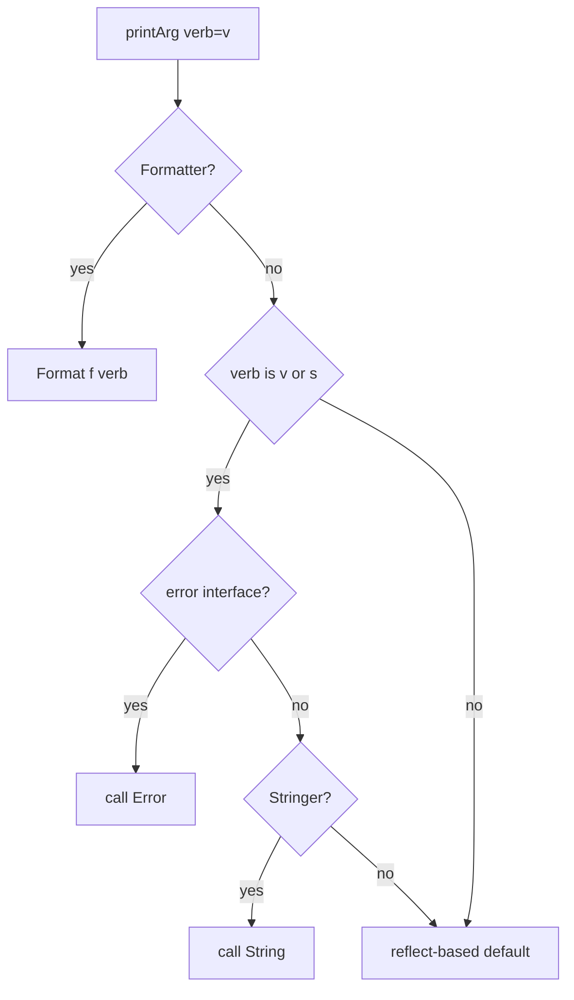

# Go fmt — Senior Level

## 1. Overview

Senior-level mastery of `fmt` means precise understanding of the
three customisation interfaces (`Stringer`, `GoStringer`,
`Formatter`), the dispatch order in `src/fmt/print.go`, the cost of
the reflection-based fallback, the `pp` printer-state pool that
amortises that cost, and the rules `vet`'s `printf` analyzer applies
at compile time.

This level is what distinguishes someone who uses `fmt` from someone
who designs types that `fmt` formats correctly under every verb,
including the edge cases that bite in code review: pointer vs value
receivers, `error` beating `Stringer`, `%w` only in `Errorf`,
`Format(f State, verb rune)` for full control, and the recursion
trap inside a `String()` method.

---

## 2. The Three Customisation Interfaces

### 2.1 Stringer

```go
type Stringer interface {
    String() string
}
```

Implemented by any type whose `%s` and `%v` representation should
not be the default. Roughly half the types in the standard library
implement it: `time.Time`, `time.Duration`, `net.IP`, `bytes.Buffer`,
`*os.File`, all enums in `time` (`Weekday`, `Month`).

```go
type Color int

const (
    Red Color = iota
    Green
    Blue
)

func (c Color) String() string {
    return [...]string{"Red", "Green", "Blue"}[c]
}
```

### 2.2 GoStringer

```go
type GoStringer interface {
    GoString() string
}
```

Called by `%#v`. Should return Go syntax that recreates the value.
Useful for types whose default Go-syntax form is unhelpful (raw byte
slices, opaque IDs).

```go
type ID [16]byte

func (id ID) GoString() string {
    return fmt.Sprintf("ID{%#x}", id[:])
}
```

### 2.3 Formatter

```go
type Formatter interface {
    Format(f State, verb rune)
}
```

`Formatter` overrides everything: when a value implements
`Formatter`, neither `String()` nor `GoString()` is consulted. The
`Format` method receives:

- `f State` — embeds `io.Writer`, plus `Width()`, `Precision()`, and
  `Flag(c int)` (for `+`, `-`, `#`, `0`, ` `).
- `verb rune` — the verb (`v`, `s`, `d`, ...).

```go
type Q struct{ Op, Key string; Err error }

func (q *Q) Format(f fmt.State, verb rune) {
    switch verb {
    case 'v':
        if f.Flag('+') {
            fmt.Fprintf(f, "%s %s\n  caused by: %+v", q.Op, q.Key, q.Err)
            return
        }
        fallthrough
    case 's':
        fmt.Fprintf(f, "%s %s: %v", q.Op, q.Key, q.Err)
    case 'q':
        fmt.Fprintf(f, "%q", fmt.Sprintf("%s %s: %v", q.Op, q.Key, q.Err))
    }
}
```

`fmt.Fprintf(f, ...)` writes through the `State`. **Never** call
`fmt.Sprintf("%v", q)` inside `Format` — that re-enters `Format` and
recurses.

### 2.4 Dispatch Order

Inside `printArg` and `printValue` (`src/fmt/print.go`):

1. If the value implements `Formatter` → call `Format(f, verb)`.
2. If the verb is `v` or `s` and the value implements `error` → use
   `Error()`.
3. If the verb is `v` or `s` and the value implements `Stringer` →
   use `String()`.
4. If the verb is `#v` and the value implements `GoStringer` → use
   `GoString()`.
5. Otherwise, fall back to reflection-based default formatting.

Two consequences:

- `error` is checked **before** `Stringer`. If your type implements
  both, `%s` and `%v` show `Error()`.
- `Formatter` overrides *all* others, including `error`.

---

## 3. Stringer Recursion Trap

```go
type T struct{ X int }
func (t T) String() string {
    return fmt.Sprintf("%v", t) // ← infinite recursion
}
```

`fmt.Sprintf("%v", t)` re-enters the `String()` method because
`Stringer` dispatch is the rule. The fix:

```go
func (t T) String() string {
    return fmt.Sprintf("T{X:%d}", t.X) // explicit verbs
}
// or
func (t T) String() string {
    type alias T // strip the method
    return fmt.Sprintf("%+v", alias(t))
}
```

The alias trick is a common idiom: define a local type that does
**not** inherit the `String()` method, then format it with `%+v`.

---

## 4. Pointer vs Value Receiver

```go
type T struct{ X int }
func (t *T) String() string { return "T" }

var t T
fmt.Println(t)  // {0}   — value, no String() called
fmt.Println(&t) // T     — pointer, String() called
```

Reason: a `*T` has the method set of `*T`, which includes pointer
methods. A `T` has the method set of `T`, which does **not** include
pointer methods.

Rule of thumb: define `String()` on the **value** receiver unless
the type is meant to be used only by pointer (e.g. `*os.File`).

```go
func (t T) String() string { return "T" }   // both work
func (t *T) String() string { return "T" }  // only *T works
```

The same rule applies to `Format` and `GoString`.

---

## 5. The pp Printer State

`fmt`'s formatting goes through a `pp` (printer) struct that holds
the output buffer, the verb state, and a few flags. To avoid one
`pp` allocation per call, the package keeps a `sync.Pool`:

```go
// src/fmt/print.go
var ppFree = sync.Pool{
    New: func() any { return new(pp) },
}

func newPrinter() *pp {
    p := ppFree.Get().(*pp)
    p.panicking = false
    p.erroring = false
    p.wrapErrs = false
    p.fmt.init(&p.buf)
    return p
}

func (p *pp) free() {
    if cap(p.buf) > 64<<10 { return } // don't pool huge buffers
    p.buf = p.buf[:0]
    p.arg = nil
    p.value = reflect.Value{}
    p.wrappedErrs = nil
    ppFree.Put(p)
}
```

Two consequences:

- The first call after a long pause may allocate; subsequent calls
  do not (for the `pp` itself).
- A single big format — say a 1 MB struct dump — drops the buffer
  back to GC instead of pooling, to avoid pinning memory.

The result: `fmt.Sprintf` allocates a small result string and
sometimes a `[]any` for variadics, but not a `pp` per call.

---

## 6. Reflection Cost

Without a `Formatter`/`Stringer`, `fmt` falls back to reflection.
The path is roughly:

1. `reflect.ValueOf(arg)` (free — `reflect.Value` is a struct, not
   an allocation, when `arg` is a non-pointer interface).
2. `printArg` switches on `v.Kind()`.
3. For composite kinds (struct, slice, map), recursively walk fields
   / elements.
4. For each leaf, write into `pp.buf` via `strconv.AppendInt`,
   `strconv.AppendFloat`, etc.

Cost vs `strconv` directly:

```
BenchmarkSprintfInt-8       30000000   45 ns/op   16 B/op   2 allocs/op
BenchmarkSprintfStruct-8     5000000  240 ns/op  144 B/op   5 allocs/op
BenchmarkStrconvItoa-8     200000000    7 ns/op    0 B/op   0 allocs/op
```

The struct case is dominated by the per-field reflect calls. For a
struct of N fields, expect roughly `O(N)` allocations from the
recursive walk if the fields are not fast-path types.

---

## 7. The %w Verb in Errorf

`fmt.Errorf` is the only entry point that recognises `%w`. Inside
`pp.doPrintf`, when the verb is `w`:

1. The argument must implement `error`. If not, you get
   `%!w(<type>=<value>)`.
2. The error is appended to `pp.wrappedErrs`.
3. After formatting, if `wrappedErrs` is non-empty, the result is a
   `*wrapError` (one `%w`) or `*wrapErrors` (two or more).
4. `wrapError.Unwrap()` returns the single underlying error;
   `wrapErrors.Unwrap()` returns `[]error`.

`errors.Is`/`As` walk both forms.

```go
// Two %w (Go 1.20+)
err := fmt.Errorf("primary: %w; cleanup: %w", e1, e2)
errors.Is(err, e1) // true
errors.Is(err, e2) // true
```

In any other call (`Sprintf`, `Printf`, `Fprintf`), `wrappedErrs` is
ignored and `%w` falls back to a malformed-verb placeholder.

---

## 8. The vet printf Analyzer

`go vet` runs an analyzer that:

1. Recognises a list of `printf`-like functions, both stdlib and via
   `// vet:printf` annotations.
2. Parses every literal format string at compile time.
3. Checks each verb against the type of the corresponding
   argument.
4. Flags:
   - Wrong type: `Printf format %d has arg "x" of wrong type string`.
   - Missing argument: `Printf format %s reads arg #2, but call has 1 arg`.
   - Extra argument: `Printf call has arguments but no formatting directives`.
   - `%w` outside `Errorf`.
   - Non-constant format strings (with `--printfuncs`).

The analyzer is in `golang.org/x/tools/go/analysis/passes/printf`.
You can register your own `Printf`-like functions:

```go
// log/log.go
//go:build vet
// +build vet

// Printf-like signatures: vet recognises stdlib ones; for custom
// helpers add a "//go:vet -printfuncs=..." comment or use
// staticcheck's check.

// staticcheck.conf:
checks = ["SA1006", "SA9006"]
initialisms = ["ID", "URL"]
```

Treat `vet` warnings as build errors. The cost is one minute per
team-month, and saves dozens of `%!d(string=...)` outages.

---

## 9. The stringer Code Generator

`golang.org/x/tools/cmd/stringer` generates `String()` methods for
constant blocks:

```go
//go:generate stringer -type=Status
type Status int

const (
    StatusPending Status = iota
    StatusRunning
    StatusDone
)
```

After `go generate`, a sibling file `status_string.go` contains:

```go
// Code generated by "stringer -type=Status"; DO NOT EDIT.
package main

import "strconv"

const _Status_name = "StatusPendingStatusRunningStatusDone"

var _Status_index = [...]uint8{0, 13, 26, 36}

func (i Status) String() string {
    if i < 0 || i >= Status(len(_Status_index)-1) {
        return "Status(" + strconv.FormatInt(int64(i), 10) + ")"
    }
    return _Status_name[_Status_index[i]:_Status_index[i+1]]
}
```

Real-world consumers: `time.Weekday`, `time.Month`, every
Kubernetes `apimachinery` enum.

The generator handles non-iota and non-contiguous values too,
producing a `map[T]string` lookup.

---

## 10. Custom Formatter for Stack Traces

The `pkg/errors` and `cockroachdb/errors` packages use `Formatter`
to expose stack traces under `%+v`:

```go
type withStack struct {
    error
    stack []uintptr
}

func (w *withStack) Format(s fmt.State, verb rune) {
    switch verb {
    case 'v':
        if s.Flag('+') {
            fmt.Fprintf(s, "%+v", w.error)
            for _, pc := range w.stack {
                fn := runtime.FuncForPC(pc - 1)
                file, line := fn.FileLine(pc - 1)
                fmt.Fprintf(s, "\n%s\n\t%s:%d", fn.Name(), file, line)
            }
            return
        }
        fallthrough
    case 's':
        fmt.Fprint(s, w.Error())
    case 'q':
        fmt.Fprintf(s, "%q", w.Error())
    }
}
```

Three observations:

1. `s.Flag('+')` switches between short and verbose.
2. `Fprintf(s, ...)` writes through the `State` — no double
   formatting.
3. The `Format` method must handle `s`, `v`, and `q` — the standard
   trio for error-like values.

---

## 11. Reflection vs Fast Paths

`fmt` has fast paths for the common kinds:

```go
// pseudo-code in src/fmt/print.go
switch f := arg.(type) {
case bool:    p.fmtBool(f, verb)
case float32: p.fmtFloat(float64(f), 32, verb)
case float64: p.fmtFloat(f, 64, verb)
case complex64, complex128: ...
case int:     p.fmtInteger(uint64(f), signed, verb)
case int8, int16, int32, int64, uint, uintptr, ...
case string:  p.fmtString(f, verb)
case []byte:  p.fmtBytes(f, verb, "[]byte")
default:      p.printValue(reflect.ValueOf(arg), verb, 0)
}
```

The type switch avoids reflection for primitives; the recursion-
based `printValue` handles everything else. The implication is that
formatting `int` is ~5x cheaper than formatting a struct of one
`int`.

---

## 12. State Interface Details

```go
type State interface {
    Write(b []byte) (n int, err error)
    Width()     (wid int, ok bool)
    Precision() (prec int, ok bool)
    Flag(c int) bool
}
```

- `Width()` and `Precision()` return `(value, true)` if explicitly
  set in the format directive; `(0, false)` otherwise.
- `Flag(c)` checks for one of `'+', '-', '#', '0', ' '`.
- `Write` accepts the formatted bytes; `fmt.Fprintf(s, ...)` is the
  usual writer.

A `Format` method that respects width and precision:

```go
func (q Q) Format(f fmt.State, verb rune) {
    s := q.string()
    if w, ok := f.Width(); ok && len(s) < w {
        pad := strings.Repeat(" ", w-len(s))
        if f.Flag('-') {
            s = s + pad
        } else {
            s = pad + s
        }
    }
    fmt.Fprint(f, s)
}
```

Most custom `Format` methods ignore width/precision; consider that
when documenting your type.

---

## 13. Buffer Sharing and Reuse

The `pp.buf` is a `[]byte` reused via the pool. Two implications:

1. The output of `Sprintf` is a freshly allocated string; the buffer
   is recycled.
2. Inside `Format`, you write into a state whose underlying buffer
   is shared with whoever called `Sprintf` / `Printf`. Do not retain
   it.

```go
func (q Q) Format(f fmt.State, verb rune) {
    bs, _ := f.(io.Writer).(interface{ Bytes() []byte }) // do NOT do this
    _ = bs
    fmt.Fprint(f, q.S)
}
```

If you need the formatted bytes, format into a new buffer:

```go
var sb strings.Builder
fmt.Fprint(&sb, q)
text := sb.String()
```

---

## 14. The Errors Chain Today

Go 1.13: `errors.Is`, `errors.As`, `errors.Unwrap`, plus `%w`.

Go 1.20: multiple `%w` per call, `errors.Join`. After Go 1.20, the
canonical multi-error pattern is:

```go
var errs []error
for _, x := range items {
    if err := process(x); err != nil {
        errs = append(errs, fmt.Errorf("item %s: %w", x.ID, err))
    }
}
return errors.Join(errs...)
```

`fmt.Errorf("...: %w...; %w", a, b)` is functionally similar but
`errors.Join` is clearer for collected errors.

---

## 15. Custom Verbs

`fmt` does not support **defining new verbs**, but `Format` lets you
respond to any rune:

```go
type Color struct{ R, G, B uint8 }

func (c Color) Format(f fmt.State, verb rune) {
    switch verb {
    case 'h': // hex
        fmt.Fprintf(f, "#%02x%02x%02x", c.R, c.G, c.B)
    case 'r': // rgb()
        fmt.Fprintf(f, "rgb(%d,%d,%d)", c.R, c.G, c.B)
    default:
        fmt.Fprintf(f, "(%d,%d,%d)", c.R, c.G, c.B)
    }
}

fmt.Printf("%h\n", Color{255, 128, 0}) // #ff8000
fmt.Printf("%r\n", Color{255, 128, 0}) // rgb(255,128,0)
```

`vet` will complain about unknown verbs unless you tag the call site
with a custom `printfuncs` annotation, since it cannot infer your
custom verbs.

---

## 16. Production Anti-Patterns

| Anti-pattern | Why it's bad |
|--------------|--------------|
| `fmt.Errorf("...: %v", err)` | Cause is unrecoverable via `errors.Is` |
| Format string built from variables | `vet` cannot check; runtime placeholders |
| `Printf(userInput)` | Verb-injection bug |
| `Sprintf("%v", obj)` for hot path | Reflection cost; use `Stringer` or `strconv` |
| `String()` method calling `%v` of self | Infinite recursion |
| `Format` method calling `Sprintf` of self | Same |
| Pointer-receiver `String()` on value-formatted type | `String()` never fires |

---

## 17. Internals at a Glance

```
src/fmt/
  doc.go         package doc — verb table is here
  print.go       printer state (pp), Sprintf/Printf/Fprintf entry points
  format.go      verb-by-verb byte writers (fmtInteger, fmtFloat, ...)
  scan.go        scanner state (ss), Scan/Sscan/Fscan
  errors.go      Errorf, wrapError, wrapErrors

  print.go ::
    type pp struct { buf, arg, value, fmt fmtState ... }
    func (p *pp) doPrintf(format string, a []any)
    func (p *pp) printArg(arg any, verb rune)
    func (p *pp) printValue(v reflect.Value, verb rune, depth int)
    func (p *pp) handleMethods(verb rune) (handled bool)
```

The hot loop in `doPrintf` walks the format string, decodes each
directive, calls `printArg`, advances the argument index, and
appends literal text in between.

---

## 18. Edge Cases & Pitfalls

### 18.1 Format that Calls fmt on Self

```go
func (q Q) Format(f fmt.State, verb rune) {
    fmt.Fprintf(f, "%v", q) // ← recursion
}
```

Use a typed alias or write fields directly.

### 18.2 fmt.Stringer Returning a fmt.Sprintf("%v", self)

Same trap. `String()` is dispatched on `%s` and `%v`; recursing
into `%v` hits the same method.

### 18.3 fmt.Formatter With Wrong Verb

If the verb is a custom rune like `%h` and your `Format` switches
on `verb`, `vet` may not warn about `%h` being unknown — but
adopters of your type may. Document the supported verbs.

### 18.4 Multiple %w With nil

```go
err := fmt.Errorf("a: %w; b: %w", e1, nil) // panics
```

`Errorf` panics when an argument bound to `%w` is `nil` (Go 1.20+
behaviour). Filter `nil`s before calling.

### 18.5 GoString Recursion

```go
func (id ID) GoString() string {
    return fmt.Sprintf("%#v", id) // recursion
}
```

Same trap; use explicit field references.

### 18.6 fmt.Sprintf With Reflect Type

```go
t := reflect.TypeOf(42)
fmt.Printf("%v\n", t) // int  — Type implements Stringer
fmt.Printf("%T\n", t) // *reflect.rtype  — internal type leak
```

`%T` exposes implementation types; prefer `%v` for Type and Value.

---

## 19. Common Mistakes

| Mistake | Fix |
|---------|-----|
| `String()` calling `%v` of self | Use explicit fields or alias |
| `Format` writing to `os.Stdout` | Use the `State` |
| Pointer-only `String()` | Promote to value receiver |
| Multiple `%w` with nil | Filter or use `errors.Join` |
| Custom verbs without `vet` exemption | Document; expect warnings |
| Implementing `Stringer` and `error` and expecting both | `error` wins for `%v` |

---

## 20. Common Misconceptions

**Misconception 1**: "Defining `String()` is enough for both `%v`
and `%+v`."
**Truth**: `String()` is called for `%v` and `%s`; for `%+v` it is
also called when defined. For `%#v`, `GoString()` is preferred.

**Misconception 2**: "`Format` overrides `error`."
**Truth**: Yes — `Formatter` beats `error`. If you want both, your
`Format` should call `q.Err.Error()` itself.

**Misconception 3**: "The `pp` pool means `Sprintf` is allocation-
free."
**Truth**: The `pp` is pooled, but the result string is freshly
allocated per call.

**Misconception 4**: "Width and precision can do anything to a
struct."
**Truth**: `fmt`'s default formatting ignores width/precision on
composite kinds; they only apply to the leaf primitives unless you
implement `Format`.

**Misconception 5**: "`%w` is just `%v` plus magic."
**Truth**: `%w` formats like `%v` AND records the wrapped error.
Outside `Errorf`, the recording is dropped and you see a `%!w`
placeholder.

---

## 21. Tricky Points

1. `error` beats `Stringer`; `Formatter` beats both.
2. `%v` of a typed nil pointer is `<nil>` only if the type has a
   nil-aware `String()`; otherwise it dereferences and panics.
3. Width/precision flow into `Format` via `State.Width()`/
   `Precision()`; you have to implement them yourself.
4. The `pp.wrappedErrs` slice is reused via the pool; do not retain
   pointers to it after `Errorf` returns.
5. `vet` recognises a fixed list of `printf`-likes; for custom
   wrappers, add a comment or staticcheck rule.

---

## 22. Test

```go
package fmt_test

import (
    "errors"
    "fmt"
    "testing"
)

type ec struct{ Op string; Err error }

func (e *ec) Error() string  { return fmt.Sprintf("%s: %v", e.Op, e.Err) }
func (e *ec) Unwrap() error  { return e.Err }
func (e *ec) Format(f fmt.State, verb rune) {
    switch verb {
    case 'v':
        if f.Flag('+') {
            fmt.Fprintf(f, "%s\n  cause: %+v", e.Op, e.Err)
            return
        }
        fmt.Fprint(f, e.Error())
    default:
        fmt.Fprint(f, e.Error())
    }
}

func TestFormatterFlag(t *testing.T) {
    inner := errors.New("inner")
    e := &ec{Op: "load", Err: inner}
    short := fmt.Sprintf("%v", e)
    long := fmt.Sprintf("%+v", e)
    if short == long {
        t.Fatal("expected %v and %+v to differ")
    }
}
```

---

## 23. Tricky Questions

**Q1**: A type implements `Stringer`, `error`, and `Formatter`. What
does `fmt.Println(t)` call?
**A**: `Format(state, 'v')`. `Formatter` overrides everything.

**Q2**: Can `String()` be called on a typed nil pointer?
**A**: Yes, if you write it that way:
```go
func (t *T) String() string {
    if t == nil { return "<nil T>" }
    return t.s
}
```
Otherwise you nil-pointer panic.

**Q3**: Why does `fmt.Errorf("a: %w", nil)` panic?
**A**: Because `nil` cannot be unwrapped; Go 1.20 added a runtime
panic instead of silently producing a non-wrapping error.

**Q4**: What does `%T` print for `nil`?
**A**: `<nil>`. It prints the type name, and `nil` has no type.

---

## 24. Cheat Sheet

```go
// Stringer
func (T) String() string { return "..." }

// GoStringer (for %#v)
func (T) GoString() string { return "..." }

// Formatter
func (T) Format(f fmt.State, verb rune) {
    fmt.Fprintf(f, "...", ...)
}

// Stringer recursion fix
func (t T) String() string {
    type alias T
    return fmt.Sprintf("%+v", alias(t))
}

// Pointer vs value
func (t T)  String() string { ... } // works for both T and *T
func (t *T) String() string { ... } // works only for *T

// stringer codegen
//go:generate stringer -type=MyEnum

// Multiple %w
fmt.Errorf("a: %w; b: %w", e1, e2)
```

---

## 25. Self-Assessment Checklist

- [ ] I know the dispatch order (Formatter > error > Stringer).
- [ ] I avoid the `String()` recursion trap.
- [ ] I prefer value receivers for `String()`.
- [ ] I implement `Format` for full custom verb support.
- [ ] I respect `State.Width()` / `Precision()` when relevant.
- [ ] I run `stringer` for enums.
- [ ] I read `vet`'s `printf` analyzer warnings.
- [ ] I know the `pp` pool exists and doesn't help with the result
      string.

---

## 26. Summary

At the senior level you treat `fmt` as a public protocol your types
must speak: `Stringer` for the common case, `GoStringer` for
debugging, `Formatter` for full control. You know the dispatch
order, the recursion trap, the pointer-vs-value rule, and the cost
of reflection vs the fast paths. You read the `pp` source when an
allocation profile demands it, and you trust `stringer` and `vet`
to take care of the rest.

---

## 27. Further Reading

- [pkg.go.dev/fmt](https://pkg.go.dev/fmt) — verb table,
  `Stringer`/`GoStringer`/`Formatter` interfaces.
- [src/fmt/print.go](https://github.com/golang/go/blob/master/src/fmt/print.go)
  — printer state, dispatch, pool.
- [golang.org/x/tools/cmd/stringer](https://pkg.go.dev/golang.org/x/tools/cmd/stringer)
  — code generator.
- [Errors are values — Go blog](https://go.dev/blog/errors-are-values)
- [Working with Errors in Go 1.13](https://go.dev/blog/go1.13-errors)

---

## 28. Related Topics

- 8.7 `slog` — what to use instead of `fmt` for service logs.
- 5.4 `fmt.Errorf` — focused deep dive on `%w`.
- 8.16 `sort` and friends — companion ergonomic stdlib.
- 11 toolchain — `vet`, `staticcheck` integration.

---

## 29. Diagrams & Visual Aids

### Dispatch order



### pp lifecycle

```
caller -> Sprintf
         │
         ▼
       newPrinter (Pool.Get)
         │
         ▼
       doPrintf walks format
         │   ├── primitive: append directly
         │   └── composite: printValue recursively
         ▼
       result := string(p.buf)
         │
         ▼
       p.free (Pool.Put if buf small)
         │
         ▼
       caller gets result
```
