# Go Roadmap — Universal Template

> **A comprehensive template system for generating Go roadmap content across all skill levels.**

---

## Overview

| | Description |
|---|---|
| **Purpose** | Universal template for all Go roadmap topics |
| **Files per topic** | 9 files: `junior.md`, `middle.md`, `senior.md`, `professional.md`, `interview.md`, `tasks.md`, `find-bug.md`, `optimize.md`, `specification.md` |
| **Language** | All content must be generated in **English** |
| **Table of Contents** | **Optional** — include only if relevant to the topic |

### Topic Structure

```
XX-topic-name/
├── junior.md          ← "What?" and "How?"
├── middle.md          ← "Why?" and "When?"
├── senior.md          ← "How to optimize?" and "How to architect?"
├── professional.md    ← "Under the Hood" — runtime, compiler, OS level
├── interview.md       ← Interview prep across all levels
├── tasks.md           ← Hands-on practice tasks
├── find-bug.md        ← Find and fix bugs in code (10+ exercises)
├── optimize.md        ← Optimize slow/inefficient code (10+ exercises)
└── specification.md   ← Official spec / documentation deep-dive
```

---

## Level Comparison Matrix

| Aspect | Junior | Middle | Senior | Professional |
|:------:|:------:|:------:|:------:|:------------:|
| **Depth** | Basic concepts, simple examples | Practical usage, real-world cases | Architecture, optimization | Runtime, compiler, OS level |
| **Code** | Hello World level | Production-ready examples | Advanced patterns, benchmarks | Source code analysis, assembly output |
| **Tricky Points** | Syntax errors | Concurrency, memory pitfalls | Compiler internals | Go runtime source, syscall, scheduler |
| **Focus** | "What?" and "How?" | "Why?" and "When?" | "How to improve?" | "What happens under the hood?" |
| **Go Specifics** | `package main`, `func main()`, basic types | goroutines, channels, interfaces | sync.Pool, escape analysis, pprof | runtime internals, GC, scheduler source |

---
---

# TEMPLATE 1 — `junior.md`

<details open>
<summary><strong>Template Content</strong></summary>

# {{TOPIC_NAME}} — Junior Level

## Table of Contents

1. [Introduction](#introduction)
2. [Prerequisites](#prerequisites)
3. [Glossary](#glossary)
4. [Core Concepts](#core-concepts)
5. [Pros & Cons](#pros--cons)
6. [Use Cases](#use-cases)
7. [Code Examples](#code-examples)
8. [Coding Patterns](#coding-patterns)
9. [Clean Code](#clean-code)
10. [Product Use / Feature](#product-use--feature)
11. [Error Handling](#error-handling)
12. [Security Considerations](#security-considerations)
13. [Performance Tips](#performance-tips)
14. [Metrics & Analytics](#metrics--analytics)
15. [Best Practices](#best-practices)
16. [Edge Cases & Pitfalls](#edge-cases--pitfalls)
17. [Common Mistakes](#common-mistakes)
18. [Tricky Points](#tricky-points)
19. [Test](#test)
20. [Tricky Questions](#tricky-questions)
21. [Cheat Sheet](#cheat-sheet)
22. [Summary](#summary)
23. [What You Can Build](#what-you-can-build)
24. [Further Reading](#further-reading)
25. [Related Topics](#related-topics)
26. [Diagrams & Visual Aids](#diagrams--visual-aids)

---

## Introduction

> Focus: "What is it?" and "How to use it?"

Brief explanation of what {{TOPIC_NAME}} is and why a beginner needs to know it.
Keep it simple — assume the reader has basic programming knowledge but is new to Go.

---

## Prerequisites

- **Required:** {{concept 1}} — brief explanation of why
- **Required:** {{concept 2}} — brief explanation of why
- **Helpful but not required:** {{concept 3}}

---

## Glossary

| Term | Definition |
|------|-----------|
| **{{Term 1}}** | Simple, one-sentence definition |
| **{{Term 2}}** | Simple, one-sentence definition |
| **{{Term 3}}** | Simple, one-sentence definition |

---

## Core Concepts

### Concept 1: {{name}}

Simple explanation with analogy if helpful.

### Concept 2: {{name}}

...

---

## Real-World Analogies

| Concept | Analogy |
|---------|--------|
| **{{Concept 1}}** | {{Analogy}} |
| **{{Concept 2}}** | {{Analogy}} |

---

## Mental Models

**The intuition:** {{A simple mental model}}

**Why this model helps:** {{Why visualizing it this way prevents common mistakes}}

---

## Pros & Cons

| Pros | Cons |
|------|------|
| {{Advantage 1}} | {{Disadvantage 1}} |
| {{Advantage 2}} | {{Disadvantage 2}} |
| {{Advantage 3}} | {{Disadvantage 3}} |

### When to use:
- {{Scenario where this approach shines}}

### When NOT to use:
- {{Scenario where another approach is better}}

---

## Use Cases

- **Use Case 1:** Description
- **Use Case 2:** Description
- **Use Case 3:** Description

---

## Code Examples

### Example 1: {{title}}

```go
// Full working example with comments
package main

import "fmt"

func main() {
    fmt.Println("Hello, World!")
}
```

**What it does:** Brief explanation of what happens.
**How to run:** `go run main.go`

### Example 2: {{title}}

```go
// Another practical example
package main

import "fmt"

func main() {
    // example code here
    fmt.Println("example")
}
```

> Every example must be runnable. Include `package main` and `func main()`.

---

## Coding Patterns

Common patterns beginners encounter when working with {{TOPIC_NAME}}:

### Pattern 1: {{Basic pattern name}}

**Intent:** {{One sentence — what problem does this pattern solve?}}
**When to use:** {{Simple scenario where this pattern applies}}

```go
// Pattern implementation — keep it simple and well-commented
package main

import "fmt"

func main() {
    // pattern code here
    fmt.Println("pattern output")
}
```

**Diagram:**

```mermaid
graph TD
    A[Input] --> B[{{TOPIC_NAME}} Pattern]
    B --> C[Output]
    B --> D[Side Effect / State Change]
```

**Remember:** {{One key takeaway for junior developers}}

---

### Pattern 2: {{Another basic pattern}}

**Intent:** {{What it solves}}

```go
// Second pattern example
package main

import "fmt"

func main() {
    // pattern code here
    fmt.Println("pattern 2 output")
}
```

**Diagram:**

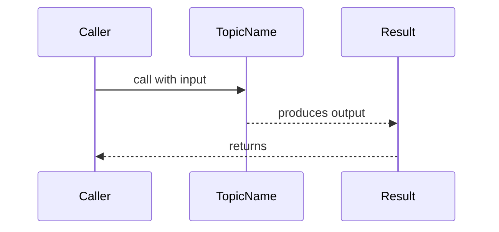

> Include 2 patterns at this level. Focus on patterns the beginner WILL encounter.

---

## Clean Code

Basic clean code principles when working with {{TOPIC_NAME}}:

### Naming

```go
// Bad naming
func d(x int) int { return x * 2 }
var t = getData()

// Clean naming
func doubleValue(n int) int { return n * 2 }
var userList = getUsers()
```

**Rules:**
- Variables: describe WHAT they hold (`userCount`, not `n`, `x`, `tmp`)
- Functions: describe WHAT they do (`calculateTotal`, not `calc`, `doStuff`)
- Booleans: use `is`, `has`, `can` prefix (`isValid`, `hasPermission`)

---

### Functions

```go
// Too long, does too many things
func process(data []byte) error {
    // 80+ lines doing parse, validate, save, notify...
    return nil
}

// Single responsibility
func parseInput(data []byte) (Input, error)  { return Input{}, nil }
func validateInput(in Input) error           { return nil }
func saveInput(in Input) error               { return nil }
```

**Rule:** If you need to scroll to see a function — it does too much. Aim for **≤ 20 lines**.

---

### Comments

```go
// Noise comment (states the obvious)
// increment i by 1
i++

// Outdated comment (lies)
// returns user by email (actually returns by ID now)
func getUser(id int) User { return User{} }

// Explains WHY, not WHAT
// Retry up to 3 times — downstream service has transient failures
for attempt := 0; attempt < 3; attempt++ { }
```

**Rule:** Good code explains itself. Comments explain **why**, not **what**.

---

## Product Use / Feature

### 1. {{Product/Tool Name}}

- **How it uses {{TOPIC_NAME}}:** Brief description
- **Why it matters:** Practical impact

### 2. {{Product/Tool Name}}

- **How it uses {{TOPIC_NAME}}:** Brief description
- **Why it matters:** Practical impact

### 3. {{Product/Tool Name}}

- **How it uses {{TOPIC_NAME}}:** Brief description
- **Why it matters:** Practical impact

---

## Error Handling

### Error 1: {{Common error message or type}}

```go
// Code that produces this error
```

**Why it happens:** Simple explanation.
**How to fix:**

```go
// Corrected code with proper Go error handling
result, err := someFunction()
if err != nil {
    return fmt.Errorf("context: %w", err)
}
_ = result
```

### Error Handling Pattern

```go
// Recommended Go error handling idiom: check errors immediately
result, err := someFunction()
if err != nil {
    // handle error appropriately
    log.Printf("error: %v", err)
    return err
}
```

> 2-4 common errors. Teach the Go error handling idiom: check errors immediately, wrap with context.

---

## Security Considerations

### 1. {{Security concern}}

```go
// Insecure
// ...

// Secure
// ...
```

**Risk:** What could go wrong.
**Mitigation:** How to protect against it.

---

## Performance Tips

### Tip 1: {{Performance optimization}}

```go
// Slow approach
// ...

// Faster approach
// ...
```

**Why it's faster:** Simple explanation (fewer allocations, less copying, etc.)

---

## Metrics & Analytics

### What to Measure

| Metric | Why it matters | Tool |
|--------|---------------|------|
| **{{metric 1}}** | {{reason}} | `expvar`, `pprof` |
| **{{metric 2}}** | {{reason}} | `expvar`, `pprof` |

### Basic Instrumentation

```go
import "expvar"

var (
    opCount  = expvar.NewInt("topic.count")
    opErrors = expvar.NewInt("topic.errors")
)

// Increment in your code:
opCount.Add(1)
```

---

## Best Practices

- **Do this:** Explanation
- **Do this:** Explanation
- **Do this:** Explanation

---

## Edge Cases & Pitfalls

### Pitfall 1: {{name}}

```go
// Code that demonstrates the pitfall
```

**What happens:** Explanation of unexpected behavior.
**How to fix:** Corrected code or approach.

---

## Common Mistakes

### Mistake 1: {{description}}

```go
// Wrong way
// ...

// Correct way
// ...
```

---

## Common Misconceptions

### Misconception 1: "{{False belief}}"

**Reality:** {{What's actually true}}
**Why people think this:** {{Why this misconception is common}}

---

## Tricky Points

### Tricky Point 1: {{name}}

```go
// Code that might surprise a junior
```

**Why it's tricky:** Explanation.
**Key takeaway:** One-line lesson.

---

## Test

### Multiple Choice

**1. {{Question}}?**

- A) Option A
- B) Option B
- C) Option C
- D) Option D

<details>
<summary>Answer</summary>
**C)** — Explanation why C is correct and why others are wrong.
</details>

### True or False

**2. {{Statement}}**

<details>
<summary>Answer</summary>
**False** — Explanation.
</details>

### What's the Output?

**3. What does this code print?**

```go
package main

import "fmt"

func main() {
    // code snippet
    fmt.Println("?")
}
```

<details>
<summary>Answer</summary>
Output: `...`
Explanation: ...
</details>

---

## "What If?" Scenarios

**What if {{Unexpected situation}}?**
- **You might think:** {{Intuitive but wrong answer}}
- **But actually:** {{Correct behavior and why}}

---

## Tricky Questions

**1. {{Confusing question}}?**

- A) {{Looks correct but wrong}}
- B) {{Correct answer}}
- C) {{Common misconception}}
- D) {{Partially correct}}

<details>
<summary>Answer</summary>
**B)** — Explanation of why the "obvious" answers are wrong.
</details>

---

## Cheat Sheet

| What | Syntax / Command | Example |
|------|-----------------|---------|
| {{Action 1}} | `{{syntax}}` | `{{example}}` |
| {{Action 2}} | `{{syntax}}` | `{{example}}` |
| {{Action 3}} | `{{syntax}}` | `{{example}}` |

---

## Self-Assessment Checklist

### I can explain:
- [ ] What {{TOPIC_NAME}} is and why it exists
- [ ] When to use it and when NOT to use it
- [ ] {{Specific concept 1}} in my own words

### I can do:
- [ ] Write a basic example from scratch (without looking)
- [ ] Read and understand code that uses {{TOPIC_NAME}}
- [ ] Debug simple errors related to this topic

### I can answer:
- [ ] All multiple choice questions in this document

---

## Summary

- Key point 1
- Key point 2
- Key point 3

**Next step:** What to learn after this topic.

---

## What You Can Build

### Projects you can create:
- **{{Project 1}}:** Brief description
- **{{Project 2}}:** Brief description
- **{{Project 3}}:** Brief description

### Learning path — what to study next:

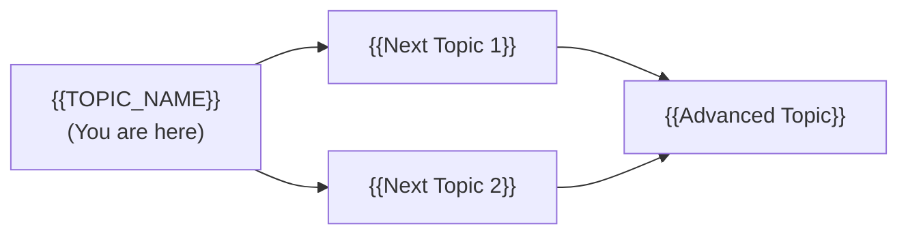

---

## Further Reading

- **Official docs:** [Go Documentation](https://pkg.go.dev)
- **Blog post:** [{{link title}}]({{url}}) — brief description
- **Video:** [{{link title}}]({{url}}) — duration, what it covers

---

## Related Topics

- **[{{Related Topic 1}}](../XX-related-topic/)** — how it connects
- **[{{Related Topic 2}}](../XX-related-topic/)** — how it connects

---

## Diagrams & Visual Aids

### Mind Map

```mermaid
mindmap
  root(({{TOPIC_NAME}}))
    Core Concept 1
      Sub-concept A
      Sub-concept B
    Core Concept 2
      Sub-concept C
      Sub-concept D
    Related Topics
      Related 1
      Related 2
```

### Example — Flowchart

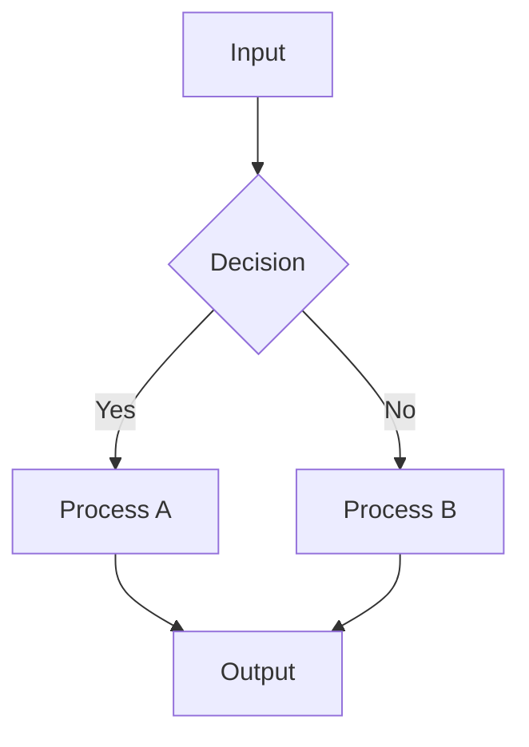

### Example — ASCII Memory Layout

```
+------------------+
|   Stack Frame    |
|------------------|
| local_var1: 42   |  <- 8 bytes
| local_var2: &obj |  <- 8 bytes (pointer)
+------------------+
        |
        v
+------------------+
|   Heap Object    |
|------------------|
| field1: "hello"  |
| field2: 3.14     |
+------------------+
```

</details>

---
---

# TEMPLATE 2 — `middle.md`

<details open>
<summary><strong>Template Content</strong></summary>

# {{TOPIC_NAME}} — Middle Level

## Table of Contents

1. [Introduction](#introduction)
2. [Core Concepts](#core-concepts)
3. [Pros & Cons](#pros--cons)
4. [Use Cases](#use-cases)
5. [Code Examples](#code-examples)
6. [Coding Patterns](#coding-patterns)
7. [Clean Code](#clean-code)
8. [Product Use / Feature](#product-use--feature)
9. [Error Handling](#error-handling)
10. [Security Considerations](#security-considerations)
11. [Performance Optimization](#performance-optimization)
12. [Metrics & Analytics](#metrics--analytics)
13. [Debugging Guide](#debugging-guide)
14. [Best Practices](#best-practices)
15. [Edge Cases & Pitfalls](#edge-cases--pitfalls)
16. [Common Mistakes](#common-mistakes)
17. [Tricky Points](#tricky-points)
18. [Comparison with Other Languages](#comparison-with-other-languages)
19. [Test](#test)
20. [Tricky Questions](#tricky-questions)
21. [Cheat Sheet](#cheat-sheet)
22. [Summary](#summary)
23. [What You Can Build](#what-you-can-build)
24. [Further Reading](#further-reading)
25. [Related Topics](#related-topics)
26. [Diagrams & Visual Aids](#diagrams--visual-aids)

---

## Introduction

> Focus: "Why?" and "When to use?"

Assumes the reader already knows the basics. This level covers:
- Deeper understanding of how {{TOPIC_NAME}} works
- Real-world application patterns
- Production considerations

---

## Core Concepts

### Concept 1: {{Advanced concept}}

Detailed explanation with diagrams where helpful.

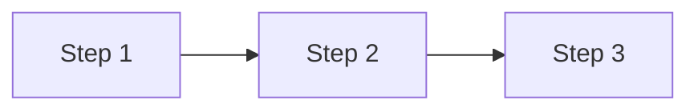

### Concept 2: {{Another concept}}

- How it relates to other Go features
- Internal behavior differences
- Performance implications

---

## Evolution & Historical Context

**Before {{TOPIC_NAME}}:**
- How developers solved this problem previously

**How {{TOPIC_NAME}} changed things:**
- The architectural shift it introduced

---

## Pros & Cons

| Pros | Cons |
|------|------|
| {{Advantage 1 with production context}} | {{Disadvantage 1 with impact analysis}} |
| {{Advantage 2}} | {{Disadvantage 2}} |

### Trade-off analysis:
- **{{Trade-off 1}}:** When {{advantage}} outweighs {{disadvantage}}

### Comparison with alternatives:

| Approach | Pros | Cons | Best for |
|----------|------|------|----------|
| {{Approach A}} | {{pros}} | {{cons}} | {{scenario}} |
| {{Approach B}} | {{pros}} | {{cons}} | {{scenario}} |

---

## Alternative Approaches (Plan B)

| Alternative | How it works | When you might be forced to use it |
|-------------|--------------|------------------------------------|
| **{{Alternative 1}}** | {{Brief explanation}} | {{scenario}} |
| **{{Alternative 2}}** | {{Brief explanation}} | {{scenario}} |

---

## Use Cases

- **Use Case 1:** {{Production scenario}}
- **Use Case 2:** {{Scaling scenario}}
- **Use Case 3:** {{Integration scenario}}

---

## Code Examples

### Example 1: {{Production-ready pattern}}

```go
// Production-quality code with error handling, logging, etc.
package main

import (
    "context"
    "fmt"
    "log"
)

func doSomething(ctx context.Context) error {
    result, err := riskyOperation(ctx)
    if err != nil {
        return fmt.Errorf("doSomething: %w", err)
    }
    log.Printf("result: %v", result)
    return nil
}

func riskyOperation(_ context.Context) (string, error) {
    return "ok", nil
}

func main() {
    if err := doSomething(context.Background()); err != nil {
        log.Fatal(err)
    }
}
```

**Why this pattern:** Explanation of design decisions.
**Trade-offs:** What you gain and what you sacrifice.

### Example 2: {{Comparison of approaches}}

```go
// Approach A
// ...

// Approach B (better for X reason)
// ...
```

---

## Coding Patterns

Design patterns and idiomatic Go patterns for {{TOPIC_NAME}} in production code:

### Pattern 1: {{GoF or Go-specific pattern name}}

**Category:** Creational / Structural / Behavioral / Concurrency / Idiomatic
**Intent:** {{What problem this pattern solves at the design level}}
**When to use:** {{Specific scenario}}
**When NOT to use:** {{Counter-indication}}

**Structure diagram:**

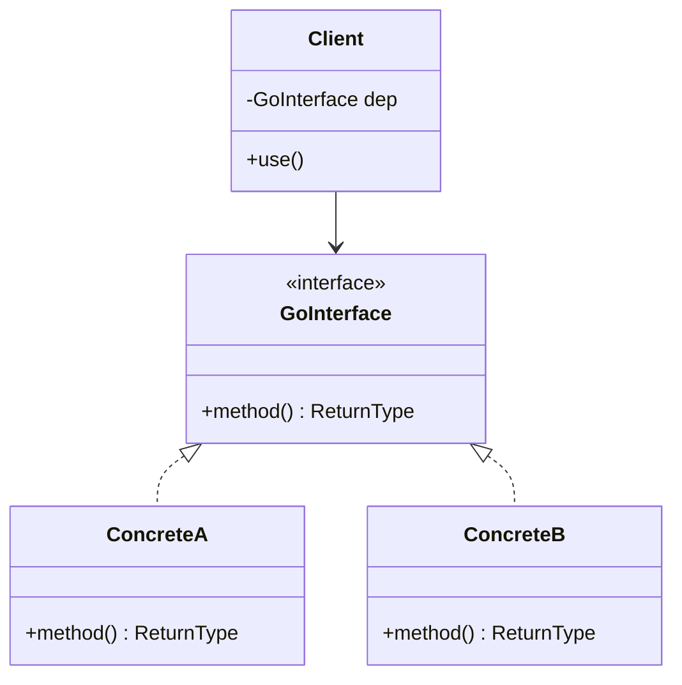

**Implementation:**

```go
// Pattern implementation with real Go usage
type Worker interface {
    Do(ctx context.Context) error
}

type concreteWorker struct{ name string }

func (w *concreteWorker) Do(_ context.Context) error {
    fmt.Printf("worker %s doing work\n", w.name)
    return nil
}
```

**Trade-offs:**

| Pros | Cons |
|---------|---------|
| {{benefit 1}} | {{drawback 1}} |
| {{benefit 2}} | {{drawback 2}} |

---

### Pattern 2: {{Another pattern}}

**Category:** Creational / Structural / Behavioral
**Intent:** {{What it solves}}

**Flow diagram:**

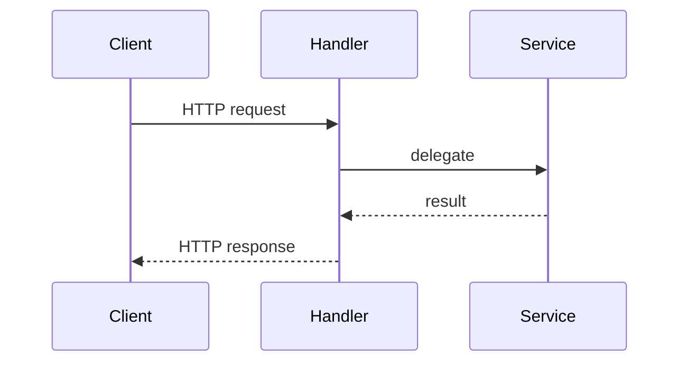

```go
// Implementation
```

---

### Pattern 3: {{Idiomatic Go pattern}}

**Intent:** {{Go-specific idiom or best practice}}

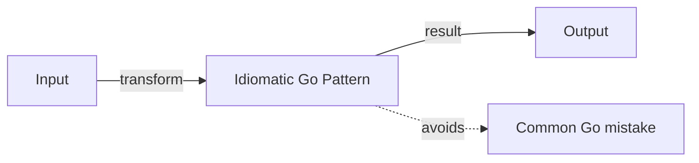

```go
// Non-idiomatic Go
// ...

// Idiomatic Go pattern
// ...
```

---

## Clean Code

Production-level clean code principles for Go:

### Naming & Readability

```go
// Cryptic
func proc(d []byte, f bool) ([]byte, error) { return nil, nil }

// Self-documenting
func compressData(input []byte, includeHeader bool) ([]byte, error) { return nil, nil }
```

| Element | Rule | Example |
|---------|------|---------|
| Functions | Verb + noun, describes action | `fetchUserByID`, `validateEmail` |
| Variables | Noun, describes content | `activeConnections`, `retryCount` |
| Booleans | `is/has/can` prefix | `isExpired`, `hasPermission` |
| Constants | Descriptive | `MaxRetries`, `DefaultTimeout` |

---

### SOLID in Go

**Single Responsibility:**
```go
// One struct doing everything
type UserService struct { /* handles auth + DB + email + logging */ }

// Each type has one reason to change
type UserRepository interface { FindByID(id int) (User, error) }
type UserNotifier   interface { SendWelcomeEmail(u User) error }
type UserAuthService struct { repo UserRepository }
```

**Open/Closed (via interfaces):**
```go
// Switch on type — breaks on every new type
func process(t string) { switch t { case "A": /* ... */ case "B": /* ... */ } }

// Open for extension via interface
type Processor interface { Process() error }
```

---

### DRY vs WET

```go
// WET (Write Everything Twice)
func validateEmail(s string) bool    { return len(s) > 0 && strings.Contains(s, "@") }
func validateUsername(s string) bool { return len(s) > 0 && strings.Contains(s, "@") }

// DRY — extract common logic
func containsAt(s string) bool { return len(s) > 0 && strings.Contains(s, "@") }
```

---

### Function Design

| Signal | Smell | Fix |
|--------|-------|-----|
| > 20 lines | Does too much | Split into smaller functions |
| > 3 parameters | Complex signature | Use options struct or builder |
| Deep nesting (> 3 levels) | Spaghetti logic | Early returns, extract helpers |
| Boolean parameter | Flags a violation | Split into two functions |

---

## Product Use / Feature

### 1. {{Product/Tool Name}}

- **How it uses {{TOPIC_NAME}}:** Description with architectural context
- **Scale:** Numbers, traffic, data volume
- **Key insight:** What can be learned from their approach

---

## Error Handling

### Pattern 1: Error wrapping with context

```go
func doSomething() error {
    result, err := riskyOperation()
    if err != nil {
        return fmt.Errorf("doSomething failed: %w", err)
    }
    _ = result
    return nil
}
```

### Pattern 2: Custom error types

```go
type DomainError struct {
    Code    int
    Message string
    Err     error
}

func (e *DomainError) Error() string { return e.Message }
func (e *DomainError) Unwrap() error { return e.Err }
```

### Common Error Patterns

| Situation | Pattern | Example |
|-----------|---------|---------|
| Wrapping errors | `fmt.Errorf("context: %w", err)` | Add context to errors |
| Checking error type | `errors.Is(err, target)` | Check specific error |
| Extracting error | `errors.As(err, &target)` | Get typed error info |
| Sentinel errors | `var ErrNotFound = errors.New("not found")` | Predefined errors |

---

## Security Considerations

### 1. {{Security concern}}

**Risk level:** High / Medium / Low

```go
// Vulnerable code
// ...

// Secure code
// ...
```

### Security Checklist

- [ ] {{Check 1}} — why it matters
- [ ] {{Check 2}} — why it matters

---

## Performance Optimization

### Optimization 1: {{name}}

```go
// Slow — O(n²) / high allocations
// ...

// Fast — O(n) / zero allocations
// ...
```

**Benchmark results:**
```
BenchmarkSlow-8    100000    15234 ns/op    4096 B/op    10 allocs/op
BenchmarkFast-8    500000     2041 ns/op       0 B/op     0 allocs/op
```

### Performance Decision Matrix

| Scenario | Approach | Why |
|----------|----------|-----|
| Low traffic | Simple approach | Readability > performance |
| High traffic | Optimized approach | Performance critical |
| Memory constrained | Memory-efficient | Reduce allocations |

---

## Metrics & Analytics

### Key Metrics

| Metric | Type | Description | Alert threshold |
|--------|------|-------------|-----------------|
| **{{metric 1}}** | Counter | {{what it counts}} | — |
| **{{metric 2}}** | Gauge | {{what it measures}} | > {{threshold}} |
| **{{metric 3}}** | Histogram | {{latency distribution}} | p99 > {{threshold}} |

### Prometheus Instrumentation

```go
import "github.com/prometheus/client_golang/prometheus"

var topicOps = prometheus.NewCounterVec(
    prometheus.CounterOpts{
        Name: "topic_operations_total",
        Help: "Total number of topic operations",
    },
    []string{"status"},
)
```

---

## Debugging Guide

### Problem 1: {{Common symptom}}

**Symptoms:** What you see.

**Diagnostic steps:**
```bash
go tool pprof -http=:8080 cpu.prof
go tool trace trace.out
go run -race main.go
```

**Root cause:** Why this happens.
**Fix:** How to resolve it.

### Useful Tools

| Tool | Command | What it shows |
|------|---------|---------------|
| pprof | `go tool pprof cpu.prof` | CPU hotspots |
| trace | `go tool trace trace.out` | Goroutine scheduling |
| race | `go run -race main.go` | Data races |
| vet | `go vet ./...` | Suspicious code |

---

## Best Practices

- **Practice 1:** Explanation + code snippet
- **Practice 2:** Explanation + why it matters in production
- **Practice 3:** Explanation + common violation example

---

## Edge Cases & Pitfalls

### Pitfall 1: {{Production pitfall}}

```go
// Code that causes issues in production
```

**Impact:** What goes wrong.
**Detection:** How to notice the problem.
**Fix:** Corrected approach.

---

## Common Mistakes

### Mistake 1: {{Middle-level mistake}}

```go
// Looks correct but has subtle issues
// ...

// Properly handles edge cases
// ...
```

---

## Common Misconceptions

### Misconception 1: "{{False belief}}"

**Reality:** {{What's actually true}}

**Evidence:**
```go
// Code or benchmark that proves the misconception wrong
```

---

## Anti-Patterns

### Anti-Pattern 1: {{Name}}

```go
// The Anti-Pattern
// ...
```

**Why it's bad:** How it causes pain later.
**The refactoring:** What to use instead.

---

## Tricky Points

### Tricky Point 1: {{Subtle Go behavior}}

```go
// Code with non-obvious Go behavior
```

**What actually happens:** Step-by-step explanation.
**Why:** Reference to Go spec or runtime behavior.

---

## Comparison with Other Languages

| Aspect | Go | Python | Java | Rust |
|--------|-----|--------|------|------|
| {{Aspect 1}} | {{Go approach}} | {{Python approach}} | {{Java approach}} | {{Rust approach}} |
| {{Aspect 2}} | ... | ... | ... | ... |

### Key differences:
- **Go vs Python:** {{main difference}}
- **Go vs Java:** {{main difference}}
- **Go vs Rust:** {{main difference}}

---

## Test

### Multiple Choice (harder)

**1. {{Question involving trade-offs or subtle behavior}}?**

- A) ...
- B) ...
- C) ...
- D) ...

<details>
<summary>Answer</summary>
**B)** — Detailed explanation with Go spec reference if applicable.
</details>

### Debug This

**2. This code has a bug. Find it.**

```go
package main

import "fmt"

func main() {
    // buggy code
    fmt.Println("output")
}
```

<details>
<summary>Answer</summary>
Bug: ... Fix: ...
</details>

---

## Tricky Questions

**1. {{Question that tests deep understanding}}?**

- A) {{Extremely convincing wrong answer}}
- B) ...
- C) ...
- D) {{Correct but counter-intuitive}}

<details>
<summary>Answer</summary>
**D)** — Deep explanation of why the intuitive answer is wrong.
</details>

---

## Cheat Sheet

| Scenario | Pattern | Key consideration |
|----------|---------|-------------------|
| {{Scenario 1}} | `{{code pattern}}` | {{what to watch for}} |
| {{Scenario 2}} | `{{code pattern}}` | {{what to watch for}} |

### Decision Matrix

| If you need... | Use... | Because... |
|----------------|--------|------------|
| {{need 1}} | {{approach}} | {{reason}} |
| {{need 2}} | {{approach}} | {{reason}} |

---

## Self-Assessment Checklist

### I can explain:
- [ ] Why {{TOPIC_NAME}} is designed this way
- [ ] Trade-offs between different approaches
- [ ] Performance implications of different patterns

### I can do:
- [ ] Write production-quality Go code using {{TOPIC_NAME}}
- [ ] Debug issues related to this topic
- [ ] Write tests covering edge cases

---

## Summary

- Key insight 1
- Key insight 2
- Key insight 3

**Key difference from Junior:** What deeper understanding was gained.
**Next step:** What to explore at Senior level.

---

## What You Can Build

### Production systems:
- **{{System 1}}:** Description
- **{{System 2}}:** Description

### Learning path:

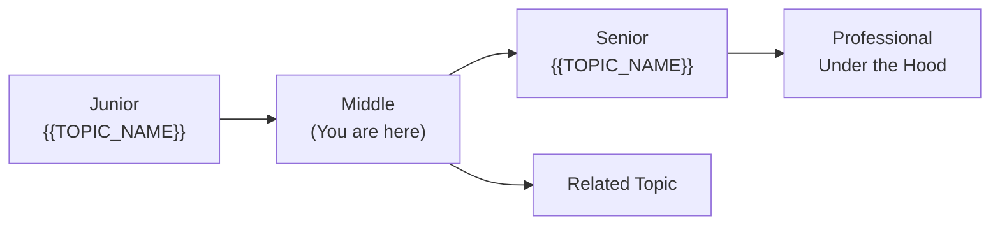

---

## Further Reading

- **Official docs:** [Go Documentation](https://pkg.go.dev)
- **Blog post:** [{{link title}}]({{url}}) — what you'll learn
- **Conference talk:** [{{link title}}]({{url}}) — key takeaways

---

## Related Topics

- **[{{Related Topic 1}}](../XX-related-topic/)** — how it connects
- **[{{Related Topic 2}}](../XX-related-topic/)** — how it connects

---

## Diagrams & Visual Aids

### Example — Flowchart


### Example — Sequence Diagram

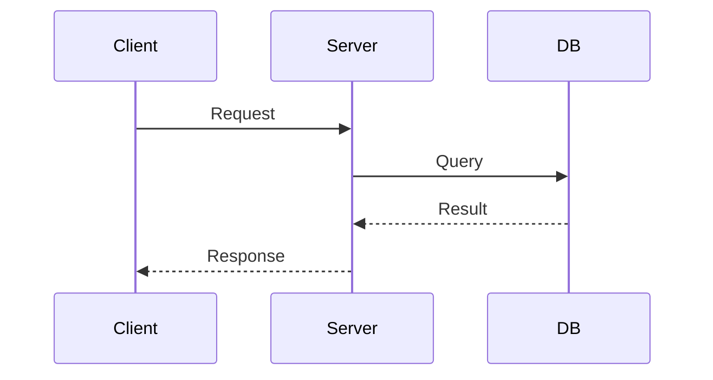

</details>

---
---

# TEMPLATE 3 — `senior.md`

<details open>
<summary><strong>Template Content</strong></summary>

# {{TOPIC_NAME}} — Senior Level

## Table of Contents

1. [Introduction](#introduction)
2. [Core Concepts](#core-concepts)
3. [Pros & Cons](#pros--cons)
4. [Use Cases](#use-cases)
5. [Code Examples](#code-examples)
6. [Coding Patterns](#coding-patterns)
7. [Clean Code](#clean-code)
8. [Best Practices](#best-practices)
9. [Product Use / Feature](#product-use--feature)
10. [Error Handling](#error-handling)
11. [Security Considerations](#security-considerations)
12. [Performance Optimization](#performance-optimization)
13. [Metrics & Analytics](#metrics--analytics)
14. [Debugging Guide](#debugging-guide)
15. [Edge Cases & Pitfalls](#edge-cases--pitfalls)
16. [Postmortems & System Failures](#postmortems--system-failures)
17. [Common Mistakes](#common-mistakes)
18. [Tricky Points](#tricky-points)
19. [Comparison with Other Languages](#comparison-with-other-languages)
20. [Test](#test)
21. [Tricky Questions](#tricky-questions)
22. [Cheat Sheet](#cheat-sheet)
23. [Summary](#summary)
24. [What You Can Build](#what-you-can-build)
25. [Further Reading](#further-reading)
26. [Related Topics](#related-topics)
27. [Diagrams & Visual Aids](#diagrams--visual-aids)

---

## Introduction

> Focus: "How to optimize?" and "How to architect?"

For developers who:
- Design systems and make architectural decisions
- Optimize performance-critical Go code
- Mentor junior/middle developers
- Review and improve codebases

---

## Core Concepts

### Concept 1: {{Architecture-level concept}}

Deep dive with:
- Design patterns and when to apply them
- Performance characteristics (Big-O, memory, allocations)
- Go-specific comparison with alternative approaches

```go
// Advanced Go pattern with detailed annotations
```

### Concept 2: {{Optimization concept}}

```go
func BenchmarkApproachA(b *testing.B) {
    for i := 0; i < b.N; i++ {
        // approach A
    }
}
func BenchmarkApproachB(b *testing.B) {
    for i := 0; i < b.N; i++ {
        // approach B
    }
}
```

Results:
```
BenchmarkApproachA-8    1000000    1024 ns/op    256 B/op    4 allocs/op
BenchmarkApproachB-8    5000000     205 ns/op      0 B/op    0 allocs/op
```

---

## Pros & Cons

### Strategic analysis for architectural decisions:

| Pros | Cons | Impact |
|------|------|--------|
| {{Advantage 1}} | {{Disadvantage 1}} | {{Impact on system architecture}} |
| {{Advantage 2}} | {{Disadvantage 2}} | {{Impact on team/maintenance}} |

### When Go's approach is the RIGHT choice:
- {{Scenario 1}}

### When Go's approach is the WRONG choice:
- {{Scenario 1}} — what to use instead

---

## Use Cases

- **Use Case 1:** {{System design scenario}}
- **Use Case 2:** {{Migration scenario}}
- **Use Case 3:** {{Optimization scenario — e.g., "Reducing GC pressure in hot paths"}}

---

## Code Examples

### Example 1: {{Architecture pattern}}

```go
// Full implementation of a production pattern
// With interfaces, DI, error handling, graceful shutdown
package main

import (
    "context"
    "fmt"
    "log"
    "os"
    "os/signal"
    "syscall"
)

type Repository interface {
    Get(ctx context.Context, id string) (interface{}, error)
}

type Service struct {
    repo Repository
    log  *log.Logger
}

func NewService(repo Repository) *Service {
    return &Service{repo: repo, log: log.New(os.Stdout, "svc: ", log.LstdFlags)}
}

func (s *Service) Process(ctx context.Context, id string) error {
    result, err := s.repo.Get(ctx, id)
    if err != nil {
        return fmt.Errorf("Service.Process: %w", err)
    }
    s.log.Printf("processed: %v", result)
    return nil
}

func main() {
    ctx, cancel := context.WithCancel(context.Background())
    defer cancel()

    sigCh := make(chan os.Signal, 1)
    signal.Notify(sigCh, syscall.SIGTERM, syscall.SIGINT)
    go func() { <-sigCh; cancel() }()

    _ = ctx
}
```

### Example 2: {{Performance optimization}}

```go
// Before optimization — sync.Mutex on every read
// After optimization — sync.RWMutex or sync.Map
```

> Show real optimization techniques: sync.Pool, buffer reuse, allocation avoidance.

---

## Coding Patterns

Architectural and advanced Go patterns for {{TOPIC_NAME}} in production systems:

### Pattern 1: {{Architectural pattern — e.g., CQRS, Circuit Breaker, Saga}}

**Category:** Architectural / Distributed Systems / Resilience
**Intent:** {{The system-level problem this pattern solves}}
**Trade-offs:** {{What you gain vs what complexity you add}}

**Architecture diagram:**

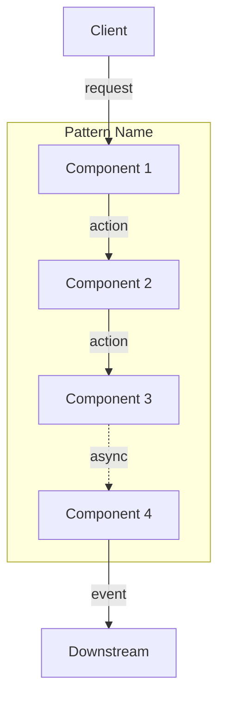

**Implementation:**

```go
// Senior-level Go implementation
// Full pattern with error handling, observability, graceful degradation
```

**When this pattern wins:**
- {{Scenario 1}}

**When to avoid:**
- {{Scenario where it adds unnecessary complexity}}

---

### Pattern 2: {{Go Concurrency pattern — Worker Pool, Fan-out/Fan-in}}

**Category:** Concurrency / Performance / Resource Management
**Intent:** {{What it optimizes}}

**Flow diagram:**

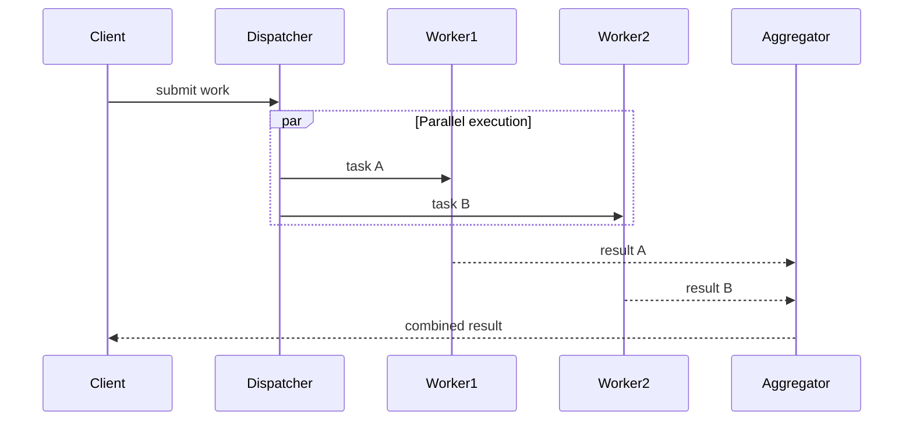

```go
// Go worker pool implementation
```

---

### Pattern 3: {{Resilience pattern — Circuit Breaker, Retry with backoff}}

**Category:** Resilience / Reliability
**Intent:** {{How it improves system reliability}}

**State diagram:**

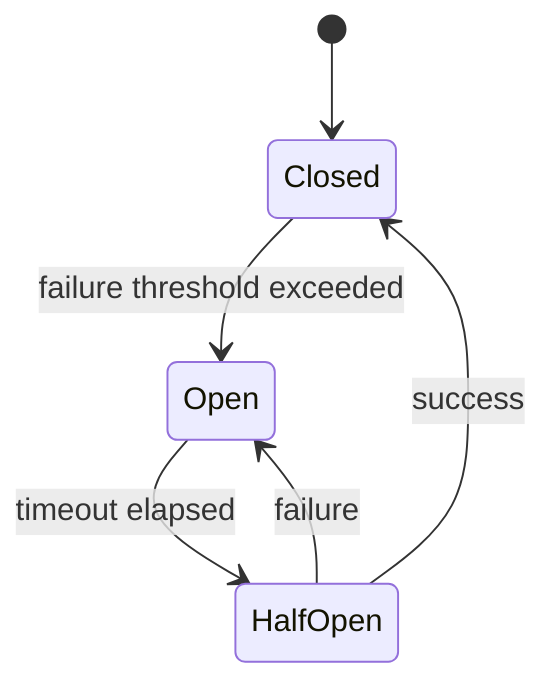

```go
// Go production implementation with metrics and observability
```

---

### Pattern 4: {{Go-specific pattern — functional options, error group, context propagation}}

**Category:** Idiomatic Go / API Design
**Intent:** {{What Go-specific problem this solves}}

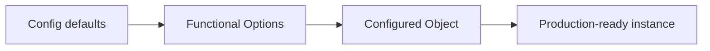

```go
// Functional options pattern — idiomatic Go
type Server struct {
    addr    string
    timeout time.Duration
}

type Option func(*Server)

func WithAddr(addr string) Option {
    return func(s *Server) { s.addr = addr }
}

func NewServer(opts ...Option) *Server {
    s := &Server{addr: ":8080", timeout: 30 * time.Second}
    for _, o := range opts {
        o(s)
    }
    return s
}
```

### Pattern Comparison Matrix

| Pattern | Use When | Avoid When | Complexity |
|---------|----------|------------|------------|
| {{Pattern 1}} | {{condition}} | {{condition}} | Low/Med/High |
| {{Pattern 2}} | {{condition}} | {{condition}} | Low/Med/High |
| {{Pattern 3}} | {{condition}} | {{condition}} | Low/Med/High |
| {{Pattern 4}} | {{condition}} | {{condition}} | Low/Med/High |

---

## Clean Code

Senior-level clean code: architecture, maintainability, and team standards for Go:

### Clean Architecture Boundaries

```go
// Layering violation — business logic calls infrastructure
type OrderService struct{ db *sql.DB }

// Dependency inversion — depend on abstractions
type OrderRepository interface{ Save(Order) error }
type OrderService    struct{ repo OrderRepository }
```

**Dependency flow must be:**
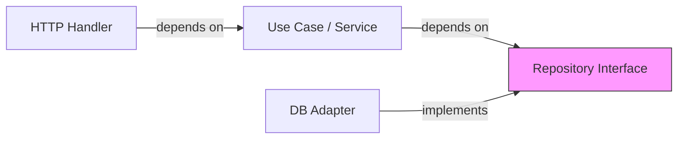

---

### Code Smells at Senior Level

| Smell | Symptom | Refactoring |
|-------|---------|-------------|
| **God Object** | One struct with 20+ methods | Split by responsibility |
| **Primitive Obsession** | `string` for email, `int` for money | Wrap in value objects |
| **Shotgun Surgery** | Change 1 feature → edit 10 files | Move cohesive logic together |
| **Feature Envy** | Method uses another type's data more than its own | Move method to that type |
| **Data Clumps** | Same 3+ fields always appear together | Extract into a struct |

---

### Maintainability Rules

```go
// Package with mixed concerns
package util // contains: string helpers, DB utils, HTTP middleware, math functions

// Cohesive packages
package stringutil // only string operations
package middleware // only HTTP middleware
```

---

### Code Review Checklist (Senior)

- [ ] No business logic in HTTP handlers or DB adapters
- [ ] All public interfaces are documented
- [ ] No global mutable state
- [ ] Error messages include enough context to debug
- [ ] No magic numbers/strings — all constants named and documented
- [ ] Functions have single responsibility

---

## Best Practices

Production best practices for {{TOPIC_NAME}} — battle-tested Go rules:

### Must Do ✅

1. **Use context for cancellation and deadlines** — propagate through all call chains
   ```go
   func doWork(ctx context.Context) error {
       select {
       case <-ctx.Done():
           return ctx.Err()
       default:
           return nil
       }
   }
   ```

2. **Wrap errors with `fmt.Errorf("context: %w", err)`** — enables `errors.Is` and `errors.As`
   ```go
   if err != nil {
       return fmt.Errorf("service.Process id=%s: %w", id, err)
   }
   ```

3. **Use table-driven tests** — scales easily as cases grow
   ```go
   cases := []struct{ input, want string }{{"a", "A"}, {"b", "B"}}
   for _, tc := range cases {
       if got := toUpper(tc.input); got != tc.want {
           t.Errorf("toUpper(%q) = %q, want %q", tc.input, got, tc.want)
       }
   }
   ```

4. **Prefer interfaces at the call site** — accept interfaces, return concrete types
   ```go
   func NewHandler(repo Repository) *Handler { ... } // good
   func NewHandler(repo *PostgresRepo) *Handler { ... } // bad
   ```

5. **All goroutines must have a defined exit path** — prevent goroutine leaks

### Never Do ❌

1. **Never ignore errors** — silent failures cause mysterious production bugs
   ```go
   // Wrong
   os.Remove(tmpFile)
   // Correct
   if err := os.Remove(tmpFile); err != nil && !os.IsNotExist(err) {
       log.Printf("cleanup failed: %v", err)
   }
   ```

2. **Never use `init()` for side effects** — makes testing and reasoning hard

3. **Never share memory between goroutines without synchronization** — use channels or sync primitives

### Go Production Checklist

- [ ] All goroutines have a defined exit path (no goroutine leaks)
- [ ] All channels are closed by their producer
- [ ] Context cancellation is respected everywhere
- [ ] All external calls have timeouts (`context.WithTimeout`)
- [ ] Structured logging with correlation IDs
- [ ] Graceful shutdown implemented (SIGTERM handler)
- [ ] Health check and readiness endpoints
- [ ] Metrics exposed via `/metrics` (Prometheus)
- [ ] Race detector run in CI (`go test -race ./...`)
- [ ] `go vet` and `staticcheck` pass in CI

---

## Product Use / Feature

### 1. {{Company/Product Name}}

- **Architecture:** How they implement {{TOPIC_NAME}} at scale
- **Scale:** Specific numbers (rps, data volume, latency requirements)
- **Lessons learned:** What they changed and why

---

## Error Handling

### Strategy 1: Domain error hierarchy

```go
type DomainError struct {
    Code       string
    Message    string
    StatusCode int
    Err        error
    Metadata   map[string]string
}

func (e *DomainError) Error() string { return e.Message }
func (e *DomainError) Unwrap() error { return e.Err }
```

### Error Handling Architecture

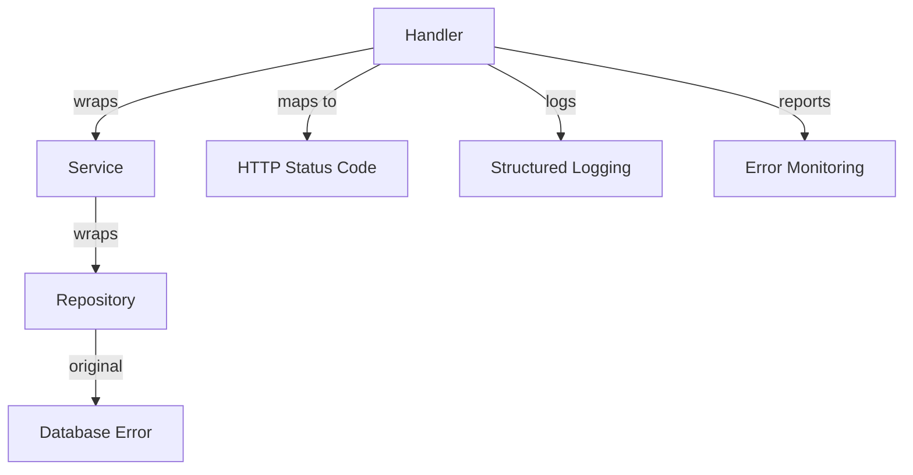

---

## Security Considerations

### Security Architecture Checklist

- [ ] Input validation — validate at system boundaries
- [ ] Output encoding — prevent injection in responses
- [ ] Authentication — verify identity correctly
- [ ] Authorization — check permissions at every level
- [ ] Secrets management — no hardcoded credentials, use env vars or vault
- [ ] Audit logging — track security-relevant events
- [ ] Rate limiting — prevent abuse
- [ ] Dependency scanning — `govulncheck ./...`

### Threat Model

| Threat | Likelihood | Impact | Mitigation |
|--------|:---------:|:------:|------------|
| {{Threat 1}} | High | Critical | {{mitigation}} |
| {{Threat 2}} | Medium | High | {{mitigation}} |

---

## Performance Optimization

### Optimization 1: {{name}}

```go
// Before — profiling shows this is a bottleneck
func slowFunction() {}

// After — significant improvement
func fastFunction() {}
```

**Profiling evidence:**
```bash
go tool pprof -http=:8080 cpu.prof
```

**Benchmark proof:**
```
BenchmarkSlow-8    100000    15234 ns/op    4096 B/op    10 allocs/op
BenchmarkFast-8    500000     3041 ns/op     256 B/op     1 allocs/op
```

### Performance Architecture

| Layer | Optimization | Impact | Cost |
|:-----:|:------------|:------:|:----:|
| **Algorithm** | {{approach}} | Highest | Requires redesign |
| **Data structure** | {{approach}} | High | Moderate refactor |
| **Memory** | sync.Pool, pre-allocation | Medium | Low effort |
| **I/O** | bufio, connection pooling | Varies | May need infra changes |

---

## Debugging Guide

### Advanced Tools & Techniques

| Tool | Use case | When to use |
|------|----------|-------------|
| `go tool pprof` | CPU/memory profiling | Performance issues |
| `go tool trace` | Execution tracing | Concurrency issues |
| `go build -race` | Race detection | Data race debugging |
| `delve` | Step-by-step debugging | Complex logic bugs |
| `GOSSAFUNC=fn go build` | View SSA | Compiler optimization analysis |

---

## Edge Cases & Pitfalls

### Pitfall 1: {{Scale pitfall}}

```go
// Code that works fine until 10K connections / 1M records
```

**At what scale it breaks:** Specific numbers.
**Root cause:** Why it fails.
**Solution:** Architecture-level fix.

---

## Postmortems & System Failures

### The {{Company/System}} Outage

- **The goal:** {{What they were trying to achieve}}
- **The mistake:** {{How they misused this topic/feature}}
- **The impact:** {{Downtime, data loss, degraded performance}}
- **The fix:** {{How they solved it permanently}}

**Key takeaway:** {{Architectural lesson learned}}

---

## Common Mistakes

### Mistake 1: {{Architectural anti-pattern}}

```go
// Common but wrong architecture
// ...

// Better approach
// ...
```

---

## Tricky Points

### Tricky Point 1: {{Go spec subtlety}}

```go
// Code that exploits a subtle Go specification detail
```

**Go spec reference:** Link or quote from spec.
**Why this matters:** Real-world impact.

---

## Comparison with Other Languages

| Aspect | Go | Rust | Java | C++ |
|--------|:---:|:----:|:----:|:---:|
| {{Aspect 1}} | {{approach}} | {{approach}} | {{approach}} | {{approach}} |
| {{Aspect 2}} | ... | ... | ... | ... |

### When Go's approach wins:
- {{scenario where Go's design is ideal}}

### When Go's approach loses:
- {{scenario where another language handles this better}}

---

## Test

### Architecture Questions

**1. You're designing {{system}}. Which approach is best and why?**

<details>
<summary>Answer</summary>
Full architectural reasoning.
</details>

### Performance Analysis

**2. This function allocates too much. How would you optimize it?**

```go
// code with allocation issues
```

<details>
<summary>Answer</summary>
Step-by-step optimization with benchmark results.
</details>

---

## Tricky Questions

**1. {{Question that even experienced Go developers get wrong}}?**

<details>
<summary>Answer</summary>
Detailed explanation with Go spec reference and benchmark proof.
</details>

---

## "What If?" Scenarios (Architecture)

**What if {{Disaster scenario}}?**
- **Expected failure mode:** {{How the system should ideally degrade}}
- **Worst-case scenario:** {{What usually happens if poorly designed}}
- **Mitigation:** {{How to handle it}}

---

## Cheat Sheet

### Architecture Decision Matrix

| Scenario | Recommended pattern | Avoid | Why |
|----------|-------------------|-------|-----|
| {{scenario 1}} | {{pattern}} | {{anti-pattern}} | {{reasoning}} |

### Heuristics & Rules of Thumb

- **The Profiling Rule:** Never optimize without `go tool pprof` evidence first.
- **The Interface Rule:** Accept interfaces, return concrete types.
- **The Goroutine Rule:** Every goroutine needs an owner responsible for its lifecycle.

---

## Summary

- Key architectural insight 1
- Key performance insight 2
- Key leadership insight 3

**Senior mindset:** Not just "how" but "when", "why", and "what are the trade-offs".

---

## What You Can Build

### Career impact:
- **Staff/Principal Engineer** — system design interviews require this depth
- **Tech Lead** — mentor others on {{TOPIC_NAME}} architectural decisions
- **Open Source Maintainer** — contribute to Go ecosystem

---

## Further Reading

- **Go proposal:** [{{proposal title}}]({{url}}) — context on design decision
- **Conference talk:** [{{talk title}}]({{url}}) — key insights
- **Source code:** [Go runtime](https://github.com/golang/go/tree/master/src/runtime)
- **Book:** "100 Go Mistakes and How to Avoid Them" — relevant chapter

---

## Diagrams & Visual Aids

### Example — Flowchart


</details>

---
---

# TEMPLATE 4 — `professional.md`

<details open>
<summary><strong>Template Content</strong></summary>

# {{TOPIC_NAME}} — Under the Hood

## Table of Contents

1. [Introduction](#introduction)
2. [How It Works Internally](#how-it-works-internally)
3. [Runtime Deep Dive](#runtime-deep-dive)
4. [Compiler Perspective](#compiler-perspective)
5. [Memory Layout](#memory-layout)
6. [OS / Syscall Level](#os--syscall-level)
7. [Source Code Walkthrough](#source-code-walkthrough)
8. [Assembly Output Analysis](#assembly-output-analysis)
9. [Performance Internals](#performance-internals)
10. [Edge Cases at the Lowest Level](#edge-cases-at-the-lowest-level)
11. [Test](#test)
12. [Tricky Questions](#tricky-questions)
13. [Summary](#summary)
14. [Further Reading](#further-reading)
15. [Diagrams & Visual Aids](#diagrams--visual-aids)

---

## Introduction

> Focus: "What happens under the hood?"

This document explores what Go does internally when you use {{TOPIC_NAME}}.
For developers who want to understand:
- What the compiler generates
- How the Go runtime manages it
- What syscalls are made
- How memory is laid out

---

## How It Works Internally

Step-by-step breakdown of what happens when Go executes {{feature}}:

1. **Source code** → What you write
2. **AST** → How compiler parses it
3. **SSA** → Intermediate representation
4. **Machine code** → What actually runs
5. **Go Runtime** → What manages it at runtime

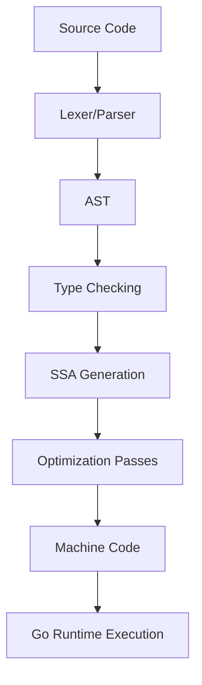

---

## Runtime Deep Dive

### How Go Runtime handles {{feature}}

```go
// Reference to Go runtime source code
// e.g., runtime/proc.go, runtime/chan.go, runtime/slice.go
```

**Key runtime structures:**

```go
// From Go source: runtime/{{file}}.go
type internalStruct struct {
    // fields with explanations
}
```

**Key Go runtime functions:**
- `runtime.{{func1}}()` — what it does
- `runtime.{{func2}}()` — when it's called

---

## Compiler Perspective

What the Go compiler does with this feature:

```bash
# View compiler decisions (escape analysis, inlining)
go build -gcflags="-m -m" main.go

# View SSA intermediate representation
GOSSAFUNC=main go build main.go
# Opens ssa.html in browser
```

**Compiler optimizations applied:**
- Inlining decisions
- Escape analysis results
- Dead code elimination

---

## Memory Layout

How this feature is represented in memory:

```
┌──────────┬──────────┬──────────┐
│  Field 1 │  Field 2 │  Field 3 │
│  8 bytes │  8 bytes │  8 bytes │
└──────────┴──────────┴──────────┘
```

```go
import "unsafe"

// Verify sizes and offsets
fmt.Println(unsafe.Sizeof(x))         // total size in bytes
fmt.Println(unsafe.Alignof(x))        // alignment requirement
fmt.Println(unsafe.Offsetof(x.Field)) // field offset
```

---

## OS / Syscall Level

What system calls are involved:

```bash
# Trace syscalls on Linux
strace -f ./myprogram

# On macOS
dtruss ./myprogram
```

**Key syscalls:**
- `{{syscall1}}` — when and why
- `{{syscall2}}` — when and why

---

## Source Code Walkthrough

Walking through the actual Go source code:

**File:** `src/runtime/{{file}}.go`

```go
// Annotated excerpt from Go source code
// with line-by-line explanation
```

> Reference specific Go version (e.g., go1.22) since internals change.

---

## Assembly Output Analysis

```bash
go build -gcflags="-S" main.go
# or
go tool objdump -s "main.main" ./binary
```

```asm
; Key assembly instructions with explanations
TEXT main.main(SB)
    MOVQ    ...    ; explanation
    CALL    ...    ; explanation
```

**What to look for:**
- Number of instructions
- Stack frame size
- Heap allocations (calls to `runtime.newobject`)
- Function call overhead

---

## Performance Internals

### Benchmarks with profiling

```go
func BenchmarkFeature(b *testing.B) {
    for i := 0; i < b.N; i++ {
        // benchmark code
    }
}
```

```bash
go test -bench=. -benchmem -cpuprofile=cpu.prof
go tool pprof cpu.prof
```

**Internal performance characteristics:**
- Allocation count and size
- Cache line behavior
- Branch prediction impact
- GC pressure

---

## Metrics & Analytics (Runtime Level)

### Go Runtime Metrics for {{TOPIC_NAME}}

```go
import (
    "runtime"
    "runtime/metrics"
)

// Read runtime memory stats (causes STW — avoid in hot paths)
var ms runtime.MemStats
runtime.ReadMemStats(&ms)
// Relevant fields: ms.HeapAlloc, ms.NumGC, ms.PauseTotalNs

// New API (Go 1.16+): runtime/metrics — no STW
samples := []metrics.Sample{
    {Name: "/memory/classes/heap/objects:bytes"},
    {Name: "/gc/cycles/total:gc-cycles"},
    {Name: "/sched/goroutines:goroutines"},
}
metrics.Read(samples)
```

### Key Runtime Metrics for This Feature

| Metric path | What it measures | Impact of {{TOPIC_NAME}} |
|-------------|-----------------|--------------------------|
| `/memory/classes/heap/objects:bytes` | Live heap objects | {{how this feature affects it}} |
| `/gc/cycles/total:gc-cycles` | GC frequency | {{how this feature affects it}} |
| `/sched/goroutines:goroutines` | Goroutine count | {{how this feature affects it}} |
| `/sched/latencies:seconds` | Goroutine schedule delay | {{how this feature affects it}} |

---

## Edge Cases at the Lowest Level

### Edge Case 1: {{name}}

What happens internally when {{extreme scenario}}:

```go
// Code that pushes Go runtime limits
```

**Internal behavior:** Step-by-step of what Go runtime does.
**Why it matters:** Impact on production systems.

---

## Test

### Internal Knowledge Questions

**1. What Go runtime function is called when {{action}}?**

<details>
<summary>Answer</summary>
`runtime.{{func}}()` — explanation of what it does and when it's triggered.
</details>

**2. What does this assembly output tell you?**

```asm
; assembly snippet
```

<details>
<summary>Answer</summary>
Analysis of the assembly instructions.
</details>

---

## Tricky Questions

**1. {{Question about Go internal behavior that contradicts common assumptions}}?**

<details>
<summary>Answer</summary>
Explanation with proof (benchmark, assembly output, or Go runtime source reference).
</details>

---

## Summary

- Internal mechanism 1
- Internal mechanism 2
- Internal mechanism 3

**Key takeaway:** Understanding Go internals helps you write faster, more predictable Go code.

---

## Further Reading

- **Go source:** [runtime package](https://github.com/golang/go/blob/master/src/runtime/)
- **Design doc:** [{{proposal title}}]({{url}})
- **Conference talk:** [{{GopherCon talk}}]({{url}})
- **Book:** "Go Internals" — chapter on Go runtime

---

## Diagrams & Visual Aids

### Go Compiler Pipeline

```mermaid
flowchart TD
    A[.go source] --> B[gc parser]
    B --> C[AST]
    C --> D[Type checker]
    D --> E[SSA]
    E --> F[Optimization passes]
    F --> G[Machine code]
    G --> H[Linker]
    H --> I[Binary]
```

### Example — ASCII Memory Layout

```
+------------------+
|   Stack Frame    |
|------------------|
| local_var1: 42   |  <- 8 bytes
| local_var2: &obj |  <- 8 bytes (pointer)
+------------------+
        |
        v
+------------------+
|   Heap Object    |
|------------------|
| field1: "hello"  |
| field2: 3.14     |
+------------------+
```

</details>

---
---

# TEMPLATE 5 — `interview.md`

<details open>
<summary><strong>Template Content</strong></summary>

# {{TOPIC_NAME}} — Interview Questions

## Table of Contents

1. [Junior Level](#junior-level)
2. [Middle Level](#middle-level)
3. [Senior Level](#senior-level)
4. [Scenario-Based Questions](#scenario-based-questions)
5. [FAQ](#faq)

---

## Junior Level

### 1. {{Basic conceptual question}}?

**Answer:**
Clear, concise explanation that a junior should be able to give.

---

### 2. {{Another basic question}}?

**Answer:**
...

### 3. {{Practical basic question with code}}?

**Answer:**
```go
// Code example
package main
import "fmt"
func main() { fmt.Println("example") }
```

> 5-7 junior questions. Test basic understanding and terminology.

---

## Middle Level

### 4. {{Question about practical application}}?

**Answer:**
Detailed answer with real-world context.

```go
// Code example if applicable
```

---

### 5. {{Question about trade-offs}}?

**Answer:**
...

---

### 6. {{Question about debugging/troubleshooting}}?

**Answer:**
...

> 4-6 middle questions. Test practical experience and decision-making.

---

## Senior Level

### 7. {{Architecture/design question}}?

**Answer:**
Comprehensive answer covering trade-offs, alternatives, and decision criteria.

---

### 8. {{Performance/optimization question}}?

**Answer:**
```
BenchmarkA-8    100000    1234 ns/op    256 B/op    2 allocs/op
BenchmarkB-8    500000     204 ns/op      0 B/op    0 allocs/op
```

---

### 9. {{System design question involving this Go topic}}?

**Answer:**
...

> 4-6 senior questions. Test deep understanding and leadership ability.

---

## Scenario-Based Questions

### 10. {{Real-world scenario}}. How do you approach this?

**Answer:**
Step-by-step approach:
1. ...
2. ...
3. ...

---

## FAQ

### Q: What do interviewers actually look for in Go answers about {{TOPIC_NAME}}?

**A:** Key evaluation criteria:
- {{What demonstrates junior-level understanding}}
- {{What demonstrates middle-level understanding}}
- {{What demonstrates senior-level understanding — e.g., mentioning GC impact, escape analysis, or race conditions}}

</details>

---
---

# TEMPLATE 6 — `tasks.md`

<details open>
<summary><strong>Template Content</strong></summary>

# {{TOPIC_NAME}} — Practical Tasks

## Table of Contents

1. [Junior Tasks](#junior-tasks)
2. [Middle Tasks](#middle-tasks)
3. [Senior Tasks](#senior-tasks)
4. [Questions](#questions)
5. [Mini Projects](#mini-projects)
6. [Challenge](#challenge)

---

## Junior Tasks

### Task 1: {{Simple coding task title}}

**Type:** Code

**Goal:** {{What skill this practices}}

**Starter code:**

```go
package main

import "fmt"

// TODO: Complete this function
func solve() {
    fmt.Println("TODO")
}

func main() {
    solve()
}
```

**Expected output:**
```
...
```

**Evaluation criteria:**
- [ ] Code compiles and runs
- [ ] Output matches expected
- [ ] {{Specific check}}

---

### Task 2: {{Design task title}}

**Type:** Design

**Deliverable:** Architecture diagram or flowchart

```mermaid
graph TD
    A[Start] --> B[Step 1]
    B --> C[Step 2]
```

---

## Middle Tasks

### Task 3: {{Production-oriented coding task}}

**Type:** Code

**Requirements:**
- [ ] {{Requirement 1}}
- [ ] Write tests for your solution
- [ ] Handle errors properly using Go idioms (`fmt.Errorf("...: %w", err)`)

---

## Senior Tasks

### Task 4: {{Architecture/optimization task}}

**Type:** Code

**Provided code to review/optimize:**

```go
package main

// Sub-optimal code that needs improvement
func slowProcess(data []string) []string {
    result := []string{}
    for _, item := range data {
        result = append(result, item) // no pre-allocation
    }
    return result
}
```

**Requirements:**
- [ ] Benchmark your solution with `go test -bench=. -benchmem`
- [ ] Document trade-offs

---

## Questions

### 1. {{Conceptual question}}?

**Answer:**
Clear explanation covering the key concept.

---

## Mini Projects

### Project 1: {{Larger project combining concepts}}

**Requirements:**
- [ ] {{Feature 1}}
- [ ] Tests with >80% coverage
- [ ] README with `go run` / `go test` instructions

**Difficulty:** Junior / Middle / Senior
**Estimated time:** X hours

---

## Challenge

### {{Hard challenge}}

**Constraints:**
- Must run in under X ms
- Memory usage under X MB
- No external libraries (stdlib only)

**Scoring:**
- Correctness: 50%
- Performance (benchmarks): 30%
- Code quality (go vet, readability): 20%

</details>

---
---

# TEMPLATE 7 — `find-bug.md`

<details open>
<summary><strong>Template Content</strong></summary>

# {{TOPIC_NAME}} — Find the Bug

> **Practice finding and fixing bugs in Go code related to {{TOPIC_NAME}}.**

---

## How to Use

1. Read the buggy code carefully
2. Try to find the bug **without** looking at the hint
3. Write the fix yourself before checking the solution
4. Understand **why** the bug happens — not just how to fix it

### Difficulty Levels

| Level | Description |
|:-----:|:-----------|
| 🟢 | **Easy** — Common beginner Go mistakes, syntax-level bugs |
| 🟡 | **Medium** — Logic errors, subtle Go behavior, concurrency issues |
| 🔴 | **Hard** — Race conditions, memory issues, Go compiler/runtime edge cases |

---

## Bug 1: {{Bug title}} 🟢

**What the code should do:** {{Expected behavior}}

```go
package main

import "fmt"

func main() {
    // Buggy Go code here
    fmt.Println("...")
}
```

**Expected output:**
```
...
```

**Actual output:**
```
...
```

<details>
<summary>Hint</summary>
Look at {{specific area}} — what happens when {{condition}}?
</details>

<details>
<summary>Bug Explanation</summary>

**Bug:** {{What exactly is wrong}}
**Why it happens:** {{Root cause — reference to Go spec or runtime behavior if relevant}}
**Impact:** {{What goes wrong — wrong output, panic, data race, memory leak, etc.}}

</details>

<details>
<summary>Fixed Code</summary>

```go
package main

import "fmt"

func main() {
    // Fixed Go code with comments explaining the fix
    fmt.Println("...")
}
```

**What changed:** {{One-line summary of the fix}}

</details>

---

## Bug 2: {{Bug title}} 🟢

**What the code should do:** {{Expected behavior}}

```go
// Buggy code
```

<details>
<summary>Hint</summary>
...
</details>

<details>
<summary>Bug Explanation</summary>

**Bug:** ...
**Why it happens:** ...
**Impact:** ...

</details>

<details>
<summary>Fixed Code</summary>

```go
// Fixed code
```

**What changed:** ...

</details>

---

## Bug 3: {{Bug title}} 🟢

**What the code should do:** {{Expected behavior}}

```go
// Buggy code
```

<details>
<summary>Hint</summary>
...
</details>

<details>
<summary>Bug Explanation</summary>

**Bug:** ...
**Why it happens:** ...
**Impact:** ...

</details>

<details>
<summary>Fixed Code</summary>

```go
// Fixed code
```

**What changed:** ...

</details>

---

## Bug 4: {{Bug title}} 🟡

**What the code should do:** {{Expected behavior}}

```go
// Buggy code — medium difficulty Go logic error
```

<details>
<summary>Hint</summary>
...
</details>

<details>
<summary>Bug Explanation</summary>

**Bug:** ...
**Why it happens:** ...
**Impact:** ...

</details>

<details>
<summary>Fixed Code</summary>

```go
// Fixed code
```

**What changed:** ...

</details>

---

## Bug 5: {{Bug title}} 🟡

**What the code should do:** {{Expected behavior}}

```go
// Buggy code — involves {{TOPIC_NAME}} specific Go behavior
```

<details>
<summary>Hint</summary>
...
</details>

<details>
<summary>Bug Explanation</summary>

**Bug:** ...
**Why it happens:** ...
**Impact:** ...

</details>

<details>
<summary>Fixed Code</summary>

```go
// Fixed code
```

**What changed:** ...

</details>

---

## Bug 6: {{Bug title}} 🟡

**What the code should do:** {{Expected behavior}}

```go
// Buggy code — real-world Go production pattern with a bug
```

<details>
<summary>Hint</summary>
...
</details>

<details>
<summary>Bug Explanation</summary>

**Bug:** ...
**Why it happens:** ...
**Impact:** ...

</details>

<details>
<summary>Fixed Code</summary>

```go
// Fixed code
```

**What changed:** ...

</details>

---

## Bug 7: {{Bug title}} 🟡

**What the code should do:** {{Expected behavior}}

```go
// Buggy code — Go concurrency or memory related
```

<details>
<summary>Hint</summary>
...
</details>

<details>
<summary>Bug Explanation</summary>

**Bug:** ...
**Why it happens:** ...
**Impact:** ...

</details>

<details>
<summary>Fixed Code</summary>

```go
// Fixed code
```

**What changed:** ...

</details>

---

## Bug 8: {{Bug title}} 🔴

**What the code should do:** {{Expected behavior}}

```go
// Buggy code — hard to spot
// Involves race condition, compiler optimization, or Go runtime edge case
```

**Expected output:**
```
...
```

**Actual output:**
```
... (or: unpredictable / panic / deadlock)
```

<details>
<summary>Hint</summary>
Run with `go run -race main.go` or think about {{specific Go runtime behavior}}.
</details>

<details>
<summary>Bug Explanation</summary>

**Bug:** ...
**Why it happens:** ...
**Impact:** ...
**Go spec reference:** {{link or quote from Go spec if applicable}}

</details>

<details>
<summary>Fixed Code</summary>

```go
// Fixed code with detailed comments
```

**What changed:** ...
**Alternative fix:** {{Another valid Go approach if exists}}

</details>

---

## Bug 9: {{Bug title}} 🔴

**What the code should do:** {{Expected behavior}}

```go
// Buggy code — architecture-level bug
// Works in Go tests but fails in production
```

<details>
<summary>Hint</summary>
...
</details>

<details>
<summary>Bug Explanation</summary>

**Bug:** ...
**Why it happens:** ...
**Impact:** ...
**How to detect:** {{Go tool — race detector, pprof, strace, etc.}}

</details>

<details>
<summary>Fixed Code</summary>

```go
// Fixed code
```

**What changed:** ...

</details>

---

## Bug 10: {{Bug title}} 🔴

**What the code should do:** {{Expected behavior}}

```go
// Buggy code — the hardest one
// Multiple subtle issues or a single very tricky Go bug
```

<details>
<summary>Hint</summary>
...
</details>

<details>
<summary>Bug Explanation</summary>

**Bug:** ...
**Why it happens:** ...
**Impact:** ...

</details>

<details>
<summary>Fixed Code</summary>

```go
// Fixed code
```

**What changed:** ...

</details>

---

## Score Card

| Bug | Difficulty | Found without hint? | Understood why? | Fixed correctly? |
|:---:|:---------:|:-------------------:|:---------------:|:----------------:|
| 1 | 🟢 | ☐ | ☐ | ☐ |
| 2 | 🟢 | ☐ | ☐ | ☐ |
| 3 | 🟢 | ☐ | ☐ | ☐ |
| 4 | 🟡 | ☐ | ☐ | ☐ |
| 5 | 🟡 | ☐ | ☐ | ☐ |
| 6 | 🟡 | ☐ | ☐ | ☐ |
| 7 | 🟡 | ☐ | ☐ | ☐ |
| 8 | 🔴 | ☐ | ☐ | ☐ |
| 9 | 🔴 | ☐ | ☐ | ☐ |
| 10 | 🔴 | ☐ | ☐ | ☐ |

### Rating:
- **10/10 without hints** → Senior-level Go debugging skills
- **7-9/10** → Solid Go middle-level understanding
- **4-6/10** → Good junior, keep practicing Go
- **< 4/10** → Review the topic fundamentals first

</details>

---
---

# TEMPLATE 8 — `optimize.md`

<details open>
<summary><strong>Template Content</strong></summary>

# {{TOPIC_NAME}} — Optimize the Code

> **Practice optimizing slow, inefficient, or resource-heavy Go code related to {{TOPIC_NAME}}.**

---

## How to Use

1. Read the slow code and understand what it does
2. Identify the performance bottleneck
3. Write your optimized version
4. Run `go test -bench=. -benchmem` to compare
5. Understand **why** the optimization works

### Difficulty Levels

| Level | Focus |
|:-----:|:------|
| 🟢 | **Easy** — Obvious inefficiencies, simple Go fixes |
| 🟡 | **Medium** — Algorithmic improvements, allocation reduction |
| 🔴 | **Hard** — Cache-aware code, zero-allocation Go patterns, runtime-level optimizations |

### Optimization Categories

| Category | Icon | Description |
|:--------:|:----:|:-----------|
| **Memory** | 📦 | Reduce Go allocations, reuse buffers, avoid copies |
| **CPU** | ⚡ | Better algorithms, fewer operations, cache efficiency |
| **Concurrency** | 🔄 | Better Go parallelism, reduce contention, avoid locks |
| **I/O** | 💾 | Batch operations, buffering, connection reuse |

---

## Exercise 1: {{Title}} 🟢 📦

**What the code does:** {{Brief description}}
**The problem:** {{What's slow/inefficient — e.g., "Too many allocations in a hot loop"}}

```go
package main

// Slow version — works correctly but wastes Go heap allocations
func slowFunction() {
    // Inefficient Go code here
}
```

**Current benchmark:**
```
BenchmarkSlow-8    100000    15234 ns/op    4096 B/op    10 allocs/op
```

<details>
<summary>Hint</summary>
Think about {{Go optimization technique}} — what gets allocated on every call?
</details>

<details>
<summary>Optimized Code</summary>

```go
package main

// Fast version — same behavior, better Go performance
func fastFunction() {
    // Optimized code with comments explaining each change
}
```

**What changed:**
- {{Change 1}} — why it helps
- {{Change 2}} — why it helps

**Optimized benchmark:**
```
BenchmarkFast-8    500000     2041 ns/op       0 B/op     0 allocs/op
```

**Improvement:** {{X}}x faster, {{Y}}% less memory, {{Z}} fewer allocations

</details>

<details>
<summary>Learn More</summary>

**Why this works:** {{Detailed explanation of the Go optimization principle}}
**When to apply:** {{Scenarios where this Go optimization matters}}
**When NOT to apply:** {{Scenarios where Go readability is more important}}

</details>

---

## Exercise 2: {{Title}} 🟢 ⚡

**What the code does:** {{Brief description}}
**The problem:** {{What's slow}}

```go
// Slow version
```

**Current benchmark:**
```
BenchmarkSlow-8    ...
```

<details>
<summary>Hint</summary>
...
</details>

<details>
<summary>Optimized Code</summary>

```go
// Fast version
```

**Optimized benchmark:**
```
BenchmarkFast-8    ...
```

</details>

---

## Exercise 3: {{Title}} 🟢 📦

**What the code does:** {{Brief description}}
**The problem:** {{What's slow}}

```go
// Slow version
```

<details>
<summary>Hint</summary>
...
</details>

<details>
<summary>Optimized Code</summary>

```go
// Fast version
```

</details>

---

## Exercise 4: {{Title}} 🟡 📦

**What the code does:** {{Brief description}}
**The problem:** {{What's slow — medium difficulty}}

```go
// Slow version — allocation-heavy or algorithmically suboptimal
```

**Current benchmark:**
```
BenchmarkSlow-8    ...
```

<details>
<summary>Hint</summary>
...
</details>

<details>
<summary>Optimized Code</summary>

```go
// Fast version
```

**Optimized benchmark:**
```
BenchmarkFast-8    ...
```

</details>

---

## Exercise 5: {{Title}} 🟡 ⚡

**What the code does:** {{Brief description}}
**The problem:** {{What's slow}}

```go
// Slow version
```

<details>
<summary>Hint</summary>
...
</details>

<details>
<summary>Optimized Code</summary>

```go
// Fast version
```

</details>

---

## Exercise 6: {{Title}} 🟡 🔄

**What the code does:** {{Brief description}}
**The problem:** {{Go concurrency inefficiency — lock contention, goroutine overhead}}

```go
// Slow version — bad Go concurrency pattern
```

<details>
<summary>Hint</summary>
...
</details>

<details>
<summary>Optimized Code</summary>

```go
// Fast version — better Go concurrency pattern
```

</details>

---

## Exercise 7: {{Title}} 🟡 💾

**What the code does:** {{Brief description}}
**The problem:** {{I/O inefficiency in Go}}

```go
// Slow version — unbuffered or unbatched I/O
```

<details>
<summary>Hint</summary>
...
</details>

<details>
<summary>Optimized Code</summary>

```go
// Fast version — use bufio.Writer / bufio.Reader
```

</details>

---

## Exercise 8: {{Title}} 🔴 📦

**What the code does:** {{Brief description}}
**The problem:** {{Deep Go optimization needed — zero-allocation, cache-line aware}}

```go
// Slow version — looks reasonable but has hidden Go performance issues
```

**Current benchmark:**
```
BenchmarkSlow-8    ...
```

**Profiling output:**
```
go tool pprof shows: {{what the profile reveals}}
```

<details>
<summary>Hint</summary>
Use `sync.Pool`, pre-allocate, or restructure data for cache efficiency.
</details>

<details>
<summary>Optimized Code</summary>

```go
// Fast version — advanced Go optimization techniques
```

**What changed:**
- {{Change 1}} — detailed explanation
- {{Change 2}} — detailed explanation

**Optimized benchmark:**
```
BenchmarkFast-8    ...
```

</details>

<details>
<summary>Learn More</summary>

**Advanced concept:** {{Explanation at Go runtime/compiler level}}
**Go source reference:** {{Relevant runtime or compiler source}}

</details>

---

## Exercise 9: {{Title}} 🔴 ⚡

**What the code does:** {{Brief description}}
**The problem:** {{Algorithmic or architectural Go performance issue}}

```go
// Slow version — works at small scale, fails at large scale
```

<details>
<summary>Hint</summary>
...
</details>

<details>
<summary>Optimized Code</summary>

```go
// Fast version
```

</details>

---

## Exercise 10: {{Title}} 🔴 🔄

**What the code does:** {{Brief description}}
**The problem:** {{Complex Go optimization — requires rethinking the approach entirely}}

```go
// Slow version — the hardest Go optimization challenge
```

**Current benchmark:**
```
BenchmarkSlow-8    ...
```

<details>
<summary>Hint</summary>
...
</details>

<details>
<summary>Optimized Code</summary>

```go
// Fast version — completely restructured for Go performance
```

**Optimized benchmark:**
```
BenchmarkFast-8    ...
```

</details>

---

## Score Card

| Exercise | Difficulty | Category | Found bottleneck? | Your improvement | Target improvement |
|:--------:|:---------:|:--------:|:-----------------:|:----------------:|:-----------------:|
| 1 | 🟢 | 📦 | ☐ | ___ x | {{X}}x |
| 2 | 🟢 | ⚡ | ☐ | ___ x | {{X}}x |
| 3 | 🟢 | 📦 | ☐ | ___ x | {{X}}x |
| 4 | 🟡 | 📦 | ☐ | ___ x | {{X}}x |
| 5 | 🟡 | ⚡ | ☐ | ___ x | {{X}}x |
| 6 | 🟡 | 🔄 | ☐ | ___ x | {{X}}x |
| 7 | 🟡 | 💾 | ☐ | ___ x | {{X}}x |
| 8 | 🔴 | 📦 | ☐ | ___ x | {{X}}x |
| 9 | 🔴 | ⚡ | ☐ | ___ x | {{X}}x |
| 10 | 🔴 | 🔄 | ☐ | ___ x | {{X}}x |

---

## Go Optimization Cheat Sheet

| Problem | Go Solution | Impact |
|:--------|:---------|:------:|
| Too many allocations | Pre-allocate: `make([]T, 0, cap)` | High |
| String concat in loop | `strings.Builder` | High |
| Repeated object creation | `sync.Pool` | Medium-High |
| Map with known size | `make(map[K]V, size)` | Medium |
| Interface boxing in hot path | Use concrete types | Medium |
| Unbuffered I/O | `bufio.Reader` / `bufio.Writer` | High |
| Lock contention | `sync.RWMutex` or `atomic` | High |
| GC pressure | Reduce pointer-heavy structures | Medium |
| Cache misses | Struct-of-arrays over array-of-structs | Medium |
| Goroutine overhead | Worker pool pattern | Medium-High |

</details>

---
---

# TEMPLATE 9 — `specification.md`

> **Focus:** Official language specification deep-dive — formal grammar, type rules, behavioral guarantees, and implementation requirements.
>
> **Source:** Always cite the official language specification with section links.
> - Go: https://go.dev/ref/spec
> - Java: https://docs.oracle.com/javase/specs/jls/se21/html/index.html
> - Python: https://docs.python.org/3/reference/
> - Rust: https://doc.rust-lang.org/reference/
> - SQL: https://www.postgresql.org/docs/current/ + ISO SQL

<details open>
<summary><strong>Template Content</strong></summary>

# {{TOPIC_NAME}} — Specification

> **Official Specification Reference**
>
> Source: [{{LANGUAGE}} Language Specification]({{SPEC_URL}}) — §{{SECTION}}

---

## Table of Contents

1. [Spec Reference](#spec-reference)
2. [Formal Grammar](#formal-grammar)
3. [Core Rules & Constraints](#core-rules--constraints)
4. [Type Rules](#type-rules)
5. [Behavioral Specification](#behavioral-specification)
6. [Defined vs Undefined Behavior](#defined-vs-undefined-behavior)
7. [Edge Cases from Spec](#edge-cases-from-spec)
8. [Version History](#version-history)
9. [Implementation-Specific Behavior](#implementation-specific-behavior)
10. [Spec Compliance Checklist](#spec-compliance-checklist)
11. [Official Examples](#official-examples)
12. [Related Spec Sections](#related-spec-sections)

---

## 1. Spec Reference

| Property | Value |
|----------|-------|
| **Official Spec** | [{{LANGUAGE}} Specification]({{SPEC_URL}}) |
| **Relevant Section** | §{{SECTION_NAME}} — {{SECTION_TITLE}} |
| **Language Version** | {{LANGUAGE_VERSION}} |
| **Spec URL** | {{SPEC_URL}}#{{ANCHOR}} |

---

## 2. Formal Grammar

> From: {{SPEC_URL}}#{{GRAMMAR_SECTION}}

```ebnf
{{FORMAL_GRAMMAR_EBNF}}
```

### Grammar Breakdown

| Symbol | Meaning |
|--------|---------|
| `::=`  | Is defined as |
| `\|`   | Alternative |
| `{}`   | Zero or more repetitions |
| `[]`   | Optional |
| `()`   | Grouping |

### Example Parse

```
{{PARSE_EXAMPLE_INPUT}} → {{PARSE_RESULT}}
```

---

## 3. Core Rules & Constraints

The specification defines these **mandatory** rules for {{TOPIC_NAME}}:

### Rule 1: {{RULE_NAME}}

> *Spec: §{{SECTION}} — "{{SPEC_QUOTE}}"*

{{RULE_EXPLANATION}}

```{{LANGUAGE_LOWERCASE}}
// ✅ Valid — follows spec rule
{{VALID_EXAMPLE}}

// ❌ Invalid — violates spec rule
{{INVALID_EXAMPLE}}
```

### Rule 2: {{RULE_NAME}}

> *Spec: §{{SECTION}} — "{{SPEC_QUOTE}}"*

{{RULE_EXPLANATION}}

```{{LANGUAGE_LOWERCASE}}
{{CODE_EXAMPLE}}
```

---

## 4. Type Rules

| Expression | Type | Spec Reference |
|------------|------|----------------|
| `{{EXPR_1}}` | `{{TYPE_1}}` | §{{SECTION}} |
| `{{EXPR_2}}` | `{{TYPE_2}}` | §{{SECTION}} |
| `{{EXPR_3}}` | `{{TYPE_3}}` | §{{SECTION}} |

### Type Compatibility Matrix

| From | To | Allowed? | Spec Reference |
|------|----|----------|----------------|
| `{{TYPE_A}}` | `{{TYPE_B}}` | ✅ Implicit | §{{SECTION}} |
| `{{TYPE_C}}` | `{{TYPE_D}}` | ⚠️ Explicit only | §{{SECTION}} |
| `{{TYPE_E}}` | `{{TYPE_F}}` | ❌ Not allowed | §{{SECTION}} |

---

## 5. Behavioral Specification

### Normal Execution

{{NORMAL_EXECUTION_SPEC}}

### Error Conditions (Spec-Defined)

| Condition | Spec Behavior | Example |
|-----------|--------------|---------|
| {{COND_1}} | {{BEHAVIOR_1}} | `{{EXAMPLE_1}}` |
| {{COND_2}} | {{BEHAVIOR_2}} | `{{EXAMPLE_2}}` |

### Compile-Time Behavior

{{COMPILE_TIME_BEHAVIOR}}

### Run-Time Behavior

{{RUNTIME_BEHAVIOR}}

---

## 6. Defined vs Undefined Behavior

| Scenario | Category | Result |
|----------|----------|--------|
| {{SCENARIO_1}} | ✅ Defined | {{RESULT_1}} |
| {{SCENARIO_2}} | ⚠️ Implementation-defined | {{RESULT_2}} |
| {{SCENARIO_3}} | ❌ Undefined | {{RESULT_3}} |

---

## 7. Edge Cases from Spec

These are **explicitly specified** in the official spec:

| Edge Case | Spec-Defined Behavior | Example |
|-----------|----------------------|---------|
| {{EDGE_1}} | {{BEHAVIOR_1}} | `{{CODE_1}}` |
| {{EDGE_2}} | {{BEHAVIOR_2}} | `{{CODE_2}}` |
| {{EDGE_3}} | {{BEHAVIOR_3}} | `{{CODE_3}}` |

```{{LANGUAGE_LOWERCASE}}
// Spec edge case: {{DESCRIPTION}}
{{EDGE_CASE_CODE}}
// Output (spec-guaranteed): {{OUTPUT}}
```

---

## 8. Version History

| Version | Change to {{TOPIC_NAME}} | Backward Compatible? | Spec Reference |
|---------|--------------------------|---------------------|----------------|
| {{VERSION_1}} | {{CHANGE_1}} | {{COMPAT_1}} | [Release Notes]({{URL_1}}) |
| {{VERSION_2}} | {{CHANGE_2}} | {{COMPAT_2}} | [Release Notes]({{URL_2}}) |

---

## 9. Implementation-Specific Behavior

| Compiler / Runtime | Behavior | Notes |
|-------------------|----------|-------|
| {{IMPL_1}} | {{BEHAVIOR_1}} | {{NOTES_1}} |
| {{IMPL_2}} | {{BEHAVIOR_2}} | {{NOTES_2}} |

---

## 10. Spec Compliance Checklist

- [ ] Code follows formal grammar rules defined in §{{GRAMMAR_SECTION}}
- [ ] All type rules are respected (§{{TYPE_SECTION}})
- [ ] Edge cases handled per spec (§{{EDGE_SECTION}})
- [ ] No reliance on implementation-defined behavior where spec is clear
- [ ] Compatible with language version {{LANGUAGE_VERSION}}+
- [ ] Passes all spec-defined compile-time checks

---

## 11. Official Examples

### Example from Spec: {{EXAMPLE_TITLE}}

> Source: [{{SPEC_URL}}#{{ANCHOR}}]({{SPEC_URL}}#{{ANCHOR}})

```{{LANGUAGE_LOWERCASE}}
{{OFFICIAL_EXAMPLE_CODE}}
```

**Expected output (spec-guaranteed):**

```
{{EXPECTED_OUTPUT}}
```

---

## 12. Related Spec Sections

| Topic | Section | URL |
|-------|---------|-----|
| {{RELATED_1}} | §{{SECTION_1}} | [Link]({{URL_1}}) |
| {{RELATED_2}} | §{{SECTION_2}} | [Link]({{URL_2}}) |
| {{RELATED_3}} | §{{SECTION_3}} | [Link]({{URL_3}}) |

---

> **Content Rules for `specification.md`:**
> - Always link directly to the relevant spec section (not just the homepage)
> - EBNF/BNF grammar must match the actual spec notation
> - All examples must be spec-compliant and runnable
> - Note when behavior changed between versions
> - Distinguish "defined" vs "implementation-defined" vs "undefined" behavior
> - Minimum 2 Core Rules, 3 Type Rules, 3 Edge Cases, 2 Official Examples

</details>
