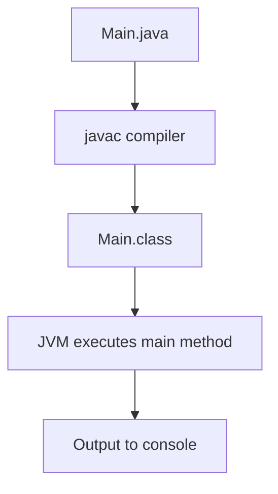
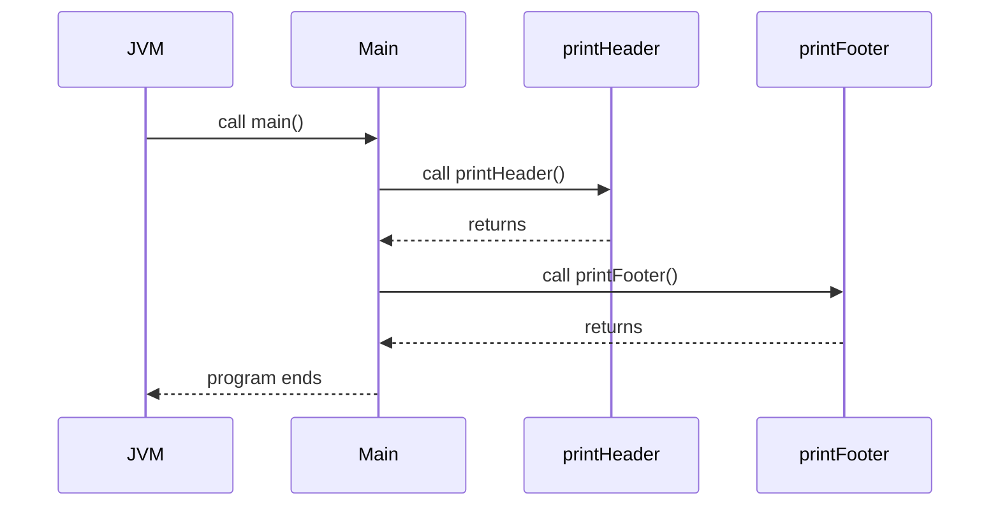
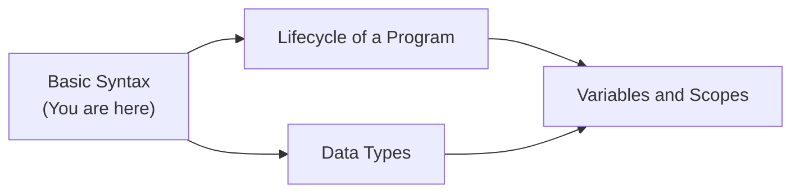
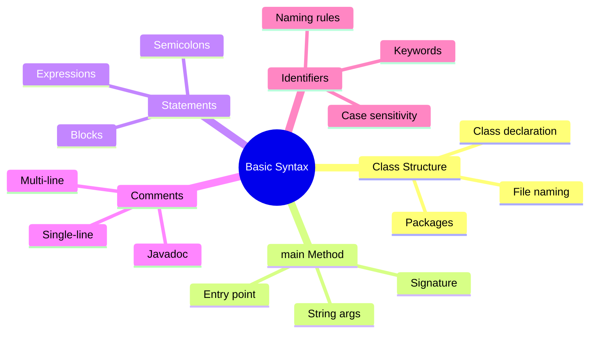
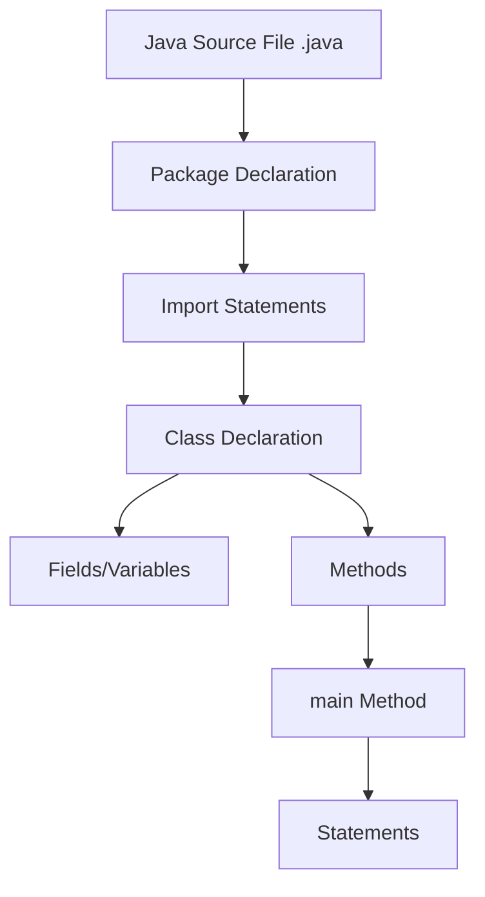
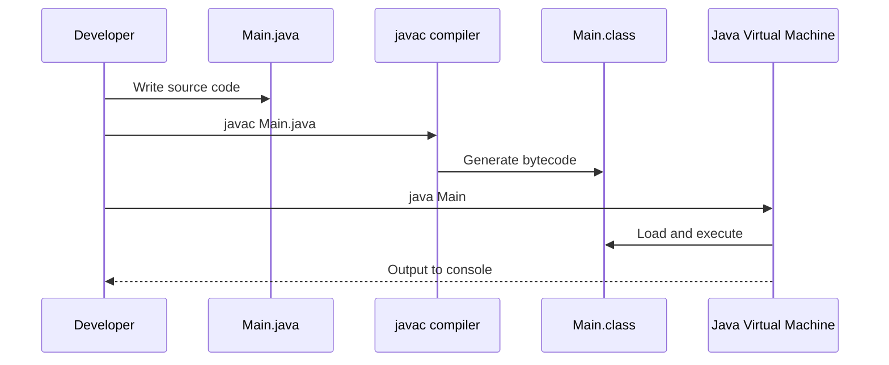

# Basic Syntax — Junior Level

## Table of Contents

1. [Introduction](#introduction)
2. [Prerequisites](#prerequisites)
3. [Glossary](#glossary)
4. [Core Concepts](#core-concepts)
5. [Real-World Analogies](#real-world-analogies)
6. [Mental Models](#mental-models)
7. [Pros & Cons](#pros--cons)
8. [Use Cases](#use-cases)
9. [Code Examples](#code-examples)
10. [Coding Patterns](#coding-patterns)
11. [Clean Code](#clean-code)
12. [Product Use / Feature](#product-use--feature)
13. [Error Handling](#error-handling)
14. [Security Considerations](#security-considerations)
15. [Performance Tips](#performance-tips)
16. [Metrics & Analytics](#metrics--analytics)
17. [Best Practices](#best-practices)
18. [Edge Cases & Pitfalls](#edge-cases--pitfalls)
19. [Common Mistakes](#common-mistakes)
20. [Common Misconceptions](#common-misconceptions)
21. [Tricky Points](#tricky-points)
22. [Test](#test)
23. [Tricky Questions](#tricky-questions)
24. [Cheat Sheet](#cheat-sheet)
25. [Self-Assessment Checklist](#self-assessment-checklist)
26. [Summary](#summary)
27. [What You Can Build](#what-you-can-build)
28. [Further Reading](#further-reading)
29. [Related Topics](#related-topics)
30. [Diagrams & Visual Aids](#diagrams--visual-aids)

---

## Introduction

> Focus: "What is it?" and "How to use it?"

Java basic syntax is the foundation of every Java program. It defines how you write, structure, and organize your code so the Java compiler can understand it. Understanding basic syntax includes knowing the structure of a Java class, how to write the `main` method, where to place semicolons and braces, how to write comments, and what identifiers and keywords are. Java is case-sensitive, which means `Main` and `main` are completely different names. Mastering these fundamentals is essential before you can build anything in Java.

---

## Prerequisites

What you should know before studying this topic:

- **Required:** Basic understanding of what programming is — knowing that code is instructions for a computer
- **Required:** A text editor or IDE installed (IntelliJ IDEA, VS Code, or Eclipse) — you need a place to write code
- **Required:** JDK installed (Java 17 or later recommended) — the compiler and runtime
- **Helpful but not required:** Experience with any other programming language — helps you compare syntax

---

## Glossary

Key terms used in this topic:

| Term | Definition |
|------|-----------|
| **Class** | A blueprint for creating objects; every Java program must have at least one class |
| **Method** | A block of code that performs a specific task, defined inside a class |
| **main method** | The entry point of a Java application: `public static void main(String[] args)` |
| **Semicolon** | The `;` character that ends every statement in Java |
| **Braces** | The `{` and `}` characters that define the start and end of a code block |
| **Identifier** | A name given to a class, method, variable, or other element |
| **Keyword** | A reserved word in Java that has a special meaning (e.g., `class`, `int`, `if`) |
| **Comment** | Text in code that is ignored by the compiler, used for documentation |
| **Statement** | A single instruction that the program executes |
| **Package** | A namespace that organizes related classes (e.g., `java.util`) |

---

## Core Concepts

### Concept 1: Class Structure

Every Java program is organized into classes. A class is declared with the `class` keyword followed by a name and braces. The file name must match the public class name exactly (including case). For example, a class named `Main` must be in a file called `Main.java`.

```java
public class Main {
    // code goes here
}
```

### Concept 2: The main Method

The `main` method is where your program starts running. It has a very specific signature that the JVM looks for. Every word in the signature matters: `public` makes it accessible, `static` means it belongs to the class (not an instance), `void` means it returns nothing, and `String[] args` accepts command-line arguments.

```java
public static void main(String[] args) {
    System.out.println("Hello, World!");
}
```

### Concept 3: Statements and Semicolons

Every executable instruction in Java is a statement, and every statement must end with a semicolon (`;`). Forgetting a semicolon is one of the most common beginner errors. Multiple statements can appear on the same line, but this hurts readability.

### Concept 4: Code Blocks and Braces

Braces `{ }` group statements into blocks. Classes, methods, loops, and conditionals all use braces. Braces must always come in pairs — every opening brace needs a closing brace.

### Concept 5: Comments

Java supports three types of comments:
- **Single-line:** `// This is a comment`
- **Multi-line:** `/* This spans multiple lines */`
- **Javadoc:** `/** Used for documentation */`

### Concept 6: Identifiers and Naming Rules

Identifiers are names you give to classes, methods, and variables. They must start with a letter, underscore `_`, or dollar sign `$`. They cannot start with a digit and cannot be a Java keyword. Java identifiers are case-sensitive.

### Concept 7: Java Keywords

Java has about 50 reserved keywords like `class`, `public`, `static`, `void`, `int`, `if`, `else`, `for`, `while`, `return`, `new`, `this`, etc. These words cannot be used as identifiers.

### Concept 8: Case Sensitivity

Java is strictly case-sensitive. `System` and `system` are different identifiers. `String` (uppercase S) is a valid class name, while `string` would be an undefined type. This applies everywhere: class names, method names, variable names, and keywords.

---

## Real-World Analogies

Everyday analogies to help you understand Basic Syntax intuitively:

| Concept | Analogy |
|---------|--------|
| **Class structure** | A class is like a recipe card — it has a title (class name), ingredients (fields), and instructions (methods). The card must follow a specific format for the cook to understand it. |
| **main method** | The main method is like the front door of a building — it is the one and only entry point. No matter how big the building is, everyone enters through the front door. |
| **Semicolons** | Semicolons are like periods at the end of a sentence — they tell the reader (compiler) where one thought ends and the next begins. |
| **Braces** | Braces are like parentheses in a math equation — they group things together and tell the compiler what belongs where. |

---

## Mental Models

How to picture Basic Syntax in your head:

**The intuition:** Think of a Java source file as a formal business letter. It has a strict format: the address (package declaration) goes at the top, the greeting (imports) follows, and the body (class with methods) comes next. Every sentence (statement) ends with a period (semicolon). If you break the format, the post office (compiler) rejects the letter.

**Why this model helps:** It reminds you that Java is strict about structure. Unlike some languages that are flexible with formatting, Java requires you to follow its rules precisely. This mental model helps you remember that every piece of syntax has a required place.

---

## Pros & Cons

| Pros | Cons |
|------|------|
| Strict syntax catches errors at compile time | Verbose compared to Python or Kotlin |
| Consistent structure makes code predictable | Requires boilerplate even for simple programs |
| Case sensitivity prevents ambiguous naming | Beginners often struggle with case-sensitive errors |
| Well-defined keywords ensure clarity | Many keywords to memorize |

### When to use:
- When you need a strongly-typed, compiled language with strict error checking
- When working on large team projects where consistency matters

### When NOT to use:
- For quick scripts or prototypes where Python or Bash would be faster
- When minimal boilerplate is more important than type safety

---

## Use Cases

When and where you would use this in real projects:

- **Use Case 1:** Writing any Java application — from a simple calculator to a full web service, you must know basic syntax first
- **Use Case 2:** Reading and understanding existing Java codebases — knowing syntax lets you read Spring Boot, Android, and library code
- **Use Case 3:** Debugging compilation errors — understanding syntax helps you quickly fix missing semicolons, unmatched braces, and naming issues

---

## Code Examples

### Example 1: Hello World — The Simplest Java Program

```java
public class Main {
    public static void main(String[] args) {
        // Print a greeting to the console
        System.out.println("Hello, World!");
    }
}
```

**What it does:** Prints "Hello, World!" to the console.
**How to run:** `javac Main.java && java Main`

### Example 2: Using Multiple Statements and Comments

```java
public class Main {
    public static void main(String[] args) {
        // Declare variables
        String name = "Alice";
        int age = 25;

        /* Print user information
           using multiple statements */
        System.out.println("Name: " + name);
        System.out.println("Age: " + age);

        /**
         * This is a Javadoc-style comment.
         * Typically used for method or class documentation.
         */
        System.out.println("Welcome to Java!");
    }
}
```

**What it does:** Declares variables, prints them, and demonstrates all three comment types.
**How to run:** `javac Main.java && java Main`

### Example 3: Class with Multiple Methods

```java
public class Main {
    // A method that returns a greeting
    static String greet(String name) {
        return "Hello, " + name + "!";
    }

    // A method that calculates the square of a number
    static int square(int number) {
        return number * number;
    }

    public static void main(String[] args) {
        System.out.println(greet("Bob"));      // Hello, Bob!
        System.out.println(square(5));          // 25
    }
}
```

**What it does:** Shows how to define and call methods within a class.
**How to run:** `javac Main.java && java Main`

---

## Coding Patterns

Common patterns beginners encounter when working with Basic Syntax:

### Pattern 1: Single-File Program

**Intent:** Write a complete, self-contained program in one file.
**When to use:** Learning exercises, small utilities, coding challenges.

```java
public class Main {
    public static void main(String[] args) {
        // All logic goes here
        System.out.println("Single file program");
    }
}
```

**Diagram:**



**Remember:** The file name must match the public class name exactly.

---

### Pattern 2: Method Extraction

**Intent:** Break complex logic into smaller, named methods for readability.
**When to use:** When your `main` method gets longer than 10-15 lines.

```java
public class Main {
    static void printHeader() {
        System.out.println("=== Application Started ===");
    }

    static void printFooter() {
        System.out.println("=== Application Finished ===");
    }

    public static void main(String[] args) {
        printHeader();
        System.out.println("Doing work...");
        printFooter();
    }
}
```

**Diagram:**



---

## Clean Code

Basic clean code principles when working with Basic Syntax in Java:

### Naming (Java conventions)

```java
// ❌ Bad
class myclass {}
void d(int x) {}
int MAX_count = 100;

// ✅ Clean Java naming
class MyClass {}
void processData(int count) {}
static final int MAX_COUNT = 100;
```

**Java naming rules:**
- Classes: PascalCase (`UserService`, `HttpClient`)
- Methods and variables: camelCase (`getUserById`, `isValid`)
- Constants: UPPER_SNAKE_CASE (`MAX_RETRIES`, `DEFAULT_TIMEOUT`)
- Packages: lowercase, dot-separated (`com.example.service`)

---

### Short Methods

```java
// ❌ Too long — parse + validate + save in one method
public void processUser(String input) { /* 40 lines */ }

// ✅ Each method does one thing
private String parseInput(String input) { return input.trim(); }
private boolean validate(String data) { return !data.isEmpty(); }
private void save(String data) { System.out.println("Saved: " + data); }
```

---

### Javadoc Comments

```java
// ❌ Noise — restates the signature
// Gets name
public String getName() { return name; }

// ✅ Explains contract
/**
 * Returns the user's full name.
 *
 * @return the full name, never null
 */
public String getName() { return name; }
```

---

## Product Use / Feature

How this topic is used in real-world products and tools:

### 1. Spring Boot Applications

- **How it uses Basic Syntax:** Every Spring Boot application starts with a class containing a `main` method annotated with `@SpringBootApplication`
- **Why it matters:** Without correct basic syntax, the application won't compile or start

### 2. Android Applications

- **How it uses Basic Syntax:** Android apps use Java classes, methods, and standard syntax for Activities, Services, and Fragments
- **Why it matters:** Understanding Java syntax is essential for reading and writing Android code

### 3. Apache Kafka (Java client)

- **How it uses Basic Syntax:** The Kafka Java client uses standard class structures, method calls, and configuration to produce/consume messages
- **Why it matters:** All Java libraries follow the same basic syntax rules

---

## Error Handling

How to handle errors when working with Basic Syntax:

### Error 1: Missing Semicolon

```java
// This causes a compilation error
System.out.println("Hello")  // ← missing semicolon
```

**Why it happens:** Java requires every statement to end with `;`.
**How to fix:**

```java
System.out.println("Hello");  // ← semicolon added
```

### Error 2: Unmatched Braces

```java
public class Main {
    public static void main(String[] args) {
        System.out.println("Hello");
    // ← missing closing brace for class
```

**Why it happens:** Every `{` must have a matching `}`.
**How to fix:**

```java
public class Main {
    public static void main(String[] args) {
        System.out.println("Hello");
    }
}  // ← closing brace added
```

### Error 3: Wrong File Name

```java
// File is named "App.java" but class is named "Main"
public class Main {
    public static void main(String[] args) {}
}
```

**Why it happens:** The public class name must match the file name.
**How to fix:** Rename the file to `Main.java` or rename the class to `App`.

---

## Security Considerations

Security aspects to keep in mind when using Basic Syntax:

### 1. Avoid Hardcoding Sensitive Data

```java
// ❌ Insecure — password visible in source code
public class Main {
    static final String DB_PASSWORD = "secret123";
}

// ✅ Secure — read from environment
public class Main {
    static final String DB_PASSWORD = System.getenv("DB_PASSWORD");
}
```

**Risk:** Hardcoded credentials can be exposed in version control.
**Mitigation:** Always use environment variables or configuration files for secrets.

### 2. Avoid Printing Sensitive Information

```java
// ❌ Insecure — logs password
System.out.println("Password: " + password);

// ✅ Secure — mask or omit
System.out.println("Password: ****");
```

**Risk:** Sensitive data in console output or log files can be accessed by unauthorized users.
**Mitigation:** Never print passwords, tokens, or API keys.

---

## Performance Tips

Basic performance considerations for Basic Syntax:

### Tip 1: Use StringBuilder for String Concatenation in Loops

```java
// ❌ Slow approach — creates new String each iteration
String result = "";
for (int i = 0; i < 1000; i++) {
    result += i;  // O(n^2) due to String immutability
}

// ✅ Faster approach
StringBuilder sb = new StringBuilder();
for (int i = 0; i < 1000; i++) {
    sb.append(i);
}
String result = sb.toString();
```

**Why it's faster:** Strings are immutable in Java. Each `+=` creates a new String object, while `StringBuilder` modifies a single buffer.

### Tip 2: Print Statements Are Slow

```java
// ❌ Avoid excessive printing in performance-critical code
for (int i = 0; i < 1000000; i++) {
    System.out.println(i);  // I/O is very slow
}

// ✅ Batch output or use logging framework
StringBuilder sb = new StringBuilder();
for (int i = 0; i < 1000000; i++) {
    sb.append(i).append("\n");
}
System.out.print(sb);
```

**Why it's faster:** `System.out.println` flushes to the console on every call, which involves slow I/O operations.

---

## Metrics & Analytics

Key metrics to track when using Basic Syntax:

### What to Measure

| Metric | Why it matters | Tool |
|--------|---------------|------|
| **Compilation time** | Ensures fast development feedback | Maven (`mvn compile`), Gradle |
| **Number of compiler errors** | Tracks syntax correctness | IDE error count |

### Basic Instrumentation

```java
public class Main {
    public static void main(String[] args) {
        long start = System.currentTimeMillis();

        // Your program logic here
        System.out.println("Running...");

        long elapsed = System.currentTimeMillis() - start;
        System.out.println("Execution time: " + elapsed + " ms");
    }
}
```

---

## Best Practices

- **Do this:** Always name your file exactly the same as your public class name (case-sensitive)
- **Do this:** Use consistent indentation (4 spaces per level, as per Google Java Style Guide)
- **Do this:** Write comments to explain "why", not "what" — the code itself shows "what"
- **Do this:** Use meaningful names for methods and variables — `calculateTotal()` not `calc()`
- **Do this:** Keep methods short — ideally under 20 lines

---

## Edge Cases & Pitfalls

### Pitfall 1: Unicode in Identifiers

```java
public class Main {
    public static void main(String[] args) {
        int caf\u00e9 = 42;  // This is valid! \u00e9 is 'e' with accent
        System.out.println(caf\u00e9);  // prints 42
    }
}
```

**What happens:** Java allows Unicode escape sequences anywhere in the source code, even in identifiers.
**How to fix:** Avoid using Unicode escapes in identifiers — it makes code unreadable.

### Pitfall 2: Empty Statement

```java
if (true);  // ← empty statement — the semicolon ends the if
{
    System.out.println("This always runs!");
}
```

**What happens:** The semicolon after `if (true)` creates an empty statement. The block below always executes.
**How to fix:** Remove the semicolon after the condition.

---

## Common Mistakes

### Mistake 1: Using `==` for String Comparison

```java
// ❌ Wrong way — compares references, not content
String a = new String("hello");
String b = new String("hello");
System.out.println(a == b);  // false

// ✅ Correct way — compares content
System.out.println(a.equals(b));  // true
```

### Mistake 2: Forgetting `static` on Methods Called from main

```java
// ❌ Wrong — non-static method can't be called from static context
public class Main {
    void greet() { System.out.println("Hi"); }
    public static void main(String[] args) {
        greet();  // Compilation error!
    }
}

// ✅ Correct — make the method static
public class Main {
    static void greet() { System.out.println("Hi"); }
    public static void main(String[] args) {
        greet();  // Works
    }
}
```

### Mistake 3: Wrong main Method Signature

```java
// ❌ Wrong — won't be recognized as entry point
public static void main(String args) {}   // missing []
public void main(String[] args) {}        // missing static
static void main(String[] args) {}        // missing public (may not work)

// ✅ Correct — exact signature required
public static void main(String[] args) {}
```

---

## Common Misconceptions

Things people often believe about Basic Syntax that aren't true:

### Misconception 1: "Java files can have any name"

**Reality:** The file name must match the public class name exactly, including case. `Main.java` must contain `public class Main`.

**Why people think this:** In some languages like Python, file names don't need to match class names.

### Misconception 2: "Semicolons are optional in Java"

**Reality:** Semicolons are mandatory at the end of every statement. They are not optional like in JavaScript or Kotlin.

**Why people think this:** Developers coming from languages like Python, JavaScript, or Kotlin expect semicolons to be optional.

### Misconception 3: "Comments affect program performance"

**Reality:** Comments are completely stripped out during compilation. They have zero impact on the compiled bytecode or runtime performance.

**Why people think this:** Beginners sometimes confuse source code with compiled code.

---

## Tricky Points

Things that look simple but have subtle behavior:

### Tricky Point 1: Unicode Escapes Are Processed Before Compilation

```java
// This line causes a compilation error!
// \u000A System.out.println("Surprise");
```

**Why it's tricky:** `\u000A` is the Unicode for newline. The Java compiler processes Unicode escapes before parsing, so this becomes a newline inside the comment, breaking the code.
**Key takeaway:** Unicode escapes are resolved at the earliest stage of compilation, even inside comments.

### Tricky Point 2: Multiple Classes in One File

```java
// Only ONE public class per file, but you can have multiple non-public classes
public class Main {
    public static void main(String[] args) {
        Helper h = new Helper();
        h.help();
    }
}

class Helper {  // no "public" keyword — package-private
    void help() {
        System.out.println("Helping!");
    }
}
```

**Why it's tricky:** Beginners assume each class needs its own file. Non-public classes can share a file, but it is not recommended for production code.
**Key takeaway:** One public class per file, file name matches public class name.

---

## Test

### Multiple Choice

**1. What must the file name be for a class declared as `public class Calculator`?**

- A) `calculator.java`
- B) `Calculator.java`
- C) `Calculator.class`
- D) Any name ending in `.java`

<details>
<summary>Answer</summary>
**B)** — The file name must exactly match the public class name, including case. `Calculator.java` is the only correct option.
</details>

**2. Which of the following is a valid Java identifier?**

- A) `2ndPlace`
- B) `class`
- C) `_count`
- D) `my-variable`

<details>
<summary>Answer</summary>
**C)** — `_count` is valid. `2ndPlace` starts with a digit, `class` is a keyword, and `my-variable` contains a hyphen (not allowed).
</details>

### True or False

**3. Java is case-insensitive, meaning `Main` and `main` are the same.**

<details>
<summary>Answer</summary>
**False** — Java is case-sensitive. `Main` and `main` are completely different identifiers.
</details>

### What's the Output?

**4. What does this code print?**

```java
public class Main {
    public static void main(String[] args) {
        System.out.print("A");
        System.out.println("B");
        System.out.print("C");
    }
}
```

<details>
<summary>Answer</summary>
Output:
```
AB
C
```
Explanation: `print` does not add a newline, but `println` does. So "A" and "B" appear on the same line, followed by a newline, then "C" on the next line.
</details>

**5. What happens when you compile this code?**

```java
public class Main {
    public static void main(String[] args) {
        System.out.println("Hello")
    }
}
```

<details>
<summary>Answer</summary>
**Compilation error** — missing semicolon after `System.out.println("Hello")`. The error message will say something like "';' expected".
</details>

**6. How many statements are in this code block?**

```java
int a = 5; int b = 10; System.out.println(a + b);
```

<details>
<summary>Answer</summary>
**3 statements** — each semicolon terminates one statement. Multiple statements on one line is valid Java, though not recommended for readability.
</details>

**7. What does this code print?**

```java
public class Main {
    public static void main(String[] args) {
        // System.out.println("Line 1");
        System.out.println("Line 2");
        /* System.out.println("Line 3"); */
        System.out.println("Line 4");
    }
}
```

<details>
<summary>Answer</summary>
Output:
```
Line 2
Line 4
```
Explanation: Lines 1 and 3 are inside comments and are not executed.
</details>

---

## Tricky Questions

Questions designed to confuse — with misleading options:

**1. Which of the following is NOT a Java keyword?**

- A) `goto`
- B) `const`
- C) `main`
- D) `strictfp`

<details>
<summary>Answer</summary>
**C)** — `main` is NOT a keyword in Java. It is just a conventional method name. `goto` and `const` are reserved keywords (even though they are not used), and `strictfp` is a keyword for strict floating-point.
</details>

**2. What happens if you name your class `String`?**

- A) Compilation error — `String` is a keyword
- B) It compiles but `java.lang.String` is shadowed in that file
- C) Runtime error — JVM refuses to load it
- D) Nothing special — `String` is just another identifier

<details>
<summary>Answer</summary>
**B)** — `String` is a class in `java.lang`, not a keyword. You can name your own class `String`, but it will shadow `java.lang.String` in your file, causing confusion. This is legal but extremely bad practice.
</details>

**3. Is this valid Java?**

```java
public class Main {
    public static void main(String... args) {
        System.out.println("Works?");
    }
}
```

- A) No — `String...` is invalid syntax
- B) Yes — varargs (`String...`) is equivalent to `String[]` for the main method
- C) Yes — but it prints nothing
- D) No — main must use `String[]`

<details>
<summary>Answer</summary>
**B)** — `String... args` (varargs) is functionally equivalent to `String[] args` and is accepted as a valid main method signature. The program prints "Works?" normally.
</details>

**4. What does the following code print?**

```java
public class Main {
    public static void main(String[] args) {
        System.out.println(args.length);
    }
}
```

Run with: `java Main`

- A) Compilation error
- B) NullPointerException
- C) 0
- D) 1

<details>
<summary>Answer</summary>
**C)** — When no command-line arguments are provided, `args` is an empty array (not null), so `args.length` is `0`.
</details>

---

## Cheat Sheet

Quick reference for this topic:

| What | Syntax / Command | Example |
|------|-----------------|---------|
| Compile | `javac FileName.java` | `javac Main.java` |
| Run | `java ClassName` | `java Main` |
| Print with newline | `System.out.println()` | `System.out.println("Hi");` |
| Print without newline | `System.out.print()` | `System.out.print("Hi");` |
| Single-line comment | `// comment` | `// This is a comment` |
| Multi-line comment | `/* comment */` | `/* Block comment */` |
| Javadoc comment | `/** comment */` | `/** @param name desc */` |
| Declare a class | `public class Name {}` | `public class Main {}` |
| Main method | `public static void main(String[] args)` | — |
| Import a class | `import package.ClassName;` | `import java.util.Scanner;` |

---

## Self-Assessment Checklist

Check your understanding of Basic Syntax:

### I can explain:
- [ ] What a Java class is and why it is needed
- [ ] What the main method is and why its signature matters
- [ ] Why Java is case-sensitive and what that means in practice
- [ ] The difference between `print` and `println`
- [ ] What identifiers are and the rules for naming them

### I can do:
- [ ] Write a basic Java program from scratch (without looking)
- [ ] Compile and run a Java program from the command line
- [ ] Read and understand simple Java code
- [ ] Debug missing semicolons and unmatched braces
- [ ] Use all three comment types correctly

### I can answer:
- [ ] All multiple choice questions in this document
- [ ] "What's the output?" questions correctly

---

## Summary

- Java basic syntax is strict and must be followed precisely for the compiler to accept your code
- Every Java program needs at least one class with a `main` method as the entry point
- Semicolons end statements, braces group code blocks, and comments document code
- Java is case-sensitive — `Main`, `main`, and `MAIN` are all different
- Identifiers must follow naming rules and cannot be Java keywords

**Next step:** Learn about the lifecycle of a Java program — how `.java` files become running programs.

---

## What You Can Build

Now that you understand Basic Syntax, here's what you can build or use it for:

### Projects you can create:
- **Hello World variants:** Programs that print different messages and accept user input
- **Simple calculator:** A command-line calculator using methods and `System.out.println`
- **Text formatter:** A program that formats and displays text with different patterns

### Technologies / tools that use this:
- **Spring Boot** — every Spring app starts with correct Java syntax and a main method
- **Android Studio** — Android development requires understanding Java class structure
- **JUnit** — writing tests requires knowing how to structure Java classes and methods

### Learning path — what to study next:



---

## Further Reading

- **Official docs:** [Java Language Specification — Chapter 3: Lexical Structure](https://docs.oracle.com/javase/specs/jls/se21/html/jls-3.html)
- **Tutorial:** [Oracle Java Tutorial — Getting Started](https://docs.oracle.com/javase/tutorial/getStarted/index.html) — step-by-step introduction to Java basics
- **Video:** [Java Programming Tutorial for Beginners](https://www.youtube.com/watch?v=eIrMbAQSU34) — covers syntax fundamentals in under 2 hours
- **Book:** Head First Java, Chapter 1 — "Breaking the Surface" — fun introduction to Java basics

---

## Related Topics

Topics to explore next or that connect to this one:

- **[Lifecycle of a Program](../02-lifecycle-of-program/)** — understand how Java compiles and runs your code
- **[Data Types](../03-data-types/)** — learn what types of data Java supports
- **[Variables and Scopes](../04-variables-and-scopes/)** — understand where variables live and how long they last

---

## Diagrams & Visual Aids

### Mind Map

Visual overview of how key concepts in Basic Syntax connect:



### Java Program Structure



### Compilation and Execution Flow


