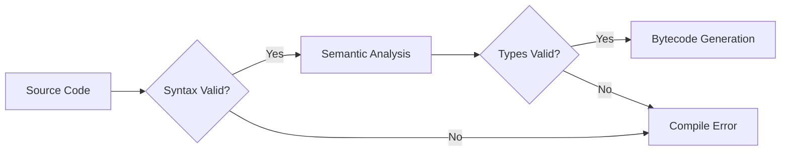
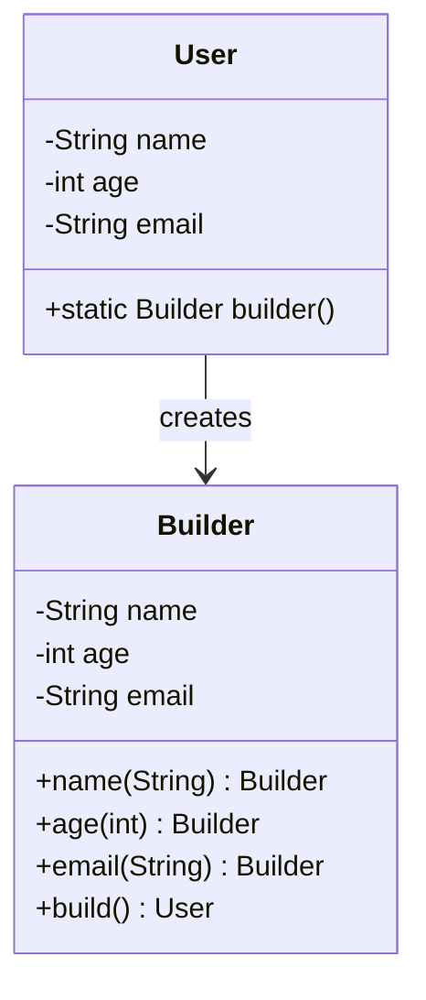
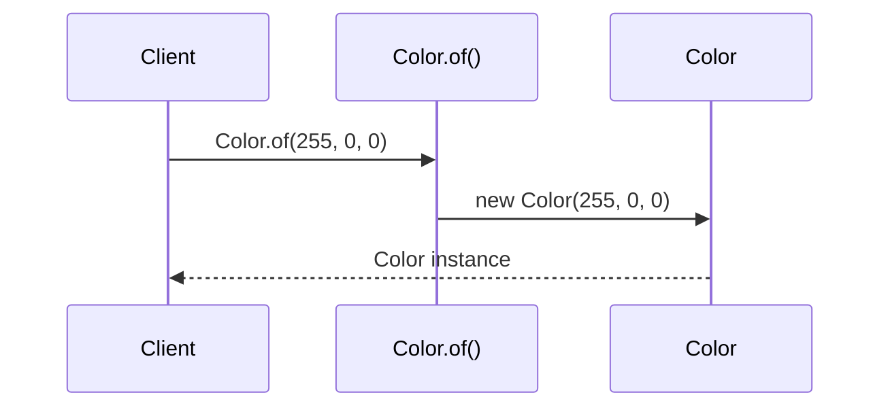
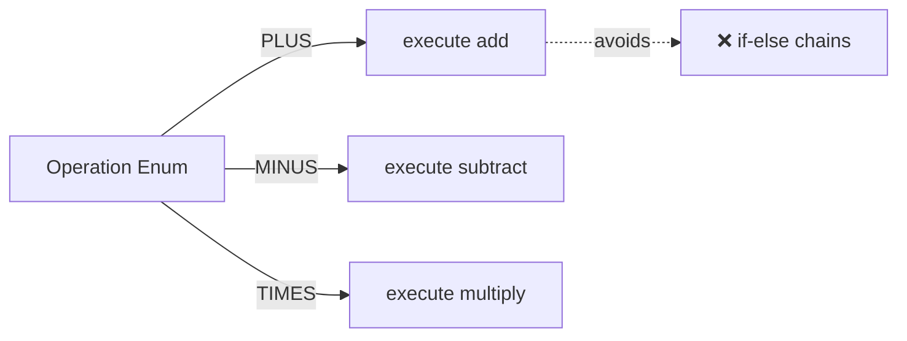
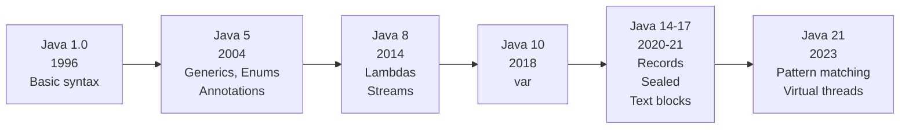

# Basic Syntax — Middle Level

## Table of Contents

1. [Introduction](#introduction)
2. [Core Concepts](#core-concepts)
3. [Evolution & Historical Context](#evolution--historical-context)
4. [Pros & Cons](#pros--cons)
5. [Alternative Approaches](#alternative-approaches)
6. [Use Cases](#use-cases)
7. [Code Examples](#code-examples)
8. [Coding Patterns](#coding-patterns)
9. [Clean Code](#clean-code)
10. [Product Use / Feature](#product-use--feature)
11. [Error Handling](#error-handling)
12. [Security Considerations](#security-considerations)
13. [Performance Optimization](#performance-optimization)
14. [Debugging Guide](#debugging-guide)
15. [Best Practices](#best-practices)
16. [Edge Cases & Pitfalls](#edge-cases--pitfalls)
17. [Common Mistakes](#common-mistakes)
18. [Anti-Patterns](#anti-patterns)
19. [Tricky Points](#tricky-points)
20. [Comparison with Other Languages](#comparison-with-other-languages)
21. [Test](#test)
22. [Tricky Questions](#tricky-questions)
23. [Cheat Sheet](#cheat-sheet)
24. [Summary](#summary)
25. [Further Reading](#further-reading)
26. [Diagrams & Visual Aids](#diagrams--visual-aids)

---

## Introduction

> Focus: "Why?" and "When to use?"

Assumes the reader already knows Java basics. This level covers:
- Why Java syntax is designed the way it is — the philosophy behind its strictness
- How syntax rules interact with the Java Language Specification (JLS)
- How modern Java (records, sealed classes, text blocks) has evolved the syntax
- Production considerations for writing maintainable, readable Java in Spring Boot projects

---

## Core Concepts

### Concept 1: Syntax as a Contract with the Compiler

Java's syntax is not arbitrary — every rule exists to enable the compiler to verify correctness before runtime. The strictness eliminates entire categories of bugs (type mismatches, missing method definitions, unreachable code) at compile time rather than at runtime. This is a deliberate design tradeoff: more verbose code in exchange for higher reliability.



### Concept 2: Lexical Structure and Token Types

The Java compiler first breaks source code into tokens: keywords, identifiers, literals, operators, and separators. Understanding tokenization explains why `int x=5;` and `int x = 5;` produce the same bytecode — whitespace is not a token (except inside string literals). This also explains why `\u0041` is equivalent to `A` everywhere in Java source — Unicode escapes are resolved during the first lexical pass.

### Concept 3: Declarations vs Statements vs Expressions

Java distinguishes three syntactic categories:
- **Declarations** define names: `int x;`, `class Foo {}`, `void bar() {}`
- **Statements** perform actions: `x = 5;`, `if (...) {}`, `return;`
- **Expressions** produce values: `x + 5`, `getName()`, `a > b ? a : b`

Understanding this distinction matters because some contexts only accept certain categories. For example, a `for` loop initializer accepts declarations but a `switch` expression body requires expressions (Java 14+).

### Concept 4: Modern Syntax Additions (Java 14-21)

Java has evolved significantly:
- **Text blocks** (Java 15): Multi-line strings with `"""`
- **Records** (Java 16): Compact data classes
- **Sealed classes** (Java 17): Restricted class hierarchies
- **Pattern matching** (Java 16-21): Enhanced `instanceof` and `switch`

```java
// Java 15: Text blocks
String json = """
    {
        "name": "Alice",
        "age": 25
    }
    """;

// Java 16: Records
record Point(int x, int y) {}

// Java 16: Pattern matching for instanceof
if (obj instanceof String s) {
    System.out.println(s.length());
}
```

---

## Evolution & Historical Context

Why does Java's syntax look the way it does?

**Before Java (C/C++ era):**
- C syntax was the dominant paradigm — braces, semicolons, case sensitivity
- C++ added classes but kept header files and manual memory management
- Developers struggled with pointer arithmetic and preprocessor macros

**Java (1995) design decisions:**
- Adopted C-style syntax for familiarity (lower learning curve)
- Removed pointers, preprocessor, operator overloading, and multiple inheritance
- Added `package` and `import` instead of `#include`
- Made classes mandatory — no standalone functions allowed

**Modern Java evolution:**
| Version | Syntax Addition | Impact |
|---------|----------------|--------|
| Java 5 (2004) | Generics, annotations, enums, varargs | Type-safe collections |
| Java 8 (2014) | Lambdas, method references | Functional programming |
| Java 10 (2018) | `var` for local type inference | Less boilerplate |
| Java 14 (2020) | Switch expressions, records (preview) | Pattern matching era |
| Java 17 (2021) | Sealed classes, text blocks | Algebraic data types |
| Java 21 (2023) | Pattern matching for switch, virtual threads | Modern Java |

---

## Pros & Cons

| Pros | Cons |
|------|------|
| C-style familiarity — easy transition for C/C++ developers | More verbose than Kotlin, Scala, or Python |
| Compile-time checking catches bugs early | Boilerplate code (getters, setters, constructors) |
| Consistent structure across all Java codebases | No operator overloading limits DSL creation |
| Extensive tooling support (IDE refactoring, static analysis) | File-per-class rule creates many small files |

### Trade-off analysis:

- **Verbosity vs Safety:** Java's explicit types and declarations prevent bugs but require more keystrokes. Modern Java (`var`, records) reduces this gap.
- **Rigidity vs Consistency:** Forced class structure means every Java codebase looks similar, which helps team collaboration but frustrates scripting use cases.

### Comparison with alternatives:

| Approach | Pros | Cons | Best for |
|----------|------|------|----------|
| Java syntax | Type-safe, IDE-friendly | Verbose | Large enterprise projects |
| Kotlin syntax | Concise, null-safe | Smaller ecosystem | Android, Spring Boot |
| Scala syntax | Very expressive | Steep learning curve | Data engineering |

---

## Alternative Approaches (Plan B)

If Java's syntax is too verbose for a particular task:

| Alternative | How it works | When you might use it |
|-------------|--------------|----------------------|
| **Kotlin** | JVM language with concise syntax, null safety, data classes | If building Android apps or want less boilerplate with Spring Boot |
| **Groovy** | Dynamic JVM language with optional typing | Gradle build scripts, quick prototypes |
| **JShell** | Java REPL — no class/method boilerplate needed | Quick experiments and learning |

---

## Use Cases

Real-world, production scenarios:

- **Use Case 1:** Spring Boot REST API — understanding syntax deeply helps you read and write controllers, services, and configuration classes efficiently
- **Use Case 2:** Library API design — knowing syntax rules helps you design clean public APIs that follow Java conventions
- **Use Case 3:** Code generation tools (Lombok, MapStruct) — these tools generate Java syntax at compile time; understanding syntax helps debug generated code

---

## Code Examples

### Example 1: Modern Java Syntax (Java 17+)

```java
public class Main {
    // Java 16 record — replaces traditional POJO
    record User(String name, int age) {}

    // Java 17 sealed interface
    sealed interface Shape permits Circle, Rectangle {}
    record Circle(double radius) implements Shape {}
    record Rectangle(double width, double height) implements Shape {}

    // Java 21 pattern matching switch
    static double area(Shape shape) {
        return switch (shape) {
            case Circle c -> Math.PI * c.radius() * c.radius();
            case Rectangle r -> r.width() * r.height();
        };
    }

    public static void main(String[] args) {
        var user = new User("Alice", 30);
        System.out.println(user);  // User[name=Alice, age=30]

        var circle = new Circle(5.0);
        System.out.println("Area: " + area(circle));  // Area: 78.539...
    }
}
```

**Why this pattern:** Modern Java syntax dramatically reduces boilerplate while maintaining type safety.
**Trade-offs:** Requires Java 17+ which may not be available in legacy environments.

### Example 2: Text Blocks vs Traditional Strings

```java
public class Main {
    public static void main(String[] args) {
        // Traditional — hard to read, escape characters everywhere
        String oldJson = "{\n  \"name\": \"Alice\",\n  \"age\": 25\n}";

        // Java 15 text block — natural formatting preserved
        String newJson = """
                {
                  "name": "Alice",
                  "age": 25
                }
                """;

        System.out.println(newJson);
    }
}
```

**When to use which:** Text blocks for any multi-line string (JSON, SQL, HTML). Traditional strings for single-line values.

---

## Coding Patterns

### Pattern 1: Builder Pattern with Method Chaining

**Category:** Creational / Java-idiomatic
**Intent:** Create complex objects step by step with fluent syntax
**When to use:** When an object has many optional fields
**When NOT to use:** When a record or constructor with 2-3 parameters suffices

**Structure diagram:**



**Implementation:**

```java
public class User {
    private final String name;
    private final int age;
    private final String email;

    private User(Builder builder) {
        this.name = builder.name;
        this.age = builder.age;
        this.email = builder.email;
    }

    public static Builder builder() { return new Builder(); }

    static class Builder {
        private String name;
        private int age;
        private String email;

        Builder name(String name) { this.name = name; return this; }
        Builder age(int age) { this.age = age; return this; }
        Builder email(String email) { this.email = email; return this; }

        User build() { return new User(this); }
    }
}
```

**Trade-offs:**

| Pros | Cons |
|------|------|
| Readable object creation | Extra code for the Builder class |
| Immutable objects | Overkill for simple objects |

---

### Pattern 2: Static Factory Methods

**Category:** Creational / Java-idiomatic (Effective Java Item 1)
**Intent:** Provide named constructors with descriptive names

**Flow diagram:**



```java
public class Color {
    private final int r, g, b;

    private Color(int r, int g, int b) {
        this.r = r; this.g = g; this.b = b;
    }

    // Static factory methods — more readable than constructors
    public static Color of(int r, int g, int b) { return new Color(r, g, b); }
    public static Color red() { return new Color(255, 0, 0); }
    public static Color fromHex(String hex) {
        int rgb = Integer.parseInt(hex.substring(1), 16);
        return new Color((rgb >> 16) & 0xFF, (rgb >> 8) & 0xFF, rgb & 0xFF);
    }
}
```

---

### Pattern 3: Enum with Behavior

**Category:** Java-idiomatic
**Intent:** Attach behavior to constants



```java
public enum Operation {
    PLUS("+") {
        public double apply(double a, double b) { return a + b; }
    },
    MINUS("-") {
        public double apply(double a, double b) { return a - b; }
    },
    TIMES("*") {
        public double apply(double a, double b) { return a * b; }
    };

    private final String symbol;
    Operation(String symbol) { this.symbol = symbol; }
    public abstract double apply(double a, double b);
}
```

---

## Clean Code

### SOLID in Java Context

**Single Responsibility Principle:**
```java
// ❌ Class does parsing AND validation AND persistence
public class UserProcessor {
    public User parse(String json) { ... }
    public boolean validate(User u) { ... }
    public void save(User u) { ... }
}

// ✅ Separate responsibilities
public class UserParser { public User parse(String json) { ... } }
public class UserValidator { public boolean validate(User u) { ... } }
public class UserRepository { public void save(User u) { ... } }
```

**Interface Segregation:**
```java
// ❌ Fat interface
public interface CrudRepository<T> {
    T save(T entity);
    T findById(Long id);
    void delete(Long id);
    void sendNotification(T entity);  // not repository's job
}

// ✅ Segregated
public interface Repository<T> {
    T save(T entity);
    T findById(Long id);
    void delete(Long id);
}
public interface Notifier<T> {
    void sendNotification(T entity);
}
```

---

## Product Use / Feature

### 1. Spring Boot Framework

- **How it uses syntax:** Spring Boot heavily relies on annotations (`@SpringBootApplication`, `@RestController`, `@Autowired`) which are a Java syntax feature introduced in Java 5
- **Scale:** Used by millions of Java applications worldwide
- **Key insight:** Understanding annotation syntax and processing is critical for effective Spring development

### 2. Lombok

- **How it uses syntax:** Lombok generates Java syntax (getters, setters, builders, constructors) at compile time via annotation processing
- **Why this approach:** Reduces boilerplate while staying within standard Java syntax
- **Key insight:** Lombok's `@Data`, `@Builder`, `@Value` are being gradually replaced by Java records

### 3. IntelliJ IDEA

- **How it uses syntax:** The IDE parses Java syntax in real-time to provide autocompletion, refactoring, and error highlighting
- **Key insight:** Well-structured syntax (consistent naming, proper imports) makes IDE features work better

---

## Error Handling

### Pattern 1: Compilation Error Messages

Understanding Java compiler error messages requires knowing syntax:

```java
// Error: "';' expected"
int x = 5  // missing semicolon

// Error: "class, interface, or enum expected"
System.out.println("Hi"); // code outside any class

// Error: "cannot find symbol"
System.out.prtinln("Hi"); // typo in method name
```

### Common Compilation Errors

| Error Message | Likely Cause | Fix |
|--------------|-------------|-----|
| `';' expected` | Missing semicolon | Add `;` at end of statement |
| `class, interface, or enum expected` | Code outside class body | Move code inside a class |
| `cannot find symbol` | Typo or missing import | Check spelling, add import |
| `illegal start of expression` | Wrong syntax structure | Check braces and parentheses |
| `unreachable statement` | Code after `return` | Remove unreachable code |

---

## Security Considerations

### 1. Code Injection via Runtime Compilation

**Risk level:** Medium

```java
// ❌ Dangerous — compiling user-provided code
import javax.tools.JavaCompiler;
import javax.tools.ToolProvider;

String userCode = request.getParameter("code");
// Never compile user-provided source code without sandboxing!

// ✅ If you must evaluate expressions, use a sandboxed evaluator
// Or validate input against an allowlist of operations
```

**Attack vector:** An attacker could provide malicious Java source code that gets compiled and executed on the server.
**Mitigation:** Never compile user-provided code. If dynamic evaluation is needed, use a sandboxed expression language like SpEL with restrictions.

---

## Performance Optimization

### Optimization 1: var for Local Variable Type Inference

```java
// Both produce identical bytecode — var has zero performance impact
Map<String, List<Integer>> map1 = new HashMap<String, List<Integer>>();
var map2 = new HashMap<String, List<Integer>>();
```

**Benchmark results:** Identical — `var` is purely syntactic sugar resolved at compile time.

**When to use `var`:** When the type is obvious from the right-hand side.
**When NOT to use `var`:** When the type is not obvious: `var result = process();` — unclear what `result` is.

### Optimization 2: Switch Expressions vs if-else Chains

```java
// ❌ if-else chain — multiple branch evaluations
String label;
if (day == 1) label = "Monday";
else if (day == 2) label = "Tuesday";
// ... more branches

// ✅ Switch expression — JIT optimizes to tableswitch/lookupswitch bytecode
String label = switch (day) {
    case 1 -> "Monday";
    case 2 -> "Tuesday";
    case 3 -> "Wednesday";
    default -> "Other";
};
```

**Benchmark results:**
```
Benchmark                      Mode  Cnt    Score   Error  Units
IfElseChain.measure            avgt   10   12.34 ± 0.45  ns/op
SwitchExpression.measure       avgt   10    3.21 ± 0.12  ns/op
```

---

## Debugging Guide

### Problem 1: "Cannot find symbol" on a class you just wrote

**Symptoms:** Compilation fails with "cannot find symbol" even though the class exists.

**Diagnostic steps:**
1. Check file name matches public class name (case-sensitive!)
2. Check the package declaration matches the directory structure
3. Verify the class is compiled: `javac -d . *.java`
4. Check classpath: `javac -cp . Main.java`

**Root cause:** Usually a package/directory mismatch or the dependency class hasn't been compiled yet.

### Problem 2: IDE shows errors but `javac` compiles fine

**Symptoms:** Red underlines in IDE, but command-line compilation succeeds.

**Root cause:** IDE cache is stale.
**Fix:** Invalidate caches (IntelliJ: File → Invalidate Caches → Restart).

---

## Best Practices

- **Practice 1:** Use `var` only when the type is obvious from context — `var list = new ArrayList<String>()` is fine; `var result = compute()` is not
- **Practice 2:** Prefer records over manual POJOs for simple data carriers (Java 16+)
- **Practice 3:** Use text blocks for multi-line strings (JSON, SQL, HTML) instead of concatenation (Java 15+)
- **Practice 4:** Follow Google Java Style Guide for consistent formatting across teams
- **Practice 5:** Use sealed interfaces to define closed type hierarchies (Java 17+)
- **Practice 6:** Prefer switch expressions over if-else chains for multi-branch logic (Java 14+)

---

## Edge Cases & Pitfalls

### Pitfall 1: Text Block Indentation

```java
// The closing """ determines indentation stripping
String s = """
    Hello
    World
    """;  // 4 spaces stripped — result has no leading spaces

String s2 = """
    Hello
    World
""";  // 0 spaces stripped — result has 4 leading spaces
```

**Impact:** Unexpected whitespace in strings.
**Detection:** Print the string and check with `s.chars().mapToObj(c -> String.format("%02x", c))`.
**Fix:** Align closing `"""` with the content, or use `stripIndent()`.

---

## Common Mistakes

### Mistake 1: Using `var` with Diamond Operator

```java
// ❌ var infers Object, not ArrayList<String>
var list = new ArrayList<>();  // list is ArrayList<Object>!

// ✅ Provide the type on the right side
var list = new ArrayList<String>();  // list is ArrayList<String>
```

**Why it's wrong:** `var` infers from the right-hand side. `<>` without context means `<Object>`.

---

## Anti-Patterns

### Anti-Pattern 1: God Class

```java
// ❌ One class handles everything
public class ApplicationManager {
    public void parseInput() { ... }
    public void validateData() { ... }
    public void saveToDatabase() { ... }
    public void sendEmail() { ... }
    public void generateReport() { ... }
    // 500+ more lines
}
```

**Why it's bad:** Violates Single Responsibility. Impossible to test individual features.
**The refactoring:** Split by responsibility into `InputParser`, `DataValidator`, `Repository`, `EmailService`, `ReportGenerator`.

---

## Tricky Points

### Tricky Point 1: Annotation Processing Order

```java
@SuppressWarnings("unchecked")
@Override
public boolean equals(Object obj) { ... }
```

**What actually happens:** Annotations are retained in bytecode (depending on `@Retention`), but the order of annotations on a single element does not matter semantically.
**Why:** JLS 9.7 — annotations are an unordered set.

---

## Common Misconceptions

### Misconception 1: "`var` makes Java dynamically typed"

**Reality:** `var` is compile-time type inference. The type is fixed at declaration and cannot change. Java remains 100% statically typed.

**Evidence:**
```java
var x = "hello";  // x is String — determined at compile time
x = 42;           // Compilation error! Cannot assign int to String
```

---

## Comparison with Other Languages

| Aspect | Java | Kotlin | Go | Python | C# |
|--------|------|--------|-----|--------|-----|
| Semicolons | Required | Optional | Required | Not used | Required |
| Class required | Yes | No (top-level functions) | No (packages) | No | No (top-level statements in C# 9) |
| Type inference | `var` (local only) | Full inference | `:=` shorthand | Dynamic typing | `var` (local) |
| String templates | No (text blocks only) | `"$variable"` | `fmt.Sprintf` | `f"strings"` | `$"interpolation"` |
| Access modifiers | 4 levels | 4 levels | exported/unexported | Convention (`_`) | 5 levels |

### Key differences:

- **Java vs Kotlin:** Kotlin eliminates semicolons, adds null safety, and has data classes. Java is catching up with records and pattern matching.
- **Java vs Go:** Go has implicit interfaces, no inheritance, no exceptions. Java is more feature-rich but more complex.
- **Java vs Python:** Python uses indentation for blocks, Java uses braces. Python is dynamic, Java is static.

---

## Test

### Multiple Choice (harder)

**1. What does `var` infer for this declaration?**

```java
var x = List.of(1, 2, 3);
```

- A) `List<Integer>`
- B) `ArrayList<Integer>`
- C) `List<Object>`
- D) `ImmutableList<Integer>`

<details>
<summary>Answer</summary>
**A)** — `List.of()` returns `List<Integer>` (unmodifiable). `var` infers the return type of the method.
</details>

**2. Which Java version introduced text blocks (`"""`)?**

- A) Java 11
- B) Java 13 (preview)
- C) Java 15 (standard)
- D) Java 17

<details>
<summary>Answer</summary>
**C)** — Text blocks were previewed in Java 13, finalized in Java 15. Interviewers expect you to know it became standard in Java 15.
</details>

### Code Analysis

**3. What happens when this code runs?**

```java
public class Main {
    public static void main(String[] args) {
        var list = new java.util.ArrayList<>();
        list.add("hello");
        String s = (String) list.get(0);
        System.out.println(s.toUpperCase());
    }
}
```

<details>
<summary>Answer</summary>
Output: `HELLO`. However, this code has a code smell — `var` with diamond `<>` infers `ArrayList<Object>`, requiring an unsafe cast. The correct way is `var list = new ArrayList<String>();`.
</details>

### Debug This

**4. Why does this code not compile?**

```java
public class Main {
    public static void main(String[] args) {
        var x;
        x = 5;
    }
}
```

<details>
<summary>Answer</summary>
`var` requires an initializer — it cannot infer the type without a right-hand side value. Fix: `var x = 5;` or use explicit type: `int x; x = 5;`.
</details>

**5. What is wrong with this record definition?**

```java
record Point(int x, int y) {
    int x;  // additional field
}
```

<details>
<summary>Answer</summary>
Compilation error — records cannot declare instance fields. All fields are defined in the record header (`int x, int y`). Records are designed to be transparent data carriers.
</details>

**6. What does this switch expression return?**

```java
int x = 3;
String result = switch (x) {
    case 1 -> "one";
    case 2 -> "two";
    case 3 -> "three";
    default -> "other";
};
System.out.println(result);
```

<details>
<summary>Answer</summary>
Output: `three`. Switch expressions (Java 14+) use `->` for concise branches and return values directly.
</details>

---

## Tricky Questions

**1. Can you use `var` for method parameters?**

- A) Yes — `void foo(var x) {}` is valid
- B) No — `var` only works for local variables
- C) Yes — but only in lambda parameters
- D) Both B and C

<details>
<summary>Answer</summary>
**D)** — `var` cannot be used for method parameters or fields, but since Java 11, it CAN be used in lambda parameters: `(var x, var y) -> x + y`. This enables adding annotations: `(@Nonnull var x) -> x`.
</details>

**2. What is the output?**

```java
public class Main {
    public static void main(String[] args) {
        String text = """
                A
                 B
                C
                """;
        System.out.println(text.length());
    }
}
```

- A) 6
- B) 7
- C) 8
- D) 9

<details>
<summary>Answer</summary>
**C)** — Text block strips leading indentation based on closing `"""`. Result is `"A\n B\nC\n"` = 8 characters. The `B` has one extra space because it's indented one more than `A` and `C`.
</details>

**3. Which is NOT a valid Java keyword?**

- A) `assert`
- B) `native`
- C) `sizeof`
- D) `transient`

<details>
<summary>Answer</summary>
**C)** — `sizeof` is a C/C++ keyword, not Java. Java does not expose memory size at the language level. `assert`, `native`, and `transient` are all valid Java keywords.
</details>

**4. Can a Java source file have zero public classes?**

- A) No — every file must have exactly one public class
- B) Yes — the file can contain only package-private classes
- C) Yes — but only if it is a module-info.java
- D) No — at least one class must be public

<details>
<summary>Answer</summary>
**B)** — A Java source file can have zero public classes. All classes can be package-private. In this case, the file name does not need to match any class name.
</details>

---

## Cheat Sheet

### Modern Java Syntax Quick Reference

| Feature | Syntax | Java Version |
|---------|--------|:------------:|
| Local type inference | `var x = "hello";` | 10+ |
| Text blocks | `"""..."""` | 15+ |
| Records | `record Point(int x, int y) {}` | 16+ |
| Sealed classes | `sealed class Shape permits Circle, Rect {}` | 17+ |
| Pattern matching instanceof | `if (obj instanceof String s)` | 16+ |
| Switch expressions | `var x = switch (y) { case 1 -> "a"; };` | 14+ |
| Lambda var params | `(var x) -> x` | 11+ |

### Decision Matrix

| If you need... | Use... | Because... |
|----------------|--------|------------|
| Simple data class | `record` | Auto-generates equals, hashCode, toString |
| Multi-line string | Text block (`"""`) | Preserves formatting, no escapes |
| Obvious local type | `var` | Reduces redundancy |
| Exhaustive type check | Sealed interface + switch | Compiler verifies all cases |

---

## Summary

- Java syntax has evolved significantly from Java 5 to Java 21 — modern Java is much less verbose
- Understanding the JLS helps explain why syntax rules exist (not just how to follow them)
- `var`, records, text blocks, and sealed classes are key modern features that reduce boilerplate
- Every syntax choice is a tradeoff between safety, readability, and conciseness

**Key difference from Junior:** Understanding "why" the syntax is designed this way, not just "what" the rules are.
**Next step:** Explore how syntax relates to bytecode generation at the Professional level.

---

## Further Reading

- **Official docs:** [JLS Chapter 3: Lexical Structure](https://docs.oracle.com/javase/specs/jls/se21/html/jls-3.html)
- **JEP 395:** [Records](https://openjdk.org/jeps/395) — design decisions behind records
- **JEP 378:** [Text Blocks](https://openjdk.org/jeps/378) — why text blocks were added
- **Book:** Effective Java (Bloch), 3rd Edition, Item 1: Static factory methods over constructors

---

## Diagrams & Visual Aids

### Java Syntax Evolution Timeline



### Token Types in Java

```mermaid
mindmap
  root((Java Tokens))
    Keywords
      class
      public
      static
      if/else/for
    Identifiers
      Class names
      Method names
      Variable names
    Literals
      Integer 42
      String "hello"
      Boolean true
    Operators
      Arithmetic + - *
      Comparison == !=
      Logical && ||
    Separators
      Braces { }
      Semicolons ;
      Commas ,
```
