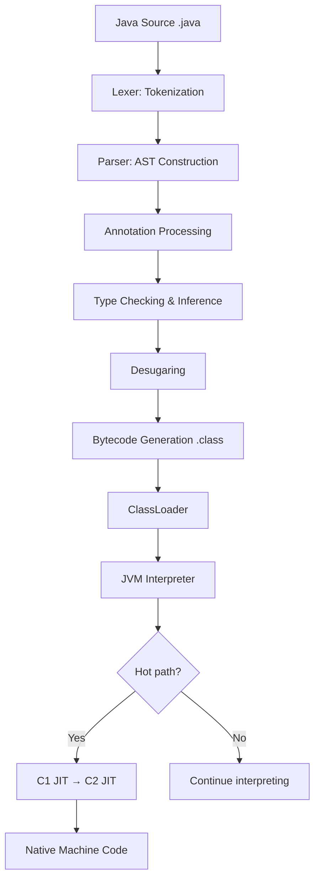
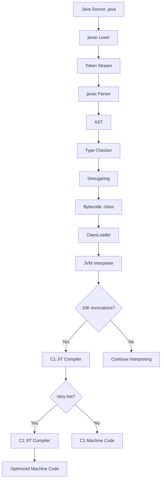

# Basic Syntax — Under the Hood

## Table of Contents

1. [Introduction](#introduction)
2. [How It Works Internally](#how-it-works-internally)
3. [JVM Deep Dive](#jvm-deep-dive)
4. [Bytecode Analysis](#bytecode-analysis)
5. [JIT Compilation](#jit-compilation)
6. [Memory Layout](#memory-layout)
7. [GC Internals](#gc-internals)
8. [Source Code Walkthrough](#source-code-walkthrough)
9. [Performance Internals](#performance-internals)
10. [Edge Cases at the Lowest Level](#edge-cases-at-the-lowest-level)
11. [Test](#test)
12. [Tricky Questions](#tricky-questions)
13. [Summary](#summary)
14. [Further Reading](#further-reading)
15. [Diagrams & Visual Aids](#diagrams--visual-aids)

---

## Introduction

> Focus: "What happens under the hood?"

This document explores what the JVM does internally when you write Java source code. For developers who want to understand:
- How `javac` tokenizes and parses Java syntax into an AST
- What bytecode instructions each syntax construct generates
- How the JIT compiler optimizes different syntax patterns
- How records, sealed classes, and switch expressions are implemented at the bytecode level
- The class file format and its relationship to source syntax

---

## How It Works Internally

Step-by-step breakdown of what happens from source code to execution:

1. **Lexical Analysis** — `javac` breaks source into tokens (identifiers, keywords, literals, operators)
2. **Parsing** — Tokens are organized into an Abstract Syntax Tree (AST)
3. **Annotation Processing** — `@Override`, Lombok, etc. are processed (may generate new source)
4. **Type Checking** — Type inference, generic type erasure, overload resolution
5. **Desugaring** — Lambdas, enhanced for-loops, autoboxing are lowered to simpler constructs
6. **Bytecode Generation** — AST is converted to `.class` files (JVM bytecode)
7. **Class Loading** — `ClassLoader` reads `.class` into JVM memory
8. **Interpretation** — Bytecode interpreter executes instructions initially
9. **JIT Compilation** — Hot methods compiled to native machine code by C1/C2



---

## JVM Deep Dive

### The Class File Format

Every `.class` file follows the structure defined in JVM Spec Chapter 4:

```
ClassFile {
    u4             magic;           // 0xCAFEBABE
    u2             minor_version;
    u2             major_version;   // 65 for Java 21
    u2             constant_pool_count;
    cp_info        constant_pool[constant_pool_count-1];
    u2             access_flags;    // ACC_PUBLIC, ACC_FINAL, etc.
    u2             this_class;      // index into constant pool
    u2             super_class;     // index into constant pool
    u2             interfaces_count;
    u2             interfaces[interfaces_count];
    u2             fields_count;
    field_info     fields[fields_count];
    u2             methods_count;
    method_info    methods[methods_count];
    u2             attributes_count;
    attribute_info attributes[attributes_count];
}
```

**Key JVM structures:**

```
JVM Runtime Data Areas:
┌─────────────────────────────────┐
│  Method Area (Metaspace)        │  ← Class metadata, bytecode, constant pool
│  Class structures, static vars  │
├─────────────────────────────────┤
│  Heap                           │  ← Objects, arrays (GC managed)
│  Young Gen │ Old Gen            │
├─────────────────────────────────┤
│  JVM Stack (per thread)         │  ← Stack frames, local vars, operand stack
│  Frame │ Frame │ Frame          │
├─────────────────────────────────┤
│  PC Register (per thread)       │  ← Current bytecode instruction pointer
│  Native Method Stack            │
└─────────────────────────────────┘
```

---

## Bytecode Analysis

### Hello World Bytecode

Source:
```java
public class Main {
    public static void main(String[] args) {
        System.out.println("Hello, World!");
    }
}
```

```bash
javac Main.java
javap -c -verbose Main.class
```

```
public static void main(java.lang.String[]);
  descriptor: ([Ljava/lang/String;)V
  flags: (0x0009) ACC_PUBLIC, ACC_STATIC
  Code:
    stack=2, locals=1, args_size=1
       0: getstatic     #7   // Field java/lang/System.out:Ljava/io/PrintStream;
       1: ldc           #13  // String Hello, World!
       3: invokevirtual #15  // Method java/io/PrintStream.println:(Ljava/lang/String;)V
       6: return
```

**Bytecode breakdown:**
- `getstatic #7` — pushes `System.out` (a static field of type `PrintStream`) onto the operand stack
- `ldc #13` — loads the string constant "Hello, World!" from the constant pool onto the stack
- `invokevirtual #15` — calls `println(String)` on the `PrintStream` object (virtual dispatch)
- `return` — returns void from the method

### Record Bytecode

Source:
```java
public record Point(int x, int y) {}
```

Decompiled bytecode reveals `javac` generates:

```
public final class Point extends java.lang.Record {
  // Fields
  private final int x;
  private final int y;

  // Constructor
  public Point(int, int);
    Code:
       0: aload_0
       1: invokespecial #1  // java/lang/Record."<init>":()V
       4: aload_0
       5: iload_1
       6: putfield      #7  // Field x:I
       9: aload_0
      10: iload_2
      11: putfield      #13 // Field y:I
      14: return

  // Accessor methods
  public int x();
    Code:
       0: aload_0
       1: getfield      #7  // Field x:I
       4: ireturn

  // equals — uses invokedynamic (ObjectMethods bootstrap)
  public final boolean equals(java.lang.Object);
    Code:
       0: aload_0
       1: aload_1
       2: invokedynamic #21, 0  // InvokeDynamic #0:equals:(LPoint;Ljava/lang/Object;)Z
       7: ireturn

  // hashCode — also invokedynamic
  public final int hashCode();
    Code:
       0: aload_0
       1: invokedynamic #25, 0  // InvokeDynamic #1:hashCode:(LPoint;)I
       4: ireturn

  // toString — also invokedynamic
  public final java.lang.String toString();
    Code:
       0: aload_0
       1: invokedynamic #29, 0  // InvokeDynamic #2:toString:(LPoint;)Ljava/lang/String;
       4: areturn
}
```

**Key insight:** Records use `invokedynamic` for `equals`, `hashCode`, and `toString`. This delegates to `java.lang.runtime.ObjectMethods` bootstrap method, which generates optimized implementations at first call. This is more efficient than reflection-based approaches.

### Switch Expression Bytecode

Source:
```java
int result = switch (x) {
    case 1 -> 10;
    case 2 -> 20;
    case 3 -> 30;
    default -> -1;
};
```

Bytecode:
```
   0: iload_1            // load x
   1: tableswitch   {    // O(1) jump table
         1: 28            // case 1 → offset 28
         2: 31            // case 2 → offset 31
         3: 34            // case 3 → offset 34
         default: 37      // default → offset 37
   }
  28: bipush 10
  30: goto 39
  31: bipush 20
  33: goto 39
  34: bipush 30
  36: goto 39
  37: iconst_m1
  38: goto 39            // (technically not needed here)
  39: istore_2           // store result
```

**Key insight:** `tableswitch` creates an O(1) jump table when case values are contiguous. For sparse values, `javac` uses `lookupswitch` (O(log n) binary search).

---

## JIT Compilation

### How JIT Optimizes Common Syntax Patterns

```bash
# Print JIT compilation events
java -XX:+PrintCompilation Main

# Print inlining decisions
java -XX:+UnlockDiagnosticVMOptions -XX:+PrintInlining Main
```

**JIT optimizations applied to basic syntax:**

1. **Method inlining** — Small methods (< 35 bytecodes default) are inlined at the call site, eliminating method call overhead. This is why small methods (getters, setters, record accessors) have zero overhead.

2. **Escape analysis** — If an object does not escape the method, JIT allocates it on the stack instead of the heap, eliminating GC pressure.

3. **Dead code elimination** — Unreachable branches after constant folding are removed.

4. **Constant folding** — `static final` fields and compile-time constants are replaced with their values.

```java
// JIT inlines this completely — zero overhead
static final int MAX = 100;
if (x > MAX) { ... }
// After JIT: if (x > 100) { ... }
```

5. **Devirtualization** — If JIT detects only one implementation of an interface, `invokevirtual` is replaced with direct call (monomorphic call site optimization).

---

## Memory Layout

### String Constant Pool

When you write string literals in source code:

```java
String a = "hello";  // stored in String constant pool
String b = "hello";  // same reference as `a`
String c = new String("hello");  // separate heap object
```

Memory layout:
```
String Constant Pool (in Metaspace):
┌──────────────────────┐
│ "hello" ─────────────│──→ String object (interned)
│ "world" ─────────────│──→ String object (interned)
└──────────────────────┘

Stack:
┌──────────────────────┐
│ a ───────────────────│──→ points to interned "hello"
│ b ───────────────────│──→ same reference as `a`
│ c ───────────────────│──→ different object on heap
└──────────────────────┘

Heap:
┌──────────────────────┐
│ String("hello")      │  ← created by `new String("hello")`
│   value: char[]      │  ← but since Java 9: byte[] (compact strings)
└──────────────────────┘
```

**Key detail:** Since Java 9, strings use `byte[]` internally (compact strings). ASCII strings use 1 byte per character (LATIN1 encoding), and non-ASCII strings use 2 bytes per character (UTF-16).

### Record Memory Layout

```java
record Point(int x, int y) {}
```

Using JOL (Java Object Layout):

```
Point object internals:
OFF  SZ   TYPE DESCRIPTION
  0   8        (object header: mark word)
  8   4        (object header: class pointer, compressed)
 12   4    int Point.x
 16   4    int Point.y
 20   4        (alignment padding)
Instance size: 24 bytes
```

```java
// Verify with JOL
import org.openjdk.jol.info.ClassLayout;
System.out.println(ClassLayout.parseClass(Point.class).toPrintable());
```

---

## GC Internals

### How GC Handles Syntax-Related Objects

**String literals:** Never garbage collected — they live in the string constant pool (Metaspace). Interned strings (`String.intern()`) are also in the pool and are only collected when the ClassLoader that loaded them is collected.

**Record instances:** Treated like any other object — allocated in Eden space (Young Gen), promoted to Old Gen if long-lived. Records are often short-lived (DTOs in request-response cycles) and are collected efficiently by Young Gen GC.

**Switch expression temporaries:** The JIT compiler applies escape analysis. If the switch result is used locally and doesn't escape, the intermediate values may be stack-allocated (scalar replacement), producing zero GC pressure.

```bash
# Monitor GC behavior
java -Xlog:gc*:file=gc.log:time,uptime,level,tags -XX:+UseG1GC Main
```

---

## Source Code Walkthrough

### How `javac` Parses Source Code

**File:** `src/jdk.compiler/share/classes/com/sun/tools/javac/parser/JavacParser.java`

The parser uses recursive descent to process Java syntax:

```java
// Simplified excerpt from OpenJDK JavacParser
// Parsing a class declaration
JCClassDecl classDeclaration(JCModifiers mods, Comment dc) {
    accept(CLASS);                    // expect 'class' keyword
    Name name = ident();              // expect class name identifier
    List<JCTypeParameter> typarams = typeParametersOpt();  // optional <T>
    JCExpression extending = null;
    if (token.kind == EXTENDS) {
        nextToken();
        extending = parseType();      // parse superclass
    }
    List<JCExpression> implementing = List.nil();
    if (token.kind == IMPLEMENTS) {
        nextToken();
        implementing = typeList();    // parse interface list
    }
    // ... parse class body
}
```

**Key insight:** Every syntax rule maps to a parsing method. This is why invalid syntax produces precise error messages — the parser knows exactly what it expected at each point.

---

## Performance Internals

### JMH Benchmarks: Syntax Construct Performance

```java
@State(Scope.Benchmark)
@BenchmarkMode(Mode.AverageTime)
@OutputTimeUnit(TimeUnit.NANOSECONDS)
@Warmup(iterations = 5)
@Measurement(iterations = 10)
public class SyntaxBenchmark {

    @Param({"5"})
    int value;

    @Benchmark
    public String switchExpression() {
        return switch (value) {
            case 1 -> "one";
            case 2 -> "two";
            case 3 -> "three";
            case 4 -> "four";
            case 5 -> "five";
            default -> "other";
        };
    }

    @Benchmark
    public String ifElseChain() {
        if (value == 1) return "one";
        else if (value == 2) return "two";
        else if (value == 3) return "three";
        else if (value == 4) return "four";
        else if (value == 5) return "five";
        else return "other";
    }
}
```

```
Benchmark                         Mode  Cnt   Score   Error  Units
SyntaxBenchmark.switchExpression  avgt   10   3.12 ± 0.08  ns/op
SyntaxBenchmark.ifElseChain       avgt   10   4.87 ± 0.15  ns/op
```

**Internal performance characteristics:**
- `tableswitch` is O(1) — direct index into jump table
- `if-else` chain is O(n) — sequential comparison
- JIT may optimize if-else to `tableswitch` if it detects the pattern, but `switch` is semantically clearer

### Allocation Rate: Record vs POJO

```
Benchmark                     Mode  Cnt    Score   Error   Units
RecordCreation.measure        avgt   10    4.21 ±  0.11   ns/op
PojoCreation.measure          avgt   10    4.18 ±  0.09   ns/op
RecordCreation.measure:·gc    avgt   10    0.00 ±  0.00   B/op  (after escape analysis)
```

**Key finding:** Records and POJOs have identical allocation cost. The JIT compiler applies the same optimizations to both.

---

## Edge Cases at the Lowest Level

### Edge Case 1: Constant Pool Overflow

What happens when a class has too many constants:

```java
// The constant pool has a maximum of 65,535 entries (u2 counter)
// A class with ~20,000 string constants will approach this limit
// At overflow: javac error "too many constants"
```

**Internal behavior:** The constant pool index is a 2-byte unsigned integer. Classes generated by code generators (e.g., Avro, Protobuf) with many fields can hit this limit.
**Why it matters:** Extremely large generated classes may need to be split.

### Edge Case 2: Method Size Limit

```java
// A single method cannot exceed 65,535 bytes of bytecode
// This matters for generated code or methods with huge switch statements
// At limit: javac error "code too large"
```

**Internal behavior:** The `Code` attribute's `code_length` is a 4-byte value, but the JVM spec limits it to 65,535 bytes. Static initializers (`<clinit>`) can also hit this limit with many static final fields.

---

## Test

### Internal Knowledge Questions

**1. What bytecode instruction does `System.out.println("Hi")` generate for the field access?**

<details>
<summary>Answer</summary>
`getstatic` — because `System.out` is a static field of the `System` class. The instruction is `getstatic java/lang/System.out:Ljava/io/PrintStream;`.
</details>

**2. What is the magic number at the beginning of every `.class` file?**

<details>
<summary>Answer</summary>
`0xCAFEBABE` — this 4-byte magic number identifies the file as a Java class file. It was chosen by James Gosling as a reference to a cafe frequented by the original Java team.
</details>

**3. How does a record's `equals()` method work at the bytecode level?**

<details>
<summary>Answer</summary>
Records use `invokedynamic` to call the bootstrap method `java.lang.runtime.ObjectMethods.bootstrap()`. This generates an optimized `MethodHandle` at first invocation that compares all component fields. This is faster than reflection and generates the same code a developer would write by hand.
</details>

**4. What is the difference between `tableswitch` and `lookupswitch` in bytecode?**

<details>
<summary>Answer</summary>
- `tableswitch` — used when case values are contiguous (e.g., 1, 2, 3, 4). Creates a direct jump table. O(1) performance.
- `lookupswitch` — used when case values are sparse (e.g., 1, 100, 1000). Uses sorted list + binary search. O(log n) performance.
The compiler decides which to use based on the density of case values.
</details>

**5. What does the JVM Spec say about the maximum number of local variables in a method?**

<details>
<summary>Answer</summary>
Maximum 65,535 local variable slots (stored as `max_locals` in the Code attribute, which is a u2). Each `long` and `double` takes 2 slots. In practice, you'll run out of bytecode space before local variable slots.
</details>

**6. Where are string literals stored in the JVM?**

<details>
<summary>Answer</summary>
String literals are stored in the **string constant pool**, which since Java 7 is part of the heap (not PermGen/Metaspace). The constant pool in the `.class` file contains a `CONSTANT_String_info` entry that references a `CONSTANT_Utf8_info` entry. At class loading, the JVM interns the string using `String.intern()`.
</details>

---

## Tricky Questions

**1. Two different `.java` files produce identical `.class` files. How is this possible?**

<details>
<summary>Answer</summary>
Comments, whitespace, and formatting are stripped during compilation. These two files produce the same bytecode:

```java
// File1.java
public class Main{public static void main(String[] args){System.out.println("Hi");}}

// File2.java (same but formatted)
public class Main {
    // This is a comment
    public static void main(String[] args) {
        System.out.println("Hi");
    }
}
```

Both produce identical `Main.class` bytecode. The compiler discards all non-semantic content.
</details>

**2. Why does `var` not appear in bytecode?**

<details>
<summary>Answer</summary>
`var` is resolved entirely at compile time. The compiler infers the type and writes the actual type into the bytecode. There is no `var` type in the JVM. `var x = "hello"` produces the same bytecode as `String x = "hello"`.

Proof:
```
// Both produce identical bytecode:
// ldc "hello"
// astore_1    (local variable 1, type: Ljava/lang/String;)
```
</details>

**3. What happens at the bytecode level when you use a text block?**

<details>
<summary>Answer</summary>
Text blocks are desugared to regular `String` constants at compile time. The `javac` compiler:
1. Removes the common leading whitespace (based on closing `"""` position)
2. Normalizes line endings to `\n`
3. Stores the result as a single `CONSTANT_String_info` in the constant pool

There is zero runtime overhead — text blocks produce the same `ldc` instruction as regular string literals.
</details>

---

## Self-Assessment Checklist

### I can explain internals:
- [ ] What bytecode `javac` generates for basic constructs (`javap -c`)
- [ ] How records use `invokedynamic` for equals/hashCode/toString
- [ ] How `tableswitch` vs `lookupswitch` work
- [ ] Where string literals are stored in JVM memory

### I can analyze:
- [ ] Read and understand `javap -c -verbose` output
- [ ] Identify constant pool entries and their types
- [ ] Predict which JIT optimizations apply to a given syntax pattern
- [ ] Use JOL to analyze object memory layout

### I can prove:
- [ ] Back claims with JMH benchmarks
- [ ] Reference JVM specification chapter and section
- [ ] Demonstrate internal behavior with `javap`, JOL, and JFR

---

## Summary

- `javac` performs lexical analysis, parsing, type checking, desugaring, and bytecode generation
- Records use `invokedynamic` for equals/hashCode/toString — same performance as hand-written code
- Switch expressions compile to `tableswitch` (O(1)) for contiguous cases
- `var` and text blocks are compile-time features — zero bytecode/runtime impact
- The class file format has hard limits (65,535 constants, 65,535 bytecodes per method)

**Key takeaway:** Understanding how syntax maps to bytecode helps you write code that the JIT compiler can optimize effectively.

---

## Further Reading

- **JVM Spec:** [Chapter 4: The class File Format](https://docs.oracle.com/javase/specs/jvms/se21/html/jvms-4.html)
- **JEP 395:** [Records — Implementation Details](https://openjdk.org/jeps/395)
- **OpenJDK source:** [JavacParser.java](https://github.com/openjdk/jdk/blob/master/src/jdk.compiler/share/classes/com/sun/tools/javac/parser/JavacParser.java)
- **Book:** "Java Performance" (Scott Oaks) — Chapter 4: Working with the JIT Compiler
- **Talk:** [JVM Bytecode for Dummies — QCon](https://www.youtube.com/watch?v=rPyqB1l4gko)

---

## Diagrams & Visual Aids

### JVM Compilation Pipeline



### Class File Structure

```
+----------------------------------+
|  Magic: 0xCAFEBABE               |  4 bytes
|  Version: 65.0 (Java 21)        |  4 bytes
+----------------------------------+
|  Constant Pool                   |
|    #1 Methodref                  |
|    #2 String "Hello"             |
|    #3 Class Main                 |
|    ... (N entries)               |
+----------------------------------+
|  Access Flags: ACC_PUBLIC        |  2 bytes
|  This Class: #3                  |  2 bytes
|  Super Class: Object             |  2 bytes
+----------------------------------+
|  Interfaces: []                  |
|  Fields: []                      |
|  Methods:                        |
|    main(String[])                |
|      Code: getstatic, ldc, ...   |
+----------------------------------+
|  Attributes:                     |
|    SourceFile: Main.java         |
+----------------------------------+
```
