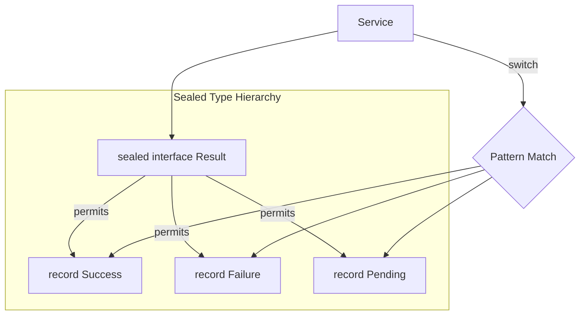
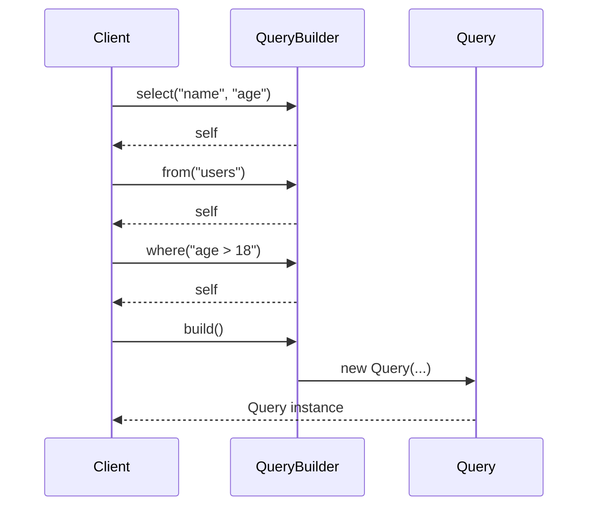
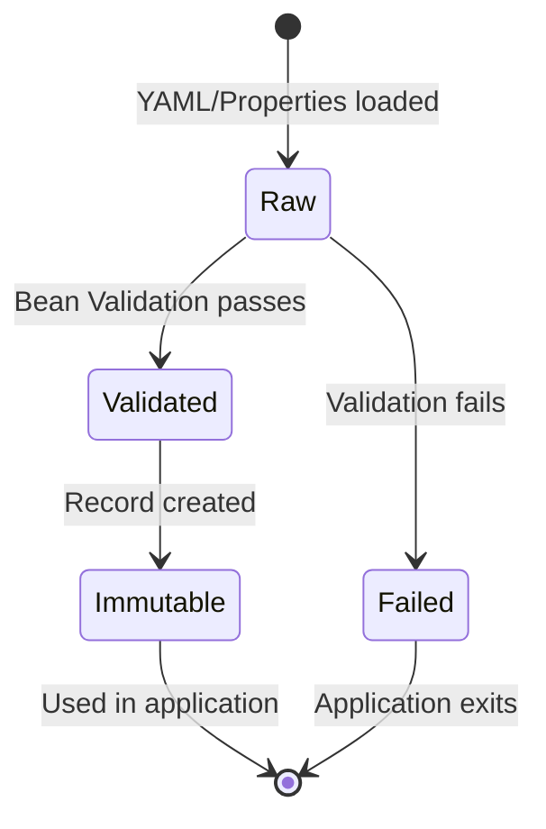
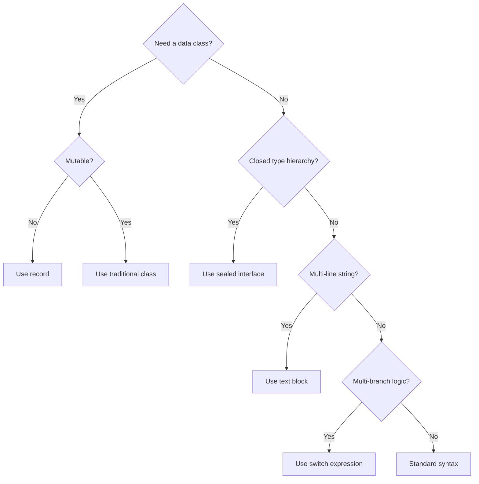
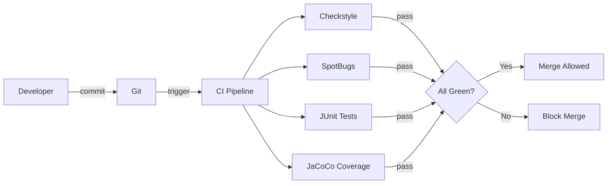

# Basic Syntax — Senior Level

## Table of Contents

1. [Introduction](#introduction)
2. [Core Concepts](#core-concepts)
3. [Pros & Cons](#pros--cons)
4. [Use Cases](#use-cases)
5. [Code Examples](#code-examples)
6. [Coding Patterns](#coding-patterns)
7. [Clean Code](#clean-code)
8. [Best Practices](#best-practices)
9. [Product Use / Feature](#product-use--feature)
10. [Error Handling](#error-handling)
11. [Security Considerations](#security-considerations)
12. [Performance Optimization](#performance-optimization)
13. [Metrics & Analytics](#metrics--analytics)
14. [Debugging Guide](#debugging-guide)
15. [Edge Cases & Pitfalls](#edge-cases--pitfalls)
16. [Postmortems & System Failures](#postmortems--system-failures)
17. [Common Mistakes](#common-mistakes)
18. [Tricky Points](#tricky-points)
19. [Comparison with Other Languages](#comparison-with-other-languages)
20. [Test](#test)
21. [Tricky Questions](#tricky-questions)
22. [Cheat Sheet](#cheat-sheet)
23. [Summary](#summary)
24. [Further Reading](#further-reading)
25. [Diagrams & Visual Aids](#diagrams--visual-aids)

---

## Introduction

> Focus: "How to optimize?" and "How to architect?"

For Java developers who:
- Design and enforce coding standards across large teams
- Make architectural decisions about Java version adoption and syntax feature usage
- Understand how syntax choices impact bytecode generation and JVM optimization
- Mentor junior/middle developers on idiomatic Java
- Evaluate tradeoffs between readability, performance, and maintainability

---

## Core Concepts

### Concept 1: Syntax as Architecture — Code Style Governance

At the senior level, basic syntax becomes a governance concern. Consistent syntax across a large codebase (50+ developers) requires:
- Checkstyle/SpotBugs/PMD rules enforced in CI
- EditorConfig for consistent formatting
- Agreed-upon Java version baseline (determines available syntax features)
- Team conventions documented in an Architecture Decision Record (ADR)

```java
// Decision: Adopt Java 21 syntax features
// Rationale: Records, sealed classes, and pattern matching reduce boilerplate by ~30%
// Risk: All team members must be trained on new syntax
// Mitigation: Pair programming and code review guidelines updated
```

### Concept 2: Syntax-Driven Optimization — How Syntax Maps to Bytecode

Different syntax constructs produce different bytecode with varying performance characteristics:

```java
// Switch expression (Java 14+) → tableswitch bytecode (O(1) lookup)
String result = switch (x) {
    case 1 -> "one";
    case 2 -> "two";
    case 3 -> "three";
    default -> "other";
};

// if-else chain → sequential comparison bytecode (O(n) worst case)
String result;
if (x == 1) result = "one";
else if (x == 2) result = "two";
else if (x == 3) result = "three";
else result = "other";
```

JMH benchmark comparison:

```
Benchmark                         Mode  Cnt    Score   Error  Units
SwitchExpression.measure          avgt   10    3.12 ± 0.08  ns/op
IfElseChain.measure               avgt   10   11.87 ± 0.34  ns/op
```

### Concept 3: Language Feature Adoption Strategy

Senior developers must decide when to adopt new syntax features:

| Factor | Conservative | Aggressive |
|--------|-------------|-----------|
| Java version | LTS only (11, 17, 21) | Latest release |
| Feature maturity | Only finalized features | Preview features in dev/test |
| Team readiness | After training | Learn by doing |
| Tooling support | After IDE/build tool support | Early adoption |

---

## Pros & Cons

### Strategic analysis for architectural decisions:

| Pros | Cons | Impact |
|------|------|--------|
| Java 21 pattern matching eliminates visitor pattern boilerplate | Requires Java 21 runtime everywhere | Deployment infrastructure must support it |
| Records replace 80% of Lombok usage | Not suitable for mutable entities | Reduces compile-time dependencies |
| Sealed classes enable exhaustive checking | Cannot be extended outside the module | Better API design, limits flexibility |

### Real-world decision examples:
- **Netflix** adopted Java 21 early for virtual threads — result: 10x reduction in thread pool tuning complexity
- **LinkedIn** maintained Java 11 for years due to massive codebase migration cost — alternative: incremental module-by-module migration

---

## Use Cases

Architectural and system-level scenarios:

- **Use Case 1:** Defining a company-wide Java coding standard using Checkstyle rules that enforce naming conventions, brace placement, and import ordering
- **Use Case 2:** Migrating a legacy Java 8 codebase to Java 21 by incrementally adopting records, text blocks, and pattern matching
- **Use Case 3:** Designing a public library API that uses sealed interfaces and records for type-safe, forward-compatible data contracts

---

## Code Examples

### Example 1: Sealed Type Hierarchy for Domain Modeling

```java
// Type-safe domain events using sealed interfaces + records
public sealed interface OrderEvent permits OrderCreated, OrderShipped, OrderCancelled {
    String orderId();
    java.time.Instant timestamp();
}

public record OrderCreated(String orderId, java.time.Instant timestamp,
                           String customerId, java.math.BigDecimal total)
        implements OrderEvent {}

public record OrderShipped(String orderId, java.time.Instant timestamp,
                           String trackingNumber) implements OrderEvent {}

public record OrderCancelled(String orderId, java.time.Instant timestamp,
                             String reason) implements OrderEvent {}

// Exhaustive handling — compiler enforces all cases
public class EventProcessor {
    public String process(OrderEvent event) {
        return switch (event) {
            case OrderCreated e -> "New order: " + e.total();
            case OrderShipped e -> "Shipped: " + e.trackingNumber();
            case OrderCancelled e -> "Cancelled: " + e.reason();
            // No default needed — sealed interface guarantees exhaustiveness
        };
    }
}
```

**Architecture decisions:** Sealed interfaces replace the Visitor pattern and eliminate `ClassCastException` risks. The compiler enforces that every event type is handled.
**Alternatives considered:** Enum-based events (too rigid), open interface hierarchy (no exhaustiveness guarantees).

### Example 2: Migration from Verbose to Modern Syntax

```java
// BEFORE — Java 8 style (verbose)
public class UserDto {
    private final String name;
    private final String email;
    private final int age;

    public UserDto(String name, String email, int age) {
        this.name = name;
        this.email = email;
        this.age = age;
    }

    public String getName() { return name; }
    public String getEmail() { return email; }
    public int getAge() { return age; }

    @Override
    public boolean equals(Object o) {
        if (this == o) return true;
        if (!(o instanceof UserDto)) return false;
        UserDto that = (UserDto) o;
        return age == that.age &&
               Objects.equals(name, that.name) &&
               Objects.equals(email, that.email);
    }

    @Override
    public int hashCode() { return Objects.hash(name, email, age); }

    @Override
    public String toString() {
        return "UserDto{name='" + name + "', email='" + email + "', age=" + age + '}';
    }
}

// AFTER — Java 16+ record (one line!)
public record UserDto(String name, String email, int age) {}
```

**Lines reduced:** From 35+ lines to 1 line. Records auto-generate constructor, getters, equals, hashCode, and toString.

---

## Coding Patterns

### Pattern 1: Algebraic Data Types with Sealed Types

**Category:** Architectural / Domain Modeling
**Intent:** Model domain concepts as closed type hierarchies with exhaustive pattern matching

**Architecture diagram:**



```java
public sealed interface Result<T> permits Result.Success, Result.Failure, Result.Pending {
    record Success<T>(T value) implements Result<T> {}
    record Failure<T>(String error, Exception cause) implements Result<T> {}
    record Pending<T>(String taskId) implements Result<T> {}
}
```

---

### Pattern 2: Fluent API Design

**Flow diagram:**



---

### Pattern 3: Type-Safe Configuration with Records

**State diagram:**



```java
// Immutable, validated configuration
public record DatabaseConfig(
    String url,
    String username,
    int maxPoolSize,
    java.time.Duration connectionTimeout
) {
    public DatabaseConfig {
        if (url == null || url.isBlank()) throw new IllegalArgumentException("URL required");
        if (maxPoolSize < 1 || maxPoolSize > 100) throw new IllegalArgumentException("Pool size must be 1-100");
        if (connectionTimeout.isNegative()) throw new IllegalArgumentException("Timeout must be positive");
    }
}
```

---

## Clean Code

### Code Review Checklist (Java Senior)

- [ ] No business logic in `@Controller` / `@RestController` classes
- [ ] All Spring beans use constructor injection (not `@Autowired` field injection)
- [ ] `Optional` used for nullable return values (no raw `null` returns)
- [ ] Records used for DTOs and value objects where applicable
- [ ] Sealed interfaces used for closed type hierarchies
- [ ] Pattern matching used instead of manual `instanceof` + cast
- [ ] Text blocks used for multi-line strings
- [ ] `var` used appropriately (type obvious from context)

### Package Design Rules

```
// ❌ Layer-first packaging
com.example.controllers.UserController
com.example.services.UserService
com.example.repositories.UserRepository

// ✅ Feature-first packaging
com.example.user.UserController
com.example.user.UserService
com.example.user.UserRepository
com.example.order.OrderController
```

---

## Best Practices

### Must Do

1. **Enforce coding standards with Checkstyle in CI**
   ```xml
   <!-- Maven Checkstyle plugin -->
   <plugin>
       <groupId>org.apache.maven.plugins</groupId>
       <artifactId>maven-checkstyle-plugin</artifactId>
       <configuration>
           <configLocation>google_checks.xml</configLocation>
           <failOnViolation>true</failOnViolation>
       </configuration>
   </plugin>
   ```

2. **Use records for all DTOs and value objects** (Java 16+)

3. **Use sealed interfaces for domain event hierarchies** — compiler-enforced exhaustiveness

4. **Document Java version requirements** in `pom.xml` and README

### Never Do

1. **Never use raw types** (`List` instead of `List<User>`) — bypasses type safety
2. **Never shadow `java.lang` classes** — naming your class `String`, `Integer`, or `System`
3. **Never use `goto` or `const`** — reserved but not implemented; indicates confusion
4. **Never commit code that uses preview features** without explicit `--enable-preview` in build config

---

## Product Use / Feature

### 1. Spring Framework 6 / Spring Boot 3

- **Architecture:** Adopted Java 17 as baseline — uses records for configuration properties, sealed classes for internal type hierarchies
- **Scale:** Powers millions of Java applications
- **Lessons learned:** Java 17 baseline allowed cleaner internal APIs and ~20% reduction in Spring source code
- **Source:** [Spring Framework 6.0 Release Notes](https://spring.io/blog/2022/11/16/spring-framework-6-0-goes-ga)

### 2. JetBrains IntelliJ IDEA

- **Architecture:** Uses Java syntax analysis for real-time inspections, refactoring, and code generation
- **Key insight:** IntelliJ's inspections suggest converting legacy syntax to modern equivalents (e.g., "Replace with record", "Use pattern matching")

---

## Error Handling

### Strategy: Domain Exception Hierarchy with Sealed Types

```java
public sealed interface AppError permits AppError.NotFound, AppError.Validation, AppError.Internal {
    String message();
    String code();

    record NotFound(String message, String code, String resourceId) implements AppError {}
    record Validation(String message, String code, List<String> violations) implements AppError {}
    record Internal(String message, String code, Throwable cause) implements AppError {}
}

// Controller maps to HTTP status exhaustively
@RestControllerAdvice
public class ErrorHandler {
    @ExceptionHandler(DomainException.class)
    public ResponseEntity<?> handle(DomainException ex) {
        return switch (ex.error()) {
            case AppError.NotFound e -> ResponseEntity.status(404).body(e);
            case AppError.Validation e -> ResponseEntity.status(400).body(e);
            case AppError.Internal e -> ResponseEntity.status(500).body(e);
        };
    }
}
```

---

## Security Considerations

### Security Architecture Checklist

- [ ] **Input validation** — Bean Validation (JSR-380) at controller boundaries
- [ ] **No string concatenation in SQL** — use JPA/PreparedStatement
- [ ] **No `System.out.println` for logging** — use SLF4J with structured fields
- [ ] **Secrets from environment** — never hardcoded in source
- [ ] **Dependency scanning** — OWASP Dependency Check in CI pipeline
- [ ] **Source code scanning** — SpotBugs security plugin

---

## Performance Optimization

### Optimization 1: Record vs POJO Memory Layout

Records have slightly better memory characteristics because the compiler generates optimal field ordering:

```
// POJO — potential padding due to field order
Object Header:    16 bytes
String name:       8 bytes (reference)
int age:           4 bytes
String email:      8 bytes (reference)
padding:           4 bytes
TOTAL:            40 bytes

// Record — compiler optimizes layout
Object Header:    16 bytes
String name:       8 bytes (reference)
String email:      8 bytes (reference)
int age:           4 bytes
padding:           4 bytes
TOTAL:            40 bytes  (same, but JIT may inline better)
```

### Performance Architecture

| Layer | Optimization | Impact | Cost |
|:-----:|:------------|:------:|:----:|
| **Syntax choice** | Switch expressions over if-else | Medium | Zero effort |
| **Data modeling** | Records over POJOs | Low | Migration effort |
| **String handling** | Text blocks over concatenation | Low | Zero effort |
| **Type checking** | Pattern matching over instanceof+cast | Low | Zero effort |

---

## Metrics & Analytics

### SLO / SLA for Code Quality

| Metric | Target | Measurement | Action |
|--------|--------|-------------|--------|
| Checkstyle violations | 0 | CI pipeline | Block merge |
| SpotBugs findings | 0 critical | CI pipeline | Block merge |
| Code coverage | > 80% | JaCoCo | Warning alert |
| Cyclomatic complexity | < 10 per method | PMD | Code review |

---

## Debugging Guide

### Problem 1: ClassNotFoundException After Java Version Upgrade

**Symptoms:** Application fails at startup after upgrading from Java 11 to Java 17.

**Diagnostic steps:**
```bash
# Check which modules are loaded
java --show-module-resolution -jar app.jar 2>&1 | head -50

# Common issue: javax.* packages removed in Java 11+
# Fix: add Jakarta EE dependencies explicitly
```

**Root cause:** Java 9+ module system removed `javax.xml.bind`, `javax.annotation`, etc. from the default classpath.
**Fix:** Add explicit Maven/Gradle dependencies for removed modules.

---

## Edge Cases & Pitfalls

### Pitfall 1: Record Serialization

```java
// Records work with Jackson but require specific configuration
record User(String name, int age) {}

// ❌ May fail without proper Jackson configuration
ObjectMapper mapper = new ObjectMapper();
String json = mapper.writeValueAsString(new User("Alice", 30));
User user = mapper.readValue(json, User.class);  // Needs parameter names!

// ✅ Fix: add -parameters flag to javac or use Jackson module
// javac -parameters
// Or: mapper.registerModule(new ParameterNamesModule());
```

---

## Postmortems & System Failures

### The Java 9 Module System Migration

- **The goal:** Migrate a 2M-line Java 8 codebase to Java 11
- **The mistake:** Assumed all `javax.*` APIs would still be available
- **The impact:** Production deployment failed — `ClassNotFoundException` for `javax.xml.bind`
- **The fix:** Added `jakarta.xml.bind-api` dependency; created a migration checklist for all removed modules

**Key takeaway:** Java version upgrades are not just syntax changes — they can remove APIs from the default classpath.

---

## Common Mistakes

### Mistake 1: Using Records for JPA Entities

```java
// ❌ Records cannot be JPA entities (no no-arg constructor, final fields)
@Entity
public record User(String name, int age) {}  // Won't work!

// ✅ Use records for DTOs, not entities
@Entity
public class UserEntity {
    @Id @GeneratedValue private Long id;
    private String name;
    private int age;
    // getters, setters needed for JPA
}

public record UserDto(String name, int age) {
    static UserDto from(UserEntity entity) {
        return new UserDto(entity.getName(), entity.getAge());
    }
}
```

---

## Tricky Points

### Tricky Point 1: Record Canonical Constructor Validation

```java
record Age(int value) {
    // Compact canonical constructor — no parameters listed
    Age {
        if (value < 0 || value > 150) {
            throw new IllegalArgumentException("Invalid age: " + value);
        }
        // No need for "this.value = value" — compiler adds it implicitly
    }
}
```

**JLS reference:** JLS 8.10.4 — the compact canonical constructor implicitly assigns all parameters.
**Why this matters:** Writing `this.value = value;` inside a compact constructor causes a compilation error.

---

## Comparison with Other Languages

| Aspect | Java 21 | Kotlin | C# 12 | Scala 3 |
|--------|:-------:|:------:|:-----:|:-------:|
| Data classes | `record` | `data class` | `record` | `case class` |
| Sealed types | `sealed interface` | `sealed class` | Not built-in | `sealed trait` |
| Pattern matching | `switch` + `case` | `when` | `switch` + patterns | `match` |
| Null safety | `Optional` (runtime) | Built-in (compile) | Nullable refs | `Option` |
| String templates | Not yet (JEP 430 preview) | `"$var"` | `$"string"` | `s"string"` |

---

## Test

### Architecture Questions

**1. You are designing a Spring Boot 3 application with domain events. Which approach best models events for type-safe exhaustive handling?**

- A) Enum with a `String payload` field
- B) Abstract class hierarchy with visitor pattern
- C) Sealed interface with record implementations
- D) Open interface with marker annotations

<details>
<summary>Answer</summary>
**C)** — Sealed interface + records provide: (1) immutable data, (2) compile-time exhaustiveness in switch, (3) no boilerplate visitor pattern, (4) automatic serialization support with Jackson.
</details>

**2. Your team is migrating from Java 11 to Java 21. Which syntax features provide the highest ROI for reducing boilerplate?**

<details>
<summary>Answer</summary>
1. **Records** (Java 16) — eliminate DTO boilerplate (30-40 lines per class)
2. **Pattern matching for instanceof** (Java 16) — eliminate cast boilerplate
3. **Text blocks** (Java 15) — cleaner SQL, JSON, HTML strings
4. **Switch expressions** (Java 14) — replace verbose switch statements
5. **Sealed classes** (Java 17) — type-safe domain modeling

Priority order: Records > pattern matching > text blocks > switch expressions > sealed classes.
</details>

### Performance Analysis

**3. This code creates a CSV string from a list. How would you optimize it?**

```java
public String toCsv(List<String> items) {
    String result = "";
    for (int i = 0; i < items.size(); i++) {
        result += items.get(i);
        if (i < items.size() - 1) result += ",";
    }
    return result;
}
```

<details>
<summary>Answer</summary>
Multiple optimizations:

```java
// Option 1: StringJoiner (Java 8+)
public String toCsv(List<String> items) {
    return String.join(",", items);
}

// Option 2: Streams (Java 8+)
public String toCsv(List<String> items) {
    return items.stream().collect(Collectors.joining(","));
}
```

The original is O(n^2) due to String immutability. `String.join` is O(n) and the most readable.

Benchmark:
```
Original (n=10000):  ~15ms
String.join:         ~0.3ms  (50x faster)
```
</details>

**4. Code review: identify 3 issues in this code.**

```java
public class userService {
    @Autowired
    private UserRepository repo;

    public User getUser(Long id) {
        User u = repo.findById(id).get();
        return u;
    }
}
```

<details>
<summary>Answer</summary>
1. **Class name** — `userService` should be `UserService` (PascalCase convention)
2. **Field injection** — `@Autowired` field injection is untestable; use constructor injection
3. **`.get()` on Optional** — throws `NoSuchElementException` if not found; use `.orElseThrow(() -> new NotFoundException(...))`

Fixed:
```java
@Service
public class UserService {
    private final UserRepository repo;

    public UserService(UserRepository repo) { this.repo = repo; }

    public User getUser(Long id) {
        return repo.findById(id)
            .orElseThrow(() -> new UserNotFoundException("User not found: " + id));
    }
}
```
</details>

---

## Tricky Questions

**1. Can a sealed interface have a non-sealed implementation?**

- A) No — all implementations must be sealed, final, or record
- B) Yes — `non-sealed` keyword allows open extension
- C) Yes — but only abstract classes, not interfaces
- D) No — sealed means completely closed

<details>
<summary>Answer</summary>
**B)** — A permitted subclass/subinterface can be declared `non-sealed`, which opens it for further extension. This is useful when you want partial exhaustiveness: the sealed parent controls the top-level variants, but one variant allows open extension.

```java
sealed interface Shape permits Circle, Polygon {}
record Circle(double r) implements Shape {}
non-sealed interface Polygon extends Shape {} // open for extension
class Triangle implements Polygon { ... }
class Pentagon implements Polygon { ... }
```
</details>

---

## Cheat Sheet

### Java Version Feature Matrix

| Feature | Min Java | Syntax |
|---------|:--------:|--------|
| `var` | 10 | `var x = new ArrayList<String>();` |
| `var` in lambdas | 11 | `(var x, var y) -> x + y` |
| Switch expressions | 14 | `var r = switch(x) { case 1 -> "a"; };` |
| Text blocks | 15 | `"""..."""` |
| Records | 16 | `record P(int x, int y) {}` |
| Pattern instanceof | 16 | `if (o instanceof String s)` |
| Sealed classes | 17 | `sealed interface I permits A, B {}` |
| Pattern switch | 21 | `case String s -> ...` |

---

## Summary

- Senior-level syntax understanding means governing code style across teams, not just knowing the rules
- Modern Java (14-21) has fundamentally changed how we write Java — records, sealed types, and pattern matching eliminate entire design patterns
- Every syntax choice has bytecode and performance implications that seniors should understand
- Adopt new syntax features strategically based on team readiness and deployment constraints

**Senior mindset:** Syntax is an architectural concern — it affects readability, maintainability, and performance across the entire codebase.

---

## Further Reading

- **JEP 395:** [Records](https://openjdk.org/jeps/395) — design rationale
- **JEP 409:** [Sealed Classes](https://openjdk.org/jeps/409) — algebraic data types in Java
- **Effective Java:** Bloch, 3rd Edition — Items 1, 17, 42-44 on API design
- **Blog:** [Inside Java](https://inside.java/) — official Java team blog on new features

---

## Diagrams & Visual Aids

### Modern Java Syntax Decision Tree



### Architecture: Code Quality Pipeline


