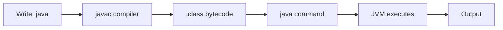
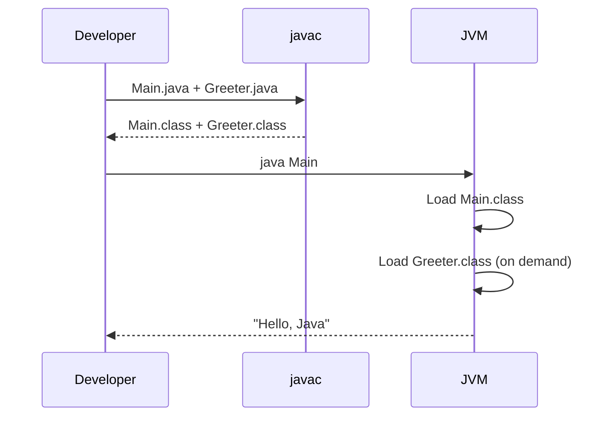
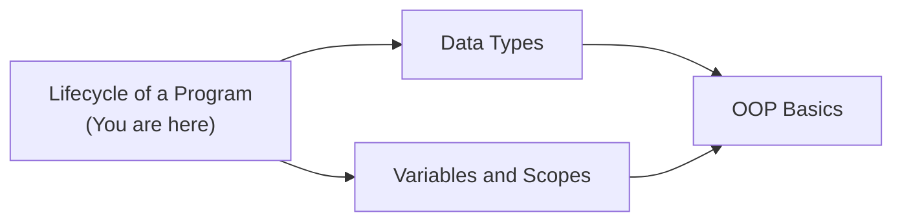
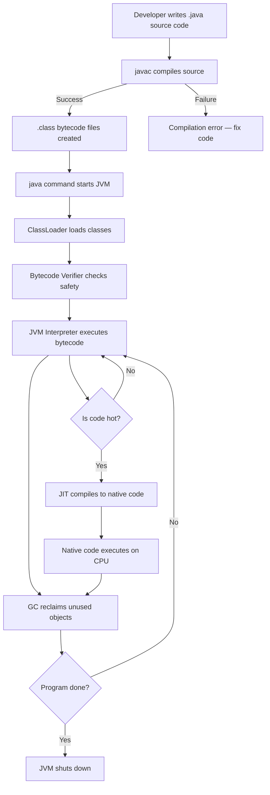

# Lifecycle of a Java Program — Junior Level

## Table of Contents

1. [Introduction](#introduction)
2. [Prerequisites](#prerequisites)
3. [Glossary](#glossary)
4. [Core Concepts](#core-concepts)
5. [Real-World Analogies](#real-world-analogies)
6. [Mental Models](#mental-models)
7. [Pros & Cons](#pros--cons)
8. [Use Cases](#use-cases)
9. [Code Examples](#code-examples)
10. [Coding Patterns](#coding-patterns)
11. [Clean Code](#clean-code)
12. [Product Use / Feature](#product-use--feature)
13. [Error Handling](#error-handling)
14. [Security Considerations](#security-considerations)
15. [Performance Tips](#performance-tips)
16. [Metrics & Analytics](#metrics--analytics)
17. [Best Practices](#best-practices)
18. [Edge Cases & Pitfalls](#edge-cases--pitfalls)
19. [Common Mistakes](#common-mistakes)
20. [Common Misconceptions](#common-misconceptions)
21. [Tricky Points](#tricky-points)
22. [Test](#test)
23. [Tricky Questions](#tricky-questions)
24. [Cheat Sheet](#cheat-sheet)
25. [Self-Assessment Checklist](#self-assessment-checklist)
26. [Summary](#summary)
27. [What You Can Build](#what-you-can-build)
28. [Further Reading](#further-reading)
29. [Related Topics](#related-topics)
30. [Diagrams & Visual Aids](#diagrams--visual-aids)

---

## Introduction

> Focus: "What is it?" and "How to use it?"

The **lifecycle of a Java program** describes every step your code goes through from the moment you write it in a `.java` file until the program finishes executing and the JVM shuts down. Understanding this lifecycle helps you know *what happens behind the scenes* when you type `javac` and `java` — where your code is compiled, how bytecode is loaded, why the JVM exists, and how memory is cleaned up automatically.

Every Java developer — even a beginner — benefits from knowing this flow because it explains common errors (like `ClassNotFoundException`), tells you why Java is "write once, run anywhere", and gives you a mental map for debugging.

---

## Prerequisites

What you should know before studying this topic:

- **Required:** Basic Syntax — you need to know how to write a simple Java class with a `main` method
- **Required:** What a file is and how to use the command line — you will run `javac` and `java` commands
- **Helpful but not required:** Basic understanding of what "compiled" vs "interpreted" means in programming

---

## Glossary

Key terms used in this topic:

| Term | Definition |
|------|-----------|
| **Source code** | The human-readable Java code you write in `.java` files |
| **Compiler (`javac`)** | The tool that translates source code into bytecode (`.class` files) |
| **Bytecode** | Platform-independent instructions stored in `.class` files that the JVM can understand |
| **JVM (Java Virtual Machine)** | The program that runs Java bytecode on any operating system |
| **ClassLoader** | The JVM component that finds and loads `.class` files into memory |
| **JIT (Just-In-Time) Compiler** | A JVM component that compiles frequently used bytecode into native machine code for speed |
| **Garbage Collector (GC)** | The JVM component that automatically frees memory occupied by objects no longer in use |
| **JRE (Java Runtime Environment)** | The package containing the JVM plus standard libraries needed to run Java programs |
| **JDK (Java Development Kit)** | The full development toolkit including JRE, `javac`, `javap`, and other tools |

---

## Core Concepts

### Concept 1: Writing Source Code

You write Java code in plain text files with the `.java` extension. Each file typically contains one public class whose name must match the file name exactly.

```java
// File: Main.java
public class Main {
    public static void main(String[] args) {
        System.out.println("Hello, World!");
    }
}
```

- The `main` method is the entry point — the JVM looks for it when starting your program.

### Concept 2: Compilation (`javac`)

The Java compiler (`javac`) reads your `.java` files and produces `.class` files containing **bytecode**. Bytecode is not native machine code — it is an intermediate representation designed for the JVM.

```bash
javac Main.java    # produces Main.class
```

- If there are syntax errors, `javac` reports them and does not produce a `.class` file.
- One `.java` file can produce multiple `.class` files if it contains inner classes.

### Concept 3: Class Loading

When you run `java Main`, the JVM starts and its **ClassLoader** searches for `Main.class`, reads it, and loads it into memory. The ClassLoader also loads any other classes your program needs (like `System`, `String`, etc.).

- Classes are loaded **lazily** — only when they are first referenced.

### Concept 4: Bytecode Verification

Before executing bytecode, the JVM **verifies** it to ensure it is valid and safe. This prevents corrupted or malicious `.class` files from crashing the JVM or accessing forbidden memory.

### Concept 5: Execution by the JVM

The JVM interprets the bytecode instructions one by one. For code that runs frequently ("hot" code), the **JIT compiler** kicks in and compiles that bytecode into native machine code for much faster execution.

### Concept 6: Garbage Collection

While your program runs, you create objects with `new`. When objects are no longer reachable (no variable points to them), the **garbage collector** automatically reclaims their memory. You never need to call `free()` like in C/C++.

### Concept 7: Program Termination

The program ends when:
- The `main` method finishes executing
- `System.exit(int)` is called
- An unhandled exception terminates the last non-daemon thread
- The JVM is forcefully killed by the operating system

---

## Real-World Analogies

Everyday analogies to help you understand the Java program lifecycle intuitively:

| Concept | Analogy |
|---------|--------|
| **Source code (.java)** | A recipe written in English — humans can read it, but a kitchen robot cannot directly follow it |
| **Compiler (javac)** | A translator who converts the English recipe into a universal "robot language" instruction card |
| **Bytecode (.class)** | The universal instruction card — any kitchen robot (JVM) anywhere in the world can follow it |
| **JVM** | The kitchen robot that reads the instruction card and actually prepares the dish on *this* specific kitchen (operating system) |
| **Garbage Collector** | A cleaning crew that watches the kitchen and automatically removes dishes and ingredients that are no longer needed |

> The analogy breaks down slightly because a real robot can only run one recipe at a time, while the JVM can run many threads concurrently.

---

## Mental Models

How to picture the lifecycle of a Java program in your head:

**The intuition:** Think of it as a pipeline with clear stages: **Write → Compile → Load → Verify → Execute → Clean Up → Exit**. Each stage transforms or processes your code into something the next stage can consume. If any stage fails, the pipeline stops with an error.

**Why this model helps:** When you see a `ClassNotFoundException`, you immediately know the problem is in the "Load" stage. When you see a `StackOverflowError`, you know it is in the "Execute" stage. The pipeline model tells you *where* to look.

**The factory model:** Imagine a factory assembly line:
1. **Design department** (you writing code)
2. **Quality check** (compiler catching errors)
3. **Warehouse** (`.class` files on disk)
4. **Delivery truck** (ClassLoader bringing classes into memory)
5. **Assembly line workers** (JVM interpreter + JIT)
6. **Janitor** (Garbage Collector)

---

## Pros & Cons

| Pros | Cons |
|------|------|
| Write once, run anywhere — bytecode runs on any JVM | Extra compilation step compared to scripting languages like Python |
| Automatic memory management via GC — no manual `free()` | JVM startup time adds overhead for short-lived programs |
| Bytecode verification prevents many security issues | Bytecode is not as fast as native machine code (though JIT closes the gap) |
| JIT compilation makes hot code nearly as fast as C/C++ | GC pauses can cause temporary slowdowns |
| Strong type checking at compile time catches bugs early | Must install JDK/JRE before running any Java program |

### When to use:
- Building cross-platform applications, web servers, Android apps, enterprise software

### When NOT to use:
- Ultra-low-latency systems (hard real-time) where GC pauses are unacceptable
- Tiny scripts where JVM startup time dominates total execution time

---

## Use Cases

When and where you would use this knowledge in real projects:

- **Use Case 1:** Debugging a `ClassNotFoundException` — knowing the class loading stage helps you check the classpath
- **Use Case 2:** Building and deploying a JAR file — you need to understand how compilation and class loading work together
- **Use Case 3:** Understanding why a Java app uses more memory than expected — knowing that GC reclaims memory lazily explains this

---

## Code Examples

### Example 1: Compiling and Running a Simple Program

```java
// File: Main.java
public class Main {
    public static void main(String[] args) {
        String message = "Java Lifecycle Demo";
        System.out.println(message);
        System.out.println("Program is about to exit.");
    }
}
```

**What it does:** Creates a string, prints it, and exits.
**How to run:**
```bash
javac Main.java       # Step 1: Compile — creates Main.class
java Main             # Step 2: Run — JVM loads, verifies, executes
```

### Example 2: Observing Multiple Class Files

```java
// File: Main.java
public class Main {
    // Inner class generates a separate .class file
    static class Helper {
        String greet(String name) {
            return "Hello, " + name + "!";
        }
    }

    public static void main(String[] args) {
        Helper helper = new Helper();
        System.out.println(helper.greet("World"));
    }
}
```

**What it does:** Demonstrates that one `.java` file can produce multiple `.class` files.
**How to run:** `javac Main.java && java Main`
**After compilation you will see:** `Main.class` and `Main$Helper.class`

### Example 3: Observing Garbage Collection

```java
public class Main {
    public static void main(String[] args) {
        for (int i = 0; i < 100_000; i++) {
            // Each iteration creates a String object that becomes eligible for GC
            String temp = "Item " + i;
        }
        System.out.println("Created 100,000 objects — GC will clean up automatically.");

        // Suggest GC (not guaranteed to run immediately)
        System.gc();
        System.out.println("Program complete.");
    }
}
```

**What it does:** Creates many temporary objects to show that GC handles cleanup automatically.
**How to run:** `javac Main.java && java -verbose:gc Main` (the `-verbose:gc` flag prints GC activity)

### Example 4: Viewing Bytecode with javap

```java
public class Main {
    public static void main(String[] args) {
        int a = 10;
        int b = 20;
        int sum = a + b;
        System.out.println(sum);
    }
}
```

**What it does:** Simple addition — but you can view the bytecode it produces.
**How to run:**
```bash
javac Main.java
javap -c Main         # Disassemble bytecode
java Main             # Execute normally
```

**Bytecode output (simplified):**
```
  public static void main(java.lang.String[]);
    Code:
       0: bipush        10     // push 10 onto stack
       2: istore_1             // store in local variable 1 (a)
       3: bipush        20     // push 20 onto stack
       5: istore_2             // store in local variable 2 (b)
       6: iload_1              // load a
       7: iload_2              // load b
       8: iadd                 // add them
       9: istore_3             // store result in variable 3 (sum)
      10: getstatic     System.out
      13: iload_3              // load sum
      14: invokevirtual println
      17: return
```

---

## Coding Patterns

Common patterns beginners encounter when working with the Java program lifecycle:

### Pattern 1: Compile-and-Run Flow

**Intent:** The most basic pattern — write, compile, run.
**When to use:** Every time you develop a Java application.

```java
// 1. Write code in Main.java
public class Main {
    public static void main(String[] args) {
        System.out.println("Step 1: Written");
        System.out.println("Step 2: Compiled by javac");
        System.out.println("Step 3: Running on JVM");
    }
}
```

**Diagram:**



**Remember:** Always compile before running. If you change source code, you must recompile.

---

### Pattern 2: Multi-Class Compilation

**Intent:** Compile a project with multiple source files that depend on each other.
**When to use:** Any project with more than one class.

```java
// File: Greeter.java
public class Greeter {
    public String greet(String name) {
        return "Hello, " + name;
    }
}

// File: Main.java
public class Main {
    public static void main(String[] args) {
        Greeter greeter = new Greeter();
        System.out.println(greeter.greet("Java"));
    }
}
```

```bash
javac Greeter.java Main.java   # Compile all files
java Main                       # Run the entry point
```

**Diagram:**



---

## Clean Code

Basic clean code principles when working with the program lifecycle in Java:

### Naming (Java conventions)

```java
// ❌ Bad
class helloworld {}
void D(int x) { System.out.println(x); }

// ✅ Clean Java naming
class HelloWorld {}
void printValue(int value) { System.out.println(value); }
```

**Java naming rules:**
- Classes: PascalCase (`HelloWorld`, `ProgramRunner`)
- Methods and variables: camelCase (`runProgram`, `fileName`)
- Constants: UPPER_SNAKE_CASE (`MAX_RETRIES`, `DEFAULT_PORT`)
- Packages: lowercase, dot-separated (`com.example.lifecycle`)

---

### Short Methods

```java
// ❌ Too long — compile + run + report in one method
public void processAll(String fileName) { /* 50 lines */ }

// ✅ Each method does one thing
private void compileSource(String fileName) { ... }
private void runProgram(String className) { ... }
private void reportResult(String output) { ... }
```

---

### Javadoc Comments

```java
// ❌ Noise — restates the obvious
// Prints hello
public void printHello() { System.out.println("Hello"); }

// ✅ Explains purpose and usage
/**
 * Prints a greeting message to standard output.
 * Used as the entry point demonstration for lifecycle examples.
 */
public void printHello() { System.out.println("Hello"); }
```

---

## Product Use / Feature

How this topic is used in real-world products and tools:

### 1. IntelliJ IDEA

- **How it uses the program lifecycle:** IntelliJ compiles your code incrementally (only changed files) and manages the classpath so the JVM can find all classes.
- **Why it matters:** Understanding the lifecycle explains why IntelliJ sometimes says "class not found" when you forget to rebuild.

### 2. Maven / Gradle Build Tools

- **How it uses the program lifecycle:** They automate the compile → package → test → deploy pipeline.
- **Why it matters:** Knowing what `javac` does helps you understand Maven's `compile` phase.

### 3. Android Studio

- **How it uses the program lifecycle:** Android compiles Java/Kotlin to bytecode, then converts it to DEX format for the Android Runtime (ART) — a specialized JVM.
- **Why it matters:** The lifecycle is the same concept, just with a different virtual machine at the end.

---

## Error Handling

How to handle errors at each stage of the lifecycle:

### Error 1: Compilation Error (`javac` fails)

```java
// Missing semicolon
public class Main {
    public static void main(String[] args) {
        System.out.println("Hello")  // ← missing semicolon
    }
}
```

**Why it happens:** `javac` enforces strict syntax rules before producing bytecode.
**How to fix:** Read the error message — it tells you the line number and what's wrong.

```bash
Main.java:3: error: ';' expected
        System.out.println("Hello")
                                   ^
```

### Error 2: ClassNotFoundException (runtime)

```bash
java Main    # but Main.class doesn't exist or is in a different directory
```

**Why it happens:** The ClassLoader cannot find the `.class` file in the classpath.
**How to fix:**

```bash
# Make sure you compiled first
javac Main.java

# Make sure you're in the right directory
java -cp . Main
```

### Error 3: NoSuchMethodError — Missing main method

```java
public class Main {
    // Forgot to write main method
    public void run() {
        System.out.println("Running");
    }
}
```

**Why it happens:** The JVM looks for `public static void main(String[] args)` exactly.
**How to fix:** Add the correct `main` method signature.

---

## Security Considerations

Security aspects to keep in mind regarding the program lifecycle:

### 1. Bytecode Verification Protects You

```java
// The JVM verifier ensures:
// - No illegal memory access
// - No type confusion (e.g., treating an int as an object reference)
// - Stack does not overflow/underflow
```

**Risk:** Without verification, a hand-crafted malicious `.class` file could crash the JVM or steal data.
**Mitigation:** The JVM always verifies bytecode before execution — this is built-in and automatic.

### 2. Don't Run Untrusted .class Files

```bash
# ❌ Dangerous — running a .class file from an unknown source
java SomeRandomClass

# ✅ Only run code you compiled yourself or from trusted sources
javac MyApp.java && java MyApp
```

**Risk:** Untrusted bytecode could perform harmful operations despite verification.
**Mitigation:** Use the Java Security Manager (deprecated in Java 17+) or run in a sandboxed environment (container).

---

## Performance Tips

Basic performance considerations for the program lifecycle:

### Tip 1: JIT Compilation Makes Code Faster Over Time

```java
// The first few executions of a method are interpreted (slower).
// After ~10,000 invocations, the JIT compiler kicks in (faster).
public class Main {
    static int compute(int x) {
        return x * x + x;
    }

    public static void main(String[] args) {
        for (int i = 0; i < 100_000; i++) {
            compute(i); // JIT compiles this after many iterations
        }
    }
}
```

**Why it's faster:** JIT compiles bytecode to native machine code — no more interpretation overhead.

### Tip 2: JVM Startup Has a Cost

```bash
# For very short programs, JVM startup time dominates
time java Main   # might show 100+ ms just for JVM initialization
```

**Why it matters:** For CLI tools that run in milliseconds, the JVM startup overhead (100-300ms) is noticeable. For long-running servers, it is negligible.

---

## Metrics & Analytics

Key metrics to track when studying the program lifecycle:

### What to Measure

| Metric | Why it matters | Tool |
|--------|---------------|------|
| **Compilation time** | Slow compilation slows development | `time javac *.java` |
| **JVM startup time** | Affects short-lived programs | `time java Main` |
| **GC pause frequency** | Frequent pauses slow the program | `-verbose:gc` flag |

### Basic Instrumentation

```java
public class Main {
    public static void main(String[] args) {
        long start = System.nanoTime();

        // Your program logic here
        for (int i = 0; i < 1_000_000; i++) {
            String s = "item" + i;
        }

        long elapsed = System.nanoTime() - start;
        System.out.printf("Elapsed: %.2f ms%n", elapsed / 1_000_000.0);
    }
}
```

---

## Best Practices

- **Do this:** Always compile before running — do not assume old `.class` files are up to date
- **Do this:** Use `-verbose:class` to see which classes the JVM loads (helpful for debugging classpath issues)
- **Do this:** Keep one public class per `.java` file, with the filename matching the class name
- **Do this:** Use a build tool (Maven or Gradle) instead of manual `javac` commands for projects with more than a few files
- **Do this:** Run with `-verbose:gc` when investigating memory behavior to see garbage collection activity

---

## Edge Cases & Pitfalls

### Pitfall 1: Class Name vs File Name Mismatch

```java
// File: MyApp.java
public class Main {    // ❌ Class name doesn't match file name
    public static void main(String[] args) {
        System.out.println("Hello");
    }
}
```

**What happens:** `javac` produces an error: `class Main is public, should be declared in a file named Main.java`
**How to fix:** Rename the file to `Main.java` or rename the class to `MyApp`.

### Pitfall 2: Running with `java Main.class` Instead of `java Main`

```bash
java Main.class    # ❌ Wrong — JVM interprets "Main.class" as class name "Main.class"
java Main          # ✅ Correct — JVM looks for Main.class automatically
```

**What happens:** `ClassNotFoundException` or `NoClassDefFoundError`.

---

## Common Mistakes

### Mistake 1: Forgetting to Recompile After Changes

```bash
# You edited Main.java but forgot to run javac again
java Main    # ❌ Runs the OLD version of Main.class
```

```bash
# ✅ Always recompile
javac Main.java && java Main
```

### Mistake 2: Wrong `main` Method Signature

```java
// ❌ Wrong — not static
public void main(String[] args) { ... }

// ❌ Wrong — wrong parameter type
public static void main(String args) { ... }

// ✅ Correct
public static void main(String[] args) { ... }
```

### Mistake 3: Confusing JDK, JRE, and JVM

```
JDK = JRE + Development Tools (javac, javap, jdb)
JRE = JVM + Standard Libraries (java.lang, java.util, etc.)
JVM = The engine that runs bytecode
```

You need the **JDK** to compile. You need at least the **JRE** to run.

---

## Common Misconceptions

Things people often believe about the Java program lifecycle that are not true:

### Misconception 1: "Java is interpreted, so it's slow"

**Reality:** Java starts by interpreting bytecode, but the JIT compiler converts hot code to native machine code. Modern Java applications can run nearly as fast as C/C++ programs.

**Why people think this:** Early Java (1.0-1.2) had no JIT compiler, so it was genuinely slow. The myth persists from the 1990s.

### Misconception 2: "Garbage collection means I never have to worry about memory"

**Reality:** GC prevents *memory leaks from forgotten `free()` calls*, but you can still cause logical memory leaks by holding references to objects you no longer need (e.g., adding to a `List` and never removing).

**Why people think this:** The term "automatic memory management" implies everything is handled, but GC only collects *unreachable* objects.

### Misconception 3: "`System.gc()` forces garbage collection"

**Reality:** `System.gc()` is only a *hint* to the JVM. The JVM is free to ignore it entirely.

**Why people think this:** The method name sounds imperative ("do garbage collection"), but it is purely advisory.

---

## Tricky Points

Things that look simple but have subtle behavior:

### Tricky Point 1: One `.java` File, Multiple `.class` Files

```java
public class Main {
    interface Callback {           // → Main$Callback.class
        void call();
    }

    static class Worker {          // → Main$Worker.class
        void work() {}
    }

    public static void main(String[] args) {
        Callback cb = () -> {};    // → Main$$Lambda... (no .class file on disk for lambdas)
    }
}
```

**Why it's tricky:** Beginners expect one `.class` per `.java`. Inner classes, anonymous classes, and (historically) lambda proxy classes break this assumption.
**Key takeaway:** Always clean build (`rm *.class && javac *.java`) to avoid stale class files.

### Tricky Point 2: Static Initializers Run During Class Loading

```java
public class Main {
    static {
        System.out.println("Static block runs during class loading!");
    }

    public static void main(String[] args) {
        System.out.println("Main method runs after.");
    }
}
// Output:
// Static block runs during class loading!
// Main method runs after.
```

**Why it's tricky:** Code outside methods runs automatically — beginners may not expect this.
**Key takeaway:** Static initializers execute when the class is first loaded, before `main`.

---

## Test

### Multiple Choice

**1. What does the `javac` command produce?**

- A) Native machine code (.exe)
- B) Bytecode (.class files)
- C) Interpreted scripts (.js)
- D) Assembly code (.asm)

<details>
<summary>Answer</summary>

**B)** — `javac` compiles Java source code into bytecode stored in `.class` files. Bytecode is an intermediate representation, not native machine code.

</details>

**2. What is the role of the ClassLoader?**

- A) Compiles Java source code
- B) Finds and loads `.class` files into JVM memory
- C) Collects garbage
- D) Optimizes bytecode to machine code

<details>
<summary>Answer</summary>

**B)** — The ClassLoader locates `.class` files (from disk, JAR, or network) and loads them into the JVM. A) is `javac`, C) is the GC, D) is the JIT compiler.

</details>

### True or False

**3. The JVM can run `.java` files directly without compilation.**

<details>
<summary>Answer</summary>

**True (with caveats)** — Since Java 11, you can run `java Main.java` for single-file programs. The JVM compiles it in-memory first. However, for multi-file projects, you still need `javac`.

</details>

**4. Garbage collection in Java is deterministic — you can predict exactly when it will run.**

<details>
<summary>Answer</summary>

**False** — GC is non-deterministic. The JVM decides when to run GC based on memory pressure, and `System.gc()` is only a hint.

</details>

### What's the Output?

**5. What does this code print?**

```java
public class Main {
    static { System.out.println("A"); }

    public static void main(String[] args) {
        System.out.println("B");
    }

    static { System.out.println("C"); }
}
```

<details>
<summary>Answer</summary>

Output:
```
A
C
B
```
Explanation: Static blocks execute in order during class loading, before the `main` method runs.

</details>

**6. What happens when you run this?**

```bash
javac Greeting.java
java Greeting.class
```

<details>
<summary>Answer</summary>

**Error:** `Could not find or load main class Greeting.class`

The `java` command expects a class name (`Greeting`), not a file name (`Greeting.class`). The JVM appends `.class` internally.

</details>

---

## "What If?" Scenarios

**What if you delete the `.java` file after compilation — can you still run the program?**
- **You might think:** No, because the source code is gone.
- **But actually:** Yes! The JVM only needs the `.class` file to run. Source code is only needed for recompilation.

**What if you compile on Windows and run the `.class` file on Linux?**
- **You might think:** It won't work because the operating systems are different.
- **But actually:** It works perfectly — this is the "write once, run anywhere" promise. Bytecode is platform-independent; only the JVM is platform-specific.

---

## Tricky Questions

Questions designed to confuse — with misleading options:

**1. Which component actually executes your Java program on the CPU?**

- A) `javac`
- B) The JVM interpreter and/or JIT-compiled native code
- C) The `.class` file itself
- D) The ClassLoader

<details>
<summary>Answer</summary>

**B)** — `javac` only compiles (A is wrong). `.class` files are data, not executors (C is wrong). The ClassLoader only loads classes (D is wrong). The JVM's interpreter processes bytecode, and the JIT compiler produces native code that runs directly on the CPU.

</details>

**2. What is true about JIT compilation?**

- A) JIT compiles all code before the program starts
- B) JIT compiles code as it is loaded by the ClassLoader
- C) JIT compiles frequently executed ("hot") code during runtime
- D) JIT is the same as `javac`

<details>
<summary>Answer</summary>

**C)** — JIT compilation happens at runtime, not before startup (A is wrong). It targets hot paths identified by profiling, not all loaded code (B is wrong). `javac` compiles source to bytecode, while JIT compiles bytecode to native code (D is wrong).

</details>

**3. Can Java have memory leaks even with garbage collection?**

- A) No, GC prevents all memory leaks
- B) Yes, but only in native (JNI) code
- C) Yes, if you keep references to objects you no longer need
- D) No, unless you disable GC

<details>
<summary>Answer</summary>

**C)** — GC can only collect unreachable objects. If your code holds references (e.g., in a growing `List` or `Map`), those objects remain reachable and are never collected. This is a logical memory leak.

</details>

---

## Cheat Sheet

Quick reference for the Java program lifecycle:

| What | Syntax / Command | Example |
|------|-----------------|---------|
| Compile a file | `javac FileName.java` | `javac Main.java` |
| Run a class | `java ClassName` | `java Main` |
| Compile multiple files | `javac *.java` | `javac Main.java Helper.java` |
| View bytecode | `javap -c ClassName` | `javap -c Main` |
| Run with GC logging | `java -verbose:gc ClassName` | `java -verbose:gc Main` |
| Run with class loading info | `java -verbose:class ClassName` | `java -verbose:class Main` |
| Single-file run (Java 11+) | `java FileName.java` | `java Main.java` |
| Create a JAR | `jar cf app.jar *.class` | `jar cf app.jar Main.class` |
| Run a JAR | `java -jar app.jar` | `java -jar app.jar` |

---

## Self-Assessment Checklist

Check your understanding of the Java program lifecycle:

### I can explain:
- [ ] What the `javac` compiler does and what it produces
- [ ] What bytecode is and why it exists
- [ ] What the JVM does and why Java is platform-independent
- [ ] What the ClassLoader does and when classes are loaded
- [ ] What garbage collection is and why we need it
- [ ] The difference between JDK, JRE, and JVM

### I can do:
- [ ] Write a basic Java program from scratch with a `main` method
- [ ] Compile and run a program using `javac` and `java` commands
- [ ] Use `javap -c` to view bytecode
- [ ] Debug a `ClassNotFoundException` by checking the classpath
- [ ] Explain to someone else the 7 stages of the Java lifecycle

### I can answer:
- [ ] All multiple choice questions in this document
- [ ] "What's the output?" questions correctly

---

## Summary

- Java programs go through a clear lifecycle: **Write (.java) → Compile (javac) → Load (ClassLoader) → Verify → Execute (JVM + JIT) → GC → Terminate**
- `javac` produces bytecode (`.class` files), which is platform-independent
- The JVM runs bytecode, and the JIT compiler optimizes hot code to native machine code
- Garbage collection automatically reclaims memory from unreachable objects
- Understanding the lifecycle helps you debug common errors like `ClassNotFoundException` and `NoSuchMethodError`

**Next step:** Learn about Data Types — how the JVM represents different kinds of data in memory.

---

## What You Can Build

Now that you understand the program lifecycle, here is what you can build or use it for:

### Projects you can create:
- **Simple CLI Calculator:** Write, compile, and run a multi-class calculator application
- **File Processor:** A program that reads a file, processes it, and writes output — exercises the full lifecycle
- **Build Script:** A shell script that automates `javac` + `java` for your project

### Technologies / tools that use this:
- **Maven / Gradle** — knowing the lifecycle helps you understand build phases (`compile`, `test`, `package`)
- **Docker** — you can create a multi-stage Dockerfile (compile in JDK image, run in JRE image)
- **CI/CD (Jenkins, GitHub Actions)** — pipelines automate the compile → test → deploy lifecycle

### Learning path — what to study next:



---

## Further Reading

- **Official docs:** [Java Documentation](https://docs.oracle.com/en/java/) — the authoritative reference for all Java features
- **Blog post:** [How the JVM Executes Java Code](https://www.baeldung.com/jvm-code-execution) — step-by-step breakdown with diagrams
- **Video:** [Java Compilation & Execution Explained](https://www.youtube.com/results?search_query=java+compilation+execution+explained) — search for recent explainer videos (15-20 min)
- **Book chapter:** *Head First Java*, Chapter 1 — covers the basics of compilation and execution in a beginner-friendly way

---

## Related Topics

Topics to explore next or that connect to this one:

- **[Basic Syntax](../01-basic-syntax/)** — the syntax rules that `javac` enforces during compilation
- **[Data Types](../03-data-types/)** — how the JVM represents data in memory during execution
- **[Variables and Scopes](../04-variables-and-scopes/)** — how variables live on the stack during program execution
- **[Basics of OOP](../11-basics-of-oop/)** — classes and objects are the core units the ClassLoader loads and the GC manages

---

## Diagrams & Visual Aids

### Mind Map

Visual overview of how key concepts in the program lifecycle connect:

```mermaid
mindmap
  root((Java Program Lifecycle))
    Write
      .java source files
      public class Main
    Compile
      javac compiler
      .class bytecode
    Load
      ClassLoader
      Lazy loading
    Execute
      JVM Interpreter
      JIT Compiler
      Stack and Heap
    Clean Up
      Garbage Collector
      Automatic memory
    Terminate
      main() returns
      System.exit()
```

### Full Lifecycle Flowchart



### JVM Memory Layout (Simplified)

```
+---------------------------+
|        JVM Memory         |
|---------------------------|
|  Heap (GC managed)        |
|   Young Gen | Old Gen     |
|---------------------------|
|  Stack (per thread)       |
|   Frame | Frame | Frame   |
|---------------------------|
|  Metaspace (Class data)   |
+---------------------------+
```
