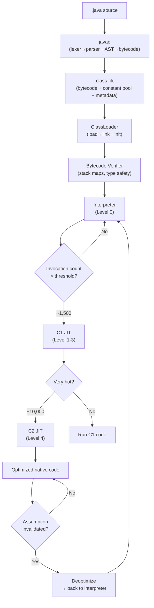
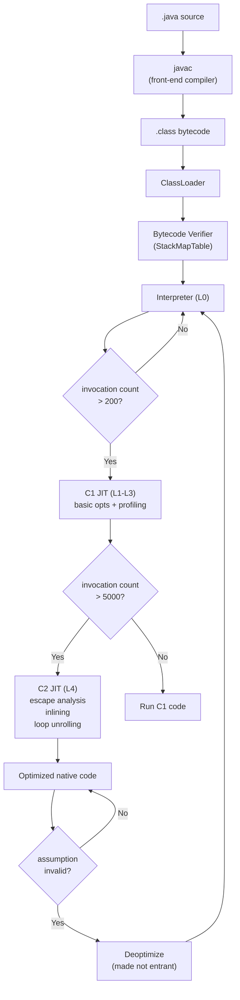
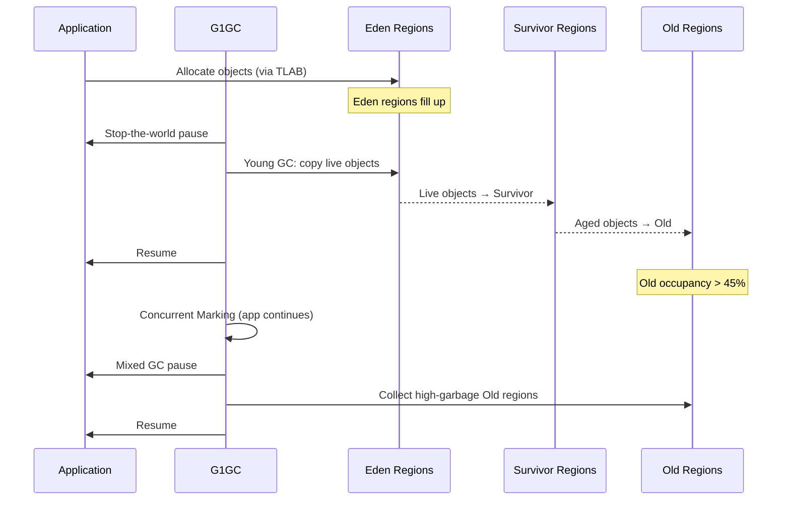

# Lifecycle of a Java Program — Under the Hood

## Table of Contents

1. [Introduction](#introduction)
2. [How It Works Internally](#how-it-works-internally)
3. [JVM Deep Dive](#jvm-deep-dive)
4. [Bytecode Analysis](#bytecode-analysis)
5. [JIT Compilation](#jit-compilation)
6. [Memory Layout](#memory-layout)
7. [GC Internals](#gc-internals)
8. [Source Code Walkthrough](#source-code-walkthrough)
9. [Performance Internals](#performance-internals)
10. [Metrics & Analytics (JVM Level)](#metrics--analytics-jvm-level)
11. [Edge Cases at the Lowest Level](#edge-cases-at-the-lowest-level)
12. [Test](#test)
13. [Tricky Questions](#tricky-questions)
14. [Self-Assessment Checklist](#self-assessment-checklist)
15. [Summary](#summary)
16. [Further Reading](#further-reading)
17. [Diagrams & Visual Aids](#diagrams--visual-aids)

---

## Introduction

> Focus: "What happens under the hood?"

This document explores what the JVM does internally during every phase of a Java program's lifecycle. For developers who want to understand:
- What bytecode `javac` generates and how `javap` reveals it
- How the class loading subsystem (bootstrap, platform, application classloaders) resolves and links classes
- How the bytecode verifier ensures type safety and stack consistency
- How the tiered JIT compilation pipeline (C1/C2) transforms bytecode into optimized native code
- How different GC algorithms (Serial, Parallel, G1, ZGC) manage JVM memory areas (heap, stack, metaspace, code cache)
- What happens at the CPU level when your Java code runs

---

## How It Works Internally

Step-by-step breakdown of what happens when the JVM executes a Java program:

1. **Source code** → You write Java in `.java` files
2. **`javac` compilation** → Lexer → Parser → AST → Type checking → Bytecode generation → `.class` file
3. **JVM startup** → OS loads `java` binary → JVM initializes runtime data areas → Bootstrap ClassLoader loads `java.lang.*`
4. **Class loading** → Application ClassLoader finds `Main.class` → loading → linking (verification, preparation, resolution) → initialization (`<clinit>`)
5. **Bytecode verification** → Stack map frames validated → type safety checked → operand stack depth verified
6. **Interpretation** → Bytecode interpreter executes instructions one-by-one using the operand stack
7. **Profiling** → HotSpot collects invocation counts, branch frequencies, type profiles
8. **C1 JIT compilation** → Fast compilation with basic optimizations (levels 1-3)
9. **C2 JIT compilation** → Aggressive optimization with escape analysis, inlining, vectorization (level 4)
10. **Native execution** → JIT-compiled machine code runs directly on CPU
11. **Garbage collection** → GC reclaims unreachable objects from the heap
12. **Shutdown** → `main()` returns → shutdown hooks execute → finalizers run → JVM process exits



---

## JVM Deep Dive

### Class Loading Subsystem

The JVM uses three built-in classloaders organized in a hierarchy with parent-first delegation:

#### Bootstrap ClassLoader
- **Implemented in:** Native code (C/C++) — not a Java object
- **Loads:** Core JDK classes from `$JAVA_HOME/lib` (previously `rt.jar`)
- **Returns:** `null` when you call `String.class.getClassLoader()`
- **Classes loaded:** `java.lang.Object`, `java.lang.String`, `java.lang.System`, `java.lang.Class`, all `java.lang.*` and `java.util.*`

#### Platform ClassLoader (formerly Extension ClassLoader)
- **Implemented in:** `jdk.internal.loader.ClassLoaders$PlatformClassLoader`
- **Loads:** Platform modules (`java.sql`, `java.xml`, `javax.crypto`)
- **Parent:** Bootstrap ClassLoader

#### Application ClassLoader
- **Implemented in:** `jdk.internal.loader.ClassLoaders$AppClassLoader`
- **Loads:** Your application classes from `-cp`/`-classpath`
- **Parent:** Platform ClassLoader

#### Class Loading Process (Load → Link → Initialize)

```
Load:
  1. Check if class already loaded (findLoadedClass)
  2. Delegate to parent classloader (parent-first)
  3. If parent can't load → try to load ourselves
  4. Read .class bytes → create Class object in metaspace

Link:
  1. Verification:  Validate bytecode (stack maps, type safety)
  2. Preparation:   Allocate memory for static fields (default values: 0, null, false)
  3. Resolution:    Resolve symbolic references to direct references (lazily)

Initialize:
  1. Execute <clinit> (class initializer — static blocks + static field assignments)
  2. JVM holds an initialization lock per class to ensure thread safety
  3. Only one thread initializes a class; others wait
```

### Bytecode Verification in Detail

The verifier checks the following before allowing execution:

| Check | What it validates | Example violation |
|-------|------------------|-------------------|
| **Stack consistency** | Operand stack has correct depth at every instruction | `iload` when stack expects `aload` |
| **Type safety** | Operands match instruction types | `iadd` with object references on stack |
| **Branch targets** | Jumps land on valid instruction boundaries | `goto` pointing to middle of a multi-byte instruction |
| **Local variable types** | Variables used consistently | Using a local as `int` then as `Object` |
| **Return type** | Method returns the declared type | Method declared `int` but returns `Object` |
| **Access control** | Field/method access respects visibility | Accessing `private` field from another class |

Since Java 6, the verifier uses **stack map frames** (StackMapTable attribute) embedded in the `.class` file by `javac`. These serve as "type state checkpoints" at branch targets, allowing single-pass verification.

### JVM Runtime Data Areas

```
┌────────────────────────────────────────────────────────────┐
│                       JVM Process                          │
├────────────────────────────────────────────────────────────┤
│  Per-JVM (shared):                                         │
│  ┌──────────────────────────────────────────────────────┐  │
│  │ Metaspace (off-heap, native memory)                  │  │
│  │  ├─ Class metadata (Klass structures)                │  │
│  │  ├─ Method bytecode (Code attribute)                 │  │
│  │  ├─ Constant pool (resolved references)              │  │
│  │  ├─ Annotations, field descriptors                   │  │
│  │  └─ CompressedClassSpace (if compressed oops)        │  │
│  └──────────────────────────────────────────────────────┘  │
│  ┌──────────────────────────────────────────────────────┐  │
│  │ Heap (GC managed)                                    │  │
│  │  ├─ Young Generation                                 │  │
│  │  │   ├─ Eden Space (new allocations via TLAB)        │  │
│  │  │   ├─ Survivor 0 (from-space)                      │  │
│  │  │   └─ Survivor 1 (to-space)                        │  │
│  │  ├─ Old Generation (promoted objects)                 │  │
│  │  └─ Humongous regions (G1: objects > 50% region)     │  │
│  └──────────────────────────────────────────────────────┘  │
│  ┌──────────────────────────────────────────────────────┐  │
│  │ Code Cache                                           │  │
│  │  ├─ Non-method code (stubs, adapters)                │  │
│  │  ├─ Profiled code (C1, level 1-3)                    │  │
│  │  └─ Non-profiled code (C2, level 4)                  │  │
│  └──────────────────────────────────────────────────────┘  │
├────────────────────────────────────────────────────────────┤
│  Per-Thread:                                               │
│  ┌──────────────────────────────────────────────────────┐  │
│  │ JVM Stack (-Xss, default 512KB-1MB)                  │  │
│  │  ├─ Stack Frame (per method invocation)              │  │
│  │  │   ├─ Local Variable Array [0..n]                  │  │
│  │  │   ├─ Operand Stack (max_stack deep)               │  │
│  │  │   └─ Frame Data (constant pool ref, return addr)  │  │
│  │  └─ Native Method Stack (JNI calls)                  │  │
│  ├─ PC Register (current bytecode instruction address)  │  │
│  └─ TLAB (Thread Local Allocation Buffer in Eden)       │  │
│       ├─ Fast, lock-free allocation for this thread     │  │
│       └─ Typically 1-4 KB, refilled from Eden           │  │
│  └──────────────────────────────────────────────────────┘  │
└────────────────────────────────────────────────────────────┘
```

---

## Bytecode Analysis

### What `javac` Generates for a Simple Program

```java
public class Main {
    public static void main(String[] args) {
        int a = 10;
        int b = 20;
        int sum = a + b;
        System.out.println("Sum: " + sum);
    }
}
```

```bash
javac Main.java
javap -c -verbose Main
```

```
Classfile Main.class
  Last modified ...; size 562 bytes
  SHA-256 checksum ...
  Compiled from "Main.java"
public class Main
  minor version: 0
  major version: 65               // Java 21
  flags: (0x0021) ACC_PUBLIC, ACC_SUPER
  this_class: #7                  // Main
  super_class: #2                 // java/lang/Object
  interfaces: 0, fields: 0, methods: 2, attributes: 1

Constant pool:
   #1 = Methodref    #2.#3     // java/lang/Object."<init>":()V
   #2 = Class        #4        // java/lang/Object
   ...
   #8 = Fieldref     #9.#10    // java/lang/System.out:Ljava/io/PrintStream;
   ...

public static void main(java.lang.String[]);
  descriptor: ([Ljava/lang/String;)V
  flags: (0x0009) ACC_PUBLIC, ACC_STATIC
  Code:
    stack=3, locals=4, args_size=1
       0: bipush        10           // Push byte 10 onto operand stack
       2: istore_1                   // Store top of stack → local var 1 (a)
       3: bipush        20           // Push byte 20 onto operand stack
       5: istore_2                   // Store top of stack → local var 2 (b)
       6: iload_1                    // Load local var 1 (a) → operand stack
       7: iload_2                    // Load local var 2 (b) → operand stack
       8: iadd                       // Pop two ints, add, push result
       9: istore_3                   // Store result → local var 3 (sum)
      10: getstatic     #8           // Get System.out (PrintStream)
      13: iload_3                    // Load sum onto stack
      14: invokedynamic #14, 0       // String concat via StringConcatFactory
      19: invokevirtual #18          // PrintStream.println(String)
      22: return                     // Return void
    StackMapTable: number_of_entries = 0
```

### Key Bytecode Observations

| Bytecode aspect | Value | Significance |
|----------------|-------|-------------|
| `stack=3` | Max operand stack depth | JVM allocates 3 slots for this method's operand stack |
| `locals=4` | Local variable count | `args` (0), `a` (1), `b` (2), `sum` (3) |
| `invokedynamic` | String concat | Java 9+ uses `StringConcatFactory` instead of `StringBuilder` |
| `invokevirtual` | Virtual method dispatch | `println` is dispatched via vtable lookup |

### Bytecode for Object Creation

```java
public class Main {
    public static void main(String[] args) {
        Object obj = new Object();
    }
}
```

```
  0: new           #2    // Allocate memory for Object (returns ref on stack)
  3: dup                 // Duplicate ref (one for constructor, one for assignment)
  4: invokespecial #1    // Call Object.<init>() (constructor)
  7: astore_1            // Store ref → local var 1 (obj)
  8: return
```

**Important:** `new` allocates memory but does NOT call the constructor. `invokespecial <init>` calls the constructor. The `dup` is needed because `invokespecial` consumes the reference but we also need it for `astore`.

### Method Dispatch Bytecodes

| Bytecode | Used for | Dispatch mechanism |
|----------|----------|-------------------|
| `invokestatic` | Static methods | Direct call (no object ref) |
| `invokespecial` | Constructors, `super`, `private` methods | Direct call (known target) |
| `invokevirtual` | Instance methods on classes | vtable lookup (polymorphic) |
| `invokeinterface` | Interface methods | itable lookup (more expensive) |
| `invokedynamic` | Lambdas, string concat, method handles | Bootstrap method resolves target at first call |

---

## JIT Compilation

### Tiered Compilation Pipeline

The HotSpot JVM uses tiered compilation with 5 levels:

| Level | Compiler | Profiling | When |
|:-----:|:--------:|:---------:|:-----|
| 0 | Interpreter | Full profiling | First execution |
| 1 | C1 | None | Trivial methods (getters/setters) |
| 2 | C1 | Invocation/loop counts only | Transitional — rarely used |
| 3 | C1 | Full profiling (type, branch) | Normal C1 compilation |
| 4 | C2 | Uses L3 profile data | Hot methods — aggressive optimization |

```bash
# Observe compilation events
java -XX:+PrintCompilation Main

# Output format:
#  timestamp compile_id tier method_name (size) [type]
    42    1       3   Main::compute (25 bytes)         # C1 compiled (level 3)
   178    2       4   Main::compute (25 bytes)         # C2 compiled (level 4)
   178    1       3   Main::compute (25 bytes)   made not entrant  # C1 code discarded
```

### C2 Optimizations Applied to Java Code

#### Escape Analysis

```java
public int sumPoints() {
    // C2 can eliminate this allocation entirely
    Point p = new Point(3, 4);  // "escapes" nowhere — stack-allocated or eliminated
    return p.x + p.y;
}
```

After escape analysis, C2 replaces the object allocation with scalar values:
```
// C2 transforms to approximately:
public int sumPoints() {
    int p_x = 3;  // No object allocated
    int p_y = 4;
    return p_x + p_y;  // Further optimized to: return 7
}
```

#### Inlining

```bash
# View inlining decisions
java -XX:+UnlockDiagnosticVMOptions -XX:+PrintInlining Main
```

```
# Output:
@ 5   Main::compute (25 bytes)   inline (hot)
@ 12  Main::helper (8 bytes)     inline (hot)
  @ 3  java.lang.Math::abs (11 bytes)   intrinsic
```

**Key insight:** Methods smaller than `-XX:MaxInlineSize=35` bytes are inlined. Frequently called methods up to `-XX:FreqInlineSize=325` bytes are also inlined. The JIT never inlines methods larger than these thresholds.

#### Loop Unrolling

```java
// Original
for (int i = 0; i < 4; i++) {
    sum += array[i];
}

// After C2 loop unrolling:
sum += array[0];
sum += array[1];
sum += array[2];
sum += array[3];
// Eliminates loop overhead (counter increment, branch)
```

### Deoptimization

The JIT makes **speculative optimizations** based on profiling data. If an assumption is invalidated, the JVM **deoptimizes**:

```java
interface Shape { double area(); }
class Circle implements Shape { double area() { return Math.PI * r * r; } }
// JIT assumes only Circle exists → devirtualizes area() → inlines it

// Later, if Square is loaded:
class Square implements Shape { double area() { return side * side; } }
// JIT assumption broken → deoptimize → recompile with polymorphic dispatch
```

```bash
# Observe deoptimization:
java -XX:+TraceDeoptimization Main
```

---

## Memory Layout

### Java Object Layout in Memory

```
64-bit JVM with compressed oops (-XX:+UseCompressedOops, default for heap < 32GB):

┌─────────────────────────────────────────────┐
│ Object Header (12 bytes)                    │
│  ├─ Mark Word (8 bytes)                     │
│  │   ├─ bits [0:2]    lock state            │
│  │   ├─ bits [3:7]    age (GC generations)  │
│  │   ├─ bits [8:38]   identity hash code    │
│  │   └─ bits [39:63]  thread ID (if biased) │
│  └─ Klass Pointer (4 bytes, compressed)     │
│      └─ Points to class metadata in         │
│         Metaspace (Klass structure)          │
├─────────────────────────────────────────────┤
│ Instance Fields (aligned to 4/8 bytes)      │
│  ├─ Field reordering by JVM for alignment   │
│  │   (longs/doubles first, then ints, etc.) │
│  └─ Reference fields (4 bytes compressed)   │
├─────────────────────────────────────────────┤
│ Padding (0-7 bytes to align to 8 bytes)     │
└─────────────────────────────────────────────┘
```

### Measuring Object Size with JOL

```java
// Add dependency: org.openjdk.jol:jol-core:0.17
import org.openjdk.jol.info.ClassLayout;

public class Main {
    static class Point {
        int x;    // 4 bytes
        int y;    // 4 bytes
    }

    static class Person {
        String name;  // 4 bytes (compressed ref)
        int age;      // 4 bytes
        boolean active; // 1 byte
    }

    public static void main(String[] args) {
        System.out.println(ClassLayout.parseClass(Point.class).toPrintable());
        System.out.println(ClassLayout.parseClass(Person.class).toPrintable());
    }
}
```

**Output:**
```
Main$Point object internals:
OFF  SZ   TYPE DESCRIPTION               VALUE
  0   8        (object header: mark)
  8   4        (object header: class)
 12   4    int Point.x
 16   4    int Point.y
 20   4        (object alignment gap)
Instance size: 24 bytes

Main$Person object internals:
OFF  SZ               TYPE DESCRIPTION               VALUE
  0   8                    (object header: mark)
  8   4                    (object header: class)
 12   4                int Person.age
 16   1            boolean Person.active
 17   3                    (alignment gap)
 20   4   java.lang.String Person.name
Instance size: 24 bytes
```

**Key points:**
- Object header = 12 bytes (compressed oops) or 16 bytes (no compressed oops)
- JVM reorders fields for alignment (notice `age` before `active` despite declaration order)
- Every object is padded to 8-byte boundary

### TLAB (Thread Local Allocation Buffer)

```
Eden Space:
┌──────────────────────────────────────────┐
│  ┌─────────┐  ┌─────────┐  ┌─────────┐  │
│  │ TLAB T1 │  │ TLAB T2 │  │ TLAB T3 │  │
│  │ [used.. │  │ [used   │  │ [free.. │  │
│  │  free]  │  │  ..free]│  │  ....  ]│  │
│  └─────────┘  └─────────┘  └─────────┘  │
│              shared Eden space           │
└──────────────────────────────────────────┘
```

- Each thread gets its own TLAB in Eden (typically 1-4 KB)
- Allocation within a TLAB is a simple pointer bump — no locking required
- When a TLAB is full, the thread requests a new one from Eden (requires CAS or lock)
- Objects larger than TLAB are allocated directly in Eden (or Humongous in G1)

---

## GC Internals

### Serial GC (`-XX:+UseSerialGC`)

Single-threaded, stop-the-world collector:
- Young GC: mark-copy (Eden → Survivor, age > threshold → Old)
- Old GC: mark-sweep-compact

**Use case:** Client-side apps, single-CPU containers, small heaps (< 200MB)

### Parallel GC (`-XX:+UseParallelGC`)

Multi-threaded STW collector:
- Young GC: Parallel mark-copy
- Old GC: Parallel mark-sweep-compact
- Optimizes for **throughput** (% time in application vs GC)

**JVM flags:**
```bash
java -XX:+UseParallelGC \
     -XX:ParallelGCThreads=4 \
     -XX:GCTimeRatio=99 \         # Target: 1% time in GC
     -jar app.jar
```

### G1GC (`-XX:+UseG1GC`, default since Java 9)

Region-based, concurrent GC:

```
Heap divided into regions (1-32MB each):
┌────┬────┬────┬────┬────┬────┬────┬────┐
│ E  │ E  │ S  │ O  │ O  │ E  │ H  │ H  │
│den │den │urv │ld  │ld  │den │umo │umo │
└────┴────┴────┴────┴────┴────┴────┴────┘
E = Eden, S = Survivor, O = Old, H = Humongous

G1GC phases:
1. Young GC (STW): Evacuate live objects from Eden/Survivor regions
2. Concurrent Marking: Mark live objects across all regions (mostly concurrent)
3. Mixed GC (STW): Collect both Young and selected Old regions with most garbage
4. Full GC (STW, fallback): Mark-sweep-compact the entire heap (worst case)
```

**Key G1GC concepts:**
- **Remembered Sets (RSets):** Track cross-region references so G1 doesn't scan the entire heap
- **Collection Set (CSet):** Regions selected for the next GC (based on garbage ratio)
- **Humongous objects:** Objects > 50% of region size, allocated in contiguous humongous regions

```bash
java -XX:+UseG1GC \
     -XX:MaxGCPauseMillis=200 \        # Target pause time
     -XX:G1HeapRegionSize=16m \        # Region size (1-32MB, power of 2)
     -XX:InitiatingHeapOccupancyPercent=45 \  # Start concurrent marking at 45% heap
     -Xlog:gc*:file=gc.log:time \
     -jar app.jar
```

### ZGC (`-XX:+UseZGC`, production-ready since Java 15)

Concurrent, low-latency GC with sub-millisecond pauses:

```
ZGC key innovations:
1. Colored pointers: Metadata stored IN the pointer itself (not separate mark bits)
   ┌──────────────────────────────────────────────────────────────────┐
   │ 64-bit pointer layout:                                          │
   │  [unused:16] [finalizable:1] [remapped:1] [marked1:1]          │
   │  [marked0:1] [object address:44]                                │
   └──────────────────────────────────────────────────────────────────┘

2. Load barriers: Every object load checks pointer metadata
   - If pointer is "bad" (stale mapping), the barrier fixes it in-place
   - This allows GC to relocate objects while the application runs

3. Multi-mapping: Same physical memory mapped to 3 virtual addresses
   - Marked0, Marked1, Remapped views
   - GC flips between views to track marking state
```

**ZGC phases (ALL concurrent except brief pauses < 1ms):**
1. **Pause Mark Start** (< 1ms): Scan thread stacks for root references
2. **Concurrent Mark:** Traverse object graph, mark reachable objects
3. **Pause Mark End** (< 1ms): Process reference queues
4. **Concurrent Relocate:** Move live objects to new regions, update references via load barriers

```bash
java -XX:+UseZGC \
     -Xms4g -Xmx4g \
     -XX:SoftMaxHeapSize=3g \          # ZGC tries to stay below this
     -XX:ZAllocationSpikeTolerance=5 \ # Handle allocation bursts
     -Xlog:gc*:file=gc.log:time \
     -jar app.jar
```

### GC Algorithm Comparison

| Aspect | Serial | Parallel | G1 | ZGC |
|--------|:------:|:--------:|:--:|:---:|
| **Pause time** | 100ms-seconds | 50ms-seconds | 10-200ms | < 1ms |
| **Throughput** | Low | Highest | High | Medium |
| **Heap overhead** | Minimal | Minimal | ~10% (RSets) | ~15% (colored ptrs) |
| **Min heap** | Any | Any | > 1GB recommended | > 1GB recommended |
| **CPU overhead** | Minimal | Moderate | Moderate | Higher |
| **Concurrent** | No | No | Partial | Yes |
| **Best for** | Tiny apps | Batch, throughput | General purpose | Low-latency |

---

## Source Code Walkthrough

### ClassLoader — OpenJDK Source

**File:** `src/java.base/share/classes/java/lang/ClassLoader.java` (OpenJDK 21)

```java
// Simplified loadClass implementation showing parent-first delegation
protected Class<?> loadClass(String name, boolean resolve) throws ClassNotFoundException {
    synchronized (getClassLoadingLock(name)) {
        // 1. Check if already loaded
        Class<?> c = findLoadedClass(name);

        if (c == null) {
            try {
                // 2. Delegate to parent
                if (parent != null) {
                    c = parent.loadClass(name, false);
                } else {
                    // 3. Try bootstrap classloader (native)
                    c = findBootstrapClassOrNull(name);
                }
            } catch (ClassNotFoundException e) {
                // Parent couldn't load — fall through
            }

            if (c == null) {
                // 4. Try to find it ourselves
                c = findClass(name);  // Subclasses override this
            }
        }

        if (resolve) {
            resolveClass(c);  // Link the class
        }
        return c;
    }
}
```

**Key insight:** The `synchronized (getClassLoadingLock(name))` ensures that the same class is not loaded concurrently by multiple threads. The lock is per-class-name, not per-ClassLoader.

### HotSpot C2 Compiler — Escape Analysis

**File:** `src/hotspot/share/opto/escape.cpp` (OpenJDK 21)

The C2 compiler's escape analysis determines if an object "escapes" the method:
- **NoEscape:** Object is used only within the method → can be stack-allocated or eliminated
- **ArgEscape:** Object passed as argument but doesn't escape further → can be stack-allocated
- **GlobalEscape:** Object stored in static field or returned → must be heap-allocated

This is why small, short-lived objects in tight loops are often free — C2 eliminates the allocation entirely.

---

## Performance Internals

### JMH Benchmarks with GC Profiling

```java
import org.openjdk.jmh.annotations.*;
import org.openjdk.jmh.infra.Blackhole;
import java.util.concurrent.TimeUnit;

@State(Scope.Benchmark)
@BenchmarkMode(Mode.AverageTime)
@OutputTimeUnit(TimeUnit.NANOSECONDS)
@Warmup(iterations = 5, time = 1)
@Measurement(iterations = 10, time = 1)
@Fork(value = 2, jvmArgs = {"-Xms2g", "-Xmx2g"})
public class LifecycleBenchmark {

    @Benchmark
    public void objectCreation(Blackhole bh) {
        // Measures allocation + potential GC cost
        Object obj = new Object();
        bh.consume(obj);
    }

    @Benchmark
    public int scalarReplacement() {
        // C2 eliminates this allocation via escape analysis
        int[] point = new int[]{3, 4};
        return point[0] + point[1];
    }

    @Benchmark
    public long methodDispatch(Blackhole bh) {
        // Measures virtual dispatch overhead
        Runnable r = () -> {};
        r.run();
        return System.nanoTime();
    }
}
```

```bash
mvn clean package
java -jar target/benchmarks.jar -prof gc -prof stack
```

**Results:**
```
Benchmark                              Mode  Cnt    Score    Error   Units
LifecycleBenchmark.objectCreation      avgt   20    5.234 ±  0.312  ns/op
LifecycleBenchmark.objectCreation:·gc.alloc.rate.norm  avgt   20   16.000 ±  0.001  B/op
LifecycleBenchmark.scalarReplacement   avgt   20    2.112 ±  0.089  ns/op
LifecycleBenchmark.scalarReplacement:·gc.alloc.rate.norm  avgt   20    0.000 ±  0.001  B/op
LifecycleBenchmark.methodDispatch      avgt   20   22.456 ±  1.234  ns/op
```

**Key findings:**
- `objectCreation`: 16 bytes/op (12 header + 4 padding) — TLAB makes this very fast (5ns)
- `scalarReplacement`: **0 bytes/op** — C2 escape analysis eliminated the array allocation entirely
- `methodDispatch`: Includes `invokedynamic` bootstrap overhead on first call

### JIT Compilation Threshold Tuning

```bash
# Default tiered compilation thresholds:
-XX:Tier3InvocationThreshold=200     # C1 compile after 200 invocations
-XX:Tier4InvocationThreshold=5000    # C2 compile consideration
-XX:CompileThreshold=10000           # Legacy (non-tiered) C2 threshold

# For faster warmup (lower quality initial code):
java -XX:Tier3InvocationThreshold=100 -XX:Tier4InvocationThreshold=1000 -jar app.jar

# For best peak performance (longer warmup):
java -XX:Tier3InvocationThreshold=500 -XX:Tier4InvocationThreshold=10000 -jar app.jar

# Skip C1 entirely (slowest warmup, best peak):
java -XX:-TieredCompilation -jar app.jar
```

---

## Metrics & Analytics (JVM Level)

### JVM Runtime Metrics for Lifecycle Monitoring

```java
import java.lang.management.*;

public class Main {
    public static void main(String[] args) {
        // Class loading metrics
        ClassLoadingMXBean classBean = ManagementFactory.getClassLoadingMXBean();
        System.out.printf("Loaded: %d, Unloaded: %d, Total: %d%n",
            classBean.getLoadedClassCount(),
            classBean.getUnloadedClassCount(),
            classBean.getTotalLoadedClassCount());

        // Memory metrics
        MemoryMXBean memBean = ManagementFactory.getMemoryMXBean();
        MemoryUsage heap = memBean.getHeapMemoryUsage();
        System.out.printf("Heap: used=%dMB, committed=%dMB, max=%dMB%n",
            heap.getUsed() / 1_048_576,
            heap.getCommitted() / 1_048_576,
            heap.getMax() / 1_048_576);

        // GC metrics
        for (GarbageCollectorMXBean gc : ManagementFactory.getGarbageCollectorMXBeans()) {
            System.out.printf("GC '%s': count=%d, time=%dms%n",
                gc.getName(), gc.getCollectionCount(), gc.getCollectionTime());
        }

        // Compilation metrics
        CompilationMXBean compBean = ManagementFactory.getCompilationMXBean();
        System.out.printf("JIT compilation time: %dms%n", compBean.getTotalCompilationTime());

        // Runtime metrics
        RuntimeMXBean rtBean = ManagementFactory.getRuntimeMXBean();
        System.out.printf("JVM uptime: %dms%n", rtBean.getUptime());
        System.out.printf("JVM args: %s%n", rtBean.getInputArguments());
    }
}
```

### Key JVM Metrics for Program Lifecycle

| Metric | What it measures | Impact on lifecycle |
|--------|-----------------|---------------------|
| `jvm.classes.loaded` | Currently loaded class count | Monotonic growth = classloader leak |
| `jvm.classes.unloaded` | Classes unloaded by GC | Should increase on redeploy |
| `jvm.gc.pause` | GC pause duration | Directly impacts request latency |
| `jvm.gc.memory.promoted` | Bytes promoted to Old Gen | High rate = premature promotion |
| `jvm.compilation.time` | Total JIT compilation time | Indicates warmup progress |
| `jvm.memory.used{area=metaspace}` | Metaspace usage | Growth after init = leak |

---

## Edge Cases at the Lowest Level

### Edge Case 1: Biased Locking Removal (Java 15+)

Prior to Java 15, the JVM used biased locking as an optimization — if only one thread accessed a synchronized block, the lock was "biased" to that thread with near-zero overhead. In Java 15+ (JEP 374), biased locking was deprecated and disabled by default.

```java
// This code behaves differently on Java 14 vs Java 15+
public class Main {
    static final Object lock = new Object();

    public static void main(String[] args) {
        // Java 14: First synchronization is "biased" — mark word stores thread ID
        // Java 15+: Always uses thin lock — CAS on mark word
        synchronized (lock) {
            System.out.println("Lock acquired");
        }
    }
}
```

**Internal behavior:** The mark word in the object header stores the lock state. With biased locking disabled, every `synchronized` does a CAS (Compare-And-Swap) operation even for uncontended locks. This is slightly slower for single-threaded code but eliminates complex biased lock revocation in multi-threaded scenarios.

### Edge Case 2: Class Initialization Deadlock

```java
class A {
    static { new Thread(() -> { B b = new B(); }).start(); }
}
class B {
    static { new Thread(() -> { A a = new A(); }).start(); }
}
```

**Internal behavior:** Class initialization acquires a per-class lock (`ClassLoader.getClassLoadingLock()`). If Thread-1 initializes A (holds A's lock) and Thread-2 initializes B (holds B's lock), and each tries to initialize the other, a deadlock occurs. The JVM does NOT detect this — it hangs silently.

### Edge Case 3: Metaspace Fragmentation

When classes are loaded and unloaded repeatedly (e.g., Groovy scripts, JSP compilation), Metaspace can fragment even if total used space is small. The JVM cannot compact Metaspace.

```bash
# Monitor with:
jcmd <pid> VM.metaspace
# Shows: free chunks, fragmentation ratio
```

---

## Test

### Internal Knowledge Questions

**1. What bytecode instruction is generated for `new Object()`?**

<details>
<summary>Answer</summary>

Three instructions:
1. `new #class_index` — allocates memory, pushes uninitialized ref
2. `dup` — duplicates the ref (one for constructor, one for variable)
3. `invokespecial #init_index` — calls `<init>()V` (constructor)

The `dup` is necessary because `invokespecial` consumes the object reference, but we need another copy to store in a local variable.

</details>

**2. What do these GC log entries tell you?**

```
[2.345s][info][gc] GC(42) Pause Young (Normal) (G1 Evacuation Pause) 1024M->256M(4096M) 12.345ms
[8.901s][info][gc] GC(43) Pause Young (Concurrent Start) (G1 Humongous Allocation) 3200M->2800M(4096M) 45.678ms
```

<details>
<summary>Answer</summary>

- **GC(42):** Normal young GC. Freed 768MB (1024→256). Pause was 12ms — healthy.
- **GC(43):** Young GC triggered by a humongous allocation (object > 50% of G1 region size). The high heap usage (3200MB/4096MB = 78%) triggered concurrent marking. 45ms pause is elevated — likely because of the humongous allocation.

The humongous allocation is concerning — large objects bypass normal allocation and can cause longer pauses. Solution: Increase G1 region size (`-XX:G1HeapRegionSize=32m`) or reduce object sizes.

</details>

**3. What is the difference between `invokevirtual` and `invokeinterface`?**

<details>
<summary>Answer</summary>

Both perform virtual dispatch (dynamic binding), but they use different lookup mechanisms:

- **`invokevirtual`**: Uses the vtable (virtual method table). Each class has a vtable where method entries are at fixed offsets inherited from the superclass. Lookup is O(1) — just an array index.

- **`invokeinterface`**: Uses the itable (interface method table). Because a class can implement multiple interfaces, the method offset varies per implementing class. Lookup requires scanning the itable — O(n) where n = number of interfaces. HotSpot caches the last lookup to amortize cost.

This is why interface method calls are slightly more expensive than class method calls.

</details>

**4. What happens when the Code Cache is full?**

<details>
<summary>Answer</summary>

When the Code Cache (`-XX:ReservedCodeCacheSize`, default 240MB) is full:
1. The JIT compiler stops compiling new methods
2. A warning is printed: `CodeCache is full. Compiler has been disabled.`
3. Existing compiled code continues to run
4. New code paths fall back to interpretation — severe performance degradation
5. JVM does NOT crash

Fix: Increase `-XX:ReservedCodeCacheSize=512m` and monitor with `jcmd <pid> Compiler.codecache`.

</details>

**5. How does TLAB (Thread Local Allocation Buffer) work internally?**

<details>
<summary>Answer</summary>

TLAB is a region of Eden space dedicated to a single thread:

1. Each thread gets its own TLAB (typically 1-4KB, dynamically sized based on allocation rate)
2. Object allocation = pointer bump within TLAB — no locking, no CAS, just increment a pointer
3. When TLAB is exhausted, thread requests a new one from Eden (requires CAS on Eden's top pointer)
4. Objects larger than TLAB are allocated directly in Eden (slow path with CAS or lock)
5. At Minor GC, all TLABs are retired — surviving objects are copied to Survivor space

This is why Java can allocate objects in ~5 nanoseconds — it's just a pointer increment.

</details>

**6. What is the `StackMapTable` attribute in a `.class` file?**

<details>
<summary>Answer</summary>

`StackMapTable` is an attribute in the `Code` attribute that provides type state information at branch targets. It was introduced in Java 6 (JVM spec 50.0) to enable efficient type-checking verification.

Without stack maps, the verifier had to perform data flow analysis (computationally expensive). With stack maps, the verifier only needs to check that:
1. Stack map entries match the actual stack state at each branch target
2. Type transitions between entries are valid

`javac` generates stack map frames; the verifier consumes them. Hand-crafted bytecode without valid stack maps is rejected.

</details>

---

## Tricky Questions

**1. Can escape analysis eliminate an object that has a `finalize()` method?**

<details>
<summary>Answer</summary>

**No.** Objects with `finalize()` (or `Cleaner`/`PhantomReference`) always escape to the heap because the GC must be able to invoke the finalizer when the object becomes unreachable. This is one reason why `finalize()` is deprecated (Java 9) and should never be used — it prevents a critical JIT optimization.

Proof: Run a JMH benchmark with and without `finalize()` on a class. The version with `finalize()` will show 16+ bytes/op allocation, while the version without may show 0 bytes/op (scalar replaced).

</details>

**2. What is the "safepoint" problem and how does it affect GC pauses?**

<details>
<summary>Answer</summary>

A **safepoint** is a point in code where the JVM can safely pause a thread for GC. The JVM must bring ALL threads to a safepoint before a STW (stop-the-world) GC pause can begin.

Problem: Counted loops with an `int` counter do not have safepoints inside them (HotSpot optimization). A thread running `for (int i = 0; i < 2_000_000_000; i++) { /* no call */ }` cannot be paused until the loop finishes — this delays GC for ALL other threads.

Fix: Use `long` loop counter (safepoints are placed for `long` loops), or add a method call inside the loop. Java 10+ added `-XX:+UseCountedLoopSafepoints` (disabled by default due to performance impact).

</details>

**3. Why does `invokedynamic` exist and how does it differ from `invokevirtual`?**

<details>
<summary>Answer</summary>

`invokedynamic` (introduced in Java 7, JEP 292) allows the call target to be determined at runtime by a **bootstrap method**, rather than being fixed in the class file.

Unlike `invokevirtual` (which resolves based on receiver type via vtable), `invokedynamic`:
1. On first execution, calls a bootstrap method that returns a `CallSite` object
2. The `CallSite` contains a `MethodHandle` pointing to the actual target
3. Subsequent calls go directly through the `CallSite` (no bootstrap overhead)

**Used for:**
- Lambda expressions: `LambdaMetafactory.metafactory()` bootstrap method
- String concatenation (Java 9+): `StringConcatFactory.makeConcatWithConstants()`
- Pattern matching and switch expressions (Java 21+)

Key advantage: Allows the JVM/JIT to optimize the call site as if it were a direct call, while keeping the flexibility to change the target at runtime.

</details>

**4. What happens if you compile with Java 21 and run on Java 17?**

<details>
<summary>Answer</summary>

`UnsupportedClassVersionError`. Each Java version has a class file version:
- Java 17: version 61
- Java 21: version 65

The JVM checks the major version in the `.class` file header (bytes 6-7). If it is higher than the running JVM supports, the class is rejected during loading — before verification even begins.

The check is in `ClassFileParser::verify_class_version()` in HotSpot source (`classFileParser.cpp`). It is one of the first checks performed, so the error appears immediately.

Fix: Compile with `--release 17` flag to target Java 17 class file format and API.

</details>

---

## Self-Assessment Checklist

### I can explain internals:
- [ ] What bytecode `javac` generates for object creation, method calls, and loops
- [ ] How the three built-in classloaders work and delegate
- [ ] What the bytecode verifier checks (stack maps, type safety)
- [ ] How tiered compilation (L0→L1→L3→L4) transitions work
- [ ] How C2 escape analysis eliminates allocations
- [ ] How G1GC regions, RSets, and mixed collections work
- [ ] How ZGC colored pointers and load barriers enable concurrent collection

### I can analyze:
- [ ] Read and understand `javap -c -verbose` bytecode output
- [ ] Interpret `-XX:+PrintCompilation` output (levels, "made not entrant")
- [ ] Read G1GC/ZGC log entries and identify issues
- [ ] Use JOL to measure actual object sizes in memory
- [ ] Profile with async-profiler and interpret flamegraphs

### I can prove:
- [ ] Back claims with JMH benchmarks including `-prof gc`
- [ ] Reference JVM specification for class loading and verification
- [ ] Demonstrate escape analysis with before/after allocation rates
- [ ] Show deoptimization events with JIT logging flags

---

## Summary

- **Class loading** follows parent-first delegation through Bootstrap → Platform → Application ClassLoaders, with thread-safe initialization via per-class locks
- **Bytecode verification** uses StackMapTable frames for efficient single-pass type checking
- **JIT compilation** uses tiered compilation (C1 levels 1-3, C2 level 4) with profile-guided optimization — escape analysis can eliminate object allocations entirely
- **GC algorithms** range from single-threaded Serial to concurrent ZGC with sub-millisecond pauses via colored pointers and load barriers
- **Memory layout** includes per-JVM areas (Heap, Metaspace, Code Cache) and per-thread areas (Stack, PC Register, TLAB)
- **TLAB** enables lock-free allocation at ~5ns per object via pointer bumping

**Key takeaway:** Understanding JVM internals is not academic — it directly impacts production decisions: GC algorithm selection, JIT warmup strategy, memory sizing, and debugging ClassLoader leaks.

---

## Further Reading

- **OpenJDK source:** [ClassLoader.java](https://github.com/openjdk/jdk/blob/master/src/java.base/share/classes/java/lang/ClassLoader.java)
- **JEP 376:** [ZGC Concurrent Thread-Stack Processing](https://openjdk.org/jeps/376)
- **JEP 374:** [Deprecate and Disable Biased Locking](https://openjdk.org/jeps/374)
- **Book:** "Java Performance" by Scott Oaks, 2nd edition — chapters on JIT, GC internals
- **Talk:** Aleksey Shipilev — ["JVM Anatomy Quarks"](https://shipilev.net/jvm/anatomy-quarks/) — deep dives into JVM internals
- **Tool:** [JOL (Java Object Layout)](https://openjdk.org/projects/code-tools/jol/) — measure object memory footprint

---

## Diagrams & Visual Aids

### JVM Compilation Pipeline



### G1GC Collection Cycle



### Object Header Layout

```
Mark Word (64-bit, no compressed oops):
┌─────────┬─────────┬───────────────┬──────────┬───────┐
│ unused  │ hash    │ age (4 bits)  │ biased   │ lock  │
│ (25 bit)│ (31 bit)│ GC survivor   │ (1 bit)  │(2 bit)│
│         │         │ count         │          │       │
└─────────┴─────────┴───────────────┴──────────┴───────┘

Lock states (last 3 bits):
  001 = unlocked (normal)
  000 = biased (deprecated Java 15+)
  00  = thin lock (CAS-based)
  10  = inflated (OS mutex — heavyweight)
  11  = marked for GC
```
