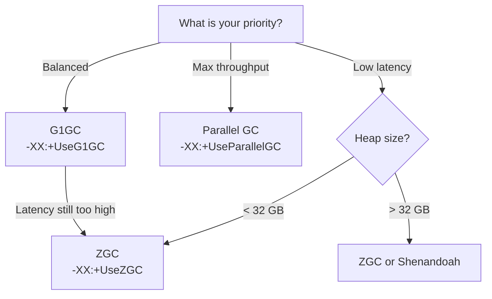
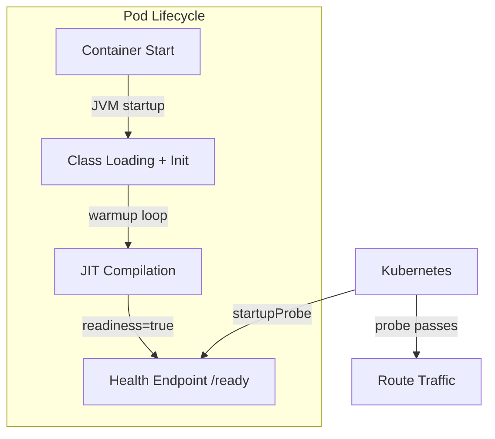
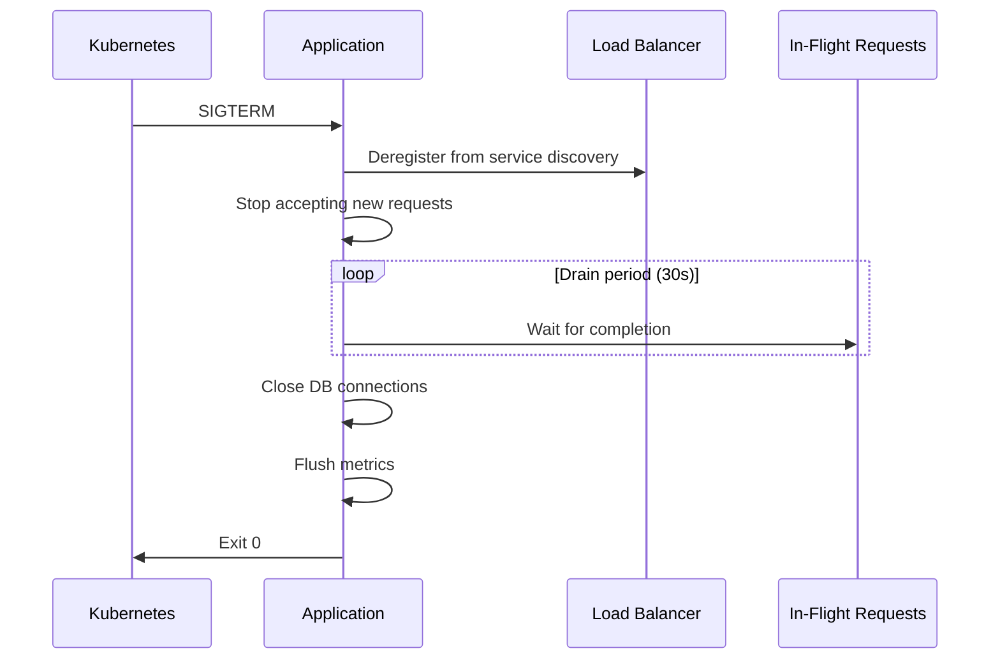
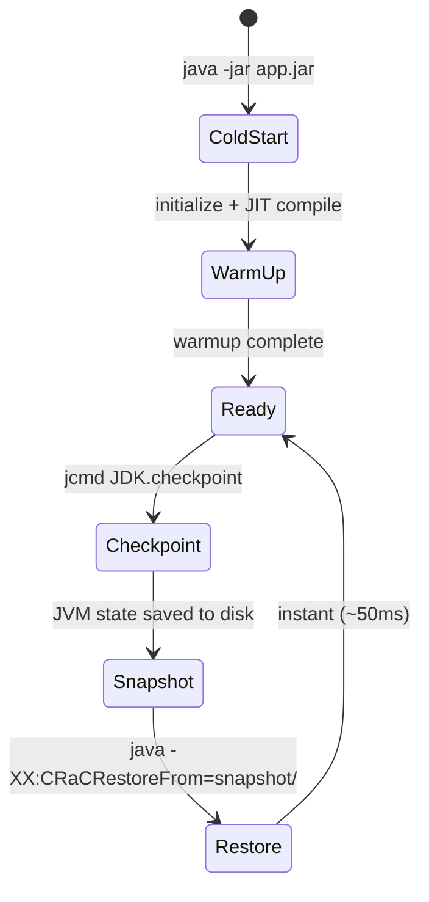
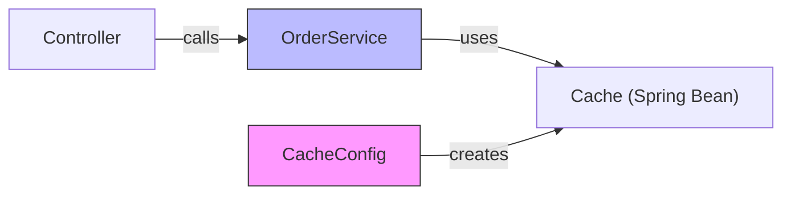
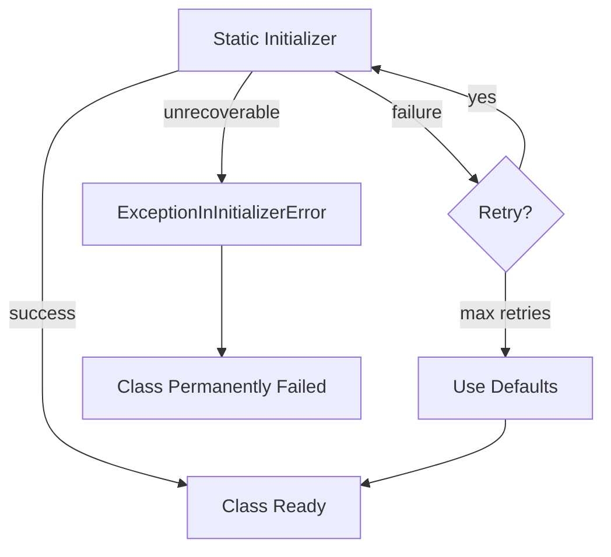
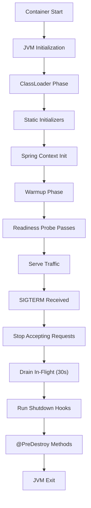
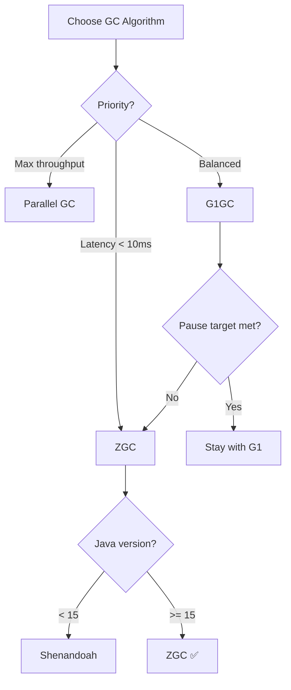

# Lifecycle of a Java Program — Senior Level

## Table of Contents

1. [Introduction](#introduction)
2. [Core Concepts](#core-concepts)
3. [Pros & Cons](#pros--cons)
4. [Use Cases](#use-cases)
5. [Code Examples](#code-examples)
6. [Coding Patterns](#coding-patterns)
7. [Clean Code](#clean-code)
8. [Product Use / Feature](#product-use--feature)
9. [Error Handling](#error-handling)
10. [Security Considerations](#security-considerations)
11. [Performance Optimization](#performance-optimization)
12. [Metrics & Analytics](#metrics--analytics)
13. [Debugging Guide](#debugging-guide)
14. [Best Practices](#best-practices)
15. [Edge Cases & Pitfalls](#edge-cases--pitfalls)
16. [Postmortems & System Failures](#postmortems--system-failures)
17. [Common Mistakes](#common-mistakes)
18. [Tricky Points](#tricky-points)
19. [Comparison with Other Languages](#comparison-with-other-languages)
20. [Test](#test)
21. [Tricky Questions](#tricky-questions)
22. [Cheat Sheet](#cheat-sheet)
23. [Self-Assessment Checklist](#self-assessment-checklist)
24. [Summary](#summary)
25. [Further Reading](#further-reading)
26. [Related Topics](#related-topics)
27. [Diagrams & Visual Aids](#diagrams--visual-aids)

---

## Introduction

> Focus: "How to optimize?" and "How to architect?"

For Java developers who:
- Design systems where JVM lifecycle decisions directly impact SLAs
- Tune JVM parameters (GC selection, heap sizing, tiered compilation flags) for production workloads
- Architect deployment strategies (warmup, CDS, CRaC, native image)
- Handle ClassLoader isolation in multi-tenant or plugin architectures
- Mentor teams on JVM performance and lifecycle best practices

This level covers architectural decisions around the lifecycle: when to use G1GC vs ZGC, how to design for fast startup in Kubernetes, how to prevent ClassLoader leaks in long-running applications, and how to benchmark properly with JMH.

---

## Core Concepts

### Concept 1: JVM Lifecycle Architecture Decisions

Every production Java system requires explicit decisions about the JVM lifecycle:

| Decision | Options | Impact |
|----------|---------|--------|
| GC algorithm | G1GC, ZGC, Shenandoah, Parallel | Latency vs throughput trade-off |
| Heap sizing | Fixed (`-Xms=-Xmx`) vs dynamic | Predictability vs flexibility |
| Compilation | Tiered (default) vs C2-only vs AOT | Warmup time vs peak performance |
| Class loading | Default vs CDS vs AppCDS | Startup time |
| Shutdown | Hooks vs external orchestration | Graceful degradation |

### Concept 2: JIT Compilation Tuning for Production

```java
@BenchmarkMode(Mode.AverageTime)
@OutputTimeUnit(TimeUnit.NANOSECONDS)
@Warmup(iterations = 5, time = 1)
@Measurement(iterations = 10, time = 1)
@Fork(2)
public class LifecycleBenchmark {

    @Benchmark
    public long interpretedPath(Blackhole bh) {
        // Simulates work that JIT can optimize
        long sum = 0;
        for (int i = 0; i < 1000; i++) {
            sum += i * i;
        }
        return sum;
    }
}
```

Results comparing JIT tiers:
```
Benchmark                          Mode  Cnt     Score    Error  Units
LifecycleBenchmark.interpretedPath avgt   20   312.456 ±  4.2   ns/op  (C2-compiled)
# Same code interpreted:                      8420.123 ± 98.1   ns/op  (interpreter)
# C1-only (-XX:TieredStopAtLevel=1):         1205.789 ± 12.3   ns/op
```

The 27x speedup from interpreter to C2 demonstrates why warmup matters.

### Concept 3: GC Algorithm Selection Framework



---

## Pros & Cons

### Strategic analysis for architectural decisions:

| Pros | Cons | Impact |
|------|------|--------|
| JIT produces highly optimized native code for hot paths | Warmup period creates cold-start latency | Requires warmup strategy for latency SLAs |
| GC generations match real-world object lifetimes | GC tuning requires deep JVM knowledge | Wrong GC config can cause 10x latency spikes |
| ClassLoader isolation enables multi-tenant deployment | ClassLoader leaks are hard to diagnose | Metaspace OOM after repeated deployments |
| CDS/AppCDS reduce startup time significantly | CDS archives are JDK-version specific | CI/CD must regenerate archives per JDK upgrade |
| Bytecode portability simplifies deployment | JVM memory overhead (~200-500MB baseline) | Not ideal for memory-constrained containers |

### Real-world decision examples:
- **Netflix** chose ZGC for their edge proxy (Zuul) because p99 latency SLA was < 10ms — G1GC pauses exceeded this under high load. Result: GC pause times dropped from ~50ms to < 1ms.
- **LinkedIn** avoided GraalVM native-image for their core services because JIT peak performance exceeded AOT by 20-30% for their CPU-bound workloads — they accepted the warmup cost.

---

## Use Cases

Architectural and system-level scenarios:

- **Use Case 1:** Kubernetes deployment with startup probes — configure `startupProbe` to allow warmup time before the pod receives traffic. Use CDS + `-Xshare:on` to reduce class loading phase from 3s to 1.5s.
- **Use Case 2:** Plugin architecture for an IDE or build tool — use isolated ClassLoaders per plugin to prevent dependency conflicts. Design lifecycle hooks for plugin initialization and teardown.
- **Use Case 3:** High-frequency trading system — disable tiered compilation (`-XX:-TieredCompilation -XX:+UseC2Compiler`), pre-warm all critical paths, use ZGC with `-XX:ZAllocationSpikeTolerance=5` for predictable latency.

---

## Code Examples

### Example 1: Production JVM Configuration

```java
/**
 * Production startup class demonstrating lifecycle best practices:
 * - Warmup phase before accepting traffic
 * - Shutdown hook for graceful termination
 * - JMX metrics for lifecycle monitoring
 */
public class Main {
    private static volatile boolean ready = false;

    public static void main(String[] args) throws Exception {
        long startTime = System.nanoTime();

        // Phase 1: Initialize resources
        System.out.println("Phase 1: Initializing...");
        initializeResources();

        // Phase 2: Warmup critical paths
        System.out.println("Phase 2: Warming up JIT...");
        warmupCriticalPaths();

        // Phase 3: Register shutdown hooks
        Runtime.getRuntime().addShutdownHook(new Thread(() -> {
            System.out.println("Graceful shutdown initiated...");
            ready = false;
            drainConnections();
            flushMetrics();
            System.out.println("Shutdown complete.");
        }, "shutdown-hook"));

        long elapsedMs = (System.nanoTime() - startTime) / 1_000_000;
        System.out.printf("Ready in %d ms%n", elapsedMs);
        ready = true;

        // Phase 4: Serve requests (simulated)
        while (ready) {
            processRequest();
            Thread.sleep(100);
        }
    }

    static int processRequest() {
        // Hot path — will be C2-compiled
        int result = 0;
        for (int i = 0; i < 1000; i++) {
            result += i * i % 127;
        }
        return result;
    }

    static void warmupCriticalPaths() {
        for (int i = 0; i < 50_000; i++) {
            processRequest(); // Force C2 compilation
        }
    }

    static void initializeResources() { /* DB pools, caches, etc. */ }
    static void drainConnections() { /* Wait for in-flight requests */ }
    static void flushMetrics() { /* Flush to monitoring system */ }
}
```

**JVM flags for production:**
```bash
java \
  -Xms4g -Xmx4g \
  -XX:+UseZGC \
  -XX:+HeapDumpOnOutOfMemoryError \
  -XX:HeapDumpPath=/var/dumps/ \
  -Xlog:gc*:file=/var/log/gc.log:time,uptime,level \
  -XX:+UnlockDiagnosticVMOptions \
  -XX:+LogCompilation \
  -jar application.jar
```

### Example 2: ClassLoader Isolation for Plugin Architecture

```java
import java.net.URL;
import java.net.URLClassLoader;
import java.lang.reflect.Method;

public class Main {
    public static void main(String[] args) throws Exception {
        // Each plugin gets its own ClassLoader — prevents dependency conflicts
        URL pluginJar = new URL("file:///opt/plugins/my-plugin.jar");

        // Create isolated ClassLoader with application CL as parent
        try (URLClassLoader pluginCL = new URLClassLoader(
                new URL[]{pluginJar},
                Main.class.getClassLoader())) {

            // Load plugin's entry point
            Class<?> pluginClass = pluginCL.loadClass("com.example.Plugin");
            Object plugin = pluginClass.getDeclaredConstructor().newInstance();

            // Call plugin lifecycle methods
            Method init = pluginClass.getMethod("initialize");
            init.invoke(plugin);

            Method run = pluginClass.getMethod("run");
            run.invoke(plugin);
        }
        // URLClassLoader.close() releases resources — prevents ClassLoader leak
    }
}
```

**Architecture decisions:** Parent-first delegation ensures core JDK classes are shared, while plugin-specific classes are isolated.
**Alternatives considered:** OSGi provides more sophisticated module isolation but adds significant complexity.

---

## Coding Patterns

### Pattern 1: Readiness Gate (Kubernetes-Aware Lifecycle)

**Category:** Architectural / Cloud-Native
**Intent:** Ensure JIT warmup completes before the pod receives traffic.

**Architecture diagram:**



```java
import com.sun.net.httpserver.HttpServer;
import java.net.InetSocketAddress;
import java.util.concurrent.atomic.AtomicBoolean;

public class Main {
    private static final AtomicBoolean READY = new AtomicBoolean(false);

    public static void main(String[] args) throws Exception {
        // Start health endpoint immediately
        HttpServer server = HttpServer.create(new InetSocketAddress(8081), 0);
        server.createContext("/ready", exchange -> {
            int code = READY.get() ? 200 : 503;
            byte[] response = (READY.get() ? "OK" : "WARMING_UP").getBytes();
            exchange.sendResponseHeaders(code, response.length);
            exchange.getResponseBody().write(response);
            exchange.close();
        });
        server.start();

        // Warmup phase
        warmup();

        // Mark as ready
        READY.set(true);
        System.out.println("Application ready for traffic.");

        // Keep running
        Thread.currentThread().join();
    }

    static void warmup() {
        for (int i = 0; i < 100_000; i++) {
            criticalBusinessLogic(i);
        }
    }

    static int criticalBusinessLogic(int input) {
        return input * input + input / 2;
    }
}
```

---

### Pattern 2: Graceful Shutdown with Drain Period

**Category:** Resilience
**Intent:** Prevent request failures during shutdown by draining in-flight requests.

**Flow diagram:**



```java
public class Main {
    private static volatile boolean accepting = true;
    private static final java.util.concurrent.atomic.AtomicInteger inFlight =
        new java.util.concurrent.atomic.AtomicInteger(0);

    public static void main(String[] args) throws Exception {
        Runtime.getRuntime().addShutdownHook(new Thread(() -> {
            System.out.println("SIGTERM received. Draining...");
            accepting = false;

            // Wait for in-flight requests (max 30 seconds)
            long deadline = System.currentTimeMillis() + 30_000;
            while (inFlight.get() > 0 && System.currentTimeMillis() < deadline) {
                try { Thread.sleep(100); } catch (InterruptedException e) { break; }
            }

            System.out.printf("Drained. Remaining in-flight: %d%n", inFlight.get());
            // Close resources
        }, "graceful-shutdown"));

        System.out.println("Server running. Press Ctrl+C to initiate graceful shutdown.");
        while (accepting) {
            inFlight.incrementAndGet();
            processRequest();
            inFlight.decrementAndGet();
            Thread.sleep(500);
        }
    }

    static void processRequest() {
        // Simulated work
        try { Thread.sleep(100); } catch (InterruptedException e) { Thread.currentThread().interrupt(); }
    }
}
```

---

### Pattern 3: CRaC Checkpoint/Restore

**Category:** Performance / Cloud-Native
**Intent:** Eliminate JVM startup and warmup by restoring from a snapshot.

**State diagram:**



---

### Pattern Comparison Matrix

| Pattern | Use When | Avoid When | Complexity |
|---------|----------|------------|------------|
| Readiness Gate | Kubernetes deployment | Standalone apps | Low |
| Graceful Shutdown | Any production service | Fire-and-forget batch jobs | Medium |
| CRaC Checkpoint | Serverless / fast scaling | Stateful apps with open connections | High |
| CDS/AppCDS | Every production JVM | GraalVM native-image apps | Low |

---

## Clean Code

Senior-level clean code — architecture and team standards:

### Clean Architecture with Spring Lifecycle

```java
// ❌ Lifecycle logic mixed with business logic
@RestController
public class OrderController {
    private static List<String> cache;
    static { cache = loadFromDB(); } // static init in controller

    @PostMapping("/orders")
    public Order create(@RequestBody Order order) {
        // business logic + lifecycle management mixed
        if (cache == null) cache = loadFromDB();
        return processOrder(order);
    }
}

// ✅ Clean separation of lifecycle and business concerns
@Configuration
public class CacheConfig {
    @Bean
    public List<String> orderCache(OrderRepository repo) {
        return repo.findAllCodes(); // Spring manages lifecycle
    }
}

@Service
public class OrderService {
    private final List<String> cache;
    public OrderService(List<String> orderCache) { this.cache = orderCache; }
    public Order process(Order order) { /* pure business logic */ return order; }
}

@RestController
public class OrderController {
    private final OrderService service;
    public OrderController(OrderService service) { this.service = service; }

    @PostMapping("/orders")
    public Order create(@RequestBody Order order) { return service.process(order); }
}
```



---

### Code Review Checklist (Java Senior)

- [ ] No business logic in `@Controller` classes
- [ ] Shutdown hooks registered for all non-Spring-managed resources
- [ ] `@PreDestroy` used for Spring bean cleanup
- [ ] JVM flags documented in `Dockerfile` or deployment config
- [ ] GC selection justified with benchmark data
- [ ] No `System.gc()` calls anywhere in production code
- [ ] Warmup strategy documented for latency-sensitive services

---

## Best Practices

### Must Do

1. **Set `-Xms` equal to `-Xmx` in production**
   ```bash
   # Prevents heap resizing pauses
   java -Xms4g -Xmx4g -jar app.jar
   ```

2. **Enable GC logging in every production JVM**
   ```bash
   java -Xlog:gc*:file=/var/log/gc.log:time,uptime,level,tags -jar app.jar
   ```

3. **Use `-XX:+HeapDumpOnOutOfMemoryError` always**
   ```bash
   java -XX:+HeapDumpOnOutOfMemoryError -XX:HeapDumpPath=/var/dumps/ -jar app.jar
   ```

4. **Implement readiness checks that account for warmup**
   ```java
   // Don't return ready until JIT has compiled critical paths
   @GetMapping("/ready")
   public ResponseEntity<String> ready() {
       return warmupComplete ? ResponseEntity.ok("OK") : ResponseEntity.status(503).body("WARMING");
   }
   ```

5. **Use AppCDS for faster startup in Kubernetes**
   ```bash
   # Step 1: Generate class list
   java -Xshare:off -XX:DumpLoadedClassList=classes.lst -jar app.jar
   # Step 2: Create archive
   java -Xshare:dump -XX:SharedClassListFile=classes.lst -XX:SharedArchiveFile=app.jsa
   # Step 3: Use archive
   java -Xshare:on -XX:SharedArchiveFile=app.jsa -jar app.jar
   ```

### Never Do

1. **Never call `System.gc()` in production code** — use proper GC tuning instead
2. **Never ignore `ExceptionInInitializerError`** — it permanently poisons the class
3. **Never use `-XX:+DisableExplicitGC` without understanding its impact on `DirectByteBuffer` cleanup**
4. **Never deploy without specifying heap limits in containers** — the JVM will try to use all available memory

### Project-Level Best Practices

| Area | Rule | Reason |
|------|------|--------|
| **Startup** | Measure and optimize with JFR | Slow startup = slow deployments |
| **GC** | Choose GC based on SLA, not defaults | G1 default may not fit your latency SLA |
| **Shutdown** | 30-second drain period before SIGKILL | Kubernetes `terminationGracePeriodSeconds` |
| **Monitoring** | Export JVM metrics to Prometheus | Detect lifecycle issues before outages |
| **ClassLoading** | Use AppCDS for repeated startups | 20-40% startup improvement |
| **Compilation** | Warmup before readiness | Prevent cold-start latency spikes |

---

## Product Use / Feature

How industry leaders use lifecycle tuning at scale:

### 1. Netflix (Zuul Edge Proxy)

- **Architecture:** Zuul handles all incoming traffic for Netflix. They switched from G1GC to ZGC to meet their p99 latency SLA of < 10ms.
- **Scale:** Billions of requests/day across hundreds of JVM instances.
- **Lessons learned:** G1GC pauses of 50-100ms were acceptable for batch services but unacceptable for edge proxies. ZGC reduced pauses to < 1ms.
- **Source:** Netflix Tech Blog

### 2. LinkedIn (Samza Stream Processing)

- **Architecture:** LinkedIn uses Apache Samza for real-time stream processing. They tuned G1GC region sizes and heap ratios to minimize GC pauses during high-throughput event processing.
- **Scale:** Trillions of events per day.
- **Key insight:** Pre-sizing the Young Generation to match the allocation rate reduced minor GC frequency by 60%.

### 3. Twitter (JVM Fleet Management)

- **Architecture:** Twitter runs tens of thousands of JVMs. They developed internal tools to standardize JVM flags, monitor GC behavior fleet-wide, and automatically rotate instances showing degraded GC performance.
- **Lessons learned:** Consistent JVM configuration across the fleet is more important than per-instance optimization.

---

## Error Handling

Enterprise-grade error handling for lifecycle issues:

### Strategy 1: Resilient Static Initialization

```java
public class Main {
    // ❌ Fails permanently if config is unavailable at startup
    // static final Config CONFIG = loadConfig(); // throws → ExceptionInInitializerError

    // ✅ Retry with fallback
    private static final Config CONFIG;
    static {
        Config loaded = null;
        for (int attempt = 0; attempt < 3; attempt++) {
            try {
                loaded = loadConfig();
                break;
            } catch (Exception e) {
                System.err.println("Config load attempt " + (attempt + 1) + " failed: " + e.getMessage());
                try { Thread.sleep(1000); } catch (InterruptedException ie) { break; }
            }
        }
        CONFIG = loaded != null ? loaded : Config.defaults();
    }

    static Config loadConfig() { return new Config(); }

    public static void main(String[] args) {
        System.out.println("Config loaded: " + CONFIG);
    }
}

class Config {
    static Config defaults() { return new Config(); }
    @Override public String toString() { return "Config{}"; }
}
```

### Error Handling Architecture



---

## Security Considerations

### 1. ClassLoader Injection

**Risk level:** Critical
**OWASP category:** A08:2021 — Software and Data Integrity Failures

```java
// ❌ Loading classes from user-controlled paths
String userPath = request.getParameter("pluginPath");
URLClassLoader cl = new URLClassLoader(new URL[]{new URL(userPath)});
Class<?> plugin = cl.loadClass("Plugin");
plugin.getDeclaredConstructor().newInstance(); // Arbitrary code execution!

// ✅ Whitelist allowed plugin paths
private static final Set<String> ALLOWED_PLUGINS = Set.of(
    "/opt/plugins/analytics.jar",
    "/opt/plugins/reporting.jar"
);

if (!ALLOWED_PLUGINS.contains(userPath)) {
    throw new SecurityException("Unauthorized plugin: " + userPath);
}
```

**Attack scenario:** Attacker provides a URL to a malicious JAR → ClassLoader loads it → attacker achieves remote code execution.
**Mitigation:** Whitelist allowed paths, verify JAR signatures, use Java module system to restrict access.

### Security Architecture Checklist

- [ ] ClassLoaders only load from trusted, pre-configured paths
- [ ] JAR files are signed and signatures verified at load time
- [ ] Java module system (`module-info.java`) restricts package exports
- [ ] `-XX:+DisableAttachMechanism` prevents runtime agent injection
- [ ] No user-controlled input reaches `Class.forName()` or `ClassLoader.loadClass()`

---

## Performance Optimization

### Optimization 1: GC Tuning for Latency-Sensitive Services

```bash
# Before: G1GC with default settings
java -XX:+UseG1GC -Xms4g -Xmx4g -jar app.jar
# GC pauses: p99 = 85ms, p999 = 250ms

# After: ZGC with tuned settings
java -XX:+UseZGC \
     -Xms4g -Xmx4g \
     -XX:SoftMaxHeapSize=3g \
     -jar app.jar
# GC pauses: p99 = 0.5ms, p999 = 1.2ms
```

**JMH Benchmark — GC Impact:**
```
Benchmark                    Mode  Cnt    Score   Error  Units  GC Config
LifecycleBench.process       avgt   20  125.3   ± 8.2   ns/op  G1GC (default)
LifecycleBench.process       avgt   20  118.7   ± 2.1   ns/op  ZGC
LifecycleBench.process       avgt   20  110.4   ± 1.5   ns/op  ParallelGC (throughput)
```

### Optimization 2: Startup Time with AppCDS + CRaC

```bash
# Baseline: Cold start
time java -jar app.jar    # 2.8 seconds

# With AppCDS:
time java -Xshare:on -XX:SharedArchiveFile=app.jsa -jar app.jar    # 1.6 seconds

# With CRaC restore:
time java -XX:CRaCRestoreFrom=checkpoint/    # 0.05 seconds (50ms)
```

### Performance Architecture

| Layer | Optimization | Impact | Cost |
|:-----:|:------------|:------:|:----:|
| **GC Algorithm** | G1→ZGC for low-latency | p99 latency: 85ms→0.5ms | JVM flag change |
| **Startup** | AppCDS shared archive | 30-40% startup reduction | CI/CD pipeline update |
| **Startup** | CRaC checkpoint/restore | 95%+ startup reduction | Architecture change |
| **JIT** | Warmup before readiness | Eliminates cold-start spikes | Code + K8s config |
| **Memory** | `-Xms=-Xmx` fixed heap | No resize pauses | JVM flag |

---

## Metrics & Analytics

### SLO / SLA Definition

| SLI | SLO Target | Measurement window | Consequence if breached |
|-----|-----------|-------------------|------------------------|
| **Startup time** | < 5 seconds | Per deployment | Slow rollout, potential downtime |
| **GC pause p99** | < 10ms | 5 min rolling | PagerDuty alert |
| **JIT warmup completion** | < 30 seconds | Per pod start | Traffic served with high latency |
| **ClassLoader count** | Stable (no growth) | 1 hour | Metaspace leak alert |

### Spring Boot Actuator + Prometheus

```yaml
management:
  endpoints:
    web:
      exposure:
        include: health,metrics,prometheus
  metrics:
    export:
      prometheus:
        enabled: true
    tags:
      application: lifecycle-demo
```

### Dashboard Panels (Grafana)

| Panel | Query | Visualization |
|-------|-------|---------------|
| GC pause duration | `histogram_quantile(0.99, jvm_gc_pause_seconds_bucket)` | Time series |
| Classes loaded | `jvm_classes_loaded_classes` | Gauge |
| Heap usage % | `jvm_memory_used_bytes{area="heap"} / jvm_memory_max_bytes{area="heap"}` | Gauge |
| Startup time | Custom metric from `ApplicationReadyEvent` | Stat |

---

## Debugging Guide

### Problem 1: Metaspace OOM After Repeated Deployments

**Symptoms:** `OutOfMemoryError: Metaspace` after 5-10 hot redeployments.

**Diagnostic steps:**
```bash
# Heap dump at OOM
java -XX:+HeapDumpOnOutOfMemoryError -XX:HeapDumpPath=/tmp/heap.hprof -jar app.jar

# Analyze with Eclipse MAT
# Open heap dump → "Duplicate Classes" report
# Look for classes loaded by multiple ClassLoaders

# Live monitoring
jcmd <pid> GC.class_stats
```

**Root cause:** ClassLoader leak — old ClassLoader retained by JDBC driver, ThreadLocal, or shutdown hook.
**Fix:** Deregister JDBC drivers, clear ThreadLocals, remove shutdown hooks on undeploy.

### Problem 2: JIT Deoptimization Storm

**Symptoms:** Sudden latency spike after the application has been running smoothly for hours.

**Diagnostic steps:**
```bash
java -XX:+PrintCompilation -XX:+UnlockDiagnosticVMOptions -XX:+PrintInlining -jar app.jar 2>&1 | grep "made not entrant"
```

**Root cause:** A new class was loaded (e.g., lazy Spring bean, reflection) that invalidated a JIT assumption (monomorphic call site became polymorphic).
**Fix:** Pre-load all classes during warmup; avoid lazy class loading in hot paths.

### Advanced Tools & Techniques

| Tool | Use case | When to use |
|------|----------|-------------|
| `async-profiler` | CPU/allocation flamegraph | Performance bottlenecks |
| `JFR + JMC` | Continuous profiling | Production monitoring |
| `jcmd <pid> Compiler.queue` | JIT compilation queue | Warmup verification |
| `jcmd <pid> GC.class_stats` | Class metadata stats | Metaspace issues |
| Eclipse MAT | Heap dump analysis | ClassLoader leaks |

---

## Postmortems & System Failures

### The Kubernetes Rolling Update Latency Spike

- **The goal:** Deploy new version of a Spring Boot service with zero downtime via rolling update.
- **The mistake:** No warmup strategy. New pods received traffic immediately after starting, while JIT was still interpreting critical paths.
- **The impact:** p99 latency spiked from 5ms to 800ms during each deployment, lasting 60-90 seconds per pod.
- **The fix:** Added a readiness probe that only passes after warmup completion. Configured `minReadySeconds: 60` and `terminationGracePeriodSeconds: 45`.

**Key takeaway:** In Kubernetes, the JVM lifecycle and pod lifecycle must be coordinated. Readiness probes should account for JIT warmup, not just "server is listening."

---

## Common Mistakes

### Mistake 1: Using Default JVM Flags in Containers

```bash
# ❌ JVM sees all host memory, allocates too much
docker run -m 512m myapp:latest
# JVM tries to use 25% of host RAM (e.g., 8GB → 2GB heap) → OOMKilled

# ✅ Container-aware memory settings
docker run -m 512m -e JAVA_OPTS="-XX:MaxRAMPercentage=75 -XX:InitialRAMPercentage=75" myapp:latest
```

**Why seniors still make this mistake:** Pre-Java 10, the JVM was not container-aware. Java 10+ respects cgroup limits, but explicit configuration is still best practice.

### Mistake 2: Not Measuring Warmup Impact

```java
// ❌ Assuming JIT warmup is instant
@PostConstruct
public void init() {
    log.info("Service ready!"); // But JIT hasn't compiled hot paths yet
}

// ✅ Measure and wait
@PostConstruct
public void init() {
    warmupCriticalPaths();
    log.info("Service ready after warmup.");
}
```

---

## Tricky Points

### Tricky Point 1: `System.exit()` Calls `finalize()` But Not `try-finally`

```java
public class Main {
    public static void main(String[] args) {
        try {
            System.out.println("Before exit");
            System.exit(0); // Exits immediately — finally block does NOT run
        } finally {
            System.out.println("This never prints!"); // NEVER REACHED
        }
    }
}
```

**JLS reference:** JLS 14.20.2 — `System.exit()` initiates JVM shutdown, which runs shutdown hooks but does NOT unwind the call stack or execute `finally` blocks.
**Why this matters:** If you rely on `finally` for cleanup, use shutdown hooks instead when `System.exit()` might be called.

### Tricky Point 2: Class Initialization Deadlock

```java
class A {
    static final B b = new B(); // triggers B initialization
}

class B {
    static final A a = new A(); // triggers A initialization — deadlock if on same thread!
}
```

**Why this matters:** Circular static dependencies can cause a deadlock during class initialization. The JVM holds a lock per class during `<clinit>` — two classes initializing each other on different threads will deadlock.

---

## Comparison with Other Languages

| Aspect | Java | Kotlin | Go | C# (.NET) |
|--------|:---:|:------:|:---:|:---:|
| Startup optimization | CDS, AppCDS, CRaC | Same (JVM) | N/A (native) | ReadyToRun (R2R) |
| GC tunability | G1, ZGC, Shenandoah, Parallel | Same (JVM) | GOGC only | Workstation/Server GC |
| JIT compilation | C1 + C2 tiered | Same (JVM) | No JIT (AOT only) | RyuJIT tiered |
| Native compilation option | GraalVM native-image | Kotlin/Native | Default | NativeAOT (.NET 7+) |
| Warmup required | Yes | Yes (JVM) | No | Yes (less than Java) |
| ClassLoader isolation | Custom classloaders | Same (JVM) | N/A (no classloaders) | Assembly loading |

### Architectural trade-offs:

- **Java vs Go:** Go's instant startup and zero warmup make it ideal for serverless. Java wins for long-running services where JIT peak performance matters. CRaC closes the startup gap.
- **Java vs C# (.NET):** Very similar lifecycle. .NET has better out-of-the-box container support and NativeAOT. Java has more GC algorithm choices and more mature profiling tools.

---

## Test

### Architecture Questions

**1. You're deploying a latency-sensitive Java microservice to Kubernetes. The service must respond within 5ms p99. Which lifecycle strategy is best?**

- A) Use default JVM flags and rely on K8s readiness probe
- B) Use ZGC + warmup phase + readiness probe that waits for warmup completion
- C) Use GraalVM native-image to eliminate JVM overhead entirely
- D) Use G1GC with `-XX:MaxGCPauseMillis=5`

<details>
<summary>Answer</summary>

**B)** — ZGC provides sub-millisecond GC pauses. Warmup ensures JIT has compiled critical paths before receiving traffic. The readiness probe ensures K8s doesn't route traffic during warmup.

C) would work for startup but AOT often has lower peak performance than JIT for CPU-bound services. D) G1GC's MaxGCPauseMillis=5 is a target, not a guarantee — G1 often can't meet sub-5ms in practice. A) would cause latency spikes during warmup.

</details>

### Performance Analysis

**2. This JVM configuration is used for a batch processing job. What's wrong?**

```bash
java -XX:+UseZGC -Xms1g -Xmx16g -jar batch-processor.jar
```

<details>
<summary>Answer</summary>

Two issues:

1. **ZGC is wrong for batch processing.** Batch jobs prioritize throughput, not latency. `-XX:+UseParallelGC` maximizes throughput by using all CPUs for GC.

2. **`-Xms1g -Xmx16g` causes heap resizing pauses.** The JVM will resize the heap repeatedly as the batch job allocates memory. Set `-Xms16g -Xmx16g` to avoid resizing.

Fixed: `java -XX:+UseParallelGC -Xms16g -Xmx16g -jar batch-processor.jar`

</details>

**3. After switching from G1GC to ZGC, your service's p99 latency improved from 50ms to 2ms, but throughput dropped by 15%. Is this acceptable?**

<details>
<summary>Answer</summary>

It depends on the SLA. ZGC trades throughput for latency — this is expected behavior. ZGC uses more CPU for concurrent GC work.

If the SLA requires p99 < 10ms and the service has CPU headroom, this is the correct trade-off. If throughput is the bottleneck, consider:
- Adding more instances to compensate for the 15% drop
- Tuning ZGC with `-XX:ZAllocationSpikeTolerance` and `-XX:SoftMaxHeapSize`
- Reverting to G1GC with aggressive tuning (`-XX:MaxGCPauseMillis=10`)

The key insight: GC algorithm selection is always a trade-off between latency, throughput, and footprint. Document the decision and monitor both metrics.

</details>

**4. Your application starts in 3 seconds in production. The product team requires < 500ms startup for a new serverless deployment. What are your options?**

<details>
<summary>Answer</summary>

Options ranked by startup improvement:

1. **CRaC (Coordinated Restore at Checkpoint):** Snapshot a warmed-up JVM and restore in ~50ms. Best option if available.
2. **GraalVM native-image:** AOT compilation to native binary. ~30-100ms startup. Trade-off: no JIT, lower peak performance.
3. **AppCDS:** Pre-load class metadata. Reduces startup by 30-40% (3s → ~1.8s). Not enough alone.
4. **Spring Boot lazy initialization:** `spring.main.lazy-initialization=true`. Defers bean creation. May not be enough.
5. **Combination:** AppCDS + lazy init + smaller classpath. Might reach 800ms-1s.

Recommendation: CRaC for JIT-level performance with instant startup. Native-image if CRaC is not available.

</details>

---

## Cheat Sheet

### JVM Tuning Quick Reference

| Goal | JVM Flag | When to use |
|------|----------|-------------|
| Low-latency GC | `-XX:+UseZGC` | Java 15+, p99 < 10ms SLA |
| Max throughput GC | `-XX:+UseParallelGC` | Batch processing |
| Balanced GC | `-XX:+UseG1GC` | Most production workloads |
| Fixed heap size | `-Xms4g -Xmx4g` | Always in production |
| Container-aware | `-XX:MaxRAMPercentage=75` | Docker/K8s deployments |
| GC logging | `-Xlog:gc*:file=gc.log:time` | Always in production |
| Heap dump on OOM | `-XX:+HeapDumpOnOutOfMemoryError` | Always in production |
| Fast startup | `-Xshare:on -XX:SharedArchiveFile=app.jsa` | K8s with frequent restarts |
| JIT logging | `-XX:+PrintCompilation` | Debugging warmup issues |
| Disable attach | `-XX:+DisableAttachMechanism` | Production security |

### Code Review Checklist

- [ ] JVM flags documented and justified
- [ ] Warmup strategy implemented for latency-sensitive services
- [ ] Shutdown hooks drain in-flight requests
- [ ] No `System.gc()` calls
- [ ] Container memory limits configured correctly
- [ ] GC algorithm chosen based on SLA requirements
- [ ] Readiness probe accounts for JIT warmup

---

## Self-Assessment Checklist

### I can architect:
- [ ] Design JVM startup strategy for Kubernetes (CDS, warmup, readiness probes)
- [ ] Choose the right GC algorithm based on latency vs throughput SLA
- [ ] Design ClassLoader isolation for plugin/multi-tenant architectures
- [ ] Plan graceful shutdown with request draining

### I can optimize:
- [ ] Profile startup with JFR and identify bottlenecks
- [ ] Tune G1GC/ZGC flags for production workloads
- [ ] Implement and verify warmup strategies with JMH
- [ ] Reduce startup time with AppCDS or CRaC

### I can lead:
- [ ] Write JVM configuration standards for the team
- [ ] Review and approve JVM flag changes for production
- [ ] Conduct postmortems for lifecycle-related outages
- [ ] Mentor developers on GC behavior and JIT compilation

---

## Summary

- GC algorithm selection is the most impactful lifecycle decision — choose based on SLA (ZGC for latency, ParallelGC for throughput, G1 for balanced)
- JIT warmup creates a "cold start" problem — design readiness probes that account for compilation time
- ClassLoader isolation enables plugin architectures but introduces leak risk — always close `URLClassLoader` and clean up references
- Container deployments require explicit JVM configuration — never rely on defaults for heap sizing
- CRaC and AppCDS represent the future of JVM startup optimization — 50ms restores vs 3-second cold starts

**Senior mindset:** Not just "how to run a Java program" but "how to architect the lifecycle for reliability, performance, and operability at scale."

---

## Further Reading

- **JEP 350:** [CDS Dynamic Archive](https://openjdk.org/jeps/350) — automatic AppCDS
- **JEP 376:** [ZGC Concurrent Thread-Stack Processing](https://openjdk.org/jeps/376) — how ZGC achieves sub-millisecond pauses
- **Effective Java:** Bloch, 3rd edition — Item 7 (Eliminate obsolete references), Item 8 (Avoid finalizers and cleaners)
- **Book:** "Java Performance" by Scott Oaks — chapters on JIT, GC, and benchmarking
- **Blog:** [Netflix Tech Blog — Java at Scale](https://netflixtechblog.com/) — real-world ZGC adoption

---

## Related Topics

- **[Basic Syntax](../01-basic-syntax/)** — compilation errors are lifecycle events
- **[Data Types](../03-data-types/)** — primitive vs object types affect GC pressure
- **[Basics of OOP](../11-basics-of-oop/)** — class hierarchies impact ClassLoader and JIT behavior

---

## Diagrams & Visual Aids

### Production JVM Lifecycle



### GC Algorithm Decision Tree



### JVM Memory Areas

```
+---------------------------------------------------+
|                  JVM Process Memory                |
|---------------------------------------------------|
|  Heap (-Xms/-Xmx)                                 |
|   +--------+-----------+------------------------+  |
|   | Eden   | Survivor  |      Old Generation    |  |
|   | (new)  | S0 | S1   |      (tenured)         |  |
|   +--------+-----------+------------------------+  |
|---------------------------------------------------|
|  Metaspace (off-heap, auto-growing)                |
|   Class metadata, constant pools, annotations      |
|---------------------------------------------------|
|  Code Cache (-XX:ReservedCodeCacheSize)            |
|   JIT-compiled native code (C1 + C2)              |
|---------------------------------------------------|
|  Thread Stacks (-Xss per thread)                   |
|   Stack frames, local variables, operand stacks    |
|---------------------------------------------------|
|  Direct Memory (-XX:MaxDirectMemorySize)           |
|   NIO ByteBuffer.allocateDirect()                  |
+---------------------------------------------------+
```
