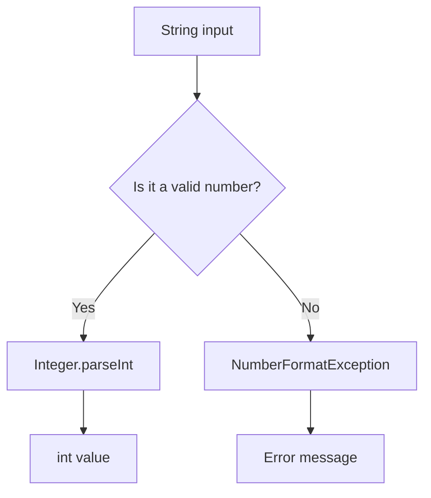
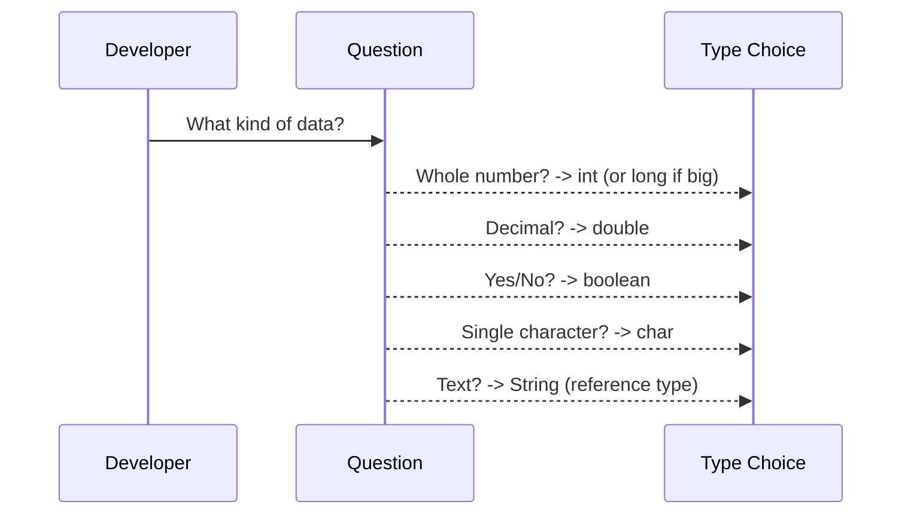
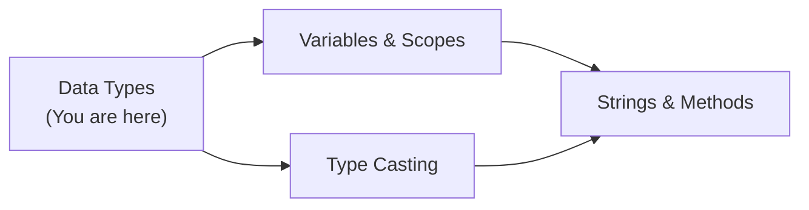
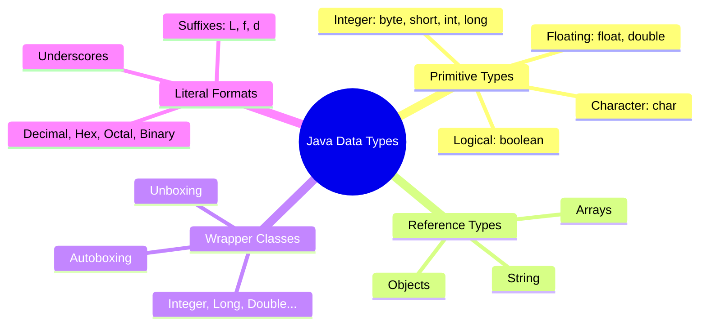
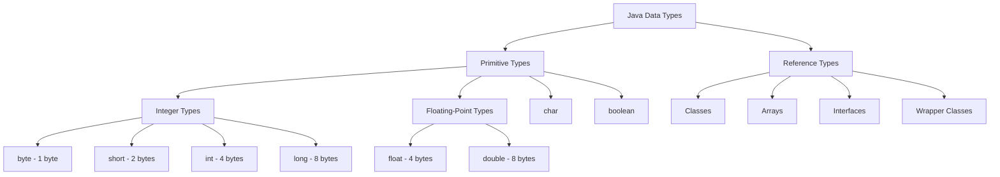

# Data Types — Junior Level

## Table of Contents

1. [Introduction](#introduction)
2. [Prerequisites](#prerequisites)
3. [Glossary](#glossary)
4. [Core Concepts](#core-concepts)
5. [Real-World Analogies](#real-world-analogies)
6. [Mental Models](#mental-models)
7. [Pros & Cons](#pros--cons)
8. [Use Cases](#use-cases)
9. [Code Examples](#code-examples)
10. [Coding Patterns](#coding-patterns)
11. [Product Use / Feature](#product-use--feature)
12. [Error Handling](#error-handling)
13. [Security Considerations](#security-considerations)
14. [Performance Tips](#performance-tips)
15. [Metrics & Analytics](#metrics--analytics)
16. [Best Practices](#best-practices)
17. [Edge Cases & Pitfalls](#edge-cases--pitfalls)
18. [Common Mistakes](#common-mistakes)
19. [Common Misconceptions](#common-misconceptions)
20. [Tricky Points](#tricky-points)
21. [Test](#test)
22. [Tricky Questions](#tricky-questions)
23. [Cheat Sheet](#cheat-sheet)
24. [Self-Assessment Checklist](#self-assessment-checklist)
25. [Summary](#summary)
26. [What You Can Build](#what-you-can-build)
27. [Further Reading](#further-reading)
28. [Related Topics](#related-topics)
29. [Diagrams & Visual Aids](#diagrams--visual-aids)

---

## Introduction

> Focus: "What is it?" and "How to use it?"

Every value in Java has a **data type**. Data types tell the compiler how much memory to allocate and what operations are allowed on that value. Java is a **statically typed** language — you must declare the type of every variable before using it.

Java data types split into two families:
- **Primitive types** — `byte`, `short`, `int`, `long`, `float`, `double`, `char`, `boolean` — stored directly in memory.
- **Reference types** — objects, arrays, strings, and wrapper classes like `Integer`, `Double` — stored as references (pointers) to objects on the heap.

Understanding data types is fundamental because every variable, parameter, return value, and expression in Java has a type.

---

## Prerequisites

What you should know before studying this topic:

- **Required:** Basic Syntax — you need to know how to write a Java class with a `main` method
- **Required:** Lifecycle of a Program — understand how `javac` compiles and `java` executes
- **Helpful but not required:** Binary number systems — helps understand why types have specific ranges

---

## Glossary

Key terms used in this topic:

| Term | Definition |
|------|-----------|
| **Primitive type** | One of 8 built-in types that store simple values directly in memory |
| **Reference type** | A type that stores a reference (address) to an object on the heap |
| **Wrapper class** | An object version of a primitive (e.g., `Integer` wraps `int`) |
| **Autoboxing** | Automatic conversion from a primitive to its wrapper class |
| **Unboxing** | Automatic conversion from a wrapper class to its primitive |
| **Literal** | A fixed value written directly in source code (e.g., `42`, `3.14`, `'A'`) |
| **Default value** | The value a field gets if you don't initialize it (e.g., `0` for `int`) |
| **Overflow** | When a calculation exceeds the maximum value a type can hold |
| **Type range** | The minimum and maximum values a type can represent |

---

## Core Concepts

### Concept 1: Primitive Types

Java has exactly 8 primitive types. Each has a fixed size in memory:

| Type | Size | Range | Default |
|------|------|-------|---------|
| `byte` | 1 byte | -128 to 127 | `0` |
| `short` | 2 bytes | -32,768 to 32,767 | `0` |
| `int` | 4 bytes | -2^31 to 2^31 - 1 | `0` |
| `long` | 8 bytes | -2^63 to 2^63 - 1 | `0L` |
| `float` | 4 bytes | ~6-7 decimal digits | `0.0f` |
| `double` | 8 bytes | ~15-16 decimal digits | `0.0d` |
| `char` | 2 bytes | 0 to 65,535 (Unicode) | `'\u0000'` |
| `boolean` | ~1 bit* | `true` or `false` | `false` |

> *The JVM implementation may use 1 byte or more for `boolean`.

### Concept 2: Reference Types

Everything that is not a primitive is a reference type. This includes:
- Classes (e.g., `String`, `Scanner`)
- Arrays (e.g., `int[]`, `String[]`)
- Interfaces
- Enums

A reference variable holds the **address** of an object on the heap, not the object itself.

### Concept 3: Wrapper Classes

Each primitive has a corresponding wrapper class in `java.lang`:

| Primitive | Wrapper |
|-----------|---------|
| `byte` | `Byte` |
| `short` | `Short` |
| `int` | `Integer` |
| `long` | `Long` |
| `float` | `Float` |
| `double` | `Double` |
| `char` | `Character` |
| `boolean` | `Boolean` |

Wrapper classes are needed when you want to store primitives in collections like `ArrayList<Integer>`.

### Concept 4: Autoboxing and Unboxing

Java automatically converts between primitives and their wrappers:

```java
Integer num = 42;        // autoboxing: int -> Integer
int value = num;         // unboxing: Integer -> int
```

### Concept 5: Literal Formats

Java supports multiple literal formats:

```java
int decimal = 100;          // decimal
int hex = 0xFF;             // hexadecimal (prefix 0x)
int octal = 0144;           // octal (prefix 0)
int binary = 0b1100100;     // binary (prefix 0b) — Java 7+
long big = 100L;            // long literal (suffix L)
float f = 3.14f;            // float literal (suffix f)
double d = 3.14;            // double literal (default)
int million = 1_000_000;    // underscores for readability — Java 7+
```

---

## Real-World Analogies

Everyday analogies to help you understand Data Types intuitively:

| Concept | Analogy |
|---------|--------|
| **Primitive types** | Like different-sized containers: a shot glass (`byte`), a cup (`short`), a bucket (`int`), a barrel (`long`) — each holds a specific amount |
| **Reference types** | Like a sticky note with an address written on it — the note itself is small, but it points to a full house (object) elsewhere |
| **Autoboxing** | Like wrapping a gift — the gift (primitive) goes into a box (wrapper object) automatically |
| **Type range** | Like a car's speedometer — it has a maximum reading; go beyond it and the needle wraps around to zero (overflow) |

> Note: The container analogy breaks down because Java types have both a minimum AND maximum value, and overflow wraps around rather than spilling.

---

## Mental Models

How to picture Data Types in your head:

**The intuition:** Think of each primitive type as a fixed-width slot in memory. An `int` is always a 32-bit slot — no matter whether you store `0` or `2,000,000,000` in it. A reference type is a slot that holds an arrow pointing somewhere else.

**Why this model helps:** It prevents the common mistake of thinking that small numbers use less memory than large numbers in the same type. An `int x = 1` uses exactly the same memory as `int y = 2_000_000_000`.

**The second intuition:** Think of wrapper classes as gift boxes around primitives. The box itself takes up extra space (object header, padding), but it lets the primitive participate in the "object world" (collections, generics, null).

---

## Pros & Cons

| Pros | Cons |
|------|------|
| Primitive types are fast and memory-efficient | Cannot be used with generics (`List<int>` is illegal) |
| Strong static typing catches errors at compile time | Requires explicit type declarations (more verbose) |
| Wrapper classes enable primitives in collections | Wrapper classes use more memory than primitives |
| Autoboxing simplifies code | Autoboxing can cause unexpected `NullPointerException` |

### When to use:
- Use **primitives** for local variables, loop counters, arithmetic — anytime you don't need null or collections
- Use **wrappers** when storing in `List`, `Map`, or when a value can be `null` (e.g., database columns)

### When NOT to use:
- Don't use `Double` when `double` suffices — wrappers have overhead
- Don't use `float`/`double` for money — use `BigDecimal` instead

---

## Use Cases

When and where you would use this in real projects:

- **Use Case 1:** Storing a user's age as `int` and name as `String` in a simple form application
- **Use Case 2:** Using `boolean` flags to control program flow (e.g., `isLoggedIn`, `hasPermission`)
- **Use Case 3:** Using `ArrayList<Integer>` to store a dynamic list of scores (requires wrapper)
- **Use Case 4:** Using `long` for timestamps (milliseconds since epoch)

---

## Code Examples

### Example 1: All Primitive Types

```java
public class Main {
    public static void main(String[] args) {
        // Integer types
        byte age = 25;                    // 1 byte: -128 to 127
        short year = 2024;                // 2 bytes: -32768 to 32767
        int population = 8_000_000;       // 4 bytes: ~2.1 billion
        long worldPop = 8_000_000_000L;   // 8 bytes: very large range

        // Floating-point types
        float pi = 3.14f;                 // 4 bytes: ~7 digits precision
        double precise = 3.141592653589;  // 8 bytes: ~15 digits precision

        // Character and boolean
        char grade = 'A';                 // 2 bytes: Unicode character
        boolean isJavaFun = true;         // true or false

        System.out.println("byte:    " + age);
        System.out.println("short:   " + year);
        System.out.println("int:     " + population);
        System.out.println("long:    " + worldPop);
        System.out.println("float:   " + pi);
        System.out.println("double:  " + precise);
        System.out.println("char:    " + grade);
        System.out.println("boolean: " + isJavaFun);
    }
}
```

**What it does:** Declares one variable for each primitive type and prints them.
**How to run:** `javac Main.java && java Main`

### Example 2: Wrapper Classes and Autoboxing

```java
import java.util.ArrayList;
import java.util.List;

public class Main {
    public static void main(String[] args) {
        // Autoboxing: int -> Integer
        Integer wrapped = 42;
        System.out.println("Wrapped: " + wrapped);

        // Unboxing: Integer -> int
        int unwrapped = wrapped;
        System.out.println("Unwrapped: " + unwrapped);

        // Wrappers are needed for collections
        List<Integer> scores = new ArrayList<>();
        scores.add(95);   // autoboxing happens here
        scores.add(87);
        scores.add(100);

        // Useful wrapper methods
        int parsed = Integer.parseInt("123");
        System.out.println("Parsed: " + parsed);

        int max = Integer.MAX_VALUE;
        int min = Integer.MIN_VALUE;
        System.out.println("int range: " + min + " to " + max);

        // Check type ranges
        System.out.println("byte range: " + Byte.MIN_VALUE + " to " + Byte.MAX_VALUE);
        System.out.println("long range: " + Long.MIN_VALUE + " to " + Long.MAX_VALUE);
    }
}
```

**What it does:** Demonstrates autoboxing, unboxing, collections with wrappers, parsing strings, and type ranges.
**How to run:** `javac Main.java && java Main`

### Example 3: Literal Formats

```java
public class Main {
    public static void main(String[] args) {
        // Different number bases
        int decimal = 255;
        int hex = 0xFF;
        int octal = 0377;
        int binary = 0b11111111;

        System.out.println("All equal 255:");
        System.out.println("  Decimal: " + decimal);
        System.out.println("  Hex:     " + hex);
        System.out.println("  Octal:   " + octal);
        System.out.println("  Binary:  " + binary);

        // Underscores for readability (Java 7+)
        long creditCard = 1234_5678_9012_3456L;
        int million = 1_000_000;
        double pi = 3.14_15_92;

        System.out.println("\nReadable literals:");
        System.out.println("  Credit card: " + creditCard);
        System.out.println("  Million: " + million);
        System.out.println("  Pi: " + pi);

        // Char literals
        char letter = 'A';
        char unicode = '\u0041';  // also 'A'
        char newline = '\n';

        System.out.println("\nChar: " + letter + " Unicode: " + unicode);
    }
}
```

**What it does:** Shows all literal formats Java supports including hex, octal, binary, underscores, and Unicode escapes.
**How to run:** `javac Main.java && java Main`

### Example 4: Default Values

```java
public class Main {
    // Instance fields get default values
    static byte b;
    static short s;
    static int i;
    static long l;
    static float f;
    static double d;
    static char c;
    static boolean bool;
    static String str;     // reference type
    static Integer wrapper; // wrapper type

    public static void main(String[] args) {
        System.out.println("byte:    " + b);       // 0
        System.out.println("short:   " + s);       // 0
        System.out.println("int:     " + i);       // 0
        System.out.println("long:    " + l);       // 0
        System.out.println("float:   " + f);       // 0.0
        System.out.println("double:  " + d);       // 0.0
        System.out.println("char:    [" + c + "]"); // '\u0000' (null character)
        System.out.println("boolean: " + bool);    // false
        System.out.println("String:  " + str);     // null
        System.out.println("Integer: " + wrapper); // null

        // NOTE: Local variables do NOT get default values!
        // int x;
        // System.out.println(x); // COMPILE ERROR: variable x might not have been initialized
    }
}
```

**What it does:** Shows that fields (class/instance variables) get default values, but local variables do not.
**How to run:** `javac Main.java && java Main`

---

## Coding Patterns

Common patterns beginners encounter when working with Data Types:

### Pattern 1: Safe Parsing with Wrapper Classes

**Intent:** Convert user input (String) to a number safely.
**When to use:** Anytime you read numbers from console, files, or network.

```java
public class Main {
    public static void main(String[] args) {
        String input = "42";

        // Safe parsing with try-catch
        try {
            int number = Integer.parseInt(input);
            System.out.println("Parsed: " + number);
        } catch (NumberFormatException e) {
            System.out.println("Invalid number: " + input);
        }
    }
}
```

**Diagram:**



**Remember:** Always catch `NumberFormatException` when parsing user input.

---

### Pattern 2: Choosing the Right Type

**Intent:** Pick the most appropriate primitive type for your data.

```java
public class Main {
    public static void main(String[] args) {
        // Good choices
        int age = 25;                // int is fine for most integers
        double price = 19.99;        // double for most decimals
        boolean isActive = true;     // boolean for flags
        char initial = 'J';          // char for single characters
        long timestamp = System.currentTimeMillis(); // long for timestamps

        // Overkill — but not wrong
        long x = 5;                  // long is unnecessary here; int suffices

        System.out.println("Age: " + age);
        System.out.println("Price: " + price);
        System.out.println("Active: " + isActive);
        System.out.println("Initial: " + initial);
        System.out.println("Timestamp: " + timestamp);
    }
}
```

**Diagram:**



---

## Clean Code

Basic clean code principles when working with Data Types in Java:

### Naming (Java conventions)

```java
// ❌ Bad
int x = 25;
double d = 19.99;
boolean f = true;

// ✅ Clean Java naming
int age = 25;
double priceInDollars = 19.99;
boolean isActive = true;
```

**Java naming rules:**
- Variables: camelCase (`userName`, `totalCount`)
- Constants: UPPER_SNAKE_CASE (`MAX_AGE`, `DEFAULT_TIMEOUT`)
- Boolean variables: use `is/has/can` prefix (`isValid`, `hasPermission`)

---

## Product Use / Feature

How this topic is used in real-world products and tools:

### 1. Android Development

- **How it uses Data Types:** Android UI dimensions use `int` (pixels), `float` (density-independent pixels), and `boolean` (visibility flags)
- **Why it matters:** Wrong type choice wastes memory on resource-constrained mobile devices

### 2. Spring Boot REST APIs

- **How it uses Data Types:** JSON request/response mapping uses wrapper classes (`Integer`, `Boolean`) because JSON fields can be `null`
- **Why it matters:** Using `int` instead of `Integer` for a nullable JSON field causes unboxing `NullPointerException`

### 3. Apache Kafka

- **How it uses Data Types:** Kafka partition keys use `byte[]`, offsets use `long` (can exceed `int` range on high-volume topics)
- **Why it matters:** Using `int` for offsets would overflow on topics with more than ~2 billion messages

---

## Error Handling

How to handle errors when working with Data Types:

### Error 1: NumberFormatException

```java
String input = "abc";
int number = Integer.parseInt(input); // throws NumberFormatException
```

**Why it happens:** The string does not contain a valid integer.
**How to fix:**

```java
try {
    int number = Integer.parseInt(input);
} catch (NumberFormatException e) {
    System.out.println("'" + input + "' is not a valid integer");
}
```

### Error 2: NullPointerException from Unboxing

```java
Integer wrapper = null;
int value = wrapper; // throws NullPointerException during unboxing
```

**Why it happens:** Java tries to call `wrapper.intValue()` but `wrapper` is `null`.
**How to fix:**

```java
Integer wrapper = null;
int value = (wrapper != null) ? wrapper : 0; // provide a default
```

### Error 3: ArithmeticException (Integer Division by Zero)

```java
int result = 10 / 0; // throws ArithmeticException
```

**Why it happens:** Integer division by zero is undefined.
**How to fix:**

```java
int divisor = 0;
if (divisor != 0) {
    int result = 10 / divisor;
} else {
    System.out.println("Cannot divide by zero");
}
```

> Note: `double result = 10.0 / 0;` does NOT throw an exception — it returns `Infinity`.

---

## Security Considerations

Security aspects to keep in mind when using Data Types:

### 1. Integer Overflow in Security-Critical Code

```java
// ❌ Insecure — overflow can bypass validation
int maxItems = Integer.MAX_VALUE;
int extra = 1;
int total = maxItems + extra; // overflows to -2147483648 (negative!)
if (total > 0) {
    // This block is SKIPPED — attacker bypasses the check
}

// ✅ Secure — use Math.addExact for overflow detection
try {
    int total2 = Math.addExact(maxItems, extra); // throws ArithmeticException
} catch (ArithmeticException e) {
    System.out.println("Overflow detected!");
}
```

**Risk:** An attacker could cause integer overflow to bypass size checks, allocate negative-sized buffers, or corrupt data.
**Mitigation:** Use `Math.addExact()`, `Math.multiplyExact()` for security-critical arithmetic.

### 2. Sensitive Data in Wrapper Objects

```java
// ❌ Insecure — String and wrapper objects linger in heap (visible in heap dumps)
String password = "secret123";

// ✅ More secure — use char[] and clear after use
char[] passwordChars = new char[]{'s','e','c','r','e','t'};
// ... use it ...
java.util.Arrays.fill(passwordChars, '\0'); // wipe from memory
```

**Risk:** Strings are immutable and stay in the string pool — passwords in heap dumps can be extracted.
**Mitigation:** Use `char[]` for passwords and zero-fill when done.

---

## Performance Tips

Basic performance considerations for Data Types:

### Tip 1: Use Primitives Over Wrappers

```java
// ❌ Slow — creates millions of Integer objects
Long sum = 0L;
for (int i = 0; i < 1_000_000; i++) {
    sum += i; // autoboxing on every iteration!
}

// ✅ Fast — no object creation
long sum2 = 0L;
for (int i = 0; i < 1_000_000; i++) {
    sum2 += i; // primitive arithmetic, no boxing
}
```

**Why it's faster:** Each autoboxing creates a new `Long` object on the heap. Using `long` keeps everything on the stack with zero allocations.

### Tip 2: Use `int` as Your Default Integer Type

```java
// ❌ Unnecessary — byte doesn't save memory for local variables on modern JVMs
byte count = 0;

// ✅ Simple and efficient — JVM is optimized for int
int count2 = 0;
```

**Why it's faster:** The JVM's instruction set is optimized for `int` and `long`. Using `byte` or `short` for local variables can actually be slower because the JVM widens them to `int` internally.

---

## Metrics & Analytics

Key metrics to track when using Data Types:

### What to Measure

| Metric | Why it matters | Tool |
|--------|---------------|------|
| **Object allocation rate** | Excessive wrapper creation causes GC pressure | VisualVM, JFR |
| **GC pause frequency** | Frequent autoboxing increases garbage collection | JConsole, JFR |

### Basic Instrumentation

```java
public class Main {
    public static void main(String[] args) {
        Runtime runtime = Runtime.getRuntime();

        long beforeMemory = runtime.totalMemory() - runtime.freeMemory();

        // Your data type operations here
        Integer[] wrappers = new Integer[1_000_000];
        for (int i = 0; i < wrappers.length; i++) {
            wrappers[i] = i; // autoboxing
        }

        long afterMemory = runtime.totalMemory() - runtime.freeMemory();
        System.out.println("Memory used: " + (afterMemory - beforeMemory) / 1024 + " KB");
    }
}
```

---

## Best Practices

- **Use `int` as the default integer type** — only use `long` if you need values beyond ~2 billion
- **Use `double` as the default floating-point type** — `float` has low precision and saves little
- **Never use `float` or `double` for money** — use `java.math.BigDecimal` instead
- **Prefer primitives over wrappers** unless you need null or collections
- **Use meaningful variable names** that indicate the type's purpose, not the type itself

---

## Edge Cases & Pitfalls

### Pitfall 1: Integer Overflow Wraps Silently

```java
public class Main {
    public static void main(String[] args) {
        int max = Integer.MAX_VALUE; // 2,147,483,647
        int overflow = max + 1;      // -2,147,483,648 (wraps around!)
        System.out.println("Max + 1 = " + overflow);
    }
}
```

**What happens:** Java does NOT throw an exception on integer overflow — it silently wraps around.
**How to fix:** Use `Math.addExact()` to detect overflow, or use `long` if you expect large values.

### Pitfall 2: Floating-Point Precision Loss

```java
public class Main {
    public static void main(String[] args) {
        double result = 0.1 + 0.2;
        System.out.println(result);         // 0.30000000000000004
        System.out.println(result == 0.3);  // false!
    }
}
```

**What happens:** `double` uses binary floating-point (IEEE 754) which cannot represent `0.1` exactly.
**How to fix:** Use `BigDecimal` for exact decimal arithmetic, or compare with a tolerance (`Math.abs(a - b) < 1e-9`).

---

## Common Mistakes

### Mistake 1: Comparing Wrapper Objects with `==`

```java
// ❌ Wrong — compares references, not values
Integer a = 200;
Integer b = 200;
System.out.println(a == b); // false (different objects!)

// ✅ Correct — compares values
System.out.println(a.equals(b)); // true
```

### Mistake 2: Forgetting the `L` Suffix for Long Literals

```java
// ❌ Wrong — this overflows int BEFORE assigning to long
long big = 3_000_000_000; // COMPILE ERROR: integer number too large

// ✅ Correct — use L suffix
long big2 = 3_000_000_000L;
```

### Mistake 3: Using Uninitialized Local Variables

```java
// ❌ Wrong — local variables have no default value
int x;
System.out.println(x); // COMPILE ERROR: variable x might not have been initialized

// ✅ Correct — always initialize local variables
int x2 = 0;
System.out.println(x2);
```

---

## Common Misconceptions

Things people often believe about Data Types that aren't true:

### Misconception 1: "`boolean` takes 1 bit of memory"

**Reality:** The JVM specification does not define the size of `boolean`. In practice, a `boolean` local variable typically occupies 4 bytes (one JVM stack slot), and a `boolean` in an array occupies 1 byte per element.

**Why people think this:** Because `boolean` only has two values (`true`/`false`), it seems like 1 bit should be enough.

### Misconception 2: "Using `byte` instead of `int` always saves memory"

**Reality:** For local variables, the JVM uses 32-bit stack slots regardless — a `byte` local uses the same slot as an `int`. `byte` only saves memory in large arrays (`byte[]` vs `int[]`).

**Why people think this:** The type's declared size (1 byte) suggests less memory usage.

### Misconception 3: "`Integer a = 127; Integer b = 127; a == b` always works, so `==` is fine for Integer"

**Reality:** Java caches `Integer` values from -128 to 127. For values in this range, `==` works by coincidence. For values outside this range, `==` compares references and returns `false`.

**Why people think this:** They test with small numbers and it works — then production code breaks with larger values.

---

## Tricky Points

Things that look simple but have subtle behavior:

### Tricky Point 1: Division Between Integers

```java
public class Main {
    public static void main(String[] args) {
        int a = 7;
        int b = 2;
        System.out.println(a / b);       // 3 (not 3.5!)
        System.out.println((double) a / b); // 3.5
    }
}
```

**Why it's tricky:** Dividing two `int` values produces an `int` — the decimal part is truncated, not rounded.
**Key takeaway:** Cast at least one operand to `double` if you need a fractional result.

### Tricky Point 2: Char Arithmetic

```java
public class Main {
    public static void main(String[] args) {
        char c = 'A';
        System.out.println(c + 1);       // 66 (int, not 'B')
        System.out.println((char)(c + 1)); // B
    }
}
```

**Why it's tricky:** Arithmetic on `char` produces an `int`, not a `char`. You must cast back explicitly.
**Key takeaway:** `char` is technically an unsigned 16-bit integer.

---

## Test

### Multiple Choice

**1. Which primitive type has the largest range?**

- A) `int`
- B) `double`
- C) `long`
- D) `float`

<details>
<summary>Answer</summary>

**C) `long`** — `long` ranges from -2^63 to 2^63 - 1. While `double` can represent larger magnitudes, it loses precision for large integers. `long` represents exact whole numbers in the largest range among integer types.

</details>

**2. What is the default value of an `int` instance variable?**

- A) `null`
- B) `0`
- C) `-1`
- D) Compiler error (must be initialized)

<details>
<summary>Answer</summary>

**B) `0`** — Instance and static fields of type `int` default to `0`. Local variables, however, MUST be initialized before use.

</details>

### True or False

**3. `float` can represent any `int` value exactly.**

<details>
<summary>Answer</summary>

**False** — `float` has only ~7 digits of decimal precision. Large `int` values (e.g., `16_777_217`) cannot be represented exactly in `float`. Try: `System.out.println(16_777_217 == (int)(float)16_777_217);` — prints `false`.

</details>

### What's the Output?

**4. What does this code print?**

```java
Integer x = 128;
Integer y = 128;
System.out.println(x == y);
```

<details>
<summary>Answer</summary>

Output: `false`
Explanation: Values outside the Integer cache range (-128 to 127) create separate objects. The `==` operator compares references, not values. Use `.equals()` instead.

</details>

**5. What does this code print?**

```java
System.out.println(1 + 2 + "3");
System.out.println("1" + 2 + 3);
```

<details>
<summary>Answer</summary>

Output:
```
33
123
```
Explanation: In the first line, `1 + 2` is `int` addition (= 3), then `3 + "3"` is string concatenation (= `"33"`). In the second line, `"1" + 2` is string concatenation (= `"12"`), then `"12" + 3` is also concatenation (= `"123"`).

</details>

**6. What does this code print?**

```java
byte b = 127;
b++;
System.out.println(b);
```

<details>
<summary>Answer</summary>

Output: `-128`
Explanation: `byte` max value is 127. Incrementing wraps around to -128 (overflow).

</details>

---

## "What If?" Scenarios

**What if you assign a `long` value to an `int` variable?**
- **You might think:** Java automatically truncates it
- **But actually:** The compiler gives an error: "possible lossy conversion from long to int". You must explicitly cast: `int x = (int) longValue;`

**What if you unbox a `null` Integer?**
- **You might think:** It returns 0 (the default for `int`)
- **But actually:** It throws `NullPointerException` because Java calls `.intValue()` on `null`

---

## Tricky Questions

Questions designed to confuse — with misleading options:

**1. What is the result of `(byte)(127 + 1)` in Java?**

- A) 128
- B) Compiler error
- C) -128
- D) ArithmeticException

<details>
<summary>Answer</summary>

**C) -128** — `127 + 1` is computed as `int` (= 128), then cast to `byte`. Since 128 exceeds byte's max (127), it wraps to -128. No exception is thrown for explicit casts.

</details>

**2. Which statement will NOT compile?**

- A) `int x = 100_000;`
- B) `long y = 100;`
- C) `byte b = 100;`
- D) `byte b = 128;`

<details>
<summary>Answer</summary>

**D) `byte b = 128;`** — `byte` range is -128 to 127. The literal `128` is out of range for `byte`, so the compiler rejects it. Options A, B, and C are all valid.

</details>

**3. What does `Integer.valueOf(127) == Integer.valueOf(127)` return?**

- A) `true` — always
- B) `false` — they are different objects
- C) `true` — but only because of caching
- D) Compile error

<details>
<summary>Answer</summary>

**C) `true` — but only because of caching** — Java caches `Integer` values from -128 to 127. `valueOf(127)` returns the same cached object both times, so `==` returns `true`. For `valueOf(128)`, the result would be `false`.

</details>

---

## Cheat Sheet

Quick reference for this topic:

| What | Syntax / Command | Example |
|------|-----------------|---------|
| Declare int | `int name = value;` | `int age = 25;` |
| Declare long | `long name = valueL;` | `long pop = 8_000_000_000L;` |
| Declare double | `double name = value;` | `double pi = 3.14;` |
| Declare float | `float name = valuef;` | `float f = 3.14f;` |
| Declare char | `char name = 'c';` | `char grade = 'A';` |
| Declare boolean | `boolean name = true/false;` | `boolean ok = true;` |
| Parse String to int | `Integer.parseInt(str)` | `Integer.parseInt("42")` |
| int to String | `String.valueOf(n)` | `String.valueOf(42)` |
| Get max value | `Type.MAX_VALUE` | `Integer.MAX_VALUE` |
| Get min value | `Type.MIN_VALUE` | `Integer.MIN_VALUE` |
| Hex literal | `0x` prefix | `int h = 0xFF;` |
| Binary literal | `0b` prefix | `int b = 0b1010;` |
| Readable numbers | underscores | `int m = 1_000_000;` |

---

## Self-Assessment Checklist

Check your understanding of Data Types:

### I can explain:
- [ ] What Data Types are and why Java requires them
- [ ] The difference between primitive and reference types
- [ ] All 8 primitive types, their sizes, and ranges
- [ ] What autoboxing and unboxing are
- [ ] Why `==` doesn't work reliably for wrapper objects

### I can do:
- [ ] Write code using all 8 primitive types
- [ ] Use wrapper classes with collections (`ArrayList<Integer>`)
- [ ] Parse strings to numbers and handle `NumberFormatException`
- [ ] Choose the right data type for a given scenario
- [ ] Use literal formats (hex, binary, underscores)

### I can answer:
- [ ] All multiple choice questions in this document
- [ ] "What's the output?" questions correctly

---

## Summary

- Java has **8 primitive types** (`byte`, `short`, `int`, `long`, `float`, `double`, `char`, `boolean`) and **reference types** (objects, arrays, strings)
- Use **`int`** as your default integer and **`double`** as your default decimal type
- **Wrapper classes** (`Integer`, `Double`, etc.) let primitives work with collections and generics
- **Autoboxing/unboxing** converts automatically, but watch out for `NullPointerException` on null wrappers
- **Never use `==`** to compare wrapper objects — use `.equals()`
- **Never use `float`/`double` for money** — use `BigDecimal`

**Next step:** Learn about Variables and Scopes to understand where variables live and how long they last.

---

## What You Can Build

Now that you understand Data Types, here's what you can build or use it for:

### Projects you can create:
- **Temperature Converter:** Convert between Celsius and Fahrenheit using `double` — uses floating-point arithmetic
- **Student Grade Calculator:** Store grades as `int[]`, calculate averages as `double` — uses type casting
- **Simple Calculator:** Parse user input with `Integer.parseInt()` — uses wrapper methods and error handling

### Technologies / tools that use this:
- **Spring Boot** — knowing when to use `Integer` vs `int` in entity fields (nullable columns need wrappers)
- **JDBC** — `ResultSet.getInt()`, `getDouble()`, `getBoolean()` all map to Java primitive types
- **Android** — UI parameters like width, height, padding all use `int` and `float`

### Learning path — what to study next:



---

## Further Reading

- **Official docs:** [Primitive Data Types — Oracle Tutorial](https://docs.oracle.com/javase/tutorial/java/nutsandbolts/datatypes.html)
- **Official docs:** [Autoboxing and Unboxing — Oracle Tutorial](https://docs.oracle.com/javase/tutorial/java/data/autoboxing.html)
- **Blog post:** [Java Data Types Explained — Baeldung](https://www.baeldung.com/java-primitives) — comprehensive guide with examples
- **Book chapter:** Effective Java (Bloch), Item 61 — "Prefer primitive types to boxed primitives"

---

## Related Topics

Topics to explore next or that connect to this one:

- **[Variables and Scopes](../04-variables-and-scopes/)** — where variables are stored and how long they live
- **[Type Casting](../05-type-casting/)** — converting between data types (widening and narrowing)
- **[Strings and Methods](../06-strings-and-methods/)** — `String` is the most common reference type
- **[Arrays](../08-arrays/)** — collections of same-type elements

---

## Diagrams & Visual Aids

### Mind Map

Visual overview of how key concepts in Data Types connect:



### Type Hierarchy Diagram



### Memory Layout

```
Primitive vs Reference — Memory Layout:

  Stack                          Heap
  ┌──────────────┐
  │ int age = 25 │──→ [25] (value stored directly on stack)
  ├──────────────┤
  │ Integer w    │──→ ┌─────────────────────┐
  │  (reference) │    │  Object Header (12B) │
  │              │    │  value: 25    (4B)   │
  │              │    │  padding      (0B)   │
  │              │    └─────────────────────┘
  └──────────────┘     Total: 16 bytes on heap
```
