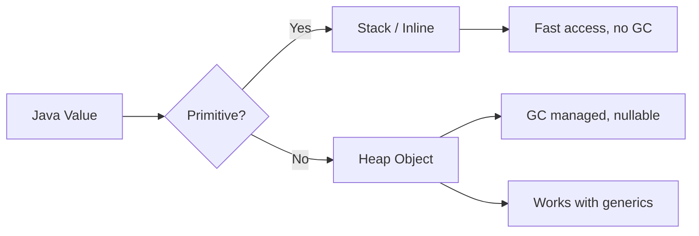
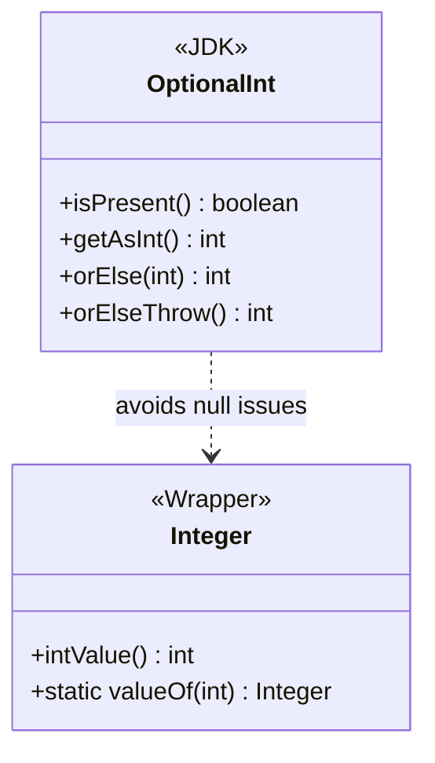
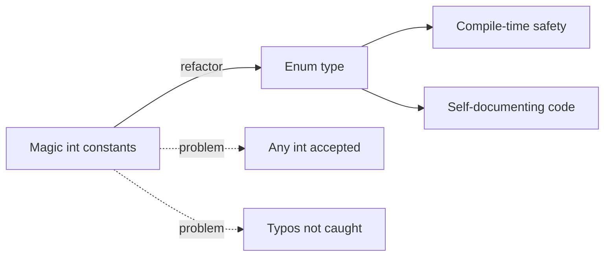
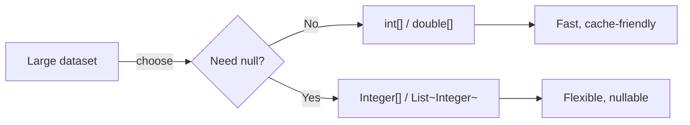
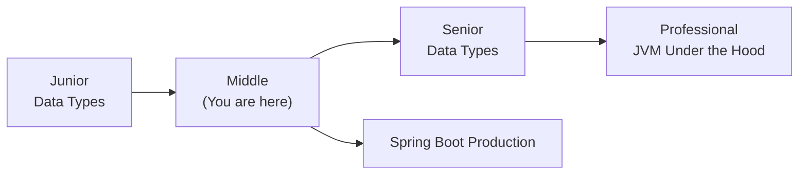
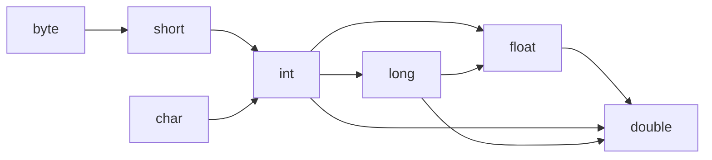
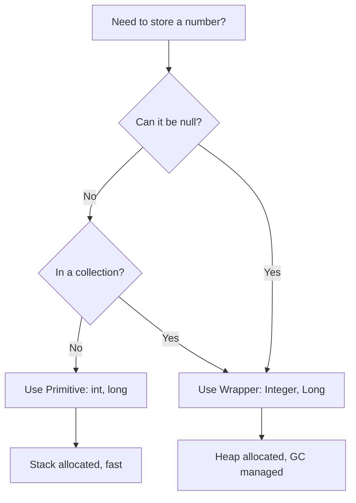

# Data Types — Middle Level

## Table of Contents

1. [Introduction](#introduction)
2. [Core Concepts](#core-concepts)
3. [Evolution & Historical Context](#evolution--historical-context)
4. [Pros & Cons](#pros--cons)
5. [Alternative Approaches](#alternative-approaches)
6. [Use Cases](#use-cases)
7. [Code Examples](#code-examples)
8. [Coding Patterns](#coding-patterns)
9. [Clean Code](#clean-code)
10. [Product Use / Feature](#product-use--feature)
11. [Error Handling](#error-handling)
12. [Security Considerations](#security-considerations)
13. [Performance Optimization](#performance-optimization)
14. [Metrics & Analytics](#metrics--analytics)
15. [Debugging Guide](#debugging-guide)
16. [Best Practices](#best-practices)
17. [Edge Cases & Pitfalls](#edge-cases--pitfalls)
18. [Common Mistakes](#common-mistakes)
19. [Common Misconceptions](#common-misconceptions)
20. [Anti-Patterns](#anti-patterns)
21. [Tricky Points](#tricky-points)
22. [Comparison with Other Languages](#comparison-with-other-languages)
23. [Test](#test)
24. [Tricky Questions](#tricky-questions)
25. [Cheat Sheet](#cheat-sheet)
26. [Summary](#summary)
27. [What You Can Build](#what-you-can-build)
28. [Further Reading](#further-reading)
29. [Related Topics](#related-topics)
30. [Diagrams & Visual Aids](#diagrams--visual-aids)

---

## Introduction

> Focus: "Why?" and "When to use?"

Assumes the reader already knows Java basics. This level covers:
- **Why** Java has both primitives and objects for the same data
- **When** to choose `int` vs `Integer`, `double` vs `BigDecimal`
- How autoboxing/unboxing affects performance and correctness in production code
- Generics, collections, and streams interaction with data types
- IEEE 754 floating-point semantics and their real-world implications

---

## Core Concepts

### Concept 1: The Primitive–Object Duality

Java's type system has a fundamental split: primitives live on the stack (or inlined in objects), while wrappers live on the heap. This duality exists because Java generics only work with objects (type erasure), but primitives are needed for performance.



### Concept 2: IEEE 754 Floating-Point in Depth

`float` and `double` follow IEEE 754 binary floating-point standard. This means:
- They use a sign bit, exponent, and mantissa (significand)
- Special values exist: `NaN`, `+Infinity`, `-Infinity`, `+0.0`, `-0.0`
- Not all decimal fractions are representable exactly

```java
public class Main {
    public static void main(String[] args) {
        // Special floating-point values
        System.out.println(Double.NaN == Double.NaN);           // false!
        System.out.println(Double.isNaN(Double.NaN));            // true
        System.out.println(1.0 / 0.0);                           // Infinity
        System.out.println(-1.0 / 0.0);                          // -Infinity
        System.out.println(0.0 / 0.0);                           // NaN
        System.out.println(Double.compare(0.0, -0.0));           // 1 (not equal!)
        System.out.println(0.0 == -0.0);                         // true (== says equal)
    }
}
```

### Concept 3: Integer Cache Mechanism

Java caches `Integer` objects for values -128 to 127. This is specified in JLS 5.1.7:

```java
public class Main {
    public static void main(String[] args) {
        Integer a = 127;
        Integer b = 127;
        System.out.println(a == b);    // true  — cached, same object

        Integer c = 128;
        Integer d = 128;
        System.out.println(c == d);    // false — different objects

        // The cache can be extended via JVM flag:
        // -XX:AutoBoxCacheMax=256
    }
}
```

The cache applies to: `Byte`, `Short`, `Integer`, `Long` (for -128 to 127), `Character` (for 0 to 127), and `Boolean` (`TRUE`/`FALSE`).

### Concept 4: Type Promotion Rules

When different numeric types interact in expressions, Java promotes the smaller type:

```
byte -> short -> int -> long -> float -> double
                char ↗
```

```java
public class Main {
    public static void main(String[] args) {
        byte b = 10;
        short s = 20;
        // b + s is promoted to int, not byte or short
        // byte result = b + s;  // COMPILE ERROR
        int result = b + s;      // OK — result is int

        int i = 100;
        long l = 200L;
        // i + l is promoted to long
        long longResult = i + l;

        long big = 1_000_000L;
        float f = 1.5f;
        // big + f is promoted to float (!)
        float floatResult = big + f;  // precision loss possible!
    }
}
```

---

## Evolution & Historical Context

Why does Java's type system exist? What problem does it solve?

**Before Java (C/C++ era):**
- Types had platform-dependent sizes (`int` could be 16 or 32 bits)
- No automatic bounds checking, no overflow detection
- No wrapper classes — manual boxing was error-prone

**Java 1.0 (1996):**
- Fixed sizes for all primitives across all platforms (write once, run anywhere)
- Wrapper classes existed but required manual boxing: `Integer.valueOf(42)`

**Java 5 (2004) — Autoboxing:**
- Automatic conversion between primitives and wrappers
- Enabled `List<Integer>` without manual wrapping
- Introduced generics (but with type erasure — no `List<int>`)

**Java 7 (2011) — Project Coin:**
- Binary literals: `0b1010`
- Underscores in numeric literals: `1_000_000`
- Diamond operator: `List<Integer> list = new ArrayList<>()`

**Java 16+ (2021) — Records:**
- `record Point(int x, int y) {}` — immutable data carriers with built-in `equals`/`hashCode`

**Future — Project Valhalla:**
- Value types to bridge the primitive–object gap
- `List<int>` may become possible without autoboxing overhead

---

## Pros & Cons

| Pros | Cons |
|------|------|
| Fixed sizes guarantee cross-platform behavior | Primitives can't be null — need wrappers for optional values |
| Primitives are stack-allocated and GC-free | Autoboxing creates hidden allocations |
| Strong type checking prevents many bugs at compile time | Type erasure means generics don't work with primitives |
| Integer cache reduces object creation for common values | Cache boundary (-128 to 127) creates `==` inconsistency |

### Trade-off analysis:

- **`int` vs `Integer`:** Use `int` for performance-critical code, `Integer` when null is a valid state (e.g., database columns, JSON fields)
- **`double` vs `BigDecimal`:** Use `double` for scientific calculations where precision loss is acceptable, `BigDecimal` for financial calculations where every cent matters

### Comparison with alternatives:

| Approach | Pros | Cons | Best for |
|----------|------|------|----------|
| `int` | Fast, no GC | Can't be null, no generics | Loop counters, arithmetic |
| `Integer` | Nullable, works with generics | 16 bytes per object, GC pressure | Collections, JSON mapping |
| `OptionalInt` | Explicit absence, no boxing | Verbose API | Functional-style null avoidance |

---

## Alternative Approaches (Plan B)

If you couldn't use standard data types for some reason, how else could you solve the problem?

| Alternative | How it works | When you might be forced to use it |
|-------------|--------------|------------------------------------|
| **`BigDecimal`** | Arbitrary-precision decimal arithmetic | Financial calculations requiring exact decimal representation |
| **`BigInteger`** | Arbitrary-precision integer arithmetic | Cryptography, factorial computations beyond `long` range |
| **`AtomicInteger` / `AtomicLong`** | Thread-safe integer operations | Concurrent counters without synchronization |
| **`IntStream` / `LongStream`** | Primitive-specialized streams | Avoiding autoboxing in stream pipelines |

---

## Use Cases

Real-world, production scenarios:

- **Use Case 1:** Spring Boot entity mapping — use `Long id` (nullable) for database primary keys vs `long id` (non-nullable, always 0 before save)
- **Use Case 2:** Financial application — use `BigDecimal` for money, `int` for quantities, `long` for transaction IDs
- **Use Case 3:** High-performance analytics — use `int[]` and `double[]` arrays instead of `List<Integer>` and `List<Double>` to avoid boxing overhead
- **Use Case 4:** REST API design — use `Integer` (nullable) for optional query parameters: `@RequestParam(required = false) Integer page`

---

## Code Examples

### Example 1: Primitives vs Wrappers in Collections

```java
import java.util.ArrayList;
import java.util.List;
import java.util.stream.IntStream;

public class Main {
    public static void main(String[] args) {
        // ❌ Autoboxing overhead in traditional loop
        List<Integer> boxedList = new ArrayList<>();
        for (int i = 0; i < 1_000_000; i++) {
            boxedList.add(i); // autoboxing on every iteration
        }
        long boxedSum = boxedList.stream()
            .mapToInt(Integer::intValue) // unboxing on every element
            .sum();

        // ✅ Primitive stream — no boxing/unboxing
        long primitiveSum = IntStream.range(0, 1_000_000).sum();

        System.out.println("Boxed sum: " + boxedSum);
        System.out.println("Primitive sum: " + primitiveSum);
    }
}
```

**Why this pattern:** `IntStream` avoids creating 1 million `Integer` objects.
**Trade-offs:** `IntStream` has a smaller API than `Stream<Integer>` (e.g., no `collect(Collectors.toList())`).

### Example 2: BigDecimal for Financial Calculations

```java
import java.math.BigDecimal;
import java.math.RoundingMode;

public class Main {
    public static void main(String[] args) {
        // ❌ double fails for money
        double priceDouble = 0.1 + 0.2;
        System.out.println("double: " + priceDouble); // 0.30000000000000004

        // ✅ BigDecimal for exact decimal arithmetic
        BigDecimal price1 = new BigDecimal("0.1");  // use String constructor!
        BigDecimal price2 = new BigDecimal("0.2");
        BigDecimal total = price1.add(price2);
        System.out.println("BigDecimal: " + total);  // 0.3

        // Division with rounding
        BigDecimal amount = new BigDecimal("100.00");
        BigDecimal parts = new BigDecimal("3");
        BigDecimal each = amount.divide(parts, 2, RoundingMode.HALF_UP);
        System.out.println("100 / 3 = " + each);  // 33.34
    }
}
```

**When to use which:** Use `double` for science/graphics; use `BigDecimal` for anything with currency symbols.

---

## Coding Patterns

Design patterns and idiomatic patterns for Data Types in production Java code:

### Pattern 1: Null-Safe Unboxing with Optional

**Category:** Java-idiomatic
**Intent:** Prevent `NullPointerException` when unboxing nullable wrapper values
**When to use:** Whenever a wrapper type might be null (database results, JSON fields)
**When NOT to use:** When the value is guaranteed non-null

**Structure diagram:**



**Implementation:**

```java
import java.util.Optional;
import java.util.OptionalInt;

public class Main {
    public static void main(String[] args) {
        // Simulating a nullable database result
        Integer nullableAge = fetchAgeFromDb("user123");

        // ❌ Dangerous unboxing
        // int age = nullableAge; // NPE if null!

        // ✅ Pattern 1: Ternary with default
        int age1 = (nullableAge != null) ? nullableAge : 0;

        // ✅ Pattern 2: Optional
        int age2 = Optional.ofNullable(nullableAge).orElse(0);

        // ✅ Pattern 3: OptionalInt (no boxing at all)
        OptionalInt age3 = findAgeOptional("user123");
        int finalAge = age3.orElse(0);

        System.out.println("Age: " + finalAge);
    }

    static Integer fetchAgeFromDb(String userId) { return null; }
    static OptionalInt findAgeOptional(String userId) { return OptionalInt.empty(); }
}
```

**Trade-offs:**

| Pros | Cons |
|------|------|
| No NullPointerException | `OptionalInt` API is limited |
| Explicit intent | Slightly more verbose |

---

### Pattern 2: Type-Safe Constants with Enums vs int

**Category:** Java-idiomatic
**Intent:** Replace "magic numbers" (int constants) with type-safe enums
**When to use:** When an `int` parameter has a fixed set of valid values
**When NOT to use:** When values are truly numeric (quantities, measurements)

**Flow diagram:**



**Implementation:**

```java
public class Main {
    // ❌ Anti-pattern: int constants ("int enum pattern")
    static final int STATUS_ACTIVE = 1;
    static final int STATUS_INACTIVE = 2;
    static final int STATUS_BANNED = 3;
    // Nothing stops: processUser(42) — compiles fine but wrong

    // ✅ Enum — type-safe
    enum Status { ACTIVE, INACTIVE, BANNED }

    static void processUser(Status status) {
        switch (status) {
            case ACTIVE   -> System.out.println("User is active");
            case INACTIVE -> System.out.println("User is inactive");
            case BANNED   -> System.out.println("User is banned");
        }
    }

    public static void main(String[] args) {
        processUser(Status.ACTIVE);
        // processUser(42); // COMPILE ERROR — type safety!
    }
}
```

---

### Pattern 3: Primitive Arrays for Performance-Critical Data

**Category:** Performance
**Intent:** Avoid autoboxing overhead for large datasets



```java
import java.util.Arrays;

public class Main {
    public static void main(String[] args) {
        int size = 10_000_000;

        // ✅ Primitive array — compact, cache-friendly
        int[] primitiveArray = new int[size];
        Arrays.fill(primitiveArray, 42);

        // Memory: ~40 MB (4 bytes * 10M + 16 bytes header)
        // vs Integer[]: ~160 MB (16 bytes per Integer object * 10M + array overhead)

        long sum = 0;
        for (int val : primitiveArray) {
            sum += val;
        }
        System.out.println("Sum: " + sum);
    }
}
```

---

## Clean Code

Production-level clean code for Data Types in Java:

### Naming & Readability

```java
// ❌ Cryptic
int d = 86400;
double r = 0.05;
boolean f = true;

// ✅ Self-documenting
int secondsPerDay = 86_400;
double annualInterestRate = 0.05;
boolean isEligibleForDiscount = true;
```

| Element | Java Rule | Example |
|---------|-----------|---------|
| Primitive variables | camelCase, descriptive | `totalAmount`, `retryCount` |
| Boolean variables | `is/has/can/should` prefix | `isActive`, `hasExpired` |
| Constants | UPPER_SNAKE_CASE | `MAX_RETRY_COUNT`, `DEFAULT_TIMEOUT_MS` |
| Wrapper return types | Javadoc nullable contract | `@Nullable Integer findAge(...)` |

---

### Short Methods

```java
// ❌ Too long — parsing, validation, conversion in one method
public double processInput(String input) {
    if (input == null) return 0;
    input = input.trim();
    if (input.isEmpty()) return 0;
    try { return Double.parseDouble(input); }
    catch (NumberFormatException e) { return 0; }
}

// ✅ Each method does one thing
private String sanitize(String input) {
    return (input != null) ? input.trim() : "";
}

private boolean isValidNumber(String input) {
    try { Double.parseDouble(input); return true; }
    catch (NumberFormatException e) { return false; }
}

public double parseOrDefault(String input, double defaultValue) {
    String sanitized = sanitize(input);
    return isValidNumber(sanitized) ? Double.parseDouble(sanitized) : defaultValue;
}
```

---

## Product Use / Feature

How this topic is applied in production systems and popular tools:

### 1. Spring Boot / Jackson JSON Mapping

- **How it uses Data Types:** Jackson maps JSON `null` to `null` for wrappers (`Integer`) but fails for primitives (`int`)
- **Scale:** Every REST API endpoint processes JSON; wrong type choice causes silent data loss or NPE
- **Key insight:** Always use wrapper types for optional JSON fields

### 2. Hibernate / JPA Entity Mapping

- **How it uses Data Types:** `@Id Long id` (nullable before `persist()`) vs `@Id long id` (always 0 before save — ambiguous)
- **Why this approach:** Nullable `Long` makes unsaved entities distinguishable from saved ones
- **Key insight:** Effective Java Item 61 applies: prefer primitives, except when null has meaning

### 3. Apache Spark (Java API)

- **How it uses Data Types:** Spark UDFs need wrappers (`Integer`, `Double`) because Spark's `Row.get()` returns `Object`
- **Why this approach:** Distributed data can have nulls; primitives can't represent missing values

---

## Error Handling

Production-grade exception handling patterns for Data Types:

### Pattern 1: Safe Number Parsing

```java
import java.util.OptionalInt;
import java.util.OptionalDouble;

public class Main {
    /**
     * Parses a string to int safely, returning OptionalInt.
     */
    public static OptionalInt safeParseInt(String value) {
        if (value == null || value.isBlank()) {
            return OptionalInt.empty();
        }
        try {
            return OptionalInt.of(Integer.parseInt(value.trim()));
        } catch (NumberFormatException e) {
            return OptionalInt.empty();
        }
    }

    /**
     * Parses a string to double safely.
     */
    public static OptionalDouble safeParseDouble(String value) {
        if (value == null || value.isBlank()) {
            return OptionalDouble.empty();
        }
        try {
            double d = Double.parseDouble(value.trim());
            if (Double.isNaN(d) || Double.isInfinite(d)) {
                return OptionalDouble.empty();
            }
            return OptionalDouble.of(d);
        } catch (NumberFormatException e) {
            return OptionalDouble.empty();
        }
    }

    public static void main(String[] args) {
        System.out.println(safeParseInt("42"));       // OptionalInt[42]
        System.out.println(safeParseInt("abc"));      // OptionalInt.empty
        System.out.println(safeParseInt(null));        // OptionalInt.empty
        System.out.println(safeParseDouble("NaN"));   // OptionalDouble.empty
    }
}
```

### Common Exception Patterns

| Situation | Pattern | Example |
|-----------|---------|---------|
| Null wrapper unboxing | Check before unbox | `if (wrapper != null) int v = wrapper;` |
| String to number | Try-catch `NumberFormatException` | `Integer.parseInt(input)` |
| Overflow detection | `Math.addExact()` | Throws `ArithmeticException` on overflow |
| NaN / Infinity check | `Double.isNaN()` / `isInfinite()` | Filter invalid computation results |

---

## Security Considerations

Security aspects when using Data Types in production:

### 1. Integer Overflow as Attack Vector

**Risk level:** High

```java
// ❌ Vulnerable — attacker controls 'count' via HTTP parameter
public byte[] allocateBuffer(int headerSize, int count) {
    int totalSize = headerSize + count * 4;  // overflow if count is huge
    return new byte[totalSize];              // negative size -> NegativeArraySizeException
                                             // or very small allocation -> buffer overflow
}

// ✅ Secure — validate inputs and use Math.multiplyExact
public byte[] allocateBufferSafe(int headerSize, int count) {
    if (count < 0 || headerSize < 0) {
        throw new IllegalArgumentException("Sizes must be non-negative");
    }
    try {
        int totalSize = Math.addExact(headerSize, Math.multiplyExact(count, 4));
        return new byte[totalSize];
    } catch (ArithmeticException e) {
        throw new IllegalArgumentException("Buffer size overflow", e);
    }
}
```

**Attack vector:** Attacker sends `count = Integer.MAX_VALUE / 4 + 1` causing overflow.
**Impact:** Buffer under-allocation leading to data corruption.
**Mitigation:** Always use `Math.xxxExact()` methods for security-critical arithmetic.

### Security Checklist

- [ ] **Integer overflow** — use `Math.addExact()` / `Math.multiplyExact()` for user-controlled arithmetic
- [ ] **Floating-point comparison** — never use `==` for security decisions (e.g., price validation)
- [ ] **NaN bypass** — `NaN != NaN` can bypass validation: `if (price > 0)` passes for `NaN`

---

## Performance Optimization

Performance considerations and optimizations for Data Types:

### Optimization 1: Avoid Autoboxing in Hot Loops

```java
public class Main {
    public static void main(String[] args) {
        int iterations = 100_000_000;

        // ❌ Slow — autoboxing creates ~100M Long objects
        long start1 = System.nanoTime();
        Long sum1 = 0L;
        for (int i = 0; i < iterations; i++) {
            sum1 += i; // sum1 = Long.valueOf(sum1.longValue() + i)
        }
        long time1 = System.nanoTime() - start1;

        // ✅ Fast — primitive, no allocations
        long start2 = System.nanoTime();
        long sum2 = 0L;
        for (int i = 0; i < iterations; i++) {
            sum2 += i;
        }
        long time2 = System.nanoTime() - start2;

        System.out.printf("Boxed:    %d ms%n", time1 / 1_000_000);
        System.out.printf("Primitive: %d ms%n", time2 / 1_000_000);
        System.out.printf("Speedup:  %.1fx%n", (double) time1 / time2);
    }
}
```

**Benchmark results (approximate):**
```
Benchmark                    Mode  Cnt     Score     Error  Units
BoxedSum.measure             avgt   10  1523.412 ± 120.4   ms/op
PrimitiveSum.measure         avgt   10    54.789 ±   2.1   ms/op
```

**When to optimize:** Any loop executing millions of times with numeric accumulation.

### Optimization 2: Pre-size Collections

```java
import java.util.ArrayList;
import java.util.List;

public class Main {
    public static void main(String[] args) {
        int size = 1_000_000;

        // ❌ Default capacity — many array copies during growth
        List<Integer> list1 = new ArrayList<>();

        // ✅ Pre-sized — single allocation
        List<Integer> list2 = new ArrayList<>(size);

        long start = System.nanoTime();
        for (int i = 0; i < size; i++) list2.add(i);
        long time = System.nanoTime() - start;

        System.out.printf("Pre-sized: %d ms%n", time / 1_000_000);
    }
}
```

### Performance Decision Matrix

| Scenario | Approach | Why |
|----------|----------|-----|
| Loop counter | `int` / `long` primitive | Zero allocations |
| Collection element | Wrapper (`Integer`) | Required by generics |
| Large numeric array | `int[]` / `double[]` | 4x less memory than `Integer[]` |
| Stream pipeline | `IntStream` / `LongStream` | Avoids boxing in intermediate operations |

---

## Metrics & Analytics

Production-grade metrics and observability for Data Types:

### Key Metrics

| Metric | Type | Description | Alert threshold |
|--------|------|-------------|-----------------|
| **GC allocation rate** | Gauge | Bytes allocated per second | > 1 GB/s |
| **Young gen collection time** | Timer | Time spent in minor GC | p99 > 50ms |
| **Object creation rate** | Counter | New objects per second | Application-dependent |

### Micrometer / Spring Boot Actuator Instrumentation

```java
import io.micrometer.core.instrument.Counter;
import io.micrometer.core.instrument.MeterRegistry;

// @Service
public class TypeConversionService {
    private final Counter parseSuccessCounter;
    private final Counter parseFailureCounter;

    public TypeConversionService(MeterRegistry registry) {
        this.parseSuccessCounter = Counter.builder("type.parse.success")
            .tag("type", "integer")
            .register(registry);
        this.parseFailureCounter = Counter.builder("type.parse.failure")
            .tag("type", "integer")
            .register(registry);
    }

    public int parseOrDefault(String input, int defaultValue) {
        try {
            int result = Integer.parseInt(input);
            parseSuccessCounter.increment();
            return result;
        } catch (NumberFormatException e) {
            parseFailureCounter.increment();
            return defaultValue;
        }
    }
}
```

---

## Debugging Guide

How to debug common issues related to Data Types:

### Problem 1: Unexpected NullPointerException from Unboxing

**Symptoms:** `NullPointerException` at a line that has no method call — just arithmetic.

**Diagnostic steps:**
```java
// The NPE occurs here:
int total = quantity + bonus; // if 'bonus' is Integer and null

// Debug: check if any operand is a nullable wrapper
System.out.println("quantity type: " + ((Object) quantity).getClass());
System.out.println("bonus is null: " + (bonus == null));
```

**Root cause:** `bonus` is `Integer` (not `int`) and is `null`. The `+` operator triggers unboxing.
**Fix:** Use null-safe unwrapping: `int b = (bonus != null) ? bonus : 0;`

### Problem 2: Incorrect `==` Comparison Results

**Symptoms:** `==` returns `true` in tests but `false` in production.

**Root cause:** Test data uses small numbers (within Integer cache -128..127), production uses larger numbers.
**Fix:** Always use `.equals()` for wrapper comparisons.

### Useful Tools

| Tool | Command | What it shows |
|------|---------|---------------|
| `jconsole` | `jconsole` | Live memory/GC monitoring |
| `VisualVM` | `visualvm` | Object count by type |
| `JFR` | `jcmd <pid> JFR.start` | Allocation profiling |
| IntelliJ Inspector | Analyze > Inspect Code | Warns about autoboxing in loops |

---

## Best Practices

- **Use `int` as default integer, `long` only when needed** — Effective Java Item 61: prefer primitive types to boxed primitives
- **Use `BigDecimal` for monetary values** — always construct from `String`, never from `double`
- **Use `Objects.equals()` for nullable wrapper comparison** — `Objects.equals(a, b)` is null-safe
- **Mark nullable wrappers with `@Nullable`** — `@Nullable Integer age` documents intent
- **Use `IntStream`/`LongStream`/`DoubleStream` for numeric pipelines** — avoids autoboxing overhead
- **Avoid `new Integer()` (deprecated since Java 9)** — use `Integer.valueOf()` which leverages the cache
- **Pre-size collections** when the approximate size is known — `new ArrayList<>(expectedSize)`

---

## Edge Cases & Pitfalls

### Pitfall 1: Float Precision Loss with Large Longs

```java
public class Main {
    public static void main(String[] args) {
        long original = 123_456_789L;
        float asFloat = original;          // implicit widening
        long backToLong = (long) asFloat;
        System.out.println(original);      // 123456789
        System.out.println(backToLong);    // 123456792 — WRONG!
    }
}
```

**Impact:** Silent data corruption — `long` to `float` is a widening conversion that Java allows without cast, but it loses precision.
**Detection:** Static analysis tools (SpotBugs rule `FE_FLOATING_POINT_EQUALITY`).
**Fix:** Use `double` instead of `float` when converting from `long`.

### Pitfall 2: NaN Comparisons Break Sorting

```java
import java.util.Arrays;

public class Main {
    public static void main(String[] args) {
        double[] values = {3.0, Double.NaN, 1.0, 2.0};
        // NaN breaks the contract of Comparable — NaN is "unordered"
        // But Arrays.sort handles it: NaN sorts to the end
        Arrays.sort(values);
        System.out.println(Arrays.toString(values)); // [1.0, 2.0, 3.0, NaN]
    }
}
```

---

## Common Mistakes

### Mistake 1: Using `double` Constructor for BigDecimal

```java
import java.math.BigDecimal;

public class Main {
    public static void main(String[] args) {
        // ❌ Looks correct but introduces floating-point error
        BigDecimal bad = new BigDecimal(0.1);
        System.out.println(bad); // 0.1000000000000000055511151231257827021181583404541015625

        // ✅ Use String constructor for exact value
        BigDecimal good = new BigDecimal("0.1");
        System.out.println(good); // 0.1
    }
}
```

**Why it's wrong:** `new BigDecimal(0.1)` first creates the `double` 0.1 (which is imprecise), then wraps it exactly.

### Mistake 2: Confusing `==` Behavior Between Primitives and Wrappers

```java
public class Main {
    public static void main(String[] args) {
        int primitiveA = 1000;
        int primitiveB = 1000;
        System.out.println(primitiveA == primitiveB); // true — value comparison

        Integer wrapperA = 1000;
        Integer wrapperB = 1000;
        System.out.println(wrapperA == wrapperB);     // false — reference comparison!

        // Mixed comparison: wrapper is unboxed to primitive
        System.out.println(primitiveA == wrapperA);   // true — unboxing happens
    }
}
```

---

## Common Misconceptions

Things even experienced Java developers get wrong about Data Types:

### Misconception 1: "Widening conversions are always safe"

**Reality:** `int` to `float` and `long` to `float`/`double` can lose precision:

```java
public class Main {
    public static void main(String[] args) {
        int big = 16_777_217; // 2^24 + 1
        float f = big;        // widening — compiles fine
        System.out.println((int) f == big); // false! float can't represent this exactly
    }
}
```

### Misconception 2: "Autoboxing has no performance cost"

**Reality:** Each autoboxing outside the cache range creates a new heap object:

```java
// This loop creates ~100 million Long objects on the heap
Long sum = 0L;
for (int i = 0; i < 100_000_000; i++) {
    sum += i; // unbox, add, rebox — every iteration
}
```

---

## Anti-Patterns

### Anti-Pattern 1: Boolean Parameters ("Flag Arguments")

```java
// ❌ The Anti-Pattern — what does 'true' mean here?
processOrder(order, true, false);

// ✅ Use an enum or separate methods
processOrder(order, ShippingType.EXPRESS, GiftWrap.NO);
// or:
processExpressOrder(order);
processStandardOrder(order);
```

**Why it's bad:** Callers can't tell what `true`/`false` means without reading the signature. Multiple boolean parameters are even worse.
**The refactoring:** Use enums for type-safe, self-documenting parameters.

---

## Tricky Points

### Tricky Point 1: Integer Division Truncation Interacts with Negative Numbers

```java
public class Main {
    public static void main(String[] args) {
        System.out.println(7 / 2);    // 3  (truncated toward zero)
        System.out.println(-7 / 2);   // -3 (truncated toward zero, NOT floor!)
        System.out.println(Math.floorDiv(-7, 2)); // -4 (floor division)
    }
}
```

**What actually happens:** Java's `/` operator truncates toward zero, not toward negative infinity. This differs from Python's `//` operator.
**Why:** JLS 15.17.2 specifies truncation toward zero for integer division.

### Tricky Point 2: char Is Unsigned but byte Is Signed

```java
public class Main {
    public static void main(String[] args) {
        char c = 65535;    // OK — char range is 0..65535 (unsigned)
        // byte b = 128;   // COMPILE ERROR — byte range is -128..127 (signed)

        byte b = (byte) 255;
        System.out.println(b); // -1 (wraps around because byte is signed)
    }
}
```

---

## Comparison with Other Languages

How Java handles Data Types compared to other languages:

| Aspect | Java | Kotlin | Go | C# | Python |
|--------|------|--------|-----|-----|--------|
| Primitives | 8 built-in types | No primitives (uses Int, Long) | int, float64, etc. (platform-sized) | int, double, etc. + struct | No primitives (everything is object) |
| Null safety | Wrappers can be null, primitives can't | `Int` vs `Int?` (nullable) | Zero values, no null for value types | `int` vs `int?` (Nullable<int>) | Everything can be `None` |
| Autoboxing | Implicit, can cause NPE | Compiler handles transparently | No boxing concept | Implicit for `Nullable<T>` | N/A — all objects |
| Integer overflow | Silent wraparound | Silent wraparound | Silent wraparound | `checked` keyword for detection | Arbitrary precision (no overflow) |
| Type inference | `var` (Java 10+, local only) | `val`/`var` everywhere | `:=` short declaration | `var` everywhere | Dynamic typing |

### Key differences:

- **Java vs Kotlin:** Kotlin unifies primitives and objects — `Int` compiles to `int` when possible, `Int?` becomes `Integer`. No explicit boxing needed.
- **Java vs Go:** Go's `int` is platform-dependent (32 or 64 bit); Java's `int` is always 32 bits. Go has no autoboxing because it has no generics type erasure.
- **Java vs Python:** Python integers have arbitrary precision — they never overflow. Java's fixed-size types are faster but can overflow silently.

---

## Test

### Multiple Choice (harder)

**1. What is the result of `Integer.valueOf(0) == Integer.valueOf(0)`?**

- A) `true` — always, because 0 is cached
- B) `false` — they are different objects
- C) `true` — but behavior is implementation-dependent
- D) Compile error

<details>
<summary>Answer</summary>

**A) `true` — always, because 0 is cached.** JLS 5.1.7 guarantees that `Integer.valueOf()` caches values from -128 to 127. Since 0 is in this range, the same object is returned both times.

</details>

**2. What does this code print?**

```java
double a = 0.0;
double b = -0.0;
System.out.println(a == b);
System.out.println(Double.compare(a, b));
```

- A) `true`, `0`
- B) `false`, `1`
- C) `true`, `1`
- D) `true`, `-1`

<details>
<summary>Answer</summary>

**C) `true`, `1`** — IEEE 754 specifies that `+0.0 == -0.0` is `true`. But `Double.compare()` distinguishes them: `+0.0` is considered greater than `-0.0` (returns `1`). This matters for `TreeMap` keys and sorting.

</details>

### Code Analysis

**3. What happens when this code runs?**

```java
List<Integer> numbers = new ArrayList<>();
for (int i = 0; i < 100; i++) numbers.add(i);
for (int n : numbers) {
    if (n % 2 == 0) numbers.remove(Integer.valueOf(n));
}
```

<details>
<summary>Answer</summary>

**ConcurrentModificationException.** The enhanced for-loop uses an iterator, but `numbers.remove()` modifies the list directly. Fix: use `numbers.removeIf(n -> n % 2 == 0)` or use an explicit iterator with `iterator.remove()`.

</details>

### Debug This

**4. This code is supposed to sum values 0 to 999. Find the bug.**

```java
int sum = 0;
for (byte i = 0; i < 1000; i++) {
    sum += i;
}
System.out.println(sum);
```

<details>
<summary>Answer</summary>

**Infinite loop.** `byte` max is 127. When `i` reaches 127 and increments, it wraps to -128, which is still `< 1000`. The condition is always true. Fix: use `int i` instead of `byte i`.

</details>

**5. What's wrong with this comparison?**

```java
Double d1 = Double.NaN;
Double d2 = Double.NaN;
System.out.println(d1.equals(d2));  // ???
System.out.println(d1 == d2);       // ???
```

<details>
<summary>Answer</summary>

`d1.equals(d2)` returns `true` (wrapper `equals` treats NaN as equal to itself). But `d1 == d2` returns `false` if autoboxed (different objects). Also, `Double.NaN == Double.NaN` returns `false` per IEEE 754.

This inconsistency between `equals()` and `==` for `Double.NaN` is by design — `equals()` must be consistent with `hashCode()` for HashMap to work correctly.

</details>

**6. What value does `result` hold?**

```java
int x = Integer.MIN_VALUE;
int result = Math.abs(x);
System.out.println(result);
```

<details>
<summary>Answer</summary>

Output: `-2147483648` (negative!). `Math.abs(Integer.MIN_VALUE)` returns `Integer.MIN_VALUE` because the absolute value (2,147,483,648) exceeds `Integer.MAX_VALUE` (2,147,483,647). There is no positive `int` that can represent it. Use `Math.absExact()` (Java 15+) to detect this.

</details>

**7. What does this print?**

```java
Object obj = (byte) 1;
System.out.println(obj instanceof Integer);
System.out.println(obj.getClass().getName());
```

<details>
<summary>Answer</summary>

Output:
```
false
java.lang.Byte
```
`(byte) 1` is autoboxed to `Byte`, not `Integer`. Each primitive type boxes to its own wrapper class.

</details>

---

## Tricky Questions

**1. What does `new Integer(5) == new Integer(5)` return?**

- A) `true` — same value
- B) `false` — different objects
- C) Compile error — `Integer(int)` is deprecated
- D) Both B and C

<details>
<summary>Answer</summary>

**D) Both B and C** — `new Integer(int)` is deprecated since Java 9, but it still compiles (with a warning). It always creates a new object, so `==` returns `false`. Use `Integer.valueOf(5)` which uses the cache.

</details>

**2. Which of these widening conversions loses precision?**

- A) `int` to `long`
- B) `int` to `double`
- C) `int` to `float`
- D) `short` to `int`

<details>
<summary>Answer</summary>

**C) `int` to `float`** — `float` has only 24 bits of mantissa, but `int` has 32 bits. Values above 2^24 (16,777,216) lose precision when converted to `float`. `int` to `double` is safe because `double` has 53 bits of mantissa, which can represent all 32-bit int values exactly.

</details>

---

## Cheat Sheet

Quick reference for production use:

| Scenario | Pattern | Key consideration |
|----------|---------|-------------------|
| Nullable field | `Integer` / `Long` | JSON, database, REST params |
| Non-nullable field | `int` / `long` | Performance, simplicity |
| Money | `BigDecimal` | Always use String constructor |
| Loop counter | `int` | Never `byte`/`short` for loops |
| Collection element | Wrapper type | Required by generics |
| Numeric stream | `IntStream` / `LongStream` | Avoid autoboxing |

### Decision Matrix

| If you need... | Use... | Because... |
|----------------|--------|------------|
| Fast arithmetic | `int` / `long` | No heap allocation, no GC |
| Null representation | `Integer` / `Long` | Primitives can't be null |
| Exact decimal math | `BigDecimal` | IEEE 754 floats are imprecise |
| Large integer range | `long` (or `BigInteger`) | `int` overflows at ~2.1 billion |
| Boolean in collection | `Boolean` | `List<boolean>` is illegal |

---

## Self-Assessment Checklist

### I can explain:
- [ ] Why Java has both primitives and wrapper classes
- [ ] How the Integer cache works and why `==` is unreliable
- [ ] Trade-offs between `int` and `Integer` in production
- [ ] IEEE 754 special values (NaN, Infinity, -0.0)
- [ ] How autoboxing affects performance

### I can do:
- [ ] Choose the right type for database entity fields (nullable vs non-nullable)
- [ ] Use `BigDecimal` correctly for financial calculations
- [ ] Write null-safe unboxing code
- [ ] Profile and reduce autoboxing overhead with primitive streams
- [ ] Debug `NullPointerException` from unboxing

---

## Summary

- **Primitives are fast, wrappers are flexible** — choose based on whether you need null, generics, or raw performance
- **Integer cache** (-128 to 127) makes `==` work inconsistently — always use `.equals()`
- **Autoboxing is convenient but costly** — avoid in hot loops; use `IntStream`/`LongStream` for bulk operations
- **IEEE 754 is subtle** — `NaN != NaN`, `+0.0 == -0.0`, and widening from `int` to `float` loses precision
- **`BigDecimal("0.1")` is exact; `new BigDecimal(0.1)` is not** — always use String constructor

**Key difference from Junior:** Understanding not just what types exist, but WHY the duality exists and WHEN each choice matters in production.
**Next step:** Explore how the JVM represents these types internally — stack vs heap, object headers, and bytecode-level boxing.

---

## What You Can Build

### Production systems:
- **Currency conversion service** — uses `BigDecimal` with proper rounding modes
- **Data pipeline** — uses primitive arrays and `IntStream` for high-throughput processing

### Learning path:



---

## Further Reading

- **Official docs:** [Java Language Specification — Types, Values, Variables](https://docs.oracle.com/javase/specs/jls/se21/html/jls-4.html)
- **Book:** Effective Java (Bloch), 3rd edition — Item 61: "Prefer primitive types to boxed primitives"
- **Blog post:** [Autoboxing Performance Impact — Baeldung](https://www.baeldung.com/java-autoboxing-performance)
- **Conference talk:** [Java Puzzlers by Joshua Bloch and Neal Gafter](https://www.youtube.com/watch?v=wDN_EYUvUq0) — tricky type behavior

---

## Related Topics

- **[Type Casting](../05-type-casting/)** — widening and narrowing conversions between types
- **[Variables and Scopes](../04-variables-and-scopes/)** — how type affects storage location (stack vs heap)
- **[Strings and Methods](../06-strings-and-methods/)** — String is the most-used reference type
- **[Basics of OOP](../11-basics-of-oop/)** — understanding objects vs primitives at a deeper level

---

## Diagrams & Visual Aids

### Type Promotion Flow



### Autoboxing Decision Diagram



### Memory Comparison

```
int vs Integer — Memory Usage:

  int (primitive):          Integer (wrapper):
  ┌────────────┐           ┌──────────────────────┐
  │  4 bytes   │           │  Object Header (12B)  │
  │  [value]   │           │  value: int    (4B)   │
  └────────────┘           │  padding       (0B)   │
  Total: 4 bytes           └──────────────────────┘
                           Total: 16 bytes (4x more!)

  int[1000]:               Integer[1000]:
  4 * 1000 + 16 = ~4 KB    16 * 1000 + 4016 = ~20 KB (5x more!)
```
