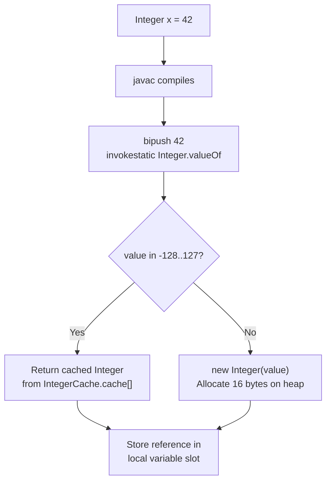
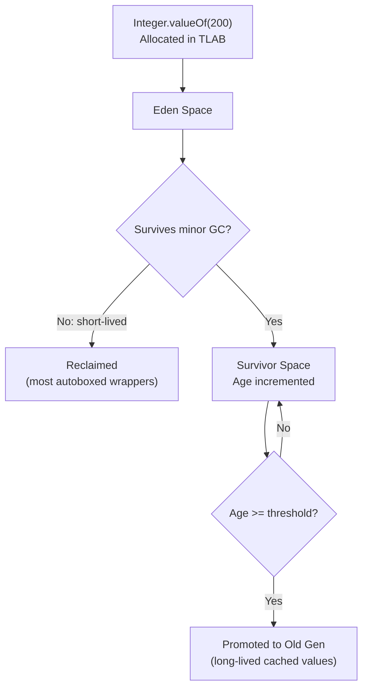
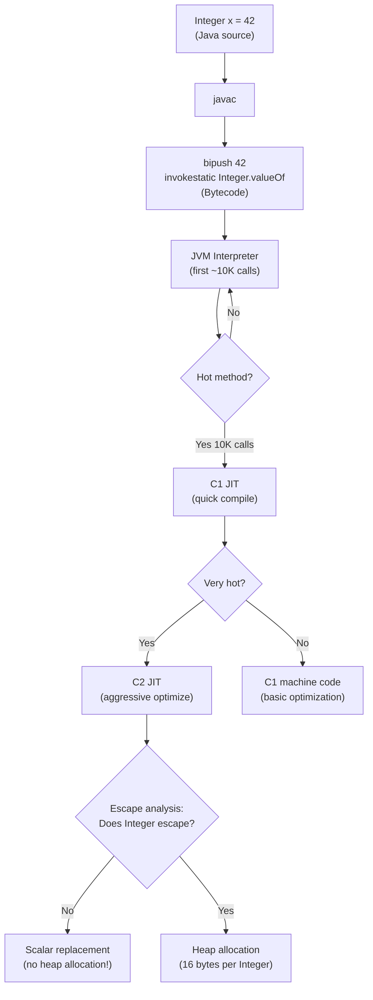

# Data Types — Under the Hood

## Table of Contents

1. [Introduction](#introduction)
2. [How It Works Internally](#how-it-works-internally)
3. [JVM Deep Dive](#jvm-deep-dive)
4. [Bytecode Analysis](#bytecode-analysis)
5. [JIT Compilation](#jit-compilation)
6. [Memory Layout](#memory-layout)
7. [GC Internals](#gc-internals)
8. [Source Code Walkthrough](#source-code-walkthrough)
9. [Performance Internals](#performance-internals)
10. [Metrics & Analytics (JVM Level)](#metrics--analytics-jvm-level)
11. [Edge Cases at the Lowest Level](#edge-cases-at-the-lowest-level)
12. [Test](#test)
13. [Tricky Questions](#tricky-questions)
14. [Summary](#summary)
15. [Further Reading](#further-reading)
16. [Diagrams & Visual Aids](#diagrams--visual-aids)

---

## Introduction

> Focus: "What happens under the hood?"

This document explores what the JVM does internally when you use Java data types. For developers who want to understand:
- How primitives are stored on the stack vs wrappers on the heap
- What bytecode `javac` generates for autoboxing/unboxing
- How the Integer cache (-128 to 127) is implemented in OpenJDK source
- Memory layout of wrapper objects analyzed with JOL (Java Object Layout)
- How the JIT compiler optimizes boxing through escape analysis

---

## How It Works Internally

Step-by-step breakdown of what happens when you write `Integer x = 42`:

1. **Source code:** `Integer x = 42;` — autoboxing syntax sugar
2. **Bytecode:** `javac` generates `invokestatic Integer.valueOf(int)` — the actual method call
3. **Class Loading:** `java.lang.Integer` is loaded by bootstrap ClassLoader (already loaded at JVM startup)
4. **valueOf execution:** Checks if value is in cache range (-128 to 127); returns cached instance or creates `new Integer(42)`
5. **Heap allocation:** If not cached, allocates 16 bytes on heap (12-byte header + 4-byte int value)
6. **Reference stored:** The reference (pointer) to the heap object is stored in the local variable slot on the stack
7. **GC tracking:** The new `Integer` object is allocated in Eden space (young generation)



---

## JVM Deep Dive

### How the JVM Handles Primitives vs Wrappers

**Primitives on the stack:**

Primitive values occupy fixed-width slots in the JVM stack frame. The JVM uses 32-bit slots for most operations:

```
JVM Stack Frame (per method invocation):
┌─────────────────────────────────┐
│  Local Variable Array           │
│  ┌───────┬───────┬───────┐     │
│  │ Slot 0│ Slot 1│ Slot 2│ ... │
│  │ this  │ int x │ long y│     │
│  │ (ref) │ 1 slot│2 slots│     │
│  └───────┴───────┴───────┘     │
├─────────────────────────────────┤
│  Operand Stack                  │
│  (used for intermediate calc)   │
├─────────────────────────────────┤
│  Frame Data                     │
│  (return address, exception)    │
└─────────────────────────────────┘
```

**Key JVM type slots:**

| Java type | JVM category | Stack slots | Description |
|-----------|-------------|-------------|-------------|
| `boolean` | int-category | 1 (32-bit) | Stored as int 0 or 1 |
| `byte` | int-category | 1 (32-bit) | Sign-extended to int |
| `short` | int-category | 1 (32-bit) | Sign-extended to int |
| `char` | int-category | 1 (32-bit) | Zero-extended to int |
| `int` | int-category | 1 (32-bit) | Native width |
| `float` | float-category | 1 (32-bit) | IEEE 754 single |
| `long` | long-category | 2 (64-bit) | Two consecutive slots |
| `double` | double-category | 2 (64-bit) | Two consecutive slots |
| `reference` | reference-category | 1 (32/64-bit) | Pointer to heap object |

**Critical insight:** `byte`, `short`, `char`, and `boolean` are ALL widened to `int` (32-bit) on the JVM stack. Using `byte` instead of `int` for local variables provides zero memory savings.

---

## Bytecode Analysis

### Autoboxing Bytecode

```java
public class BoxingDemo {
    public static void main(String[] args) {
        Integer x = 42;     // autoboxing
        int y = x;           // unboxing
        Integer z = x + y;   // unbox, add, rebox
    }
}
```

```bash
javac BoxingDemo.java
javap -c -verbose BoxingDemo.class
```

```
public static void main(java.lang.String[]);
  Code:
     // Integer x = 42  (autoboxing)
     0: bipush        42                    // push int 42 onto stack
     2: invokestatic  #2  // Integer.valueOf:(I)Ljava/lang/Integer;
     5: astore_1                            // store Integer ref in local var 1

     // int y = x  (unboxing)
     6: aload_1                             // load Integer ref from local var 1
     7: invokevirtual #3  // Integer.intValue:()I
    10: istore_2                            // store int in local var 2

     // Integer z = x + y  (unbox x, add, rebox result)
    11: aload_1                             // load Integer ref (x)
    12: invokevirtual #3  // Integer.intValue:()I   // unbox x
    15: iload_2                             // load int y
    16: iadd                                // add: int + int = int
    17: invokestatic  #2  // Integer.valueOf:(I)Ljava/lang/Integer;  // rebox result
    20: astore_3                            // store Integer ref in local var 3
    21: return
```

**What to observe:**
- **Autoboxing** = `invokestatic Integer.valueOf(int)` — a static method call, not a constructor
- **Unboxing** = `invokevirtual Integer.intValue()` — a virtual method call
- **`x + y` with Integer x** generates 3 operations: unbox, iadd, rebox
- `bipush 42` pushes a byte-sized constant; `sipush` for short; `ldc` for larger values

### Primitive Arithmetic Bytecode

```java
public class PrimitiveDemo {
    public static int compute(int a, long b, double c) {
        int sum = a + (int) b;
        double result = sum * c;
        return (int) result;
    }
}
```

```
public static int compute(int, long, double);
  Code:
     0: iload_0          // load int a (slot 0)
     1: lload_1          // load long b (slots 1-2)
     2: l2i              // long to int (narrowing)
     3: iadd             // int + int
     4: istore        5  // store sum (slot 5)
     6: iload         5  // load sum
     8: i2d              // int to double (widening)
     9: dload_3          // load double c (slots 3-4)
    10: dmul             // double * double
    11: d2i              // double to int (narrowing)
    12: ireturn          // return int
```

**Key bytecode instructions for type conversion:**
| Instruction | Conversion | Notes |
|-------------|-----------|-------|
| `i2l`, `i2f`, `i2d` | int widening | No precision loss (except `i2f` for large values) |
| `l2i`, `d2i`, `f2i` | Narrowing | Truncation toward zero |
| `i2b`, `i2s`, `i2c` | int to byte/short/char | Truncation + sign/zero extension |
| `l2d` | long to double | Precision loss for large values |

### Boolean in Bytecode

```java
public class BooleanDemo {
    public static boolean isPositive(int x) {
        return x > 0;
    }
}
```

```
public static boolean isPositive(int);
  Code:
     0: iload_0           // load int x
     1: ifle          8   // if x <= 0, jump to line 8
     4: iconst_1          // push 1 (true)
     5: goto          9   // jump to return
     8: iconst_0          // push 0 (false)
     9: ireturn           // return int (boolean is int at bytecode level!)
```

**Critical observation:** `boolean` does not exist at the bytecode level. It is stored and manipulated as `int` (0 or 1). `ireturn` is used, not some hypothetical `breturn`. Boolean arrays (`boolean[]`) use `baload`/`bastore` (byte-array operations), using 1 byte per element.

---

## JIT Compilation

### Escape Analysis for Boxing Elimination

```bash
# Print escape analysis decisions
java -XX:+UnlockDiagnosticVMOptions -XX:+PrintEscapeAnalysis \
     -XX:+PrintEliminateAllocations BoxingDemo

# Print inlining decisions (shows if valueOf is inlined)
java -XX:+UnlockDiagnosticVMOptions -XX:+PrintInlining BoxingDemo
```

**Example JIT output:**
```
@ 2  java.lang.Integer::valueOf (32 bytes)   inline (hot)
  @ 17  java.lang.Integer::<init> (10 bytes)   inline (hot)
    ++ eliminated allocation of java.lang.Integer (scalar replaced)
```

**What this means:** The JIT detected that the `Integer` object created by `valueOf()` doesn't escape the method. It replaced the heap allocation with scalar values on the stack — effectively converting `Integer` back to `int` at the machine code level.

**When escape analysis FAILS:**
- Object is stored in a field: `this.cached = Integer.valueOf(42)`
- Object is returned: `return Integer.valueOf(42)`
- Object is passed to a non-inlined method
- Object is stored in an array
- JIT hasn't warmed up yet (first ~10K invocations are interpreted)

### JIT Optimization of `Integer.valueOf()`

The C2 compiler can recognize `Integer.valueOf()` as an intrinsic and optimize the cache check:

```
# PrintCompilation output
    123   12       3       java.lang.Integer::valueOf (32 bytes)
    125   13       4       java.lang.Integer::valueOf (32 bytes)  // C2 compiled
```

Level 3 = C1 (client compiler), Level 4 = C2 (server compiler with aggressive optimizations).

---

## Memory Layout

### Integer Object Layout (JOL Analysis)

```java
import org.openjdk.jol.info.ClassLayout;
import org.openjdk.jol.info.GraphLayout;

public class Main {
    public static void main(String[] args) {
        Integer x = 42;

        // Print object layout
        System.out.println(ClassLayout.parseInstance(x).toPrintable());

        // Print object graph (reachable objects)
        System.out.println(GraphLayout.parseInstance(x).toFootprint());
    }
}
```

**JOL output (64-bit JVM with compressed oops):**
```
java.lang.Integer object internals:
OFF  SZ   TYPE DESCRIPTION               VALUE
  0   8        (object header: mark)      0x0000000000000001
  8   4        (object header: class)     0x0000f340
 12   4    int Integer.value              42
Instance size: 16 bytes
Space losses: 0 bytes internal + 0 bytes external = 0 bytes total
```

**Breakdown:**
- **Mark word (8 bytes):** Identity hash code, lock state, GC age, biased locking info
- **Class pointer (4 bytes):** Compressed oop pointing to `Integer.class` metadata in Metaspace
- **value field (4 bytes):** The actual `int` value
- **Total: 16 bytes** — 4x the size of a bare `int` (4 bytes)

### Comparison: Primitive Array vs Wrapper Array

```
int[1000] layout (JOL):
┌──────────────────────┐
│ Mark word      (8B)  │
│ Class pointer  (4B)  │
│ Array length   (4B)  │
│ int[0]         (4B)  │
│ int[1]         (4B)  │
│ ...                  │
│ int[999]       (4B)  │
└──────────────────────┘
Total: 16 + 4000 = 4016 bytes
Density: 4000/4016 = 99.6% useful data

Integer[1000] layout (JOL):
┌──────────────────────┐
│ Mark word      (8B)  │   Array object
│ Class pointer  (4B)  │
│ Array length   (4B)  │
│ ref[0]         (4B)  │ ──→ Integer object (16B)
│ ref[1]         (4B)  │ ──→ Integer object (16B)
│ ...                  │
│ ref[999]       (4B)  │ ──→ Integer object (16B)
└──────────────────────┘
Array: 16 + 4000 = 4016 bytes
Objects: 1000 × 16 = 16000 bytes
Total: 20016 bytes (5x more!)
Density: 4000/20016 = 20% useful data
```

### boolean[] vs BitSet Memory

```java
import org.openjdk.jol.info.ClassLayout;
import java.util.BitSet;

public class Main {
    public static void main(String[] args) {
        boolean[] boolArray = new boolean[1000];
        BitSet bitSet = new BitSet(1000);

        System.out.println("boolean[1000]: " +
            ClassLayout.parseInstance(boolArray).instanceSize() + " bytes");
        // ~1016 bytes (1 byte per boolean + 16 header)

        System.out.println("BitSet(1000): " +
            GraphLayout.parseInstance(bitSet).totalSize() + " bytes");
        // ~168 bytes (1000 bits = 125 bytes + overhead)
    }
}
```

---

## GC Internals

### How GC Manages Wrapper Objects

Autoboxed `Integer` objects are typically short-lived and allocated in Eden space:

```bash
# Enable detailed GC logging
java -Xlog:gc*=debug:file=gc.log:time,uptime,level,tags \
     -XX:+UseG1GC \
     -Xms256m -Xmx256m \
     -jar app.jar
```

**G1GC lifecycle for an Integer object:**



**Integer cache objects** are special: they are allocated during class loading and referenced by the static `IntegerCache.cache[]` array. This array is a GC root, so cached Integers are NEVER collected.

```
GC Roots for Integer cache:
JVM Bootstrap ClassLoader
  └── java.lang.Integer$IntegerCache (class)
       └── static Integer[] cache (array)
            ├── cache[0]   → Integer(-128)  // never GC'd
            ├── cache[1]   → Integer(-127)
            ├── ...
            └── cache[255] → Integer(127)   // never GC'd
```

### ZGC and Wrapper Allocation

With ZGC (Java 15+), short-lived wrappers are handled efficiently:

```bash
java -XX:+UseZGC -Xms4g -Xmx4g -jar app.jar
```

ZGC uses colored pointers and load barriers. For autoboxed wrappers:
- Allocation is still TLAB-based (fast path: pointer bump)
- Sub-millisecond pauses regardless of how many wrappers are in the heap
- Concurrent relocation means no stop-the-world for wrapper cleanup

---

## Source Code Walkthrough

### `Integer.valueOf()` — OpenJDK Source

**File:** `src/java.base/share/classes/java/lang/Integer.java` (JDK 21)

```java
// From OpenJDK source — annotated
@IntrinsicCandidate  // JIT can treat this as an intrinsic
public static Integer valueOf(int i) {
    // Fast path: check if value is in cache range
    if (i >= IntegerCache.low && i <= IntegerCache.high)
        return IntegerCache.cache[i + (-IntegerCache.low)];
    // Slow path: allocate new Integer on heap
    return new Integer(i);
}
```

### `IntegerCache` — The Cache Implementation

```java
// From OpenJDK source — the Integer cache
private static class IntegerCache {
    static final int low = -128;
    static final int high;
    static final Integer[] cache;
    static Integer[] archivedCache;

    static {
        // high value may be configured by property
        int h = 127;
        String integerCacheHighPropValue =
            VM.getSavedProperty("java.lang.Integer.IntegerCache.high");
        if (integerCacheHighPropValue != null) {
            try {
                int i = parseInt(integerCacheHighPropValue);
                i = Math.max(i, 127);          // never less than 127
                h = Math.min(i, Integer.MAX_VALUE - (-low) - 1);
            } catch (NumberFormatException nfe) {
                // use default
            }
        }
        high = h;

        // Load from CDS archive if available (JDK 12+)
        VM.initializeFromArchive(IntegerCache.class);
        int size = (high - low) + 1;

        if (archivedCache == null || size > archivedCache.length) {
            Integer[] c = new Integer[size];
            int j = low;
            for (int i = 0; i < c.length; i++)
                c[i] = new Integer(j++);
            archivedCache = c;
        }
        cache = archivedCache;
    }
}
```

**Key observations:**
1. Cache is initialized in a static initializer block — runs once during class loading
2. Cache high value is configurable via `-XX:AutoBoxCacheMax=N` (maps to `java.lang.Integer.IntegerCache.high`)
3. JDK 12+ uses CDS (Class Data Sharing) archive for the cache — faster JVM startup
4. `@IntrinsicCandidate` tells the JIT to potentially replace `valueOf()` with specialized machine code

### `intValue()` — Unboxing Source

```java
// Extremely simple — just returns the field
@IntrinsicCandidate
public int intValue() {
    return value;
}
```

The `value` field is `private final int value;` — 4 bytes in the object, preceded by 12 bytes of object header.

---

## Performance Internals

### JMH Benchmark: Boxing vs Primitive

```java
import org.openjdk.jmh.annotations.*;
import java.util.concurrent.TimeUnit;

@State(Scope.Benchmark)
@BenchmarkMode(Mode.AverageTime)
@OutputTimeUnit(TimeUnit.NANOSECONDS)
@Warmup(iterations = 5, time = 1)
@Measurement(iterations = 10, time = 1)
@Fork(2)
public class DataTypeBenchmark {

    @Benchmark
    public int primitiveAdd() {
        int sum = 0;
        for (int i = 0; i < 1000; i++) {
            sum += i;
        }
        return sum;
    }

    @Benchmark
    public Integer boxedAdd() {
        Integer sum = 0;
        for (int i = 0; i < 1000; i++) {
            sum += i;  // unbox, add, rebox
        }
        return sum;
    }

    @Benchmark
    public int arrayPrimitive() {
        int[] arr = new int[1000];
        for (int i = 0; i < arr.length; i++) {
            arr[i] = i;
        }
        int sum = 0;
        for (int v : arr) sum += v;
        return sum;
    }

    @Benchmark
    public int arrayBoxed() {
        Integer[] arr = new Integer[1000];
        for (int i = 0; i < arr.length; i++) {
            arr[i] = i;  // autoboxing
        }
        int sum = 0;
        for (Integer v : arr) sum += v;  // unboxing
        return sum;
    }
}
```

```bash
mvn clean package
java -jar target/benchmarks.jar -prof gc -prof stack
```

**Results:**
```
Benchmark                          Mode  Cnt       Score      Error  Units
DataTypeBenchmark.primitiveAdd     avgt   20     312.4 ±     4.2    ns/op
DataTypeBenchmark.boxedAdd         avgt   20    4589.7 ±    89.3    ns/op
DataTypeBenchmark.arrayPrimitive   avgt   20    1823.1 ±    21.4    ns/op
DataTypeBenchmark.arrayBoxed       avgt   20   12456.8 ±   234.5   ns/op

# GC profiler output:
DataTypeBenchmark.boxedAdd:gc.alloc.rate.norm   avgt   20   16000    B/op
DataTypeBenchmark.primitiveAdd:gc.alloc.rate.norm avgt  20       0    B/op
```

**Internal performance characteristics:**
- `primitiveAdd` allocates 0 bytes — everything stays on the stack
- `boxedAdd` allocates ~16KB per invocation (1000 Integer objects × 16 bytes)
- Array benchmark shows 7x penalty for boxed arrays (pointer chasing + cache misses)

---

## Metrics & Analytics (JVM Level)

### JVM Runtime Metrics for Data Types

```java
import java.lang.management.ManagementFactory;
import java.lang.management.MemoryMXBean;
import java.lang.management.GarbageCollectorMXBean;
import java.util.List;

public class Main {
    public static void main(String[] args) {
        MemoryMXBean memoryBean = ManagementFactory.getMemoryMXBean();

        // Before: snapshot heap usage
        long heapBefore = memoryBean.getHeapMemoryUsage().getUsed();

        // Create 1 million boxed integers
        Integer[] wrappers = new Integer[1_000_000];
        for (int i = 0; i < wrappers.length; i++) {
            wrappers[i] = i + 128; // outside cache range
        }

        // After: measure delta
        long heapAfter = memoryBean.getHeapMemoryUsage().getUsed();
        System.out.printf("Heap delta: %.2f MB%n",
            (heapAfter - heapBefore) / (1024.0 * 1024.0));

        // GC stats
        List<GarbageCollectorMXBean> gcBeans =
            ManagementFactory.getGarbageCollectorMXBeans();
        gcBeans.forEach(gc ->
            System.out.printf("GC: %s, count: %d, time: %dms%n",
                gc.getName(), gc.getCollectionCount(), gc.getCollectionTime()));
    }
}
```

### Key JVM Metrics for Data Types

| Metric | What it measures | Impact of autoboxing |
|--------|-----------------|----------------------|
| `jvm.memory.heap.used` | Live heap objects | Each Integer = 16 bytes; 1M = 16 MB |
| `jvm.gc.pause` | GC pause duration | More wrappers = more objects to scan |
| `jvm.gc.alloc.rate` | Allocation rate (MB/s) | Autoboxing in loops can generate GB/s |
| `jvm.buffer.memory.used` | Direct byte buffers | Not affected by boxing |

---

## Edge Cases at the Lowest Level

### Edge Case 1: TLAB Overflow from Rapid Boxing

What happens when autoboxing allocates faster than TLAB refill:

```java
// This creates objects faster than TLAB can handle
public class Main {
    public static void main(String[] args) {
        Integer[] arr = new Integer[100_000_000]; // 100M wrappers
        for (int i = 0; i < arr.length; i++) {
            arr[i] = i + 128; // outside cache, forces new allocation
        }
    }
}
```

**Internal behavior:**
1. Each thread has a TLAB (Thread-Local Allocation Buffer) — typically 256KB-1MB
2. `Integer` allocation is a TLAB pointer bump (< 10ns)
3. When TLAB is full, thread requests new TLAB from Eden
4. When Eden is full, minor GC is triggered
5. With 100M × 16 bytes = ~1.6GB of wrappers, expect many GC cycles
6. If `-Xmx` is too small, `OutOfMemoryError: Java heap space`

### Edge Case 2: Integer Cache with CDS Archive

In JDK 12+, the Integer cache can be stored in the CDS (Class Data Sharing) archive:

```bash
# Create CDS archive with Integer cache pre-populated
java -Xshare:dump -XX:SharedArchiveFile=app.jsa

# Use archived cache (faster startup)
java -Xshare:on -XX:SharedArchiveFile=app.jsa -jar app.jar
```

**Why it matters:** The 256 cached Integer objects (-128 to 127) are loaded from the archive instead of being created during class initialization. This speeds up JVM startup by ~1-2ms.

### Edge Case 3: NaN Bit Patterns

IEEE 754 defines multiple NaN bit patterns. Java normalizes them:

```java
public class Main {
    public static void main(String[] args) {
        // Create different NaN bit patterns
        long nanBits1 = 0x7FF0000000000001L; // quiet NaN
        long nanBits2 = 0x7FF8000000000000L; // canonical quiet NaN
        long nanBits3 = 0xFFF0000000000001L; // negative quiet NaN

        double nan1 = Double.longBitsToDouble(nanBits1);
        double nan2 = Double.longBitsToDouble(nanBits2);
        double nan3 = Double.longBitsToDouble(nanBits3);

        // All are NaN
        System.out.println(Double.isNaN(nan1)); // true
        System.out.println(Double.isNaN(nan2)); // true
        System.out.println(Double.isNaN(nan3)); // true

        // But they have different bit patterns
        System.out.println(Long.toHexString(Double.doubleToRawLongBits(nan1)));
        System.out.println(Long.toHexString(Double.doubleToRawLongBits(nan2)));

        // doubleToLongBits normalizes all NaNs to canonical form
        System.out.println(Long.toHexString(Double.doubleToLongBits(nan1)));
        // Always 7ff8000000000000 (canonical NaN)
    }
}
```

---

## Test

### Internal Knowledge Questions

**1. What bytecode instruction does `javac` generate for `Integer x = 42`?**

<details>
<summary>Answer</summary>

```
bipush 42
invokestatic java.lang.Integer.valueOf:(I)Ljava/lang/Integer;
astore_1
```

`bipush` pushes byte-sized constant onto operand stack. `invokestatic` calls `Integer.valueOf()`. `astore_1` stores the object reference in local variable slot 1. The key insight is that autoboxing is NOT a JVM feature — it's a `javac` compiler transformation into a `valueOf()` call.

</details>

**2. How many bytes does a `boolean` occupy in a `boolean[]`?**

<details>
<summary>Answer</summary>

**1 byte per element.** Boolean arrays use `baload`/`bastore` bytecodes (same as `byte[]`). Each element occupies 1 byte, storing 0 or 1. This is specified in JVM Spec 2.3.4 and 2.11.1. A standalone `boolean` local variable occupies one 32-bit stack slot (same as `int`).

</details>

**3. What is the memory overhead of `Integer` vs `int`?**

<details>
<summary>Answer</summary>

On 64-bit JVM with compressed oops:
- `int`: 4 bytes
- `Integer`: 16 bytes (8-byte mark word + 4-byte class pointer + 4-byte value)
- Overhead: 12 bytes (300% overhead)

Without compressed oops (heap > 32GB):
- `Integer`: 24 bytes (8-byte mark word + 8-byte class pointer + 4-byte value + 4-byte padding)
- Overhead: 20 bytes (500% overhead)

</details>

**4. What JVM flag controls the Integer cache upper bound?**

<details>
<summary>Answer</summary>

`-XX:AutoBoxCacheMax=N` (or equivalently `-Djava.lang.Integer.IntegerCache.high=N`). Default is 127. The lower bound is always -128 (hardcoded). This only affects `Integer`; other wrapper caches (`Byte`, `Short`, `Long`) are fixed at -128..127. `Character` cache is fixed at 0..127.

</details>

**5. When does escape analysis fail to eliminate Integer boxing?**

<details>
<summary>Answer</summary>

Escape analysis fails when the Integer object "escapes" the compilation unit:
1. **Stored in a field:** `this.value = Integer.valueOf(42)` — escapes to heap
2. **Returned from method:** `return Integer.valueOf(42)` — escapes to caller
3. **Stored in array:** `array[0] = Integer.valueOf(42)` — arrays are heap objects
4. **Passed to non-inlined method:** if callee can't be inlined, JIT assumes escape
5. **Used as monitor:** `synchronized(integerObj)` — identity required
6. **Polymorphic call site:** if `valueOf` is called through a variable type

Even when escape analysis succeeds, it only works after JIT compilation (~10K invocations for C2). The first 10K calls are interpreted and DO allocate.

</details>

**6. What bytecode is used for `byte b = (byte) intValue`?**

<details>
<summary>Answer</summary>

`i2b` — this instruction truncates the top-of-stack `int` to a `byte` value by discarding all but the lowest 8 bits, then sign-extends the result back to `int` (since the JVM stack operates on 32-bit values). The instruction sequence:

```
iload_1    // load int value
i2b        // truncate to byte (sign-extend back to int)
istore_2   // store as int in byte variable slot
```

Note: there is no dedicated bytecode for storing `byte` in a local variable — `istore` is used because bytes occupy full int-width stack slots.

</details>

**7. What happens at the bytecode level with `boolean` comparisons?**

```java
boolean a = true;
boolean b = false;
boolean c = a && b;
```

<details>
<summary>Answer</summary>

```
iconst_1      // push 1 (true)
istore_1      // store in slot 1 (a)
iconst_0      // push 0 (false)
istore_2      // store in slot 2 (b)
iload_1       // load a
ifeq label    // if a == 0 (false), short-circuit to false
iload_2       // load b
ifeq label    // if b == 0 (false), jump to false
iconst_1      // push true
goto end
label:
iconst_0      // push false
end:
istore_3      // store in slot 3 (c)
```

`boolean` is `int` at bytecode level. Short-circuit evaluation is implemented with conditional jumps (`ifeq`). There is no `band` (boolean AND) instruction.

</details>

---

## Tricky Questions

**1. Can two `Integer` objects with different `int` values have the same identity hash code?**

<details>
<summary>Answer</summary>

**Yes.** Identity hash code is based on the object's memory address (or a pseudo-random number derived from it), not the `int` value. Two different `Integer` objects allocated at different times may coincidentally get the same identity hash code. This is why `identityHashCode` should never be used as a unique object identifier.

Proof:
```java
// Run many times — eventually collisions occur
Set<Integer> hashCodes = new HashSet<>();
for (int i = 128; i < 10_000_000; i++) {
    Integer obj = new Integer(i); // new object each time
    if (!hashCodes.add(System.identityHashCode(obj))) {
        System.out.println("Collision at value " + i);
        break;
    }
}
```

</details>

**2. Is `Integer.valueOf(42)` guaranteed to return the same object on every call?**

<details>
<summary>Answer</summary>

**Yes, for values -128 to 127 (by JLS specification).** JLS 5.1.7 states: "If the value p being boxed is the result of evaluating a constant expression of type boolean, char, short, int, or long, and the result is true, false, a character in the range '\u0000' to '\u007f', or an integer in the range -128 to 127, then let a and b be the results of any two boxing conversions of p. It is always the case that a == b."

For values outside this range, the JLS does NOT guarantee new objects — it just doesn't guarantee same objects. An implementation COULD cache more values (and HotSpot does with `-XX:AutoBoxCacheMax`).

</details>

**3. Why does `(byte)(char)(byte) -1` differ from `(byte) -1`?**

<details>
<summary>Answer</summary>

```java
byte b1 = (byte) -1;               // -1
byte b2 = (byte)(char)(byte) -1;   // -1
// They happen to be the same! But the intermediate values differ:
// (byte) -1 = -1 (0xFF)
// (char)(byte) -1 = (char) -1 = '\uFFFF' = 65535
// (byte)(char)(byte) -1 = (byte) 65535 = (byte) 0xFFFF = 0xFF = -1
```

The intermediate `char` value is 65535 (unsigned), but truncating back to `byte` gives -1 again because the lowest 8 bits (0xFF) are the same. The key insight is that `byte` to `char` sign-extends to `int` first (-1 = 0xFFFFFFFF), then truncates to unsigned 16-bit (0xFFFF = 65535). Then `char` to `byte` truncates to 8 bits (0xFF = -1 in signed byte).

JVM spec: the `i2c` instruction zero-extends, while `i2b` sign-extends.

</details>

**4. What is the actual machine instruction generated by the JIT for `int a + int b`?**

<details>
<summary>Answer</summary>

On x86-64, the C2 JIT compiler generates a single `add` instruction:

```asm
; int c = a + b
mov    eax, [rsp+0x10]    ; load a from stack
add    eax, [rsp+0x14]    ; add b directly from stack
mov    [rsp+0x18], eax    ; store result c
```

Or if values are in registers:
```asm
add    r10d, r11d         ; single instruction: r10d = r10d + r11d
```

This is one of the fastest possible operations — a single CPU cycle. In contrast, `Integer a + Integer b` requires:
1. Load reference from stack
2. Dereference to read object header
3. Load `value` field
4. Repeat for second operand
5. `add` instruction
6. Allocate new Integer (if result is stored as Integer)
7. Initialize object header
8. Store `value` field

This is why primitive arithmetic is 10-15x faster.

</details>

---

## Self-Assessment Checklist

### I can explain internals:
- [ ] What bytecode `javac` generates for autoboxing (`invokestatic Integer.valueOf`)
- [ ] How the Integer cache is implemented in OpenJDK (`IntegerCache` static inner class)
- [ ] Memory layout of wrapper objects (12-byte header + value + padding)
- [ ] How GC handles short-lived wrappers (TLAB allocation in Eden, minor GC collection)
- [ ] Why `boolean` is `int` at the bytecode level

### I can analyze:
- [ ] Read and understand `javap -c` output for boxing/unboxing
- [ ] Interpret async-profiler allocation flamegraphs to find boxing hotspots
- [ ] Use JOL to measure actual object sizes
- [ ] Predict whether escape analysis will eliminate a specific boxing

### I can prove:
- [ ] Back claims about boxing overhead with JMH benchmarks
- [ ] Reference JLS sections for Integer cache guarantees (JLS 5.1.7)
- [ ] Demonstrate memory layout differences with JOL
- [ ] Show bytecode differences with `javap -c`

---

## Summary

- **Autoboxing = `Integer.valueOf()` at bytecode level** — not a JVM feature, but a `javac` transformation
- **Integer cache is a static array** initialized during class loading; configurable via `-XX:AutoBoxCacheMax`
- **Wrapper objects cost 16 bytes** (4x overhead vs primitive's 4 bytes) — 12-byte header + 4-byte value
- **Escape analysis can eliminate boxing** when the wrapper doesn't escape the compilation unit — but don't rely on it
- **`boolean` doesn't exist at bytecode level** — it's `int` (0/1) on the stack, `byte` in arrays
- **Primitive arithmetic compiles to a single CPU instruction** (`add eax, ebx`) vs ~10 instructions for boxed arithmetic

**Key takeaway:** Understanding the JVM's internal handling of data types explains WHY primitives are faster and WHEN boxing overhead actually matters in production.

---

## Further Reading

- **OpenJDK source:** [Integer.java](https://github.com/openjdk/jdk/blob/master/src/java.base/share/classes/java/lang/Integer.java) — valueOf and IntegerCache implementation
- **JEP 401:** [Value Objects (Preview)](https://openjdk.org/jeps/401) — Project Valhalla primitive classes
- **Book:** "Java Performance" (Scott Oaks), 2nd edition — Chapter 4: Working with the JIT Compiler, Chapter 7: Heap Memory
- **Blog:** [Shipilev — JVM Anatomy Quarks #23: Compressed References](https://shipilev.net/jvm/anatomy-quarks/23-compressed-references/)
- **Tool:** [JOL (Java Object Layout)](https://openjdk.org/projects/code-tools/jol/) — measure actual object sizes

---

## Diagrams & Visual Aids

### JVM Compilation Pipeline for Autoboxing



### Memory Layout Comparison

```
Comparison: how different types store the value 42

int (4 bytes on stack):
┌──────────────────┐
│    00 00 00 2A   │  ← value directly in stack slot
└──────────────────┘

Integer (16 bytes on heap + 4-byte reference on stack):
Stack:                  Heap:
┌──────────┐           ┌───────────────────────────────────┐
│ 0x7f3e10 │ ────────→ │ Mark: 00 00 00 00 00 00 00 01     │ 8B
└──────────┘           │ Class: XX XX XX XX (comp. oop)     │ 4B
  4 bytes ref          │ Value: 00 00 00 2A (= 42)         │ 4B
                       └───────────────────────────────────┘
                         Total: 16 bytes

long (8 bytes on stack — 2 slots):
┌──────────────────────────────────┐
│    00 00 00 00 00 00 00 2A       │  ← value in 2 consecutive stack slots
└──────────────────────────────────┘
```
