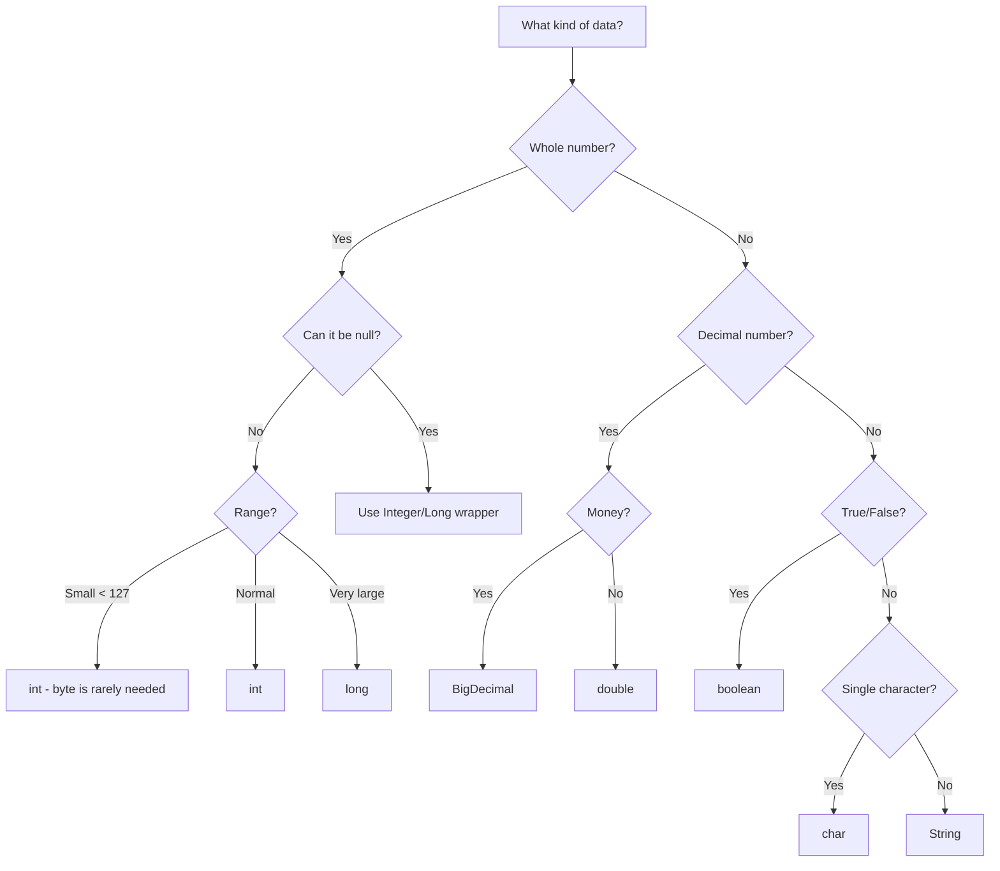

# Data Types — Practical Tasks

## Table of Contents

1. [Junior Tasks](#junior-tasks)
2. [Middle Tasks](#middle-tasks)
3. [Senior Tasks](#senior-tasks)
4. [Questions](#questions)
5. [Mini Projects](#mini-projects)
6. [Challenge](#challenge)

---

## Junior Tasks

### Task 1: Primitive Type Explorer

**Type:** Code

**Goal:** Practice declaring all 8 primitive types and printing their ranges.

**Instructions:**
1. Create a class `PrimitiveExplorer` with a `main` method
2. Declare one variable of each primitive type with a meaningful value
3. Print each variable with its type name
4. Print the MIN and MAX values for all numeric types using wrapper class constants
5. Print the size in bytes for each type using `Byte.BYTES`, `Integer.BYTES`, etc.

**Starter code:**

```java
public class PrimitiveExplorer {
    public static void main(String[] args) {
        // TODO: Declare all 8 primitive types
        byte myByte = 0;
        // ... declare short, int, long, float, double, char, boolean

        // TODO: Print each variable
        System.out.println("byte: " + myByte);

        // TODO: Print ranges using wrapper constants
        System.out.println("byte range: " + Byte.MIN_VALUE + " to " + Byte.MAX_VALUE);

        // TODO: Print sizes
        System.out.println("byte size: " + Byte.BYTES + " bytes");
    }
}
```

**Expected output (example):**
```
byte: 100
short: 30000
int: 1000000
long: 9000000000
float: 3.14
double: 3.141592653589
char: A
boolean: true

byte range: -128 to 127 (1 bytes)
short range: -32768 to 32767 (2 bytes)
int range: -2147483648 to 2147483647 (4 bytes)
long range: -9223372036854775808 to 9223372036854775807 (8 bytes)
float range: 1.4E-45 to 3.4028235E38 (4 bytes)
double range: 4.9E-324 to 1.7976931348623157E308 (8 bytes)
```

**Evaluation criteria:**
- [ ] Code compiles and runs
- [ ] All 8 primitive types are declared
- [ ] Ranges are printed correctly
- [ ] Follows Java naming conventions

---

### Task 2: Literal Format Converter

**Type:** Code

**Goal:** Practice all Java literal formats (decimal, hex, octal, binary, underscores).

**Instructions:**
1. Assign the value 255 using decimal, hexadecimal, octal, and binary literals
2. Assign a large number (1 billion) using underscores for readability
3. Demonstrate `long`, `float`, and `double` literal suffixes
4. Print all values and verify they are equal

**Starter code:**

```java
public class LiteralConverter {
    public static void main(String[] args) {
        // TODO: Assign 255 in 4 different literal formats
        int decimal = 255;
        int hex = 0; // TODO: hexadecimal
        int octal = 0; // TODO: octal
        int binary = 0; // TODO: binary

        // TODO: Verify all are equal
        System.out.println("All equal 255: " +
            (decimal == hex && hex == octal && octal == binary));

        // TODO: Large number with underscores
        // TODO: long, float, double suffixes
    }
}
```

**Expected output:**
```
All equal 255: true
Decimal: 255, Hex: 255, Octal: 255, Binary: 255
One billion: 1000000000
Long: 9999999999, Float: 3.14, Double: 2.71828
```

**Evaluation criteria:**
- [ ] All 4 literal formats for 255 are correct
- [ ] Underscore formatting is used
- [ ] Suffixes (L, f, d) are demonstrated
- [ ] Output verifies equality

---

### Task 3: Wrapper Class Toolbox

**Type:** Code

**Goal:** Practice wrapper class methods: parsing, converting, comparing.

**Instructions:**
1. Parse strings to numbers using `Integer.parseInt()`, `Double.parseDouble()`, etc.
2. Convert numbers to strings using `String.valueOf()` and `Integer.toString()`
3. Handle `NumberFormatException` for invalid input
4. Compare wrapper objects using `.equals()` and show why `==` is unreliable

**Starter code:**

```java
public class WrapperToolbox {
    public static void main(String[] args) {
        // TODO: Parse these strings to numbers
        String intStr = "42";
        String doubleStr = "3.14";
        String invalidStr = "hello";

        // TODO: Safe parsing with try-catch

        // TODO: Number to string conversion

        // TODO: Demonstrate == vs .equals() for Integer
        Integer a = 127, b = 127;
        Integer c = 128, d = 128;
        // Print results of == and .equals() for both pairs
    }
}
```

**Evaluation criteria:**
- [ ] Parsing works for valid inputs
- [ ] `NumberFormatException` is caught for invalid input
- [ ] `==` vs `.equals()` behavior is demonstrated and explained in output

---

### Task 4: Type Decision Diagram

**Type:** Design

**Goal:** Create a decision flowchart for choosing the right Java data type.

**Deliverable:** A mermaid flowchart diagram that helps a beginner choose between `byte`, `short`, `int`, `long`, `float`, `double`, `char`, `boolean`, `String`, `BigDecimal`, and `Integer`/`Long` wrappers.

**Example format:**


**Evaluation criteria:**
- [ ] Covers all common types
- [ ] Decision logic is correct
- [ ] Includes nullable consideration (wrapper vs primitive)
- [ ] Includes `BigDecimal` for money

---

## Middle Tasks

### Task 5: Autoboxing Performance Analyzer

**Type:** Code

**Goal:** Measure and compare the performance of primitive vs wrapper operations.

**Scenario:** You're building a data processing module that sums large datasets. Your tech lead suspects autoboxing is causing performance issues.

**Requirements:**
- [ ] Write a method that sums 10 million numbers using `Long sum` (boxed)
- [ ] Write a method that sums 10 million numbers using `long sum` (primitive)
- [ ] Write a method that sums using `LongStream` (primitive stream)
- [ ] Measure and print execution time for each approach
- [ ] Measure approximate memory used by each approach
- [ ] Print a comparison table

**Hints:**
<details>
<summary>Hint 1</summary>
Use `System.nanoTime()` before and after each approach to measure time.
</details>

<details>
<summary>Hint 2</summary>
Use `Runtime.getRuntime().totalMemory() - Runtime.getRuntime().freeMemory()` to estimate heap usage. Call `System.gc()` before each measurement for more accurate results.
</details>

**Evaluation criteria:**
- [ ] All three approaches produce the same sum
- [ ] Timing measurements show clear performance difference
- [ ] Memory estimation shows boxed approach uses significantly more
- [ ] Results are printed in a readable comparison format

---

### Task 6: Safe Number Utility Library

**Type:** Code

**Goal:** Build a reusable utility class for safe numeric operations.

**Scenario:** Your team needs a utility library that handles all the common numeric pitfalls: null wrappers, string parsing, overflow, NaN/Infinity.

**Requirements:**
- [ ] `safeParseInt(String, int defaultValue)` — returns default on null, blank, or invalid
- [ ] `safeParseLong(String, long defaultValue)` — same for long
- [ ] `safeParseDouble(String, double defaultValue)` — also rejects NaN and Infinity
- [ ] `safeUnbox(Integer, int defaultValue)` — null-safe unboxing
- [ ] `safeAdd(int, int)` — overflow-safe addition returning `OptionalInt`
- [ ] `safeMultiply(long, long)` — overflow-safe multiplication returning `OptionalLong`
- [ ] Write JUnit 5 tests for each method covering: valid input, null, blank, invalid, edge cases

**Evaluation criteria:**
- [ ] All methods handle edge cases correctly
- [ ] Tests pass with JUnit 5
- [ ] Methods are documented with Javadoc
- [ ] NaN/Infinity are properly handled

---

### Task 7: BigDecimal Shopping Cart

**Type:** Code

**Goal:** Implement a shopping cart with correct monetary calculations.

**Scenario:** Build a shopping cart that calculates totals, tax, and discounts using `BigDecimal` with proper rounding.

**Requirements:**
- [ ] `CartItem` with `name` (String), `price` (BigDecimal), `quantity` (int)
- [ ] `ShoppingCart` with methods: `addItem()`, `getSubtotal()`, `getTax(BigDecimal taxRate)`, `getTotal()`
- [ ] Apply 10% discount if subtotal > $100
- [ ] Use `RoundingMode.HALF_UP` with 2 decimal places
- [ ] Print a formatted receipt
- [ ] Demonstrate that `double` gives wrong results for the same inputs

**Evaluation criteria:**
- [ ] All calculations are done with `BigDecimal`
- [ ] Rounding is consistent (2 decimal places, HALF_UP)
- [ ] Discount logic works correctly
- [ ] Receipt format is clean and aligned

---

## Senior Tasks

### Task 8: Primitive-Backed Collection

**Type:** Code

**Goal:** Implement a memory-efficient int-to-int hash map without autoboxing.

**Scenario:** Your application stores 10 million user-ID-to-score mappings. `HashMap<Integer, Integer>` uses too much memory.

**Requirements:**
- [ ] Implement `IntIntMap` with `put(int, int)`, `get(int)`, `containsKey(int)`, `size()` — no autoboxing
- [ ] Use open addressing with linear probing
- [ ] Handle collisions correctly
- [ ] Support automatic resizing when load factor exceeds 0.75
- [ ] Write a JMH benchmark comparing your implementation with `HashMap<Integer, Integer>`
- [ ] Document memory usage: your implementation vs HashMap for 1M entries

**Provided code to review/optimize:**

```java
// This is what we're replacing — measure its memory footprint
Map<Integer, Integer> scores = new HashMap<>();
for (int i = 0; i < 1_000_000; i++) {
    scores.put(i, i * 10); // autoboxing: 2 Integer objects per entry
}
// Approximate memory: 1M * (32 bytes per Entry + 16 bytes key + 16 bytes value) ≈ 64 MB
```

**Evaluation criteria:**
- [ ] Zero autoboxing in the implementation
- [ ] Correct handling of collisions and resizing
- [ ] JMH benchmark shows significant memory and speed improvement
- [ ] Code review: identify at least 3 issues in the provided code

---

### Task 9: Type Contract Architecture

**Type:** Design + Code

**Goal:** Design and implement type contracts across a 3-layer Spring Boot architecture.

**Scenario:** Design how numeric types should be used across Controller → Service → Repository layers for a banking application.

**Requirements:**
- [ ] Define type rules: which layer uses `int`/`long`, `Integer`/`Long`, `OptionalInt`, `BigDecimal`
- [ ] Create a `TransactionService` that converts between layer types
- [ ] Handle: nullable database amounts, non-nullable API responses, overflow-safe calculations
- [ ] Create architecture diagram (mermaid) showing type flow
- [ ] Write integration tests that verify null handling at each boundary

**Evaluation criteria:**
- [ ] Clear type contract documentation for each layer
- [ ] No `NullPointerException` possible from unboxing
- [ ] Correct use of `BigDecimal` for financial amounts
- [ ] Architecture diagram is accurate and clear

---

## Questions

### 1. Why does Java have both primitive types and wrapper classes?

**Answer:**
Java needs primitives for performance (stack-allocated, zero GC overhead) and wrappers for the object-oriented type system (generics, collections, null representation). Generics in Java use type erasure — `List<T>` becomes `List<Object>` at runtime — so primitives cannot be type parameters. Wrappers bridge this gap. Project Valhalla aims to eliminate this duality.

---

### 2. What happens internally when you write `Integer x = 5`?

**Answer:**
The compiler transforms `Integer x = 5` into `Integer x = Integer.valueOf(5)`. At runtime, `valueOf` checks if 5 is in the cache range (-128..127). Since it is, it returns the pre-created cached `Integer` object. No new heap allocation occurs. If the value were 200, a new `Integer` object (16 bytes) would be allocated in Eden space.

---

### 3. Why does `0.1 + 0.2 != 0.3` in Java?

**Answer:**
`double` uses IEEE 754 binary floating-point. The value 0.1 in binary is a repeating fraction (like 1/3 in decimal). The stored values are approximations: `0.1` ≈ `0.1000000000000000055...` and `0.2` ≈ `0.2000000000000000111...`. Their sum is `0.3000000000000000444...`, which is not equal to `0.3` (which has its own approximation). Use `BigDecimal` for exact decimal arithmetic.

---

### 4. Can you explain the difference between `==` and `.equals()` for `Integer`?

**Answer:**
`==` compares object references (are they the same object in memory?). `.equals()` compares values (do they hold the same number?). For `Integer`, `==` returns `true` only for cached values (-128..127) or when comparing the exact same object. `.equals()` always compares the underlying `int` value. Always use `.equals()` or `Objects.equals()` for wrapper comparisons.

---

### 5. What is the Integer cache and how can you configure it?

**Answer:**
The Integer cache is a static array of 256 pre-created `Integer` objects for values -128 to 127, stored in `Integer.IntegerCache`. When `Integer.valueOf(int)` is called with a value in this range, it returns the cached instance. The upper bound can be extended with `-XX:AutoBoxCacheMax=N` or `-Djava.lang.Integer.IntegerCache.high=N`. The lower bound (-128) is fixed.

---

### 6. When should you use `int` vs `Integer` in a Spring Boot entity?

**Answer:**
Use `int` for NOT NULL columns (e.g., `age`, `quantity`) — provides type safety against null. Use `Integer` for nullable columns (e.g., `optional_score`) — represents database NULL. For primary keys, always use `Long` (wrapper) because the value is null before `persist()`/`save()`. Using `long id = 0` is ambiguous — is the entity unsaved or does it have ID 0?

---

### 7. How does integer overflow work in Java? How can you detect it?

**Answer:**
Java uses two's complement for integer arithmetic. Overflow wraps silently: `Integer.MAX_VALUE + 1 = Integer.MIN_VALUE`. Detection methods:
- `Math.addExact(a, b)` — throws `ArithmeticException` on overflow (Java 8+)
- `Math.multiplyExact(a, b)` — same for multiplication
- Manual check: `if (a > 0 && b > Integer.MAX_VALUE - a)` — overflow will occur

---

### 8. What is the memory difference between `int[]` and `Integer[]` for 1 million elements?

**Answer:**
- `int[1_000_000]`: 16 bytes (header) + 4,000,000 bytes (data) ≈ **4 MB**
- `Integer[1_000_000]` (non-null): 16 bytes (array header) + 4,000,000 bytes (references) + 1,000,000 × 16 bytes (Integer objects) ≈ **20 MB**
- `ArrayList<Integer>` with 1M elements: ~20 MB + ArrayList overhead (40 bytes + internal array sizing)

The Integer array uses 5x more memory due to object headers, alignment, and pointer indirection.

---

## Mini Projects

### Project 1: Type-Safe Unit Converter

**Goal:** Build a command-line unit conversion tool that demonstrates correct use of data types.

**Description:**
Build a converter that handles temperature (Celsius/Fahrenheit/Kelvin), distance (km/miles/meters), and weight (kg/lbs/oz) using appropriate data types for each operation.

**Requirements:**
- [ ] Use `double` for scientific conversions (temperature, distance)
- [ ] Use `BigDecimal` for weight conversions used in commerce (shipping costs)
- [ ] Handle edge cases: absolute zero, negative distances, overflow for large conversions
- [ ] Parse user input from command line with proper error handling
- [ ] Print results with appropriate precision (2 decimal places for weight, 4 for temperature)
- [ ] Include a `record` for conversion results: `record ConversionResult(BigDecimal value, String unit, int precision)`
- [ ] Write JUnit 5 tests with >80% coverage

**Difficulty:** Middle
**Estimated time:** 3-4 hours

---

## Challenge

### Primitive Collection Framework

**Problem:** Implement a mini primitive collection framework with the following classes:
- `IntArrayList` — dynamic array of `int` (like `ArrayList<Integer>` but without boxing)
- `IntHashSet` — hash set of `int`
- `IntIntHashMap` — hash map from `int` to `int`

**Constraints:**
- Zero autoboxing in any method
- Must handle resizing (grow when load factor > 0.75)
- `IntArrayList` must support: `add`, `get`, `remove`, `contains`, `size`, `toArray`
- `IntHashSet` must support: `add`, `contains`, `remove`, `size`
- `IntIntHashMap` must support: `put`, `get`, `containsKey`, `remove`, `size`
- All operations must be O(1) amortized (except `IntArrayList.remove` which is O(n))
- Must complete JMH benchmark showing at least 3x improvement over `ArrayList<Integer>` / `HashSet<Integer>` / `HashMap<Integer, Integer>`

**Scoring:**
- Correctness: 50%
- JMH performance: 30%
- Code quality (clean code, Javadoc, edge case handling): 20%
