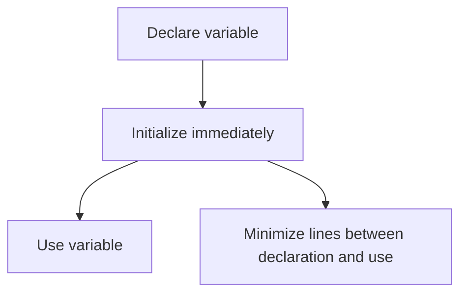
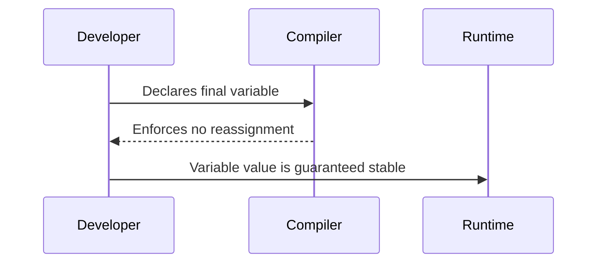
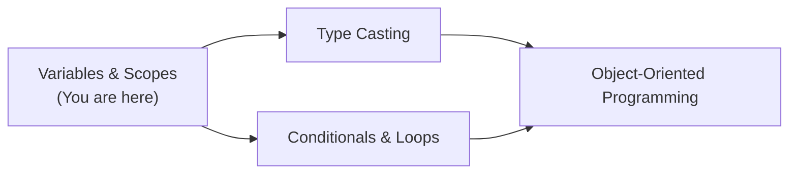
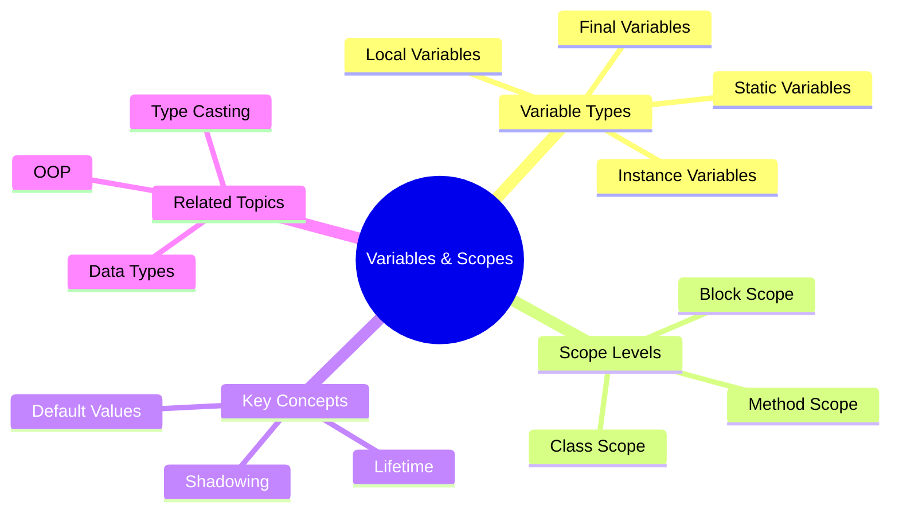
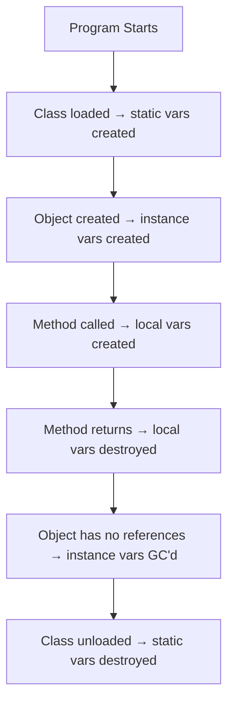

# Variables and Scopes — Junior Level

## Table of Contents

1. [Introduction](#introduction)
2. [Prerequisites](#prerequisites)
3. [Glossary](#glossary)
4. [Core Concepts](#core-concepts)
5. [Real-World Analogies](#real-world-analogies)
6. [Mental Models](#mental-models)
7. [Pros & Cons](#pros--cons)
8. [Use Cases](#use-cases)
9. [Code Examples](#code-examples)
10. [Coding Patterns](#coding-patterns)
11. [Product Use / Feature](#product-use--feature)
12. [Error Handling](#error-handling)
13. [Security Considerations](#security-considerations)
14. [Performance Tips](#performance-tips)
15. [Metrics & Analytics](#metrics--analytics)
16. [Best Practices](#best-practices)
17. [Edge Cases & Pitfalls](#edge-cases--pitfalls)
18. [Common Mistakes](#common-mistakes)
19. [Common Misconceptions](#common-misconceptions)
20. [Tricky Points](#tricky-points)
21. [Test](#test)
22. [Tricky Questions](#tricky-questions)
23. [Cheat Sheet](#cheat-sheet)
24. [Self-Assessment Checklist](#self-assessment-checklist)
25. [Summary](#summary)
26. [What You Can Build](#what-you-can-build)
27. [Further Reading](#further-reading)
28. [Related Topics](#related-topics)
29. [Diagrams & Visual Aids](#diagrams--visual-aids)

---

## Introduction

> Focus: "What is it?" and "How to use it?"

A **variable** in Java is a named container that stores data during program execution. Every variable has a **type**, a **name**, and a **value**. **Scope** defines where in your code a variable can be accessed — it is the region of the program where the variable is visible and usable.

Understanding variables and their scopes is fundamental because every Java program manipulates data through variables. If you don't know where a variable is accessible, you'll encounter compilation errors, unexpected values, and hard-to-trace bugs.

---

## Prerequisites

What you should know before studying this topic:

- **Required:** Basic Java syntax — how to write a simple `public class Main` with a `main` method
- **Required:** Data types — understanding `int`, `double`, `String`, `boolean`, etc.
- **Helpful but not required:** Object-Oriented Programming basics — classes and objects

---

## Glossary

Key terms used in this topic:

| Term | Definition |
|------|-----------|
| **Variable** | A named storage location in memory that holds a value of a specific type |
| **Declaration** | The statement that creates a variable with a type and name (e.g., `int age;`) |
| **Initialization** | Assigning a value to a variable for the first time (e.g., `age = 25;`) |
| **Scope** | The region of code where a variable is visible and can be used |
| **Local Variable** | A variable declared inside a method, constructor, or block |
| **Instance Variable** | A variable declared inside a class but outside any method — belongs to an object |
| **Class Variable (static)** | A variable declared with `static` keyword — shared among all objects of the class |
| **Final Variable** | A variable declared with `final` keyword — its value cannot be changed after initialization |
| **Block Scope** | The scope defined by curly braces `{}` — variables declared inside are only visible there |
| **Shadowing** | When a variable in an inner scope has the same name as one in an outer scope |

---

## Core Concepts

### Concept 1: Local Variables

Local variables are declared inside methods, constructors, or blocks. They exist only while that method/block is executing and are destroyed when execution leaves the scope.

- Must be initialized before use — Java does **not** assign default values to local variables.
- Cannot use access modifiers (`public`, `private`) on local variables.
- Live on the **stack** in JVM memory.

```java
public void greet() {
    String name = "Alice"; // local variable — exists only inside greet()
    System.out.println("Hello, " + name);
} // 'name' is destroyed here
```

### Concept 2: Instance Variables

Instance variables (also called **fields**) are declared inside a class but outside any method. Each object of the class gets its own copy.

- Automatically initialized to default values (`0` for numbers, `null` for objects, `false` for boolean).
- Accessible throughout the entire class.
- Live on the **heap** (as part of the object).

```java
public class Dog {
    String breed; // instance variable — default value is null
    int age;      // instance variable — default value is 0
}
```

### Concept 3: Class (Static) Variables

Static variables belong to the class itself, not to any specific object. All objects share the same copy.

- Declared with the `static` keyword.
- Initialized when the class is loaded.
- Accessed using the class name: `ClassName.variableName`.

```java
public class Counter {
    static int count = 0; // shared among all Counter objects
}
```

### Concept 4: Final Variables

A `final` variable can only be assigned once. After initialization, its value cannot be changed.

- Useful for constants.
- Convention: use `UPPER_SNAKE_CASE` for `static final` constants.

```java
final double PI = 3.14159;
static final int MAX_USERS = 100;
```

### Concept 5: Scope Rules

Java has three main scope levels:

- **Block scope:** Variables declared inside `{}` — visible only within that block.
- **Method scope:** Parameters and local variables — visible throughout the method.
- **Class scope:** Instance and static variables — visible throughout the class.

```java
public class Example {
    int classLevel = 1; // class scope

    public void method() {
        int methodLevel = 2; // method scope
        if (true) {
            int blockLevel = 3; // block scope
        }
        // blockLevel is NOT accessible here
    }
}
```

### Concept 6: Variable Shadowing

Shadowing occurs when a variable in an inner scope has the same name as one in an outer scope. The inner variable "hides" the outer one.

```java
public class Shadow {
    int x = 10; // instance variable

    public void show() {
        int x = 20; // local variable shadows instance variable
        System.out.println(x);      // prints 20
        System.out.println(this.x); // prints 10 — use 'this' to access instance var
    }
}
```

---

## Real-World Analogies

| Concept | Analogy |
|---------|--------|
| **Local Variable** | A sticky note on your desk — only you can see it, and it gets thrown away when you leave your desk |
| **Instance Variable** | A name badge — each person (object) has their own badge with their own name on it |
| **Static Variable** | A whiteboard in a shared office — everyone in the class can see and use the same whiteboard |
| **Scope** | Rooms in a building — a variable created in a room (block) cannot be seen from outside that room |
| **Final Variable** | A permanent marker label — once you write it, you cannot erase and rewrite it |

---

## Mental Models

**The intuition:** Think of scope as a series of nested boxes. Each `{}` creates a new inner box. Variables created inside a box are visible only within that box and any smaller boxes inside it — but not outside.

**Why this model helps:** It prevents the common mistake of trying to use a variable after its block has ended. If you picture the box being sealed when `}` is reached, you immediately understand why the variable is gone.

**Second model:** Think of variable lifetime as a guest at a party. Local variables are guests who leave when the party (method) ends. Instance variables are residents who stay as long as the house (object) exists. Static variables are part of the building itself — they exist as long as the building (class) is loaded.

---

## Pros & Cons

| Pros | Cons |
|------|------|
| Scoping prevents name collisions — same name can be reused in different methods | Too many variables in a large scope can make code hard to read |
| Local variables are automatically cleaned up, reducing memory usage | Forgetting to initialize local variables causes compile errors |
| Final variables prevent accidental mutation | Overusing `static` variables creates global state, making testing harder |
| Instance variables give each object its own state | Instance variables increase memory per object |

### When to use:
- Use local variables for temporary calculations within a method
- Use instance variables for object-specific state
- Use `static final` for true constants

### When NOT to use:
- Avoid `static` mutable variables — they create hidden shared state
- Avoid declaring variables at class scope when they're only needed in one method

---

## Use Cases

- **Use Case 1:** Storing user input temporarily — use a local variable inside the method that processes it
- **Use Case 2:** Tracking object state — use instance variables (e.g., a `BankAccount` with a `balance` field)
- **Use Case 3:** Application-wide constants — use `static final` (e.g., `MAX_LOGIN_ATTEMPTS = 5`)
- **Use Case 4:** Loop counters — local variables with block scope inside `for` loops

---

## Code Examples

### Example 1: All Variable Types in Action

```java
public class Main {
    // Instance variable — each Main object gets its own copy
    String ownerName;

    // Static variable — shared among all Main objects
    static int instanceCount = 0;

    // Static final constant
    static final String APP_NAME = "MyApp";

    public Main(String name) {
        this.ownerName = name;
        instanceCount++; // increment shared counter
    }

    public void displayInfo() {
        // Local variable — exists only inside this method
        String message = APP_NAME + " owned by " + ownerName;
        System.out.println(message);
        System.out.println("Total instances: " + instanceCount);
    }

    public static void main(String[] args) {
        Main obj1 = new Main("Alice");
        Main obj2 = new Main("Bob");

        obj1.displayInfo();
        obj2.displayInfo();
    }
}
```

**What it does:** Demonstrates instance variables (`ownerName`), static variables (`instanceCount`), constants (`APP_NAME`), and local variables (`message`).
**How to run:** `javac Main.java && java Main`

**Output:**
```
MyApp owned by Alice
Total instances: 2
MyApp owned by Bob
Total instances: 2
```

### Example 2: Scope Demonstration

```java
public class Main {
    public static void main(String[] args) {
        // Method scope
        int x = 10;

        if (x > 5) {
            // Block scope — 'y' only exists inside this if-block
            int y = 20;
            System.out.println("x = " + x); // OK — x is visible here
            System.out.println("y = " + y); // OK — y is declared here
        }

        // System.out.println(y); // COMPILE ERROR — y is out of scope

        for (int i = 0; i < 3; i++) {
            // 'i' has block scope — only inside this for loop
            System.out.println("i = " + i);
        }

        // System.out.println(i); // COMPILE ERROR — i is out of scope
    }
}
```

**What it does:** Shows that variables declared in blocks (`if`, `for`) are not accessible outside those blocks.
**How to run:** `javac Main.java && java Main`

### Example 3: Variable Shadowing

```java
public class Main {
    int value = 100; // instance variable

    public void demonstrate() {
        int value = 200; // local variable shadows instance variable
        System.out.println("Local value: " + value);       // 200
        System.out.println("Instance value: " + this.value); // 100
    }

    public static void main(String[] args) {
        Main obj = new Main();
        obj.demonstrate();
    }
}
```

**What it does:** Shows how a local variable can shadow an instance variable, and how `this` keyword resolves the ambiguity.
**How to run:** `javac Main.java && java Main`

---

## Coding Patterns

### Pattern 1: Declare Variables Close to First Use

**Intent:** Reduce the gap between declaration and usage to improve readability.
**When to use:** Always — this is a universal best practice.

```java
// ❌ Bad — all declarations at the top
public void processOrder(Order order) {
    double total;
    double tax;
    double discount;
    String receipt;

    total = order.getSubtotal();
    // ... 20 lines later ...
    tax = total * 0.1;
    discount = calculateDiscount(order);
    receipt = generateReceipt(total, tax, discount);
}

// ✅ Good — declare where first used
public void processOrder(Order order) {
    double total = order.getSubtotal();
    double tax = total * 0.1;
    double discount = calculateDiscount(order);
    String receipt = generateReceipt(total, tax, discount);
}
```

**Diagram:**



**Remember:** Declare variables at the narrowest possible scope.

---

### Pattern 2: Using Final for Safety

**Intent:** Prevent accidental reassignment of variables that should not change.

```java
public void transferMoney(final double amount, final String toAccount) {
    // amount = amount * 1.1; // COMPILE ERROR — cannot reassign final parameter
    final double fee = amount * 0.02;
    double total = amount + fee; // total is not final — can be reassigned if needed
    System.out.println("Transferring " + total + " to " + toAccount);
}
```

**Diagram:**



---

## Clean Code

Basic clean code principles when working with Variables and Scopes in Java:

### Naming (Java conventions)

```java
// ❌ Bad
int a = 5;
String s = "hello";
double val = 99.9;

// ✅ Clean Java naming
int userAge = 5;
String greeting = "hello";
double accountBalance = 99.9;
```

**Java naming rules:**
- Variables: camelCase (`userName`, `totalPrice`)
- Constants: UPPER_SNAKE_CASE (`MAX_RETRIES`, `DEFAULT_TIMEOUT`)
- Boolean variables: `is/has/can` prefix (`isActive`, `hasPermission`)

---

## Product Use / Feature

### 1. Spring Boot Controllers

- **How it uses Variables and Scopes:** Request-scoped local variables ensure each HTTP request has isolated data. Instance variables in `@Service` beans are shared (singleton scope by default).
- **Why it matters:** Understanding scope prevents bugs where one user's data leaks to another user.

### 2. Android Applications

- **How it uses Variables and Scopes:** Activity lifecycle methods use local variables for temporary UI state; instance variables store the Activity's state.
- **Why it matters:** Mismanaging variable scope in Android leads to memory leaks and crashes.

### 3. Apache Kafka Consumers

- **How it uses Variables and Scopes:** Static configuration constants define broker addresses; instance variables track consumer group state.
- **Why it matters:** Using the right scope keeps configuration centralized and state per-consumer.

---

## Error Handling

### Error 1: "Variable might not have been initialized"

```java
public class Main {
    public static void main(String[] args) {
        int x;
        System.out.println(x); // COMPILE ERROR
    }
}
```

**Why it happens:** Local variables are not assigned default values. Java requires explicit initialization.
**How to fix:**

```java
int x = 0; // initialize before use
System.out.println(x);
```

### Error 2: "Cannot find symbol"

```java
if (true) {
    int y = 10;
}
System.out.println(y); // COMPILE ERROR — y is out of scope
```

**Why it happens:** The variable `y` was declared inside the `if` block and is not visible outside it.
**How to fix:**

```java
int y = 0; // declare in the outer scope
if (true) {
    y = 10;
}
System.out.println(y); // OK
```

---

## Security Considerations

### 1. Avoid Storing Sensitive Data in Static Variables

```java
// ❌ Insecure — password accessible globally and stays in memory
public class Config {
    static String dbPassword = "secret123";
}

// ✅ Secure — use environment variables, minimize scope
public class Config {
    public static String getDbPassword() {
        return System.getenv("DB_PASSWORD");
    }
}
```

**Risk:** Static variables persist for the entire application lifetime and can be accessed by any code in the same JVM.
**Mitigation:** Use environment variables or a secrets manager. Keep sensitive data in local variables with narrow scope.

### 2. Clear Sensitive Local Variables

```java
// ✅ Use char[] instead of String for passwords (can be cleared)
char[] password = getPassword();
try {
    authenticate(password);
} finally {
    java.util.Arrays.fill(password, '\0'); // clear from memory
}
```

---

## Performance Tips

### Tip 1: Prefer Local Variables Over Instance Variables

```java
// ❌ Slower — accessing instance variable in a loop
for (int i = 0; i < items.length; i++) {
    total += this.taxRate * items[i]; // instance variable access each iteration
}

// ✅ Faster — cache in local variable
double localTaxRate = this.taxRate; // copy to local
for (int i = 0; i < items.length; i++) {
    total += localTaxRate * items[i]; // local variable access — faster
}
```

**Why it's faster:** Local variables are stored on the stack and accessed more quickly than instance variables (which require a pointer dereference through the object on the heap).

### Tip 2: Minimize Variable Scope to Help GC

```java
// ✅ Good — large object becomes eligible for GC sooner
public void process() {
    {
        byte[] largeBuffer = new byte[10_000_000];
        doSomething(largeBuffer);
    } // largeBuffer is now eligible for GC
    doOtherStuff(); // largeBuffer memory can be reclaimed
}
```

---

## Metrics & Analytics

### What to Measure

| Metric | Why it matters | Tool |
|--------|---------------|------|
| **Local variable count per method** | Too many variables = method too complex | Checkstyle, SonarQube |
| **Static mutable variable count** | Indicates global state risk | SpotBugs, PMD |

### Basic Instrumentation

```java
import io.micrometer.core.instrument.Counter;
import io.micrometer.core.instrument.MeterRegistry;

Counter counter = Counter.builder("variable.operations.count")
    .description("Total variable operations")
    .register(registry);

counter.increment();
```

---

## Best Practices

- **Always initialize local variables at declaration:** Prevents "might not have been initialized" errors
- **Use the narrowest possible scope:** Declare variables in the innermost block where they're needed
- **Prefer `final` for variables that don't change:** Makes code safer and communicates intent
- **Follow Java naming conventions:** camelCase for variables, UPPER_SNAKE_CASE for constants
- **Avoid mutable static variables:** They create hidden global state that's hard to test and debug

---

## Edge Cases & Pitfalls

### Pitfall 1: Uninitialized Local Variables in Conditional Paths

```java
int result;
if (condition) {
    result = 42;
}
System.out.println(result); // COMPILE ERROR if condition is false
```

**What happens:** The compiler sees a path where `result` might not be initialized.
**How to fix:** Always initialize, or add an `else` branch.

```java
int result;
if (condition) {
    result = 42;
} else {
    result = 0;
}
```

### Pitfall 2: Reusing Variable Names Across Scopes

```java
for (int i = 0; i < 5; i++) {
    // first loop
}
for (int i = 0; i < 3; i++) {
    // OK — 'i' from the first loop is out of scope
}
```

**What happens:** This is actually valid Java — each `for` has its own block scope.

---

## Common Mistakes

### Mistake 1: Using a Variable Outside Its Scope

```java
// ❌ Wrong
for (int i = 0; i < 10; i++) {
    // do work
}
System.out.println(i); // COMPILE ERROR

// ✅ Correct
int i;
for (i = 0; i < 10; i++) {
    // do work
}
System.out.println(i); // OK — i was declared outside the loop
```

### Mistake 2: Forgetting to Initialize Local Variables

```java
// ❌ Wrong
String name;
System.out.println(name); // COMPILE ERROR

// ✅ Correct
String name = "default";
System.out.println(name);
```

### Mistake 3: Confusing Instance Variable Default Values with Local Variables

```java
// Instance variable — gets default value 0
class MyClass {
    int count; // default = 0 ✅
}

// Local variable — NO default value
void method() {
    int count; // no default ❌ — must initialize
}
```

---

## Common Misconceptions

### Misconception 1: "All variables get default values in Java"

**Reality:** Only instance variables and static variables get default values. Local variables do **not** and must be explicitly initialized before use.

**Why people think this:** In some languages like Python, variables don't need explicit type or initialization. Also, seeing instance variables work without initialization leads beginners to assume all variables behave the same.

### Misconception 2: "final means the object can't be changed"

**Reality:** `final` only means the **reference** cannot be reassigned. The object itself can still be mutated.

```java
final List<String> names = new ArrayList<>();
names.add("Alice"); // OK — modifying the object
// names = new ArrayList<>(); // COMPILE ERROR — reassigning the reference
```

**Why people think this:** The word "final" suggests nothing can change, but it only applies to the variable binding, not the object's internal state.

### Misconception 3: "Static variables belong to objects"

**Reality:** Static variables belong to the **class**, not to any object. All objects share the same static variable.

---

## Tricky Points

### Tricky Point 1: Variable Shadowing in Constructors

```java
public class Person {
    String name;

    public Person(String name) {
        name = name; // WRONG — assigns parameter to itself!
    }
}
```

**Why it's tricky:** Both `name` variables have the same name. The local parameter shadows the instance variable, so the instance variable never gets set.
**Key takeaway:** Always use `this.name = name;` in constructors.

### Tricky Point 2: Final with Reference Types

```java
final int[] arr = {1, 2, 3};
arr[0] = 99; // OK — modifying array contents
// arr = new int[]{4, 5, 6}; // COMPILE ERROR — reassigning reference
```

**Why it's tricky:** `final` prevents reassignment of the array reference, but the array elements can still change.

---

## Test

### Multiple Choice

**1. Which type of variable gets a default value of `null` automatically?**

- A) Local variable of type String
- B) Instance variable of type String
- C) Method parameter of type String
- D) Loop counter variable

<details>
<summary>Answer</summary>
**B)** — Instance variables get default values. For reference types, the default is `null`. Local variables and parameters do not get default values.
</details>

**2. What is the scope of variable `x` in this code?**

```java
for (int x = 0; x < 10; x++) {
    System.out.println(x);
}
```

- A) The entire class
- B) The entire method
- C) Only inside the for loop body
- D) The entire file

<details>
<summary>Answer</summary>
**C)** — Variables declared in the `for` loop header have block scope limited to the loop body.
</details>

### True or False

**3. A `final` variable in Java cannot be initialized after declaration.**

<details>
<summary>Answer</summary>
**False** — A `final` variable can be declared without initialization and assigned later, as long as it's assigned exactly once before use. This is called a "blank final".

```java
final int x;
x = 10; // OK — first and only assignment
```
</details>

### What's the Output?

**4. What does this code print?**

```java
public class Main {
    static int x = 1;

    public static void main(String[] args) {
        int x = 2;
        System.out.println(x);
    }
}
```

<details>
<summary>Answer</summary>
Output: `2`
Explanation: The local variable `x` (value 2) shadows the static variable `x` (value 1). The local one is used.
</details>

**5. What does this code print?**

```java
public class Main {
    int count = 0;

    public void increment() {
        count++;
    }

    public static void main(String[] args) {
        Main a = new Main();
        Main b = new Main();
        a.increment();
        a.increment();
        b.increment();
        System.out.println(a.count + " " + b.count);
    }
}
```

<details>
<summary>Answer</summary>
Output: `2 1`
Explanation: `count` is an instance variable — each object (`a` and `b`) has its own copy. `a.count` was incremented twice (= 2), `b.count` once (= 1).
</details>

**6. Does this code compile?**

```java
public class Main {
    public static void main(String[] args) {
        final int x;
        if (args.length > 0) {
            x = 1;
        }
        System.out.println(x);
    }
}
```

<details>
<summary>Answer</summary>
**No, it does not compile.** The compiler sees that if `args.length == 0`, `x` is never initialized. A `final` local variable must be definitely assigned before use. Adding an `else` branch that assigns `x` would fix it.
</details>

---

## Tricky Questions

**1. What does this code print?**

```java
public class Main {
    static int x = 10;
    int x = 20;
}
```

- A) Compiles fine, `x` is 10
- B) Compiles fine, `x` is 20
- C) Compilation error — duplicate field
- D) Runtime error

<details>
<summary>Answer</summary>
**C)** — You cannot have two fields with the same name `x` in the same class, even if one is `static` and the other is not. This causes a compilation error: "variable x is already defined".
</details>

**2. What happens here?**

```java
public class Main {
    public static void main(String[] args) {
        for (int i = 0; i < 3; i++) {}
        for (int i = 0; i < 3; i++) {}
        System.out.println("OK");
    }
}
```

- A) Compilation error — `i` is declared twice
- B) Runtime error
- C) Prints "OK"
- D) Infinite loop

<details>
<summary>Answer</summary>
**C)** — Each `for` loop has its own block scope. The first `i` goes out of scope before the second `i` is declared, so there is no conflict.
</details>

**3. What does this print?**

```java
public class Main {
    int value = 1;

    public void test() {
        int value = 2;
        {
            int value = 3; // Inner block
        }
    }
}
```

- A) Compiles fine
- B) Compilation error — cannot shadow local variable
- C) Prints 3
- D) Prints 2

<details>
<summary>Answer</summary>
**B)** — In Java, you **cannot** declare a local variable with the same name as another local variable in an enclosing scope within the same method. Shadowing instance variables with locals is allowed, but shadowing one local with another local is not.
</details>

---

## Cheat Sheet

| What | Syntax | Example |
|------|--------|---------|
| Declare local variable | `type name = value;` | `int age = 25;` |
| Declare instance variable | Inside class, outside method | `private String name;` |
| Declare static variable | `static type name = value;` | `static int count = 0;` |
| Declare constant | `static final TYPE NAME = value;` | `static final double PI = 3.14;` |
| Declare final local | `final type name = value;` | `final int max = 100;` |
| Access instance var in method | `this.variableName` | `this.name = "Alice";` |
| Access static var | `ClassName.variableName` | `Counter.count` |

---

## Self-Assessment Checklist

### I can explain:
- [ ] What Variables and Scopes are and why they matter
- [ ] The difference between local, instance, and static variables
- [ ] What `final` means for variables
- [ ] How block scope works in Java
- [ ] What variable shadowing is

### I can do:
- [ ] Write a class with instance variables and local variables
- [ ] Use `final` to create constants
- [ ] Avoid using variables outside their scope
- [ ] Debug "variable might not have been initialized" errors
- [ ] Use `this` to distinguish instance variables from local variables

### I can answer:
- [ ] All multiple choice questions in this document
- [ ] "What's the output?" questions correctly

---

## Summary

- **Variables** in Java have three main categories: local, instance (field), and static (class-level)
- **Scope** determines where a variable is visible — block, method, or class level
- Local variables must be **initialized before use**; instance and static variables get **default values**
- `final` prevents **reassignment** but does not make objects immutable
- Variable **shadowing** can cause subtle bugs — use `this` to disambiguate
- Always declare variables in the **narrowest possible scope**

**Next step:** Learn about Type Casting to understand how Java converts between different data types.

---

## What You Can Build

### Projects you can create:
- **Student Grade Calculator:** Uses local variables for each calculation, instance variables for student data, and a static variable to track total students
- **Simple Bank Account:** Instance variables for balance and account number, static variable for bank name, final for account creation date
- **Temperature Converter:** Local variables for conversion formulas, static final constants for conversion factors

### Technologies / tools that use this:
- **Spring Boot** — understanding scope helps with bean scopes (singleton vs prototype vs request)
- **JUnit** — instance variables in test classes reset for each test method, teaching isolation
- **IntelliJ IDEA** — highlights unused variables and scope issues in real-time

### Learning path — what to study next:



---

## Further Reading

- **Official docs:** [Java Variables Tutorial](https://docs.oracle.com/javase/tutorial/java/nutsandbolts/variables.html)
- **Book chapter:** Effective Java (Bloch), Item 57 — "Minimize the scope of local variables"
- **Blog post:** [Java Variable Scope Explained](https://www.baeldung.com/java-variable-scope) — Baeldung, comprehensive guide
- **Video:** [Java Variables and Data Types](https://www.youtube.com/results?search_query=java+variables+tutorial) — beginner-friendly walkthroughs

---

## Related Topics

- **[Data Types](../03-data-types/)** — variables must have a type; understanding types is essential for variables
- **[Type Casting](../05-type-casting/)** — converting between variable types
- **[Conditionals](../09-conditionals/)** — block scope matters in if/else/switch statements
- **[Loops](../10-loops/)** — loop variables have block scope

---

## Diagrams & Visual Aids

### Mind Map



### Variable Lifetime Diagram



### JVM Memory Layout for Variables

```
+------------------------------------------+
|            JVM Memory                     |
|------------------------------------------|
|  Method Area (Metaspace)                  |
|   - static variables live here            |
|   - class-level constants                 |
|------------------------------------------|
|  Heap                                     |
|   - Objects + their instance variables    |
|   - new MyClass() → instance vars here   |
|------------------------------------------|
|  Stack (per thread)                       |
|   - local variables live here             |
|   - method parameters live here           |
|   - each method call = new stack frame    |
+------------------------------------------+
```
