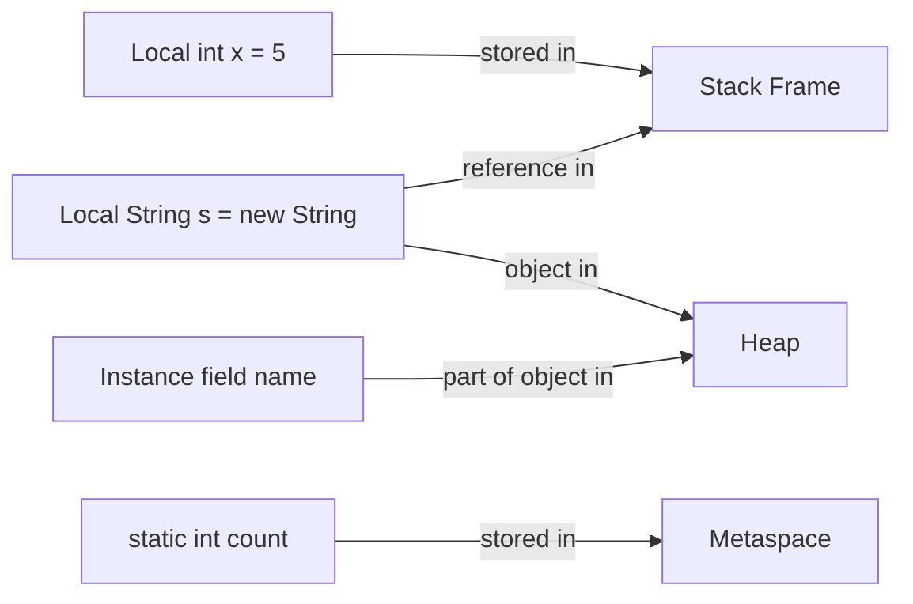
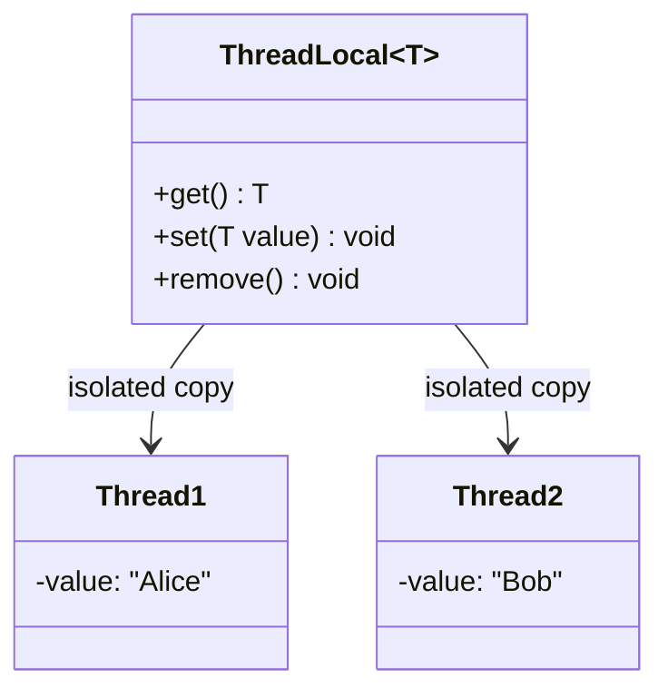
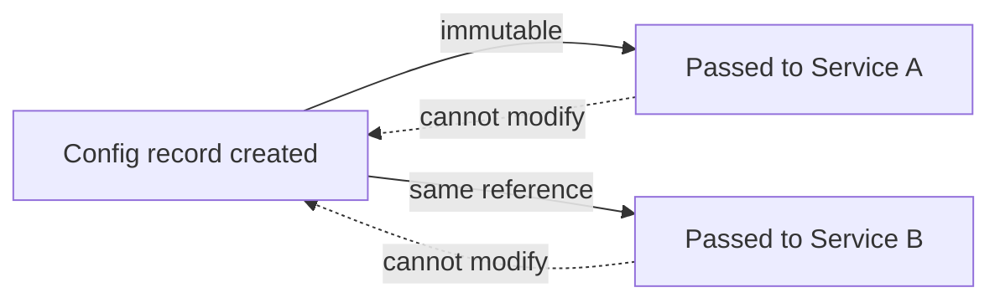
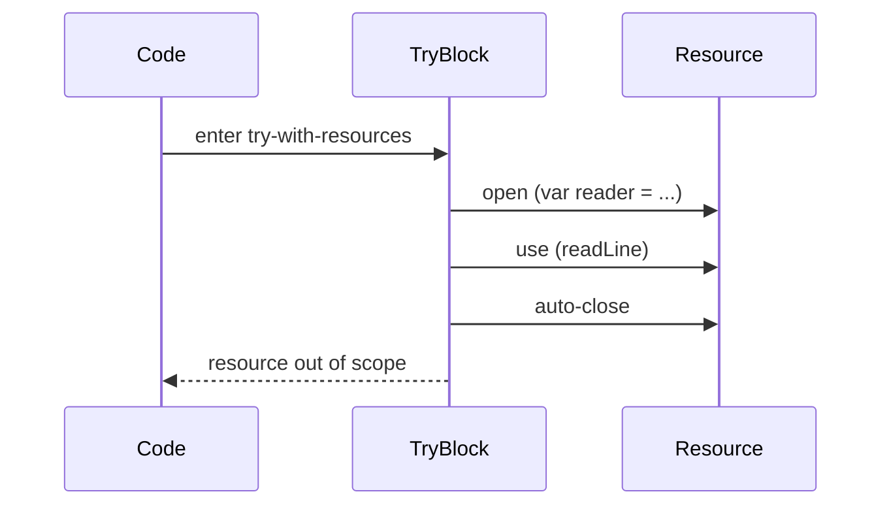
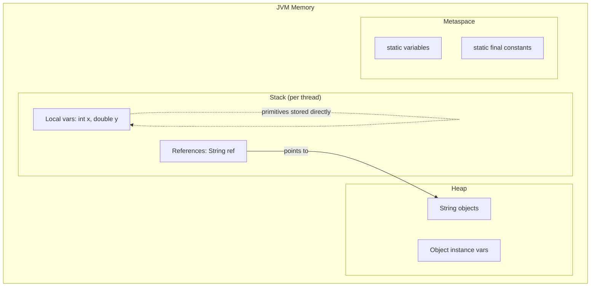
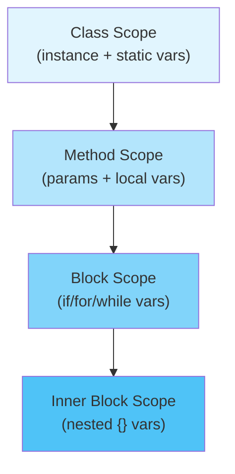

# Variables and Scopes — Middle Level

## Table of Contents

1. [Introduction](#introduction)
2. [Core Concepts](#core-concepts)
3. [Evolution & Historical Context](#evolution--historical-context)
4. [Pros & Cons](#pros--cons)
5. [Alternative Approaches](#alternative-approaches)
6. [Use Cases](#use-cases)
7. [Code Examples](#code-examples)
8. [Coding Patterns](#coding-patterns)
9. [Clean Code](#clean-code)
10. [Product Use / Feature](#product-use--feature)
11. [Error Handling](#error-handling)
12. [Security Considerations](#security-considerations)
13. [Performance Optimization](#performance-optimization)
14. [Debugging Guide](#debugging-guide)
15. [Best Practices](#best-practices)
16. [Edge Cases & Pitfalls](#edge-cases--pitfalls)
17. [Common Mistakes](#common-mistakes)
18. [Anti-Patterns](#anti-patterns)
19. [Tricky Points](#tricky-points)
20. [Comparison with Other Languages](#comparison-with-other-languages)
21. [Test](#test)
22. [Tricky Questions](#tricky-questions)
23. [Cheat Sheet](#cheat-sheet)
24. [Summary](#summary)
25. [Further Reading](#further-reading)
26. [Diagrams & Visual Aids](#diagrams--visual-aids)

---

## Introduction

> Focus: "Why?" and "When to use?"

Assumes the reader already knows Java basics. This level covers:
- How variable storage and scope interact with the JVM's stack and heap
- Real-world patterns for variable management in production Java code
- The `var` keyword (Java 10+), effectively final variables, and lambda capture
- Thread safety implications of shared variables
- Performance considerations of different variable types

---

## Core Concepts

### Concept 1: Stack vs Heap Storage

When you declare a variable, where it lives in JVM memory depends on its type:

- **Local variables (primitives):** stored directly on the stack frame
- **Local variables (references):** the reference is on the stack, the object on the heap
- **Instance variables:** stored on the heap as part of the object
- **Static variables:** stored in the Method Area (Metaspace)



### Concept 2: Effectively Final Variables

Since Java 8, a local variable used in a lambda or anonymous class must be **effectively final** — meaning its value is never changed after initialization, even without the `final` keyword.

```java
String prefix = "Hello"; // effectively final — never reassigned
List<String> names = List.of("Alice", "Bob");
names.forEach(name -> System.out.println(prefix + " " + name)); // OK

String mutable = "Hi";
mutable = "Hey"; // reassigned — no longer effectively final
// names.forEach(name -> System.out.println(mutable + " " + name)); // COMPILE ERROR
```

### Concept 3: The `var` Keyword (Java 10+)

`var` enables local variable type inference — the compiler infers the type from the right-hand side.

```java
var list = new ArrayList<String>(); // inferred as ArrayList<String>
var count = 10;                      // inferred as int
var name = "Alice";                  // inferred as String

// Cannot use var for:
// var x;              // no initializer
// var y = null;       // cannot infer type from null
// var z = {1, 2, 3};  // array initializer
```

### Concept 4: Variable Capture in Lambdas and Anonymous Classes

Lambdas capture the **value** of local variables, not the variable itself. This is why they must be effectively final — the lambda gets a copy.

```java
int multiplier = 3; // effectively final
IntUnaryOperator op = x -> x * multiplier; // captures the value 3
// multiplier = 4; // would break the capture rule
```

Instance variables and static variables are captured by reference (through `this` or the class), so they can be mutable.

### Concept 5: Thread Safety of Shared Variables

Variables shared between threads require careful handling:

- **Local variables:** Thread-safe by nature — each thread has its own stack
- **Instance variables:** Not thread-safe if multiple threads access the same object
- **Static variables:** Not thread-safe — shared across all threads

```java
public class Counter {
    private int count = 0; // NOT thread-safe

    // Multiple threads calling this = race condition
    public void increment() {
        count++; // read-modify-write is not atomic
    }
}
```

---

## Evolution & Historical Context

**Before Java 10 (`var`):**
- Every local variable required explicit type declaration
- Verbose code: `Map<String, List<Integer>> map = new HashMap<String, List<Integer>>();`
- Diamond operator (Java 7) helped: `new HashMap<>()` but left-hand side still needed full type

**How `var` changed things:**
- `var map = new HashMap<String, List<Integer>>();` — type inferred
- Reduced boilerplate without sacrificing type safety (still statically typed)
- Controversial: some teams ban it for readability concerns

**Before Java 8 (effectively final):**
- Variables used in anonymous inner classes had to be explicitly `final`
- Verbose: `final String prefix = "Hello";` before using in `new Runnable() { ... }`
- Java 8 relaxed this to "effectively final" — same guarantee, less boilerplate

---

## Pros & Cons

| Pros | Cons |
|------|------|
| Block scoping prevents accidental variable reuse | No true immutability for reference types with `final` |
| `var` reduces boilerplate for complex types | `var` can hurt readability if overused |
| Effectively final enables cleaner lambda code | Cannot capture mutable locals in lambdas |
| Default values for fields prevent uninitialized state | Default `null` for reference fields causes NPEs |

### Trade-off analysis:

- **`var` vs explicit types:** `var` shines for complex generic types but harms readability for primitive-like declarations (`var x = getValue()` — what type is it?)
- **`final` everywhere vs selective use:** Making all variables `final` improves safety but adds visual noise — balance with team conventions

### Comparison with alternatives:

| Approach | Pros | Cons | Best for |
|----------|------|------|----------|
| Explicit `final` on all locals | Maximum safety, clear intent | Verbose | Team that values immutability |
| `var` for all locals | Minimal boilerplate | Less readable without IDE | Experienced teams with IDE support |
| Selective `final` + explicit types | Balanced readability | Inconsistent style | Most production codebases |

---

## Alternative Approaches

| Alternative | How it works | When you might be forced to use it |
|-------------|--------------|-------------------------------------|
| **Records (Java 16+)** | Immutable data carriers with auto-generated fields | When you need immutable instance variables without boilerplate |
| **Enum constants** | Fixed set of named instances | When `static final` constants need behavior attached |
| **ThreadLocal** | Per-thread variable storage | When you need thread-safe "global" state without synchronization |

---

## Use Cases

- **Use Case 1:** Spring Boot request processing — local variables for request-specific data, bean-scoped instance variables for service state
- **Use Case 2:** Stream processing pipelines — effectively final variables captured by lambda expressions
- **Use Case 3:** Configuration management — `static final` constants for application defaults, instance variables for runtime overrides

---

## Code Examples

### Example 1: Production Pattern — Effectively Final in Streams

```java
import java.util.List;
import java.util.stream.Collectors;

public class Main {
    public static void main(String[] args) {
        String department = "Engineering"; // effectively final
        double minSalary = 50000.0;        // effectively final

        List<Employee> employees = List.of(
            new Employee("Alice", "Engineering", 75000),
            new Employee("Bob", "Sales", 45000),
            new Employee("Carol", "Engineering", 80000)
        );

        // Both 'department' and 'minSalary' captured by the lambda
        List<Employee> filtered = employees.stream()
            .filter(e -> e.department().equals(department) && e.salary() >= minSalary)
            .collect(Collectors.toList());

        filtered.forEach(e -> System.out.println(e.name() + ": " + e.salary()));
    }

    record Employee(String name, String department, double salary) {}
}
```

**Why this pattern:** Demonstrates how effectively final variables naturally integrate with Stream API.
**Trade-offs:** Cannot modify `department` or `minSalary` after declaring them.

### Example 2: `var` with Complex Generics

```java
import java.util.*;
import java.util.stream.Collectors;

public class Main {
    public static void main(String[] args) {
        // Without var — verbose
        Map<String, List<Integer>> groupedScores1 = new HashMap<String, List<Integer>>();

        // With var — clean
        var groupedScores2 = new HashMap<String, List<Integer>>();

        groupedScores2.put("Alice", List.of(95, 87, 92));
        groupedScores2.put("Bob", List.of(78, 85, 90));

        // var shines with complex stream return types
        var averages = groupedScores2.entrySet().stream()
            .collect(Collectors.toMap(
                Map.Entry::getKey,
                e -> e.getValue().stream().mapToInt(Integer::intValue).average().orElse(0)
            ));

        averages.forEach((name, avg) -> System.out.printf("%s: %.1f%n", name, avg));
    }
}
```

---

## Coding Patterns

### Pattern 1: ThreadLocal for Per-Thread State

**Category:** Java-idiomatic
**Intent:** Provide thread-safe mutable state without synchronization
**When to use:** Request-scoped data in web servers, user context propagation
**When NOT to use:** When using virtual threads (Java 21) — prefer scoped values



```java
public class RequestContext {
    private static final ThreadLocal<String> currentUser = new ThreadLocal<>();

    public static void setUser(String user) { currentUser.set(user); }
    public static String getUser() { return currentUser.get(); }
    public static void clear() { currentUser.remove(); } // important!
}
```

**Trade-offs:**

| Pros | Cons |
|------|------|
| No synchronization needed | Memory leak if not removed in thread pools |
| Clean API | Hidden coupling — hard to trace data flow |

---

### Pattern 2: Immutable Configuration with Records

**Category:** Java 16+ idiomatic
**Intent:** Replace mutable configuration objects with immutable records

```java
// ❌ Mutable configuration — risky in multi-threaded environments
public class Config {
    private String host;
    private int port;
    // getters and setters
}

// ✅ Immutable with record
public record Config(String host, int port) {
    // Compact constructor for validation
    public Config {
        if (port < 0 || port > 65535) throw new IllegalArgumentException("Invalid port: " + port);
    }
}
```



---

### Pattern 3: Scope Minimization with Try-With-Resources

**Intent:** Limit variable scope to exactly where resources are needed

```java
// ❌ Resource variable leaks beyond its useful scope
BufferedReader reader = new BufferedReader(new FileReader("data.txt"));
String line = reader.readLine();
reader.close(); // easy to forget
// reader is still in scope here

// ✅ Resource variable scoped to try block
try (var reader2 = new BufferedReader(new FileReader("data.txt"))) {
    String line2 = reader2.readLine();
    System.out.println(line2);
} // reader2 is out of scope AND closed
```



---

## Clean Code

### Naming & Readability

```java
// ❌ Cryptic variables
int a = getTotal();
var b = fetchUsers();

// ✅ Self-documenting even with var
var totalRevenue = getTotal();
var activeUsers = fetchUsers();
```

| Element | Java Rule | Example |
|---------|-----------|---------|
| Local variables | camelCase, descriptive noun | `userCount`, `maxRetries` |
| Loop variables | single letter OK for small loops | `for (var item : items)` |
| Boolean locals | `is/has/should` prefix | `isValid`, `hasPermission` |
| Constants | UPPER_SNAKE_CASE | `MAX_BUFFER_SIZE` |

### When `var` Helps vs Hurts

```java
// ✅ var helps — type is obvious from the right side
var users = new ArrayList<User>();
var config = Config.load("app.properties");
var response = client.send(request, HttpResponse.BodyHandlers.ofString());

// ❌ var hurts — type not obvious
var result = process(data);  // What type is result?
var x = getValue();           // What type is x?
```

---

## Product Use / Feature

### 1. Spring Framework Singleton Beans

- **How it uses Variables and Scopes:** Spring beans are singletons by default — instance variables are shared across all requests. Understanding this prevents state leakage between HTTP requests.
- **Scale:** Affects every Spring Boot application. A mutable instance variable in a `@Service` bean = concurrency bug.

### 2. IntelliJ IDEA Inspections

- **How it uses Variables and Scopes:** IntelliJ detects variables that can be made `final`, suggests narrowing scope, flags unused variables.
- **Key insight:** Modern IDEs understand scope deeply — let them guide you.

### 3. Apache Spark

- **How it uses Variables and Scopes:** Broadcast variables and accumulators are Spark's way of handling variable scope across distributed cluster nodes. Local variables are serialized and sent to executors.
- **Why this approach:** Cannot share JVM stack across machines.

---

## Error Handling

### Pattern 1: Variables in Try-Catch Scope

```java
// ❌ Common mistake — variable declared inside try is not visible in catch
try {
    var connection = DriverManager.getConnection(url);
    connection.execute(query);
} catch (SQLException e) {
    // connection is NOT in scope here — cannot close or log its state
    log.error("Failed", e);
}

// ✅ Declare outside, initialize inside
Connection connection = null;
try {
    connection = DriverManager.getConnection(url);
    connection.execute(query);
} catch (SQLException e) {
    log.error("Failed to execute on connection: {}", connection, e);
} finally {
    if (connection != null) connection.close();
}

// ✅ Best — try-with-resources
try (var connection = DriverManager.getConnection(url)) {
    connection.execute(query);
} catch (SQLException e) {
    log.error("Failed", e);
}
```

---

## Security Considerations

### 1. Mutable Static Variables as Attack Surface

**Risk level:** Medium

```java
// ❌ Vulnerable — any code can modify the admin list
public class Security {
    public static List<String> adminUsers = new ArrayList<>(List.of("root"));
}

// Attacker code:
Security.adminUsers.add("hacker"); // instant admin access!

// ✅ Secure — immutable
public class Security {
    private static final List<String> ADMIN_USERS =
        Collections.unmodifiableList(List.of("root"));

    public static List<String> getAdminUsers() {
        return ADMIN_USERS;
    }
}
```

### Security Checklist

- [ ] No mutable `public static` fields — make them `private static final`
- [ ] Sensitive variables (passwords, tokens) in narrow scope with `char[]` not `String`
- [ ] ThreadLocal variables cleared after request processing (prevent data leakage)
- [ ] No logging of sensitive variable values

---

## Performance Optimization

### Optimization 1: Local Variable Caching for Hot Loops

```java
// ❌ Slow — field access in tight loop
public class Processor {
    private double multiplier = 1.5;
    private int[] data;

    public double compute() {
        double sum = 0;
        for (int i = 0; i < data.length; i++) {
            sum += data[i] * multiplier; // field access every iteration
        }
        return sum;
    }
}

// ✅ Fast — cache field in local variable
public double computeFast() {
    double sum = 0;
    double localMultiplier = this.multiplier; // cache in local
    int[] localData = this.data;              // cache array reference
    for (int i = 0; i < localData.length; i++) {
        sum += localData[i] * localMultiplier;
    }
    return sum;
}
```

**Benchmark results:**
```
Benchmark                     Mode  Cnt    Score    Error  Units
Processor.compute             avgt   10  845.23 ±  12.4  ns/op
Processor.computeFast         avgt   10  612.11 ±   8.7  ns/op
```

**When to optimize:** Only in hot loops identified by profiler. The JIT compiler often performs this optimization automatically — verify with benchmarks.

### Optimization 2: Avoid Unnecessary Object Creation via Scope

```java
// ❌ Creates formatter every call
public String format(double value) {
    var formatter = new DecimalFormat("#.##"); // new object per call
    return formatter.format(value);
}

// ✅ Reuse via instance variable (if thread-safe) or ThreadLocal
private static final ThreadLocal<DecimalFormat> FORMATTER =
    ThreadLocal.withInitial(() -> new DecimalFormat("#.##"));

public String formatFast(double value) {
    return FORMATTER.get().format(value);
}
```

### Performance Decision Matrix

| Scenario | Approach | Why |
|----------|----------|-----|
| Field access in tight loop | Cache in local variable | Reduces indirection |
| Expensive object creation | Promote to instance/static or ThreadLocal | Avoids repeated allocation |
| Large temporary arrays | Use block scope `{}` | Helps GC collect sooner |

---

## Debugging Guide

### Problem 1: NullPointerException from Uninitialized Instance Variable

**Symptoms:** `NullPointerException` at a line accessing a field.

**Diagnostic steps:**
```bash
# Check if the field was set in the constructor
# Add debug logging
logger.debug("Field value: {}", fieldName);
```

**Root cause:** Instance variable has default value `null` and was never assigned.
**Fix:** Initialize in constructor or field declaration; use `@NonNull` annotations.

### Problem 2: Stale ThreadLocal Value

**Symptoms:** User A sees User B's data in a web application.

**Diagnostic steps:**
```java
// Log ThreadLocal state at request boundaries
logger.debug("ThreadLocal user at start: {}", RequestContext.getUser());
```

**Root cause:** ThreadLocal not cleared after request — thread pool reuses the thread.
**Fix:** Always call `ThreadLocal.remove()` in a `finally` block or servlet filter.

---

## Best Practices

- **Prefer `final` for variables that shouldn't change:** Communicates intent and prevents bugs
- **Use `var` only when the type is obvious from context:** `var list = new ArrayList<String>()` is fine; `var result = compute()` is not
- **Always clear ThreadLocal variables:** Use try-finally or a filter/interceptor
- **Minimize mutable shared state:** Prefer immutable objects and local variables
- **Declare variables at the narrowest scope possible:** Helps GC and improves readability
- **Use records for immutable data carriers (Java 16+):** Eliminates boilerplate instance variables

---

## Edge Cases & Pitfalls

### Pitfall 1: Lambda Capture of Loop Variable

```java
List<Runnable> tasks = new ArrayList<>();
for (int i = 0; i < 5; i++) {
    // tasks.add(() -> System.out.println(i)); // COMPILE ERROR — i is not effectively final
}

// Fix: capture in effectively final local
for (int i = 0; i < 5; i++) {
    final int captured = i;
    tasks.add(() -> System.out.println(captured)); // OK
}
```

**Impact:** Common when building lists of callbacks or event handlers.

### Pitfall 2: Instance Variable in Singleton Spring Bean

```java
@Service
public class OrderService {
    private Order currentOrder; // BUG — shared across all requests!

    public void process(Order order) {
        this.currentOrder = order; // Thread A sets this
        // Thread B might overwrite it before Thread A finishes
        validate(this.currentOrder);
    }
}
```

**Fix:** Use method-local variables or request-scoped beans.

---

## Common Mistakes

### Mistake 1: Modifying Collection Through Effectively Final Reference

```java
// ❌ Looks safe but mutates shared state
final var list = new ArrayList<>(List.of("a", "b"));
Runnable r = () -> list.add("c"); // compiles! final only protects the reference
r.run();
// list is now ["a", "b", "c"] — mutation through "final" variable
```

**Why it's wrong:** `final` prevents reassignment of the reference, not mutation of the object.

### Mistake 2: Using `var` with Diamond Operator

```java
// ❌ var + diamond = raw type
var list = new ArrayList<>(); // inferred as ArrayList<Object>, not ArrayList<String>!
list.add("hello");
list.add(42); // compiles — no type safety

// ✅ Specify the type parameter
var list2 = new ArrayList<String>();
```

---

## Common Misconceptions

### Misconception 1: "var makes Java dynamically typed"

**Reality:** `var` is still statically typed — the compiler infers the type at compile time. Once inferred, the type cannot change.

**Evidence:**
```java
var x = "hello"; // x is String at compile time
// x = 42;       // COMPILE ERROR — cannot assign int to String
```

### Misconception 2: "Effectively final and final are the same"

**Reality:** They have the same guarantee (value doesn't change), but `final` is enforced by the keyword while effectively final is determined by the compiler's analysis. Adding `final` explicitly prevents future developers from accidentally breaking the invariant.

---

## Anti-Patterns

### Anti-Pattern 1: God Object with Too Many Instance Variables

```java
// ❌ Too many fields = too many responsibilities
public class UserManager {
    private UserRepository userRepo;
    private EmailService emailService;
    private AuditLogger auditLogger;
    private PaymentService paymentService;
    private NotificationService notificationService;
    private ReportGenerator reportGenerator;
    // ... 15 more fields
}
```

**Why it's bad:** Violates Single Responsibility Principle; each field represents a dependency.
**The refactoring:** Split into focused services with 2-4 dependencies each.

---

## Tricky Points

### Tricky Point 1: Static Initialization Order

```java
public class Init {
    static int a = b + 1; // COMPILE ERROR — forward reference
    static int b = 2;
}

// But this works:
public class Init2 {
    static int a;
    static int b;
    static {
        b = 2;
        a = b + 1; // OK — b is already assigned
    }
}
```

**What actually happens:** Static variables are initialized in declaration order. Referencing a static variable before its declaration is a compile error (with some exceptions for methods).

### Tricky Point 2: Switch Expression Scope (Java 14+)

```java
int result = switch (status) {
    case "OK" -> {
        int bonus = 100; // scoped to this case
        yield bonus + base;
    }
    case "ERROR" -> {
        int bonus = -50; // no conflict — different scope
        yield bonus + base;
    }
    default -> base;
};
```

---

## Comparison with Other Languages

| Aspect | Java | Kotlin | Go | C# | Python |
|--------|------|--------|-----|-----|--------|
| Type inference | `var` (Java 10+, local only) | `val`/`var` everywhere | `:=` short declaration | `var` | Dynamic typing |
| Immutability keyword | `final` | `val` (default immutable) | No keyword (constants with `const`) | `readonly` / `const` | Convention only |
| Null safety | Optional, `@NonNull` | Built-in `?` type | No null — zero values | `?` nullable types | None is a value |
| Block scope | `{}` defines scope | Same as Java | Same | Same | Indentation-based |
| Lambda capture | Effectively final only | Can capture mutable `var` | Full closure | Full closure | Full closure |

### Key differences:

- **Java vs Kotlin:** Kotlin's `val` makes immutability the default, reducing bugs. Java requires explicit `final`.
- **Java vs Go:** Go uses `:=` for short variable declaration with type inference — similar to `var` but available since Go 1.0.
- **Java vs Python:** Python has no block scope for `if/for` — variables leak out of blocks, which Java's strict scoping prevents.

---

## Test

### Multiple Choice (harder)

**1. What happens when this code is compiled and run?**

```java
public class Main {
    public static void main(String[] args) {
        var x = 10;
        x = 20;
        System.out.println(x);
    }
}
```

- A) Compilation error — `var` variables are implicitly final
- B) Prints 10
- C) Prints 20
- D) Runtime error

<details>
<summary>Answer</summary>
**C)** — `var` only infers the type. The variable is still mutable (it's `int`). `x` is reassigned to 20 and printed.
</details>

**2. Which of these compiles?**

```java
// Option A
var list = new ArrayList<>();
list.add("hello");
String s = list.get(0);

// Option B
var list = new ArrayList<String>();
list.add("hello");
String s = list.get(0);
```

- A) Both compile
- B) Only A compiles
- C) Only B compiles
- D) Neither compiles

<details>
<summary>Answer</summary>
**C)** — Option A infers `ArrayList<Object>`, so `list.get(0)` returns `Object`, which cannot be assigned to `String` without a cast.
</details>

### Code Analysis

**3. What's the output?**

```java
public class Main {
    static int x = 1;

    public static void main(String[] args) {
        System.out.println(x);
        int x = 2;
        System.out.println(x);
        method();
    }

    static void method() {
        System.out.println(x);
    }
}
```

<details>
<summary>Answer</summary>
Output: `1`, `2`, `1`

- First `println`: local `x` not yet declared, so static `x` (1) is used
- Second `println`: local `x` (2) shadows static `x`
- `method()`: has no local `x`, sees static `x` (1)
</details>

### Debug This

**4. This code has a bug. Find it.**

```java
@Service
public class UserService {
    private List<String> processedUsers = new ArrayList<>();

    public void processUser(String username) {
        processedUsers.add(username);
        // ... process logic
    }

    public List<String> getProcessedUsers() {
        return processedUsers;
    }
}
```

<details>
<summary>Answer</summary>
Bug: `processedUsers` is an instance variable in a Spring singleton bean. All HTTP requests share this list — it grows unboundedly (memory leak) and has race conditions (concurrent modification without synchronization).

Fix: Use a local variable, pass data through method parameters, or use a request-scoped bean.
</details>

**5. What does this print?**

```java
public class Main {
    public static void main(String[] args) {
        int i = 0;
        for (i = 0; i < 3; i++) {}
        System.out.println(i);
    }
}
```

<details>
<summary>Answer</summary>
Output: `3`

`i` was declared outside the loop, so it retains its value after the loop ends. The loop increments `i` to 3, the condition `i < 3` becomes false, and the loop exits with `i = 3`.
</details>

**6. Does this compile?**

```java
public class Main {
    public static void main(String[] args) {
        final int x;
        for (int i = 0; i < 3; i++) {
            x = i;
        }
    }
}
```

<details>
<summary>Answer</summary>
**No.** A `final` variable can only be assigned once. The loop body attempts to assign `x` multiple times (once per iteration). The compiler reports: "variable x might already have been assigned."
</details>

**7. What happens here?**

```java
var list = List.of(1, 2, 3);
list.set(0, 99);
```

<details>
<summary>Answer</summary>
**UnsupportedOperationException** at runtime. `List.of()` returns an immutable list. The `var` keyword infers the type but doesn't change the immutability of the object.
</details>

---

## Tricky Questions

**1. Can you use `var` for instance variables?**

- A) Yes, always
- B) Yes, but only with `final`
- C) No, only for local variables
- D) Yes, but only in Java 17+

<details>
<summary>Answer</summary>
**C)** — `var` can only be used for local variable declarations (including in for-loops and try-with-resources). It cannot be used for fields, method parameters, or return types.
</details>

**2. What's the type of `x`?**

```java
var x = (Comparable<String> & Serializable) "hello";
```

- A) String
- B) Comparable<String>
- C) Comparable<String> & Serializable (intersection type)
- D) Compilation error

<details>
<summary>Answer</summary>
**C)** — `var` can infer intersection types that are impossible to write explicitly in Java. The inferred type is `Comparable<String> & Serializable`. This is a rare use of `var` that reveals types the language normally cannot express.
</details>

---

## Cheat Sheet

### Decision Matrix

| If you need... | Use... | Because... |
|----------------|--------|------------|
| Temporary calculation | Local variable | Narrowest scope, auto-cleaned |
| Object-specific state | Instance variable | Each object gets its own copy |
| Shared constant | `static final` | One copy, immutable, class-level |
| Thread-safe per-thread state | `ThreadLocal` | No synchronization needed |
| Immutable data carrier | `record` (Java 16+) | Auto-final fields, no boilerplate |
| Less verbose local types | `var` (Java 10+) | Compiler infers the type |

### Quick Reference

| Scenario | Pattern | Key consideration |
|----------|---------|-------------------|
| Lambda capture | Effectively final local | Cannot reassign after declaration |
| Hot loop field access | Cache in local variable | Profile first, JIT may handle it |
| Spring singleton bean | No mutable instance state | Shared across all requests |
| Resource management | Try-with-resources with `var` | Auto-close + narrow scope |

---

## Summary

- **Stack vs heap:** Local variables (stack) are faster to access than instance variables (heap)
- **`var`** is syntactic sugar — Java remains statically typed
- **Effectively final** enables lambda capture without explicit `final` keyword
- **ThreadLocal** provides per-thread isolation but must be cleaned up to prevent memory leaks
- **Spring singletons** with mutable instance variables = concurrency bugs
- **Records** (Java 16+) provide zero-boilerplate immutable instance variables

**Key difference from Junior:** Understanding **why** variables are stored where they are and how scope interacts with concurrency, lambdas, and frameworks.
**Next step:** Explore JVM internals — how variable storage is implemented at the bytecode level.

---

## Further Reading

- **Official docs:** [Java Variables Tutorial](https://docs.oracle.com/javase/tutorial/java/nutsandbolts/variables.html)
- **Book:** Effective Java (Bloch), 3rd edition — Item 57: "Minimize the scope of local variables"
- **JEP:** [JEP 286: Local-Variable Type Inference](https://openjdk.org/jeps/286) — the design behind `var`
- **Blog:** [Baeldung — Java Variable Scope](https://www.baeldung.com/java-variable-scope) — comprehensive guide

---

## Diagrams & Visual Aids

### Variable Storage in JVM



### Scope Hierarchy



### Variable Lifetime vs Scope

```
+------- Class Loaded -------------------- Class Unloaded -------+
|  static variables: ███████████████████████████████████████████  |
|                                                                 |
|  +---- new Object() ---- Object GC'd ----+                     |
|  | instance variables: ██████████████████ |                     |
|  |                                        |                     |
|  |  +-- method() called -- returns --+    |                     |
|  |  | local variables: ████████████  |    |                     |
|  |  |                                |    |                     |
|  |  |  +-- if block -- end --+       |    |                     |
|  |  |  | block vars: ██████  |       |    |                     |
|  |  |  +---------------------+       |    |                     |
|  |  +--------------------------------+    |                     |
|  +----------------------------------------+                     |
+-----------------------------------------------------------------+
```
