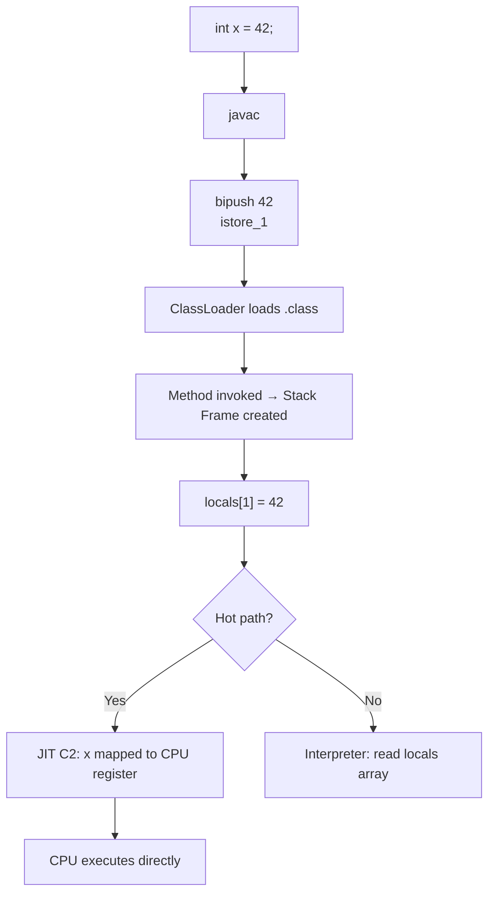
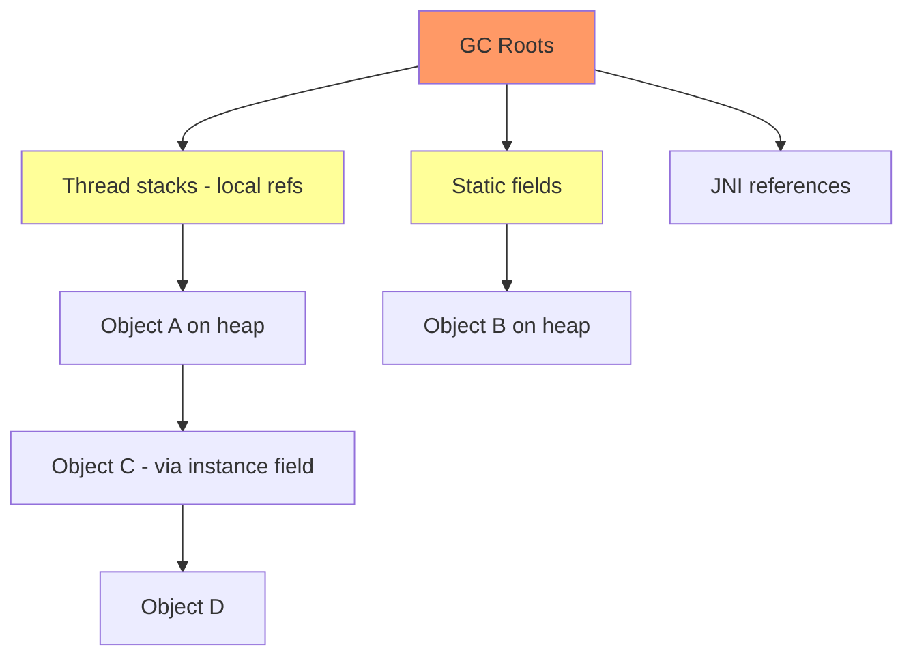
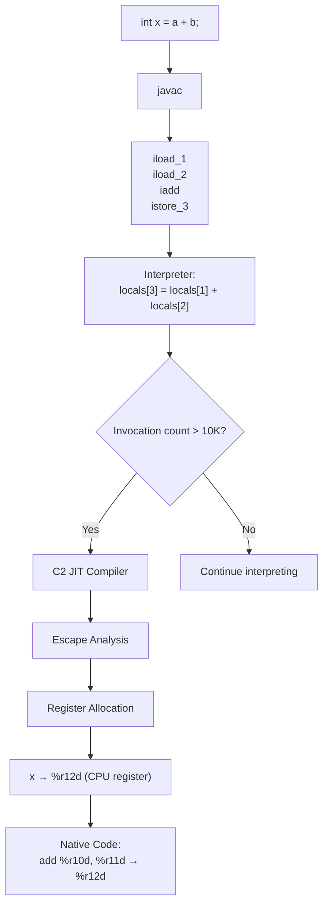
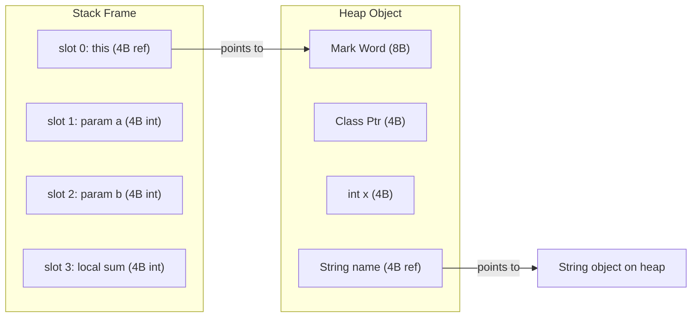

# Variables and Scopes — Under the Hood

## Table of Contents

1. [Introduction](#introduction)
2. [How It Works Internally](#how-it-works-internally)
3. [JVM Deep Dive](#jvm-deep-dive)
4. [Bytecode Analysis](#bytecode-analysis)
5. [JIT Compilation](#jit-compilation)
6. [Memory Layout](#memory-layout)
7. [GC Internals](#gc-internals)
8. [Source Code Walkthrough](#source-code-walkthrough)
9. [Performance Internals](#performance-internals)
10. [Edge Cases at the Lowest Level](#edge-cases-at-the-lowest-level)
11. [Test](#test)
12. [Tricky Questions](#tricky-questions)
13. [Summary](#summary)
14. [Further Reading](#further-reading)
15. [Diagrams & Visual Aids](#diagrams--visual-aids)

---

## Introduction

> Focus: "What happens under the hood?"

This document explores what the JVM does internally when you declare, access, and scope variables. For developers who want to understand:
- How local variables are stored in stack frames and accessed via bytecode
- How instance/static variables are stored in object headers and the Method Area
- How the JIT compiler optimizes variable access (escape analysis, scalar replacement, register allocation)
- How the GC interacts with variable references
- How the Java Memory Model (JMM) governs visibility of shared variables

---

## How It Works Internally

Step-by-step breakdown of what happens when the JVM processes a variable:

1. **Source code** → `int x = 42;` written in `.java` file
2. **Bytecode** → `javac` compiles to `bipush 42; istore_1` in `.class` file
3. **Class Loading** → ClassLoader loads the `.class`, stores class metadata in Metaspace
4. **Stack Frame** → Method invocation creates a stack frame with a local variable array
5. **Interpretation** → JVM interpreter executes bytecode instructions sequentially
6. **JIT Compilation** → C1/C2 compiler optimizes hot paths — may eliminate variables entirely
7. **Register Allocation** → JIT maps local variables to CPU registers
8. **GC** → Only reference-type variables on heap are tracked; primitive locals are not GC'd



---

## JVM Deep Dive

### Stack Frame Structure

When a method is called, the JVM creates a **stack frame** containing:

```
Stack Frame Layout:
┌──────────────────────────────────┐
│  Local Variable Array            │
│  [0] = this (for instance methods)
│  [1] = first parameter           │
│  [2] = second parameter          │
│  [3] = first local variable      │
│  ...                             │
├──────────────────────────────────┤
│  Operand Stack                   │
│  (used for computation)          │
├──────────────────────────────────┤
│  Frame Data                      │
│  - Return address                │
│  - Reference to constant pool    │
│  - Exception handler table       │
└──────────────────────────────────┘
```

**Key JVM specifications:**
- Local variable slots are 32 bits each
- `long` and `double` occupy 2 consecutive slots
- The `this` reference occupies slot 0 for instance methods
- Local variable array size is determined at compile time (`max_locals` in bytecode)

### Instance Variable Storage

Instance variables live as part of the object on the heap:

```
Object Layout (64-bit JVM, compressed oops):
┌─────────────────────────────┐
│ Mark Word (8 bytes)         │  ← hash, GC age, lock status
│ Class Pointer (4 bytes)     │  ← compressed oop to Klass
├─────────────────────────────┤
│ int field1     (4 bytes)    │
│ int field2     (4 bytes)    │
│ long field3    (8 bytes)    │
│ Object ref     (4 bytes)    │  ← compressed oop
│ padding        (4 bytes)    │  ← alignment to 8 bytes
└─────────────────────────────┘
```

### Static Variable Storage

Static variables are stored in the `Klass` structure in Metaspace (since Java 8; previously in PermGen). The actual values for static fields of reference types point to objects on the heap.

```
Metaspace (Klass structure):
┌─────────────────────────────────┐
│ Class metadata                   │
│ Method bytecodes                 │
│ Constant pool                    │
│ Static fields:                   │
│   static int count = 0          │  ← value stored directly
│   static String name = ...      │  ← reference to heap object
└─────────────────────────────────┘
```

---

## Bytecode Analysis

### Local Variable Declaration and Access

```java
public class VarDemo {
    public int compute(int a, int b) {
        int sum = a + b;
        int product = a * b;
        return sum + product;
    }
}
```

```bash
javac VarDemo.java
javap -c -verbose VarDemo.class
```

```
public int compute(int, int);
  Code:
    stack=2, locals=5, flags=ACC_PUBLIC
     0: iload_1          // push parameter 'a' (slot 1) onto stack
     1: iload_2          // push parameter 'b' (slot 2) onto stack
     2: iadd             // pop both, push a+b
     3: istore_3         // store result in local var 'sum' (slot 3)
     4: iload_1          // push 'a' again
     5: iload_2          // push 'b' again
     6: imul             // pop both, push a*b
     7: istore 4         // store result in local var 'product' (slot 4)
     9: iload_3          // push 'sum'
    10: iload 4          // push 'product'
    12: iadd             // push sum+product
    13: ireturn          // return int from stack
  LocalVariableTable:
    Start  Length  Slot  Name   Signature
        0      14     0  this   LVarDemo;
        0      14     1     a   I
        0      14     2     b   I
        4      10     3   sum   I
        9       5     4  product I
```

**Key observations:**
- `locals=5` — 5 slots: `this`, `a`, `b`, `sum`, `product`
- `stack=2` — max operand stack depth is 2 (two operands for `iadd`/`imul`)
- `iload_1` uses the compact 1-byte form for slots 0-3; `iload 4` uses the 2-byte form
- The `LocalVariableTable` attribute maps slot numbers to variable names (used by debuggers)

### Instance Variable Access (getfield/putfield)

```java
public class FieldDemo {
    int x;
    public void setX(int val) {
        this.x = val;
    }
    public int getX() {
        return this.x;
    }
}
```

```
public void setX(int);
  Code:
     0: aload_0          // push 'this' (slot 0)
     1: iload_1          // push 'val' (slot 1)
     2: putfield #2      // Field x:I — set this.x = val
     5: return

public int getX();
  Code:
     0: aload_0          // push 'this'
     1: getfield #2      // Field x:I — push this.x onto stack
     4: ireturn
```

**Key observation:** `getfield` and `putfield` require dereferencing the object pointer (`aload_0`) — slower than `iload` for local variables.

### Static Variable Access (getstatic/putstatic)

```
getstatic #3     // Field count:I — load static field
putstatic #3     // Field count:I — store static field
```

Static field access does NOT require loading `this` — the field is resolved through the class, not an instance.

---

## JIT Compilation

### Escape Analysis and Scalar Replacement

When the C2 JIT compiler determines that an object does not escape a method, it can perform **scalar replacement** — decomposing the object into its individual fields, stored as local variables:

```java
public int distance(int x1, int y1, int x2, int y2) {
    var p1 = new Point(x1, y1); // does not escape
    var p2 = new Point(x2, y2); // does not escape
    int dx = p2.x - p1.x;
    int dy = p2.y - p1.y;
    return dx * dx + dy * dy;
}
```

After scalar replacement, the JIT compiler effectively transforms this to:

```java
// Compiler's internal representation (pseudo-code)
public int distance(int x1, int y1, int x2, int y2) {
    // No Point objects allocated at all!
    int p1_x = x1, p1_y = y1;
    int p2_x = x2, p2_y = y2;
    int dx = p2_x - p1_x;
    int dy = p2_y - p1_y;
    return dx * dx + dy * dy;
}
```

```bash
# Print escape analysis decisions
java -XX:+UnlockDiagnosticVMOptions -XX:+PrintEscapeAnalysis -XX:+PrintEliminateAllocations -jar app.jar
```

### Register Allocation

After JIT compilation, the C2 compiler maps local variables to CPU registers:

```
Before JIT (interpreter): locals[3] → memory access (stack frame)
After JIT (C2):          locals[3] → mapped to register %r12d
```

This is why local variable access after JIT is essentially free — it's a CPU register read.

```bash
# View generated assembly (requires hsdis)
java -XX:+UnlockDiagnosticVMOptions -XX:+PrintAssembly \
     -XX:CompileCommand=print,*VarDemo.compute -jar app.jar
```

---

## Memory Layout

### Object Layout with JOL

Using Java Object Layout (JOL) to inspect actual memory:

```java
import org.openjdk.jol.info.ClassLayout;

public class Main {
    int a;
    long b;
    boolean c;
    String d;

    public static void main(String[] args) {
        System.out.println(ClassLayout.parseClass(Main.class).toPrintable());
    }
}
```

Output (64-bit JVM with compressed oops):
```
 OFFSET  SIZE      TYPE DESCRIPTION
      0     4           (object header - mark word lower)
      4     4           (object header - mark word upper)
      8     4           (object header - class pointer)
     12     4       int Main.a
     16     8      long Main.b
     24     1   boolean Main.c
     25     3           (alignment gap)
     28     4    String Main.d (compressed oop)
Instance size: 32 bytes
Space losses: 3 bytes internal + 0 bytes external = 3 bytes total
```

**Key observations:**
- The JVM reorders fields to minimize padding (field packing)
- `long` fields are 8-byte aligned
- Object header is 12 bytes with compressed oops (mark word 8 bytes + class pointer 4 bytes)
- Reference fields are 4 bytes with compressed oops (default for heaps < 32GB)

### Local Variable Memory — Stack Frame

```
Thread Stack (per thread, -Xss configurable):
┌────────────────────────────────┐ ← Stack top (grows downward)
│  Frame: main()                 │
│  locals: [this, args]          │
│  operand stack: []             │
├────────────────────────────────┤
│  Frame: compute(3, 4)          │
│  locals: [this, 3, 4, sum, product] │
│  operand stack: [7]            │
├────────────────────────────────┤
│  ... more frames ...           │
└────────────────────────────────┘ ← Stack bottom
```

Each slot in the local variable array is exactly **4 bytes** (32 bits). A `long` or `double` takes 2 consecutive slots.

---

## GC Internals

### How GC Interacts with Variables

**Local variables (primitives):** Not tracked by GC. They live on the stack and disappear when the frame is popped.

**Local variables (references):** The reference is on the stack, but the object is on the heap. GC must trace these stack references as **GC roots** during marking.

**Instance variables (references):** Part of the object graph. If the parent object is reachable, its reference fields are followed by the GC during tracing.

**Static variables (references):** Always considered GC roots — objects referenced by static fields are never collected unless the class itself is unloaded.



### Safepoints and Variable Liveness

At GC **safepoints**, the JVM determines which local variable slots are live (contain valid references). The JIT compiler generates **OopMaps** that tell the GC which slots contain object references at each safepoint:

```
OopMap at PC offset 24:
  Stack slot [3] = Oop (reference to String)
  Stack slot [5] = Oop (reference to List)
  Stack slot [1] = narrowOop (compressed reference)
```

**Important:** After a local reference goes out of scope (or is overwritten), the JIT may mark it as dead in the OopMap, allowing the referenced object to be collected even before the method returns.

---

## Source Code Walkthrough

### OpenJDK Frame Structure

**File:** `src/hotspot/share/runtime/frame.hpp` (JDK 21)

```cpp
// Simplified — actual code has more fields
class frame {
  intptr_t* _sp;      // stack pointer
  address   _pc;      // program counter
  // Local variable access:
  intptr_t* locals() const {
    return _sp + _locals_offset; // locals stored relative to stack pointer
  }
  // Access local variable at index:
  intptr_t local(int index) const {
    return locals()[index];
  }
};
```

### Variable Slot Assignment in javac

**File:** `src/jdk.compiler/share/classes/com/sun/tools/javac/jvm/Code.java`

The `javac` compiler assigns local variable slots sequentially:
- Slot 0: `this` (for instance methods)
- Slots 1..N: method parameters
- Slots N+1..: local variables in order of declaration
- When a variable goes out of scope, its slot can be **reused** by a later variable

```java
// Example of slot reuse:
public void demo() {
    {
        int x = 1;    // slot 1
    } // x out of scope — slot 1 available
    {
        int y = 2;    // reuses slot 1!
    }
}
```

---

## Performance Internals

### JMH Benchmark: Field Access Patterns

```java
@State(Scope.Benchmark)
@BenchmarkMode(Mode.AverageTime)
@OutputTimeUnit(TimeUnit.NANOSECONDS)
public class VariableAccessBenchmark {
    private int instanceField = 42;
    private static int staticField = 42;
    private volatile int volatileField = 42;

    @Benchmark
    public int localVariable() {
        int local = 42;
        return local + local; // ~0.3 ns — CPU register
    }

    @Benchmark
    public int instanceAccess() {
        return instanceField + instanceField; // ~1-2 ns — L1 cache
    }

    @Benchmark
    public int staticAccess() {
        return staticField + staticField; // ~1-2 ns — L1 cache
    }

    @Benchmark
    public int volatileAccess() {
        return volatileField + volatileField; // ~5-20 ns — memory fence
    }
}
```

```bash
mvn clean package
java -jar target/benchmarks.jar -prof gc -prof stack
```

**Expected results:**
```
Benchmark                              Mode  Cnt   Score   Error  Units
VariableAccessBenchmark.localVariable  avgt   10   0.31 ±  0.01  ns/op
VariableAccessBenchmark.instanceAccess avgt   10   1.48 ±  0.05  ns/op
VariableAccessBenchmark.staticAccess   avgt   10   1.52 ±  0.04  ns/op
VariableAccessBenchmark.volatileAccess avgt   10  12.67 ±  0.82  ns/op
```

**Key takeaway:** Local variables (register-allocated after JIT) are 4-40x faster than field access. Volatile adds a memory fence costing ~10ns.

---

## Edge Cases at the Lowest Level

### Edge Case 1: Slot Reuse and GC

When a local variable's slot is reused, the previous object reference in that slot is effectively nulled from GC's perspective:

```java
public void process() {
    {
        byte[] large = new byte[100_000_000]; // slot 1
        use(large);
    } // slot 1 available for reuse
    {
        int x = 42; // reuses slot 1 — large[] can now be GC'd
    }
    longRunningOperation(); // large[] is collectible even though method hasn't returned
}
```

**Without slot reuse** (e.g., if `large` stayed in scope), the 100MB array would be held alive until `longRunningOperation()` completes.

### Edge Case 2: Max Local Variables

The `max_locals` attribute in bytecode is a `u2` (unsigned 16-bit), so the maximum is **65535 local variable slots**. For `long`/`double`, each takes 2 slots, so the effective limit is ~32K long variables per method.

In practice, methods hitting this limit indicate a code generation issue (e.g., generated code).

### Edge Case 3: volatile + long/double on 32-bit JVM

On a 32-bit JVM, `long` and `double` reads/writes are NOT atomic (they are two 32-bit operations). Making them `volatile` guarantees atomicity:

```java
volatile long counter; // atomic on both 32-bit and 64-bit JVMs
long nonVolatile;      // NOT atomic on 32-bit JVM — can see "torn" reads
```

JLS 17.7: "Non-volatile writes of double and long values are treated as two 32-bit writes."

---

## Test

### Internal Knowledge Questions

**1. What bytecode instruction stores an int value into local variable slot 2?**

<details>
<summary>Answer</summary>
`istore_2` — This is the compact form for storing an int into slot 2. For slots 0-3, Java uses `istore_0` through `istore_3` (1 byte). For slot 4+, it uses `istore <index>` (2 bytes).
</details>

**2. How many bytes does a local variable slot occupy?**

<details>
<summary>Answer</summary>
4 bytes (32 bits). A `long` or `double` occupies 2 consecutive slots (8 bytes). References also occupy 1 slot (4 bytes with compressed oops, effectively a 32-bit index).
</details>

**3. What is the `max_locals` attribute in bytecode?**

<details>
<summary>Answer</summary>
`max_locals` specifies the maximum number of local variable slots needed by the method (including `this` and parameters). The JVM allocates this many slots in the stack frame when the method is called. It is a `u2` (max 65535).
</details>

**4. What happens to a local variable after JIT compilation?**

<details>
<summary>Answer</summary>
After C2 JIT compilation, local variables are mapped to CPU registers (register allocation). If there aren't enough registers (register spilling), some variables are stored on the native stack. The local variable array from the interpreter is no longer used.
</details>

**5. What is an OopMap and how does it relate to variables?**

<details>
<summary>Answer</summary>
An OopMap is metadata generated by the JIT compiler that tells the GC which slots and registers contain object references (Oops — Ordinary Object Pointers) at each safepoint. Without OopMaps, the GC wouldn't know which stack values are live references vs. raw integers, and could either miss roots (dangling references) or treat integers as pointers (crash).
</details>

**6. What is scalar replacement?**

<details>
<summary>Answer</summary>
Scalar replacement is a JIT optimization where an object that does not escape a method is decomposed into its individual fields, which are stored as local variables (and potentially CPU registers). The object allocation is completely eliminated. This is enabled by escape analysis. Example: `new Point(x, y)` becomes two local variables `point_x` and `point_y`.
</details>

---

## Tricky Questions

**1. Can the JVM garbage collect an object referenced by a local variable before the method returns?**

<details>
<summary>Answer</summary>
Yes. If the JIT compiler determines that a local variable reference is no longer used (via liveness analysis), it can mark the slot as dead in the OopMap. The GC can then collect the object even though the method hasn't returned. This can be surprising:

```java
public void demo() {
    Object obj = new Object();
    System.gc();          // obj is alive here
    // ... no more uses of obj ...
    longRunning();        // obj may be collected during this call!
}
```

The `Reference.reachabilityFence()` method (Java 9+) can prevent this behavior when needed.
</details>

**2. Does `putfield` for a `volatile` instance variable generate the same bytecode as a non-volatile `putfield`?**

<details>
<summary>Answer</summary>
Yes — the bytecode is identical (`putfield`). The volatile behavior is encoded in the field's access flags (`ACC_VOLATILE` flag in the `field_info` structure), not in the instruction itself. The JVM interpreter and JIT compiler check the flag and insert appropriate memory barriers.

```
field_info:
  access_flags: ACC_VOLATILE (0x0040)
  name_index: #5 (volatileField)
```
</details>

**3. What happens internally when you access a static final int constant?**

<details>
<summary>Answer</summary>
For `static final` primitive constants and String literals, `javac` may inline the value directly at the use site rather than generating a `getstatic` instruction. This is called **compile-time constant folding**:

```java
class Constants {
    static final int MAX = 100;
}
class User {
    void test() {
        int x = Constants.MAX; // compiled as: bipush 100 (no getstatic!)
    }
}
```

Consequence: changing the value of `Constants.MAX` requires recompiling `User.class` too, because the constant was inlined.
</details>

---

## Self-Assessment Checklist

### I can explain internals:
- [ ] How local variables are stored in stack frame slots (bytecode level)
- [ ] How the JIT compiler maps variables to CPU registers
- [ ] How escape analysis enables scalar replacement
- [ ] How GC traces references through stack frames using OopMaps

### I can analyze:
- [ ] Read `javap -c -verbose` output and identify variable slots
- [ ] Use JOL to analyze object layout with instance variables
- [ ] Use `-XX:+PrintEscapeAnalysis` to verify escape decisions

### I can prove:
- [ ] Variable access speed differences with JMH benchmarks
- [ ] GC impact of variable scope with allocation profiling
- [ ] Slot reuse behavior via bytecode inspection

---

## Summary

- **Local variables** live in stack frame slots (4 bytes each); after JIT, they map to CPU registers (~0.3ns access)
- **Instance variables** live on the heap as part of objects; accessed via `getfield`/`putfield` (~1-2ns)
- **Volatile variables** use the same bytecode but JIT inserts memory barriers (~5-20ns)
- **Escape analysis + scalar replacement** can eliminate local object allocations entirely
- **OopMaps** tell GC which stack slots contain live references at safepoints
- **Slot reuse** allows GC to collect objects earlier when their local variable slot is reused
- **Static final constants** of primitive/String type are inlined at compile time — binary compatibility concern

---

## Further Reading

- **OpenJDK source:** [frame.hpp](https://github.com/openjdk/jdk/blob/master/src/hotspot/share/runtime/frame.hpp) — stack frame implementation
- **JVM Spec:** [Chapter 2.6 — Frames](https://docs.oracle.com/javase/specs/jvms/se21/html/jvms-2.html#jvms-2.6)
- **Book:** "Java Performance" (Scott Oaks) — Chapter 12 on JIT optimizations
- **Talk:** [Aleksey Shipilev — JVM Anatomy Quarks](https://shipilev.net/jvm/anatomy-quarks/) — escape analysis, scalar replacement

---

## Diagrams & Visual Aids

### JVM Compilation Pipeline for Variables



### Memory Hierarchy and Variable Access Cost

```
Access Type          | Storage          | Latency
─────────────────────┼──────────────────┼──────────
Local var (JIT'd)    | CPU Register     | ~0.3 ns
Local var (interp'd) | Stack Frame      | ~1 ns
Instance field       | L1 Cache (heap)  | ~1-2 ns
Static field         | L1 Cache (meta)  | ~1-2 ns
Volatile field       | Main Memory      | ~5-20 ns
                     | (memory fence)   |
```

### Object Layout Analysis


