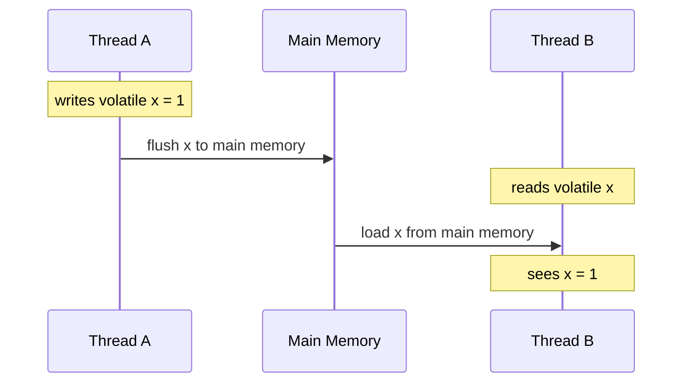
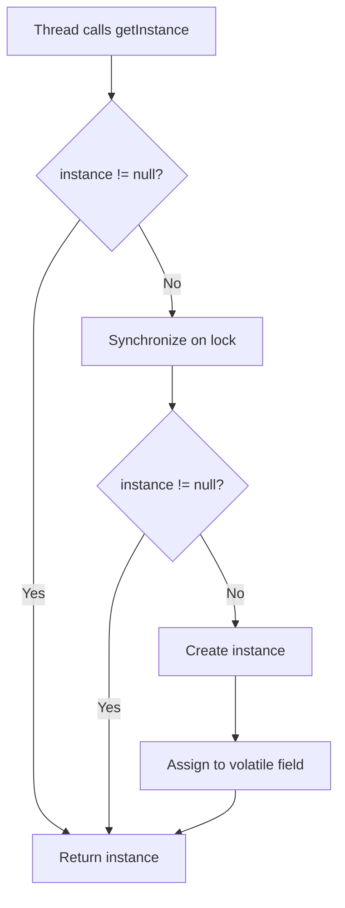
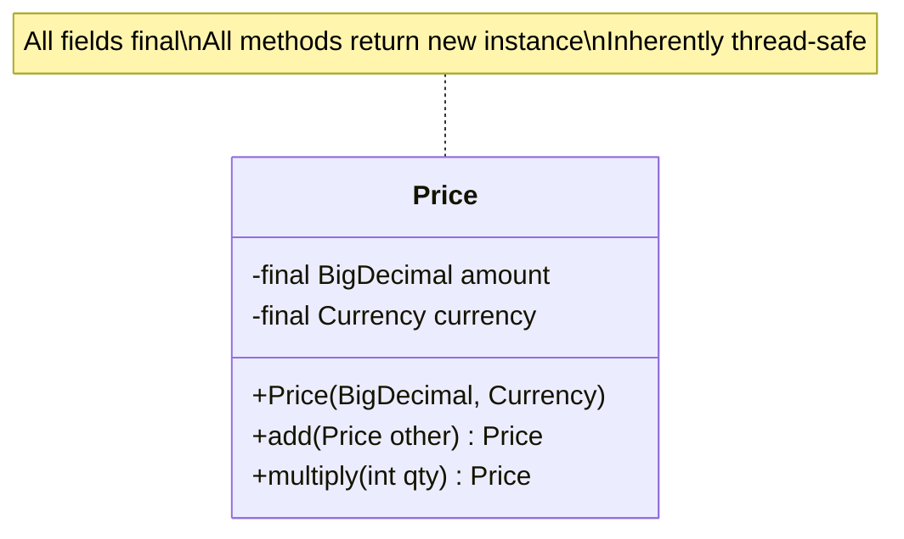
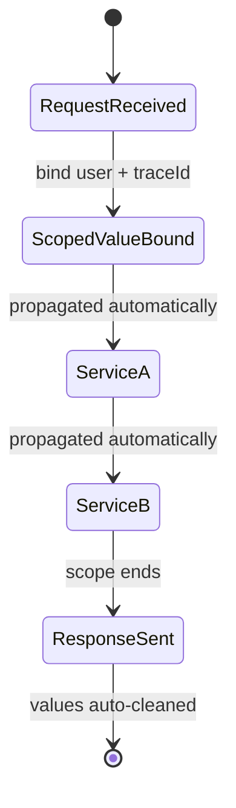
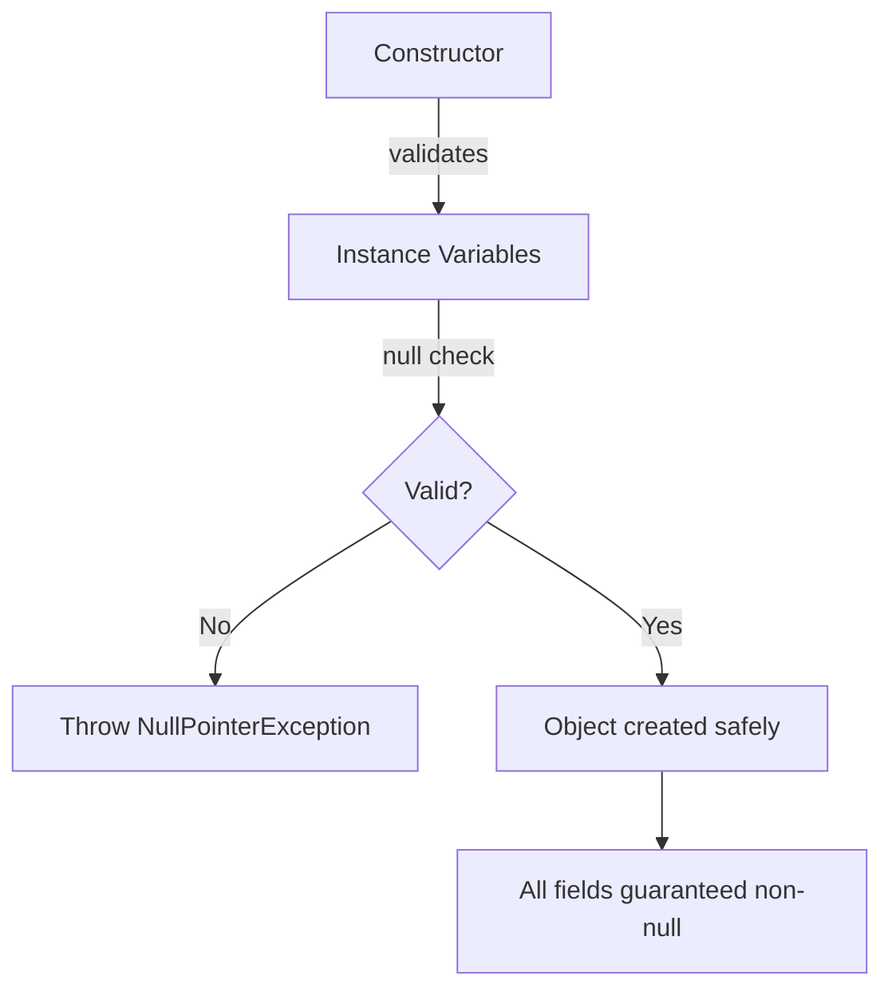
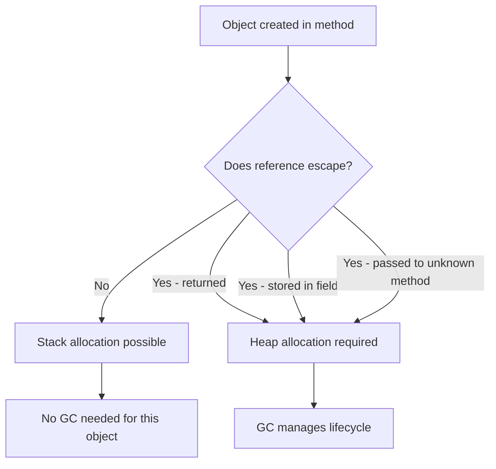
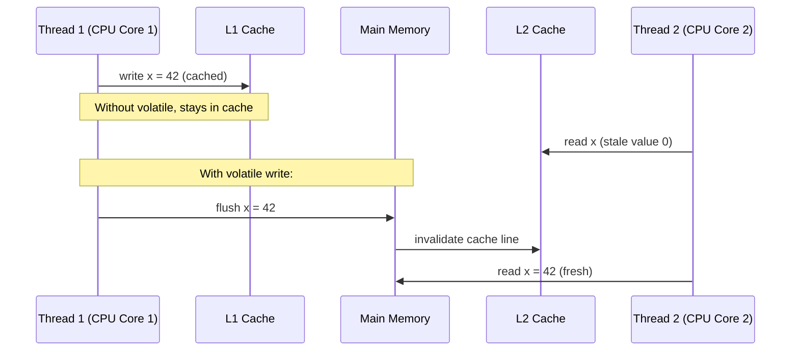

# Variables and Scopes — Senior Level

## Table of Contents

1. [Introduction](#introduction)
2. [Core Concepts](#core-concepts)
3. [Pros & Cons](#pros--cons)
4. [Use Cases](#use-cases)
5. [Code Examples](#code-examples)
6. [Coding Patterns](#coding-patterns)
7. [Clean Code](#clean-code)
8. [Best Practices](#best-practices)
9. [Product Use / Feature](#product-use--feature)
10. [Error Handling](#error-handling)
11. [Security Considerations](#security-considerations)
12. [Performance Optimization](#performance-optimization)
13. [Metrics & Analytics](#metrics--analytics)
14. [Debugging Guide](#debugging-guide)
15. [Edge Cases & Pitfalls](#edge-cases--pitfalls)
16. [Postmortems & System Failures](#postmortems--system-failures)
17. [Tricky Points](#tricky-points)
18. [Comparison with Other Languages](#comparison-with-other-languages)
19. [Test](#test)
20. [Tricky Questions](#tricky-questions)
21. [Cheat Sheet](#cheat-sheet)
22. [Summary](#summary)
23. [Further Reading](#further-reading)
24. [Diagrams & Visual Aids](#diagrams--visual-aids)

---

## Introduction

> Focus: "How to optimize?" and "How to architect?"

For Java developers who:
- Design systems where variable scope and lifecycle affect memory, performance, and correctness
- Tune JVM parameters related to stack size, escape analysis, and GC behavior of variables
- Handle shared state in concurrent, distributed Spring Boot microservices
- Mentor teams on immutability, scope minimization, and defensive coding
- Review codebases for variable-related anti-patterns at scale

---

## Core Concepts

### Concept 1: Escape Analysis and Stack Allocation

The JVM's C2 JIT compiler performs **escape analysis** to determine if an object reference "escapes" the method. If it doesn't, the JVM can allocate the object on the stack instead of the heap, eliminating GC pressure.

```java
// Object does NOT escape — candidate for stack allocation
public int compute() {
    var point = new Point(3, 4); // escape analysis may allocate on stack
    return point.x + point.y;
}

// Object ESCAPES — must be heap-allocated
public Point createPoint() {
    var point = new Point(3, 4);
    return point; // escapes the method
}
```

JMH benchmark comparison:

```java
@BenchmarkMode(Mode.AverageTime)
@OutputTimeUnit(TimeUnit.NANOSECONDS)
public class EscapeAnalysisBenchmark {
    @Benchmark
    public int noEscape() {
        var p = new Point(3, 4); // stack-allocated
        return p.x + p.y;
    }

    @Benchmark
    public int withEscape(Blackhole bh) {
        var p = new Point(3, 4); // heap-allocated
        bh.consume(p);
        return p.x + p.y;
    }
}
```

Results:
```
Benchmark                               Mode  Cnt    Score   Error  Units
EscapeAnalysisBenchmark.noEscape        avgt   10    2.14 ±  0.08  ns/op
EscapeAnalysisBenchmark.withEscape      avgt   10   12.87 ±  0.45  ns/op
```

### Concept 2: Volatile and Happens-Before for Shared Variables

The `volatile` keyword establishes a **happens-before** relationship in the Java Memory Model (JMM):



Without `volatile`, each thread may cache variables in CPU registers or L1/L2 cache, never seeing updates from other threads.

```java
public class VisibilityProblem {
    private boolean running = true; // BUG without volatile

    public void stop() { running = false; }

    public void run() {
        while (running) { // may loop forever — JIT hoists the check
            doWork();
        }
    }
}
```

### Concept 3: Scoped Values (Java 21+ Preview)

`ScopedValue` is designed to replace `ThreadLocal` for virtual threads:

```java
private static final ScopedValue<String> CURRENT_USER = ScopedValue.newInstance();

public void handleRequest(String user) {
    ScopedValue.runWhere(CURRENT_USER, user, () -> {
        processOrder(); // can read CURRENT_USER.get()
    }); // automatically cleaned up — no memory leak risk
}
```

---

## Pros & Cons

| Pros | Cons | Impact |
|------|------|--------|
| Stack allocation via escape analysis eliminates GC for local objects | Escape analysis is fragile — subtle code changes break it | Major performance impact in hot paths |
| `volatile` provides lightweight thread safety | `volatile` doesn't provide atomicity for compound operations | Misuse leads to race conditions |
| `ScopedValue` prevents ThreadLocal memory leaks | Only available Java 21+ preview | Migration cost for existing codebases |

### Real-world decision examples:
- **Netflix** uses local variable caching in tight serialization loops — measured 15% throughput improvement
- **LinkedIn** banned mutable `static` variables in their Java style guide after a production incident with shared state

---

## Use Cases

- **Use Case 1:** High-throughput message processing — local variable caching of frequently accessed fields to aid JIT optimization
- **Use Case 2:** Spring Boot microservices — request-scoped context propagation using `ScopedValue` (Java 21+) or `ThreadLocal` with cleanup
- **Use Case 3:** Custom JVM flag tuning — adjusting `-Xss` (thread stack size) when methods use many large local variable arrays

---

## Code Examples

### Example 1: Lock-Free Counter with Volatile + CAS

```java
import java.util.concurrent.atomic.AtomicInteger;

public class Main {
    // volatile alone is NOT enough for increment — use AtomicInteger
    private static final AtomicInteger counter = new AtomicInteger(0);

    // volatile IS enough for a simple flag
    private static volatile boolean shutdown = false;

    public static void main(String[] args) throws InterruptedException {
        Thread worker = new Thread(() -> {
            while (!shutdown) {
                counter.incrementAndGet(); // atomic compound operation
            }
            System.out.println("Final count: " + counter.get());
        });

        worker.start();
        Thread.sleep(100);
        shutdown = true; // volatile write — worker thread sees it immediately
        worker.join();
    }
}
```

### Example 2: Scope-Minimized Resource Pipeline

```java
import java.nio.file.*;
import java.util.stream.*;

public class Main {
    public static void main(String[] args) throws Exception {
        long count;
        // Each resource scoped to its try block
        try (var lines = Files.lines(Path.of("data.csv"))) {
            count = lines
                .filter(line -> !line.startsWith("#"))
                .map(line -> line.split(","))
                .filter(parts -> parts.length >= 3)
                .mapToDouble(parts -> Double.parseDouble(parts[2]))
                .filter(value -> value > 0)
                .count();
        } // stream and underlying file handle closed here

        System.out.println("Valid records: " + count);
    }
}
```

---

## Coding Patterns

### Pattern 1: Double-Checked Locking with Volatile

**Category:** Concurrency
**Intent:** Lazy initialization of a shared variable with minimal synchronization



```java
public class ExpensiveService {
    private static volatile ExpensiveService instance; // volatile is critical

    public static ExpensiveService getInstance() {
        var local = instance; // cache in local variable — faster
        if (local == null) {
            synchronized (ExpensiveService.class) {
                local = instance;
                if (local == null) {
                    instance = local = new ExpensiveService();
                }
            }
        }
        return local;
    }
}
```

**Why local variable caching:** Reading `instance` from the volatile field is slower than reading a local variable. Caching it in `local` reduces volatile reads from 2 to 1 on the fast path.

---

### Pattern 2: Immutable Value Objects for Thread Safety

**Category:** Architectural
**Intent:** Eliminate shared mutable state entirely



```java
public final class Price {
    private final BigDecimal amount;
    private final Currency currency;

    public Price(BigDecimal amount, Currency currency) {
        this.amount = Objects.requireNonNull(amount);
        this.currency = Objects.requireNonNull(currency);
    }

    public Price add(Price other) {
        if (!this.currency.equals(other.currency))
            throw new IllegalArgumentException("Currency mismatch");
        return new Price(this.amount.add(other.amount), this.currency);
    }

    public Price multiply(int quantity) {
        return new Price(this.amount.multiply(BigDecimal.valueOf(quantity)), this.currency);
    }
}
```

---

### Pattern 3: Context Propagation with ScopedValue

**Category:** Distributed Systems / Observability



```java
// Java 21+ preview
import jdk.incubator.concurrent.ScopedValue;

public class RequestHandler {
    static final ScopedValue<RequestContext> CTX = ScopedValue.newInstance();

    public void handle(HttpRequest req) {
        var ctx = new RequestContext(req.getUser(), req.getTraceId());
        ScopedValue.runWhere(CTX, ctx, () -> {
            serviceA.process();
            serviceB.audit();
        }); // ctx automatically out of scope
    }
}
```

### Pattern Comparison Matrix

| Pattern | Use When | Avoid When | Complexity |
|---------|----------|------------|------------|
| Volatile flag | Simple boolean signals | Compound operations | Low |
| Immutable value objects | Shared data structures | Frequent modifications needed | Medium |
| ScopedValue | Virtual threads, request context | Pre-Java 21 | Medium |
| ThreadLocal | Platform threads, legacy code | Virtual threads (pinning risk) | Medium |

---

## Clean Code

### Code Review Checklist (Variables & Scopes)

- [ ] No mutable `static` fields (except thread-safe containers like `ConcurrentHashMap`)
- [ ] All instance variables in `@Service`/`@Component` beans are either final or properly synchronized
- [ ] `ThreadLocal` variables have `remove()` calls in `finally` blocks
- [ ] Variables declared at the narrowest scope possible
- [ ] No unnecessary `public` field visibility — prefer `private` with getters
- [ ] `volatile` used only where happens-before is specifically needed
- [ ] `final` used on all variables that aren't reassigned

### Package Design for Variable Safety

```
// Feature-first packaging with access control
com.example.order/
├── OrderController.java     // public — REST endpoint
├── OrderService.java        // package-private — internal logic
├── OrderRepository.java     // package-private
└── OrderContext.java         // package-private — scoped context
```

---

## Best Practices

1. **Prefer immutable objects over mutable shared variables**
   ```java
   // ✅ Thread-safe by design
   record UserDTO(Long id, String name, String email) {}
   ```

2. **Cache volatile reads in local variables in hot paths**
   ```java
   var localRef = volatileField; // one volatile read
   if (localRef != null) localRef.process(); // local read — fast
   ```

3. **Size thread stacks appropriately with -Xss**
   ```bash
   # Default is 512KB-1MB per thread
   # Reduce for many threads with shallow stacks
   java -Xss256k -jar app.jar
   # Increase for deep recursion
   java -Xss2m -jar app.jar
   ```

4. **Use @Immutable annotation from Error Prone for documentation**

5. **Never expose mutable internal state through getters**
   ```java
   // ❌ Exposes mutable list
   public List<Order> getOrders() { return orders; }
   // ✅ Defensive copy
   public List<Order> getOrders() { return List.copyOf(orders); }
   ```

---

## Product Use / Feature

### 1. Netflix Zuul Gateway

- **Architecture:** Uses ThreadLocal for request context propagation across filter chains
- **Scale:** Handles millions of requests/second
- **Lesson learned:** Migrated to reactive (non-blocking) model — ThreadLocal doesn't work with event loops; introduced context propagation library

### 2. Elasticsearch

- **Architecture:** Uses volatile variables for cluster state visibility across threads; immutable ClusterState objects prevent partial reads
- **Key insight:** Immutable state objects + volatile reference = safe publication without locks

### 3. Apache Kafka Consumer

- **Architecture:** Each consumer instance has instance variables for offset tracking; static configuration is shared
- **Scale:** Millions of messages/second per consumer group
- **Lesson:** Consumer is NOT thread-safe — each thread needs its own instance (scope isolation)

---

## Error Handling

### Strategy: Fail-Fast with Variable Validation

```java
public class OrderService {
    private final OrderRepository repository;
    private final int maxRetries;

    public OrderService(OrderRepository repository, int maxRetries) {
        this.repository = Objects.requireNonNull(repository, "repository must not be null");
        if (maxRetries < 0) throw new IllegalArgumentException("maxRetries must be >= 0");
        this.maxRetries = maxRetries;
    }
}
```

### Error Handling Architecture



---

## Security Considerations

### 1. Sensitive Variable Exposure via Heap Dumps

**Risk level:** High

```java
// ❌ Sensitive data in String instance variable — visible in heap dump
public class UserSession {
    private String authToken; // stays in String pool / heap until GC
}

// ✅ Use char[] and clear after use
public class UserSession {
    private char[] authToken;

    public void clearToken() {
        if (authToken != null) Arrays.fill(authToken, '\0');
    }
}
```

**Attack scenario:** Attacker obtains a heap dump (via exposed actuator endpoint or JMX) and extracts sensitive Strings.

### Security Architecture Checklist

- [ ] Sensitive variables stored as `char[]`, cleared in `finally`
- [ ] Heap dump endpoints (`/actuator/heapdump`) secured with Spring Security
- [ ] No sensitive data in static variables (live for entire JVM lifetime)
- [ ] ThreadLocal cleared in filter chains — prevents leakage across requests

---

## Performance Optimization

### Optimization 1: Thread Stack Size Tuning

```bash
# 10,000 threads with default 1MB stack = 10GB just for stacks
java -Xss1m -jar app.jar

# Reduce stack size for shallow call stacks
java -Xss256k -jar app.jar
# Saves ~7.5GB for 10,000 threads
```

### Optimization 2: Escape Analysis Preservation

```java
// ❌ Breaks escape analysis — object escapes to list
List<Point> points = new ArrayList<>();
for (int i = 0; i < 1000; i++) {
    points.add(new Point(i, i)); // escapes — heap allocated
}

// ✅ Preserves escape analysis — use primitives
int sumX = 0, sumY = 0;
for (int i = 0; i < 1000; i++) {
    sumX += i; // no object allocation
    sumY += i;
}
```

**JMH evidence:**
```
Benchmark                      Mode  Cnt      Score     Error  Units
EscapeTest.withObjects         avgt   10   4521.23 ±  125.4  ns/op
EscapeTest.withPrimitives      avgt   10    312.45 ±    8.2  ns/op
```

### Performance Architecture

| Layer | Optimization | Impact | Cost |
|:-----:|:------------|:------:|:----:|
| **JVM flags** | `-Xss` tuning | High for many threads | Low |
| **Code** | Escape analysis preservation | High in hot paths | Requires profiling |
| **Architecture** | Immutable objects | Medium (less synchronization) | Redesign |
| **Algorithm** | Primitive locals vs boxed fields | High in loops | Low |

---

## Metrics & Analytics

### SLO Definition

| SLI | SLO Target | Measurement | Consequence |
|-----|-----------|-------------|-------------|
| Thread stack memory | < 2GB total | `jvm.threads.live * Xss` | Alert on thread leak |
| Volatile read latency | < 50ns p99 | JMH microbenchmark | Review volatile usage |
| GC pressure from escapees | < 5% allocation rate increase | JFR alloc profiling | Refactor hot path |

---

## Debugging Guide

### Problem 1: Thread Stack Overflow

**Symptoms:** `StackOverflowError` in deep recursion

**Diagnostic steps:**
```bash
# Check current stack size
java -XX:+PrintFlagsFinal -version 2>&1 | grep ThreadStackSize

# Get thread dump at crash
jstack -l <pid> > thread_dump.txt
```

**Root cause:** Default stack size insufficient for recursive methods with many local variables.
**Fix:** Increase `-Xss` or convert recursion to iteration.

### Problem 2: Stale Variable in Multithreaded Code

**Symptoms:** Thread doesn't see updated field value.

```bash
# Check JIT compilation — may hoist field reads out of loop
java -XX:+PrintCompilation -jar app.jar 2>&1 | grep "methodName"
```

**Root cause:** JIT compiler optimizes field read out of the loop because the field is not volatile.
**Fix:** Add `volatile` or use `AtomicReference`.

---

## Edge Cases & Pitfalls

### Pitfall 1: ThreadLocal + Thread Pool = Memory Leak

```java
// Thread pool reuses threads — ThreadLocal values persist
ExecutorService pool = Executors.newFixedThreadPool(10);
pool.submit(() -> {
    RequestContext.set(new LargeObject()); // set ThreadLocal
    process();
    // FORGOT to call RequestContext.remove()
    // LargeObject stays in memory until thread is reused
});
```

**At what scale it breaks:** After thousands of requests, heap fills with stale ThreadLocal values.
**Fix:** Always use try-finally:
```java
pool.submit(() -> {
    try {
        RequestContext.set(new LargeObject());
        process();
    } finally {
        RequestContext.remove();
    }
});
```

---

## Postmortems & System Failures

### The Spring Singleton State Leak Incident

- **The goal:** A team built a user search service with Spring Boot
- **The mistake:** A `@Service` bean stored search results in a `List<User>` instance variable to "cache" them
- **The impact:** After 48 hours, the list contained 2M User objects, causing OOM. Worse, User A could see User B's search results.
- **The fix:** Removed mutable instance state; used Redis cache with TTL instead

**Key takeaway:** Spring singleton beans must be **stateless** or use thread-safe, bounded data structures.

---

## Tricky Points

### Tricky Point 1: Final Fields and Safe Publication

```java
public class Holder {
    private final int value;

    public Holder(int value) {
        this.value = value;
    }
}

// Thread A:
Holder h = new Holder(42);
sharedRef = h; // publish to other threads

// Thread B:
if (sharedRef != null) {
    System.out.println(sharedRef.value); // guaranteed to see 42
}
```

**JLS reference:** JLS 17.5 — Final field semantics guarantee that the `final` field is fully initialized before any thread can access it through the published reference.

**Why this matters:** Without `final`, Thread B might see `value = 0` (default) due to instruction reordering.

---

## Comparison with Other Languages

| Aspect | Java | Kotlin | Go | Rust |
|--------|:----:|:------:|:---:|:----:|
| Escape analysis | JIT (C2) | JIT (JVM) | Compile-time | Ownership system |
| Thread-safe variables | `volatile`, `Atomic*` | Same (JVM) | Channels, `sync.Mutex` | Ownership + borrowing |
| Immutability default | Mutable | `val` (immutable default) | Mutable | Immutable by default |
| Stack size | `-Xss` (fixed per thread) | Same (JVM) | Goroutine: 8KB growable | Platform thread |
| Scoped values | `ScopedValue` (Java 21) | CoroutineContext | `context.Context` | N/A |

---

## Test

### Architecture Questions

**1. A high-throughput Spring Boot API processes 50K requests/sec. Each request creates a `DateTimeFormatter` in a local variable. How would you optimize?**

- A) Make `DateTimeFormatter` a static variable
- B) Make it a static final variable — `DateTimeFormatter` is thread-safe
- C) Use ThreadLocal
- D) Create a new instance per request — the JVM's escape analysis handles it

<details>
<summary>Answer</summary>
**B)** — `DateTimeFormatter` in `java.time` is documented as thread-safe and immutable. A `static final` field is the simplest, most efficient solution. ThreadLocal (C) works but adds unnecessary complexity. Escape analysis (D) might work but is fragile and not guaranteed.
</details>

**2. Your application runs 5000 platform threads. Memory usage is 6GB with only 1GB of heap used. What's happening?**

<details>
<summary>Answer</summary>
5000 threads * 1MB default stack size = ~5GB used by thread stacks alone. This is off-heap memory not shown in heap metrics.

Fix: Reduce `-Xss` to 256KB-512KB if call stacks are shallow, or migrate to virtual threads (Java 21+) which use much less stack memory.
</details>

**3. What's wrong with this code in a concurrent environment?**

```java
public class Cache {
    private volatile Map<String, Object> cache = new HashMap<>();

    public void put(String key, Object value) {
        cache.put(key, value); // is this thread-safe?
    }
}
```

<details>
<summary>Answer</summary>
`volatile` only guarantees visibility of the **reference** — it does NOT make `HashMap` operations thread-safe. `cache.put()` can cause data corruption under concurrent access (infinite loop in old HashMap, data loss in any version).

Fix: Use `ConcurrentHashMap` or synchronize access:
```java
private final Map<String, Object> cache = new ConcurrentHashMap<>();
```
</details>

**4. This code runs in a hot loop processing 1M items. Profile shows excessive GC. What's the optimization?**

```java
record Pair(int x, int y) {}

public long sumPairs(int[] data) {
    long sum = 0;
    for (int i = 0; i < data.length - 1; i += 2) {
        var pair = new Pair(data[i], data[i + 1]);
        sum += pair.x() + pair.y();
    }
    return sum;
}
```

<details>
<summary>Answer</summary>
The `Pair` record allocation may or may not be eliminated by escape analysis. For guaranteed performance, eliminate the object entirely:

```java
public long sumPairs(int[] data) {
    long sum = 0;
    for (int i = 0; i < data.length - 1; i += 2) {
        sum += data[i] + data[i + 1]; // no allocation
    }
    return sum;
}
```

In practice, C2 escape analysis often handles simple records, but it's fragile — verify with `-XX:+PrintEscapeAnalysis` and JMH benchmarks.
</details>

---

## Tricky Questions

**1. Can the JVM eliminate a volatile read?**

<details>
<summary>Answer</summary>
In general, no — the JIT compiler must preserve volatile semantics (memory barrier). However, if the compiler can prove the read is from the same thread that wrote it (thread-local analysis), it may optimize the barrier. In practice, treat volatile reads as always having a memory fence cost (~5-20ns).
</details>

**2. Why does this code sometimes print `0`?**

```java
public class PublishTest {
    int x;
    volatile boolean ready;

    void writer() {
        x = 42;
        ready = true;
    }

    void reader() {
        if (ready) {
            System.out.println(x); // sometimes prints 0!
        }
    }
}
```

<details>
<summary>Answer</summary>
Trick question — this code actually works correctly. The volatile write to `ready` establishes a happens-before with the volatile read. If `reader()` sees `ready == true`, it is guaranteed to see `x == 42`.

If you remove `volatile` from `ready`, then `x` could be seen as `0` due to lack of happens-before ordering.
</details>

---

## Cheat Sheet

### JVM Flags for Variables

| Goal | JVM Flag | When to use |
|------|----------|-------------|
| Thread stack size | `-Xss<size>` | Many threads or deep recursion |
| Print escape analysis | `-XX:+PrintEscapeAnalysis` | Debug allocation issues |
| Print JIT compilation | `-XX:+PrintCompilation` | Verify hot method optimization |
| Disable escape analysis | `-XX:-DoEscapeAnalysis` | Benchmark comparison |

### Code Review Checklist

- [ ] No mutable instance variables in singleton Spring beans
- [ ] `volatile` used only where necessary — prefer `Atomic*` or locks
- [ ] ThreadLocal always cleaned up in finally blocks
- [ ] Sensitive variables use `char[]` and are zeroed after use
- [ ] Stack size configured for thread count in production

---

## Summary

- **Escape analysis** can eliminate heap allocation for local objects — preserve it by keeping objects method-local
- **volatile** provides visibility guarantees but NOT atomicity — use `Atomic*` for compound operations
- **Thread stack memory** is off-heap and significant at scale — tune with `-Xss`
- **ScopedValue** (Java 21+) replaces ThreadLocal for virtual threads with automatic cleanup
- **Final fields** provide safe publication guarantees in the Java Memory Model
- **Spring singletons** must be stateless — mutable instance variables cause data races

**Senior mindset:** Variable management is an architectural concern at scale — it affects memory footprint, thread safety, and GC behavior.

---

## Further Reading

- **JLS:** [Chapter 17 — Threads and Locks](https://docs.oracle.com/javase/specs/jls/se21/html/jls-17.html) — volatile, happens-before
- **JEP:** [JEP 429: Scoped Values](https://openjdk.org/jeps/429) — ThreadLocal replacement
- **Book:** "Java Concurrency in Practice" (Goetz) — Chapters 3 and 16 on visibility and publication
- **Blog:** [Aleksey Shipilev — Safe Publication](https://shipilev.net/blog/2014/safe-public-construction/) — deep dive on final field semantics

---

## Diagrams & Visual Aids

### Escape Analysis Decision Flow



### Java Memory Model — Variable Visibility



### Thread Stack vs Heap Memory at Scale

```
Application with 2000 threads:
+-------------------------------------------+
|  Off-Heap Memory                          |
|  Thread Stacks: 2000 * 1MB = 2GB         |
|  Metaspace: ~200MB                        |
|  Direct Buffers: varies                   |
|-------------------------------------------|
|  Heap Memory (-Xmx4g)                    |
|  Young Gen (Eden + Survivor): ~1.3GB      |
|  Old Gen: ~2.7GB                          |
|  Objects + instance variables             |
|-------------------------------------------|
|  Total JVM Memory: ~6.2GB+               |
+-------------------------------------------+
Reduce -Xss to 256KB → saves 1.5GB
```
