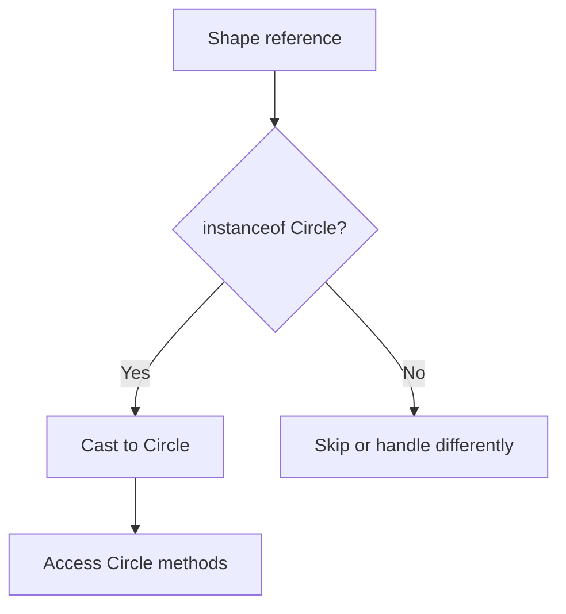
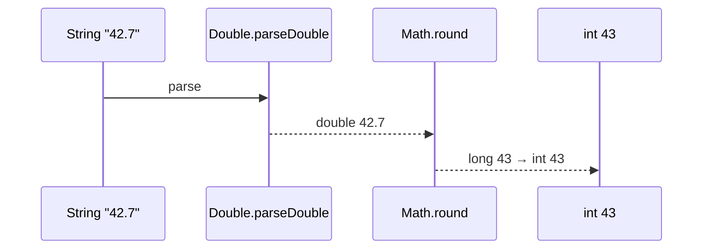
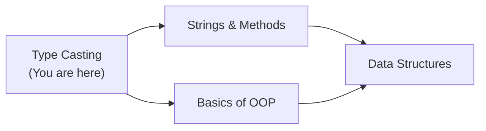
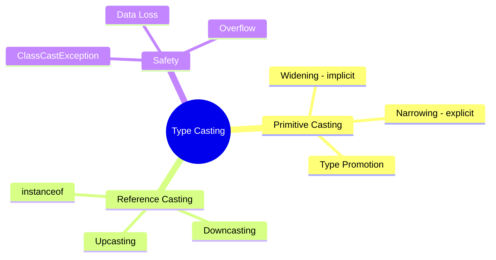
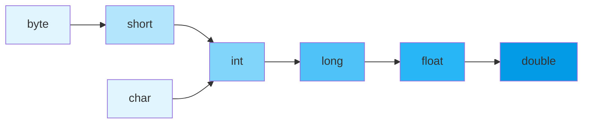
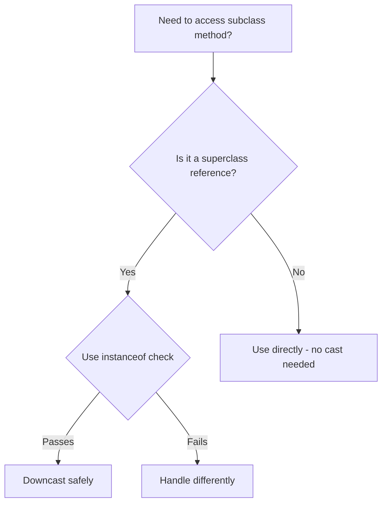

# Type Casting — Junior Level

## Table of Contents

1. [Introduction](#introduction)
2. [Prerequisites](#prerequisites)
3. [Glossary](#glossary)
4. [Core Concepts](#core-concepts)
5. [Real-World Analogies](#real-world-analogies)
6. [Mental Models](#mental-models)
7. [Pros & Cons](#pros--cons)
8. [Use Cases](#use-cases)
9. [Code Examples](#code-examples)
10. [Coding Patterns](#coding-patterns)
11. [Clean Code](#clean-code)
12. [Product Use / Feature](#product-use--feature)
13. [Error Handling](#error-handling)
14. [Security Considerations](#security-considerations)
15. [Performance Tips](#performance-tips)
16. [Metrics & Analytics](#metrics--analytics)
17. [Best Practices](#best-practices)
18. [Edge Cases & Pitfalls](#edge-cases--pitfalls)
19. [Common Mistakes](#common-mistakes)
20. [Common Misconceptions](#common-misconceptions)
21. [Tricky Points](#tricky-points)
22. [Test](#test)
23. [Tricky Questions](#tricky-questions)
24. [Cheat Sheet](#cheat-sheet)
25. [Self-Assessment Checklist](#self-assessment-checklist)
26. [Summary](#summary)
27. [What You Can Build](#what-you-can-build)
28. [Further Reading](#further-reading)
29. [Related Topics](#related-topics)
30. [Diagrams & Visual Aids](#diagrams--visual-aids)

---

## Introduction

> Focus: "What is it?" and "How to use it?"

Type casting in Java is the process of converting a value from one data type to another. Since Java is a statically-typed language, the compiler needs to know the type of every variable at compile time. Sometimes you need to store a value of one type in a variable of a different type — that is where type casting comes in.

There are two kinds of casting: **implicit (widening)** — which Java does automatically when there is no risk of data loss, and **explicit (narrowing)** — which you must request manually because data could be lost or truncated.

---

## Prerequisites

What you should know before studying this topic:

- **Required:** Data Types — you must know Java's 8 primitive types and how they differ in size
- **Required:** Variables and Scopes — you must understand how to declare and assign variables
- **Helpful but not required:** Basics of OOP — understanding classes and objects helps with reference casting

---

## Glossary

Key terms used in this topic:

| Term | Definition |
|------|-----------|
| **Type Casting** | Converting a value from one data type to another |
| **Implicit Casting (Widening)** | Automatic conversion from a smaller type to a larger type with no data loss |
| **Explicit Casting (Narrowing)** | Manual conversion from a larger type to a smaller type, risking data loss |
| **Primitive Type** | One of Java's 8 basic types: `byte`, `short`, `int`, `long`, `float`, `double`, `char`, `boolean` |
| **Reference Type** | Any type that refers to an object (classes, interfaces, arrays) |
| **Upcasting** | Casting a subclass reference to a superclass type (always safe, implicit) |
| **Downcasting** | Casting a superclass reference to a subclass type (explicit, may fail at runtime) |
| **ClassCastException** | Runtime exception thrown when an invalid cast is attempted on objects |
| **instanceof** | Operator that checks whether an object is an instance of a specific class |
| **Type Promotion** | Automatic widening of smaller types to `int` or larger during arithmetic operations |

---

## Core Concepts

### Concept 1: Implicit (Widening) Casting

Java automatically converts a smaller primitive type to a larger one when there is no risk of data loss. The conversion follows this chain:

```
byte → short → int → long → float → double
```

```java
int myInt = 42;
double myDouble = myInt; // Automatic: int → double
```

No cast operator is needed — Java handles it silently.

### Concept 2: Explicit (Narrowing) Casting

When converting from a larger type to a smaller type, you must use the cast operator `(type)` because data may be lost:

```java
double myDouble = 9.78;
int myInt = (int) myDouble; // Manual: double → int, fractional part lost
// myInt is 9
```

### Concept 3: Type Promotion in Expressions

When you use `byte`, `short`, or `char` in arithmetic, Java automatically promotes them to `int`:

```java
byte a = 10;
byte b = 20;
// byte c = a + b; // ERROR! a + b produces int
int c = a + b;     // OK
byte d = (byte)(a + b); // OK with explicit cast
```

### Concept 4: Reference Casting (Upcasting and Downcasting)

- **Upcasting:** Child to Parent — always safe, always implicit
- **Downcasting:** Parent to Child — must be explicit, can fail at runtime

```java
// Upcasting (implicit)
Dog dog = new Dog();
Animal animal = dog; // OK

// Downcasting (explicit)
Animal animal2 = new Dog();
Dog dog2 = (Dog) animal2; // OK — actual object is Dog
```

### Concept 5: The `instanceof` Operator

Before downcasting, check the actual type to avoid `ClassCastException`:

```java
if (animal instanceof Dog) {
    Dog d = (Dog) animal;
    d.bark();
}
```

---

## Real-World Analogies

Everyday analogies to help you understand Type Casting intuitively:

| Concept | Analogy |
|---------|--------|
| **Widening Casting** | Pouring water from a small cup into a big bucket — nothing is lost, it all fits |
| **Narrowing Casting** | Pouring water from a big bucket into a small cup — some water will overflow and be lost |
| **Upcasting** | Calling a Golden Retriever simply a "dog" — you lose specifics but it is always correct |
| **Downcasting** | Assuming every "dog" is a Golden Retriever — it might be wrong and cause an error |

> The widening/narrowing analogy breaks down slightly because numeric precision loss in `int → float` is different from truncation, but for beginners the "container size" model works well.

---

## Mental Models

How to picture Type Casting in your head:

**The intuition:** Think of each primitive type as a box of a certain size. Widening means moving a value into a bigger box — it always fits. Narrowing means squeezing a value into a smaller box — parts may get cut off.

**Why this model helps:** It immediately tells you when casting is safe (small → big) and when it is dangerous (big → small), so you know when to add explicit casts.

---

## Pros & Cons

| Pros | Cons |
|------|------|
| Allows mixing different numeric types in calculations | Narrowing can silently lose data (truncation) |
| Implicit casting keeps code clean and readable | Type promotion can cause unexpected compilation errors for beginners |
| Enables polymorphism through reference casting | Incorrect downcasting causes runtime `ClassCastException` |

### When to use:
- When performing arithmetic with mixed types (`int` + `double`)
- When working with polymorphic collections (storing subclass objects in a superclass list)

### When NOT to use:
- Avoid narrowing just to save memory unless absolutely needed — prefer the correct type from the start
- Avoid excessive downcasting — it often signals a design problem

---

## Use Cases

When and where you would use this in real projects:

- **Use Case 1:** Reading user input as `String`, parsing to `int`, then performing calculations that produce `double` results
- **Use Case 2:** Storing different animal types in a `List<Animal>` and casting back when you need specific behavior
- **Use Case 3:** Working with APIs that return `Object` and you need to cast to the expected type

---

## Code Examples

### Example 1: Widening and Narrowing Primitives

```java
public class Main {
    public static void main(String[] args) {
        // Widening (implicit) — safe, no data loss
        byte b = 42;
        short s = b;     // byte → short
        int i = s;       // short → int
        long l = i;      // int → long
        float f = l;     // long → float
        double d = f;    // float → double

        System.out.println("byte: " + b);
        System.out.println("short: " + s);
        System.out.println("int: " + i);
        System.out.println("long: " + l);
        System.out.println("float: " + f);
        System.out.println("double: " + d);

        // Narrowing (explicit) — may lose data
        double price = 19.99;
        int wholePrice = (int) price; // Truncates decimal
        System.out.println("Original price: " + price);
        System.out.println("Truncated price: " + wholePrice);
    }
}
```

**What it does:** Demonstrates the full widening chain and a simple narrowing cast.
**How to run:** `javac Main.java && java Main`

### Example 2: Upcasting and Downcasting with instanceof

```java
public class Main {
    static class Animal {
        String name;
        Animal(String name) { this.name = name; }
        void speak() { System.out.println(name + " makes a sound"); }
    }

    static class Dog extends Animal {
        Dog(String name) { super(name); }
        void bark() { System.out.println(name + " barks: Woof!"); }
    }

    static class Cat extends Animal {
        Cat(String name) { super(name); }
        void meow() { System.out.println(name + " meows: Meow!"); }
    }

    public static void main(String[] args) {
        // Upcasting (implicit)
        Animal myAnimal = new Dog("Rex");
        myAnimal.speak(); // Works — speak() is in Animal

        // Downcasting with instanceof check
        if (myAnimal instanceof Dog) {
            Dog myDog = (Dog) myAnimal;
            myDog.bark(); // Now we can access Dog-specific methods
        }

        // Pattern matching instanceof (Java 16+)
        Animal anotherAnimal = new Cat("Whiskers");
        if (anotherAnimal instanceof Cat cat) {
            cat.meow(); // Variable 'cat' is already cast
        }
    }
}
```

**What it does:** Shows upcasting, downcasting with safety checks, and modern pattern matching.
**How to run:** `javac Main.java && java Main` (requires Java 16+ for pattern matching)

### Example 3: Type Promotion in Expressions

```java
public class Main {
    public static void main(String[] args) {
        byte a = 10;
        byte b = 20;

        // byte + byte is promoted to int
        // byte c = a + b; // Compilation error!
        int c = a + b;     // Correct
        System.out.println("a + b = " + c);

        // char is promoted to int in arithmetic
        char ch = 'A';
        int asciiValue = ch + 1;
        System.out.println("'A' + 1 = " + asciiValue); // 66
        char nextChar = (char)(ch + 1);
        System.out.println("Next char: " + nextChar);   // B
    }
}
```

**What it does:** Demonstrates how Java promotes `byte` and `char` to `int` during arithmetic.
**How to run:** `javac Main.java && java Main`

---

## Coding Patterns

Common patterns beginners encounter when working with Type Casting:

### Pattern 1: Safe Downcasting with instanceof

**Intent:** Safely cast a reference to a subclass type without risking `ClassCastException`.
**When to use:** When you have a superclass reference and need subclass-specific behavior.

```java
public class Main {
    static class Shape {
        double area() { return 0; }
    }
    static class Circle extends Shape {
        double radius;
        Circle(double radius) { this.radius = radius; }
        double area() { return Math.PI * radius * radius; }
        double circumference() { return 2 * Math.PI * radius; }
    }

    public static void main(String[] args) {
        Shape shape = new Circle(5.0);

        if (shape instanceof Circle) {
            Circle circle = (Circle) shape;
            System.out.println("Circumference: " + circle.circumference());
        }
    }
}
```

**Diagram:**



**Remember:** Always check with `instanceof` before downcasting.

---

### Pattern 2: Numeric Conversion Pipeline

**Intent:** Convert numeric input through a chain of operations safely.

```java
public class Main {
    public static void main(String[] args) {
        String input = "42.7";

        // String → double → int (two-step conversion)
        double parsed = Double.parseDouble(input);
        int rounded = (int) Math.round(parsed); // Round then narrow

        System.out.println("Input: " + input);
        System.out.println("Parsed: " + parsed);
        System.out.println("Rounded: " + rounded);
    }
}
```

**Diagram:**



---

## Clean Code

Basic clean code principles when working with Type Casting in Java:

### Naming (Java conventions)

```java
// ❌ Bad — unclear what the cast does
int x = (int) d;

// ✅ Clean — descriptive variable names
int truncatedTemperature = (int) averageTemperature;
```

**Java naming rules:**
- Classes: PascalCase (`TypeConverter`, `ShapeProcessor`)
- Methods and variables: camelCase (`castToInt`, `isValidCast`)
- Constants: UPPER_SNAKE_CASE (`MAX_BYTE_VALUE`, `MIN_SHORT_VALUE`)

---

### Short Methods

```java
// ❌ Too long — casting + validation + processing in one method
public void processInput(Object input) { /* 40 lines */ }

// ✅ Each method does one thing
private int safelyCastToInt(double value) { return (int) value; }
private void validateRange(int value) { ... }
private void processValue(int value) { ... }
```

---

### Javadoc Comments

```java
// ❌ Noise
// Casts to int
public int toInt(double d) { return (int) d; }

// ✅ Explains contract and edge cases
/**
 * Truncates a double value to its integer part.
 *
 * @param value the value to truncate (must be within int range)
 * @return the integer part of the value
 * @throws ArithmeticException if value overflows int range
 */
public int toInt(double value) { ... }
```

---

## Product Use / Feature

How this topic is used in real-world products and tools:

### 1. JSON Parsing Libraries (Jackson, Gson)

- **How it uses Type Casting:** When deserializing JSON, numeric values may come as `Double` or `Long` and must be cast to the expected type
- **Why it matters:** Incorrect casting causes runtime failures in REST APIs

### 2. JDBC Database Access

- **How it uses Type Casting:** `ResultSet.getObject()` returns `Object` that must be cast to `Integer`, `String`, etc.
- **Why it matters:** Every database query result involves type casting

### 3. Java Collections (before generics)

- **How it uses Type Casting:** Pre-Java 5 collections stored `Object`, requiring casting on retrieval
- **Why it matters:** Understanding casting helps read legacy Java code

---

## Error Handling

How to handle errors when working with Type Casting:

### Error 1: ClassCastException

```java
public class Main {
    public static void main(String[] args) {
        Object obj = "Hello";
        // Integer num = (Integer) obj; // ClassCastException at runtime!
    }
}
```

**Why it happens:** The actual object type does not match the target cast type.
**How to fix:**

```java
public class Main {
    public static void main(String[] args) {
        Object obj = "Hello";
        if (obj instanceof Integer) {
            Integer num = (Integer) obj;
        } else {
            System.out.println("Object is not an Integer, it is: " + obj.getClass().getSimpleName());
        }
    }
}
```

### Error 2: Data Loss in Narrowing

```java
public class Main {
    public static void main(String[] args) {
        int bigNumber = 130;
        byte smallNumber = (byte) bigNumber;
        System.out.println(smallNumber); // Prints -126, not 130!
    }
}
```

**Why it happens:** `byte` range is -128 to 127. The value 130 overflows and wraps around.
**How to fix:** Check the range before casting:

```java
public class Main {
    public static void main(String[] args) {
        int bigNumber = 130;
        if (bigNumber >= Byte.MIN_VALUE && bigNumber <= Byte.MAX_VALUE) {
            byte smallNumber = (byte) bigNumber;
            System.out.println(smallNumber);
        } else {
            System.out.println("Value " + bigNumber + " is out of byte range!");
        }
    }
}
```

---

## Security Considerations

Security aspects to keep in mind when using Type Casting:

### 1. Unchecked Casts on External Input

```java
// ❌ Insecure — trusting deserialized input
Object data = deserialize(userInput);
UserCommand cmd = (UserCommand) data; // Attacker controls the type!

// ✅ Secure — validate type before casting
Object data = deserialize(userInput);
if (data instanceof UserCommand) {
    UserCommand cmd = (UserCommand) data;
} else {
    throw new SecurityException("Unexpected object type: " + data.getClass());
}
```

**Risk:** An attacker could supply a serialized object of a different type, leading to unexpected behavior.
**Mitigation:** Always validate object types from untrusted sources.

### 2. Integer Overflow from Narrowing

```java
// ❌ Insecure — casting user-supplied long to int without validation
long userAge = Long.parseLong(request.getParameter("age"));
int age = (int) userAge; // Could overflow!

// ✅ Secure — use Math.toIntExact
int age = Math.toIntExact(userAge); // Throws ArithmeticException on overflow
```

**Risk:** Overflow could bypass validation logic (e.g., negative age passing a `> 0` check).
**Mitigation:** Use `Math.toIntExact()` for safe long-to-int conversion.

---

## Performance Tips

Basic performance considerations for Type Casting:

### Tip 1: Avoid Unnecessary Boxing/Unboxing

```java
// ❌ Slow — unnecessary autoboxing
Integer sum = 0;
for (int i = 0; i < 1000; i++) {
    sum += i; // Autoboxing on every iteration
}

// ✅ Faster — use primitive
int sum = 0;
for (int i = 0; i < 1000; i++) {
    sum += i; // No boxing overhead
}
```

**Why it's faster:** Autoboxing creates new `Integer` objects, causing extra memory allocation and GC pressure.

### Tip 2: Minimize Downcasting in Loops

```java
// ❌ Repeated instanceof + cast
for (Object item : list) {
    if (item instanceof String) {
        String s = (String) item;
        process(s);
    }
}

// ✅ Use generics to avoid casting entirely
List<String> list = new ArrayList<>();
for (String s : list) {
    process(s);
}
```

**Why it's faster:** Generics provide compile-time type safety with zero runtime overhead (type erasure).

---

## Metrics & Analytics

Key metrics to track when using Type Casting:

### What to Measure

| Metric | Why it matters | Tool |
|--------|---------------|------|
| **ClassCastException count** | Indicates incorrect downcasting in production | Sentry, Datadog |
| **Autoboxing allocations** | Excessive boxing wastes memory | JFR, async-profiler |

### Basic Instrumentation

```java
import io.micrometer.core.instrument.Counter;
import io.micrometer.core.instrument.MeterRegistry;

Counter castErrors = Counter.builder("type.cast.errors")
    .description("Total ClassCastException occurrences")
    .register(registry);

try {
    MyType result = (MyType) obj;
} catch (ClassCastException e) {
    castErrors.increment();
    throw e;
}
```

---

## Best Practices

- **Do this:** Always use `instanceof` before downcasting reference types
- **Do this:** Prefer generics over raw types to eliminate the need for casting
- **Do this:** Use `Math.toIntExact()` instead of `(int)` for long-to-int conversion to catch overflow
- **Do this:** Use pattern matching `instanceof` (Java 16+) for cleaner downcast code
- **Do this:** Be explicit about why you are casting — add a comment if the reason is not obvious

---

## Edge Cases & Pitfalls

### Pitfall 1: Precision Loss in long to float

```java
public class Main {
    public static void main(String[] args) {
        long bigLong = 123456789123456789L;
        float f = bigLong; // Implicit widening — but precision lost!
        System.out.println("long:  " + bigLong);
        System.out.println("float: " + f);
        System.out.println("Equal? " + (bigLong == (long) f));
    }
}
```

**What happens:** Even though `long → float` is widening, `float` only has 24 bits of mantissa, so large `long` values lose precision.
**How to fix:** Use `double` instead of `float` for large `long` values.

### Pitfall 2: char to short is Narrowing

```java
// char is unsigned 0..65535
// short is signed -32768..32767
char c = 60000;
// short s = c; // Compilation error! This is narrowing, not widening
short s = (short) c; // Explicit cast required
```

**What happens:** Even though both are 16-bit, `char` is unsigned and `short` is signed — they are NOT compatible.
**How to fix:** Always use explicit cast between `char` and `short`.

---

## Common Mistakes

### Mistake 1: Forgetting Type Promotion in Byte Arithmetic

```java
// ❌ Wrong — compiler error
byte a = 10, b = 20;
byte c = a + b; // Error: a+b is promoted to int

// ✅ Correct
byte c = (byte)(a + b);
```

### Mistake 2: Casting Without instanceof Check

```java
// ❌ Wrong — crashes at runtime
Animal a = new Cat("Tom");
Dog d = (Dog) a; // ClassCastException!

// ✅ Correct
if (a instanceof Dog) {
    Dog d = (Dog) a;
}
```

### Mistake 3: Assuming (int) Rounds a double

```java
// ❌ Wrong assumption
double d = 9.99;
int i = (int) d; // i is 9, not 10!

// ✅ Use Math.round() for rounding
int i = (int) Math.round(d); // i is 10
```

---

## Common Misconceptions

Things people often believe about Type Casting that are not true:

### Misconception 1: "Widening casts never lose information"

**Reality:** `int → float` and `long → float` and `long → double` can lose precision because floating-point types have limited mantissa bits.

**Why people think this:** Widening sounds like "getting bigger," but float/double precision is not the same as integer precision.

### Misconception 2: "Casting changes the original variable"

**Reality:** Casting creates a new value of the target type. The original variable is unchanged.

**Why people think this:** The syntax `(int) myDouble` looks like it transforms `myDouble`, but `myDouble` remains a `double`.

### Misconception 3: "You can cast any type to any other type"

**Reality:** You can only cast between compatible types. You cannot cast `String` to `int` — you must use `Integer.parseInt()`.

**Why people think this:** In dynamically typed languages, conversions are more flexible.

---

## Tricky Points

Things that look simple but have subtle behavior:

### Tricky Point 1: Integer Overflow in Narrowing

```java
public class Main {
    public static void main(String[] args) {
        int big = 256;
        byte b = (byte) big;
        System.out.println(b); // Prints 0, not 256!
    }
}
```

**Why it's tricky:** 256 in binary is `100000000` (9 bits). `byte` only keeps the lower 8 bits → `00000000` = 0.
**Key takeaway:** Narrowing keeps only the least significant bits.

### Tricky Point 2: Comparing Widened Values

```java
public class Main {
    public static void main(String[] args) {
        int i = Integer.MAX_VALUE;
        float f = i; // Widening, but precision lost
        System.out.println(i);           // 2147483647
        System.out.println((int) f);     // 2147483647? No! 2147483648 wraps!
        System.out.println(i == f);      // true (!) due to float comparison rules
    }
}
```

**Why it's tricky:** The `==` comparison promotes `i` to `float`, losing the same precision, so both sides match.
**Key takeaway:** Be careful comparing `int` and `float` with `==`.

---

## Test

### Multiple Choice

**1. What is the result of implicit casting in Java?**

- A) It always loses data
- B) It converts a smaller type to a larger type automatically
- C) It requires the `(type)` operator
- D) It only works with reference types

<details>
<summary>Answer</summary>
<strong>B)</strong> — Implicit (widening) casting automatically converts smaller types to larger types without data loss. No cast operator is needed.
</details>

**2. What does this code print?**

```java
double d = 7.99;
int i = (int) d;
System.out.println(i);
```

- A) 8
- B) 7.99
- C) 7
- D) Compilation error

<details>
<summary>Answer</summary>
<strong>C)</strong> — Explicit narrowing from <code>double</code> to <code>int</code> truncates the decimal part. It does not round.
</details>

### True or False

**3. `char` to `int` is a widening cast and happens automatically.**

<details>
<summary>Answer</summary>
<strong>True</strong> — <code>char</code> (16-bit unsigned) is automatically widened to <code>int</code> (32-bit signed). The Unicode value of the character becomes the integer value.
</details>

**4. `byte + byte` produces a `byte` result.**

<details>
<summary>Answer</summary>
<strong>False</strong> — Java promotes both <code>byte</code> operands to <code>int</code> before the addition. The result is <code>int</code>, not <code>byte</code>.
</details>

### What's the Output?

**5. What does this code print?**

```java
public class Main {
    public static void main(String[] args) {
        char c = 'A';
        int i = c;
        System.out.println(i);
    }
}
```

<details>
<summary>Answer</summary>
Output: <code>65</code>
Explanation: <code>char 'A'</code> has Unicode value 65. Widening from <code>char</code> to <code>int</code> gives the numeric value.
</details>

**6. What does this code print?**

```java
public class Main {
    public static void main(String[] args) {
        int x = 128;
        byte b = (byte) x;
        System.out.println(b);
    }
}
```

<details>
<summary>Answer</summary>
Output: <code>-128</code>
Explanation: 128 in binary is <code>10000000</code>. When stored in a signed <code>byte</code>, this bit pattern represents -128 (two's complement).
</details>

---

## "What If?" Scenarios

**What if you cast a negative `int` to `char`?**
- **You might think:** It throws an exception because `char` is unsigned
- **But actually:** Java keeps the lower 16 bits. `(char)(-1)` gives `'\uFFFF'` (65535 as unsigned), not an error.

**What if you cast `double` to `byte` directly?**
- **You might think:** You need to cast to `int` first, then to `byte`
- **But actually:** Java allows direct narrowing from `double` to `byte` in a single cast: `byte b = (byte) 300.5;`

---

## Tricky Questions

Questions designed to confuse — with misleading options:

**1. What does `(byte) 300` evaluate to?**

- A) 300
- B) 127 (max byte value)
- C) 44
- D) Compilation error

<details>
<summary>Answer</summary>
<strong>C)</strong> — 300 in binary is <code>100101100</code>. The lower 8 bits are <code>00101100</code> = 44. Narrowing keeps only the least significant bits.
</details>

**2. Which of these is a widening cast?**

- A) `int → byte`
- B) `float → int`
- C) `long → float`
- D) `double → long`

<details>
<summary>Answer</summary>
<strong>C)</strong> — <code>long → float</code> is widening even though precision may be lost. The JLS defines widening as: byte → short → int → long → float → double.
</details>

**3. What happens when you run this code?**

```java
Object obj = "Hello";
Integer num = (Integer) obj;
```

- A) `num` becomes 0
- B) Compilation error
- C) `ClassCastException` at runtime
- D) `num` becomes null

<details>
<summary>Answer</summary>
<strong>C)</strong> — The code compiles because the compiler only checks that <code>Object</code> could theoretically be an <code>Integer</code>. At runtime, the actual object is a <code>String</code>, causing <code>ClassCastException</code>.
</details>

---

## Cheat Sheet

Quick reference for this topic:

| What | Syntax / Command | Example |
|------|-----------------|---------|
| Widening (implicit) | No syntax needed | `double d = 42;` |
| Narrowing (explicit) | `(targetType) value` | `int i = (int) 3.14;` |
| Check type | `obj instanceof Type` | `if (obj instanceof String)` |
| Pattern match (16+) | `obj instanceof Type var` | `if (obj instanceof String s)` |
| Safe long→int | `Math.toIntExact(val)` | `int i = Math.toIntExact(100L);` |
| Char to int | Implicit widening | `int code = 'A'; // 65` |
| Int to char | Explicit narrowing | `char c = (char) 65; // 'A'` |
| Round then cast | `Math.round()` + cast | `int i = (int) Math.round(3.7);` |

---

## Self-Assessment Checklist

Check your understanding of Type Casting:

### I can explain:
- [ ] What Type Casting is and why it exists
- [ ] The difference between widening and narrowing casts
- [ ] What type promotion does to `byte` and `short` in expressions
- [ ] The difference between upcasting and downcasting

### I can do:
- [ ] Write implicit widening casts correctly
- [ ] Write explicit narrowing casts with the `(type)` operator
- [ ] Use `instanceof` before downcasting
- [ ] Handle `ClassCastException` properly
- [ ] Use pattern matching `instanceof` in Java 16+

### I can answer:
- [ ] All multiple choice questions in this document
- [ ] "What's the output?" questions correctly

---

## Summary

- **Widening (implicit):** Smaller → larger type, automatic, usually safe
- **Narrowing (explicit):** Larger → smaller type, manual with `(type)`, may lose data
- **Type promotion:** `byte`, `short`, `char` are promoted to `int` in arithmetic expressions
- **Upcasting:** Subclass → superclass reference, always safe and implicit
- **Downcasting:** Superclass → subclass reference, must use `(Type)`, can throw `ClassCastException`
- **instanceof:** Always check before downcasting to avoid runtime exceptions

**Next step:** Learn about Strings and Methods to understand how type conversions interact with String operations.

---

## What You Can Build

Now that you understand Type Casting, here is what you can build or use it for:

### Projects you can create:
- **Unit Converter:** Convert between meters/feet, Celsius/Fahrenheit — uses narrowing casts to display clean integer results
- **Calculator:** Handle mixed-type arithmetic (int + double) using widening casts
- **Shape Area Calculator:** Use polymorphism and downcasting to handle different shape types

### Technologies / tools that use this:
- **Spring Boot** — understanding casting helps when working with dependency injection and bean types
- **Hibernate** — database query results require casting from Object to entity types
- **Jackson JSON** — JSON deserialization involves type casting under the hood

### Learning path — what to study next:



---

## Further Reading

- **Official docs:** [Java Language Specification — Conversions](https://docs.oracle.com/javase/specs/jls/se21/html/jls-5.html)
- **Oracle tutorial:** [Primitive Data Types](https://docs.oracle.com/javase/tutorial/java/nutsandbolts/datatypes.html) — covers type sizes and ranges
- **Blog post:** [Baeldung — Type Casting in Java](https://www.baeldung.com/java-type-casting) — clear examples with practical use cases
- **Book chapter:** Effective Java (Bloch), Item 55 — discusses Optional as alternative to null casting

---

## Related Topics

Topics to explore next or that connect to this one:

- **[Data Types](../03-data-types/)** — understanding type sizes is essential for casting
- **[Variables and Scopes](../04-variables-and-scopes/)** — casting interacts with variable assignment
- **[Strings and Methods](../06-strings-and-methods/)** — string-to-number conversions complement casting
- **[Basics of OOP](../11-basics-of-oop/)** — upcasting/downcasting requires class hierarchies

---

## Diagrams & Visual Aids

### Mind Map



### Widening Chain



### Reference Casting Decision Flow


