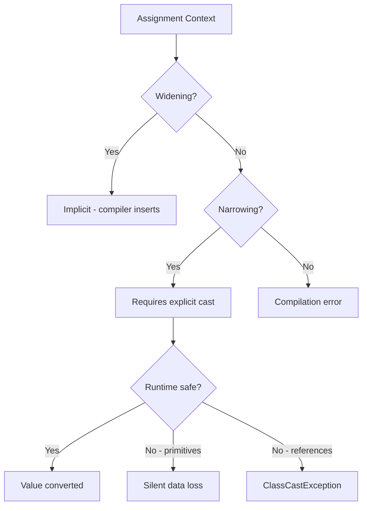
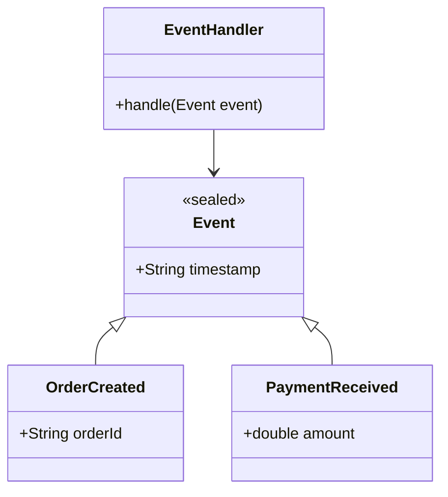
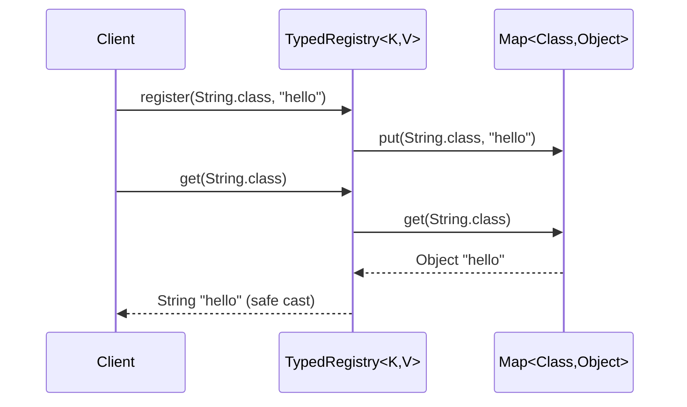
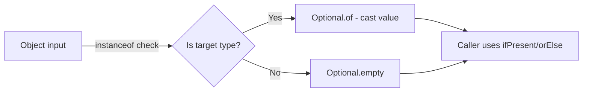
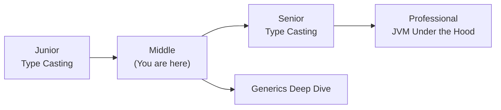
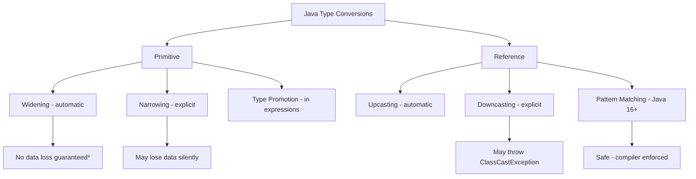
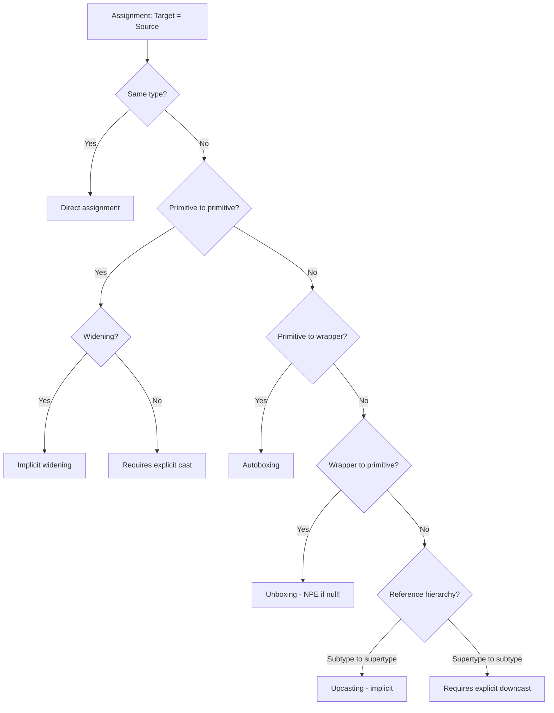

# Type Casting — Middle Level

## Table of Contents

1. [Introduction](#introduction)
2. [Core Concepts](#core-concepts)
3. [Evolution & Historical Context](#evolution--historical-context)
4. [Pros & Cons](#pros--cons)
5. [Alternative Approaches](#alternative-approaches)
6. [Use Cases](#use-cases)
7. [Code Examples](#code-examples)
8. [Coding Patterns](#coding-patterns)
9. [Clean Code](#clean-code)
10. [Product Use / Feature](#product-use--feature)
11. [Error Handling](#error-handling)
12. [Security Considerations](#security-considerations)
13. [Performance Optimization](#performance-optimization)
14. [Metrics & Analytics](#metrics--analytics)
15. [Debugging Guide](#debugging-guide)
16. [Best Practices](#best-practices)
17. [Edge Cases & Pitfalls](#edge-cases--pitfalls)
18. [Common Mistakes](#common-mistakes)
19. [Common Misconceptions](#common-misconceptions)
20. [Anti-Patterns](#anti-patterns)
21. [Tricky Points](#tricky-points)
22. [Comparison with Other Languages](#comparison-with-other-languages)
23. [Test](#test)
24. [Tricky Questions](#tricky-questions)
25. [Cheat Sheet](#cheat-sheet)
26. [Self-Assessment Checklist](#self-assessment-checklist)
27. [Summary](#summary)
28. [What You Can Build](#what-you-can-build)
29. [Further Reading](#further-reading)
30. [Related Topics](#related-topics)
31. [Diagrams & Visual Aids](#diagrams--visual-aids)

---

## Introduction

> Focus: "Why?" and "When to use?"

Assumes the reader already knows Java basics. This level covers:
- Deeper understanding of how type casting works under the JVM
- Generics and type erasure's relationship with casting
- Pattern matching `instanceof` (Java 16+) and sealed classes (Java 17+)
- Production considerations: autoboxing pitfalls, precision loss, and safe conversion utilities

---

## Core Concepts

### Concept 1: The JLS Conversion Hierarchy

The Java Language Specification (JLS 5) defines 13 categories of conversions. For type casting, the most important are:



**Key insight:** Widening primitive conversions are safe at the type level but NOT always at the precision level. `long → float` is defined as widening even though `float` cannot represent all `long` values precisely.

### Concept 2: Autoboxing and Unboxing Conversions

Java 5 introduced automatic boxing/unboxing, which adds hidden casting layers:

```java
Integer boxed = 42;           // autoboxing: int → Integer
int unboxed = boxed;          // unboxing: Integer → int
Double d = 3.14;              // autoboxing: double → Double
long sum = boxed + unboxed;   // unbox + widening: Integer → int → long
```

The dangerous case — unboxing `null`:

```java
Integer nullable = null;
int crash = nullable; // NullPointerException! (unboxing null)
```

### Concept 3: Type Erasure and Casting in Generics

Due to type erasure, generic type parameters are removed at runtime. This forces the compiler to insert hidden casts:

```java
List<String> list = new ArrayList<>();
list.add("hello");
String s = list.get(0); // Compiler inserts: (String) list.get(0)
```

The bytecode actually performs `checkcast java/lang/String`. This is why raw types cause `ClassCastException`:

```java
List rawList = new ArrayList();
rawList.add(42);
List<String> typed = rawList; // Unchecked warning
String s = typed.get(0);     // ClassCastException: Integer cannot be cast to String
```

### Concept 4: Pattern Matching instanceof (Java 16+)

Pattern matching eliminates the need for explicit downcasting after `instanceof`:

```java
// Before Java 16
if (obj instanceof String) {
    String s = (String) obj;
    System.out.println(s.length());
}

// Java 16+
if (obj instanceof String s) {
    System.out.println(s.length()); // s is already cast
}

// Works in switch (Java 21+)
switch (obj) {
    case Integer i -> System.out.println("int: " + i);
    case String s  -> System.out.println("str: " + s);
    case null      -> System.out.println("null");
    default        -> System.out.println("other");
}
```

---

## Evolution & Historical Context

Why does Type Casting exist? What problem does it solve?

**Before Java 5 (Generics):**
- All collections stored `Object`, requiring downcasting on every retrieval
- Raw types everywhere: `List list = new ArrayList(); String s = (String) list.get(0);`
- `ClassCastException` was one of the most common runtime errors

**How Generics changed things (Java 5):**
- Type parameters eliminated most explicit reference casts
- The compiler inserts casts under the hood (type erasure) but guarantees safety at compile time
- `@SuppressWarnings("unchecked")` became the escape hatch

**Pattern matching evolution (Java 14-21):**
- Java 14: `instanceof` with pattern variables (preview)
- Java 16: `instanceof` pattern matching (final)
- Java 17: Sealed classes (enables exhaustive `switch`)
- Java 21: Pattern matching for `switch` (final)

---

## Pros & Cons

| Pros | Cons |
|------|------|
| Enables polymorphism and flexible APIs | Excessive casting signals poor design |
| Widening is zero-cost at runtime (JIT optimized) | Narrowing can silently corrupt data |
| Pattern matching makes casting concise and safe | Type erasure hides casts, making debugging harder |

### Trade-off analysis:

- **Generics vs raw types:** Generics add compile-time safety at the cost of verbose syntax, but prevent ClassCastException
- **Pattern matching vs explicit cast:** Pattern matching is cleaner but requires Java 16+, limiting compatibility

### Comparison with alternatives:

| Approach | Pros | Cons | Best for |
|----------|------|------|----------|
| Explicit cast `(Type)` | Simple, works everywhere | Unsafe, verbose | Pre-Java 16 code |
| Pattern matching | Safe, concise | Requires Java 16+ | Modern codebases |
| Visitor pattern | Type-safe, extensible | Boilerplate | Complex type hierarchies |
| Generics | Compile-time safety | Type erasure limitations | Collection APIs |

---

## Alternative Approaches (Plan B)

If you could not use type casting, how else could you solve the problem?

| Alternative | How it works | When you might be forced to use it |
|-------------|--------------|-------------------------------------|
| **Generics** | Parameterized types eliminate the need to cast | When designing new APIs — always prefer generics |
| **Visitor Pattern** | Double dispatch replaces downcasting | When you have a fixed type hierarchy and need type-specific behavior |
| **Polymorphism (method overriding)** | Each subclass handles its own behavior | When behavior can be defined in the class hierarchy itself |
| **`Optional<T>`** | Wraps nullable values without casting | When returning values that may not exist |

---

## Use Cases

Real-world, production scenarios:

- **Use Case 1:** Spring `@Controller` parameter binding — `@RequestParam` values come as `String` and are converted to `int`, `long`, `boolean` by Spring's type conversion system (which uses casting internally)
- **Use Case 2:** JPA/Hibernate `EntityManager.find()` returns `Object` that must be cast to the entity type when using JPQL queries with `getResultList()`
- **Use Case 3:** Event-driven systems where events are stored as a base `Event` type and consumers downcast to specific event types like `OrderCreatedEvent`

---

## Code Examples

### Example 1: Safe Numeric Conversion Utility

```java
public class Main {
    /**
     * Safely converts a long to int, throwing on overflow.
     * In production, prefer Math.toIntExact().
     */
    static int safeLongToInt(long value) {
        if (value < Integer.MIN_VALUE || value > Integer.MAX_VALUE) {
            throw new ArithmeticException(
                "Value " + value + " overflows int range [" +
                Integer.MIN_VALUE + ", " + Integer.MAX_VALUE + "]");
        }
        return (int) value;
    }

    /**
     * Converts double to int with configurable rounding strategy.
     */
    static int doubleToInt(double value, RoundingMode mode) {
        return switch (mode) {
            case TRUNCATE -> (int) value;
            case ROUND    -> (int) Math.round(value);
            case CEIL     -> (int) Math.ceil(value);
            case FLOOR    -> (int) Math.floor(value);
        };
    }

    enum RoundingMode { TRUNCATE, ROUND, CEIL, FLOOR }

    public static void main(String[] args) {
        System.out.println(safeLongToInt(42L));           // 42
        System.out.println(doubleToInt(3.7, RoundingMode.ROUND));     // 4
        System.out.println(doubleToInt(3.7, RoundingMode.TRUNCATE));  // 3
        System.out.println(doubleToInt(3.7, RoundingMode.CEIL));      // 4
        System.out.println(doubleToInt(3.7, RoundingMode.FLOOR));     // 3

        try {
            safeLongToInt(Long.MAX_VALUE);
        } catch (ArithmeticException e) {
            System.out.println("Caught: " + e.getMessage());
        }
    }
}
```

**Why this pattern:** Production code should never silently lose data. Wrapping narrowing casts in utility methods with range checks prevents subtle bugs.
**Trade-offs:** Slight overhead from range checking, but the safety is worth it.

### Example 2: Pattern Matching with Sealed Classes (Java 17+)

```java
public class Main {
    sealed interface Shape permits Circle, Rectangle, Triangle {}

    record Circle(double radius) implements Shape {}
    record Rectangle(double width, double height) implements Shape {}
    record Triangle(double base, double height) implements Shape {}

    static double area(Shape shape) {
        return switch (shape) {
            case Circle c    -> Math.PI * c.radius() * c.radius();
            case Rectangle r -> r.width() * r.height();
            case Triangle t  -> 0.5 * t.base() * t.height();
            // No default needed — sealed + pattern matching is exhaustive
        };
    }

    public static void main(String[] args) {
        Shape[] shapes = {
            new Circle(5),
            new Rectangle(4, 6),
            new Triangle(3, 8)
        };

        for (Shape s : shapes) {
            System.out.printf("%s area: %.2f%n", s.getClass().getSimpleName(), area(s));
        }
    }
}
```

**When to use which:** Use sealed classes + pattern matching when you have a known, fixed set of types. Use traditional polymorphism when the type hierarchy is open to extension.

---

## Coding Patterns

### Pattern 1: Type-Safe Event Handler (Visitor Alternative)

**Category:** Java-idiomatic
**Intent:** Handle different event types without unsafe downcasting
**When to use:** Event-driven architectures with known event types
**When NOT to use:** When event types change frequently (prefer polymorphism)

**Structure diagram:**



**Implementation:**

```java
public class Main {
    sealed interface Event permits OrderCreated, PaymentReceived {}
    record OrderCreated(String orderId) implements Event {}
    record PaymentReceived(double amount) implements Event {}

    static void handleEvent(Event event) {
        switch (event) {
            case OrderCreated oc -> System.out.println("New order: " + oc.orderId());
            case PaymentReceived pr -> System.out.printf("Payment: $%.2f%n", pr.amount());
        }
    }

    public static void main(String[] args) {
        handleEvent(new OrderCreated("ORD-001"));
        handleEvent(new PaymentReceived(49.99));
    }
}
```

**Trade-offs:**

| Pros | Cons |
|------|------|
| Compile-time exhaustiveness | Requires Java 17+ (sealed), 21+ (switch patterns) |
| No ClassCastException possible | Adding new subtypes requires updating all switches |

---

### Pattern 2: Generics-Based Type-Safe Container

**Flow diagram:**



```java
import java.util.HashMap;
import java.util.Map;

public class Main {
    static class TypedRegistry {
        private final Map<Class<?>, Object> map = new HashMap<>();

        public <T> void register(Class<T> type, T value) {
            map.put(type, value);
        }

        public <T> T get(Class<T> type) {
            return type.cast(map.get(type)); // Safe cast via Class.cast()
        }
    }

    public static void main(String[] args) {
        TypedRegistry registry = new TypedRegistry();
        registry.register(String.class, "hello");
        registry.register(Integer.class, 42);

        String s = registry.get(String.class);   // No explicit cast needed
        Integer i = registry.get(Integer.class);  // Type-safe at compile time

        System.out.println(s); // hello
        System.out.println(i); // 42
    }
}
```

---

### Pattern 3: Defensive Casting with Optional



```java
import java.util.Optional;

public class Main {
    @SuppressWarnings("unchecked")
    static <T> Optional<T> safeCast(Object obj, Class<T> clazz) {
        if (clazz.isInstance(obj)) {
            return Optional.of(clazz.cast(obj));
        }
        return Optional.empty();
    }

    public static void main(String[] args) {
        Object value = "Hello, World!";

        safeCast(value, String.class)
            .ifPresentOrElse(
                s -> System.out.println("String length: " + s.length()),
                () -> System.out.println("Not a String")
            );

        safeCast(value, Integer.class)
            .ifPresentOrElse(
                i -> System.out.println("Integer value: " + i),
                () -> System.out.println("Not an Integer")
            );
    }
}
```

---

## Clean Code

Production-level clean code for Type Casting in Java:

### Naming & Readability

```java
// ❌ Cryptic cast
Object o = getResult();
int v = ((Number) o).intValue();

// ✅ Self-documenting
Object queryResult = fetchAggregateCount();
int totalCount = ((Number) queryResult).intValue();
```

| Element | Java Rule | Example |
|---------|-----------|---------|
| Cast utility methods | verb + target type | `toSafeInt`, `castOrDefault` |
| Type check variables | `is/has/can` prefix | `isValidType`, `canCastToString` |
| Exception messages | include actual vs expected type | `"Expected Integer but got " + obj.getClass()` |

---

### SOLID in Java

**Liskov Substitution Principle and Casting:**
```java
// ❌ Violates LSP — subclass needs special handling
class Bird { void fly() {} }
class Penguin extends Bird {
    void fly() { throw new UnsupportedOperationException(); }
}
// Caller must check: if (bird instanceof Penguin) { ... }

// ✅ Respects LSP — interface segregation
interface Flyable { void fly(); }
interface Swimmable { void swim(); }
class Eagle implements Flyable { public void fly() { ... } }
class Penguin implements Swimmable { public void swim() { ... } }
// No casting needed — use the correct interface
```

**Dependency Inversion — avoid casting to concrete types:**
```java
// ❌ Depends on concrete type
void process(List<String> items) {
    if (items instanceof ArrayList) {
        ArrayList<String> al = (ArrayList<String>) items;
        al.ensureCapacity(100); // Coupling to ArrayList
    }
}

// ✅ Depends on interface
void process(List<String> items) {
    // Work with List interface only
    items.addAll(newItems);
}
```

---

### Java-Specific Smells

```java
// ❌ Casting smell: excessive downcasting
void handleAnimal(Animal a) {
    if (a instanceof Dog) ((Dog) a).bark();
    else if (a instanceof Cat) ((Cat) a).meow();
    else if (a instanceof Bird) ((Bird) a).chirp();
}

// ✅ Polymorphism eliminates casting
abstract class Animal { abstract void makeSound(); }
class Dog extends Animal { void makeSound() { bark(); } }
// Now just: animal.makeSound();
```

---

## Product Use / Feature

How this topic is applied in production systems and popular tools:

### 1. Spring Framework Type Conversion

- **How it uses Type Casting:** Spring's `ConversionService` and `@RequestParam` use a registry of `Converter<S,T>` implementations that internally perform safe type conversions
- **Scale:** Used in every HTTP request parameter binding
- **Key insight:** Spring wraps casts in converters to centralize type safety

### 2. Jackson JSON Deserialization

- **How it uses Type Casting:** When deserializing JSON to Java objects, Jackson uses reflection and `Class.cast()` internally. `ObjectMapper.readValue()` performs generic-aware casting
- **Why this approach:** Centralized deserialization handles all casting in one place

### 3. Hibernate/JPA Query Results

- **How it uses Type Casting:** `Query.getResultList()` returns `List<Object[]>` for JPQL projections, requiring manual casting of each column
- **Why this approach:** JPA must handle arbitrary SQL result shapes

---

## Error Handling

Production-grade exception handling patterns for Type Casting:

### Pattern 1: ClassCastException Handler

```java
import java.util.logging.Logger;

public class Main {
    private static final Logger log = Logger.getLogger(Main.class.getName());

    static <T> T safeCast(Object obj, Class<T> type, T defaultValue) {
        try {
            return type.cast(obj);
        } catch (ClassCastException e) {
            log.warning("Cast failed: expected " + type.getSimpleName() +
                        " but got " + (obj == null ? "null" : obj.getClass().getSimpleName()));
            return defaultValue;
        }
    }

    public static void main(String[] args) {
        Object value = "hello";
        Integer result = safeCast(value, Integer.class, 0);
        System.out.println("Result: " + result); // Result: 0
    }
}
```

### Common Exception Patterns

| Situation | Pattern | Example |
|-----------|---------|---------|
| Unsafe downcast | `if (obj instanceof T) { T t = (T) obj; }` | Prevent ClassCastException |
| Null unboxing | `if (boxed != null) { int i = boxed; }` | Prevent NullPointerException |
| Overflow on narrowing | `Math.toIntExact(longValue)` | Throws ArithmeticException |
| Generic type erasure | `Class.cast()` + `Class.isInstance()` | Runtime type-safe cast |

---

## Security Considerations

Security aspects when using Type Casting in production:

### 1. Deserialization Attacks

**Risk level:** High

```java
// ❌ Vulnerable — casting deserialized object without type whitelist
ObjectInputStream ois = new ObjectInputStream(untrustedStream);
Object obj = ois.readObject();
Command cmd = (Command) obj; // Attacker controls the type!
cmd.execute();

// ✅ Secure — use ObjectInputFilter (Java 9+)
ObjectInputStream ois = new ObjectInputStream(untrustedStream);
ois.setObjectInputFilter(info -> {
    if (info.serialClass() != null &&
        !info.serialClass().getName().startsWith("com.myapp.")) {
        return ObjectInputFilter.Status.REJECTED;
    }
    return ObjectInputFilter.Status.ALLOWED;
});
```

**Attack vector:** Attacker sends serialized object of malicious class; your code casts and invokes methods.
**Impact:** Remote Code Execution (RCE).
**Mitigation:** Use `ObjectInputFilter`, or avoid Java serialization entirely (use JSON/Protobuf).

### Security Checklist

- [ ] Never cast deserialized objects from untrusted sources without filtering
- [ ] Use `Math.toIntExact()` for numeric narrowing from user input
- [ ] Validate `instanceof` before any downcast on external data
- [ ] Avoid `@SuppressWarnings("unchecked")` near security-critical code

---

## Performance Optimization

### Optimization 1: Avoid Autoboxing in Hot Paths

```java
// ❌ Slow — autoboxing in every iteration
public static long sumBoxed(List<Integer> numbers) {
    Long sum = 0L;
    for (Integer n : numbers) {
        sum += n; // unbox Integer, box Long every iteration
    }
    return sum;
}

// ✅ Fast — primitive types
public static long sumPrimitive(int[] numbers) {
    long sum = 0;
    for (int n : numbers) {
        sum += n; // no boxing
    }
    return sum;
}
```

**Benchmark results:**
```
Benchmark                    Mode  Cnt     Score     Error  Units
CastBench.sumBoxed           avgt   10  8524.312 ± 145.2  ns/op
CastBench.sumPrimitive       avgt   10   412.045 ±   8.7  ns/op
```

**When to optimize:** When profiling shows autoboxing allocations in hot paths.

### Optimization 2: instanceof vs getClass()

```java
// Both check type, but performance differs
obj instanceof MyClass   // checks the class hierarchy (includes subtypes)
obj.getClass() == MyClass.class  // exact class match only

// instanceof is JIT-optimized — prefer it for type checks
// getClass() is only faster when you need exact match AND JIT does not inline instanceof
```

### Performance Decision Matrix

| Scenario | Approach | Why |
|----------|----------|-----|
| Numeric loops | Primitives, avoid boxing | 10-20x faster |
| Collection processing | Generics, no raw types | Compiler inserts optimized checkcast |
| Type dispatch | Pattern matching switch | JIT optimizes jump tables |

---

## Metrics & Analytics

### Key Metrics

| Metric | Type | Description | Alert threshold |
|--------|------|-------------|-----------------|
| **ClassCastException rate** | Counter | Failed casts in production | > 0/min |
| **Autoboxing allocations** | Gauge | Objects created by boxing | Baseline + 20% |
| **Cast-heavy method latency** | Timer | Time in methods with frequent casts | p99 > 50ms |

### Micrometer Instrumentation

```java
import io.micrometer.core.instrument.Counter;
import io.micrometer.core.instrument.MeterRegistry;

public class CastingMetrics {
    private final Counter castSuccessCounter;
    private final Counter castFailureCounter;

    public CastingMetrics(MeterRegistry registry) {
        this.castSuccessCounter = Counter.builder("type.cast.success")
            .tag("target", "unknown")
            .register(registry);
        this.castFailureCounter = Counter.builder("type.cast.failure")
            .tag("target", "unknown")
            .register(registry);
    }
}
```

---

## Debugging Guide

### Problem 1: ClassCastException in Generic Code

**Symptoms:** `ClassCastException` at a line with no visible cast — often in generic method returns.

**Diagnostic steps:**
```bash
# Run with verbose class loading to see what's actually loaded
java -verbose:class -cp . Main

# Check bytecode for hidden casts
javap -c -verbose Main.class | grep checkcast
```

**Root cause:** Type erasure inserts `checkcast` instructions that are invisible in source code. A raw-type collection was contaminated with wrong types.

**Fix:** Find where raw types are used and add proper generics. Search for `@SuppressWarnings("unchecked")`.

### Problem 2: NullPointerException from Unboxing

**Symptoms:** NPE at a line that looks like simple arithmetic: `int x = getValue() + 1;`

**Root cause:** `getValue()` returns `Integer` (boxed), which is `null`. Unboxing `null` throws NPE.

**Fix:** Check for null before unboxing, or use `Optional`:
```java
int x = Optional.ofNullable(getValue()).orElse(0) + 1;
```

### Useful Tools

| Tool | Command | What it shows |
|------|---------|---------------|
| `javap` | `javap -c Main.class` | Hidden checkcast instructions |
| `jconsole` | `jconsole` | Live object allocation monitoring |
| `async-profiler` | `./profiler.sh -e alloc -d 30 <pid>` | Autoboxing allocation hotspots |

---

## Best Practices

- **Practice 1:** Use generics everywhere — they eliminate 90% of reference casts
- **Practice 2:** Use `Class.cast()` and `Class.isInstance()` for reflective type-safe casts
- **Practice 3:** Prefer pattern matching `instanceof` (Java 16+) over explicit downcast
- **Practice 4:** Never suppress `unchecked` warnings without understanding the type safety guarantee
- **Practice 5:** Use `Math.toIntExact()`, `Math.addExact()` for overflow-safe numeric conversions
- **Practice 6:** When designing APIs, return specific types — avoid returning `Object`

---

## Edge Cases & Pitfalls

### Pitfall 1: Autoboxing Cache Boundary

```java
public class Main {
    public static void main(String[] args) {
        Integer a = 127;
        Integer b = 127;
        System.out.println(a == b);  // true (cached)

        Integer c = 128;
        Integer d = 128;
        System.out.println(c == d);  // false (new objects!)

        System.out.println(c.equals(d)); // true (correct comparison)
    }
}
```

**Impact:** Using `==` on boxed types works for -128..127 but fails outside that range.
**Detection:** SpotBugs rule `RC_REF_COMPARISON_BAD_PRACTICE_BOOLEAN`.
**Fix:** Always use `.equals()` for boxed type comparison.

### Pitfall 2: Widening + Autoboxing Ambiguity

```java
public class Main {
    static void process(long l)    { System.out.println("long: " + l); }
    static void process(Integer i) { System.out.println("Integer: " + i); }

    public static void main(String[] args) {
        int x = 42;
        process(x); // Which overload? long (widening wins over boxing)
    }
}
```

**Impact:** Java prefers widening over boxing in method resolution. `int → long` is chosen over `int → Integer`.
**Detection:** Code review, IDE warnings.

---

## Common Mistakes

### Mistake 1: Casting Between Unrelated Types

```java
// ❌ Compiles but crashes — String and Integer are both Object subtypes
Object obj = "hello";
Integer num = (Integer) obj; // ClassCastException

// ✅ Check first, or use proper conversion
Object obj = "42";
if (obj instanceof String s) {
    int num = Integer.parseInt(s);
}
```

**Why it's wrong:** The compiler allows the cast because `Object` could theoretically be any type, but runtime types must match.

### Mistake 2: Ignoring Precision Loss in Widening

```java
// ❌ Looks correct but loses precision
long precise = 9_007_199_254_740_993L; // 2^53 + 1
double d = precise;
System.out.println(precise);        // 9007199254740993
System.out.println((long) d);       // 9007199254740992 — off by 1!

// ✅ Use BigDecimal for arbitrary precision
import java.math.BigDecimal;
BigDecimal bd = BigDecimal.valueOf(precise);
```

---

## Common Misconceptions

### Misconception 1: "Generics prevent all ClassCastExceptions"

**Reality:** Generic type safety only works if you never use raw types. Mixing raw and generic types (e.g., legacy code) can cause ClassCastException despite generics.

**Evidence:**
```java
List rawList = new ArrayList();
rawList.add(42);

@SuppressWarnings("unchecked")
List<String> strings = rawList; // No error at compile time
String s = strings.get(0);      // ClassCastException at runtime!
```

### Misconception 2: "Pattern matching instanceof is just syntactic sugar"

**Reality:** Pattern matching also scopes the variable — it is only accessible in the code path where the check succeeded. The compiler enforces this, preventing stale cast bugs.

---

## Anti-Patterns

### Anti-Pattern 1: Type-Check Chains

```java
// ❌ The Anti-Pattern — lengthy instanceof chains
void process(Object obj) {
    if (obj instanceof Dog) ((Dog) obj).bark();
    else if (obj instanceof Cat) ((Cat) obj).meow();
    else if (obj instanceof Bird) ((Bird) obj).chirp();
    // Adding new type = modify this method (OCP violation)
}
```

**Why it's bad:** Violates Open/Closed Principle. Every new type requires modifying existing code.
**The refactoring:** Use polymorphism, Visitor pattern, or sealed classes with pattern matching.

### Anti-Pattern 2: Using Object as a Universal Container

```java
// ❌ Everything is Object — casting everywhere
Map<String, Object> config = loadConfig();
int port = (Integer) config.get("port");       // ClassCastException if String
String host = (String) config.get("host");

// ✅ Type-safe configuration
record ServerConfig(String host, int port) {}
ServerConfig config = loadConfig(ServerConfig.class);
```

---

## Tricky Points

### Tricky Point 1: Intersection of Autoboxing and Widening

```java
public class Main {
    static void m(Long l) { System.out.println("Long"); }

    public static void main(String[] args) {
        int x = 42;
        // m(x); // Compilation error! Java won't widen int→long THEN box to Long
        m((long) x); // OK — explicit widen, then autobox
    }
}
```

**What actually happens:** Java performs at most ONE implicit conversion (either widening OR boxing, not both in sequence).
**Why:** JLS 5.3 — method invocation context allows widening OR boxing, not widening then boxing.

### Tricky Point 2: Ternary Operator Type Promotion

```java
public class Main {
    public static void main(String[] args) {
        boolean condition = true;
        // What type is the result?
        Object result = condition ? 42 : "hello";
        System.out.println(result.getClass()); // class java.lang.Integer

        // But what about this?
        int i = 42;
        double d = 3.14;
        var x = condition ? i : d; // x is double! (binary numeric promotion)
        System.out.println(x); // 42.0
    }
}
```

**Why:** In the ternary operator, if both sides are numeric, binary numeric promotion applies (widening the narrower type).

---

## Comparison with Other Languages

| Aspect | Java | Kotlin | Go | C# |
|--------|------|--------|-----|-----|
| Implicit widening | Automatic | Smart casts with `as` / `is` | No implicit conversion | Automatic |
| Explicit narrowing | `(int) doubleVal` | `doubleVal.toInt()` | `int(floatVal)` | `(int) doubleVal` |
| Null-safe cast | `instanceof` check | `as?` returns null | N/A (no inheritance) | `as` returns null |
| Pattern matching | Java 16+ `instanceof` | `when (x) { is Type -> }` | Type switch | C# 7+ `is Type t` |
| Type erasure | Yes (generics erased) | Yes (JVM target) | No generics erasure (1.18+ has generics) | No (reified generics) |

### Key differences:

- **Java vs Kotlin:** Kotlin's `as?` operator returns `null` on failure instead of throwing, eliminating ClassCastException. Kotlin also has smart casts — after an `is` check, the compiler automatically casts.
- **Java vs Go:** Go has no implicit type conversions at all. Every conversion must be explicit: `int(myFloat)`. This prevents all silent precision loss.
- **Java vs C#:** C# has reified generics (type info preserved at runtime), so no hidden casts from type erasure. C# also has `as` for safe casts and `is` for type checks.

---

## Test

### Multiple Choice (harder)

**1. What happens when autoboxing encounters `null`?**

- A) The primitive variable becomes 0
- B) The primitive variable becomes `false`
- C) NullPointerException is thrown
- D) Compilation error

<details>
<summary>Answer</summary>
<strong>C)</strong> — Unboxing <code>null</code> to any primitive type throws <code>NullPointerException</code>. The JVM cannot extract a primitive value from null.
</details>

**2. Which conversion does Java prefer in method overloading: widening or boxing?**

- A) Boxing — it is more specific
- B) Widening — it was in Java before autoboxing
- C) Neither — it is ambiguous and causes a compilation error
- D) Depends on the JVM version

<details>
<summary>Answer</summary>
<strong>B)</strong> — JLS 15.12.2 specifies that widening is preferred over boxing for backward compatibility. <code>int → long</code> beats <code>int → Integer</code>.
</details>

### Code Analysis

**3. What does this print?**

```java
public class Main {
    public static void main(String[] args) {
        Object obj = 42;                          // autobox to Integer
        long result = (long) obj;                  // What happens?
        System.out.println(result);
    }
}
```

<details>
<summary>Answer</summary>
<strong>ClassCastException!</strong> The object is <code>Integer</code>, not <code>Long</code>. You cannot unbox <code>Integer</code> to <code>long</code>. Fix: <code>long result = (Integer) obj;</code> (unbox to int, then widen to long) or <code>((Number) obj).longValue()</code>.
</details>

### Debug This

**4. This code has a bug. Find it.**

```java
public class Main {
    public static void main(String[] args) {
        Integer a = 1000;
        Integer b = 1000;
        if (a == b) {
            System.out.println("Equal");
        } else {
            System.out.println("Not equal");
        }
    }
}
```

<details>
<summary>Answer</summary>
Bug: Uses <code>==</code> to compare <code>Integer</code> objects. For values outside -128..127, autoboxing creates different objects, so <code>==</code> compares references (not values). Fix: Use <code>a.equals(b)</code> or <code>a.intValue() == b.intValue()</code>.
</details>

**5. What does this code print?**

```java
public class Main {
    public static void main(String[] args) {
        byte b = (byte) 256;
        System.out.println(b);
    }
}
```

<details>
<summary>Answer</summary>
Output: <code>0</code>. 256 in binary is <code>100000000</code> (9 bits). Narrowing to byte keeps the lower 8 bits: <code>00000000</code> = 0.
</details>

**6. Does this compile? If yes, what does it print?**

```java
public class Main {
    public static void main(String[] args) {
        short s = 'A';
        System.out.println(s);
    }
}
```

<details>
<summary>Answer</summary>
Yes, it compiles and prints <code>65</code>. <code>'A'</code> is a constant expression with value 65, which fits in <code>short</code> range. The compiler allows narrowing of constant expressions that fit the target type (JLS 5.2).
</details>

---

## Tricky Questions

**1. Can you widen `byte` directly to `char`?**

- A) Yes — `byte` is smaller than `char`, so it is widening
- B) No — `byte` is signed and `char` is unsigned, so it requires two conversions
- C) Yes — the compiler handles the sign extension automatically
- D) No — they are completely unrelated types

<details>
<summary>Answer</summary>
<strong>B)</strong> — <code>byte → char</code> is NOT widening. The JLS specifies it as a two-step process: <code>byte → int</code> (widening), then <code>int → char</code> (narrowing). An explicit cast is required: <code>char c = (char) myByte;</code>
</details>

**2. What is the type of `condition ? 1 : 2.0`?**

- A) `int` because both are numeric
- B) `Object` because the types differ
- C) `double` because binary numeric promotion applies
- D) Compilation error — types must match

<details>
<summary>Answer</summary>
<strong>C)</strong> — When both operands of the ternary are numeric, binary numeric promotion (JLS 15.25.2) applies. <code>int</code> is widened to <code>double</code>, so the result type is <code>double</code>.
</details>

---

## Cheat Sheet

### Decision Matrix

| If you need... | Use... | Because... |
|----------------|--------|------------|
| Safe int from long | `Math.toIntExact(l)` | Throws on overflow instead of truncating |
| Type-safe downcast | `if (obj instanceof T t) { ... }` | Pattern matching, no separate cast |
| Reflective safe cast | `clazz.cast(obj)` | Works with `Class<T>` tokens |
| Null-safe unboxing | `Optional.ofNullable(boxed).orElse(default)` | Prevents NPE from null unboxing |
| Precision-safe conversion | `BigDecimal.valueOf(longVal)` | No floating-point precision loss |
| Exhaustive type dispatch | `sealed` + `switch` pattern matching | Compiler ensures all types handled |

---

## Self-Assessment Checklist

### I can explain:
- [ ] Why Java performs type promotion in expressions
- [ ] The difference between widening and autoboxing in method resolution
- [ ] How type erasure causes hidden casts in generic code
- [ ] Why `byte → char` is NOT a widening conversion

### I can do:
- [ ] Write production-quality code with safe numeric conversions
- [ ] Use pattern matching `instanceof` and switch (Java 16+/21+)
- [ ] Debug ClassCastException from generic type erasure
- [ ] Design APIs that minimize the need for casting (generics, sealed classes)

---

## Summary

- Autoboxing introduces hidden conversions that can cause NPE (null unboxing) and subtle comparison bugs (`==` on boxed types)
- Type erasure means generic collections still perform casts at bytecode level
- Pattern matching `instanceof` (Java 16+) and sealed classes (Java 17+) are the modern replacement for unsafe downcasting
- Java prefers widening over boxing in method overloading for backward compatibility
- `Math.toIntExact()` and `Class.cast()` are the safe alternatives to raw narrowing and reference casts

**Key difference from Junior:** Understanding WHY casts work the way they do at the JVM level, and knowing the modern alternatives.
**Next step:** Explore generics deeply, sealed classes, and record patterns at Senior level.

---

## What You Can Build

### Production systems:
- **Type-safe REST API parameter binding** — custom Spring `Converter<S,T>` implementations
- **Event-driven microservice** — sealed event types with pattern matching dispatch

### Learning path:



---

## Further Reading

- **Official docs:** [JLS Chapter 5 — Conversions and Contexts](https://docs.oracle.com/javase/specs/jls/se21/html/jls-5.html)
- **Book:** Effective Java (Bloch), 3rd edition — Item 27 (Eliminate unchecked warnings), Item 33 (Typesafe heterogeneous containers)
- **JEP:** [JEP 394: Pattern Matching for instanceof](https://openjdk.org/jeps/394) — motivation and design decisions
- **Blog:** [Baeldung — Pattern Matching in Java](https://www.baeldung.com/java-pattern-matching-instanceof) — practical examples

---

## Related Topics

- **[Data Types](../03-data-types/)** — type sizes determine widening/narrowing relationships
- **[Variables and Scopes](../04-variables-and-scopes/)** — pattern matching variables have special scoping rules
- **[Basics of OOP](../11-basics-of-oop/)** — reference casting depends on class hierarchies

---

## Diagrams & Visual Aids

### Conversion Categories



### Autoboxing Decision Flow


