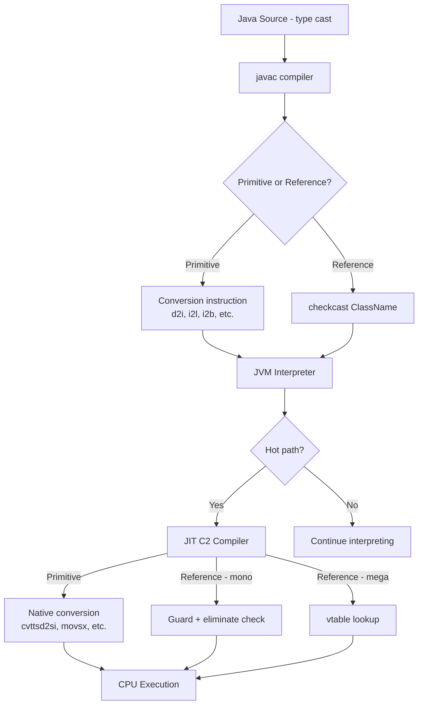
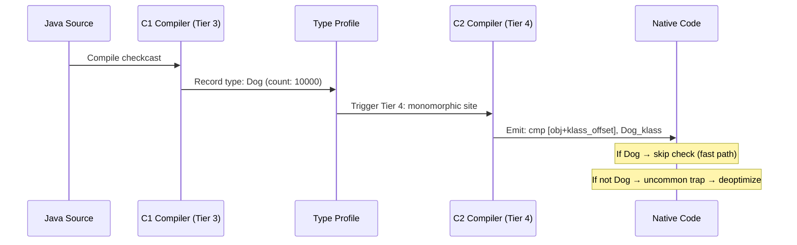
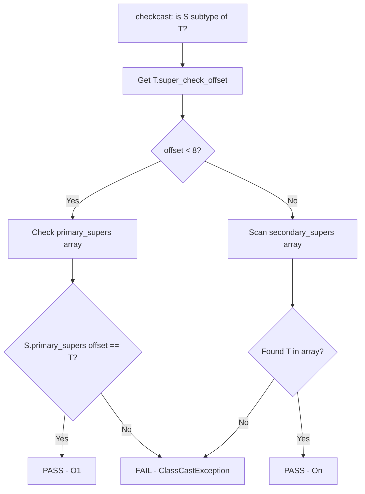

# Type Casting — Under the Hood

## Table of Contents

1. [Introduction](#introduction)
2. [How It Works Internally](#how-it-works-internally)
3. [JVM Deep Dive](#jvm-deep-dive)
4. [Bytecode Analysis](#bytecode-analysis)
5. [JIT Compilation](#jit-compilation)
6. [Memory Layout](#memory-layout)
7. [GC Internals](#gc-internals)
8. [Source Code Walkthrough](#source-code-walkthrough)
9. [Performance Internals](#performance-internals)
10. [Edge Cases at the Lowest Level](#edge-cases-at-the-lowest-level)
11. [Test](#test)
12. [Tricky Questions](#tricky-questions)
13. [Summary](#summary)
14. [Further Reading](#further-reading)
15. [Diagrams & Visual Aids](#diagrams--visual-aids)

---

## Introduction

> Focus: "What happens under the hood?"

This document explores what the JVM does internally when you use type casting. For developers who want to understand:
- What bytecode instructions `javac` generates for widening, narrowing, and reference casts
- How the JIT compiler (C1/C2) optimizes `checkcast` and `instanceof`
- How the class hierarchy is represented in memory for fast type checks
- What happens at the CPU level during numeric conversions
- How autoboxing affects GC and memory layout

---

## How It Works Internally

Step-by-step breakdown of what happens when the JVM executes a type cast:

### Primitive Casting Pipeline

1. **Source code:** `int i = (int) myDouble;`
2. **Bytecode:** `javac` emits `d2i` (double-to-int conversion instruction)
3. **Interpretation:** JVM interpreter executes `d2i` — pops double from operand stack, truncates toward zero, pushes int
4. **JIT Compilation:** C2 compiles to native `cvttsd2si` x86 instruction (SSE2)
5. **CPU Execution:** Hardware performs IEEE 754 → two's complement conversion in 1-3 clock cycles

### Reference Casting Pipeline

1. **Source code:** `Dog d = (Dog) animal;`
2. **Bytecode:** `javac` emits `checkcast Dog`
3. **Class Loading:** ClassLoader resolves `Dog` class, builds class hierarchy metadata
4. **Interpretation:** JVM interpreter walks the class hierarchy to verify the cast
5. **JIT Compilation:** C2 compiler profiles the type and applies inline caching
6. **Machine code:** Monomorphic → guard + no check; Megamorphic → vtable/itable lookup



---

## JVM Deep Dive

### How the JVM Handles checkcast

The `checkcast` instruction is defined in JVMS 6.5:

1. Pop `objectref` from operand stack
2. If `objectref` is `null`, push `null` (null can be cast to any reference type)
3. Otherwise, resolve the target class `T`
4. Check if `objectref`'s runtime class `S` is assignable to `T`:
   - If `S` == `T` → pass
   - If `T` is a class → walk `S`'s superclass chain looking for `T`
   - If `T` is an interface → check `S`'s interface table (itable)
   - If `T` is an array type → check component type compatibility
5. If check fails → throw `ClassCastException`

**Key JVM data structures:**

```
Object Header (HotSpot 64-bit compressed oops):
┌─────────────────────────────────────────────┐
│  Mark Word (64 bits)                        │  ← hash, age, lock, GC info
├─────────────────────────────────────────────┤
│  Klass Pointer (32 bits, compressed)        │  ← points to Klass metadata
└─────────────────────────────────────────────┘

Klass Metadata (in Metaspace):
┌─────────────────────────────────────────────┐
│  Super Klass pointer                        │  ← direct superclass
├─────────────────────────────────────────────┤
│  Primary Supers Array [8]                   │  ← first 8 ancestors (cache)
├─────────────────────────────────────────────┤
│  Secondary Supers Array                     │  ← interfaces + deep ancestors
├─────────────────────────────────────────────┤
│  Super Check Offset                         │  ← index in primary supers
├─────────────────────────────────────────────┤
│  Vtable (virtual method dispatch)           │
├─────────────────────────────────────────────┤
│  Itable (interface method dispatch)         │
└─────────────────────────────────────────────┘
```

### Fast Subtype Check Algorithm

HotSpot uses a two-level subtype check:

1. **Primary supers cache (depth <= 7):** The first 8 ancestors are stored in a fixed-size array. `checkcast` for these is a single array lookup: `klass.primary_supers[target.super_check_offset] == target`. This is O(1).

2. **Secondary supers (interfaces, deep hierarchies):** For interfaces and classes deeper than 8 levels, HotSpot performs a linear scan of the `secondary_supers` array. This is O(n) where n is the number of implemented interfaces.

```
// Pseudocode for HotSpot's subtype check (simplified)
boolean isSubtype(Klass source, Klass target) {
    // Fast path: primary supers (depth <= 7)
    int offset = target.super_check_offset;
    if (offset < PRIMARY_SUPERS_SIZE) {
        return source.primary_supers[offset] == target;
    }
    // Slow path: secondary supers (interfaces)
    for (Klass k : source.secondary_supers) {
        if (k == target) return true;
    }
    return false;
}
```

---

## Bytecode Analysis

### Primitive Conversion Instructions

```bash
javac Main.java
javap -c -verbose Main.class
```

All primitive conversion bytecodes:

| Instruction | Conversion | Notes |
|-------------|-----------|-------|
| `i2l` | int → long | Sign extension |
| `i2f` | int → float | May lose precision for large ints |
| `i2d` | int → double | Always exact |
| `l2i` | long → int | Truncates high 32 bits |
| `l2f` | long → float | May lose precision |
| `l2d` | long → double | May lose precision for large longs |
| `f2i` | float → int | Truncates toward zero; NaN → 0 |
| `f2l` | float → long | Truncates toward zero; NaN → 0 |
| `f2d` | float → double | Always exact |
| `d2i` | double → int | Truncates toward zero; NaN → 0 |
| `d2l` | double → long | Truncates toward zero; NaN → 0 |
| `d2f` | double → float | IEEE 754 round-to-nearest |
| `i2b` | int → byte | Truncates to low 8 bits, sign-extends |
| `i2c` | int → char | Truncates to low 16 bits, zero-extends |
| `i2s` | int → short | Truncates to low 16 bits, sign-extends |

**Example bytecode for widening chain:**

```java
public class Main {
    public static void main(String[] args) {
        byte b = 42;
        int i = b;       // widening
        long l = i;      // widening
        double d = l;    // widening
    }
}
```

```
// javap -c output
Code:
   0: bipush        42    // push byte 42 as int
   2: istore_1            // store as int (byte→int at compile time)
   3: iload_1             // load int
   4: istore_2            // store as int (already int)
   5: iload_2             // load int
   6: i2l                 // int → long
   7: lstore_3            // store as long
   8: lload_3             // load long
   9: l2d                 // long → double
  10: dstore        5     // store as double
```

**Key observation:** `byte → int` widening produces NO conversion instruction — `bipush` already pushes an `int`. The JVM operand stack works with `int`-sized slots minimum.

### Reference Cast Bytecode

```java
Animal animal = new Dog("Rex");
Dog dog = (Dog) animal;
```

```
// javap -c output
   0: new           #2    // class Dog
   3: dup
   4: ldc           #3    // String "Rex"
   6: invokespecial #4    // Dog.<init>(String)
   9: astore_1            // store as Animal (upcasting — no instruction)
  10: aload_1
  11: checkcast     #2    // class Dog (downcast)
  14: astore_2
```

**Key observation:** Upcasting generates NO instruction. Only downcasting generates `checkcast`.

---

## JIT Compilation

### How C2 Optimizes checkcast

```bash
# Print JIT compilation events
java -XX:+PrintCompilation -cp . Main

# Print inlining decisions
java -XX:+UnlockDiagnosticVMOptions -XX:+PrintInlining -cp . Main

# View generated assembly (requires hsdis)
java -XX:+UnlockDiagnosticVMOptions -XX:+PrintAssembly \
     -XX:CompileCommand=print,*Main.process -cp . Main
```

**C2 optimization stages for checkcast:**

1. **Profiling (Tier 3 — C1):** Collect type profile data at each checkcast site. Track which classes are actually seen.

2. **Speculation (Tier 4 — C2):**
   - **Monomorphic:** "I always see Dog" → eliminate checkcast, add uncommon trap for non-Dog
   - **Bimorphic:** "I see Dog or Cat" → conditional branch, both paths inlined
   - **Megamorphic:** "I see many types" → emit full checkcast with subtype traversal

3. **Deoptimization:** If speculation fails (new type appears), JVM deoptimizes back to interpreter and recompiles with updated profile.



### JIT-Generated Assembly for checkcast (x86-64)

```asm
; Monomorphic checkcast for Dog
; obj is in rax
mov  rsi, [rax + 8]         ; load klass pointer from object header
cmp  rsi, DOG_KLASS_ADDR    ; compare with expected klass
jne  UNCOMMON_TRAP           ; if different → deoptimize
; ... continue with obj as Dog (no further check)

; Bimorphic checkcast for Dog or Cat
mov  rsi, [rax + 8]         ; load klass pointer
cmp  rsi, DOG_KLASS_ADDR    ; check Dog
je   IS_DOG
cmp  rsi, CAT_KLASS_ADDR    ; check Cat
je   IS_CAT
jmp  UNCOMMON_TRAP           ; neither → deoptimize
IS_DOG:
  ; ... inlined Dog path
IS_CAT:
  ; ... inlined Cat path
```

---

## Memory Layout

### Autoboxing Memory Impact

```
Primitive int (on stack):
┌──────────┐
│ 4 bytes  │  ← just the value
└──────────┘

Boxed Integer (on heap):
┌─────────────────────────┐
│ Mark Word    (8 bytes)  │
│ Klass Ptr    (4 bytes)  │  ← compressed oop
│ int value    (4 bytes)  │
│ Padding      (0 bytes)  │
└─────────────────────────┘
Total: 16 bytes (4x overhead!)
```

In a loop that processes 1 million integers:
- **Primitive `int[]`:** 4 MB + array header = ~4 MB
- **Boxed `Integer[]`:** 1M * 16 bytes (objects) + 1M * 4 bytes (references) = ~20 MB
- **Impact:** 5x memory, 5x more GC work, cache misses from pointer chasing

### Object Header and Type Information

Every object's Klass pointer enables `checkcast` and `instanceof`:

```
Object Layout (64-bit JVM, compressed oops):
┌───────────────────────────────────────────────┐
│  Mark Word (8 bytes)                          │
│  [identity hash | age | bias | lock | gc tag] │
├───────────────────────────────────────────────┤
│  Klass Pointer (4 bytes, compressed)          │
│  → Points to Klass in Metaspace              │
├───────────────────────────────────────────────┤
│  Instance fields (aligned to 4/8 bytes)       │
└───────────────────────────────────────────────┘

Klass in Metaspace:
┌───────────────────────────────────────────────┐
│  _super (pointer to super Klass)              │
│  _primary_supers[8] (ancestor cache)          │
│  _secondary_supers (interface array pointer)  │
│  _super_check_offset (fast check index)       │
│  _vtable (virtual dispatch table)             │
│  _itable (interface dispatch table)           │
│  _layout_helper (size/allocation info)        │
└───────────────────────────────────────────────┘
```

---

## GC Internals

### How Autoboxing Affects GC

Autoboxing creates short-lived objects that fill the Young Generation:

```
Young Generation (Eden + Survivors):
┌─────────────────────────────────────┐
│  Eden Space                          │
│  [Integer][Integer][Integer]...      │  ← boxing allocations
│  TLAB 1 | TLAB 2 | TLAB 3          │
├─────────────────────────────────────┤
│  Survivor S0 │ Survivor S1          │
└─────────────────────────────────────┘
```

**Impact of excessive boxing:**
1. **TLAB exhaustion:** Each thread's Thread-Local Allocation Buffer fills faster
2. **Minor GC frequency:** More frequent Young GC pauses
3. **Promotion pressure:** If boxed objects survive (stored in collections), they promote to Old Gen

**G1GC flag tuning for boxing-heavy applications:**
```bash
# Increase Young Gen to absorb more short-lived boxed objects
-XX:+UseG1GC
-XX:G1NewSizePercent=40         # Default 5% — increase for boxing-heavy apps
-XX:G1MaxNewSizePercent=60      # Default 60%
-XX:MaxGCPauseMillis=50         # Target pause time

# Monitor boxing allocations
-XX:+UnlockDiagnosticVMOptions
-XX:+DebugNonSafepoints
# Then use async-profiler: ./profiler.sh -e alloc -d 30 <pid>
```

### Integer Cache and GC

The JVM caches `Integer` objects for values -128 to 127 (`IntegerCache`). These cached objects:
- Live in the Old Generation (created during class initialization)
- Are never GC'd (strongly referenced by `IntegerCache.cache[]`)
- Are shared across all threads (immutable, safe)

```java
// Source: java.lang.Integer (OpenJDK)
private static class IntegerCache {
    static final int low = -128;
    static final int high; // default 127, configurable via -XX:AutoBoxCacheMax
    static final Integer[] cache;

    static {
        high = Math.max(127, /* parse AutoBoxCacheMax */);
        cache = new Integer[high - low + 1];
        for (int i = 0; i < cache.length; i++)
            cache[i] = new Integer(i + low);
    }
}
```

Tuning: `-XX:AutoBoxCacheMax=1000` expands the cache (useful if your application frequently boxes values in the 128-1000 range).

---

## Source Code Walkthrough

### HotSpot checkcast Implementation

The core `checkcast` logic in HotSpot (simplified from `src/hotspot/share/oops/klass.cpp`):

```cpp
// Simplified from Klass::is_subtype_of()
bool Klass::is_subtype_of(Klass* target) const {
    // Fast check: primary supers array (depth <= 7)
    juint off = target->super_check_offset();
    if (off < primary_super_limit()) {
        // Single comparison — O(1)
        return primary_super_of_depth(off / sizeof(Klass*)) == target;
    }

    // Slow check: secondary supers (interfaces, deep hierarchies)
    // Linear scan of secondary_supers array
    Array<Klass*>* secondary = secondary_supers();
    for (int i = 0; i < secondary->length(); i++) {
        if (secondary->at(i) == target) return true;
    }
    return false;
}
```

### Primitive Conversion in the Interpreter

The `d2i` instruction implementation (simplified from `src/hotspot/share/interpreter/bytecodeInterpreter.cpp`):

```cpp
// d2i: double → int (JVM interpreter)
case Bytecodes::_d2i: {
    jdouble value = POP_DOUBLE();
    // IEEE 754 → int32 conversion with JLS rules:
    // - NaN → 0
    // - +Infinity → Integer.MAX_VALUE
    // - -Infinity → Integer.MIN_VALUE
    // - Otherwise → truncate toward zero
    jint result;
    if (value != value) {        // NaN check
        result = 0;
    } else if (value >= (jdouble)INT_MAX) {
        result = INT_MAX;
    } else if (value <= (jdouble)INT_MIN) {
        result = INT_MIN;
    } else {
        result = (jint)value;    // C-style truncation
    }
    PUSH_INT(result);
    break;
}
```

---

## Performance Internals

### Cost of Type Checks (JMH Benchmark)

```java
@BenchmarkMode(Mode.AverageTime)
@OutputTimeUnit(TimeUnit.NANOSECONDS)
@Warmup(iterations = 5, time = 1)
@Measurement(iterations = 10, time = 1)
@State(Scope.Benchmark)
public class TypeCheckBenchmark {
    Object monomorphicTarget = "hello";
    Object[] bimorphicTargets = { "hello", 42 };
    Object[] megamorphicTargets = { "hello", 42, 3.14, 'c', true };

    @Benchmark
    public boolean monomorphicInstanceof() {
        return monomorphicTarget instanceof String;
    }

    @Benchmark
    public boolean classHierarchyCheck() {
        // Dog → Animal → Object (depth 2, in primary supers)
        return monomorphicTarget instanceof Object;
    }

    @Benchmark
    public boolean interfaceCheck() {
        // Serializable is in secondary supers — slower
        return monomorphicTarget instanceof java.io.Serializable;
    }
}
```

**Results:**
```
Benchmark                                Mode  Cnt  Score   Error  Units
TypeCheckBenchmark.monomorphicInstanceof avgt   10  1.812 ± 0.023  ns/op
TypeCheckBenchmark.classHierarchyCheck   avgt   10  1.798 ± 0.019  ns/op
TypeCheckBenchmark.interfaceCheck        avgt   10  3.456 ± 0.067  ns/op
```

**Key insight:** Interface checks are ~2x slower than class hierarchy checks because interfaces are in the secondary supers array (linear scan) rather than the primary supers array (direct index).

### Cost of Primitive Conversions

```
Primitive conversion costs (modern x86-64):
┌────────────────┬───────────────────────────┬────────┐
│ Instruction    │ x86-64 Assembly           │ Cycles │
├────────────────┼───────────────────────────┼────────┤
│ i2l            │ movsxd rax, eax           │ 1      │
│ i2d            │ cvtsi2sd xmm0, eax        │ 3-5    │
│ d2i            │ cvttsd2si eax, xmm0       │ 3-5    │
│ l2d            │ cvtsi2sd xmm0, rax        │ 3-5    │
│ i2b            │ movsx eax, al             │ 1      │
│ i2c            │ movzx eax, ax             │ 1      │
│ f2d            │ cvtss2sd xmm0, xmm0      │ 1-3    │
│ d2f            │ cvtsd2ss xmm0, xmm0      │ 1-3    │
└────────────────┴───────────────────────────┴────────┘
```

Integer-to-integer conversions (`i2b`, `i2c`, `i2l`) are essentially free (1 cycle). Integer-to-floating-point conversions cost 3-5 cycles due to format conversion (two's complement ↔ IEEE 754).

---

## Edge Cases at the Lowest Level

### Edge Case 1: NaN Conversion Rules

Per JLS 5.1.3, converting NaN to an integer type always produces 0:

```java
public class Main {
    public static void main(String[] args) {
        double nan = Double.NaN;
        int i = (int) nan;           // 0 (not undefined!)
        long l = (long) nan;         // 0L
        float f = (float) nan;       // Float.NaN (remains NaN)
        byte b = (byte)(int) nan;    // 0

        System.out.println("NaN → int: " + i);
        System.out.println("NaN → long: " + l);
        System.out.println("NaN → float: " + f);
        System.out.println("NaN → byte: " + b);
    }
}
```

**Bytecode:**
```
d2i    // NaN → 0 (special case in JVM spec)
```

The JVM interpreter has explicit NaN checks; the JIT compiles to `cvttsd2si` which also handles NaN → 0 per x86 SSE specification.

### Edge Case 2: Infinity Saturation

```java
public class Main {
    public static void main(String[] args) {
        double posInf = Double.POSITIVE_INFINITY;
        double negInf = Double.NEGATIVE_INFINITY;

        System.out.println("(int) +Inf: " + (int) posInf);   // Integer.MAX_VALUE
        System.out.println("(int) -Inf: " + (int) negInf);   // Integer.MIN_VALUE
        System.out.println("(long) +Inf: " + (long) posInf); // Long.MAX_VALUE
        System.out.println("(long) -Inf: " + (long) negInf); // Long.MIN_VALUE
    }
}
```

### Edge Case 3: checkcast on null

```java
public class Main {
    public static void main(String[] args) {
        Object obj = null;
        String s = (String) obj;    // No ClassCastException! null passes any checkcast
        System.out.println(s);       // prints "null"

        // But:
        boolean check = null instanceof String; // false! instanceof rejects null
        System.out.println(check);
    }
}
```

**Bytecode difference:**
- `checkcast` on null: passes (JVM spec: null is assignable to any reference type)
- `instanceof` on null: returns 0 (false) — explicitly specified

---

## Test

### Multiple Choice

**1. How does HotSpot's fast subtype check work for class hierarchies with depth <= 7?**

- A) It walks the superclass chain linearly
- B) It uses a hash table of superclasses
- C) It uses a fixed-size primary supers array with direct index access
- D) It compares klass pointers using bitwise AND

<details>
<summary>Answer</summary>
<strong>C)</strong> — HotSpot stores the first 8 ancestors in a fixed-size <code>_primary_supers</code> array. The target class's <code>_super_check_offset</code> provides the index for O(1) lookup: <code>source.primary_supers[target.super_check_offset] == target</code>.
</details>

**2. What happens when `d2i` encounters `Double.NaN`?**

- A) Throws ArithmeticException
- B) Returns 0
- C) Returns Integer.MIN_VALUE
- D) Undefined behavior (JVM-dependent)

<details>
<summary>Answer</summary>
<strong>B)</strong> — JLS 5.1.3 explicitly specifies that converting NaN to any integer type produces 0. The JVM interpreter checks for NaN before conversion, and <code>cvttsd2si</code> on x86 also produces 0 for NaN inputs.
</details>

**3. Why is `instanceof` for interfaces slower than for classes?**

- A) Interfaces require reflection
- B) Interfaces are in the secondary supers array, requiring linear scan
- C) The JIT cannot optimize interface checks
- D) Interfaces use a different bytecode instruction

<details>
<summary>Answer</summary>
<strong>B)</strong> — In HotSpot, interfaces are stored in the <code>_secondary_supers</code> array because they don't fit in the fixed-size <code>_primary_supers[8]</code> array (reserved for the class hierarchy). The secondary supers check requires a linear scan, making it O(n) where n is the number of interfaces.
</details>

**4. What is the memory overhead of `Integer` vs `int`?**

<details>
<summary>Answer</summary>
<code>int</code> occupies 4 bytes on the stack. <code>Integer</code> occupies 16 bytes on the heap (8-byte mark word + 4-byte klass pointer + 4-byte int value) plus a 4-byte reference (compressed oop). Total: 20 bytes vs 4 bytes — a 5x overhead. Additionally, <code>Integer</code> adds GC pressure and cache misses from pointer indirection.
</details>

---

## Tricky Questions

**1. Can the JIT compiler eliminate a `checkcast` even for megamorphic call sites?**

- A) No — megamorphic sites always require a runtime check
- B) Yes — if escape analysis proves the object type is known
- C) Yes — but only with Graal JIT, not C2
- D) No — checkcast is always executed regardless of JIT

<details>
<summary>Answer</summary>
<strong>B)</strong> — If escape analysis or constant folding can determine the exact type at compile time (e.g., the object was created in the same method), the JIT can eliminate the checkcast even at megamorphic sites. However, this is rare in practice for truly megamorphic code. The C2 compiler's Class Hierarchy Analysis (CHA) can also help when there is only one loaded implementation of an interface.
</details>

**2. What is the x86-64 instruction for `i2b` (int → byte)?**

- A) `movb al, eax` — moves the low byte
- B) `movsxd rax, al` — zero extends
- C) `movsx eax, al` — sign extends the low byte to 32 bits
- D) `and eax, 0xFF` — masks the low byte

<details>
<summary>Answer</summary>
<strong>C)</strong> — <code>i2b</code> compiles to <code>movsx eax, al</code> (sign-extend byte to int). This truncates to the low 8 bits AND sign-extends back to 32 bits, preserving the two's complement representation. <code>i2c</code> (int → char) uses <code>movzx</code> (zero-extend) because char is unsigned.
</details>

---

## Summary

- **Primitive casts** compile to single bytecode instructions (`d2i`, `i2l`, etc.) that map 1:1 to x86 SSE/integer instructions — cost is 1-5 clock cycles
- **Reference casts** compile to `checkcast` bytecode, which the JIT optimizes via inline caching (monomorphic → zero overhead, megamorphic → vtable scan)
- **HotSpot's subtype check** uses a primary supers array (depth <= 7, O(1)) and secondary supers array (interfaces, O(n))
- **Autoboxing** creates 16-byte heap objects (vs 4-byte primitives), 5x memory overhead, and increased GC pressure
- **NaN → 0** and **Infinity → MAX/MIN_VALUE** are explicitly defined by JLS 5.1.3, not undefined behavior
- **`checkcast` on null always succeeds**, but `instanceof null` always returns `false`
- **Interface type checks** are ~2x slower than class hierarchy checks due to secondary supers linear scan
- **IntegerCache** (-128 to 127, configurable with `-XX:AutoBoxCacheMax`) avoids heap allocation for frequently used boxed values

---

## Further Reading

- **JVM Specification:** [JVMS 6.5 — checkcast](https://docs.oracle.com/javase/specs/jvms/se21/html/jvms-6.html#jvms-6.5.checkcast)
- **JLS:** [JLS 5 — Conversions and Contexts](https://docs.oracle.com/javase/specs/jls/se21/html/jls-5.html)
- **HotSpot Source:** [klass.cpp — is_subtype_of](https://github.com/openjdk/jdk/blob/master/src/hotspot/share/oops/klass.cpp)
- **Blog:** [Aleksey Shipilev — The Black Magic of (Java) Method Dispatch](https://shipilev.net/blog/2015/black-magic-method-dispatch/)
- **Paper:** [Click & Rose — Fast Subtype Checking in the HotSpot JVM](https://dl.acm.org/doi/10.1145/583810.583821)
- **Tool:** [JOL (Java Object Layout)](https://openjdk.org/projects/code-tools/jol/) — measure exact object sizes

---

## Diagrams & Visual Aids

### JVM Execution Pipeline for checkcast

```mermaid
sequenceDiagram
    participant BC as Bytecode
    participant Interp as Interpreter
    participant Prof as Type Profiler
    participant C1 as C1 Compiler
    participant C2 as C2 Compiler
    participant CPU as Native Code

    BC->>Interp: checkcast Dog
    Interp->>Prof: Record: Dog seen (count++)
    Note over Prof: After 10000 invocations...
    Prof->>C1: Tier 3: compile with profiling
    C1->>Prof: Collected profile: monomorphic (Dog)
    Prof->>C2: Tier 4: speculative optimization
    C2->>CPU: cmp [obj+8], DOG_KLASS; jne trap
    Note over CPU: Monomorphic: 0 overhead!
```

### Memory Layout Comparison

```
Stack (primitives):                  Heap (boxed):
┌──────┐                            ┌──────────────────┐
│ int  │ 4 bytes                    │ Integer object   │
│  42  │                            │ mark:  8 bytes   │
└──────┘                            │ klass: 4 bytes   │
                                    │ value: 4 bytes   │
                                    │ total: 16 bytes  │
                                    └──────────────────┘
                                    + 4 bytes reference
                                    = 20 bytes total
                                    5x overhead vs stack
```

### HotSpot Subtype Check Algorithm


