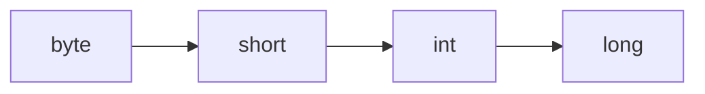

# Type Casting — Practical Tasks

## Table of Contents

1. [Junior Tasks](#junior-tasks)
2. [Middle Tasks](#middle-tasks)
3. [Senior Tasks](#senior-tasks)
4. [Questions](#questions)
5. [Mini Projects](#mini-projects)
6. [Challenge](#challenge)

---

## Junior Tasks

### Task 1: Widening and Narrowing Chain

**Type:** 💻 Code

**Goal:** Practice all primitive widening and narrowing conversions.

**Instructions:**
1. Declare a `byte` variable with value `42`
2. Widen it through the full chain: `byte → short → int → long → float → double`
3. Then narrow it back: `double → float → long → int → short → byte`
4. Print each value at every step
5. Observe which steps lose data

**Starter code:**

```java
public class Main {
    public static void main(String[] args) {
        byte original = 42;

        // TODO: Widen through the chain
        // TODO: Narrow back through the chain
        // TODO: Print each value
        // TODO: Compare original with final value
    }
}
```

**Expected output:**
```
=== Widening ===
byte: 42
short: 42
int: 42
long: 42
float: 42.0
double: 42.0
=== Narrowing ===
double: 42.0
float: 42.0
long: 42
int: 42
short: 42
byte: 42
Original == Final: true
```

**Evaluation criteria:**
- [ ] Code compiles and runs
- [ ] Output matches expected
- [ ] All 6 widening steps present
- [ ] All 6 narrowing steps present with explicit casts

---

### Task 2: Type Promotion Explorer

**Type:** 💻 Code

**Goal:** Understand how Java promotes types in arithmetic expressions.

**Instructions:**
1. Declare two `byte` values and add them — assign to `int`
2. Declare a `short` and a `byte`, multiply them — what type is the result?
3. Declare a `char` `'Z'` and add `1` to it — print as `int` and as `char`
4. Declare an `int` and a `double`, add them — what type is the result?
5. For each operation, print the result and its type name

**Starter code:**

```java
public class Main {
    public static void main(String[] args) {
        byte a = 50, b = 60;
        // TODO: Add a + b, store in correct type
        // TODO: Print result and explain why the type is what it is

        short s = 100;
        byte c = 5;
        // TODO: Multiply s * c, store in correct type

        char ch = 'Z';
        // TODO: Add 1 to ch, print as int and as char

        int i = 10;
        double d = 3.14;
        // TODO: Add i + d, store in correct type
    }
}
```

**Expected output:**
```
byte + byte = 110 (type: int)
short * byte = 500 (type: int)
'Z' + 1 = 91 (as int), [ (as char)
int + double = 13.14 (type: double)
```

**Evaluation criteria:**
- [ ] Correct types used for storing results
- [ ] No compilation errors from type promotion
- [ ] All 4 scenarios completed

---

### Task 3: Design a Widening Chart

**Type:** 🎨 Design

**Goal:** Create a visual reference of all widening and narrowing relationships.

**Deliverable:** A mermaid diagram showing:
1. All 8 primitive types (except boolean)
2. Arrows for widening conversions (solid lines)
3. Notes on where precision loss occurs
4. Which conversions require explicit cast

**Example format:**


---

### Task 4: Safe Downcast Practice

**Type:** 💻 Code

**Goal:** Practice safe downcasting with `instanceof`.

**Instructions:**
1. Create a class hierarchy: `Vehicle` (parent), `Car`, `Truck`, `Motorcycle` (children)
2. Create an array of 5 `Vehicle` references containing a mix of Car, Truck, and Motorcycle
3. Loop through the array and:
   - If it is a `Car`, print its number of doors
   - If it is a `Truck`, print its payload capacity
   - If it is a `Motorcycle`, print its engine type
4. Use `instanceof` before every downcast

**Starter code:**

```java
public class Main {
    static class Vehicle {
        String brand;
        Vehicle(String brand) { this.brand = brand; }
    }
    static class Car extends Vehicle {
        int doors;
        Car(String brand, int doors) { super(brand); this.doors = doors; }
    }
    static class Truck extends Vehicle {
        double payloadTons;
        Truck(String brand, double payloadTons) { super(brand); this.payloadTons = payloadTons; }
    }
    static class Motorcycle extends Vehicle {
        String engineType;
        Motorcycle(String brand, String engineType) { super(brand); this.engineType = engineType; }
    }

    public static void main(String[] args) {
        Vehicle[] fleet = {
            // TODO: Create 5 vehicles (mix of types)
        };

        for (Vehicle v : fleet) {
            // TODO: Use instanceof and downcast to print type-specific info
        }
    }
}
```

**Expected output:**
```
Toyota Car: 4 doors
Ford Truck: 5.0 tons payload
Honda Motorcycle: V-twin engine
BMW Car: 2 doors
Volvo Truck: 10.0 tons payload
```

**Evaluation criteria:**
- [ ] `instanceof` used before every downcast
- [ ] No `ClassCastException` possible
- [ ] All three vehicle types handled

---

## Middle Tasks

### Task 5: Safe Numeric Converter

**Type:** 💻 Code

**Goal:** Build a type-safe numeric conversion utility.

**Scenario:** You are building a data processing service that receives numeric values as `Object` (from JSON parsing). You need to safely convert them to specific types without data loss.

**Requirements:**
- [ ] Method `toInt(Object)` — converts any Number to int, throws on overflow
- [ ] Method `toLong(Object)` — converts any Number to long
- [ ] Method `toDouble(Object)` — converts any Number to double, warns on precision loss
- [ ] Handle `null` input gracefully (return `Optional`)
- [ ] Handle `String` input by parsing (throw descriptive exception on failure)
- [ ] Write at least 5 test cases printed to console

**Hints:**
<details>
<summary>Hint 1</summary>
Use <code>Math.toIntExact()</code> for safe long→int conversion.
</details>

<details>
<summary>Hint 2</summary>
Check <code>obj instanceof Number</code> first, then use <code>((Number) obj).longValue()</code>.
</details>

**Evaluation criteria:**
- [ ] All conversion methods implemented
- [ ] Overflow detection works for int
- [ ] Null handling with Optional
- [ ] String parsing with descriptive error messages
- [ ] At least 5 test cases

---

### Task 6: Pattern Matching Refactor

**Type:** 💻 Code

**Goal:** Refactor traditional instanceof chains to pattern matching (Java 16+).

**Scenario:** You have legacy code with verbose instanceof chains. Refactor it to use pattern matching instanceof and (if Java 21+) pattern matching switch.

**Starting code (to refactor):**

```java
public class Main {
    interface Shape { }
    static class Circle implements Shape { double radius; Circle(double r) { radius = r; } }
    static class Rectangle implements Shape { double w, h; Rectangle(double w, double h) { this.w = w; this.h = h; } }
    static class Triangle implements Shape { double base, height; Triangle(double b, double h) { base = b; height = h; } }

    // REFACTOR THIS METHOD:
    static String describe(Shape shape) {
        if (shape == null) {
            return "null shape";
        }
        if (shape instanceof Circle) {
            Circle c = (Circle) shape;
            return "Circle with radius " + c.radius + ", area = " + (Math.PI * c.radius * c.radius);
        } else if (shape instanceof Rectangle) {
            Rectangle r = (Rectangle) shape;
            return "Rectangle " + r.w + "x" + r.h + ", area = " + (r.w * r.h);
        } else if (shape instanceof Triangle) {
            Triangle t = (Triangle) shape;
            return "Triangle base=" + t.base + " height=" + t.height + ", area = " + (0.5 * t.base * t.height);
        } else {
            return "Unknown shape: " + shape.getClass().getSimpleName();
        }
    }

    public static void main(String[] args) {
        Shape[] shapes = { new Circle(5), new Rectangle(4, 6), new Triangle(3, 8), null };
        for (Shape s : shapes) {
            System.out.println(describe(s));
        }
    }
}
```

**Requirements:**
- [ ] Refactor `describe()` using pattern matching instanceof (Java 16+)
- [ ] Bonus: Refactor using `sealed interface` + switch pattern matching (Java 21+)
- [ ] Behavior must be identical to the original
- [ ] Code should be more concise and safer

---

### Task 7: Autoboxing Trap Detector

**Type:** 💻 Code

**Goal:** Identify and fix autoboxing-related bugs.

**Scenario:** Fix the following code that has 5 autoboxing-related bugs. Each bug should be explained.

```java
import java.util.ArrayList;
import java.util.List;

public class Main {
    public static void main(String[] args) {
        // Bug 1: Integer comparison
        Integer a = 200;
        Integer b = 200;
        if (a == b) {
            System.out.println("Equal");
        } else {
            System.out.println("Not equal"); // Surprise!
        }

        // Bug 2: Null unboxing
        Integer count = getCount();
        int total = count + 1; // What if count is null?

        // Bug 3: Performance in loop
        Long sum = 0L;
        for (int i = 0; i < 10000; i++) {
            sum += i; // Boxing on every iteration
        }

        // Bug 4: Remove by index vs remove by value
        List<Integer> numbers = new ArrayList<>(List.of(1, 2, 3, 4, 5));
        numbers.remove(3); // Removes index 3 (value 4), not value 3!

        // Bug 5: Ternary type mismatch
        boolean flag = true;
        Integer x = flag ? 1 : null;
        int y = flag ? 1 : null; // NPE when flag is false!
    }

    static Integer getCount() {
        return null; // Simulating missing data
    }
}
```

**Requirements:**
- [ ] Find all 5 bugs
- [ ] Explain why each bug occurs
- [ ] Provide fixed version of each
- [ ] Add null-safety and proper comparisons

---

## Senior Tasks

### Task 8: Type-Safe Event Bus

**Type:** 💻 Code

**Goal:** Implement a type-safe event bus using Class type tokens (Effective Java Item 33).

**Scenario:** Build an event bus where:
- Events are published and consumed with compile-time type safety
- No raw casts visible to the API consumer
- Supports multiple handlers per event type
- Thread-safe

**Requirements:**
- [ ] `subscribe(Class<T> eventType, Consumer<T> handler)` method
- [ ] `publish(T event)` method that dispatches to all matching handlers
- [ ] Support for event type hierarchy (publishing `OrderEvent` also notifies `Event` subscribers)
- [ ] Thread-safe implementation using `ConcurrentHashMap` and `CopyOnWriteArrayList`
- [ ] Demonstrate with at least 3 event types

---

### Task 9: Cast Elimination Benchmark

**Type:** 💻 Code

**Goal:** Measure the performance impact of monomorphic vs megamorphic type dispatch.

**Scenario:** Create a benchmark that demonstrates:
1. Monomorphic call site (1 type) — fastest
2. Bimorphic call site (2 types) — fast
3. Megamorphic call site (5+ types) — slowest

**Requirements:**
- [ ] Create an interface with 5+ implementations
- [ ] Benchmark each dispatch pattern with manual timing (or JMH if available)
- [ ] Show the performance difference between mono/bi/megamorphic
- [ ] Demonstrate the "partition by type" optimization technique
- [ ] Document JVM flags used for benchmarking

---

## Questions

### 1. What is the widening order for Java primitive types?

**Answer:**
`byte → short → int → long → float → double` (with `char → int` as a separate entry point). Note that `byte → char` and `short → char` are NOT widening — they require explicit casts because `char` is unsigned.

---

### 2. Why does `byte + byte` produce `int` in Java?

**Answer:**
The JVM operand stack works with minimum `int`-sized slots. The JLS specifies that binary arithmetic operators apply numeric promotion: any operand narrower than `int` is first promoted to `int`. This prevents overflow in intermediate calculations but requires explicit casts when assigning back to `byte`.

---

### 3. What is the difference between truncation and rounding in narrowing casts?

**Answer:**
- **Truncation (what Java does):** `(int) 9.99` = 9. The decimal part is simply removed.
- **Rounding:** `Math.round(9.99)` = 10. The value is rounded to the nearest integer.

Java's `(int)` cast always truncates toward zero. For rounding, use `Math.round()`, `Math.ceil()`, or `Math.floor()`.

---

### 4. Can you cast `null` to any reference type?

**Answer:**
Yes. `null` can be cast to any reference type without throwing `ClassCastException`. However, `null instanceof AnyType` always returns `false`. This is a common source of NullPointerException when the cast succeeds but the subsequent method call fails.

---

### 5. What is a bridge method in generics, and how does it relate to casting?

**Answer:**
When a generic class is subclassed with a concrete type parameter, the compiler generates bridge methods that contain hidden casts:

```java
class Box<T> { T get() { ... } }
class StringBox extends Box<String> { String get() { ... } }
// Compiler generates: Object get() { return (String) get(); } // bridge method
```

The bridge method has the erased signature (`Object`) and casts to the concrete type. This can cause `ClassCastException` if raw types are used to bypass generics.

---

### 6. What is the `super_check_offset` in HotSpot and why does it matter?

**Answer:**
Each Klass in HotSpot has a `super_check_offset` that indicates its position in the `primary_supers` array. When performing `instanceof` or `checkcast`, the JVM checks `source.primary_supers[target.super_check_offset] == target`. This provides O(1) subtype checking for class hierarchies with depth <= 7, which covers the vast majority of real-world Java code.

---

### 7. How does pattern matching `instanceof` differ from traditional `instanceof` at the bytecode level?

**Answer:**
At bytecode level, pattern matching `instanceof` generates the same `instanceof` and `checkcast` instructions. The difference is purely a compiler feature — `javac` eliminates the redundant manual cast by combining the `instanceof` check and the `checkcast` into a single logical operation. The variable binding is handled by the compiler's scope analysis.

---

## Mini Projects

### Project 1: Universal Type Converter Library

**Goal:** Build a comprehensive type conversion library for Java applications.

**Description:**
Build a `TypeConverter` utility that handles all common Java type conversions safely:
- Primitive widening/narrowing with overflow protection
- String to numeric type conversions with locale support
- Reference type casting with descriptive error messages
- Collection type conversions (e.g., `List<Integer>` to `int[]`)

**Requirements:**
- [ ] `convert(Object value, Class<T> targetType)` generic method
- [ ] Support for all 8 primitive types + String
- [ ] `ConversionException` with source type, target type, and reason
- [ ] At least 20 test cases covering edge cases (null, NaN, overflow, empty string)
- [ ] No external dependencies beyond JDK

**Difficulty:** Middle
**Estimated time:** 3-4 hours

---

### Project 2: Polymorphic Shape Calculator with Zero Casts

**Goal:** Demonstrate that well-designed OOP eliminates the need for type casting.

**Description:**
Build a shape calculator that supports Circle, Rectangle, Triangle, Polygon, and Ellipse. Implement area, perimeter, and containsPoint — all without a single downcast. Use polymorphism, interfaces, and sealed classes.

**Requirements:**
- [ ] 5 shape types implementing a `Shape` interface
- [ ] `area()`, `perimeter()`, `containsPoint(double x, double y)` methods
- [ ] A `ShapeGroup` composite that contains multiple shapes
- [ ] Zero `instanceof` or `(Type)` casts in the entire codebase
- [ ] Demonstrate that adding a new shape type requires no changes to existing code

**Difficulty:** Junior-Middle
**Estimated time:** 2-3 hours

---

## Challenge

### The Casting Gauntlet

**Problem:** Given a method that receives an `Object[]` array containing mixed types (`Integer`, `Double`, `String`, `Boolean`, `null`, `List<?>`, nested arrays), write a method `normalize(Object[] input)` that:

1. Converts all numeric types to `double`
2. Converts `String` representations of numbers to `double`
3. Converts `Boolean` to `double` (true=1.0, false=0.0)
4. Recursively processes nested arrays and `List<?>`
5. Skips `null` values
6. Returns a flat `double[]` of all extracted values

**Constraints:**
- Must handle arbitrary nesting depth
- Must not throw any exception — skip unconvertible values
- No external libraries
- Performance: process 1 million elements under 500ms

**Scoring:**
- Correctness: 50%
- Performance: 30%
- Code quality: 20%

**Starter code:**

```java
public class Main {
    static double[] normalize(Object[] input) {
        // TODO: Implement
        return new double[0];
    }

    public static void main(String[] args) {
        Object[] data = {
            42, 3.14, "99.5", true, null,
            new Object[]{1, 2, "3"},
            java.util.List.of(4.0, "5", false),
            new Object[]{new Object[]{6, 7}, 8}
        };

        double[] result = normalize(data);
        // Expected: [42.0, 3.14, 99.5, 1.0, 1.0, 2.0, 3.0, 4.0, 5.0, 0.0, 6.0, 7.0, 8.0]
        System.out.println(java.util.Arrays.toString(result));
    }
}
```
