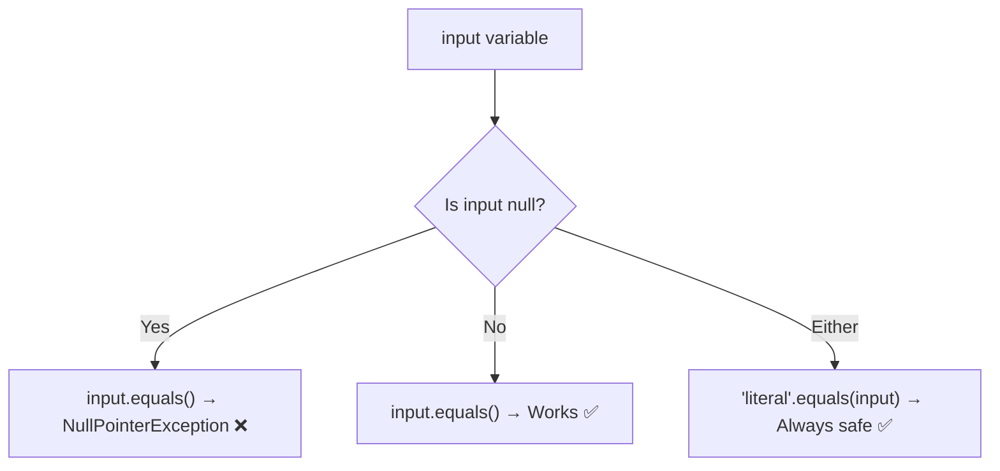
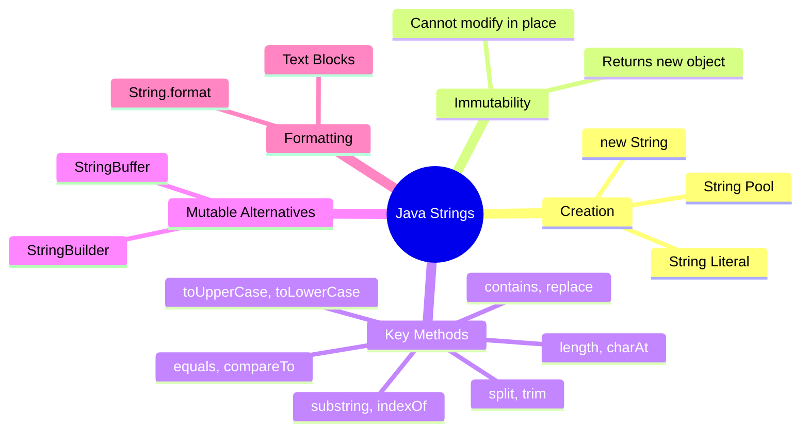
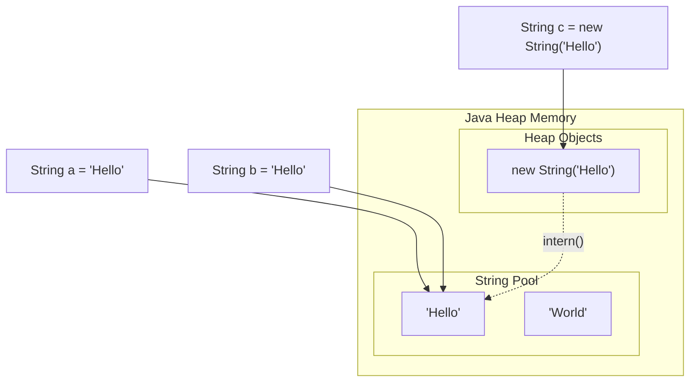
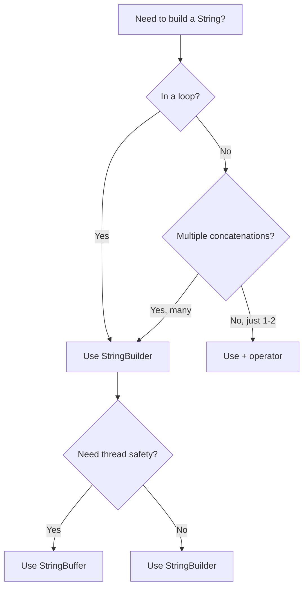

# Strings and Methods — Junior Level

## Table of Contents

1. [Introduction](#introduction)
2. [Prerequisites](#prerequisites)
3. [Glossary](#glossary)
4. [Core Concepts](#core-concepts)
5. [Real-World Analogies](#real-world-analogies)
6. [Mental Models](#mental-models)
7. [Pros & Cons](#pros--cons)
8. [Use Cases](#use-cases)
9. [Code Examples](#code-examples)
10. [Coding Patterns](#coding-patterns)
11. [Product Use / Feature](#product-use--feature)
12. [Error Handling](#error-handling)
13. [Security Considerations](#security-considerations)
14. [Performance Tips](#performance-tips)
15. [Best Practices](#best-practices)
16. [Edge Cases & Pitfalls](#edge-cases--pitfalls)
17. [Common Mistakes](#common-mistakes)
18. [Tricky Points](#tricky-points)
19. [Test](#test)
20. [Tricky Questions](#tricky-questions)
21. [Cheat Sheet](#cheat-sheet)
22. [Summary](#summary)
23. [Diagrams & Visual Aids](#diagrams--visual-aids)

---

## Introduction

> Focus: "What is it?" and "How to use it?"

A **String** in Java is a sequence of characters used to represent text. Strings are one of the most commonly used types in Java — from printing messages to processing user input, you will use Strings everywhere. Java treats `String` as a special class (not a primitive), which gives it powerful built-in methods for searching, comparing, and transforming text.

Understanding String methods is essential for every Java developer because nearly every program needs to manipulate text in some way — validating emails, formatting output, parsing data, or building messages.

---

## Prerequisites

What you should know before studying this topic:

- **Required:** Java Basic Syntax — you need to know how to declare variables, write `main` method, and compile/run programs
- **Required:** Data Types — understanding the difference between primitives and reference types
- **Helpful but not required:** Arrays — Strings are internally backed by character arrays

---

## Glossary

Key terms used in this topic:

| Term | Definition |
|------|-----------|
| **String** | An object that represents a sequence of characters in Java |
| **Immutability** | Once a String is created, its content cannot be changed |
| **String Pool** | A special area in JVM heap memory where String literals are stored to save memory |
| **String Literal** | A String created using double quotes, e.g., `"Hello"` |
| **StringBuilder** | A mutable alternative to String for building strings efficiently |
| **StringBuffer** | A thread-safe, mutable alternative to String (slower than StringBuilder) |
| **Concatenation** | Joining two or more strings together |
| **Text Block** | A multi-line string literal introduced in Java 13 using triple quotes `"""` |
| **char** | A primitive data type representing a single 16-bit Unicode character |
| **Index** | A zero-based position of a character within a String |

---

## Core Concepts

### Concept 1: The String Class

In Java, `String` is a class in the `java.lang` package. You can create strings in two ways:

```java
String s1 = "Hello";              // String literal (uses String Pool)
String s2 = new String("Hello");  // Using constructor (creates new object on heap)
```

- String literals are stored in the **String Pool** — if the same literal exists, Java reuses it.
- Using `new String()` always creates a new object, even if the same content exists in the pool.

### Concept 2: String Immutability

Once a String object is created, its value **cannot be changed**. Every operation that appears to modify a String actually creates a new String object.

```java
String name = "Java";
name.toUpperCase();        // returns "JAVA" but does NOT change 'name'
System.out.println(name);  // still prints "Java"

name = name.toUpperCase(); // now 'name' points to the new String "JAVA"
```

### Concept 3: String Pool

The String Pool is a special area in the JVM heap where Java stores unique string literals. When you write `"Hello"`, Java checks the pool first — if `"Hello"` already exists, it returns a reference to the existing object instead of creating a new one.

```java
String a = "Hello";
String b = "Hello";
System.out.println(a == b); // true — both reference the same pool object
```

### Concept 4: Common String Methods

Java's `String` class provides many useful methods:

- `length()` — returns the number of characters
- `charAt(int index)` — returns the character at a specific position
- `substring(int begin, int end)` — extracts a portion of the string
- `indexOf(String str)` — finds the first position of a substring
- `contains(CharSequence s)` — checks if a string contains a substring
- `replace(char old, char new)` — replaces characters
- `split(String regex)` — splits into an array
- `trim()` — removes leading and trailing whitespace
- `toUpperCase()` / `toLowerCase()` — case conversion
- `equals(Object obj)` — compares content
- `compareTo(String str)` — lexicographic comparison

### Concept 5: StringBuilder and StringBuffer

When you need to build a string by repeatedly appending, use `StringBuilder` (or `StringBuffer` for thread safety). They are **mutable** — you can change their content without creating new objects.

```java
StringBuilder sb = new StringBuilder();
sb.append("Hello");
sb.append(" ");
sb.append("World");
String result = sb.toString(); // "Hello World"
```

### Concept 6: String Formatting

Java provides several ways to format strings:

```java
String formatted = String.format("Name: %s, Age: %d", "Alice", 30);
// Java 15+
String formatted2 = "Name: %s, Age: %d".formatted("Alice", 30);
```

### Concept 7: Text Blocks (Java 13+)

Text blocks let you write multi-line strings more readably:

```java
String json = """
        {
            "name": "Alice",
            "age": 30
        }
        """;
```

---

## Real-World Analogies

| Concept | Analogy |
|---------|--------|
| **String Immutability** | A String is like a printed book — you cannot change the text inside. If you want different text, you must print a new book. The old book still exists until recycled (garbage collected). |
| **String Pool** | The String Pool is like a library's catalog — if someone already wrote a book with the title "Hello", the library shares that same copy instead of printing a duplicate. |
| **StringBuilder** | StringBuilder is like a whiteboard — you can erase and rewrite text on it as many times as you want without buying a new whiteboard. |
| **charAt()** | Like house numbers on a street — each character has its own address (index), and you can look up any character by its position number. |

---

## Mental Models

**The intuition:** Think of a String as a sealed envelope containing a message. You can read the message (use methods like `charAt`, `length`), you can make a photocopy with changes (methods like `toUpperCase`, `replace`), but you can never alter the original message inside the envelope.

**Why this model helps:** This prevents the common mistake of calling a String method and forgetting to capture the return value. Since the original String never changes, you must always assign the result to a variable.

**The StringBuilder intuition:** Think of StringBuilder as a notepad where you keep scribbling notes. You can add text, erase text, insert text anywhere — it is your working draft. When you are done, you tear the page out and hand it to someone as a finished String (`toString()`).

---

## Pros & Cons

| Pros | Cons |
|------|------|
| Immutability makes Strings safe for multithreading | Concatenation in loops creates many temporary objects |
| String Pool saves memory for repeated literals | Cannot modify in place — new object for every change |
| Rich set of built-in methods | Some methods use regex internally (e.g., `split`), which can be slow |
| Strings are hashable and safe as Map keys | Comparing with `==` instead of `.equals()` is a common source of bugs |

### When to use:
- When you need text data that will not change frequently
- When you need a safe key for HashMap or HashSet

### When NOT to use:
- When building strings in a loop — use `StringBuilder` instead
- When you need mutable character sequences

---

## Use Cases

- **Use Case 1:** Validating user input — checking if an email contains `@`, trimming whitespace from form fields
- **Use Case 2:** Parsing CSV data — splitting lines by commas, extracting columns with `substring`
- **Use Case 3:** Building SQL queries or JSON responses — using `StringBuilder` or `String.format`
- **Use Case 4:** Logging and debugging — concatenating variable values into log messages

---

## Code Examples

### Example 1: Basic String Operations

```java
public class StringBasics {
    public static void main(String[] args) {
        String greeting = "Hello, World!";

        // Length
        System.out.println("Length: " + greeting.length()); // 13

        // Character at index
        System.out.println("Char at 0: " + greeting.charAt(0)); // H

        // Substring
        System.out.println("Substring: " + greeting.substring(0, 5)); // Hello

        // Index of
        System.out.println("Index of 'World': " + greeting.indexOf("World")); // 7

        // Contains
        System.out.println("Contains 'World': " + greeting.contains("World")); // true

        // Replace
        System.out.println("Replace: " + greeting.replace("World", "Java")); // Hello, Java!

        // Split
        String csv = "apple,banana,cherry";
        String[] fruits = csv.split(",");
        for (String fruit : fruits) {
            System.out.println(fruit);
        }

        // Trim
        String padded = "   hello   ";
        System.out.println("Trimmed: '" + padded.trim() + "'"); // 'hello'

        // Case conversion
        System.out.println("Upper: " + greeting.toUpperCase()); // HELLO, WORLD!
        System.out.println("Lower: " + greeting.toLowerCase()); // hello, world!
    }
}
```

**What it does:** Demonstrates the most commonly used String methods.
**How to run:** `javac StringBasics.java && java StringBasics`

### Example 2: String Comparison

```java
public class StringComparison {
    public static void main(String[] args) {
        String a = "Hello";
        String b = "Hello";
        String c = new String("Hello");

        // == compares references (memory address)
        System.out.println(a == b);       // true  (both from String Pool)
        System.out.println(a == c);       // false (c is a new object)

        // .equals() compares content
        System.out.println(a.equals(b));  // true
        System.out.println(a.equals(c));  // true

        // .equalsIgnoreCase() — case-insensitive comparison
        System.out.println("hello".equalsIgnoreCase("HELLO")); // true

        // .compareTo() — lexicographic comparison
        System.out.println("apple".compareTo("banana")); // negative (apple < banana)
        System.out.println("banana".compareTo("apple")); // positive (banana > apple)
        System.out.println("apple".compareTo("apple"));  // 0 (equal)
    }
}
```

**What it does:** Shows the difference between `==` and `.equals()`, and how `compareTo` works.
**How to run:** `javac StringComparison.java && java StringComparison`

### Example 3: StringBuilder in Action

```java
public class StringBuilderDemo {
    public static void main(String[] args) {
        // Building a string in a loop — use StringBuilder
        StringBuilder sb = new StringBuilder();
        for (int i = 1; i <= 5; i++) {
            sb.append("Item ").append(i);
            if (i < 5) sb.append(", ");
        }
        String result = sb.toString();
        System.out.println(result); // Item 1, Item 2, Item 3, Item 4, Item 5

        // Other StringBuilder methods
        StringBuilder builder = new StringBuilder("Hello World");
        builder.insert(5, ",");       // "Hello, World"
        builder.delete(5, 6);         // "Hello World"
        builder.replace(6, 11, "Java"); // "Hello Java"
        builder.reverse();             // "avaJ olleH"
        System.out.println(builder);
    }
}
```

**What it does:** Demonstrates efficient string building with StringBuilder.
**How to run:** `javac StringBuilderDemo.java && java StringBuilderDemo`

### Example 4: Text Blocks and Formatting

```java
public class StringFormatting {
    public static void main(String[] args) {
        // String.format
        String name = "Alice";
        int age = 30;
        double gpa = 3.85;

        String info = String.format("Name: %s | Age: %d | GPA: %.1f", name, age, gpa);
        System.out.println(info); // Name: Alice | Age: 30 | GPA: 3.9

        // Text block (Java 13+)
        String html = """
                <html>
                    <body>
                        <h1>Hello, %s!</h1>
                    </body>
                </html>
                """.formatted(name);
        System.out.println(html);
    }
}
```

**What it does:** Shows String formatting and text blocks.
**How to run:** `javac StringFormatting.java && java StringFormatting` (requires Java 15+ for `.formatted()`)

---

## Coding Patterns

### Pattern 1: Null-Safe String Comparison

**Intent:** Avoid NullPointerException when comparing strings.
**When to use:** Whenever comparing a variable that might be null.

```java
// ❌ Can throw NullPointerException
String input = getUserInput(); // might return null
if (input.equals("yes")) { ... }

// ✅ Null-safe — put the literal first
if ("yes".equals(input)) { ... }

// ✅ Or use Objects.equals (Java 7+)
if (java.util.Objects.equals(input, "yes")) { ... }
```

**Diagram:**



**Remember:** Always put the known non-null value on the left side of `.equals()`.

---

### Pattern 2: String Building in Loops

**Intent:** Efficiently concatenate strings inside loops without creating garbage objects.
**When to use:** Any time you are building a string through iteration.

```java
// ❌ Slow — creates a new String object each iteration
String result = "";
for (int i = 0; i < 1000; i++) {
    result += "item" + i + ", ";
}

// ✅ Fast — uses a single mutable buffer
StringBuilder sb = new StringBuilder();
for (int i = 0; i < 1000; i++) {
    sb.append("item").append(i).append(", ");
}
String result = sb.toString();
```

**Diagram:**

```mermaid
sequenceDiagram
    participant Loop
    participant StringBuilder
    participant Result
    Loop->>StringBuilder: append("item")
    Loop->>StringBuilder: append(i)
    Loop->>StringBuilder: append(", ")
    Note over Loop,StringBuilder: Repeats 1000 times<br/>(single object)
    StringBuilder-->>Result: toString()
```

---

## Product Use / Feature

### 1. Spring Boot — Request Validation

- **How it uses Strings:** Spring Boot validates incoming request parameters (e.g., checking if a username is blank using `String.isBlank()`)
- **Why it matters:** Almost every web endpoint processes String input from HTTP requests

### 2. Log4j / SLF4J — Logging

- **How it uses Strings:** Log messages are built using parameterized strings (`log.info("User {} logged in", username)`) to avoid unnecessary String concatenation when log level is disabled
- **Why it matters:** Efficient String handling in logging can significantly reduce application overhead

### 3. Jackson / Gson — JSON Processing

- **How it uses Strings:** JSON serialization/deserialization relies heavily on String parsing and formatting
- **Why it matters:** Most modern Java applications exchange data as JSON strings

---

## Error Handling

### Error 1: StringIndexOutOfBoundsException

```java
String s = "Hello";
char c = s.charAt(5); // StringIndexOutOfBoundsException — valid indices are 0-4
```

**Why it happens:** Accessing an index equal to or greater than the string length, or a negative index.
**How to fix:**

```java
if (index >= 0 && index < s.length()) {
    char c = s.charAt(index);
}
```

### Error 2: NullPointerException

```java
String s = null;
int len = s.length(); // NullPointerException
```

**Why it happens:** Calling a method on a null reference.
**How to fix:**

```java
if (s != null) {
    int len = s.length();
}
// Or use Optional
```

### Error 3: NumberFormatException with parseInt

```java
String input = "abc";
int num = Integer.parseInt(input); // NumberFormatException
```

**Why it happens:** Trying to parse a non-numeric string as a number.
**How to fix:**

```java
try {
    int num = Integer.parseInt(input);
} catch (NumberFormatException e) {
    System.out.println("Invalid number: " + input);
}
```

---

## Security Considerations

### 1. SQL Injection via String Concatenation

```java
// ❌ Insecure — user input directly in SQL
String query = "SELECT * FROM users WHERE name = '" + userInput + "'";

// ✅ Secure — use PreparedStatement
PreparedStatement ps = conn.prepareStatement("SELECT * FROM users WHERE name = ?");
ps.setString(1, userInput);
```

**Risk:** Attackers can inject malicious SQL commands through user-provided strings.
**Mitigation:** Always use parameterized queries.

### 2. Sensitive Data in Strings

```java
// ❌ Passwords as Strings remain in memory (String Pool)
String password = "secret123";

// ✅ Use char[] for sensitive data — can be cleared after use
char[] password = {'s','e','c','r','e','t','1','2','3'};
// ... use password ...
Arrays.fill(password, '\0'); // wipe from memory
```

**Risk:** Strings are immutable and may linger in the String Pool or heap, visible to memory dumps.
**Mitigation:** Use `char[]` for passwords and clear them after use.

---

## Performance Tips

### Tip 1: Use StringBuilder for Concatenation in Loops

```java
// ❌ Slow — O(n^2) due to creating new String objects
String result = "";
for (int i = 0; i < 10000; i++) {
    result += i;
}

// ✅ Fast — O(n)
StringBuilder sb = new StringBuilder();
for (int i = 0; i < 10000; i++) {
    sb.append(i);
}
```

**Why it's faster:** StringBuilder modifies an internal buffer instead of creating a new String object on every append.

### Tip 2: Pre-size StringBuilder

```java
// ❌ Default capacity (16) — may need to resize many times
StringBuilder sb = new StringBuilder();

// ✅ Pre-sized — avoids internal array resizing
StringBuilder sb = new StringBuilder(1024);
```

**Why it's faster:** Avoids multiple array copy operations during resizing.

### Tip 3: Use equals() Not ==

```java
// ❌ Unreliable — may work with literals but fails with new String()
if (a == b) { ... }

// ✅ Reliable — always compares content
if (a.equals(b)) { ... }
```

**Why:** `==` compares memory addresses, `.equals()` compares the actual character content.

---

## Best Practices

- **Always use `.equals()` for String comparison** — never `==` for content comparison
- **Use StringBuilder for concatenation in loops** — avoid `+=` in loops
- **Put literals first in comparisons** — `"value".equals(variable)` prevents NullPointerException
- **Use `String.isEmpty()` or `String.isBlank()` (Java 11+)** — instead of comparing with `""` or checking `length() == 0`
- **Prefer `String.format()` or text blocks for complex string building** — more readable than concatenation

---

## Edge Cases & Pitfalls

### Pitfall 1: Empty String vs Null

```java
String empty = "";
String blank = "   ";
String nul = null;

System.out.println(empty.isEmpty());  // true
System.out.println(blank.isEmpty());  // false
System.out.println(blank.isBlank());  // true  (Java 11+)
System.out.println(nul.isEmpty());    // NullPointerException!
```

**What happens:** `isEmpty()` checks if length is 0; `isBlank()` checks if all characters are whitespace; calling either on null throws NPE.
**How to fix:** Always null-check before calling String methods.

### Pitfall 2: substring() Index Behavior

```java
String s = "Hello";
System.out.println(s.substring(2, 4)); // "ll" — end index is exclusive
System.out.println(s.substring(5));     // "" — returns empty string
System.out.println(s.substring(6));     // StringIndexOutOfBoundsException
```

**What happens:** The end index is exclusive, and going beyond the length throws an exception.

---

## Common Mistakes

### Mistake 1: Using == Instead of .equals()

```java
// ❌ Wrong — compares references
String a = new String("Hello");
String b = new String("Hello");
if (a == b) { ... } // false!

// ✅ Correct — compares content
if (a.equals(b)) { ... } // true
```

### Mistake 2: Ignoring Return Value of String Methods

```java
// ❌ Wrong — toUpperCase() returns a NEW string
String name = "alice";
name.toUpperCase(); // return value discarded!
System.out.println(name); // still "alice"

// ✅ Correct — capture the return value
name = name.toUpperCase();
System.out.println(name); // "ALICE"
```

### Mistake 3: Concatenating in a Loop

```java
// ❌ Wrong — creates many temporary String objects
String result = "";
for (String item : items) {
    result += item + ", ";
}

// ✅ Correct — use StringBuilder
StringBuilder sb = new StringBuilder();
for (String item : items) {
    sb.append(item).append(", ");
}
```

### Mistake 4: Not Handling Null Strings

```java
// ❌ Wrong — crashes if getUserName() returns null
String greeting = "Hello, " + getUserName().toUpperCase();

// ✅ Correct — null check first
String name = getUserName();
String greeting = "Hello, " + (name != null ? name.toUpperCase() : "Guest");
```

---

## Tricky Points

### Tricky Point 1: String Interning

```java
String a = "Hello";
String b = "Hello";
String c = new String("Hello");
String d = c.intern();

System.out.println(a == b); // true  — same pool reference
System.out.println(a == c); // false — c is on heap
System.out.println(a == d); // true  — intern() returns pool reference
```

**Why it's tricky:** `intern()` returns the String Pool reference, making `==` return true.
**Key takeaway:** Use `.equals()` for comparison; `intern()` is an optimization tool, not a comparison tool.

### Tricky Point 2: String Concatenation with + and null

```java
String s = null;
String result = s + " world"; // "null world" — NOT a NullPointerException!
System.out.println(result);
```

**Why it's tricky:** The `+` operator converts `null` to the string `"null"` instead of throwing an exception.
**Key takeaway:** String concatenation with `+` never throws NPE, but the result may not be what you expect.

### Tricky Point 3: split() with Special Characters

```java
String s = "a.b.c";
String[] parts = s.split(".");  // Empty array! "." is regex for "any character"
String[] correct = s.split("\\."); // ["a", "b", "c"]
```

**Why it's tricky:** `split()` takes a regex, and `.` means "any character" in regex.
**Key takeaway:** Escape special regex characters with `\\` when using `split()`.

---

## Test

### Multiple Choice

**1. What is the output of this code?**
```java
String a = "Hello";
String b = new String("Hello");
System.out.println(a == b);
System.out.println(a.equals(b));
```

- A) true, true
- B) false, false
- C) false, true
- D) true, false

<details>
<summary>Answer</summary>

**C) false, true** — `==` compares references (a is in pool, b is on heap — different addresses). `.equals()` compares content (both are "Hello").
</details>

**2. What happens when you call `toUpperCase()` on a String?**

- A) The original String is modified to uppercase
- B) A new String is returned; the original is unchanged
- C) It throws an UnsupportedOperationException
- D) It modifies the internal char array

<details>
<summary>Answer</summary>

**B)** — Strings are immutable. `toUpperCase()` creates and returns a new String object.
</details>

### True or False

**3. `String` in Java is a primitive data type.**

<details>
<summary>Answer</summary>

**False** — `String` is a class (reference type) in `java.lang`, not a primitive. Primitives are `int`, `char`, `boolean`, etc.
</details>

**4. `StringBuilder` is thread-safe.**

<details>
<summary>Answer</summary>

**False** — `StringBuilder` is NOT thread-safe. `StringBuffer` is the thread-safe alternative (with synchronized methods).
</details>

### What's the Output?

**5. What does this code print?**

```java
String s = "Hello";
s.concat(" World");
System.out.println(s);
```

<details>
<summary>Answer</summary>

Output: `Hello`

Explanation: `concat()` returns a new String but the return value is not captured. The original `s` is unchanged because Strings are immutable.
</details>

**6. What does this code print?**

```java
String s = "Java";
System.out.println(s.substring(1, 3));
```

<details>
<summary>Answer</summary>

Output: `av`

Explanation: `substring(1, 3)` extracts characters from index 1 (inclusive) to index 3 (exclusive), which are 'a' and 'v'.
</details>

**7. What does this code print?**

```java
String a = "Hello";
String b = "Hel" + "lo";
System.out.println(a == b);
```

<details>
<summary>Answer</summary>

Output: `true`

Explanation: The compiler optimizes `"Hel" + "lo"` to `"Hello"` at compile time (constant folding), so both `a` and `b` refer to the same String Pool object.
</details>

---

## Tricky Questions

**1. What is the output?**

```java
String s1 = "Java";
String s2 = "Ja";
String s3 = s2 + "va";
System.out.println(s1 == s3);
```

- A) true
- B) false
- C) Compilation error
- D) Runtime error

<details>
<summary>Answer</summary>

**B) false** — Unlike compile-time constant folding (`"Ja" + "va"`), `s2 + "va"` involves a variable, so it creates a new String at runtime. The result is not from the String Pool.
</details>

**2. How many String objects are created?**

```java
String s = new String("Hello");
```

- A) 1
- B) 2
- C) 1 or 2
- D) 0

<details>
<summary>Answer</summary>

**C) 1 or 2** — If "Hello" is not already in the String Pool, two objects are created: one in the pool (the literal) and one on the heap (from `new`). If "Hello" already exists in the pool, only one new object (on the heap) is created.
</details>

**3. What is the output?**

```java
String s = "";
System.out.println(s.isEmpty());
System.out.println(s.length());
System.out.println(s == "");
```

- A) true, 0, true
- B) true, 0, false
- C) false, 0, true
- D) Compilation error

<details>
<summary>Answer</summary>

**A) true, 0, true** — An empty string literal `""` is stored in the String Pool. Both `s` and `""` reference the same pool object, so `==` returns true.
</details>

**4. What does this print?**

```java
String s = null + "test";
System.out.println(s);
```

- A) NullPointerException
- B) test
- C) nulltest
- D) Compilation error

<details>
<summary>Answer</summary>

**C) nulltest** — When using the `+` operator for concatenation, Java converts `null` to the string `"null"`, resulting in `"nulltest"`.
</details>

---

## Cheat Sheet

| What | Syntax | Example |
|------|--------|---------|
| Create String | `String s = "text"` | `String name = "Alice"` |
| Length | `s.length()` | `"Hello".length()` → 5 |
| Char at index | `s.charAt(i)` | `"Hello".charAt(0)` → 'H' |
| Substring | `s.substring(start, end)` | `"Hello".substring(1,4)` → "ell" |
| Find index | `s.indexOf("x")` | `"Hello".indexOf("ll")` → 2 |
| Contains | `s.contains("x")` | `"Hello".contains("ell")` → true |
| Replace | `s.replace(old, new)` | `"Hello".replace('l','r')` → "Herro" |
| Split | `s.split("delim")` | `"a,b,c".split(",")` → ["a","b","c"] |
| Trim | `s.trim()` | `" hi ".trim()` → "hi" |
| To upper/lower | `s.toUpperCase()` | `"hi".toUpperCase()` → "HI" |
| Compare content | `s.equals(other)` | `"Hi".equals("Hi")` → true |
| Compare order | `s.compareTo(other)` | `"a".compareTo("b")` → -1 |
| Format | `String.format("%s", v)` | `String.format("Hi %s", "Bob")` |
| StringBuilder | `new StringBuilder()` | `sb.append("x").toString()` |
| Join | `String.join(delim, parts)` | `String.join(",", "a", "b")` → "a,b" |

---

## Summary

- **String** is an immutable class representing text in Java
- Always use `.equals()` for content comparison, never `==`
- The **String Pool** optimizes memory by reusing string literals
- Use **StringBuilder** for efficient string concatenation in loops
- **StringBuffer** is the thread-safe (but slower) alternative to StringBuilder
- String methods always return new strings — the original is never modified
- Use **text blocks** (`"""..."""`) for multi-line strings in Java 13+
- Escape regex special characters when using `split()`

**Next step:** Learn about Arrays and how they relate to Strings (e.g., `toCharArray()`, `String.valueOf(char[])`).

---

## Diagrams & Visual Aids

### Mind Map



### String Pool Visualization



### String vs StringBuilder Decision Flow


