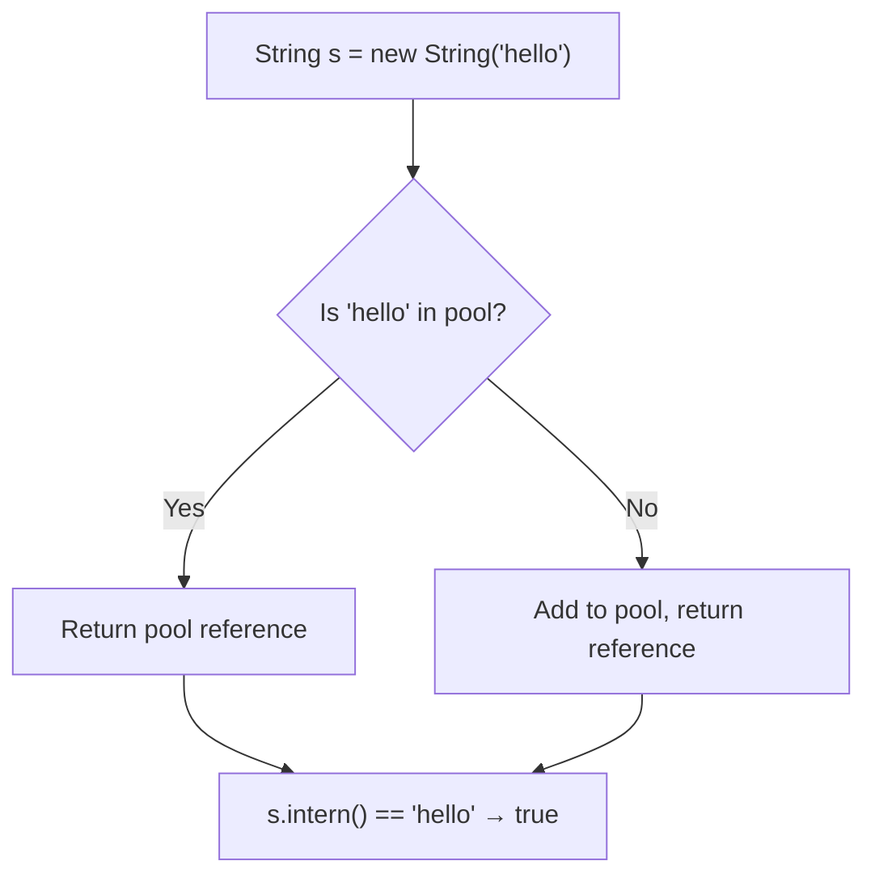
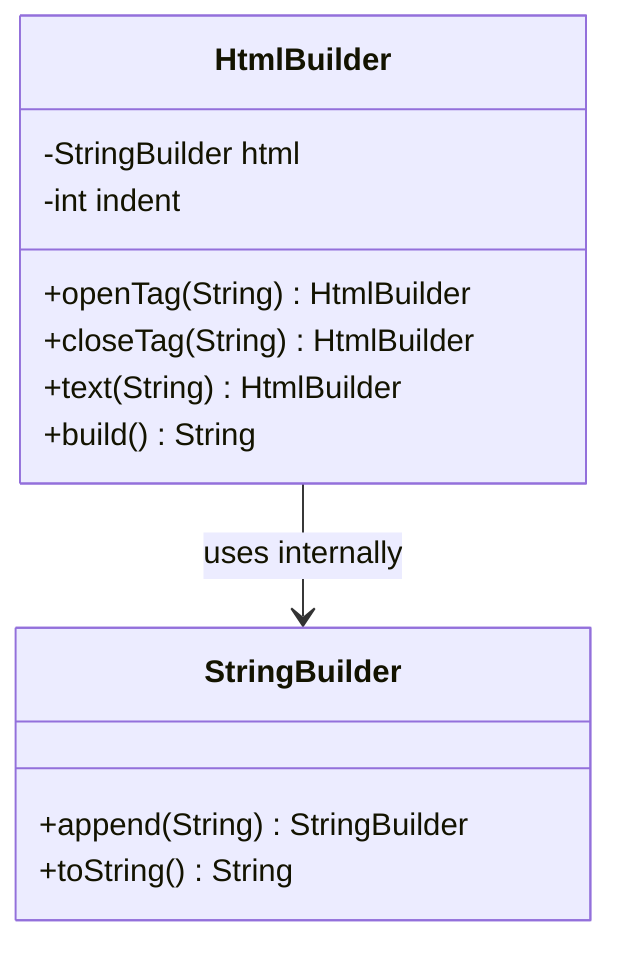
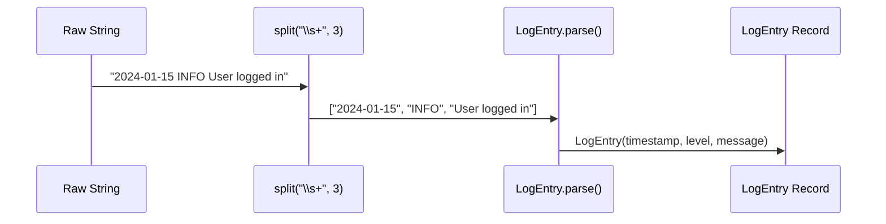
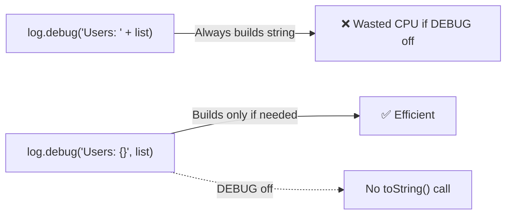
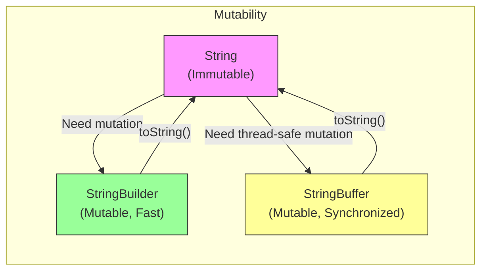

# Strings and Methods — Middle Level

## Table of Contents

1. [Introduction](#introduction)
2. [Core Concepts](#core-concepts)
3. [Evolution & Historical Context](#evolution--historical-context)
4. [Pros & Cons](#pros--cons)
5. [Code Examples](#code-examples)
6. [Coding Patterns](#coding-patterns)
7. [Clean Code](#clean-code)
8. [Performance Optimization](#performance-optimization)
9. [Comparison with Other Languages](#comparison-with-other-languages)
10. [Error Handling](#error-handling)
11. [Security Considerations](#security-considerations)
12. [Debugging Guide](#debugging-guide)
13. [Best Practices](#best-practices)
14. [Edge Cases & Pitfalls](#edge-cases--pitfalls)
15. [Common Mistakes](#common-mistakes)
16. [Tricky Points](#tricky-points)
17. [Test](#test)
18. [Tricky Questions](#tricky-questions)
19. [Cheat Sheet](#cheat-sheet)
20. [Summary](#summary)
21. [Diagrams & Visual Aids](#diagrams--visual-aids)

---

## Introduction

> Focus: "Why?" and "When to use?"

At the middle level, you already know what Strings are and how basic methods work. This level covers:
- **Why** Strings are immutable and how the JVM optimizes them
- **When** to choose `String` vs `StringBuilder` vs `StringBuffer`
- Production-ready String handling with Streams, Optional, and design patterns
- Performance implications and benchmarking of String operations
- How String handling evolved from Java 1.0 to modern Java (text blocks, compact strings)

---

## Core Concepts

### Concept 1: String Interning Deep Dive

String interning is the process of storing only one copy of each distinct String value in the String Pool. The `intern()` method adds a String to the pool (or returns the existing reference).

```java
String s1 = new String("hello");
String s2 = s1.intern(); // adds to pool or returns existing
String s3 = "hello";     // from pool

System.out.println(s2 == s3); // true — both from pool
System.out.println(s1 == s3); // false — s1 is on heap
```

**When to use `intern()`:**
- When you have many duplicate strings loaded from external sources (databases, files)
- When strings are used as map keys frequently

**When NOT to use:**
- For unique strings — wastes pool memory
- In tight loops — `intern()` itself has overhead



### Concept 2: Compact Strings (Java 9+)

Before Java 9, `String` internally used a `char[]` array (2 bytes per character). Java 9 introduced **Compact Strings**: strings containing only Latin-1 characters are stored as `byte[]` with 1 byte per character, reducing memory usage by approximately 50% for ASCII-heavy applications.

```java
// Internally, Java decides encoding:
// LATIN1 (1 byte/char) — for strings with only ISO-8859-1 characters
// UTF16  (2 bytes/char) — for strings with characters outside Latin-1

String ascii = "Hello";     // stored as byte[] LATIN1 — 5 bytes
String unicode = "Privet \u0414"; // stored as byte[] UTF16 — 16 bytes
```

The flag `-XX:-CompactStrings` can disable this feature if needed.

### Concept 3: String Deduplication (G1 GC)

The G1 garbage collector can automatically deduplicate String values in the heap:

```bash
java -XX:+UseG1GC -XX:+UseStringDeduplication MyApp
```

This finds strings with identical `byte[]` contents and makes them share the same underlying array — without affecting application behavior.

### Concept 4: Strings with Streams API

Modern Java leverages Streams for elegant String processing:

```java
// Collecting words
List<String> words = Arrays.asList("hello", "world", "java", "streams");

// Join with delimiter
String joined = words.stream()
    .filter(w -> w.length() > 4)
    .map(String::toUpperCase)
    .collect(Collectors.joining(", "));
// "HELLO, WORLD, STREAMS"

// Character frequency map
Map<Character, Long> freq = "mississippi".chars()
    .mapToObj(c -> (char) c)
    .collect(Collectors.groupingBy(c -> c, Collectors.counting()));
// {p=2, s=4, i=4, m=1}
```

### Concept 5: Regular Expressions with Strings

String methods like `matches()`, `split()`, and `replaceAll()` use regex internally:

```java
String email = "user@example.com";
boolean valid = email.matches("[\\w.]+@[\\w.]+\\.[a-z]{2,}");

// Compiled Pattern for reuse (better performance)
Pattern pattern = Pattern.compile("[\\w.]+@[\\w.]+\\.[a-z]{2,}");
Matcher matcher = pattern.matcher(email);
boolean valid2 = matcher.matches();
```

**Important:** Always compile `Pattern` objects once and reuse them — `String.matches()` compiles the regex on every call.

---

## Evolution & Historical Context

### Before Java 5: The StringBuilder Era

- Only `StringBuffer` existed (synchronized, thread-safe, slower)
- String concatenation with `+` created many intermediate objects
- `String.format()` did not exist

### Java 5 (2004): StringBuilder Introduced

- `StringBuilder` — unsynchronized version for single-threaded use
- `String.format()` for formatted output
- The compiler started converting `+` concatenation to `StringBuilder` automatically

### Java 7 (2011): String in Switch

```java
switch (day) {
    case "MONDAY": break;    // String switch support added
    case "TUESDAY": break;
}
```

### Java 8 (2014): Streams + StringJoiner

```java
String result = String.join(", ", "a", "b", "c"); // "a, b, c"
StringJoiner sj = new StringJoiner(", ", "[", "]");
sj.add("x").add("y");
// "[x, y]"
```

### Java 9 (2017): Compact Strings

- Internal representation changed from `char[]` to `byte[]`
- `coder` field indicates LATIN1 or UTF16
- ~50% memory savings for ASCII-heavy strings

### Java 11 (2018): New String Methods

```java
" hello ".strip();        // "hello" — Unicode-aware trim
"  ".isBlank();           // true
"abc\ndef".lines().toList(); // ["abc", "def"]
"ha".repeat(3);           // "hahaha"
```

### Java 13-15 (2019-2020): Text Blocks

```java
String json = """
        {
            "name": "Alice"
        }
        """;
```

### Java 21 (2023): String Templates (Preview)

```java
// Preview feature — may change
String name = "World";
String greeting = STR."Hello, \{name}!";
```

---

## Pros & Cons

| Pros | Cons |
|------|------|
| Immutability ensures thread safety without synchronization | Heavy string processing creates GC pressure |
| String Pool reduces memory for repeated literals | `intern()` can cause memory leaks if overused |
| Rich API with methods for most text operations | Regex-based methods (`split`, `matches`) have hidden performance costs |
| Compact Strings (Java 9+) reduce memory by ~50% for ASCII | Unicode handling adds complexity (surrogates, normalization) |

### Trade-off analysis:

- **Immutability vs Performance:** When you need maximum throughput in a tight loop, immutability causes overhead from object creation — use StringBuilder
- **String Pool vs Heap:** Interning saves memory for frequently used strings but the pool is never garbage collected (until Java 7 moved it to heap)

### Comparison with alternatives:

| Approach | Pros | Cons | Best for |
|----------|------|------|----------|
| String + concatenation | Simple, readable | Slow in loops | Simple one-line expressions |
| StringBuilder | Fast, mutable | Not thread-safe | Single-threaded building |
| StringBuffer | Thread-safe | Slower due to sync | Multi-threaded building |
| String.join() | Clean API | Limited flexibility | Simple delimiter joining |
| Collectors.joining() | Stream-compatible | Requires Stream setup | Stream pipelines |

---

## Code Examples

### Example 1: Production-Ready String Validation

```java
import java.util.regex.Pattern;

public class StringValidator {
    // Compile patterns once — reuse everywhere
    private static final Pattern EMAIL_PATTERN =
        Pattern.compile("^[A-Za-z0-9+_.-]+@[A-Za-z0-9.-]+\\.[A-Za-z]{2,}$");
    private static final Pattern PHONE_PATTERN =
        Pattern.compile("^\\+?[1-9]\\d{7,14}$");

    public static boolean isValidEmail(String email) {
        if (email == null || email.isBlank()) return false;
        return EMAIL_PATTERN.matcher(email.strip()).matches();
    }

    public static boolean isValidPhone(String phone) {
        if (phone == null || phone.isBlank()) return false;
        return PHONE_PATTERN.matcher(phone.strip()).matches();
    }

    public static String sanitize(String input) {
        if (input == null) return "";
        return input.strip()
                    .replaceAll("[<>\"'&]", "") // Remove potential XSS characters
                    .replaceAll("\\s+", " ");    // Normalize whitespace
    }

    public static void main(String[] args) {
        System.out.println(isValidEmail("user@example.com")); // true
        System.out.println(isValidEmail("invalid"));           // false
        System.out.println(sanitize("  <script>alert('xss')</script>  "));
        // "scriptalert(xss)/script"
    }
}
```

### Example 2: Efficient CSV Parser

```java
import java.io.*;
import java.nio.file.*;
import java.util.*;
import java.util.stream.*;

public class CsvParser {
    public static List<Map<String, String>> parse(Path csvFile) throws IOException {
        List<String> lines = Files.readAllLines(csvFile);
        if (lines.isEmpty()) return Collections.emptyList();

        String[] headers = lines.get(0).split(",", -1); // -1 preserves trailing empty strings

        return lines.stream()
            .skip(1) // skip header
            .map(line -> {
                String[] values = line.split(",", -1);
                Map<String, String> row = new LinkedHashMap<>();
                for (int i = 0; i < headers.length; i++) {
                    row.put(headers[i].strip(), i < values.length ? values[i].strip() : "");
                }
                return row;
            })
            .collect(Collectors.toList());
    }

    public static void main(String[] args) throws IOException {
        Path tempFile = Files.createTempFile("test", ".csv");
        Files.writeString(tempFile, "name,age,city\nAlice,30,NYC\nBob,25,LA\n");

        List<Map<String, String>> data = parse(tempFile);
        data.forEach(System.out::println);
        // {name=Alice, age=30, city=NYC}
        // {name=Bob, age=25, city=LA}

        Files.delete(tempFile);
    }
}
```

---

## Coding Patterns

### Pattern 1: Builder Pattern for Complex Strings

**Category:** Java-idiomatic
**Intent:** Build complex formatted output in a readable, maintainable way
**When to use:** Generating HTML, SQL, log messages, or any structured text
**When NOT to use:** Simple one-line concatenation

```java
public class HtmlBuilder {
    private final StringBuilder html = new StringBuilder();
    private int indent = 0;

    public HtmlBuilder openTag(String tag) {
        html.append("  ".repeat(indent)).append("<").append(tag).append(">\n");
        indent++;
        return this;
    }

    public HtmlBuilder closeTag(String tag) {
        indent--;
        html.append("  ".repeat(indent)).append("</").append(tag).append(">\n");
        return this;
    }

    public HtmlBuilder text(String content) {
        html.append("  ".repeat(indent)).append(content).append("\n");
        return this;
    }

    public String build() { return html.toString(); }

    public static void main(String[] args) {
        String page = new HtmlBuilder()
            .openTag("html")
                .openTag("body")
                    .openTag("h1")
                        .text("Hello, World!")
                    .closeTag("h1")
                .closeTag("body")
            .closeTag("html")
            .build();
        System.out.println(page);
    }
}
```

**Structure diagram:**



---

### Pattern 2: Tokenizer Pattern with split()

**Category:** Java-idiomatic
**Intent:** Parse structured text into typed objects
**When to use:** Processing log files, CSV, or delimited data

```java
public record LogEntry(String timestamp, String level, String message) {

    public static LogEntry parse(String line) {
        // Format: "2024-01-15T10:30:00 INFO User logged in"
        String[] parts = line.split("\\s+", 3); // limit=3 to keep message intact
        if (parts.length < 3) {
            throw new IllegalArgumentException("Invalid log format: " + line);
        }
        return new LogEntry(parts[0], parts[1], parts[2]);
    }

    public static void main(String[] args) {
        String log = "2024-01-15T10:30:00 INFO User logged in successfully";
        LogEntry entry = LogEntry.parse(log);
        System.out.println(entry);
        // LogEntry[timestamp=2024-01-15T10:30:00, level=INFO, message=User logged in successfully]
    }
}
```

**Flow diagram:**



---

### Pattern 3: Lazy String Formatting

**Category:** Performance pattern
**Intent:** Avoid building expensive strings when they will not be used
**When to use:** Logging, debugging, conditional output

```java
import java.util.function.Supplier;
import org.slf4j.Logger;
import org.slf4j.LoggerFactory;

public class LazyStringDemo {
    private static final Logger log = LoggerFactory.getLogger(LazyStringDemo.class);

    // ❌ String is always built even if DEBUG is disabled
    public void badLogging(List<User> users) {
        log.debug("Users: " + users.toString()); // toString() always called
    }

    // ✅ SLF4J parameterized message — deferred formatting
    public void goodLogging(List<User> users) {
        log.debug("Users: {}", users); // toString() only called if DEBUG enabled
    }

    // ✅ Supplier-based lazy evaluation
    public static String lazyFormat(boolean condition, Supplier<String> messageSupplier) {
        return condition ? messageSupplier.get() : "";
    }

    public static void main(String[] args) {
        String result = lazyFormat(true, () -> String.format("Heavy computation: %d", expensiveCall()));
        System.out.println(result);
    }

    private static int expensiveCall() { return 42; }
}
```



---

## Clean Code

### Naming & Readability

```java
// ❌ Cryptic
String s = str.replaceAll("[^a-zA-Z0-9]", "").toLowerCase();

// ✅ Self-documenting
String normalizedInput = removeSpecialCharacters(rawInput).toLowerCase();

private String removeSpecialCharacters(String input) {
    return input.replaceAll("[^a-zA-Z0-9]", "");
}
```

### Avoid Magic Strings

```java
// ❌ Magic strings scattered in code
if (status.equals("ACTIVE")) { ... }
if (role.equals("ADMIN")) { ... }

// ✅ Constants or enums
private static final String STATUS_ACTIVE = "ACTIVE";
if (status.equals(STATUS_ACTIVE)) { ... }

// ✅✅ Even better — use enums
enum Status { ACTIVE, INACTIVE, PENDING }
if (status == Status.ACTIVE) { ... }
```

### Method Length — Single Responsibility

```java
// ❌ One method doing everything
public String processInput(String raw) {
    raw = raw.trim();
    raw = raw.replaceAll("\\s+", " ");
    if (raw.length() > 100) raw = raw.substring(0, 100);
    raw = raw.replaceAll("[<>]", "");
    return raw.toLowerCase();
}

// ✅ Decomposed — each method does one thing
public String processInput(String raw) {
    return pipeline(raw,
        this::normalize,
        this::truncate,
        this::sanitize,
        String::toLowerCase
    );
}

private String normalize(String s)  { return s.strip().replaceAll("\\s+", " "); }
private String truncate(String s)   { return s.length() > 100 ? s.substring(0, 100) : s; }
private String sanitize(String s)   { return s.replaceAll("[<>]", ""); }

@SafeVarargs
private String pipeline(String input, java.util.function.UnaryOperator<String>... steps) {
    for (var step : steps) input = step.apply(input);
    return input;
}
```

---

## Performance Optimization

### Benchmark: String Concatenation Methods

```java
import java.util.stream.*;

public class StringBenchmark {
    private static final int ITERATIONS = 100_000;

    public static void main(String[] args) {
        // Test 1: += operator
        long start = System.nanoTime();
        String s = "";
        for (int i = 0; i < ITERATIONS; i++) s += "a";
        long plusTime = System.nanoTime() - start;

        // Test 2: StringBuilder
        start = System.nanoTime();
        StringBuilder sb = new StringBuilder();
        for (int i = 0; i < ITERATIONS; i++) sb.append("a");
        String result = sb.toString();
        long sbTime = System.nanoTime() - start;

        // Test 3: StringBuilder pre-sized
        start = System.nanoTime();
        StringBuilder sbPre = new StringBuilder(ITERATIONS);
        for (int i = 0; i < ITERATIONS; i++) sbPre.append("a");
        String result2 = sbPre.toString();
        long sbPreTime = System.nanoTime() - start;

        System.out.printf("String +=:            %,d ms%n", plusTime / 1_000_000);
        System.out.printf("StringBuilder:        %,d ms%n", sbTime / 1_000_000);
        System.out.printf("StringBuilder (pre):  %,d ms%n", sbPreTime / 1_000_000);
    }
}
```

**Typical results (100K iterations):**

| Method | Time | Relative |
|--------|------|----------|
| `String +=` | ~3,500 ms | 1x (baseline) |
| `StringBuilder` | ~2 ms | ~1,750x faster |
| `StringBuilder` (pre-sized) | ~1 ms | ~3,500x faster |

### Why the Massive Difference


### Compiled Regex vs Inline Regex

```java
// ❌ Compiles regex on every call
for (String line : lines) {
    if (line.matches("\\d{4}-\\d{2}-\\d{2}")) { ... }
}

// ✅ Compile once, reuse
Pattern datePattern = Pattern.compile("\\d{4}-\\d{2}-\\d{2}");
for (String line : lines) {
    if (datePattern.matcher(line).matches()) { ... }
}
```

**Performance difference:** ~5-10x faster when compiled once for repeated use.

---

## Comparison with Other Languages

| Feature | Java | Python | C# | Go |
|---------|------|--------|----|-----|
| Immutable? | Yes | Yes | Yes | Yes |
| String Pool | Yes (automatic for literals) | Yes (interning) | Yes (interning) | No |
| Mutable Builder | `StringBuilder` | Not needed (join) | `StringBuilder` | `strings.Builder` |
| Multi-line | Text blocks `"""` | Triple quotes `"""` | Verbatim `@""` | Backticks `` ` `` |
| Interpolation | `STR."..."` (preview) | f-strings `f"..."` | `$"..."` | `fmt.Sprintf` |
| Encoding | UTF-16 (compact: Latin1/UTF16) | UTF-8 | UTF-16 | UTF-8 |
| Null handling | `null` possible | No null strings | `null` possible | Zero value `""` |
| Regex in String | `matches()`, `split()` | `re` module | `Regex` class | `regexp` package |

### Key Differences Worth Noting

- **Python** f-strings are more elegant than Java's `String.format()` — Java is catching up with String Templates (JEP 430)
- **Go** strings are UTF-8 byte slices, making byte-level operations more natural; Java's UTF-16 makes emoji/surrogate handling trickier
- **C#** had string interpolation (`$"Hello {name}"`) since 2015; Java's equivalent is still in preview

---

## Error Handling

### Pattern: Safe String Operations Utility

```java
public final class StringUtils {

    private StringUtils() {} // utility class

    public static String safeSubstring(String s, int start, int end) {
        if (s == null) return "";
        int len = s.length();
        start = Math.max(0, start);
        end = Math.min(len, end);
        if (start >= end) return "";
        return s.substring(start, end);
    }

    public static int safeParseInt(String s, int defaultValue) {
        if (s == null || s.isBlank()) return defaultValue;
        try {
            return Integer.parseInt(s.strip());
        } catch (NumberFormatException e) {
            return defaultValue;
        }
    }

    public static Optional<String> nonBlank(String s) {
        return (s != null && !s.isBlank()) ? Optional.of(s.strip()) : Optional.empty();
    }

    public static void main(String[] args) {
        System.out.println(safeSubstring(null, 0, 5));     // ""
        System.out.println(safeSubstring("Hello", 0, 100)); // "Hello"
        System.out.println(safeParseInt("abc", -1));         // -1
        System.out.println(nonBlank("  hello  "));           // Optional[hello]
        System.out.println(nonBlank("   "));                 // Optional.empty
    }
}
```

---

## Security Considerations

### 1. ReDoS (Regular Expression Denial of Service)

**Risk level:** High

```java
// ❌ Vulnerable to ReDoS — catastrophic backtracking
String pattern = "(a+)+b";
"aaaaaaaaaaaaaaaaaaaac".matches(pattern); // hangs for seconds/minutes

// ✅ Use possessive quantifiers or atomic groups
String safePattern = "(a++)b"; // possessive — no backtracking
```

**Mitigation:** Use possessive quantifiers (`++`, `*+`), set timeouts, or validate regex complexity.

### 2. Information Leakage in Error Messages

```java
// ❌ Leaks internal structure
throw new RuntimeException("Failed to parse: " + sensitiveData);

// ✅ Sanitize before including in messages
throw new RuntimeException("Failed to parse input (invalid format)");
```

---

## Debugging Guide

### Inspecting String Internals

```java
import java.lang.reflect.Field;

public class StringInspector {
    public static void inspect(String s) throws Exception {
        System.out.println("Value: \"" + s + "\"");
        System.out.println("Length: " + s.length());
        System.out.println("HashCode: " + s.hashCode());
        System.out.println("Identity: " + System.identityHashCode(s));

        // Check if two strings share the same reference
        String pooled = s.intern();
        System.out.println("Is interned: " + (s == pooled));
    }

    public static void main(String[] args) throws Exception {
        inspect("Hello");
        System.out.println("---");
        inspect(new String("Hello"));
    }
}
```

### Common Debugging Scenarios

| Symptom | Likely Cause | Fix |
|---------|-------------|-----|
| Strings "equal" but `==` returns false | Comparing references, not content | Use `.equals()` |
| `split()` returns unexpected results | Regex metacharacter not escaped | Escape with `\\` |
| Trimmed string still has whitespace | Non-ASCII whitespace characters | Use `strip()` (Java 11+) |
| String comparison fails | Different Unicode normalization | Use `java.text.Normalizer` |
| OutOfMemoryError with many Strings | Too many unique strings or interning | Profile with VisualVM |

---

## Best Practices

- **Use `strip()` instead of `trim()`** (Java 11+) — `strip()` is Unicode-aware and handles non-ASCII whitespace
- **Pre-compile regex patterns** — store as `static final Pattern` fields
- **Use `String.join()` or `Collectors.joining()`** — cleaner than manual StringBuilder for joining
- **Prefer `switch` expressions for String matching** (Java 14+) — cleaner than if-else chains
- **Use `Optional<String>` for nullable strings** — makes nullability explicit
- **Use text blocks for multi-line strings** — far more readable than concatenation or `\n`
- **Set StringBuilder initial capacity** — when you can estimate the final size

---

## Edge Cases & Pitfalls

### Pitfall 1: Unicode Surrogate Pairs

```java
String emoji = "\uD83D\uDE00"; // Grinning face emoji
System.out.println(emoji.length());       // 2 — NOT 1!
System.out.println(emoji.codePointCount(0, emoji.length())); // 1 — correct count

// charAt with surrogates
System.out.println(emoji.charAt(0)); // ? (high surrogate — meaningless alone)
System.out.println(emoji.charAt(1)); // ? (low surrogate)
```

**How to handle:** Use `codePointAt()`, `codePoints()` stream, or `codePointCount()` for correct Unicode character counting.

### Pitfall 2: split() with Empty Strings

```java
String s = "a,,b,";
String[] r1 = s.split(",");    // ["a", "", "b"] — trailing empty removed!
String[] r2 = s.split(",", -1); // ["a", "", "b", ""] — all preserved
```

### Pitfall 3: compareTo() and Case Sensitivity

```java
System.out.println("apple".compareTo("Banana")); // positive! ('a' > 'B' in Unicode)
System.out.println("apple".compareToIgnoreCase("Banana")); // negative (correct alphabetical)
```

---

## Common Mistakes

### Mistake 1: Regex in split() Without Escaping

```java
// ❌ "." means any character in regex — splits every character
"192.168.1.1".split(".");  // empty array or unexpected results

// ✅ Escape the dot
"192.168.1.1".split("\\.");  // ["192", "168", "1", "1"]

// ✅ Or use Pattern.quote()
"192.168.1.1".split(Pattern.quote("."));
```

### Mistake 2: Using String + in Streams

```java
// ❌ Accumulating with reduce and +
String result = list.stream().reduce("", (a, b) -> a + ", " + b);
// Creates O(n) intermediate strings

// ✅ Use Collectors.joining()
String result = list.stream().collect(Collectors.joining(", "));
```

### Mistake 3: Not Using strip() for User Input

```java
// ❌ trim() does not handle Unicode whitespace
String input = "\u2003Alice\u2003"; // em-space characters
System.out.println(input.trim().equals("Alice")); // false!

// ✅ strip() handles all Unicode whitespace
System.out.println(input.strip().equals("Alice")); // true
```

---

## Tricky Points

### Tricky Point 1: hashCode Caching

Strings cache their `hashCode()` after the first computation. This makes repeated lookups in HashMap extremely fast but means mutating a String's internal state via reflection would break everything.

```java
String s = "Hello";
int h1 = s.hashCode(); // computed and cached
int h2 = s.hashCode(); // returned from cache — no recomputation
```

### Tricky Point 2: String Switch Uses hashCode

```java
// Under the hood, a String switch is compiled to:
// 1. Compute hashCode of the switch expression
// 2. Use a tableswitch/lookupswitch on the hash
// 3. Call equals() to confirm (hash collisions possible)
switch (command) {
    case "start" -> start();
    case "stop"  -> stop();
}
```

---

## Test

### Multiple Choice

**1. What is the internal representation of Strings in Java 9+?**

- A) `char[]` always
- B) `byte[]` with LATIN1 or UTF16 encoding
- C) `int[]` with Unicode code points
- D) `String[]` of individual characters

<details>
<summary>Answer</summary>

**B)** — Java 9 introduced Compact Strings. Strings containing only Latin-1 characters use 1 byte per character; others use 2 bytes per character (UTF-16). A `coder` field tracks which encoding is used.
</details>

**2. Which method should you use instead of `trim()` in Java 11+?**

- A) `clean()`
- B) `strip()`
- C) `truncate()`
- D) `normalize()`

<details>
<summary>Answer</summary>

**B) `strip()`** — `strip()` is Unicode-aware and handles all Unicode whitespace characters, while `trim()` only handles ASCII whitespace (characters <= U+0020).
</details>

**3. What happens when you call `String.split(",", -1)` on `"a,,b,"`?**

- A) `["a", "b"]`
- B) `["a", "", "b"]`
- C) `["a", "", "b", ""]`
- D) `["a", ",", ",", "b", ","]`

<details>
<summary>Answer</summary>

**C) `["a", "", "b", ""]`** — The `-1` limit preserves all trailing empty strings. Without it, trailing empty strings are removed.
</details>

### True or False

**4. `StringBuilder` is thread-safe.**

<details>
<summary>Answer</summary>

**False** — `StringBuilder` is NOT thread-safe. `StringBuffer` is the thread-safe alternative with synchronized methods.
</details>

**5. String's `hashCode()` is computed every time you call it.**

<details>
<summary>Answer</summary>

**False** — String caches its `hashCode()` value after the first computation. Subsequent calls return the cached value without recomputation.
</details>

### What's the Output?

**6. What does this code print?**

```java
String s = "Hello";
String t = "Hel" + "lo";
String u = "Hel";
String v = u + "lo";
System.out.println(s == t);
System.out.println(s == v);
```

<details>
<summary>Answer</summary>

Output:
```
true
false
```
`t` is a compile-time constant (constant folding), so it uses the same pool reference as `s`. `v` involves a variable (`u`), so it creates a new object at runtime.
</details>

**7. What does this code print?**

```java
String s = "Mississippi";
long count = s.chars()
    .filter(c -> c == 's')
    .count();
System.out.println(count);
```

<details>
<summary>Answer</summary>

Output: `4`

The `chars()` method returns an IntStream of character values. Filtering for 's' and counting gives 4 (there are four 's' characters in "Mississippi").
</details>

**8. What does this code print?**

```java
StringBuilder sb = new StringBuilder("Hello");
sb.reverse();
sb.delete(0, 2);
System.out.println(sb);
```

<details>
<summary>Answer</summary>

Output: `leH`

After `reverse()`: "olleH". After `delete(0, 2)`: removes indices 0 and 1 ("ol"), leaving "leH".
</details>

**9. What does this code print?**

```java
String a = "abc";
String b = "abc";
String c = new String("abc").intern();
System.out.println(a == b);
System.out.println(a == c);
```

<details>
<summary>Answer</summary>

Output:
```
true
true
```
Both `a` and `b` are pool references. `c` is interned, so `intern()` returns the existing pool reference, making `a == c` true.
</details>

---

## Tricky Questions

**1. How many objects are created by this code?**

```java
String s = "Hello" + " " + "World";
```

- A) 3 String objects
- B) 1 String object
- C) 5 String objects
- D) Depends on whether the strings are already in the pool

<details>
<summary>Answer</summary>

**B) 1 String object** — The compiler performs constant folding and optimizes `"Hello" + " " + "World"` to the single literal `"Hello World"` at compile time. Only one String object is created in the pool.
</details>

**2. What is the output?**

```java
String s1 = new String("Java");
String s2 = new String("Java");
System.out.println(s1 == s2);
System.out.println(s1.intern() == s2.intern());
```

- A) false, false
- B) false, true
- C) true, true
- D) true, false

<details>
<summary>Answer</summary>

**B) false, true** — `s1 == s2` is false because `new String()` creates separate heap objects. `s1.intern() == s2.intern()` is true because both return the same pool reference for "Java".
</details>

**3. What happens with this code?**

```java
String s = "";
for (int i = 0; i < 10; i++) {
    s += i;
}
System.out.println(s);
```

- A) Prints "0123456789" and creates 1 String
- B) Prints "0123456789" and creates ~10 intermediate Strings
- C) Prints "45" (only last iteration)
- D) Throws StackOverflowError

<details>
<summary>Answer</summary>

**B)** — Prints "0123456789" but each `+=` creates a new String object. In older Java versions, this creates ~10 intermediate strings. In Java 9+ with `invokedynamic`-based concatenation, the JVM may optimize this somewhat, but it is still less efficient than StringBuilder.
</details>

---

## Cheat Sheet

| What | Syntax | Notes |
|------|--------|-------|
| Strip whitespace | `s.strip()` | Java 11+, Unicode-aware |
| Check blank | `s.isBlank()` | Java 11+, true for whitespace-only |
| Lines stream | `s.lines()` | Java 11+, splits by line terminators |
| Repeat | `s.repeat(n)` | Java 11+ |
| Formatted | `s.formatted(args)` | Java 15+, instance method |
| Text block | `"""..."""` | Java 13+ |
| Join | `String.join(d, parts)` | Clean delimiter joining |
| Stream join | `Collectors.joining(d)` | Stream-compatible |
| Intern | `s.intern()` | Return pool reference |
| Code points | `s.codePoints()` | IntStream of Unicode code points |
| Pattern compile | `Pattern.compile(regex)` | Compile once, reuse |
| Safe compare | `Objects.equals(a, b)` | Null-safe equality |

---

## Summary

- **Compact Strings** (Java 9+) halve memory usage for ASCII-heavy applications
- **String Pool** interning is automatic for literals; use `intern()` deliberately for runtime strings
- **StringBuilder** is essential in loops — `+=` creates O(n^2) object churn
- **Pre-compile** regex patterns as `static final Pattern` fields
- **Use `strip()` over `trim()`** in Java 11+ for Unicode correctness
- **String switch statements** are compiled to hashCode-based lookups internally
- **Surrogate pairs** mean `length()` and `charAt()` can be misleading for emoji and CJK supplementary characters
- Always use **`split(regex, -1)`** when trailing empty strings matter

---

## Diagrams & Visual Aids

### String Memory Layout (Java 9+)

```
+-----------------------------------+
|          String Object            |
|-----------------------------------|
| byte[] value  → [72,101,108,108,111]  (LATIN1)
| byte   coder  → 0 (LATIN1) or 1 (UTF16)
| int    hash   → 0 (lazy, computed on first hashCode() call)
+-----------------------------------+
```

### String Creation Decision Tree

```mermaid
flowchart TD
    A[Need a String?] --> B{How is it created?}
    B -->|Literal: "hello"| C{Already in pool?}
    C -->|Yes| D[Return existing pool reference]
    C -->|No| E[Create in pool, return reference]
    B -->|new String| F[Create on heap]
    F --> G{Need pool ref?}
    G -->|Yes| H[Call intern]
    G -->|No| I[Use as-is]
    B -->|Runtime concat| J{In a loop?}
    J -->|Yes| K[Use StringBuilder]
    J -->|No| L[Use + operator]
```

### StringBuilder vs StringBuffer vs String


