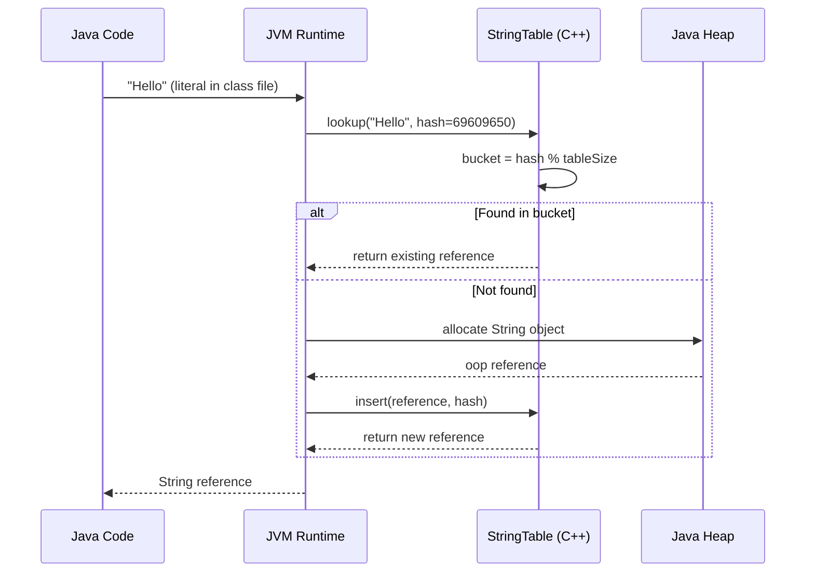
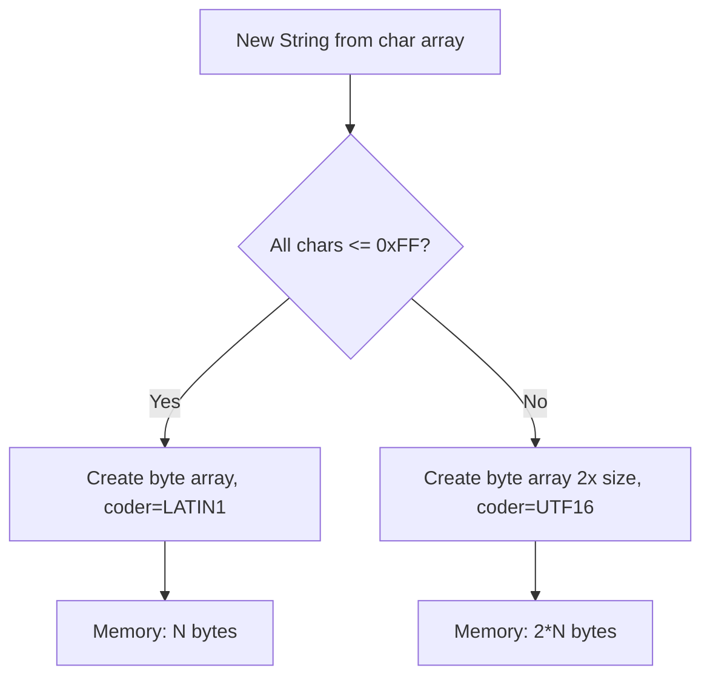
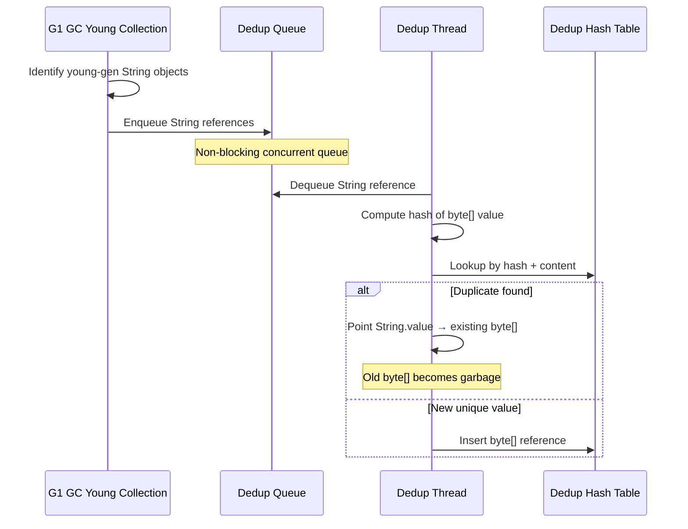
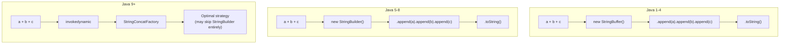
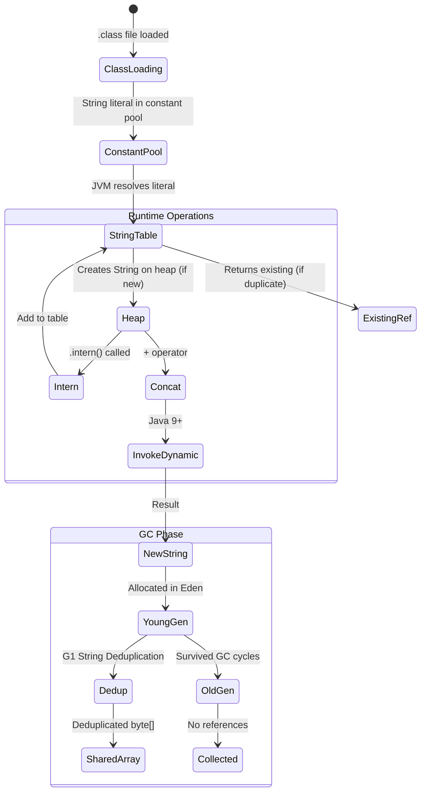

# Strings and Methods — Professional Level

## Table of Contents

1. [Introduction](#introduction)
2. [JVM Internals: String Representation](#jvm-internals-string-representation)
3. [Bytecode Analysis](#bytecode-analysis)
4. [String Pool Implementation](#string-pool-implementation)
5. [Memory Layout](#memory-layout)
6. [JIT Compilation of String Operations](#jit-compilation-of-string-operations)
7. [Compact Strings Implementation](#compact-strings-implementation)
8. [String Concatenation via invokedynamic](#string-concatenation-via-invokedynamic)
9. [GC and String Deduplication Internals](#gc-and-string-deduplication-internals)
10. [Diagrams & Visual Aids](#diagrams--visual-aids)

---

## Introduction

> Focus: "What happens under the hood?" — JVM, bytecode, GC level

This level explores the JVM internals behind Java Strings: how the HotSpot VM implements the String Pool, what bytecode the compiler generates for concatenation, how Compact Strings work at the byte level, and how the G1 garbage collector deduplicates strings. Understanding these internals is essential for diagnosing performance issues in string-heavy applications and making informed tuning decisions.

---

## JVM Internals: String Representation

### String Class Source (OpenJDK)

The `java.lang.String` class in modern JDK (17+) has this essential structure:

```java
public final class String implements java.io.Serializable, Comparable<String>, CharSequence {
    @Stable
    private final byte[] value;  // actual character data
    private final byte coder;    // LATIN1 (0) or UTF16 (1)
    private int hash;            // cached hashCode (0 = not computed)
    private boolean hashIsZero;  // true if hash is genuinely 0 (Java 15+)

    static final byte LATIN1 = 0;
    static final byte UTF16  = 1;

    // Compact Strings: if all chars fit in ISO-8859-1 → LATIN1 encoding
    // Otherwise → UTF16 encoding (2 bytes per char)
}
```

Key implementation details:

- **`value` is `@Stable`** — tells the JIT compiler the array reference will not change after construction, enabling aggressive optimizations
- **`hash` is lazily computed** — first `hashCode()` call computes and caches; the `hashIsZero` flag (Java 15+) distinguishes "not computed" from "computed as 0"
- **`final byte[] value`** — even though `byte[]` is mutable, the class never exposes internal mutators; immutability is enforced by the API, not the language

### hashCode() Implementation

```java
public int hashCode() {
    int h = hash;
    if (h == 0 && !hashIsZero) {
        h = isLatin1() ? StringLatin1.hashCode(value)
                       : StringUTF16.hashCode(value);
        if (h == 0) {
            hashIsZero = true;
        } else {
            hash = h;
        }
    }
    return h;
}

// The actual hash algorithm (polynomial rolling hash):
// s[0]*31^(n-1) + s[1]*31^(n-2) + ... + s[n-1]
```

The `hashIsZero` flag was added in JDK 15 to fix a performance bug: strings whose hash genuinely equals 0 (e.g., certain 2-char strings) would recompute the hash on every call.

---

## Bytecode Analysis

### Simple String Creation

```java
public class StringDemo {
    public static void main(String[] args) {
        String s = "Hello";
    }
}
```

Bytecode (`javap -c StringDemo`):

```
0: ldc           #7    // String "Hello" — loads from constant pool
2: astore_1             // stores in local variable 1 (s)
3: return
```

The `ldc` instruction loads a reference from the runtime constant pool. The JVM ensures that string literals in the constant pool are automatically interned.

### String Concatenation (Java 8 vs Java 9+)

```java
String a = "Hello";
String b = " World";
String c = a + b;
```

**Java 8 bytecode:**

```
0: ldc           #2    // "Hello"
2: astore_1
3: ldc           #3    // " World"
5: astore_2
6: new           #4    // class StringBuilder
9: dup
10: invokespecial #5   // StringBuilder.<init>()
13: aload_1
14: invokevirtual #6  // StringBuilder.append(String)
17: aload_2
18: invokevirtual #6  // StringBuilder.append(String)
21: invokevirtual #7  // StringBuilder.toString()
24: astore_3
```

**Java 9+ bytecode (invokedynamic):**

```
0: ldc           #2    // "Hello"
2: astore_1
3: ldc           #3    // " World"
5: astore_2
6: aload_1
7: aload_2
8: invokedynamic #4, 0 // InvokeDynamic #0:makeConcatWithConstants:(String;String;)String;
13: astore_3
```

The `invokedynamic` approach is more efficient because:
1. The JVM can choose the optimal concatenation strategy at runtime
2. It can avoid intermediate `StringBuilder` creation
3. It can pre-size the result buffer based on known parts

### equals() Bytecode

```java
String a = "test";
boolean eq = a.equals("test");
```

```
0: ldc           #2    // "test"
2: astore_1
3: aload_1
4: ldc           #2    // "test" — same constant pool entry!
6: invokevirtual #3   // String.equals(Object)
9: istore_2
```

Note: The JVM may optimize this to `true` at JIT time because both operands reference the same constant pool entry.

### intern() Bytecode

```java
String s = new String("Hello").intern();
```

```
0: new           #2    // class String
3: dup
4: ldc           #3    // "Hello"
6: invokespecial #4   // String.<init>(String)
9: invokevirtual #5   // String.intern()
12: astore_1
```

The `intern()` method is a `native` method that delegates to the JVM's StringTable:

```cpp
// HotSpot C++ implementation (simplified)
oop StringTable::intern(oop string, TRAPS) {
    unsigned int hashValue = hash_string(string);
    oop found = lookup_shared(hashValue, string);
    if (found != NULL) return found;
    return do_intern(string, hashValue, CHECK_NULL);
}
```

---

## String Pool Implementation

### HotSpot StringTable

The String Pool in HotSpot JVM is implemented as a hash table called `StringTable`:

```
+--------------------------------------------------+
|                  StringTable                       |
|--------------------------------------------------|
| Type: Open hash table with separate chaining      |
| Location: Native memory (off-heap structure)      |
| Entries: References to String objects ON the heap  |
| Default buckets: 65536 (Java 11+)                 |
| Resizable: Yes (Java 15+, concurrent resize)      |
+--------------------------------------------------+
|  Bucket[0] → Entry → Entry → null                 |
|  Bucket[1] → null                                  |
|  Bucket[2] → Entry → null                          |
|  ...                                               |
|  Bucket[N] → Entry → Entry → Entry → null          |
+--------------------------------------------------+
```

Key implementation details:

1. **Bucket array** is in native memory (C++ structure)
2. **Entries** are weak references to `String` objects on the Java heap
3. **Cleanup** happens during GC pause — dead entries are removed
4. **Lookup** uses the String's `hashCode()` to find the bucket, then `equals()` to match

### StringTable Lifecycle



### Monitoring StringTable

```bash
# Print StringTable stats on JVM exit
java -XX:+PrintStringTableStatistics MyApp

# Output example:
# StringTable statistics:
# Number of buckets       :     65536 =    524288 bytes, each 8
# Number of entries       :     24692
# Number of literals      :     24692
# Total footprint         :    1257472 bytes
# Average bucket size     :     0.377
# Variance of bucket size :     0.381
# Std. dev. of bucket size:     0.617
# Maximum bucket size     :         6

# Tune table size for heavy interning
java -XX:StringTableSize=1000003 MyApp  # prime number for better distribution
```

---

## Memory Layout

### String Object in Memory (64-bit JVM, Compressed Oops)

```
LATIN1 String "Hello" memory layout:

Offset  Size   Field
------  ----   -----
  0      4     mark word (part 1) — lock state, GC age
  4      4     mark word (part 2) — identity hash / monitor
  8      4     klass pointer (compressed) — points to String.class
 12      4     hash: int = 69609650 (or 0 if not computed)
 16      1     coder: byte = 0 (LATIN1)
 17      3     padding (alignment)
 20      4     hashIsZero: boolean = false
 24      4     value: reference to byte[] (compressed oop)
 28      4     padding (to 8-byte alignment)
------
 32 bytes total for String object header

byte[] "Hello" array:
  0      4     mark word (part 1)
  4      4     mark word (part 2)
  8      4     klass pointer
 12      4     length: int = 5
 16      5     data: [72, 101, 108, 108, 111]
 21      3     padding
------
 24 bytes for byte[] array

TOTAL: 32 + 24 = 56 bytes for the String "Hello"
```

### Using JOL (Java Object Layout) to Verify

```java
import org.openjdk.jol.info.ClassLayout;

public class StringLayout {
    public static void main(String[] args) {
        String s = "Hello";
        System.out.println(ClassLayout.parseInstance(s).toPrintable());
        System.out.println(ClassLayout.parseInstance(
            s.getClass().getDeclaredField("value").get(s)
        ).toPrintable());
    }
}
```

```xml
<!-- Maven dependency -->
<dependency>
    <groupId>org.openjdk.jol</groupId>
    <artifactId>jol-core</artifactId>
    <version>0.17</version>
</dependency>
```

---

## JIT Compilation of String Operations

### Intrinsics

The HotSpot JIT compiler has **intrinsic** implementations for many String methods — meaning it replaces the Java bytecode with hand-tuned machine code:

| Method | Intrinsic? | Notes |
|--------|-----------|-------|
| `String.equals()` | Yes | Uses SIMD vectorized comparison (AVX2/SSE4.2) |
| `String.compareTo()` | Yes | Vectorized lexicographic comparison |
| `String.indexOf()` | Yes | Uses SIMD string scanning |
| `String.hashCode()` | Yes | Unrolled loop with multiply-accumulate |
| `String.charAt()` | Yes | Bounds-check eliminated when possible |
| `StringBuilder.append()` | Yes | Inlined when size is small |
| `Arrays.copyOf()` (used in String) | Yes | Uses `System.arraycopy` intrinsic |

### Viewing JIT Output

```bash
# Print assembly for String methods
java -XX:+UnlockDiagnosticVMOptions \
     -XX:+PrintAssembly \
     -XX:CompileCommand=print,java.lang.String::equals \
     MyApp

# Output (x86_64 excerpt for equals):
# cmp    rdx, rsi          ; compare lengths first
# jne    NOT_EQUAL
# movdqu xmm0, [rdi+16]   ; load 16 bytes from string A
# pcmpeqb xmm0, [rsi+16]  ; SIMD compare with string B
# pmovmskb eax, xmm0      ; move comparison result to register
# cmp    eax, 0xFFFF       ; check all 16 bytes matched
```

### JIT Optimization: String Constant Folding

The JIT compiler can detect and optimize compile-time constant strings:

```java
// This entire method may be optimized to return "HELLO WORLD" directly
public String example() {
    String a = "hello";
    String b = " world";
    return (a + b).toUpperCase();
}
```

---

## Compact Strings Implementation

### StringLatin1 vs StringUTF16

Java 9+ has two internal helper classes:

```java
// For LATIN1 encoded strings (coder == 0)
final class StringLatin1 {
    static int hashCode(byte[] value) {
        int h = 0;
        for (byte v : value) {
            h = 31 * h + (v & 0xff); // unsigned byte to int
        }
        return h;
    }

    static boolean equals(byte[] value, byte[] other) {
        if (value.length == other.length) {
            return ArraysSupport.mismatch(value, other, value.length) < 0;
        }
        return false;
    }

    static char charAt(byte[] value, int index) {
        return (char)(value[index] & 0xff);
    }
}

// For UTF16 encoded strings (coder == 1)
final class StringUTF16 {
    static char charAt(byte[] value, int index) {
        // Each char occupies 2 bytes in the array
        return getChar(value, index);
    }

    static char getChar(byte[] val, int index) {
        index <<= 1; // multiply by 2
        return (char)(((val[index++] & 0xff) << HI_BYTE_SHIFT) |
                      ((val[index]   & 0xff) << LO_BYTE_SHIFT));
    }
}
```

### Encoding Decision

```java
// Simplified encoding decision in String constructor
static byte[] compress(char[] val, int off, int len) {
    byte[] ret = new byte[len];
    for (int i = 0; i < len; i++) {
        char c = val[off + i];
        if (c > 0xFF) {
            // Cannot fit in LATIN1 — fall back to UTF16
            return null;
        }
        ret[i] = (byte) c;
    }
    return ret; // LATIN1 encoding successful
}
```



---

## String Concatenation via invokedynamic

### How makeConcatWithConstants Works

Java 9+ compiles `+` concatenation to `invokedynamic` calls using `StringConcatFactory`:

```java
// Java source
String result = "Hello " + name + "! Age: " + age;

// Bootstrap method called ONCE at first execution:
// StringConcatFactory.makeConcatWithConstants(
//     lookup, "makeConcatWithConstants",
//     MethodType(String.class, String.class, int.class),
//     "Hello \1! Age: \1",  // recipe: \1 = placeholder for argument
//     ...
// )
```

The factory returns a `CallSite` with one of several strategies:

| Strategy | How it Works | When Used |
|----------|-------------|-----------|
| `BC_SB` | Bytecode-generated StringBuilder | Fallback |
| `BC_SB_SIZED` | StringBuilder with pre-computed size | When sizes are known |
| `BC_SB_SIZED_EXACT` | Exact-size StringBuilder | When all parts have fixed size |
| `MH_SB_SIZED` | MethodHandle-based StringBuilder | Default in modern JDK |
| `MH_INLINE_SIZED_EXACT` | Direct byte[] construction | Most optimal |

### Selecting Strategy

```bash
# Force a specific strategy
java -Djava.lang.invoke.stringConcat=MH_INLINE_SIZED_EXACT MyApp

# Dump generated strategy code
java -Djava.lang.invoke.stringConcat.debug=true MyApp
```

---

## GC and String Deduplication Internals

### G1 String Deduplication Process



Implementation details:

1. **Only young-gen strings** are candidates (configurable with `-XX:StringDeduplicationAgeThreshold`)
2. **Deduplication replaces the `byte[] value`** field via unsafe memory access — two Strings end up sharing the same array
3. **The hash table** uses the array content hash, not the String's `hashCode()`
4. **Thread priority** is low — deduplication is best-effort and does not block application threads

### JFR Events for Monitoring

```bash
java -XX:+UseG1GC -XX:+UseStringDeduplication \
     -XX:StartFlightRecording=filename=dedup.jfr,settings=profile \
     MyApp

# Analyze dedup events
jfr print --events jdk.StringDeduplication dedup.jfr
```

---

## Diagrams & Visual Aids

### String Object Graph in JVM Memory

```
+------------------------------------------+
|              Java Heap                    |
|                                          |
|  +------------------+                    |
|  | String "Hello"   |                    |
|  |  hash=69609650   |                    |
|  |  coder=0 (L1)    |---+               |
|  |  value=ref  -----+   |               |
|  +------------------+   |               |
|                          v               |
|  +------------------+  +--------+        |
|  | String "Hello"   |  | byte[] |        |
|  |  (new String)    |  | len=5  |        |
|  |  value=ref  ------->| H,e,l, |        |
|  +------------------+  | l,o    |        |
|                         +--------+        |
|                                          |
|  After G1 String Deduplication:          |
|  Both Strings share same byte[]          |
+------------------------------------------+

+------------------------------------------+
|           Native Memory                   |
|                                          |
|  +------------------------------------+  |
|  |          StringTable                |  |
|  |  Bucket[hash % size] → WeakRef ----+--+→ String "Hello" on heap
|  +------------------------------------+  |
+------------------------------------------+
```

### String Concatenation Evolution



### Complete String Lifecycle in JVM


