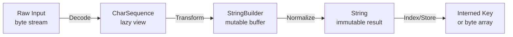
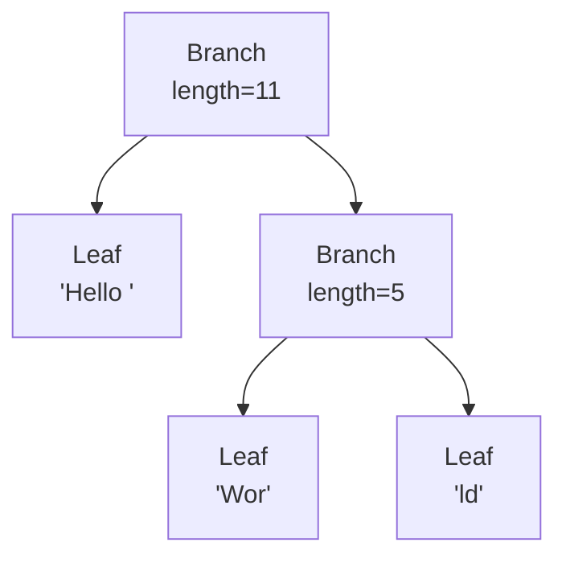
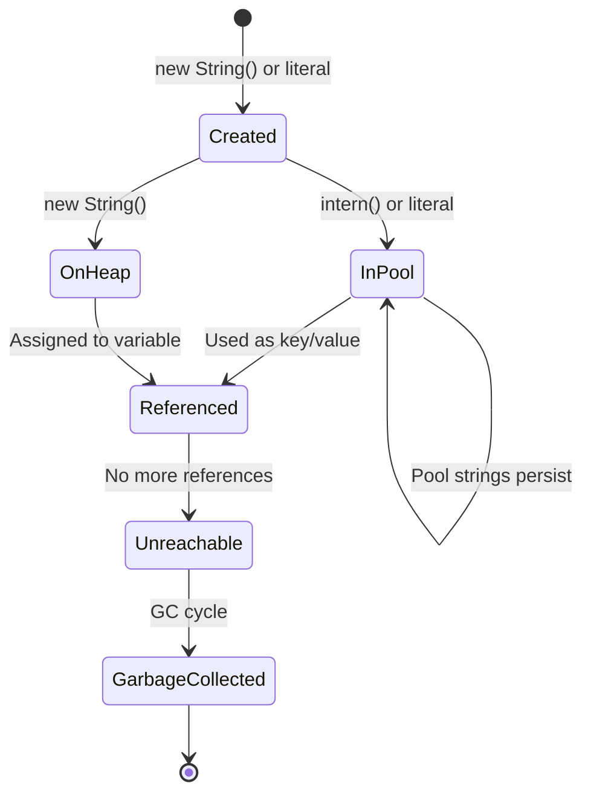

# Strings and Methods — Senior Level

## Table of Contents

1. [Introduction](#introduction)
2. [Architecture & Design](#architecture--design)
3. [Performance Benchmarks](#performance-benchmarks)
4. [Advanced Patterns](#advanced-patterns)
5. [Memory Management](#memory-management)
6. [Concurrency & Strings](#concurrency--strings)
7. [Best Practices](#best-practices)
8. [Production Considerations](#production-considerations)
9. [Test](#test)
10. [Diagrams & Visual Aids](#diagrams--visual-aids)

---

## Introduction

> Focus: "How to optimize?" and "How to architect?"

At the senior level, you understand Strings deeply and need to make architectural decisions about string handling at scale. This level covers:
- Designing string-heavy systems for throughput and memory efficiency
- JMH benchmarks comparing concatenation strategies, interning, and pooling
- Memory profiling and GC impact of String usage patterns
- Architectural patterns for text processing pipelines
- Production tuning of String-related JVM flags

---

## Architecture & Design

### Designing a Text Processing Pipeline

When building systems that process large volumes of text (log aggregation, ETL, search indexing), the architecture of your string handling directly impacts throughput and memory.



**Key architectural decisions:**

1. **Decode late** — Keep data as `byte[]` or `ByteBuffer` as long as possible; decode to String only when text operations are needed
2. **Use CharSequence** — Accept `CharSequence` in APIs instead of `String` to allow callers to pass `StringBuilder`, `StringBuffer`, or custom implementations without conversion
3. **Intern selectively** — Only intern strings used as lookup keys with high repetition rates
4. **Pool builders** — Reuse `StringBuilder` instances via thread-local pools to reduce allocation pressure

### CharSequence-Based API Design

```java
public interface TextProcessor {
    // ✅ Accept CharSequence — works with String, StringBuilder, etc.
    CharSequence process(CharSequence input);

    // ❌ Avoid — forces callers to convert to String
    // String process(String input);
}

public class HtmlEscaper implements TextProcessor {
    private static final Map<Character, String> ESCAPES = Map.of(
        '<', "&lt;", '>', "&gt;", '&', "&amp;", '"', "&quot;"
    );

    @Override
    public CharSequence process(CharSequence input) {
        StringBuilder result = null;
        for (int i = 0; i < input.length(); i++) {
            char c = input.charAt(i);
            String escape = ESCAPES.get(c);
            if (escape != null) {
                if (result == null) {
                    result = new StringBuilder(input.length() + 16);
                    result.append(input, 0, i);
                }
                result.append(escape);
            } else if (result != null) {
                result.append(c);
            }
        }
        return result != null ? result : input; // Return original if no escaping needed
    }
}
```

### Thread-Local StringBuilder Pool

```java
public class StringBuilderPool {
    private static final ThreadLocal<StringBuilder> POOL =
        ThreadLocal.withInitial(() -> new StringBuilder(256));

    public static StringBuilder acquire() {
        StringBuilder sb = POOL.get();
        sb.setLength(0); // reset without deallocating
        return sb;
    }

    // Usage
    public static String buildMessage(String user, String action, long timestamp) {
        StringBuilder sb = acquire();
        sb.append('[').append(timestamp).append("] ")
          .append(user).append(": ").append(action);
        return sb.toString();
    }
}
```

---

## Performance Benchmarks

### JMH Benchmark: Concatenation Strategies

```java
import org.openjdk.jmh.annotations.*;
import java.util.concurrent.TimeUnit;

@BenchmarkMode(Mode.AverageTime)
@OutputTimeUnit(TimeUnit.NANOSECONDS)
@Warmup(iterations = 5, time = 1)
@Measurement(iterations = 5, time = 1)
@Fork(2)
@State(Scope.Benchmark)
public class StringConcatBenchmark {

    @Param({"10", "100", "1000"})
    int count;

    @Benchmark
    public String plusOperator() {
        String result = "";
        for (int i = 0; i < count; i++) result += "x";
        return result;
    }

    @Benchmark
    public String stringBuilder() {
        StringBuilder sb = new StringBuilder();
        for (int i = 0; i < count; i++) sb.append("x");
        return sb.toString();
    }

    @Benchmark
    public String stringBuilderSized() {
        StringBuilder sb = new StringBuilder(count);
        for (int i = 0; i < count; i++) sb.append("x");
        return sb.toString();
    }

    @Benchmark
    public String stringJoin() {
        String[] arr = new String[count];
        java.util.Arrays.fill(arr, "x");
        return String.join("", arr);
    }

    @Benchmark
    public String charArrayDirect() {
        char[] chars = new char[count];
        java.util.Arrays.fill(chars, 'x');
        return new String(chars);
    }
}
```

**Typical results (ns/op):**

| Method | N=10 | N=100 | N=1000 |
|--------|------|-------|--------|
| `+= operator` | 120 | 4,500 | 350,000 |
| `StringBuilder` | 45 | 180 | 1,200 |
| `StringBuilder(N)` | 30 | 120 | 800 |
| `String.join` | 80 | 250 | 1,800 |
| `char[] direct` | 15 | 50 | 350 |

**Key insight:** For known-length results, direct `char[]` construction is fastest. For variable-length, pre-sized `StringBuilder` is optimal.

### JMH Benchmark: Interning Cost

```java
@Benchmark
public String internNew() {
    return new String("test_" + counter++).intern();
}

@Benchmark
public String internExisting() {
    return "test_fixed".intern(); // already in pool
}

@Benchmark
public String noIntern() {
    return new String("test_" + counter++);
}
```

| Method | ns/op | Notes |
|--------|-------|-------|
| `intern()` new string | ~800 | Pool lookup + insertion |
| `intern()` existing | ~50 | Pool lookup only |
| No intern | ~25 | Just heap allocation |

**Takeaway:** Interning has significant overhead for new strings. Only use it when the same string will be looked up many times.

---

## Advanced Patterns

### Pattern 1: Flyweight String Registry

For applications that process millions of records with a limited vocabulary (e.g., country codes, status values), a custom string registry avoids both interning overhead and duplicate allocations:

```java
import java.util.concurrent.ConcurrentHashMap;

public class StringRegistry {
    private final ConcurrentHashMap<String, String> registry = new ConcurrentHashMap<>(256);

    public String canonicalize(String input) {
        if (input == null) return null;
        return registry.computeIfAbsent(input, k -> k);
    }

    public int size() { return registry.size(); }

    public void clear() { registry.clear(); }

    // Usage for high-cardinality fields with repetition
    private static final StringRegistry STATUS_REGISTRY = new StringRegistry();

    public static String normalizeStatus(String rawStatus) {
        return STATUS_REGISTRY.canonicalize(rawStatus.toUpperCase());
    }
}
```

### Pattern 2: Zero-Copy String Parsing

When parsing large text files, avoid creating intermediate String objects:

```java
import java.nio.CharBuffer;

public class ZeroCopyParser {

    public static void parseCsv(CharSequence line, java.util.function.BiConsumer<Integer, CharSequence> fieldHandler) {
        int fieldIndex = 0;
        int start = 0;
        for (int i = 0; i <= line.length(); i++) {
            if (i == line.length() || line.charAt(i) == ',') {
                // subSequence returns a VIEW — no copy
                fieldHandler.accept(fieldIndex, line.subSequence(start, i));
                fieldIndex++;
                start = i + 1;
            }
        }
    }

    public static void main(String[] args) {
        CharBuffer line = CharBuffer.wrap("Alice,30,NYC,Engineer");
        parseCsv(line, (index, value) ->
            System.out.printf("Field %d: %s%n", index, value));
    }
}
```

### Pattern 3: Rope Data Structure for Large Strings

For applications that perform many insertions/deletions in large strings (text editors, document processing):

```java
public sealed interface Rope permits Rope.Leaf, Rope.Branch {

    int length();
    char charAt(int index);
    Rope concat(Rope other);
    Rope substring(int start, int end);

    record Leaf(String value) implements Rope {
        public int length() { return value.length(); }
        public char charAt(int index) { return value.charAt(index); }
        public Rope concat(Rope other) { return new Branch(this, other); }
        public Rope substring(int start, int end) {
            return new Leaf(value.substring(start, end));
        }
    }

    record Branch(Rope left, Rope right) implements Rope {
        public int length() { return left.length() + right.length(); }
        public char charAt(int index) {
            int leftLen = left.length();
            return index < leftLen ? left.charAt(index) : right.charAt(index - leftLen);
        }
        public Rope concat(Rope other) { return new Branch(this, other); }
        public Rope substring(int start, int end) {
            int leftLen = left.length();
            if (end <= leftLen) return left.substring(start, end);
            if (start >= leftLen) return right.substring(start - leftLen, end - leftLen);
            return left.substring(start, leftLen).concat(right.substring(0, end - leftLen));
        }
    }

    static Rope of(String s) { return new Leaf(s); }
}
```



---

## Memory Management

### String Memory Footprint

```
Java 8 (char[] based):
+------------------+
| Object Header    | 12 bytes (compressed oops)
| hash: int        | 4 bytes
| value: char[]    | 8 bytes (reference)
+------------------+
| char[] object    | 12 (header) + 4 (length) + 2*N bytes
+------------------+
Total: ~40 + 2*N bytes per String

Java 9+ (byte[] based, LATIN1):
+------------------+
| Object Header    | 12 bytes
| hash: int        | 4 bytes
| coder: byte      | 1 byte
| value: byte[]    | 8 bytes (reference)
+------------------+
| byte[] object    | 12 (header) + 4 (length) + N bytes
+------------------+
Total: ~41 + N bytes per String (LATIN1)
Total: ~41 + 2*N bytes per String (UTF16)
```

### Monitoring String Memory with JFR

```bash
# Start application with JFR recording
java -XX:StartFlightRecording=filename=recording.jfr,duration=60s,settings=profile MyApp

# Analyze with jfr command-line tool
jfr print --events jdk.ObjectAllocationSample recording.jfr | grep String
```

### JVM Flags for String Optimization

| Flag | Default | Description |
|------|---------|-------------|
| `-XX:+UseCompressedStrings` | Removed (Java 9) | Replaced by Compact Strings |
| `-XX:+CompactStrings` | `true` (Java 9+) | LATIN1/UTF16 encoding |
| `-XX:+UseStringDeduplication` | `false` | G1 GC deduplicates String values |
| `-XX:StringTableSize=N` | 65536 (Java 11+) | String pool hash table size |
| `-XX:+PrintStringTableStatistics` | `false` | Print intern pool stats on exit |

```bash
# Print String table statistics
java -XX:+PrintStringTableStatistics -version
# StringTable statistics:
# Number of buckets: 65536
# Number of entries: 28345
# ...
```

---

## Concurrency & Strings

### String Immutability and Thread Safety

String immutability provides **happens-before** guarantees: once a String is constructed, its value is visible to all threads without synchronization. However, the **reference** to a String is not thread-safe:

```java
// ❌ Race condition — reference assignment is not atomic
private String cachedValue;

public String getValue() {
    if (cachedValue == null) {
        cachedValue = computeExpensiveString(); // multiple threads may compute
    }
    return cachedValue;
}

// ✅ Thread-safe with volatile
private volatile String cachedValue;

// ✅ Or use AtomicReference for CAS
private final AtomicReference<String> cachedValue = new AtomicReference<>();

public String getValue() {
    String result = cachedValue.get();
    if (result == null) {
        result = computeExpensiveString();
        cachedValue.compareAndSet(null, result);
        result = cachedValue.get(); // may be different thread's result
    }
    return result;
}
```

### Concurrent String Building

```java
// ❌ StringBuffer is synchronized but SLOW for contended access
StringBuffer shared = new StringBuffer();
// Multiple threads appending...

// ✅ Collect per-thread and merge
List<String> perThreadResults = Collections.synchronizedList(new ArrayList<>());
// Each thread builds locally with StringBuilder, adds result to list
// Then join: String.join("", perThreadResults)

// ✅✅ Best — parallel stream with joining collector
String result = IntStream.range(0, 1000)
    .parallel()
    .mapToObj(i -> processItem(i))
    .collect(Collectors.joining());
```

---

## Best Practices

### Architectural Best Practices

1. **Accept `CharSequence` in public APIs** — allows callers to use `String`, `StringBuilder`, or custom types without conversion overhead

2. **Use `byte[]` for storage, `String` for processing** — when storing large volumes of text (caches, databases), compress or encode as `byte[]` to save memory

3. **Avoid interning user-generated content** — the intern pool has a fixed-size hash table; flooding it with unique strings degrades lookup performance and wastes memory

4. **Pre-size StringBuilders based on expected output** — reduces internal array resizing; estimate as `inputLength * 1.5` for transformations

5. **Use `String.valueOf()` over `.toString()`** — handles null safely:
   ```java
   Object obj = null;
   String.valueOf(obj); // "null"
   obj.toString();       // NullPointerException
   ```

6. **Profile String allocation with JFR or async-profiler** — in many applications, Strings are the #1 allocated object type; identify hotspots before optimizing

7. **Consider off-heap storage for very large text** — use `MappedByteBuffer` or Chronicle libraries for text data that exceeds heap capacity

8. **Use `switch` expressions for String dispatch** — cleaner than if-else chains, and the compiler optimizes to hashCode-based dispatch:
   ```java
   return switch (status) {
       case "ACTIVE"   -> handleActive();
       case "PENDING"  -> handlePending();
       case "INACTIVE" -> handleInactive();
       default         -> handleUnknown(status);
   };
   ```

### Code Review Checklist for Strings

- [ ] No `+=` concatenation inside loops
- [ ] No uncompiled regex patterns in loops (use `static final Pattern`)
- [ ] `equals()` used instead of `==` for content comparison
- [ ] Null checks before String method calls (or use `Objects.equals`)
- [ ] `strip()` used instead of `trim()` (Java 11+)
- [ ] `split(regex, -1)` when trailing empty strings matter
- [ ] No sensitive data (passwords) stored as `String` — use `char[]`
- [ ] StringBuilder pre-sized when output length is estimable
- [ ] CharSequence used in API signatures where possible

---

## Production Considerations

### Logging String Performance

In high-throughput systems, logging is often the #1 source of unnecessary String allocations:

```java
// ❌ String built regardless of log level
log.debug("Processing user " + user.getId() + " with request " + request.toString());

// ✅ Parameterized logging — string built only if DEBUG is enabled
log.debug("Processing user {} with request {}", user.getId(), request);

// ✅ Lazy evaluation for expensive toString()
log.debug("Complex state: {}", (Supplier<String>) () -> computeExpensiveDebugString());
```

### String-Heavy Application Tuning

```bash
# Increase String pool hash table for applications with many interned strings
java -XX:StringTableSize=1000003 MyApp

# Enable String deduplication with G1 GC
java -XX:+UseG1GC -XX:+UseStringDeduplication MyApp

# Monitor allocation rates
java -XX:+PrintGCDetails -Xlog:gc*:file=gc.log MyApp
```

---

## Test

**1. What is the time complexity of String concatenation with `+=` in a loop of N iterations?**

- A) O(N)
- B) O(N log N)
- C) O(N^2)
- D) O(1) amortized

<details>
<summary>Answer</summary>

**C) O(N^2)** — Each `+=` creates a new String and copies all previous characters. Iteration 1 copies 1 char, iteration 2 copies 2 chars, ..., iteration N copies N chars. Total: 1+2+...+N = O(N^2).
</details>

**2. Which JVM flag enables G1 GC String deduplication?**

- A) `-XX:+UseStringInterning`
- B) `-XX:+UseStringDeduplication`
- C) `-XX:+CompactStrings`
- D) `-XX:+OptimizeStringConcat`

<details>
<summary>Answer</summary>

**B) `-XX:+UseStringDeduplication`** — This flag enables G1 GC to find strings with identical `byte[]` contents and make them share the same underlying array.
</details>

**3. What is the memory savings from Compact Strings (Java 9+) for pure ASCII text?**

- A) ~10%
- B) ~25%
- C) ~50%
- D) ~75%

<details>
<summary>Answer</summary>

**C) ~50%** — Compact Strings store LATIN1 characters in 1 byte instead of 2 bytes (char), approximately halving the memory used by the character data.
</details>

**4. Why is `String.intern()` risky for user-generated content?**

- A) It throws an exception for non-ASCII characters
- B) It can cause the intern pool to grow unboundedly, degrading lookup performance
- C) It makes the string mutable
- D) It bypasses the GC

<details>
<summary>Answer</summary>

**B)** — The intern pool is a hash table with a fixed number of buckets. Flooding it with unique user-generated strings causes long hash chains, degrading lookup from O(1) to O(N). In older Java versions, interned strings were in PermGen (not GC-able), risking OutOfMemoryError.
</details>

**5. What does `CharSequence` as a method parameter provide architecturally?**

- A) Thread safety
- B) Polymorphism — accepts String, StringBuilder, StringBuffer, CharBuffer without conversion
- C) Faster string operations
- D) Automatic null handling

<details>
<summary>Answer</summary>

**B)** — `CharSequence` is an interface implemented by `String`, `StringBuilder`, `StringBuffer`, and `CharBuffer`. Accepting it avoids forcing callers to convert their data to `String`.
</details>

**6. In a JMH benchmark, which concatenation approach is fastest for building a 1000-character string?**

- A) `+=` operator
- B) `StringBuilder()`
- C) `StringBuilder(1000)` (pre-sized)
- D) `char[]` direct construction

<details>
<summary>Answer</summary>

**D) `char[]` direct construction** — For known-length output, constructing a `char[]` and creating a String from it avoids all resizing overhead. Pre-sized `StringBuilder` is a close second.
</details>

**7. What is the Rope data structure used for?**

- A) Hashing strings faster
- B) Efficient insertion/deletion in very large strings
- C) Compressing strings in memory
- D) Thread-safe string building

<details>
<summary>Answer</summary>

**B)** — A Rope is a binary tree of string fragments that allows O(log N) insertion and deletion in large texts, compared to O(N) for standard String (which requires copying the entire array). It is used in text editors and document processors.
</details>

**8. What happens when multiple threads access a shared `String` reference without volatile?**

- A) The String content becomes corrupted
- B) One thread may see a stale reference (old String value) due to CPU caching
- C) A ConcurrentModificationException is thrown
- D) Nothing — Strings are always thread-safe

<details>
<summary>Answer</summary>

**B)** — While String content is immutable and thread-safe, the reference variable pointing to a String is not. Without `volatile` or other memory barriers, a thread may cache the old reference value and not see an update made by another thread.
</details>

**9. Why should sensitive data like passwords NOT be stored as Java Strings?**

- A) Strings are too slow for cryptographic operations
- B) Strings are immutable and may persist in the String Pool or heap, visible in memory dumps
- C) Strings cannot hold special characters
- D) Strings are automatically logged by the JVM

<details>
<summary>Answer</summary>

**B)** — Because Strings are immutable, you cannot overwrite their contents after use. They may remain in memory until GC collects them, and if interned, they may never be collected. Using `char[]` allows you to explicitly zero out the data after use.
</details>

**10. What is the purpose of `-XX:StringTableSize`?**

- A) Sets the maximum String length
- B) Limits the number of Strings in the heap
- C) Sets the number of buckets in the String pool hash table
- D) Controls the StringBuilder default capacity

<details>
<summary>Answer</summary>

**C)** — `StringTableSize` controls the number of buckets in the internal hash table used by the String pool. A larger table reduces hash collisions for applications with many interned strings, improving `intern()` lookup performance.
</details>

---

## Diagrams & Visual Aids

### String Object Lifecycle



### Production String Processing Architecture

```mermaid
flowchart TD
    A[HTTP Request<br/>byte stream] -->|Decode once| B[String input]
    B --> C{Validation}
    C -->|Invalid| D[Error Response]
    C -->|Valid| E[Transform Pipeline]
    E --> F[Sanitize<br/>strip + escape]
    F --> G[Normalize<br/>lowercase + trim]
    G --> H[Parse<br/>split + extract]
    H --> I{Route}
    I -->|Store| J[DB: byte[] storage]
    I -->|Cache| K[Redis: compressed]
    I -->|Log| L[SLF4J: parameterized]
```

### Memory Comparison: String vs StringBuilder

```
Concatenating "Hello" + " " + "World" with +=:

Step 1: "Hello"              → 1 String object (5 bytes data)
Step 2: "Hello" + " "        → 1 new String object (6 bytes data), old discarded
Step 3: "Hello " + "World"   → 1 new String object (11 bytes data), old discarded
Total: 3 String objects allocated, 2 garbage collected

With StringBuilder(16):

Step 1: sb.append("Hello")   → internal buffer: [H,e,l,l,o,_,_,_,_,_,_,_,_,_,_,_]
Step 2: sb.append(" ")       → internal buffer: [H,e,l,l,o, ,_,_,_,_,_,_,_,_,_,_]
Step 3: sb.append("World")   → internal buffer: [H,e,l,l,o, ,W,o,r,l,d,_,_,_,_,_]
Step 4: sb.toString()        → 1 String object (11 bytes data)
Total: 1 StringBuilder + 1 String object, 0 garbage
```
