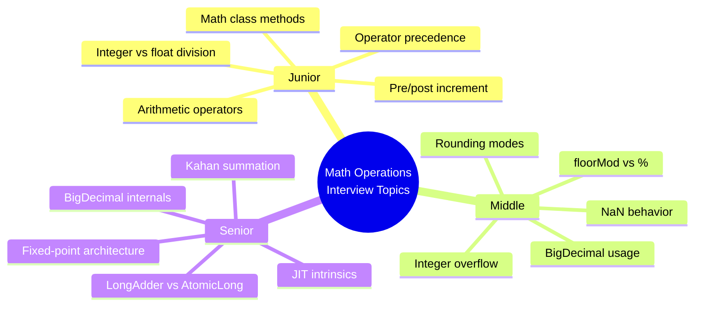
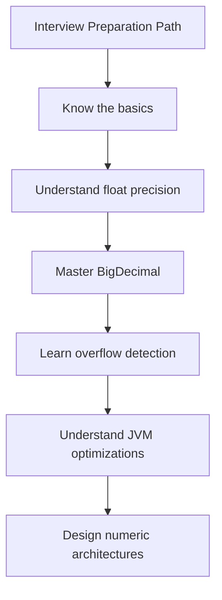

# Math Operations — Interview Questions

---

## Junior Level (7 Questions)

### Q1: What are the five basic arithmetic operators in Java?

<details>
<summary>Answer</summary>

The five arithmetic operators are:

| Operator | Name | Example | Result |
|----------|------|---------|--------|
| `+` | Addition | `5 + 3` | `8` |
| `-` | Subtraction | `5 - 3` | `2` |
| `*` | Multiplication | `5 * 3` | `15` |
| `/` | Division | `5 / 3` | `1` (integer) |
| `%` | Modulo (remainder) | `5 % 3` | `2` |

**Key point:** Integer division truncates the decimal part. To get a decimal result, at least one operand must be `double` or `float`.
</details>

### Q2: What is the difference between `x++` and `++x`?

<details>
<summary>Answer</summary>

Both increment `x` by 1, but they differ in the **value returned by the expression**:

```java
int x = 5;
int a = x++;  // a = 5, x = 6 (post-increment: returns old value, then increments)
int b = ++x;  // b = 7, x = 7 (pre-increment: increments first, then returns new value)
```

- **Post-increment (`x++`):** Use current value in expression, then add 1
- **Pre-increment (`++x`):** Add 1 first, then use new value in expression

The final value of `x` is the same in both cases — only the intermediate expression value differs.
</details>

### Q3: What does `10 / 3` return? How about `10.0 / 3`?

<details>
<summary>Answer</summary>

```java
System.out.println(10 / 3);     // 3 (integer division — truncates)
System.out.println(10.0 / 3);   // 3.3333333333333335 (floating-point division)
System.out.println(10 / 3.0);   // 3.3333333333333335 (one double operand is enough)
```

When both operands are `int`, Java performs **integer division** (truncation toward zero). When at least one operand is `float` or `double`, Java performs floating-point division.

**Common mistake:** Writing `double result = 1 / 3;` expecting `0.333...` but getting `0.0` because `1 / 3` is evaluated as integer division first, then widened to `double`.
</details>

### Q4: Name five commonly used methods from the `Math` class.

<details>
<summary>Answer</summary>

| Method | Description | Example |
|--------|-------------|---------|
| `Math.abs(x)` | Absolute value | `Math.abs(-5)` = `5` |
| `Math.max(a, b)` | Larger of two values | `Math.max(3, 7)` = `7` |
| `Math.min(a, b)` | Smaller of two values | `Math.min(3, 7)` = `3` |
| `Math.pow(base, exp)` | Power | `Math.pow(2, 10)` = `1024.0` |
| `Math.sqrt(x)` | Square root | `Math.sqrt(144)` = `12.0` |
| `Math.random()` | Random double [0, 1) | `0.0` to `0.999...` |
| `Math.round(x)` | Round to nearest integer | `Math.round(4.5)` = `5` |
| `Math.ceil(x)` | Round up | `Math.ceil(4.1)` = `5.0` |
| `Math.floor(x)` | Round down | `Math.floor(4.9)` = `4.0` |

`Math` is in `java.lang`, so no import is needed. All methods are `static`.
</details>

### Q5: What happens when you divide an integer by zero? What about a double by zero?

<details>
<summary>Answer</summary>

```java
// Integer division by zero — throws exception
int a = 10 / 0;  // ArithmeticException: / by zero

// Floating-point division by zero — returns special values
double b = 10.0 / 0.0;  // Double.POSITIVE_INFINITY
double c = -10.0 / 0.0; // Double.NEGATIVE_INFINITY
double d = 0.0 / 0.0;   // Double.NaN
```

**Why the difference?** Integer division has no way to represent infinity, so it throws an exception. Floating-point follows the IEEE 754 standard, which defines special values for infinity and "not a number" (NaN).
</details>

### Q6: What is operator precedence? Give an example.

<details>
<summary>Answer</summary>

Operator precedence determines the order in which operators are evaluated:

```java
int result = 2 + 3 * 4;    // 14, not 20 (multiplication first)
int result2 = (2 + 3) * 4;  // 20 (parentheses override)
```

**Precedence (high to low):**
1. Parentheses `()`
2. Unary: `++`, `--`, `+`, `-`
3. Multiplicative: `*`, `/`, `%`
4. Additive: `+`, `-`
5. Assignment: `=`, `+=`, `-=`, etc.

**Best practice:** When in doubt, use parentheses to make intent clear.
</details>

### Q7: Why does `System.out.println("Value: " + 2 + 3)` print "Value: 23" instead of "Value: 5"?

<details>
<summary>Answer</summary>

The `+` operator is evaluated left to right:

1. `"Value: " + 2` — String concatenation produces `"Value: 2"`
2. `"Value: 2" + 3` — String concatenation produces `"Value: 23"`

Once a `String` is involved, subsequent `+` operators perform concatenation, not addition.

**Fix:** Use parentheses to force arithmetic first:
```java
System.out.println("Value: " + (2 + 3));  // "Value: 5"
```

**Another example:**
```java
System.out.println(2 + 3 + " is the answer");  // "5 is the answer"
// Here 2 + 3 is evaluated first (both int), then "5" + " is the answer"
```
</details>

---

## Middle Level (7 Questions)

### Q8: Why should you never use `double` for monetary calculations?

<details>
<summary>Answer</summary>

`double` uses binary floating-point (IEEE 754), which cannot exactly represent most decimal fractions:

```java
System.out.println(0.1 + 0.2);          // 0.30000000000000004
System.out.println(1.03 - 0.42);        // 0.6100000000000001
System.out.println(1.00 - 9 * 0.10);    // 0.09999999999999998
```

In financial systems, these tiny errors accumulate over millions of transactions, leading to discrepancies.

**Solution:** Use `BigDecimal` with `String` constructor:
```java
BigDecimal a = new BigDecimal("0.1");
BigDecimal b = new BigDecimal("0.2");
System.out.println(a.add(b));  // 0.3 (exact)
```

**Rule:** Always create `BigDecimal` from a `String`, never from a `double`.
</details>

### Q9: What is the difference between `BigDecimal.equals()` and `BigDecimal.compareTo()`?

<details>
<summary>Answer</summary>

```java
BigDecimal a = new BigDecimal("1.0");
BigDecimal b = new BigDecimal("1.00");

System.out.println(a.equals(b));       // false — different scale (1 vs 2)
System.out.println(a.compareTo(b));    // 0     — numerically equal
```

- `equals()` compares both **value AND scale** — `1.0` (scale 1) is not equal to `1.00` (scale 2)
- `compareTo()` compares only the **numeric value** — `1.0` equals `1.00`

**Practical impact:** If you use `BigDecimal` as a `HashMap` key, `equals()` behavior can create duplicate entries. Always use `compareTo() == 0` for numeric comparison.

```java
// Dangerous: different scales create different map entries
Map<BigDecimal, String> map = new HashMap<>();
map.put(new BigDecimal("1.0"), "one");
map.put(new BigDecimal("1.00"), "one again");
System.out.println(map.size());  // 2 (two entries!)

// Safe: use TreeMap (uses compareTo)
Map<BigDecimal, String> treeMap = new TreeMap<>();
treeMap.put(new BigDecimal("1.0"), "one");
treeMap.put(new BigDecimal("1.00"), "one again");
System.out.println(treeMap.size());  // 1
```
</details>

### Q10: What are `Math.addExact()` and related methods? When would you use them?

<details>
<summary>Answer</summary>

Java 8 introduced `Math.*Exact()` methods that throw `ArithmeticException` on overflow instead of silently wrapping:

```java
// Silent overflow (dangerous)
int a = Integer.MAX_VALUE + 1;  // -2147483648

// Detected overflow (safe)
int b = Math.addExact(Integer.MAX_VALUE, 1);  // throws ArithmeticException
```

**Available methods:**
- `Math.addExact(int, int)` / `Math.addExact(long, long)`
- `Math.subtractExact(int, int)` / `Math.subtractExact(long, long)`
- `Math.multiplyExact(int, int)` / `Math.multiplyExact(long, long)`
- `Math.incrementExact(int)` / `Math.decrementExact(int)`
- `Math.negateExact(int)` / `Math.toIntExact(long)`

**Use when:** Input comes from external sources (user input, APIs) and overflow would be a security risk or logical error. NOT needed for loop counters or internal calculations with known bounds.
</details>

### Q11: What does `Math.floorMod(-7, 3)` return? How is it different from `-7 % 3`?

<details>
<summary>Answer</summary>

```java
System.out.println(-7 % 3);              // -1 (sign follows dividend)
System.out.println(Math.floorMod(-7, 3)); // 2  (sign follows divisor)
```

**Standard `%` (truncation modulo):** Result has the same sign as the **dividend** (left operand).
- `-7 = (-2) * 3 + (-1)`, so `-7 % 3 = -1`

**`Math.floorMod()` (floor modulo):** Result has the same sign as the **divisor** (right operand).
- `-7 = (-3) * 3 + 2`, so `floorMod(-7, 3) = 2`

**Practical use case:** Circular array indexing:
```java
int[] arr = {10, 20, 30, 40, 50};
int index = -2;
System.out.println(arr[Math.floorMod(index, arr.length)]);  // 40 (wraps correctly)
// Standard % would give -2, causing ArrayIndexOutOfBoundsException
```
</details>

### Q12: What is NaN? How do you check for it?

<details>
<summary>Answer</summary>

NaN ("Not a Number") is a special floating-point value defined by IEEE 754. It results from undefined mathematical operations:

```java
double nan1 = 0.0 / 0.0;
double nan2 = Math.sqrt(-1);
double nan3 = Double.NaN;
```

**Key property — NaN is not equal to anything, including itself:**
```java
System.out.println(Double.NaN == Double.NaN);  // false
System.out.println(Double.NaN != Double.NaN);  // true
```

**How to check:**
```java
// Correct
if (Double.isNaN(value)) { ... }

// Wrong — always false
if (value == Double.NaN) { ... }
```

**NaN behavior in comparisons:**
- Any comparison with NaN returns `false` (except `!=`)
- `NaN < 5` is `false`, `NaN > 5` is `false`, `NaN == 5` is `false`
</details>

### Q13: What RoundingMode should banks use, and why?

<details>
<summary>Answer</summary>

Banks should use `RoundingMode.HALF_EVEN` (also called **banker's rounding**):

```java
BigDecimal a = new BigDecimal("2.5");
BigDecimal b = new BigDecimal("3.5");
BigDecimal c = new BigDecimal("4.5");

// HALF_UP: always rounds 0.5 up
System.out.println(a.setScale(0, RoundingMode.HALF_UP));  // 3
System.out.println(b.setScale(0, RoundingMode.HALF_UP));  // 4

// HALF_EVEN: rounds 0.5 to nearest EVEN number
System.out.println(a.setScale(0, RoundingMode.HALF_EVEN)); // 2 (even)
System.out.println(b.setScale(0, RoundingMode.HALF_EVEN)); // 4 (even)
System.out.println(c.setScale(0, RoundingMode.HALF_EVEN)); // 4 (even)
```

**Why HALF_EVEN?** Over millions of transactions, HALF_UP introduces a systematic upward bias (0.5 always rounds up). HALF_EVEN eliminates this bias by alternating the rounding direction, producing statistically balanced results.
</details>

### Q14: What happens with `Math.abs(Integer.MIN_VALUE)`?

<details>
<summary>Answer</summary>

```java
System.out.println(Integer.MIN_VALUE);              // -2147483648
System.out.println(Math.abs(Integer.MIN_VALUE));     // -2147483648 (still negative!)
```

This is because:
- `Integer.MIN_VALUE` = -2,147,483,648
- `Integer.MAX_VALUE` = 2,147,483,647
- The positive value 2,147,483,648 does not fit in `int` range
- The result overflows back to `Integer.MIN_VALUE`

**Safe alternatives:**
```java
// Use Math.absExact (Java 15+)
Math.absExact(Integer.MIN_VALUE);  // throws ArithmeticException

// Use long
long abs = Math.abs((long) Integer.MIN_VALUE);  // 2147483648L
```
</details>

---

## Senior Level (6 Questions)

### Q15: How would you design a high-throughput pricing engine that needs exact decimal arithmetic?

<details>
<summary>Answer</summary>

**Strategy: Fixed-point `long` arithmetic on hot path, `BigDecimal` at boundaries.**

```java
// Store money as cents (long) — 100x faster than BigDecimal
long priceCents = 1999;   // $19.99
long taxMicros = 80000;   // 8% (in millionths)

// Hot path: pure long arithmetic
long taxCents = (priceCents * taxMicros + 500_000) / 1_000_000;
long totalCents = priceCents + taxCents;

// Boundary: convert to BigDecimal for API response / persistence
BigDecimal total = BigDecimal.valueOf(totalCents, 2);  // $21.59
```

**Architecture:**
1. **Input boundary:** Parse JSON/API values to `long` cents
2. **Calculation core:** All math uses `long` (overflow-checked with `Math.multiplyExact`)
3. **Accumulation:** Use `LongAdder` for thread-safe totals
4. **Output boundary:** Convert to `BigDecimal` for display and persistence
5. **Audit log:** Store calculations as `BigDecimal` strings for regulatory compliance

**Benchmark:** This approach is ~80-100x faster than pure `BigDecimal` for high-frequency calculations.
</details>

### Q16: Explain the difference between `LongAdder` and `AtomicLong`. When would you use each?

<details>
<summary>Answer</summary>

**`AtomicLong`** uses a single shared variable with CAS (compare-and-swap):
- Every thread contends on the same memory location
- Good for low contention (1-4 threads)
- Supports `get()`, `compareAndSet()`, `getAndAdd()`

**`LongAdder`** uses striped cells — each thread writes to its own cell, sum is computed lazily:
- Reduces contention by spreading updates across multiple cells
- 5-10x faster than `AtomicLong` under high contention (8+ threads)
- `sum()` is NOT atomic — may miss concurrent updates
- Does NOT support `compareAndSet()`

```java
// Use AtomicLong when:
// - You need read-your-write consistency
// - You need compareAndSet (optimistic locking)
// - Contention is low
AtomicLong sequence = new AtomicLong();
long next = sequence.incrementAndGet();

// Use LongAdder when:
// - Write-heavy, read-infrequent
// - High contention (metrics, counters)
// - Exact sum only needed at reporting time
LongAdder requestCounter = new LongAdder();
requestCounter.increment();
long total = requestCounter.sum();  // not real-time accurate
```
</details>

### Q17: What is Kahan summation and when do you need it?

<details>
<summary>Answer</summary>

**Problem:** When summing millions of `double` values, naive addition accumulates floating-point rounding errors:

```java
// Naive: error grows with each addition
double sum = 0;
for (int i = 0; i < 1_000_000; i++) sum += 0.1;
// Expected: 100000.0, Actual: 100000.00000133288...
```

**Kahan summation** compensates for lost low-order bits by tracking a compensation variable:

```java
double sum = 0, comp = 0;
for (double val : values) {
    double y = val - comp;
    double t = sum + y;
    comp = (t - sum) - y;  // recovers lost bits
    sum = t;
}
```

**When to use:**
- Summing large arrays of floating-point values (statistics, scientific computing)
- When the sum is much larger than individual values (catastrophic cancellation risk)
- Financial reporting over large datasets

**Alternatives:** `DoubleStream.sum()` in Java uses Kahan-like compensation internally.
</details>

### Q18: How does the JIT compiler optimize `Math.sqrt()` and `Math.abs()`?

<details>
<summary>Answer</summary>

The HotSpot JIT compiler treats many `Math` methods as **intrinsics** — it replaces the method call with direct CPU instructions:

| Method | x86-64 Instruction | Cost |
|--------|-------------------|------|
| `Math.sqrt(double)` | `vsqrtsd` | ~15 cycles |
| `Math.abs(double)` | `vandpd` (mask sign bit) | 1 cycle |
| `Math.max(int, int)` | `cmp` + `cmov` (no branch) | 2 cycles |
| `Math.addExact(int, int)` | `add` + `jo` (hardware overflow flag) | 1-2 cycles |

No method call overhead occurs — the JIT inlines these to single or few CPU instructions. This is why `Math.sqrt()` is as fast as a C implementation.

**Verification:** Use `-XX:+PrintAssembly` with hsdis to confirm intrinsification in JIT output.

**Note:** `Math.sin()`, `Math.cos()`, and `Math.log()` are NOT always intrinsified — they may fall back to software implementations (fdlibm), which are slower.
</details>

### Q19: Explain the BigDecimal compact representation. What is `intCompact`?

<details>
<summary>Answer</summary>

`BigDecimal` has a dual internal representation:

1. **Compact form:** For values where the unscaled value fits in a `long`, the value is stored directly in `intCompact` (a `long` field). No `BigInteger` object is allocated.

2. **Inflated form:** When the unscaled value exceeds `long` range, a `BigInteger` object is allocated and stored in `intVal`. The `intCompact` field is set to `INFLATED` (sentinel value `Long.MIN_VALUE`).

```java
// Compact: intCompact = 12345, scale = 2
BigDecimal compact = new BigDecimal("123.45");

// Still compact: intCompact = 12345000000, scale = 8
BigDecimal stillCompact = compact.setScale(8);

// Inflated: needs BigInteger
BigDecimal inflated = new BigDecimal("99999999999999999999.99");
```

**Why this matters:** Compact `BigDecimal` operations are significantly faster (long arithmetic) than inflated operations (BigInteger with int[] arrays). Most real-world `BigDecimal` values stay compact.

**Performance impact:** Compact `BigDecimal.add()` is ~3-5x faster than inflated.
</details>

### Q20: What is the difference between `Math` and `StrictMath`?

<details>
<summary>Answer</summary>

| Aspect | `Math` | `StrictMath` |
|--------|--------|-------------|
| **Implementation** | May use platform-native hardware | Always uses fdlibm (C software library) |
| **Speed** | Potentially faster (hardware-optimized) | Slower (pure software) |
| **Reproducibility** | Results may vary across platforms | Bit-for-bit identical on all platforms |
| **Intrinsics** | JIT can replace with CPU instructions | Less likely to be intrinsified |

```java
// Math: JVM may use x87 FPU or SSE (platform-dependent precision)
double a = Math.sin(0.5);

// StrictMath: guaranteed identical result on all JVMs
double b = StrictMath.sin(0.5);
```

**Note:** Since Java 17, `strictfp` semantics are the default (JEP 306), so `Math` and `StrictMath` produce identical results for basic operations. The difference remains for transcendental functions (`sin`, `cos`, `log`).

**Use `StrictMath` when:** Deterministic simulations, reproducible test results, financial regulation requiring cross-platform consistency.
</details>

---

## Coding Challenges

### Challenge 1: Implement Integer Square Root Without Math.sqrt

Write a method that computes the integer square root of a non-negative integer (the largest integer whose square is <= n) without using `Math.sqrt()`.

<details>
<summary>Solution</summary>

```java
public class Main {
    // Binary search approach — O(log n)
    public static int intSqrt(int n) {
        if (n < 0) throw new IllegalArgumentException("Negative input");
        if (n < 2) return n;

        long low = 1, high = n / 2 + 1;
        while (low <= high) {
            long mid = low + (high - low) / 2;
            long square = mid * mid;
            if (square == n) return (int) mid;
            else if (square < n) low = mid + 1;
            else high = mid - 1;
        }
        return (int) high;
    }

    // Newton's method — converges faster
    public static int intSqrtNewton(int n) {
        if (n < 2) return n;
        long x = n;
        while (x * x > n) {
            x = (x + n / x) / 2;
        }
        return (int) x;
    }

    public static void main(String[] args) {
        System.out.println(intSqrt(144));   // 12
        System.out.println(intSqrt(10));    // 3
        System.out.println(intSqrtNewton(144)); // 12
    }
}
```
</details>

### Challenge 2: Implement Power Function Without Math.pow

Implement `power(base, exp)` that handles negative exponents and returns `double`.

<details>
<summary>Solution</summary>

```java
public class Main {
    // Fast exponentiation — O(log n)
    public static double power(double base, int exp) {
        if (exp == 0) return 1.0;
        if (exp < 0) {
            base = 1.0 / base;
            exp = -exp;
        }

        double result = 1.0;
        while (exp > 0) {
            if ((exp & 1) == 1) {
                result *= base;
            }
            base *= base;
            exp >>= 1;
        }
        return result;
    }

    public static void main(String[] args) {
        System.out.println(power(2, 10));    // 1024.0
        System.out.println(power(3, -2));    // 0.1111...
        System.out.println(power(5, 0));     // 1.0
    }
}
```
</details>

---

## Diagram: Interview Question Categories




