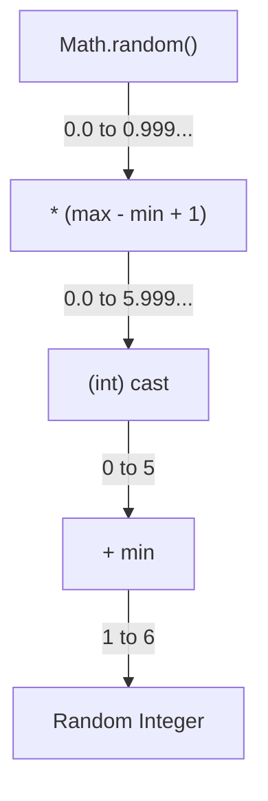
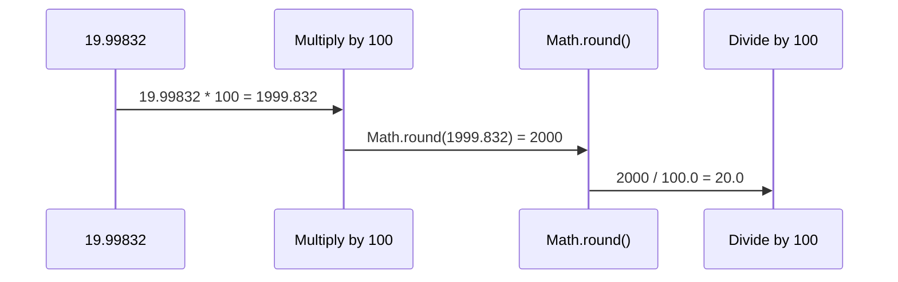
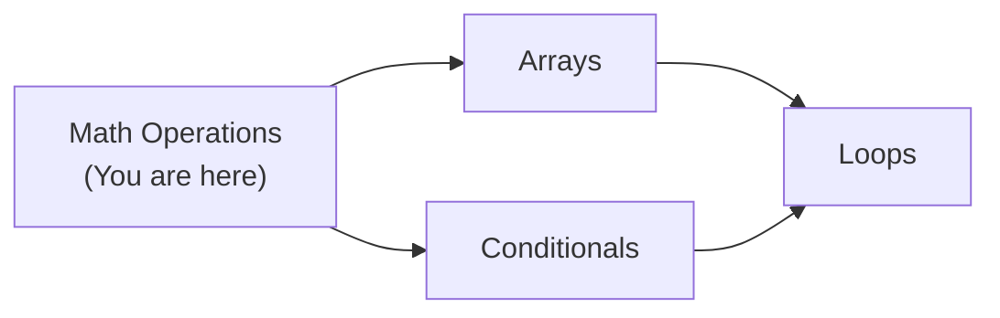
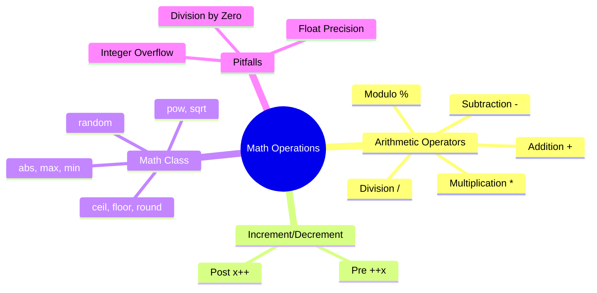
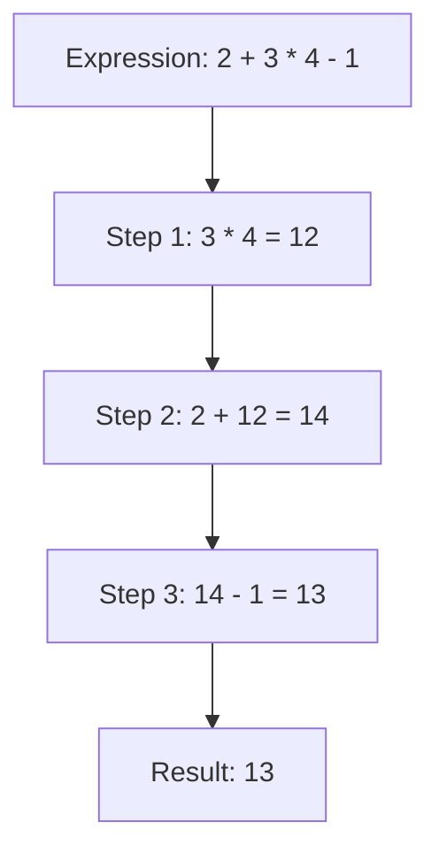

# Math Operations — Junior Level

## Table of Contents

1. [Introduction](#introduction)
2. [Prerequisites](#prerequisites)
3. [Glossary](#glossary)
4. [Core Concepts](#core-concepts)
5. [Real-World Analogies](#real-world-analogies)
6. [Mental Models](#mental-models)
7. [Pros & Cons](#pros--cons)
8. [Use Cases](#use-cases)
9. [Code Examples](#code-examples)
10. [Coding Patterns](#coding-patterns)
11. [Product Use / Feature](#product-use--feature)
12. [Error Handling](#error-handling)
13. [Security Considerations](#security-considerations)
14. [Performance Tips](#performance-tips)
15. [Best Practices](#best-practices)
16. [Edge Cases & Pitfalls](#edge-cases--pitfalls)
17. [Common Mistakes](#common-mistakes)
18. [Tricky Points](#tricky-points)
19. [Test](#test)
20. [Tricky Questions](#tricky-questions)
21. [Cheat Sheet](#cheat-sheet)
22. [Summary](#summary)
23. [Diagrams & Visual Aids](#diagrams--visual-aids)

---

## Introduction

> Focus: "What is it?" and "How to use it?"

**Math Operations** in Java cover everything from basic arithmetic (`+`, `-`, `*`, `/`, `%`) to the powerful `Math` class that provides methods like `abs()`, `sqrt()`, `pow()`, and `random()`. Every program — whether it calculates prices, measures distances, or generates game scores — relies on math operations.

Java provides two main categories of math tools:
- **Arithmetic operators** built into the language (`+`, `-`, `*`, `/`, `%`, `++`, `--`)
- **The `Math` class** from `java.lang` with static methods for advanced calculations

Understanding these is essential before moving to arrays, loops, and any real-world application logic.

---

## Prerequisites

What you should know before studying this topic:

- **Required:** Java Basic Syntax — you need to know how to write a `main` method and compile/run programs
- **Required:** Data Types — understanding `int`, `long`, `float`, `double` and the difference between integer and floating-point types
- **Required:** Variables and Scopes — how to declare and assign variables
- **Helpful but not required:** Type Casting — implicit and explicit conversions between numeric types

---

## Glossary

Key terms used in this topic:

| Term | Definition |
|------|-----------|
| **Arithmetic Operator** | A symbol that performs a mathematical calculation (`+`, `-`, `*`, `/`, `%`) |
| **Operand** | A value on which an operator acts (in `5 + 3`, both `5` and `3` are operands) |
| **Modulo (%)** | Returns the remainder of integer division (`10 % 3` gives `1`) |
| **Increment (++)** | Increases a variable's value by 1 |
| **Decrement (--)** | Decreases a variable's value by 1 |
| **Math Class** | A built-in Java class (`java.lang.Math`) providing static methods for mathematical functions |
| **Integer Overflow** | When a calculation exceeds the maximum value a data type can hold, wrapping around to a negative number |
| **Floating-Point Precision** | The limited accuracy of `float` and `double` types when representing decimal numbers |
| **Operator Precedence** | The order in which operators are evaluated in an expression |
| **NaN** | "Not a Number" — a special floating-point value resulting from undefined operations like `0.0 / 0.0` |

---

## Core Concepts

### Concept 1: Arithmetic Operators

Java provides five basic arithmetic operators that work on numeric types:

```java
int a = 10, b = 3;
System.out.println(a + b);  // 13  — addition
System.out.println(a - b);  // 7   — subtraction
System.out.println(a * b);  // 30  — multiplication
System.out.println(a / b);  // 3   — integer division (truncates decimal)
System.out.println(a % b);  // 1   — modulo (remainder)
```

- Integer division (`/`) truncates the decimal part — `10 / 3` gives `3`, not `3.333`.
- To get a decimal result, at least one operand must be a floating-point type: `10.0 / 3` gives `3.333...`.

### Concept 2: Increment and Decrement

The `++` and `--` operators add or subtract 1. They come in two forms:

```java
int x = 5;
System.out.println(x++);  // prints 5, THEN x becomes 6 (post-increment)
System.out.println(++x);  // x becomes 7 FIRST, then prints 7 (pre-increment)
```

- **Post-increment (`x++`):** Returns the current value, then increments.
- **Pre-increment (`++x`):** Increments first, then returns the new value.

### Concept 3: The Math Class

The `Math` class is in `java.lang`, so no import is needed. All methods are `static`:

```java
Math.abs(-7);          // 7       — absolute value
Math.max(10, 20);      // 20      — larger of two values
Math.min(10, 20);      // 10      — smaller of two values
Math.pow(2, 10);       // 1024.0  — 2 raised to the power of 10
Math.sqrt(144);        // 12.0    — square root
Math.random();         // 0.0 to 0.999... — random double
Math.ceil(4.2);        // 5.0     — round up
Math.floor(4.8);       // 4.0     — round down
Math.round(4.5);       // 5       — round to nearest (long)
```

### Concept 4: Operator Precedence

Java follows standard mathematical order of operations:

1. Parentheses `()` — highest priority
2. Unary operators (`++`, `--`, `+`, `-`)
3. Multiplicative (`*`, `/`, `%`)
4. Additive (`+`, `-`)
5. Assignment (`=`, `+=`, `-=`, etc.) — lowest priority

```java
int result = 2 + 3 * 4;   // 14, not 20 — multiplication first
int result2 = (2 + 3) * 4; // 20 — parentheses override precedence
```

---

## Real-World Analogies

Everyday analogies to help you understand Math Operations intuitively:

| Concept | Analogy |
|---------|--------|
| **Arithmetic Operators** | Like a basic calculator with +, -, x, / buttons — you press them to compute results |
| **Integer Division** | Like dividing pizzas among people — 10 slices / 3 people = 3 slices each, 1 left over (the remainder) |
| **Math Class** | Like a scientific calculator with advanced buttons (square root, power, absolute value) beyond the basics |
| **Operator Precedence** | Like the "PEMDAS" rule you learned in school — multiply before add, unless parentheses override |

---

## Mental Models

How to picture Math Operations in your head:

**The intuition:** Think of Java's math system as two layers: a **basic calculator** (arithmetic operators built into the language) and a **scientific calculator** (the `Math` class). The basic calculator handles everyday operations; the scientific calculator handles advanced functions.

**Why this model helps:** It prevents beginners from trying to do everything with operators alone (like writing their own square root function) when `Math.sqrt()` already exists. It also clarifies that operators and `Math` methods are different tools for different needs.

---

## Pros & Cons

| Pros | Cons |
|------|------|
| Arithmetic operators are fast and simple | Integer division silently truncates decimals |
| `Math` class covers most common functions | `Math.random()` is not suitable for cryptography |
| No imports needed for `Math` class | Floating-point math can produce surprising results (`0.1 + 0.2 != 0.3`) |
| Operator precedence follows standard math rules | Integer overflow happens silently — no exception is thrown |

### When to use:
- Everyday calculations: prices, scores, distances, percentages

### When NOT to use:
- Financial calculations requiring exact precision — use `BigDecimal` instead
- Cryptographically secure random numbers — use `SecureRandom` instead

---

## Use Cases

When and where you would use this in real projects:

- **Use Case 1:** Calculating shopping cart totals — addition, multiplication, and rounding
- **Use Case 2:** Generating random numbers for games — `Math.random()` or `Random` class
- **Use Case 3:** Computing distances between coordinates — `Math.sqrt()` and `Math.pow()`
- **Use Case 4:** Rounding prices to two decimal places — `Math.round()` with multiplication trick

---

## Code Examples

### Example 1: Basic Calculator

```java
public class Main {
    public static void main(String[] args) {
        int a = 15, b = 4;

        System.out.println("Addition:       " + (a + b));   // 19
        System.out.println("Subtraction:    " + (a - b));   // 11
        System.out.println("Multiplication: " + (a * b));   // 60
        System.out.println("Division:       " + (a / b));   // 3 (integer)
        System.out.println("Modulo:         " + (a % b));   // 3

        // Floating-point division
        double result = (double) a / b;
        System.out.println("Float Division: " + result);    // 3.75
    }
}
```

**What it does:** Demonstrates all five arithmetic operators with integer and floating-point division.
**How to run:** `javac Main.java && java Main`

### Example 2: Using the Math Class

```java
public class Main {
    public static void main(String[] args) {
        // Absolute value
        System.out.println("abs(-42): " + Math.abs(-42));       // 42

        // Max and Min
        System.out.println("max(8, 15): " + Math.max(8, 15));   // 15
        System.out.println("min(8, 15): " + Math.min(8, 15));   // 8

        // Power and Square Root
        System.out.println("pow(3, 4): " + Math.pow(3, 4));     // 81.0
        System.out.println("sqrt(81): " + Math.sqrt(81));        // 9.0

        // Rounding
        System.out.println("ceil(3.2): " + Math.ceil(3.2));     // 4.0
        System.out.println("floor(3.8): " + Math.floor(3.8));   // 3.0
        System.out.println("round(3.5): " + Math.round(3.5));   // 4

        // Random number between 1 and 100
        int random = (int) (Math.random() * 100) + 1;
        System.out.println("Random (1-100): " + random);
    }
}
```

**What it does:** Shows the most commonly used `Math` class methods.
**How to run:** `javac Main.java && java Main`

### Example 3: Increment and Decrement

```java
public class Main {
    public static void main(String[] args) {
        int counter = 10;

        // Post-increment: use current value, then increment
        System.out.println("Post-increment: " + counter++);  // prints 10
        System.out.println("After post:     " + counter);    // prints 11

        // Pre-increment: increment first, then use
        System.out.println("Pre-increment:  " + ++counter);  // prints 12
        System.out.println("After pre:      " + counter);    // prints 12

        // Post-decrement
        System.out.println("Post-decrement: " + counter--);  // prints 12
        System.out.println("After post--:   " + counter);    // prints 11
    }
}
```

**What it does:** Demonstrates the difference between pre and post increment/decrement.
**How to run:** `javac Main.java && java Main`

---

## Coding Patterns

Common patterns beginners encounter when working with Math Operations:

### Pattern 1: Generate Random Integer in a Range

**Intent:** Generate a random integer between `min` and `max` (inclusive).
**When to use:** Games, quizzes, random selection.

```java
public class Main {
    public static void main(String[] args) {
        int min = 1, max = 6; // dice roll
        int dice = (int) (Math.random() * (max - min + 1)) + min;
        System.out.println("Dice roll: " + dice);
    }
}
```

**Diagram:**



**Remember:** The formula is `(int)(Math.random() * range) + min` where `range = max - min + 1`.

---

### Pattern 2: Round to N Decimal Places

**Intent:** Round a floating-point number to a specific number of decimal places.
**When to use:** Displaying prices, formatting output.

```java
public class Main {
    public static void main(String[] args) {
        double price = 19.99832;
        double rounded = Math.round(price * 100.0) / 100.0;
        System.out.println("Rounded price: " + rounded);  // 20.0
    }
}
```

**Diagram:**



---

## Clean Code

Basic clean code principles when working with Math Operations in Java:

### Naming

```java
// Bad
double x = Math.sqrt(a * a + b * b);
int r = (int)(Math.random() * 100) + 1;

// Clean
double hypotenuse = Math.sqrt(sideA * sideA + sideB * sideB);
int randomPercentage = (int)(Math.random() * 100) + 1;
```

### Use Constants for Magic Numbers

```java
// Bad
double area = 3.14159 * radius * radius;

// Clean
static final double PI = Math.PI;
double area = PI * radius * radius;
```

---

## Product Use / Feature

How this topic is used in real-world products and tools:

### 1. E-Commerce Platforms

- **How it uses Math Operations:** Price calculation, tax computation, discount percentages, currency rounding
- **Why it matters:** Incorrect rounding can lead to financial discrepancies

### 2. Game Engines

- **How it uses Math Operations:** Random number generation, distance calculation, collision detection using `Math.sqrt()` and `Math.pow()`
- **Why it matters:** Games require fast, continuous mathematical computations

### 3. Scientific Applications

- **How it uses Math Operations:** Statistical calculations, trigonometric functions (`Math.sin`, `Math.cos`), logarithms
- **Why it matters:** Scientific computing relies on precise mathematical functions

---

## Error Handling

How to handle errors when working with Math Operations:

### Error 1: ArithmeticException — Division by Zero

```java
public class Main {
    public static void main(String[] args) {
        int a = 10, b = 0;
        System.out.println(a / b);  // ArithmeticException: / by zero
    }
}
```

**Why it happens:** Integer division by zero is undefined and throws `ArithmeticException`.
**How to fix:**

```java
public class Main {
    public static void main(String[] args) {
        int a = 10, b = 0;
        if (b != 0) {
            System.out.println(a / b);
        } else {
            System.out.println("Cannot divide by zero!");
        }
    }
}
```

### Error 2: Floating-Point Division by Zero (No Exception!)

```java
public class Main {
    public static void main(String[] args) {
        double a = 10.0, b = 0.0;
        System.out.println(a / b);   // Infinity (no exception!)
        System.out.println(0.0 / 0.0); // NaN
    }
}
```

**Why it happens:** Floating-point division by zero follows IEEE 754 standard and returns `Infinity` or `NaN` instead of throwing an exception.
**How to fix:** Check for `Double.isInfinite()` and `Double.isNaN()` after calculations.

---

## Security Considerations

Security aspects to keep in mind when using Math Operations:

### 1. Do Not Use Math.random() for Security

```java
// Insecure — predictable seed
double token = Math.random();

// Secure — cryptographically strong
import java.security.SecureRandom;
SecureRandom secureRandom = new SecureRandom();
int token = secureRandom.nextInt();
```

**Risk:** `Math.random()` uses a predictable algorithm. Attackers can predict the next value.
**Mitigation:** Always use `SecureRandom` for tokens, passwords, session IDs.

### 2. Integer Overflow in Size Calculations

```java
// Insecure — overflow can lead to buffer under-allocation
int size = userInput * 1024;  // could overflow if userInput is large

// Secure — check before multiplication
if (userInput > Integer.MAX_VALUE / 1024) {
    throw new IllegalArgumentException("Size too large");
}
int size = userInput * 1024;
```

**Risk:** Overflow can cause security vulnerabilities in memory allocation.
**Mitigation:** Validate inputs and check for overflow before performing calculations.

---

## Performance Tips

Basic performance considerations for Math Operations:

### Tip 1: Integer Math is Faster Than Floating-Point

```java
// Slower — floating-point operations
double result = 100.0 / 3.0;

// Faster — integer operations when decimals are not needed
int result = 100 / 3;
```

**Why it's faster:** Integer operations use simpler CPU instructions.

### Tip 2: Prefer Bit Shifting for Powers of 2

```java
// Standard
int doubled = x * 2;
int halved = x / 2;

// Slightly faster for performance-critical code
int doubled = x << 1;
int halved = x >> 1;
```

**Why it's faster:** Bit shifts are single CPU instructions. However, the JIT compiler usually optimizes this automatically.

---

## Best Practices

- **Always check for zero before dividing** — integer division by zero throws `ArithmeticException`
- **Use `Math.PI` and `Math.E`** instead of hardcoding constants
- **Cast to `double` before division** if you need decimal results: `(double) a / b`
- **Use parentheses** to make operator precedence explicit and clear
- **Name your variables meaningfully** — `totalPrice` instead of `tp`

---

## Edge Cases & Pitfalls

### Pitfall 1: Integer Overflow

```java
public class Main {
    public static void main(String[] args) {
        int maxInt = Integer.MAX_VALUE;  // 2,147,483,647
        System.out.println(maxInt + 1);  // -2,147,483,648 (wraps around!)
    }
}
```

**What happens:** The value silently wraps around to the minimum value.
**How to fix:** Use `long` for large numbers or check with `Math.addExact()` (throws `ArithmeticException` on overflow).

### Pitfall 2: Floating-Point Precision

```java
public class Main {
    public static void main(String[] args) {
        System.out.println(0.1 + 0.2);           // 0.30000000000000004
        System.out.println(0.1 + 0.2 == 0.3);    // false!
    }
}
```

**What happens:** Decimal fractions cannot be represented exactly in binary floating-point.
**How to fix:** Use `BigDecimal` for exact decimal arithmetic, or compare with a tolerance (`Math.abs(a - b) < 0.0001`).

---

## Common Mistakes

### Mistake 1: Forgetting Integer Division Truncates

```java
// Wrong — integer division
int percentage = 3 / 4 * 100;  // 0, not 75!

// Correct — cast to double first
double percentage = (double) 3 / 4 * 100;  // 75.0
```

### Mistake 2: Confusing Pre and Post Increment

```java
// Unexpected behavior
int a = 5;
int b = a++;  // b = 5, a = 6 (not b = 6!)

// If you want b = 6
int a = 5;
int b = ++a;  // b = 6, a = 6
```

### Mistake 3: Using == to Compare Floating-Point Results

```java
// Wrong
if (0.1 + 0.2 == 0.3) { ... }  // false!

// Correct — use epsilon comparison
if (Math.abs((0.1 + 0.2) - 0.3) < 1e-9) { ... }  // true
```

---

## Common Misconceptions

Things people often believe about Math Operations that are not true:

### Misconception 1: "Integer division rounds the result"

**Reality:** Integer division **truncates** toward zero, not rounds. `7 / 2` gives `3` (not `4`), and `-7 / 2` gives `-3` (not `-4`).

**Why people think this:** In everyday math, we often round to the nearest integer. Java's integer division simply drops the fractional part.

### Misconception 2: "`Math.random()` can return 1.0"

**Reality:** `Math.random()` returns a value from `0.0` (inclusive) to `1.0` (exclusive). It will never return exactly `1.0`.

**Why people think this:** The range description "0 to 1" is ambiguous without specifying inclusive/exclusive bounds.

---

## Tricky Points

Things that look simple but have subtle behavior:

### Tricky Point 1: Operator Precedence with String Concatenation

```java
public class Main {
    public static void main(String[] args) {
        System.out.println("Result: " + 2 + 3);   // "Result: 23" (string concatenation!)
        System.out.println("Result: " + (2 + 3));  // "Result: 5"  (arithmetic first)
        System.out.println(2 + 3 + " is the result"); // "5 is the result"
    }
}
```

**Why it's tricky:** The `+` operator is left-to-right. Once a `String` is involved, subsequent `+` becomes concatenation.
**Key takeaway:** Always use parentheses when mixing arithmetic with string concatenation.

### Tricky Point 2: Math.abs() with Integer.MIN_VALUE

```java
public class Main {
    public static void main(String[] args) {
        System.out.println(Math.abs(Integer.MIN_VALUE));  // -2147483648 (still negative!)
    }
}
```

**Why it's tricky:** `Integer.MIN_VALUE` is `-2147483648` but `Integer.MAX_VALUE` is `2147483647`. There is no positive `2147483648` in `int` range, so `abs()` overflows and returns the same negative number.
**Key takeaway:** `Math.abs()` can return a negative number for `Integer.MIN_VALUE` and `Long.MIN_VALUE`.

---

## Test

### Multiple Choice

**1. What is the result of `10 / 3` in Java?**

- A) 3.333
- B) 3.0
- C) 3
- D) 4

<details>
<summary>Answer</summary>
**C) 3** — Integer division truncates the decimal part. Both operands are `int`, so the result is `int`.
</details>

**2. What does `Math.ceil(4.1)` return?**

- A) 4
- B) 4.0
- C) 5.0
- D) 5

<details>
<summary>Answer</summary>
**C) 5.0** — `Math.ceil()` returns a `double`, rounding up to the next whole number.
</details>

### True or False

**3. `Math.random()` can return the value 1.0.**

<details>
<summary>Answer</summary>
**False** — `Math.random()` returns a value >= 0.0 and < 1.0 (exclusive upper bound).
</details>

**4. `++x` and `x++` always produce the same final value of `x`.**

<details>
<summary>Answer</summary>
**True** — Both increment `x` by 1. The difference is in the value returned by the expression, not the final value of `x`.
</details>

### What's the Output?

**5. What does this code print?**

```java
public class Main {
    public static void main(String[] args) {
        int x = 5;
        System.out.println(x++ + ++x);
    }
}
```

<details>
<summary>Answer</summary>
Output: `12`
Explanation: `x++` returns 5 (then x becomes 6), `++x` makes x 7 and returns 7. So 5 + 7 = 12.
</details>

**6. What does this code print?**

```java
public class Main {
    public static void main(String[] args) {
        System.out.println(1 + 2 + "3");
        System.out.println("1" + 2 + 3);
    }
}
```

<details>
<summary>Answer</summary>
Output:
```
33
123
```
Explanation: Line 1: `1 + 2 = 3`, then `3 + "3" = "33"`. Line 2: `"1" + 2 = "12"`, then `"12" + 3 = "123"`.
</details>

---

## Tricky Questions

Questions designed to confuse — with misleading options:

**1. What is the value of `Math.abs(Integer.MIN_VALUE)`?**

- A) 2147483647
- B) 2147483648
- C) -2147483648
- D) 0

<details>
<summary>Answer</summary>
**C) -2147483648** — This is a famous edge case. `Integer.MIN_VALUE` is -2147483648, but the positive counterpart (2147483648) exceeds `int` range, so `abs()` overflows and returns the same negative value.
</details>

**2. What does `System.out.println(-7 % 3)` print?**

- A) 2
- B) -2
- C) -1
- D) 1

<details>
<summary>Answer</summary>
**C) -1** — In Java, the modulo operator preserves the sign of the dividend (left operand). `-7 % 3 = -1` because `-7 = (-3) * 3 + (-1)`.
</details>

**3. What is the result of `double d = 1 / 2;`?**

- A) 0.5
- B) 0.0
- C) 1.0
- D) Compilation error

<details>
<summary>Answer</summary>
**B) 0.0** — `1 / 2` is integer division, which gives `0`. This `0` is then implicitly cast to `double`, resulting in `0.0`.
</details>

---

## Cheat Sheet

Quick reference for this topic:

| What | Syntax | Example |
|------|--------|---------|
| Addition | `a + b` | `5 + 3` = `8` |
| Subtraction | `a - b` | `5 - 3` = `2` |
| Multiplication | `a * b` | `5 * 3` = `15` |
| Division | `a / b` | `7 / 2` = `3` |
| Modulo | `a % b` | `7 % 2` = `1` |
| Post-increment | `x++` | Returns x, then adds 1 |
| Pre-increment | `++x` | Adds 1, then returns x |
| Absolute value | `Math.abs(x)` | `Math.abs(-5)` = `5` |
| Maximum | `Math.max(a, b)` | `Math.max(3, 7)` = `7` |
| Minimum | `Math.min(a, b)` | `Math.min(3, 7)` = `3` |
| Power | `Math.pow(base, exp)` | `Math.pow(2, 3)` = `8.0` |
| Square root | `Math.sqrt(x)` | `Math.sqrt(25)` = `5.0` |
| Random | `Math.random()` | `0.0` to `0.999...` |
| Ceiling | `Math.ceil(x)` | `Math.ceil(4.1)` = `5.0` |
| Floor | `Math.floor(x)` | `Math.floor(4.9)` = `4.0` |
| Round | `Math.round(x)` | `Math.round(4.5)` = `5` |

---

## Self-Assessment Checklist

Check your understanding of Math Operations:

### I can explain:
- [ ] What each arithmetic operator does
- [ ] The difference between integer and floating-point division
- [ ] How pre-increment and post-increment differ
- [ ] What operator precedence is and why it matters

### I can do:
- [ ] Write basic arithmetic expressions correctly
- [ ] Use `Math` class methods (`abs`, `max`, `min`, `pow`, `sqrt`, `random`)
- [ ] Generate a random number within a specific range
- [ ] Round a number to N decimal places

### I can answer:
- [ ] All multiple choice questions in this document
- [ ] "What's the output?" questions correctly

---

## Summary

- Java provides **5 arithmetic operators**: `+`, `-`, `*`, `/`, `%`
- **Integer division truncates** — cast to `double` if you need decimals
- **Pre-increment (`++x`)** changes before use; **post-increment (`x++`)** changes after use
- The **`Math` class** provides static methods for common math functions — no import needed
- Watch out for **integer overflow** (silent wraparound) and **floating-point precision** issues
- Use `BigDecimal` for financial/exact decimal calculations

**Next step:** Learn about Arrays to store and process collections of numbers.

---

## What You Can Build

Now that you understand Math Operations, here is what you can build:

### Projects you can create:
- **Simple Calculator:** Build a console calculator that supports +, -, *, /, % with input validation
- **Dice Roller Game:** Simulate dice rolls using `Math.random()` and track statistics
- **Unit Converter:** Convert temperatures, distances, or currencies using arithmetic formulas

### Technologies / tools that use this:
- **Spring Boot** — price calculation in e-commerce REST APIs
- **Apache Commons Math** — extends `Math` class with statistical and linear algebra functions
- **JUnit** — writing test assertions with delta for floating-point comparisons

### Learning path — what to study next:



---

## Further Reading

- **Official docs:** [Math (Java SE 17 API)](https://docs.oracle.com/en/java/javase/17/docs/api/java.base/java/lang/Math.html)
- **Tutorial:** [Oracle Java Tutorials — Operators](https://docs.oracle.com/javase/tutorial/java/nutsandbolts/operators.html)
- **Book chapter:** Effective Java (Bloch), Item 60 — "Avoid float and double if exact answers are required"
- **Video:** [Java Math Operations — Bro Code](https://www.youtube.com/results?search_query=java+math+operations+bro+code) — beginner-friendly walkthrough

---

## Related Topics

Topics to explore next or that connect to this one:

- **[Data Types](../03-data-types/)** — understanding numeric type ranges and precision
- **[Type Casting](../05-type-casting/)** — converting between numeric types in expressions
- **[Arrays](../08-arrays/)** — storing and processing collections of numbers
- **[Loops](../10-loops/)** — iterating over numbers for calculations

---

## Diagrams & Visual Aids

### Mind Map



### Operator Precedence Flow



### Integer vs Floating-Point Division

```
Integer Division:            Floating-Point Division:
+-------+--------+          +-------+---------+
| 10 / 3 |   3   |          | 10.0/3 | 3.333..|
| 7 / 2  |   3   |          | 7.0/2  |  3.5   |
| -7 / 2 |  -3   |          | -7.0/2 | -3.5   |
+-------+--------+          +-------+---------+
  Truncates toward 0          Keeps decimal part
```
