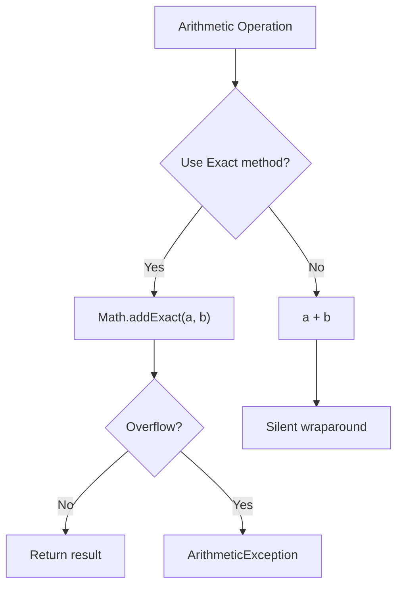
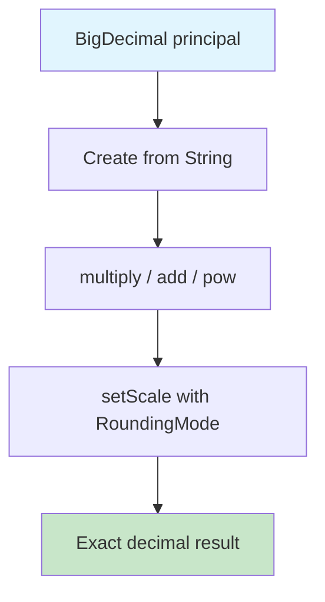
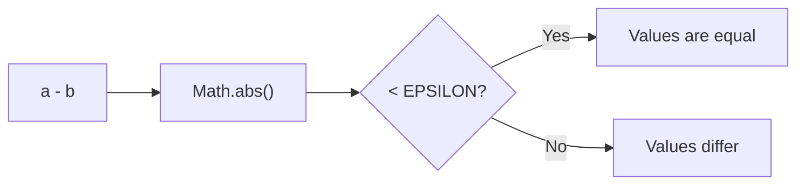
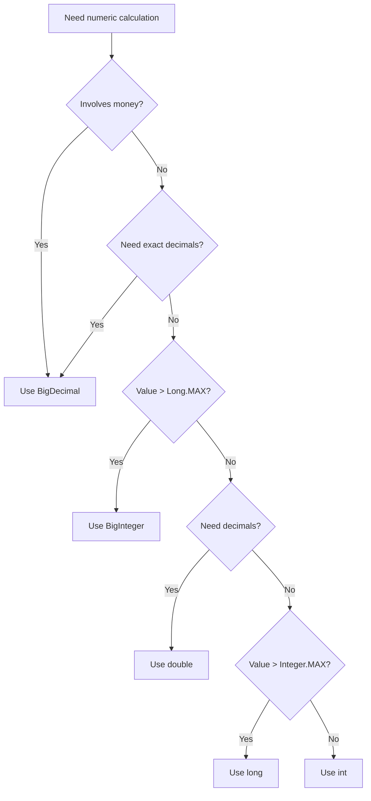
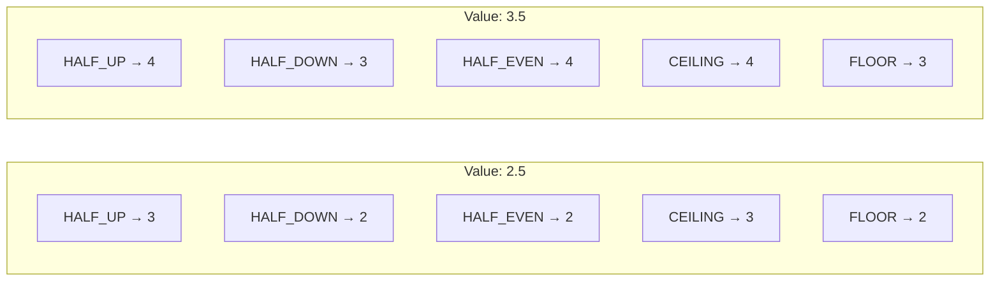

# Math Operations — Middle Level

## Table of Contents

1. [Introduction](#introduction)
2. [Core Concepts](#core-concepts)
3. [Evolution & Historical Context](#evolution--historical-context)
4. [Pros & Cons](#pros--cons)
5. [Alternative Approaches](#alternative-approaches)
6. [Code Examples](#code-examples)
7. [Coding Patterns](#coding-patterns)
8. [Product Use / Feature](#product-use--feature)
9. [Error Handling](#error-handling)
10. [Security Considerations](#security-considerations)
11. [Performance Optimization](#performance-optimization)
12. [Debugging Guide](#debugging-guide)
13. [Best Practices](#best-practices)
14. [Edge Cases & Pitfalls](#edge-cases--pitfalls)
15. [Common Mistakes](#common-mistakes)
16. [Comparison with Other Languages](#comparison-with-other-languages)
17. [Test](#test)
18. [Tricky Questions](#tricky-questions)
19. [Cheat Sheet](#cheat-sheet)
20. [Summary](#summary)
21. [Diagrams & Visual Aids](#diagrams--visual-aids)

---

## Introduction

> Focus: "Why?" and "When to use?"

Assumes the reader already knows basic arithmetic operators and the `Math` class. This level covers:
- **BigDecimal and BigInteger** for exact arithmetic in financial and scientific contexts
- **Integer overflow detection** and the `Math.*Exact()` methods introduced in Java 8
- **Floating-point internals** (IEEE 754) and why `0.1 + 0.2 != 0.3`
- **StrictMath vs Math** and portability considerations
- **Production-grade patterns** for numeric calculations in Spring Boot applications

---

## Core Concepts

### Concept 1: BigDecimal — Exact Decimal Arithmetic

`double` and `float` use binary floating-point representation, which cannot exactly represent most decimal fractions. `BigDecimal` stores numbers as unscaled integer values with a scale (number of decimal places), providing exact decimal arithmetic.

```java
import java.math.BigDecimal;
import java.math.RoundingMode;

public class Main {
    public static void main(String[] args) {
        // double fails
        System.out.println(0.1 + 0.2);  // 0.30000000000000004

        // BigDecimal succeeds
        BigDecimal a = new BigDecimal("0.1");
        BigDecimal b = new BigDecimal("0.2");
        System.out.println(a.add(b));    // 0.3

        // Division with scale and rounding
        BigDecimal price = new BigDecimal("19.99");
        BigDecimal tax = price.multiply(new BigDecimal("0.08"))
                              .setScale(2, RoundingMode.HALF_UP);
        System.out.println("Tax: " + tax);  // 1.60
    }
}
```

**Critical rule:** Always create `BigDecimal` from a `String`, never from a `double`:

```java
new BigDecimal(0.1);    // 0.1000000000000000055511151231257827021181583404541015625
new BigDecimal("0.1");  // 0.1 (exact)
```

### Concept 2: BigInteger — Arbitrary Precision Integers

When calculations exceed `long` range (> 9.2 x 10^18), use `BigInteger`:

```java
import java.math.BigInteger;

public class Main {
    public static void main(String[] args) {
        BigInteger factorial = BigInteger.ONE;
        for (int i = 2; i <= 50; i++) {
            factorial = factorial.multiply(BigInteger.valueOf(i));
        }
        System.out.println("50! = " + factorial);
        // 30414093201713378043612608166979581188299763898377856820553615673507270386838265...
    }
}
```

`BigInteger` supports all arithmetic operations: `add()`, `subtract()`, `multiply()`, `divide()`, `mod()`, `pow()`, `gcd()`, plus bitwise operations and primality testing.

### Concept 3: Math Exact Methods (Java 8+)

Java 8 introduced `*Exact()` methods that throw `ArithmeticException` on overflow instead of silently wrapping:

```java
public class Main {
    public static void main(String[] args) {
        // Silent overflow
        int silent = Integer.MAX_VALUE + 1;
        System.out.println(silent);  // -2147483648

        // Detected overflow
        try {
            int safe = Math.addExact(Integer.MAX_VALUE, 1);
        } catch (ArithmeticException e) {
            System.out.println("Overflow detected: " + e.getMessage());
        }
    }
}
```

Available methods: `Math.addExact()`, `Math.subtractExact()`, `Math.multiplyExact()`, `Math.incrementExact()`, `Math.decrementExact()`, `Math.negateExact()`, `Math.toIntExact()`.



### Concept 4: IEEE 754 Floating-Point Basics

Java's `float` (32-bit) and `double` (64-bit) follow the IEEE 754 standard:

| Component | float (32-bit) | double (64-bit) |
|-----------|---------------|-----------------|
| Sign | 1 bit | 1 bit |
| Exponent | 8 bits | 11 bits |
| Mantissa | 23 bits | 52 bits |
| Precision | ~7 decimal digits | ~15 decimal digits |

Special values:
- `Double.POSITIVE_INFINITY` — result of `1.0 / 0.0`
- `Double.NEGATIVE_INFINITY` — result of `-1.0 / 0.0`
- `Double.NaN` — result of `0.0 / 0.0`, `Math.sqrt(-1)`
- **NaN is not equal to anything**, including itself: `Double.NaN != Double.NaN` is `true`

### Concept 5: StrictMath vs Math

`Math` allows the JVM to use platform-native hardware instructions for speed (results may vary slightly across platforms). `StrictMath` guarantees bit-for-bit identical results on all platforms by using a software implementation (fdlibm).

```java
// Faster, might vary slightly between platforms
double fastResult = Math.sin(0.5);

// Identical result on every platform
double strictResult = StrictMath.sin(0.5);
```

**When to use `StrictMath`:** Deterministic simulations, financial regulation, cross-platform reproducibility tests.

---

## Evolution & Historical Context

**Before Java 8:**
- No overflow detection for arithmetic — developers had to write manual checks
- `BigDecimal` existed since Java 1.1 but lacked convenient rounding modes
- `strictfp` keyword was needed to force IEEE 754 compliance

**Java 8 changes:**
- `Math.addExact()`, `Math.multiplyExact()`, etc. — safe arithmetic
- `Math.floorMod()` and `Math.floorDiv()` — mathematically correct modulo for negative numbers

**Java 9+:**
- `BigDecimal.sqrt()` added (Java 9)
- `strictfp` became the default for all floating-point operations (Java 17) — the keyword is now obsolete

---

## Pros & Cons

| Pros | Cons |
|------|------|
| `BigDecimal` provides exact decimal arithmetic | `BigDecimal` is verbose and ~100x slower than `double` |
| `Math.*Exact()` methods catch overflow | Requires explicit try-catch or conditional logic |
| `Math` class covers most use cases without imports | Cannot be extended (final class, private constructor) |
| IEEE 754 compliance ensures cross-platform consistency | Floating-point edge cases (NaN, Infinity) surprise developers |

### Trade-off analysis:

- **`double` vs `BigDecimal`:** Use `double` for speed when approximate results are acceptable (physics, graphics). Use `BigDecimal` when exact decimals are required (finance, invoicing).
- **`int` vs `long` vs `BigInteger`:** Start with `int`. Use `long` when values exceed 2 billion. Use `BigInteger` only when `long` is insufficient (cryptography, factorial of large numbers).

### Comparison with alternatives:

| Approach | Pros | Cons | Best for |
|----------|------|------|----------|
| `double` arithmetic | Fast, simple syntax | Precision issues | Games, science, rendering |
| `BigDecimal` | Exact decimals | Verbose, slow | Finance, invoicing |
| `BigInteger` | Unlimited range | Slow, heap allocation | Cryptography, large factorials |
| `Math.*Exact()` | Catches overflow | Requires exception handling | Input validation, safe calculations |

---

## Alternative Approaches

| Alternative | How it works | When you might use it |
|-------------|--------------|----------------------|
| **Apache Commons Math** | Library with statistical, linear algebra, and complex number support | Scientific computing beyond `Math` class |
| **Guava IntMath/LongMath** | Checked arithmetic, GCD, binomial coefficients | When you want overflow-safe math without try-catch |
| **JScience** | Units of measurement and physical quantities | Engineering applications with dimensional analysis |

---

## Code Examples

### Example 1: Production-Ready Price Calculator

```java
import java.math.BigDecimal;
import java.math.RoundingMode;

public class Main {
    private static final BigDecimal TAX_RATE = new BigDecimal("0.08");
    private static final BigDecimal DISCOUNT_THRESHOLD = new BigDecimal("100.00");
    private static final BigDecimal DISCOUNT_RATE = new BigDecimal("0.10");

    public static BigDecimal calculateTotal(BigDecimal unitPrice, int quantity) {
        if (unitPrice == null || unitPrice.compareTo(BigDecimal.ZERO) < 0) {
            throw new IllegalArgumentException("Price must be non-negative");
        }
        if (quantity <= 0) {
            throw new IllegalArgumentException("Quantity must be positive");
        }

        BigDecimal subtotal = unitPrice.multiply(BigDecimal.valueOf(quantity));

        // Apply discount if subtotal exceeds threshold
        if (subtotal.compareTo(DISCOUNT_THRESHOLD) > 0) {
            BigDecimal discount = subtotal.multiply(DISCOUNT_RATE)
                                         .setScale(2, RoundingMode.HALF_UP);
            subtotal = subtotal.subtract(discount);
        }

        // Apply tax
        BigDecimal tax = subtotal.multiply(TAX_RATE)
                                 .setScale(2, RoundingMode.HALF_UP);

        return subtotal.add(tax).setScale(2, RoundingMode.HALF_UP);
    }

    public static void main(String[] args) {
        BigDecimal total = calculateTotal(new BigDecimal("29.99"), 5);
        System.out.println("Total: $" + total);  // Total: $145.75
    }
}
```

**Why this pattern:** Uses `BigDecimal` with proper rounding for exact financial calculations. Constants are defined once. Input validation prevents invalid states.

### Example 2: Safe Arithmetic with Overflow Detection

```java
public class Main {
    public static long safePower(int base, int exponent) {
        long result = 1;
        for (int i = 0; i < exponent; i++) {
            result = Math.multiplyExact(result, base);  // throws on overflow
        }
        return result;
    }

    public static void main(String[] args) {
        System.out.println(safePower(2, 10));   // 1024
        System.out.println(safePower(2, 30));   // 1073741824

        try {
            System.out.println(safePower(2, 63));  // overflow!
        } catch (ArithmeticException e) {
            System.out.println("Overflow: " + e.getMessage());
        }
    }
}
```

### Example 3: Comparing floorMod vs % for Negative Numbers

```java
public class Main {
    public static void main(String[] args) {
        // Standard modulo — result has same sign as dividend
        System.out.println(-7 % 3);          // -1
        System.out.println(7 % -3);          //  1

        // floorMod — result has same sign as divisor (mathematically correct)
        System.out.println(Math.floorMod(-7, 3));   // 2
        System.out.println(Math.floorMod(7, -3));    // -2

        // Use case: circular array indexing
        int[] arr = {10, 20, 30, 40, 50};
        int index = -2;
        int circularIndex = Math.floorMod(index, arr.length);
        System.out.println("Element at index " + index + ": " + arr[circularIndex]); // 40
    }
}
```

---

## Coding Patterns

### Pattern 1: Money Calculation with BigDecimal

**Category:** Java-idiomatic
**Intent:** Avoid floating-point precision errors in financial calculations.
**When to use:** Any time money is involved.
**When NOT to use:** Performance-critical code where approximate results are acceptable.

```java
import java.math.BigDecimal;
import java.math.RoundingMode;

public class Main {
    static BigDecimal calculateInterest(BigDecimal principal, BigDecimal annualRate, int years) {
        // Compound interest: A = P * (1 + r)^n
        BigDecimal onePlusRate = BigDecimal.ONE.add(annualRate);
        BigDecimal compoundFactor = onePlusRate.pow(years);
        return principal.multiply(compoundFactor).setScale(2, RoundingMode.HALF_UP);
    }

    public static void main(String[] args) {
        BigDecimal result = calculateInterest(
            new BigDecimal("1000.00"),
            new BigDecimal("0.05"),
            10
        );
        System.out.println("After 10 years: $" + result);  // $1628.89
    }
}
```

**Diagram:**



### Pattern 2: Overflow-Safe Accumulation

**Intent:** Safely sum a collection of values without silent overflow.

```java
public class Main {
    public static long safeSum(int[] values) {
        long sum = 0;
        for (int v : values) {
            sum = Math.addExact(sum, v);
        }
        return sum;
    }

    public static void main(String[] args) {
        int[] prices = {Integer.MAX_VALUE, 100, 200};
        try {
            System.out.println("Sum: " + safeSum(prices));
        } catch (ArithmeticException e) {
            System.out.println("Sum would overflow long!");
        }
        // Prints: Sum: 2147483947 (fits in long)
    }
}
```

**Diagram:**

```mermaid
sequenceDiagram
    participant Loop
    participant MathExact as Math.addExact()
    participant Sum as Accumulator
    Loop->>MathExact: addExact(sum, value)
    alt No overflow
        MathExact-->>Sum: Updated sum
        Sum-->>Loop: Continue
    else Overflow detected
        MathExact-->>Loop: ArithmeticException
    end
```

### Pattern 3: Epsilon Comparison for Floating-Point

**Intent:** Safely compare floating-point values that may have rounding errors.

```java
public class Main {
    private static final double EPSILON = 1e-9;

    static boolean doubleEquals(double a, double b) {
        return Math.abs(a - b) < EPSILON;
    }

    public static void main(String[] args) {
        double result = 0.1 + 0.2;
        System.out.println(result == 0.3);              // false
        System.out.println(doubleEquals(result, 0.3));   // true
    }
}
```



---

## Product Use / Feature

### 1. Banking & Payment Systems

- **How it uses Math Operations:** All monetary calculations use `BigDecimal` with `RoundingMode.HALF_EVEN` (banker's rounding) to prevent systematic rounding bias
- **Scale:** Millions of transactions per day where a 0.01 cent error accumulates to significant amounts
- **Key insight:** Never use `double` for money — regulatory compliance often requires exact decimal arithmetic

### 2. Apache Kafka (Offset Management)

- **How it uses Math Operations:** Consumer offsets are `long` values that can grow to billions. Kafka uses overflow-safe arithmetic when computing lag
- **Why this approach:** A silent overflow in offset calculation could cause consumers to re-read entire topics

### 3. Elasticsearch (Scoring)

- **How it uses Math Operations:** TF-IDF and BM25 scoring algorithms use `Math.log()`, `Math.sqrt()`, and floating-point arithmetic for relevance ranking
- **Why this approach:** Speed matters more than precision for search ranking — `double` is sufficient

---

## Error Handling

### Pattern 1: BigDecimal Division Without Scale

```java
import java.math.BigDecimal;
import java.math.RoundingMode;

public class Main {
    public static void main(String[] args) {
        BigDecimal a = new BigDecimal("10");
        BigDecimal b = new BigDecimal("3");

        // This throws ArithmeticException!
        try {
            BigDecimal result = a.divide(b);
        } catch (ArithmeticException e) {
            System.out.println("Error: " + e.getMessage());
            // "Non-terminating decimal expansion; no exact representable decimal result."
        }

        // Fix: always specify scale and rounding mode
        BigDecimal result = a.divide(b, 10, RoundingMode.HALF_UP);
        System.out.println(result);  // 3.3333333333
    }
}
```

### Pattern 2: Handling NaN and Infinity

```java
public class Main {
    public static void main(String[] args) {
        double result = 0.0 / 0.0;

        // NaN comparisons are always false
        if (result == result) {
            System.out.println("This never prints");
        }

        // Use Double.isNaN() instead
        if (Double.isNaN(result)) {
            System.out.println("Result is NaN — handle accordingly");
        }

        // Check for Infinity
        double inf = 1.0 / 0.0;
        if (Double.isInfinite(inf)) {
            System.out.println("Result is Infinity");
        }

        // Combined check
        if (Double.isFinite(inf)) {
            System.out.println("This won't print");
        }
    }
}
```

---

## Security Considerations

### 1. Integer Overflow in Array Size Allocation

**Risk level:** High

```java
// Vulnerable — attacker controls width and height
int width = userInput1;   // e.g., 65536
int height = userInput2;  // e.g., 65536
byte[] buffer = new byte[width * height];  // overflows to 0!

// Secure — use Math.multiplyExact or validate
try {
    int size = Math.multiplyExact(width, height);
    if (size > MAX_ALLOWED_SIZE) throw new IllegalArgumentException("Too large");
    byte[] buffer = new byte[size];
} catch (ArithmeticException e) {
    throw new IllegalArgumentException("Dimensions too large", e);
}
```

**Attack vector:** Integer overflow causes a smaller-than-expected buffer, leading to buffer overflows.

### 2. Timing Attacks on Numeric Comparisons

```java
// Vulnerable to timing attack
boolean checkPin(int userPin, int correctPin) {
    return userPin == correctPin;  // constant time, but...
}

// If using BigInteger for crypto, comparison time varies with value
// Secure — use constant-time comparison for sensitive values
boolean secureCompare(byte[] a, byte[] b) {
    if (a.length != b.length) return false;
    int result = 0;
    for (int i = 0; i < a.length; i++) {
        result |= a[i] ^ b[i];
    }
    return result == 0;
}
```

---

## Performance Optimization

### Optimization 1: Avoid BigDecimal When Possible

```java
// Slow — BigDecimal for simple rounding
BigDecimal bd = new BigDecimal(price);
bd = bd.setScale(2, RoundingMode.HALF_UP);
double rounded = bd.doubleValue();

// Fast — Math.round trick (when precision tolerance is acceptable)
double rounded = Math.round(price * 100.0) / 100.0;
```

**When to optimize:** Only use `Math.round` trick for display purposes; use `BigDecimal` for actual financial logic.

### Optimization 2: Prefer Primitive Wrapper Static Methods

```java
// Slow — creates unnecessary objects
Integer.valueOf(a).compareTo(Integer.valueOf(b));

// Fast — static comparison, no boxing
Integer.compare(a, b);

// Also available for other types
Long.compare(a, b);
Double.compare(a, b);
```

### Performance Decision Matrix

| Scenario | Approach | Why |
|----------|----------|-----|
| Game physics | `double` arithmetic | Speed critical, precision secondary |
| Invoice totals | `BigDecimal` | Exact decimals required by law |
| Loop counters | `int` or `long` | Primitives avoid boxing overhead |
| Cryptographic keys | `BigInteger` | Arbitrary precision required |

---

## Debugging Guide

### Problem 1: "My calculation returns 0 instead of the expected decimal"

**Symptoms:** Division of two integers returns `0` instead of a fraction.

**Diagnostic steps:**
```java
int a = 1, b = 3;
System.out.println(a / b);         // 0 — integer division!
System.out.println((double) a / b); // 0.333... — correct
```

**Root cause:** Both operands are `int`, so Java performs integer division.
**Fix:** Cast at least one operand to `double` before dividing.

### Problem 2: "BigDecimal.divide() throws ArithmeticException"

**Symptoms:** `ArithmeticException: Non-terminating decimal expansion`

**Root cause:** The result is a repeating decimal and no rounding mode was specified.
**Fix:** Always pass scale and `RoundingMode`: `a.divide(b, 10, RoundingMode.HALF_UP)`.

### Problem 3: "My running total is negative but all inputs are positive"

**Symptoms:** Sum of positive integers becomes negative.

**Root cause:** Integer overflow.
**Fix:** Use `long` or `Math.addExact()`.

---

## Best Practices

- **Use `BigDecimal` for money** — never `double` or `float` for financial calculations
- **Create `BigDecimal` from `String`** — `new BigDecimal("0.1")`, never `new BigDecimal(0.1)`
- **Always specify `RoundingMode`** when calling `BigDecimal.divide()` or `setScale()`
- **Use `Math.*Exact()` methods** when overflow would be a bug, not a feature
- **Use `Math.floorMod()` for circular indexing** — standard `%` gives negative results with negative dividends
- **Compare `BigDecimal` with `compareTo()`, not `equals()`** — `equals()` considers scale (`1.0` != `1.00`)
- **Prefer `Double.compare(a, b)`** over manual comparison for consistent NaN handling

---

## Edge Cases & Pitfalls

### Pitfall 1: BigDecimal equals() vs compareTo()

```java
import java.math.BigDecimal;

public class Main {
    public static void main(String[] args) {
        BigDecimal a = new BigDecimal("1.0");
        BigDecimal b = new BigDecimal("1.00");

        System.out.println(a.equals(b));      // false! Different scale
        System.out.println(a.compareTo(b));    // 0 (equal numerically)
    }
}
```

**Impact:** Using `BigDecimal` as `HashMap` keys with different scales creates duplicate entries.
**Fix:** Use `compareTo() == 0` for numeric comparison, or `stripTrailingZeros()` before `equals()`.

### Pitfall 2: Math.round() with float vs double

```java
public class Main {
    public static void main(String[] args) {
        System.out.println(Math.round(2.5));    // 3 (long) — rounds up
        System.out.println(Math.round(2.5f));   // 3 (int)  — rounds up
        System.out.println(Math.round(-2.5));   // -2 (rounds toward positive infinity)
        System.out.println(Math.round(-2.5f));  // -2
    }
}
```

**Note:** `Math.round()` uses "round half up" (toward positive infinity), not "round half even" (banker's rounding).

---

## Common Mistakes

### Mistake 1: Using `new BigDecimal(double)` Constructor

```java
// Wrong — captures floating-point imprecision
BigDecimal bad = new BigDecimal(0.1);
System.out.println(bad);  // 0.1000000000000000055511151231257827...

// Correct — exact representation
BigDecimal good = new BigDecimal("0.1");
System.out.println(good);  // 0.1
```

### Mistake 2: Ignoring Overflow in Multiplication

```java
// Wrong — silent overflow
int seconds = days * 24 * 60 * 60;  // overflows for days > 24855

// Correct — use long or checked arithmetic
long seconds = (long) days * 24 * 60 * 60;
```

### Mistake 3: Comparing NaN with ==

```java
// Wrong — always false
double nan = Double.NaN;
if (nan == Double.NaN) { /* never reached */ }

// Correct
if (Double.isNaN(nan)) { /* works */ }
```

---

## Comparison with Other Languages

| Feature | Java | Python | C/C++ | JavaScript |
|---------|------|--------|-------|------------|
| Integer overflow | Silent wraparound | Arbitrary precision (no overflow) | Undefined behavior (signed) | No integers — all `Number` is float64 |
| Decimal precision | `BigDecimal` class | `decimal.Decimal` module | No built-in | No built-in |
| Division of ints | Truncates to int | Returns float in Python 3 | Truncates to int | Returns float |
| NaN comparison | `NaN != NaN` | `NaN != NaN` | `NaN != NaN` | `NaN !== NaN` |
| Overflow detection | `Math.*Exact()` | Not needed (auto-bigint) | Compiler flags, sanitizers | Not applicable |
| Math library | `java.lang.Math` | `math` module | `<cmath>` | `Math` object |

---

## Test

### Multiple Choice

**1. What is the result of `new BigDecimal("1.0").equals(new BigDecimal("1.00"))`?**

- A) `true`
- B) `false`
- C) Compilation error
- D) `ArithmeticException`

<details>
<summary>Answer</summary>
**B) false** — `BigDecimal.equals()` considers scale. `1.0` (scale 1) is not equal to `1.00` (scale 2). Use `compareTo() == 0` for numeric equality.
</details>

**2. What does `Math.floorMod(-7, 3)` return?**

- A) -1
- B) 1
- C) 2
- D) -2

<details>
<summary>Answer</summary>
**C) 2** — `floorMod` returns a result with the same sign as the divisor. `-7 = -3*3 + 2`, so the result is 2.
</details>

### What's the Output?

**3. What does this code print?**

```java
public class Main {
    public static void main(String[] args) {
        System.out.println(Double.NaN == Double.NaN);
        System.out.println(Double.NaN != Double.NaN);
    }
}
```

<details>
<summary>Answer</summary>
Output:
```
false
true
```
NaN is not equal to anything, including itself. This is defined by IEEE 754.
</details>

**4. What does this code print?**

```java
import java.math.BigDecimal;

public class Main {
    public static void main(String[] args) {
        BigDecimal a = new BigDecimal("2.00");
        BigDecimal b = new BigDecimal("2");
        System.out.println(a.equals(b));
        System.out.println(a.compareTo(b) == 0);
    }
}
```

<details>
<summary>Answer</summary>
Output:
```
false
true
```
`equals()` checks scale too (2 decimal places vs 0). `compareTo()` only checks numeric value.
</details>

**5. What does this code print?**

```java
public class Main {
    public static void main(String[] args) {
        int a = Integer.MAX_VALUE;
        long b = a + 1;
        System.out.println(b);
    }
}
```

<details>
<summary>Answer</summary>
Output: `-2147483648`
The addition `a + 1` is performed as `int` arithmetic (both operands are int), which overflows to `Integer.MIN_VALUE`. Only then is the result widened to `long`. Fix: `long b = (long) a + 1;`
</details>

---

## Tricky Questions

**1. Which `RoundingMode` is used by banks for rounding to avoid statistical bias?**

- A) `HALF_UP`
- B) `HALF_DOWN`
- C) `HALF_EVEN`
- D) `CEILING`

<details>
<summary>Answer</summary>
**C) HALF_EVEN** — Also called "banker's rounding". When exactly halfway (e.g., 2.5), it rounds to the nearest even number (2). This eliminates the upward bias of HALF_UP over many transactions.
</details>

**2. What is the value of `1.0 / 0.0` in Java?**

- A) `ArithmeticException`
- B) `0.0`
- C) `Double.POSITIVE_INFINITY`
- D) `Double.NaN`

<details>
<summary>Answer</summary>
**C) Double.POSITIVE_INFINITY** — Floating-point division by zero does NOT throw an exception. Only integer division by zero throws `ArithmeticException`. `0.0 / 0.0` returns `NaN`.
</details>

---

## Cheat Sheet

| What | Syntax | Notes |
|------|--------|-------|
| BigDecimal from String | `new BigDecimal("0.1")` | Always use String constructor |
| BigDecimal division | `a.divide(b, 10, RoundingMode.HALF_UP)` | Always specify scale and rounding |
| BigDecimal comparison | `a.compareTo(b) == 0` | Not `.equals()` |
| Safe addition | `Math.addExact(a, b)` | Throws on overflow |
| Safe multiplication | `Math.multiplyExact(a, b)` | Throws on overflow |
| Floor modulo | `Math.floorMod(-7, 3)` | Result sign matches divisor |
| Floor division | `Math.floorDiv(-7, 3)` | Rounds toward negative infinity |
| Check NaN | `Double.isNaN(x)` | Never use `==` with NaN |
| Check finite | `Double.isFinite(x)` | Not NaN and not Infinity |
| Banker's rounding | `RoundingMode.HALF_EVEN` | Unbiased rounding |

---

## Summary

- **`BigDecimal`** is mandatory for financial calculations — create from `String`, always specify `RoundingMode`
- **`BigInteger`** handles numbers beyond `long` range — used in cryptography and combinatorics
- **`Math.*Exact()` methods** throw `ArithmeticException` on overflow instead of silently wrapping
- **`Math.floorMod()`** gives mathematically correct modulo for negative numbers (sign matches divisor)
- **NaN** is not equal to anything — use `Double.isNaN()` for checks
- **IEEE 754** floating-point has special values: `Infinity`, `-Infinity`, `NaN`
- **`compareTo()`** not `equals()` for `BigDecimal` numeric comparison

**Next step:** Study how math operations interact with generics and streams for aggregate calculations.

---

## Diagrams & Visual Aids

### BigDecimal vs double Decision Flow



### IEEE 754 Double Layout

```
 63  62       52  51                                  0
+---+-----------+-------------------------------------+
| S |  Exponent |            Mantissa                 |
| 1 |  11 bits  |            52 bits                  |
+---+-----------+-------------------------------------+

Special values:
  +Infinity: S=0, Exp=all 1s, Mantissa=0
  -Infinity: S=1, Exp=all 1s, Mantissa=0
  NaN:       Exp=all 1s, Mantissa != 0
  Zero:      Exp=all 0s, Mantissa=0
```

### Rounding Modes Comparison


