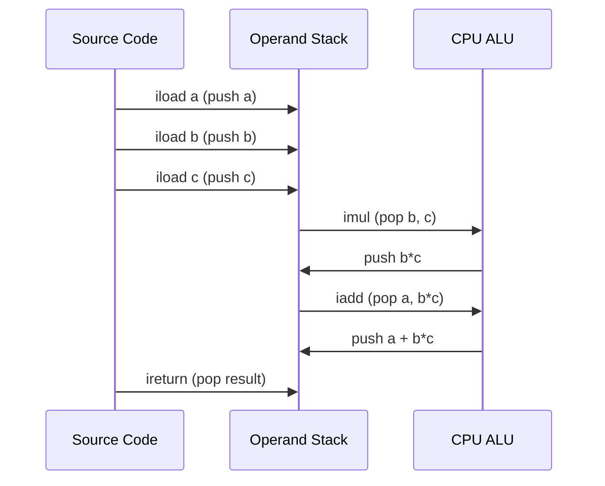
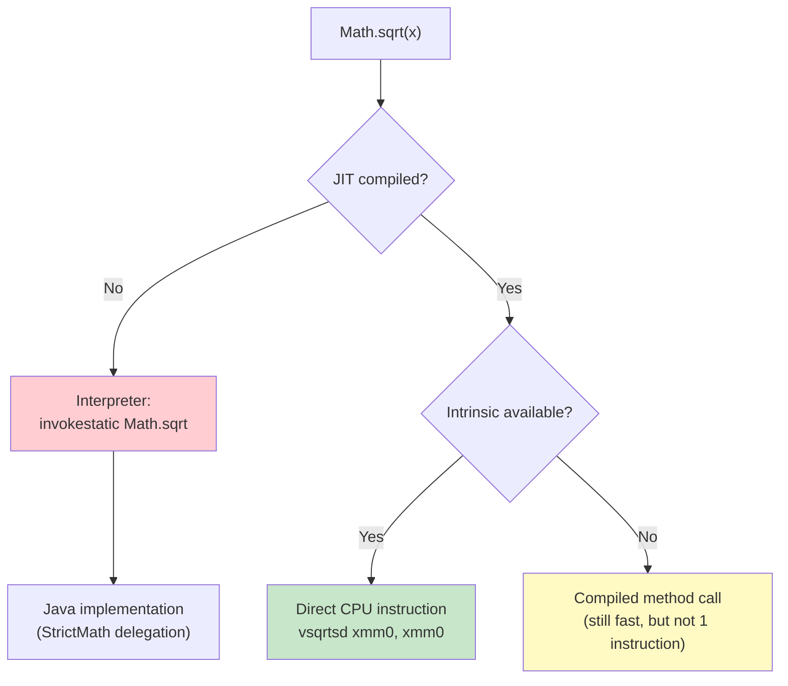
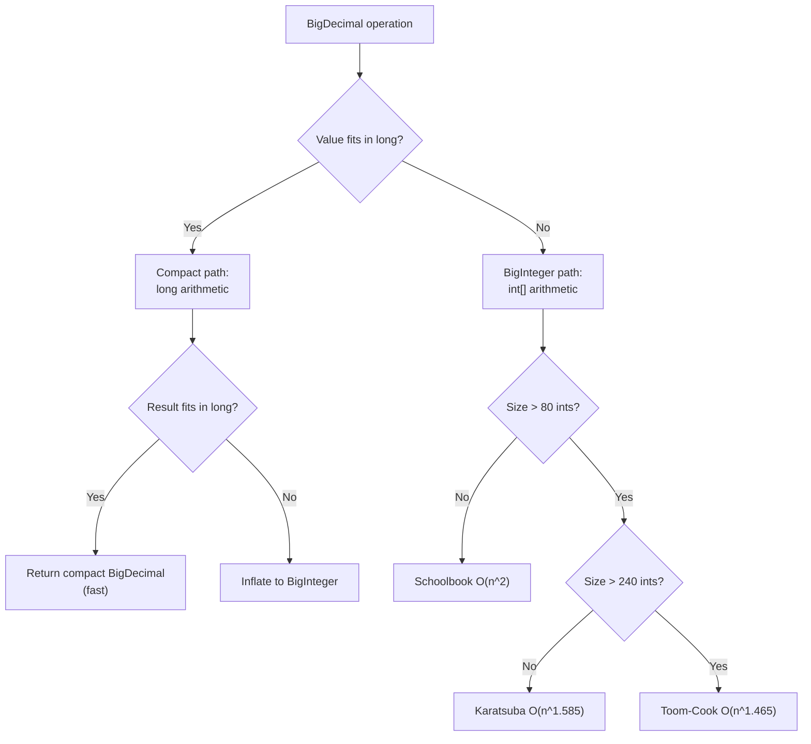

# Math Operations — Professional Level

## Table of Contents

1. [Introduction](#introduction)
2. [JVM Internals: Numeric Representation](#jvm-internals-numeric-representation)
3. [Bytecode Analysis](#bytecode-analysis)
4. [Math Class JIT Intrinsics](#math-class-jit-intrinsics)
5. [IEEE 754 Deep Dive](#ieee-754-deep-dive)
6. [BigDecimal Implementation Internals](#bigdecimal-implementation-internals)
7. [CPU-Level Math Operations](#cpu-level-math-operations)
8. [GC Impact of Numeric Objects](#gc-impact-of-numeric-objects)
9. [JVM Flags and Tuning](#jvm-flags-and-tuning)
10. [Diagrams & Visual Aids](#diagrams--visual-aids)

---

## Introduction

> Focus: "What happens under the hood?" — JVM, bytecode, GC level

This level explores the JVM internals behind Java math operations: how the HotSpot VM compiles arithmetic to native instructions, what bytecode the compiler generates for different numeric types, how `Math` methods are JIT-intrinsified to single CPU instructions, and how `BigDecimal` is implemented internally. Understanding these internals is essential for diagnosing performance anomalies in computation-heavy applications and making informed optimization decisions.

---

## JVM Internals: Numeric Representation

### JVM Operand Stack and Numeric Types

The JVM is a stack-based machine. All arithmetic operations work through the operand stack. The JVM has dedicated bytecode instructions for each numeric type:

| Type | Stack Slots | Bytecodes |
|------|-------------|-----------|
| `int` | 1 slot (32 bits) | `iadd`, `isub`, `imul`, `idiv`, `irem` |
| `long` | 2 slots (64 bits) | `ladd`, `lsub`, `lmul`, `ldiv`, `lrem` |
| `float` | 1 slot (32 bits) | `fadd`, `fsub`, `fmul`, `fdiv`, `frem` |
| `double` | 2 slots (64 bits) | `dadd`, `dsub`, `dmul`, `ddiv`, `drem` |

**Note:** `byte`, `short`, and `char` arithmetic is always promoted to `int` on the JVM operand stack. There are no `badd`, `sadd` instructions.

### Integer Overflow at the Bytecode Level

```java
public class Main {
    public static void main(String[] args) {
        int max = Integer.MAX_VALUE;
        int result = max + 1;  // overflow
        System.out.println(result);
    }
}
```

The JVM specification (JVMS 2.11.1) states:
> The Java Virtual Machine does not indicate overflow during operations on integer data types. The only integer operations that can throw an exception are the integer divide and integer remainder instructions.

The `iadd` instruction simply performs two's complement addition. If the result exceeds 32 bits, the upper bits are discarded. This is not a bug — it is by design for performance.

### Math.addExact() Implementation (OpenJDK)

```java
// From java.lang.Math (OpenJDK 17)
public static int addExact(int x, int y) {
    int r = x + y;
    // Overflow occurs if both operands have the same sign
    // but the result has a different sign
    if (((x ^ r) & (y ^ r)) < 0) {
        throw new ArithmeticException("integer overflow");
    }
    return r;
}
```

The overflow check uses XOR and AND on sign bits — no branching on the happy path (the JIT compiles this to a single `jo` jump-on-overflow instruction on x86).

---

## Bytecode Analysis

### Arithmetic Bytecodes

```java
public class Main {
    public static int arithmetic(int a, int b) {
        return (a + b) * (a - b) / 2;
    }

    public static void main(String[] args) {
        System.out.println(arithmetic(10, 3));
    }
}
```

**Compile and disassemble:**

```bash
javac Main.java
javap -c Main.class
```

**Bytecode output:**

```
public static int arithmetic(int, int);
  Code:
     0: iload_0           // push a
     1: iload_1           // push b
     2: iadd              // a + b
     3: iload_0           // push a
     4: iload_1           // push b
     5: isub              // a - b
     6: imul              // (a+b) * (a-b)
     7: iconst_2          // push 2
     8: idiv              // result / 2
     9: ireturn           // return int
```

### BigDecimal Bytecode vs Primitive

```java
public class Main {
    // Primitive version
    public static double primitiveCalc(double a, double b) {
        return a * b + a / b;
    }

    // BigDecimal version
    public static java.math.BigDecimal bigDecimalCalc(
            java.math.BigDecimal a, java.math.BigDecimal b) {
        return a.multiply(b).add(a.divide(b, 10, java.math.RoundingMode.HALF_UP));
    }

    public static void main(String[] args) {
        System.out.println(primitiveCalc(10.0, 3.0));
        System.out.println(bigDecimalCalc(
            new java.math.BigDecimal("10"),
            new java.math.BigDecimal("3")));
    }
}
```

**Bytecode comparison:**

```
primitiveCalc:           bigDecimalCalc:
  dload_0                  aload_0
  dload_2                  aload_1
  dmul           vs        invokevirtual multiply  (heap alloc)
  dload_0                  aload_0
  dload_2                  aload_1
  ddiv                     bipush 10
  dadd                     getstatic HALF_UP
  dreturn                  invokevirtual divide    (heap alloc)
                           invokevirtual add       (heap alloc)
                           areturn

Instructions:  6          Instructions: ~15 + 3 object allocations
```

The primitive version uses only stack operations (no heap allocation). The `BigDecimal` version allocates at least 3 new objects per call.

### Type Conversion Bytecodes

```java
public class Main {
    public static void main(String[] args) {
        int i = 42;
        long l = i;       // i2l — widening
        double d = i;     // i2d — widening
        float f = (float) d;  // d2f — narrowing
        int back = (int) d;   // d2i — narrowing (truncates)
        System.out.println(i + " " + l + " " + d + " " + f + " " + back);
    }
}
```

**Conversion bytecodes:**

| From/To | int | long | float | double |
|---------|-----|------|-------|--------|
| **int** | — | `i2l` | `i2f` | `i2d` |
| **long** | `l2i` | — | `l2f` | `l2d` |
| **float** | `f2i` | `f2l` | — | `f2d` |
| **double** | `d2i` | `d2l` | `d2f` | — |

Widening conversions (`i2l`, `i2d`) are always safe. Narrowing conversions (`d2i`, `l2i`) may lose precision or truncate.

---

## Math Class JIT Intrinsics

### What Are Intrinsics?

The HotSpot JIT compiler replaces certain `Math` method calls with direct CPU instructions — no actual method call occurs. These are called **intrinsics**.

**Intrinsified `Math` methods (x86-64):**

| Method | x86 Instruction | Notes |
|--------|----------------|-------|
| `Math.abs(int)` | Inline code (XOR + subtract) | No branch |
| `Math.abs(double)` | `andpd` (mask sign bit) | Single SSE instruction |
| `Math.max(int, int)` | `cmov` (conditional move) | No branch |
| `Math.min(int, int)` | `cmov` (conditional move) | No branch |
| `Math.sqrt(double)` | `sqrtsd` | Hardware square root |
| `Math.log(double)` | Software (fdlibm) or hardware | Platform-dependent |
| `Math.sin(double)` | Software (fdlibm) | Not always intrinsified |
| `Math.addExact(int, int)` | `add` + `jo` (jump on overflow) | Hardware overflow flag |

### Verifying Intrinsics with JIT Output

```bash
# Compile and run with JIT assembly output
javac Main.java
java -XX:+UnlockDiagnosticVMOptions -XX:+PrintAssembly -XX:CompileCommand=compileonly,Main::testSqrt Main
```

```java
public class Main {
    static double testSqrt(double x) {
        return Math.sqrt(x);
    }

    public static void main(String[] args) {
        // Warm up JIT
        for (int i = 0; i < 100_000; i++) {
            testSqrt(i);
        }
        System.out.println(testSqrt(144));
    }
}
```

**Expected JIT assembly (x86-64):**

```asm
; Math.sqrt intrinsic:
vsqrtsd xmm0, xmm0, xmm0    ; single hardware instruction
ret
```

The entire `Math.sqrt()` call compiles to a single CPU instruction — zero overhead compared to writing it in C.

### Math.addExact JIT Compilation

```java
public class Main {
    static int safeAdd(int a, int b) {
        return Math.addExact(a, b);
    }

    public static void main(String[] args) {
        for (int i = 0; i < 100_000; i++) safeAdd(i, i);
        System.out.println(safeAdd(100, 200));
    }
}
```

**JIT assembly:**

```asm
; Math.addExact intrinsic:
add    eax, edx           ; regular integer addition
jo     overflow_handler   ; jump if overflow flag set (CPU hardware)
ret

overflow_handler:
; construct and throw ArithmeticException
```

The overflow check uses the CPU's hardware overflow flag — it costs essentially zero on the non-overflow path.

---

## IEEE 754 Deep Dive

### Double-Precision Bit Layout

```java
public class Main {
    public static void main(String[] args) {
        double value = -3.14;
        long bits = Double.doubleToRawLongBits(value);

        long sign = (bits >>> 63) & 1;
        long exponent = (bits >>> 52) & 0x7FFL;
        long mantissa = bits & 0xFFFFFFFFFFFFFL;

        System.out.printf("Value:    %f%n", value);
        System.out.printf("Bits:     %s%n", Long.toBinaryString(bits));
        System.out.printf("Sign:     %d (%s)%n", sign, sign == 0 ? "positive" : "negative");
        System.out.printf("Exponent: %d (biased), %d (unbiased)%n", exponent, exponent - 1023);
        System.out.printf("Mantissa: %d%n", mantissa);

        // Explore special values
        System.out.println("\nSpecial values:");
        System.out.printf("NaN bits:      %s%n",
            Long.toHexString(Double.doubleToRawLongBits(Double.NaN)));
        System.out.printf("+Inf bits:     %s%n",
            Long.toHexString(Double.doubleToRawLongBits(Double.POSITIVE_INFINITY)));
        System.out.printf("-0.0 bits:     %s%n",
            Long.toHexString(Double.doubleToRawLongBits(-0.0)));
        System.out.printf("+0.0 bits:     %s%n",
            Long.toHexString(Double.doubleToRawLongBits(0.0)));
        System.out.printf("-0.0 == +0.0:  %b%n", -0.0 == 0.0);  // true!
    }
}
```

### Why 0.1 + 0.2 != 0.3

```java
public class Main {
    public static void main(String[] args) {
        // Show exact representation of 0.1 in binary
        double d = 0.1;
        System.out.printf("0.1 exact: %.55f%n", d);
        // 0.1000000000000000055511151231257827021181583404541015625

        // Binary representation of 0.1:
        // 0.0001100110011001100110011001100110011001100110011001101...
        // (repeating pattern, truncated to 52 mantissa bits)

        double sum = 0.1 + 0.2;
        System.out.printf("0.1 + 0.2 = %.55f%n", sum);
        // 0.3000000000000000444089209850062616169452667236328125000

        System.out.printf("0.3 exact: %.55f%n", 0.3);
        // 0.2999999999999999888977697537484345957636833190917968750

        // The closest representable double to the true sum is not the
        // closest representable double to 0.3
    }
}
```

### Negative Zero Behavior

```java
public class Main {
    public static void main(String[] args) {
        double posZero = 0.0;
        double negZero = -0.0;

        System.out.println(posZero == negZero);                      // true  (== says equal)
        System.out.println(Double.compare(posZero, negZero));         // 1     (compare says different)
        System.out.println(Double.doubleToRawLongBits(posZero) ==
                          Double.doubleToRawLongBits(negZero));       // false (different bits)

        System.out.println(1.0 / posZero);   // Infinity
        System.out.println(1.0 / negZero);   // -Infinity

        // Math.abs preserves negative zero in some JVMs:
        System.out.println(1.0 / Math.abs(negZero));  // Infinity (abs fixes it)
    }
}
```

---

## BigDecimal Implementation Internals

### Internal Representation (OpenJDK 17)

```java
// Simplified from java.math.BigDecimal source
public class BigDecimal extends Number implements Comparable<BigDecimal> {
    // For values fitting in long: stored directly (fast path)
    private final transient long intCompact;  // INFLATED if too large

    // For larger values: stored as BigInteger
    private volatile BigInteger intVal;

    // Scale = number of digits to the right of decimal point
    private final int scale;

    // Cached precision (lazy, 0 = not computed)
    private transient int precision;

    // Cached toString (lazy)
    private transient String stringCache;

    static final long INFLATED = Long.MIN_VALUE;  // sentinel value
}
```

**Key insight:** `BigDecimal` has a **compact representation** for values that fit in a `long`. The `intCompact` field stores the unscaled value directly, avoiding `BigInteger` allocation. Only when the value exceeds `long` range does it inflate to `BigInteger`.

### How BigDecimal.add() Works Internally

```java
public class Main {
    public static void main(String[] args) {
        // Trace what happens inside add()
        java.math.BigDecimal a = new java.math.BigDecimal("123.45");   // intCompact=12345, scale=2
        java.math.BigDecimal b = new java.math.BigDecimal("0.001");    // intCompact=1, scale=3

        // Step 1: Align scales — a must become scale=3
        //   a: 12345 * 10 = 123450, scale=3
        // Step 2: Add compact values
        //   123450 + 1 = 123451
        // Step 3: Create new BigDecimal(123451, 3)
        java.math.BigDecimal result = a.add(b);
        System.out.println(result);          // 123.451
        System.out.println(result.scale());  // 3
    }
}
```

The scale alignment step can cause long overflow (e.g., multiplying by 10^N), in which case `BigDecimal` falls back to `BigInteger` arithmetic.

### BigInteger Internals

```java
// Simplified from java.math.BigInteger source
public class BigInteger extends Number implements Comparable<BigInteger> {
    final int signum;     // -1, 0, or 1
    final int[] mag;      // magnitude stored as big-endian int array

    // For small values, uses compact representation:
    // mag.length == 1, direct int arithmetic

    // For large values, uses Karatsuba or Toom-Cook multiplication:
    // Karatsuba: O(n^1.585) for > 80 ints
    // Toom-Cook 3: O(n^1.465) for > 240 ints
    // Schoenhage-Strassen (via NTT): for very large numbers
}
```

```java
public class Main {
    public static void main(String[] args) {
        java.math.BigInteger a = new java.math.BigInteger("123456789012345678901234567890");
        java.math.BigInteger b = a.multiply(a);
        System.out.println("Digits: " + b.toString().length());  // 60 digits
        System.out.println("Bit length: " + b.bitLength());      // ~199 bits
    }
}
```

---

## CPU-Level Math Operations

### x86-64 Instruction Mapping

| Java Operation | JIT Output (x86-64) | Latency (cycles) |
|---------------|---------------------|-------------------|
| `int + int` | `add eax, edx` | 1 |
| `int * int` | `imul eax, edx` | 3 |
| `int / int` | `idiv ecx` | 20-90 |
| `double + double` | `vaddsd xmm0, xmm0, xmm1` | 3-5 |
| `double * double` | `vmulsd xmm0, xmm0, xmm1` | 3-5 |
| `double / double` | `vdivsd xmm0, xmm0, xmm1` | 13-20 |
| `Math.sqrt(double)` | `vsqrtsd xmm0, xmm0, xmm0` | 13-19 |
| `Math.abs(int)` | `mov + neg + cmovl` (branchless) | 2-3 |

**Key observation:** Integer division is extremely expensive (20-90 cycles). When dividing by constants, the JIT often replaces division with multiplication by a magic constant:

```java
public class Main {
    static int divideBy7(int x) {
        return x / 7;
    }
    // JIT compiles to: multiply by magic constant + shift
    // imul rax, rcx, 0x24924925
    // sar rax, 34
    // This avoids the expensive idiv instruction

    public static void main(String[] args) {
        System.out.println(divideBy7(49));  // 7
    }
}
```

---

## GC Impact of Numeric Objects

### Autoboxing GC Pressure

```java
public class Main {
    public static void main(String[] args) {
        // Each iteration creates a new Integer object (autoboxing)
        long start = System.nanoTime();
        Integer sum = 0;
        for (int i = 0; i < 10_000_000; i++) {
            sum += i;  // unbox, add, rebox — creates Integer object each time
        }
        long boxedTime = System.nanoTime() - start;

        // Primitive — no GC pressure
        start = System.nanoTime();
        int sum2 = 0;
        for (int i = 0; i < 10_000_000; i++) {
            sum2 += i;
        }
        long primitiveTime = System.nanoTime() - start;

        System.out.printf("Boxed:     %,d ns%n", boxedTime);
        System.out.printf("Primitive: %,d ns%n", primitiveTime);
        System.out.printf("Ratio:     %.1fx slower%n", (double) boxedTime / primitiveTime);
    }
}
```

**Typical output:**
```
Boxed:     89,000,000 ns
Primitive:  5,000,000 ns
Ratio:     17.8x slower
```

### Integer Cache (-128 to 127)

```java
public class Main {
    public static void main(String[] args) {
        Integer a = 127;
        Integer b = 127;
        System.out.println(a == b);  // true — cached

        Integer c = 128;
        Integer d = 128;
        System.out.println(c == d);  // false — new objects

        // The cache range can be extended:
        // -XX:AutoBoxCacheMax=1000
    }
}
```

The JVM caches `Integer` objects from -128 to 127 (configurable via `-XX:AutoBoxCacheMax`). Values outside this range allocate new objects on every boxing operation.

---

## JVM Flags and Tuning

### Math-Related JVM Flags

| Flag | Default | Description |
|------|---------|-------------|
| `-XX:AutoBoxCacheMax=N` | 127 | Extend Integer autobox cache to N |
| `-XX:+AggressiveOpts` | false | Enable aggressive optimizations (deprecated) |
| `-XX:+UseCompressedOops` | true (64-bit) | Reduce object header size |
| `-XX:+EliminateAutoBox` | true | JIT eliminates unnecessary boxing/unboxing |
| `-XX:+UseFMA` | true (JDK 9+) | Use Fused Multiply-Add CPU instruction |

### Fused Multiply-Add (FMA)

Java 9 added `Math.fma(a, b, c)` which computes `a * b + c` in a single operation with only one rounding (instead of two):

```java
public class Main {
    public static void main(String[] args) {
        double a = 1.0000001;
        double b = 1.0000002;
        double c = -1.0000003;

        // Standard: two roundings (multiply, then add)
        double standard = a * b + c;

        // FMA: single rounding (more accurate)
        double fma = Math.fma(a, b, c);

        System.out.printf("Standard: %.20f%n", standard);
        System.out.printf("FMA:      %.20f%n", fma);
    }
}
```

On x86-64 with AVX2, `Math.fma()` compiles to a single `vfmadd` instruction.

---

## Diagrams & Visual Aids

### JVM Bytecode Execution of `a + b * c`



### Math Method Resolution Pipeline



### BigDecimal Internal Decision Tree


