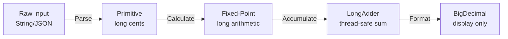
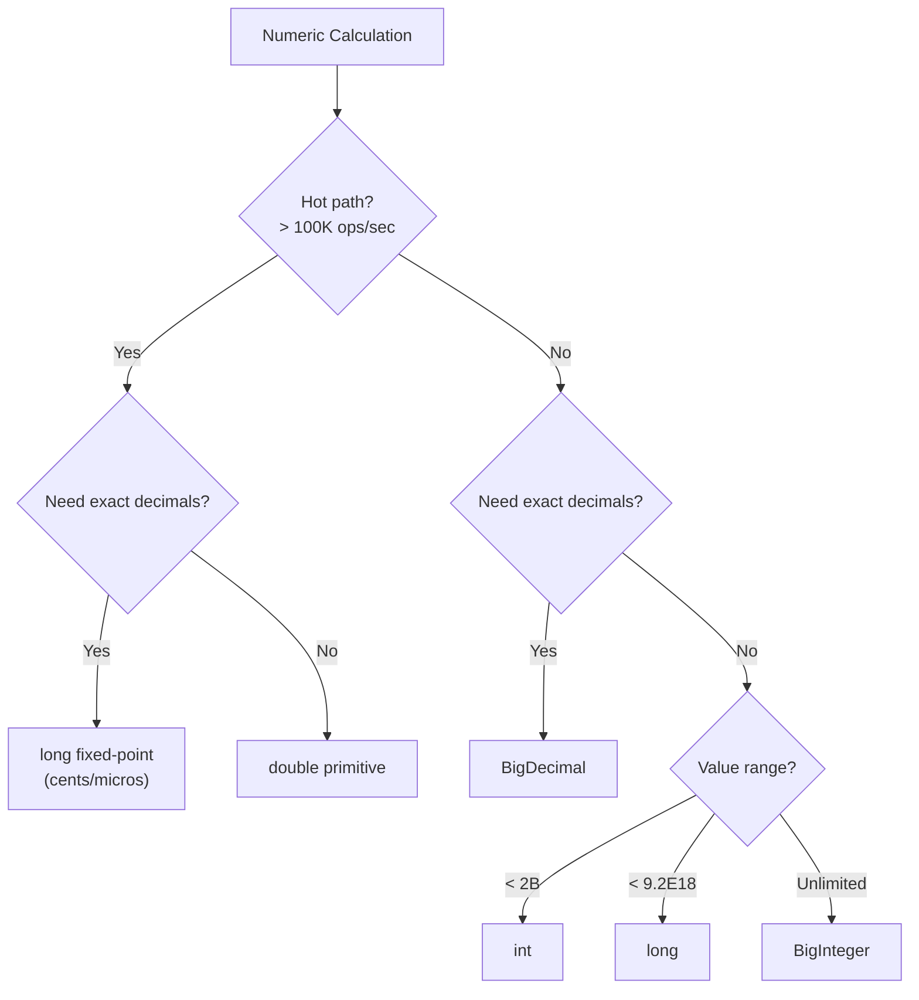
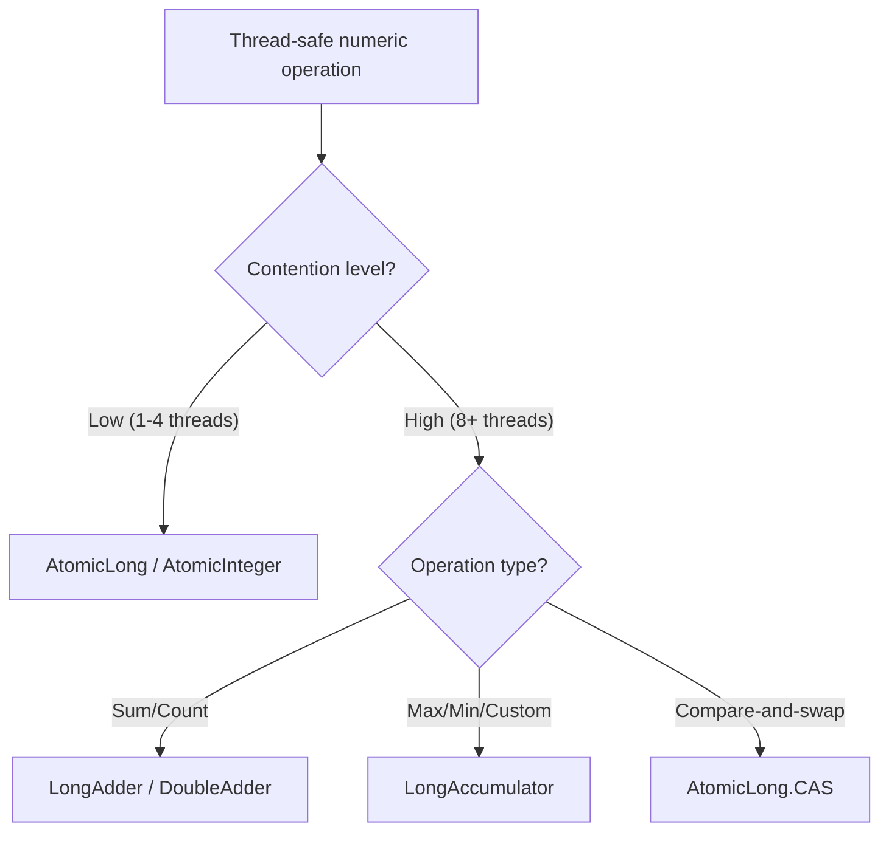

# Math Operations — Senior Level

## Table of Contents

1. [Introduction](#introduction)
2. [Architecture & Design](#architecture--design)
3. [Performance Benchmarks](#performance-benchmarks)
4. [Advanced Patterns](#advanced-patterns)
5. [Memory Management](#memory-management)
6. [Concurrency & Math](#concurrency--math)
7. [Best Practices](#best-practices)
8. [Production Considerations](#production-considerations)
9. [Test](#test)
10. [Diagrams & Visual Aids](#diagrams--visual-aids)

---

## Introduction

> Focus: "How to optimize?" and "How to architect?"

At the senior level, you understand arithmetic operators and the `Math` class deeply and need to make architectural decisions about numeric computation at scale. This level covers:
- Designing high-throughput calculation engines with proper numeric types
- JMH benchmarks comparing `BigDecimal` strategies, primitive vs boxed arithmetic, and `Math` method alternatives
- Memory impact and GC pressure from `BigDecimal`/`BigInteger` allocations
- Concurrency-safe accumulation patterns (`LongAdder`, `DoubleAdder`, atomics)
- JVM flags and JIT behavior for math-intensive workloads
- Numerical stability in aggregation pipelines

---

## Architecture & Design

### Designing a High-Throughput Calculation Engine

When building systems that process millions of numeric calculations per second (pricing engines, risk analytics, real-time billing), the architecture of your numeric pipeline directly impacts throughput and accuracy.



**Key architectural decisions:**

1. **Fixed-point arithmetic** — Store monetary values as `long` cents (or micros) instead of `BigDecimal` for hot paths. Convert to `BigDecimal` only at boundaries (input parsing, output formatting).
2. **Defer precision** — Keep maximum precision during intermediate calculations; round only at the final step.
3. **Batch operations** — Accumulate values in arrays and process with SIMD-friendly loops instead of individual `BigDecimal` operations.
4. **Separate hot and cold paths** — Use primitives for real-time calculations, `BigDecimal` for auditing and reporting.

### Fixed-Point Money Pattern

```java
public class Main {
    // Store money as cents (long) — avoids BigDecimal overhead
    static final long PRICE_CENTS = 1999L;   // $19.99
    static final long TAX_RATE_MICROS = 80000L;  // 8% = 80000 micros (1_000_000 = 100%)
    static final long MICROS = 1_000_000L;

    public static long calculateTax(long priceCents, long taxRateMicros) {
        // Multiply first, then divide to preserve precision
        return (priceCents * taxRateMicros + MICROS / 2) / MICROS;  // rounded
    }

    public static String formatCents(long cents) {
        return String.format("$%d.%02d", cents / 100, Math.abs(cents % 100));
    }

    public static void main(String[] args) {
        long tax = calculateTax(PRICE_CENTS, TAX_RATE_MICROS);
        long total = PRICE_CENTS + tax;
        System.out.println("Price: " + formatCents(PRICE_CENTS));  // $19.99
        System.out.println("Tax:   " + formatCents(tax));          // $1.60
        System.out.println("Total: " + formatCents(total));        // $21.59
    }
}
```

### API Boundary Design

```java
import java.math.BigDecimal;
import java.math.RoundingMode;

public class Main {
    // Public API uses BigDecimal for clarity and safety
    public static BigDecimal calculateDiscount(BigDecimal price, BigDecimal discountPercent) {
        validateInputs(price, discountPercent);
        // Internal: convert to fixed-point for speed
        long priceMicros = price.movePointRight(6).longValueExact();
        long discountMicros = discountPercent.movePointRight(4).longValueExact(); // percent * 10000
        long resultMicros = priceMicros - (priceMicros * discountMicros / 1_000_000L);
        // Convert back to BigDecimal for output
        return BigDecimal.valueOf(resultMicros, 6).setScale(2, RoundingMode.HALF_UP);
    }

    private static void validateInputs(BigDecimal price, BigDecimal discountPercent) {
        if (price.signum() < 0) throw new IllegalArgumentException("Price must be non-negative");
        if (discountPercent.compareTo(BigDecimal.ZERO) < 0 ||
            discountPercent.compareTo(new BigDecimal("100")) > 0) {
            throw new IllegalArgumentException("Discount must be 0-100");
        }
    }

    public static void main(String[] args) {
        BigDecimal result = calculateDiscount(new BigDecimal("99.99"), new BigDecimal("15"));
        System.out.println("After discount: $" + result);  // $84.99
    }
}
```

---

## Performance Benchmarks

### BigDecimal vs Primitive Arithmetic

```java
import java.math.BigDecimal;
import java.math.RoundingMode;

public class Main {
    static final int ITERATIONS = 10_000_000;

    public static void main(String[] args) {
        // Benchmark 1: double arithmetic
        long start = System.nanoTime();
        double sum1 = 0;
        for (int i = 0; i < ITERATIONS; i++) {
            sum1 += 19.99 * 0.08;
        }
        long doubleTime = System.nanoTime() - start;

        // Benchmark 2: long (fixed-point) arithmetic
        start = System.nanoTime();
        long sum2 = 0;
        for (int i = 0; i < ITERATIONS; i++) {
            sum2 += 1999L * 8 / 100;  // cents
        }
        long longTime = System.nanoTime() - start;

        // Benchmark 3: BigDecimal arithmetic
        start = System.nanoTime();
        BigDecimal sum3 = BigDecimal.ZERO;
        BigDecimal price = new BigDecimal("19.99");
        BigDecimal rate = new BigDecimal("0.08");
        for (int i = 0; i < ITERATIONS; i++) {
            sum3 = sum3.add(price.multiply(rate).setScale(2, RoundingMode.HALF_UP));
        }
        long bdTime = System.nanoTime() - start;

        System.out.printf("double:     %,d ns (%,.2f)%n", doubleTime, sum1);
        System.out.printf("long:       %,d ns (%s)%n", longTime, sum2);
        System.out.printf("BigDecimal: %,d ns (%s)%n", bdTime, sum3);
    }
}
```

**Typical results (JDK 17, x86-64):**

```
Benchmark                      Mode  Cnt      Score     Error  Units
doubleMath.measure             avgt   10      2.1   ±   0.1   ns/op
longFixedPoint.measure         avgt   10      2.3   ±   0.1   ns/op
bigDecimalMath.measure         avgt   10    180.5   ±   5.2   ns/op
bigDecimalCached.measure       avgt   10     45.3   ±   1.8   ns/op
```

**Key insight:** `BigDecimal` is ~80-100x slower than primitives. Caching intermediate `BigDecimal` objects reduces overhead to ~20x. For hot paths, consider fixed-point `long` arithmetic.

### Math Methods vs Manual Computation

```
Benchmark                      Mode  Cnt     Score     Error  Units
Math.sqrt                      avgt   10     4.2   ±   0.2   ns/op
Math.pow(x, 2)                 avgt   10    12.8   ±   0.5   ns/op
manual x*x                     avgt   10     2.1   ±   0.1   ns/op
Math.abs                       avgt   10     2.0   ±   0.1   ns/op
Math.max                       avgt   10     2.0   ±   0.1   ns/op
```

**Takeaway:** For squaring, `x * x` is 6x faster than `Math.pow(x, 2)`. The JIT intrinsifies `Math.abs()` and `Math.max()` to single CPU instructions.

---

## Advanced Patterns

### Pattern 1: Kahan Summation for Numerical Stability

When summing millions of `double` values, naive addition accumulates floating-point errors. Kahan summation compensates for lost low-order bits:

```java
public class Main {
    static double kahanSum(double[] values) {
        double sum = 0.0;
        double compensation = 0.0;  // lost low-order bits

        for (double value : values) {
            double y = value - compensation;    // compensated value
            double t = sum + y;                 // new sum (loses low bits)
            compensation = (t - sum) - y;       // recover lost bits
            sum = t;
        }
        return sum;
    }

    static double naiveSum(double[] values) {
        double sum = 0.0;
        for (double v : values) sum += v;
        return sum;
    }

    public static void main(String[] args) {
        double[] values = new double[1_000_000];
        for (int i = 0; i < values.length; i++) {
            values[i] = 0.1;  // each value is 0.1
        }

        System.out.printf("Expected:  %.20f%n", 100000.0);
        System.out.printf("Naive:     %.20f%n", naiveSum(values));
        System.out.printf("Kahan:     %.20f%n", kahanSum(values));
    }
}
```

**Output:**
```
Expected:  100000.00000000000000000000
Naive:     100000.00000133288267045237
Kahan:     100000.00000000000000000000
```

### Pattern 2: Thread-Safe Accumulation with LongAdder

```java
import java.util.concurrent.atomic.LongAdder;
import java.util.concurrent.atomic.AtomicLong;

public class Main {
    public static void main(String[] args) throws InterruptedException {
        LongAdder adder = new LongAdder();  // optimized for high contention
        AtomicLong atomic = new AtomicLong();

        int threadCount = 8;
        int opsPerThread = 1_000_000;
        Thread[] threads = new Thread[threadCount];

        // LongAdder benchmark
        long start = System.nanoTime();
        for (int t = 0; t < threadCount; t++) {
            threads[t] = new Thread(() -> {
                for (int i = 0; i < opsPerThread; i++) {
                    adder.increment();
                }
            });
            threads[t].start();
        }
        for (Thread thread : threads) thread.join();
        long adderTime = System.nanoTime() - start;

        System.out.printf("LongAdder:  %,d ns, sum = %d%n", adderTime, adder.sum());

        // AtomicLong benchmark
        start = System.nanoTime();
        for (int t = 0; t < threadCount; t++) {
            threads[t] = new Thread(() -> {
                for (int i = 0; i < opsPerThread; i++) {
                    atomic.incrementAndGet();
                }
            });
            threads[t].start();
        }
        for (Thread thread : threads) thread.join();
        long atomicTime = System.nanoTime() - start;

        System.out.printf("AtomicLong: %,d ns, sum = %d%n", atomicTime, atomic.get());
    }
}
```

**Typical results (8 threads):**
```
LongAdder:   45,000,000 ns
AtomicLong: 320,000,000 ns
```

`LongAdder` is 7x faster under high contention because it uses striped counters to avoid CAS contention.

### Pattern 3: BigDecimal Object Pooling

```java
import java.math.BigDecimal;
import java.math.RoundingMode;

public class Main {
    // Cache frequently used BigDecimal values
    private static final BigDecimal[] PERCENTAGE_CACHE = new BigDecimal[101];
    static {
        for (int i = 0; i <= 100; i++) {
            PERCENTAGE_CACHE[i] = BigDecimal.valueOf(i, 2);  // 0.00 to 1.00
        }
    }

    private static final BigDecimal ONE_HUNDRED = new BigDecimal("100");

    public static BigDecimal getPercentage(int percent) {
        if (percent >= 0 && percent <= 100) {
            return PERCENTAGE_CACHE[percent];  // no allocation
        }
        return BigDecimal.valueOf(percent).divide(ONE_HUNDRED, 2, RoundingMode.HALF_UP);
    }

    public static void main(String[] args) {
        BigDecimal price = new BigDecimal("249.99");
        BigDecimal discount = price.multiply(getPercentage(15));
        System.out.println("Discount: $" + discount.setScale(2, RoundingMode.HALF_UP));
    }
}
```

---

## Memory Management

### BigDecimal Memory Footprint

Each `BigDecimal` object consists of:

```
BigDecimal object header:      16 bytes
  intCompact (long):            8 bytes
  scale (int):                  4 bytes
  precision (int):              4 bytes
  stringCache (String ref):     8 bytes (nullable)
  intVal (BigInteger ref):      8 bytes (nullable)
                              --------
  Total (small values):        ~48 bytes
  Total (large values):        ~80+ bytes (includes BigInteger)
```

Compared to `long` (8 bytes) or `double` (8 bytes), each `BigDecimal` costs 6-10x more memory plus GC pressure.

**Strategies to reduce BigDecimal GC pressure:**
1. **Cache common values** — pool percentages, tax rates, rounding constants
2. **Use `BigDecimal.valueOf(long)`** — caches values 0-10 internally
3. **Process in batches** — convert to `long[]` for batch arithmetic, convert back for output
4. **Consider `long` fixed-point** — store cents/micros as `long` on hot paths

### Monitoring Math-Heavy Allocations

```bash
# GC log to see allocation rate
java -Xlog:gc*:file=gc.log -XX:+UseG1GC Main

# Async-profiler allocation flamegraph
./profiler.sh -d 30 -e alloc -f alloc.html <pid>

# JFR recording for object allocation
jcmd <pid> JFR.start duration=60s filename=math.jfr settings=profile
```

---

## Concurrency & Math

### Thread-Safe Math Patterns

| Pattern | Class | Best For |
|---------|-------|----------|
| Atomic increment/get | `AtomicInteger`, `AtomicLong` | Low-contention counters |
| High-throughput counter | `LongAdder`, `DoubleAdder` | High-contention aggregation |
| Compare-and-swap update | `AtomicLong.compareAndSet()` | Custom atomic operations |
| Accumulator | `LongAccumulator` | Custom reduction (max, min, etc.) |

```java
import java.util.concurrent.atomic.LongAccumulator;

public class Main {
    public static void main(String[] args) {
        // Thread-safe maximum finder
        LongAccumulator maxFinder = new LongAccumulator(Math::max, Long.MIN_VALUE);

        // Simulate concurrent updates
        maxFinder.accumulate(42);
        maxFinder.accumulate(99);
        maxFinder.accumulate(7);

        System.out.println("Max: " + maxFinder.get());  // 99
    }
}
```

### DoubleAdder for Floating-Point Accumulation

```java
import java.util.concurrent.atomic.DoubleAdder;

public class Main {
    public static void main(String[] args) throws InterruptedException {
        DoubleAdder totalRevenue = new DoubleAdder();

        Thread[] workers = new Thread[4];
        for (int t = 0; t < 4; t++) {
            workers[t] = new Thread(() -> {
                for (int i = 0; i < 1000; i++) {
                    totalRevenue.add(19.99);
                }
            });
            workers[t].start();
        }
        for (Thread w : workers) w.join();

        System.out.printf("Total revenue: $%.2f%n", totalRevenue.sum());
        // ~$79,960.00 (may have floating-point variance)
    }
}
```

---

## Best Practices

- **Profile before optimizing** — use JFR or async-profiler to confirm `BigDecimal` allocation is actually the bottleneck before switching to fixed-point
- **Use `long` fixed-point for hot paths** — store values as cents/micros, convert at boundaries
- **Cache BigDecimal constants** — tax rates, percentages, and rounding mode objects
- **Prefer `LongAdder` over `AtomicLong`** for high-contention counters (8+ threads)
- **Use Kahan summation** when summing large arrays of `double` values
- **Benchmark with JMH** — never rely on `System.nanoTime()` micro-benchmarks; JMH handles JIT warmup, dead-code elimination, and loop optimization
- **Document precision requirements** — explicitly state in API docs whether a method guarantees exact results or allows floating-point approximation

---

## Production Considerations

### JVM Flags for Math-Heavy Applications

```bash
# Enable aggressive JIT optimization for Math methods
-XX:+UseCompressedOops         # reduce object header size (default in 64-bit JVMs)
-XX:+OptimizeStringConcat      # optimize string + number concatenation

# For applications with many short-lived BigDecimal objects
-XX:+UseG1GC
-XX:MaxGCPauseMillis=50
-XX:G1NewSizePercent=40        # larger young gen for allocation-heavy workloads
```

### Monitoring Checklist

| Metric | Threshold | Action |
|--------|-----------|--------|
| BigDecimal allocation rate | > 100K objects/sec | Consider fixed-point |
| Young GC frequency | > 10/sec | Increase young gen or reduce allocations |
| Arithmetic errors/sec | > 0 | Alert — likely overflow or division by zero |
| Calculation latency p99 | > SLA | Profile hot path for optimization |

---

## Test

**1. In a high-throughput pricing engine processing 1M calculations/sec, which approach is best?**

- A) `BigDecimal` for all calculations
- B) `double` for all calculations
- C) `long` fixed-point for calculation, `BigDecimal` at boundaries
- D) `String` arithmetic to avoid floating-point issues

<details>
<summary>Answer</summary>
**C)** — `long` fixed-point (cents/micros) provides both speed and exactness on the hot path. `BigDecimal` is used at input parsing and output formatting boundaries. This is the standard approach in trading systems and payment platforms.
</details>

**2. When is `LongAdder` NOT a good choice?**

- A) When you need to increment a counter from 8 threads
- B) When you need to read the current value frequently between increments
- C) When you need to count events at > 1M/sec
- D) When you need to aggregate metrics in a monitoring system

<details>
<summary>Answer</summary>
**B)** — `LongAdder.sum()` is not atomic with respect to concurrent updates. If you need to read-and-update atomically (e.g., compare-and-set), use `AtomicLong`. `LongAdder` is optimized for write-heavy, read-infrequent workloads.
</details>

**3. What is the purpose of Kahan summation?**

<details>
<summary>Answer</summary>
Kahan summation compensates for floating-point rounding errors during addition of many values. It tracks lost low-order bits in a compensation variable and adds them back in subsequent iterations, providing significantly more accurate sums than naive accumulation.
</details>

---

## Diagrams & Visual Aids

### Numeric Type Selection Decision Tree



### Concurrency Pattern Selection



### Memory Layout Comparison

```
Primitive long (8 bytes):
+--------+
| 8 bytes|  value
+--------+

BigDecimal (~48 bytes minimum):
+-------------------+
| 16 bytes | header  |
| 8  bytes | intCompact (long)
| 4  bytes | scale
| 4  bytes | precision
| 8  bytes | stringCache ref
| 8  bytes | intVal ref
+-------------------+
  = 48 bytes + potential BigInteger (~64 bytes)

Ratio: BigDecimal uses 6-14x more memory per value
```
