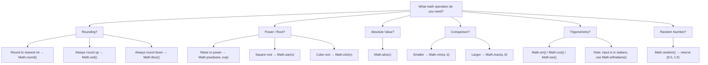

# Math Operations — Practical Tasks

## Table of Contents

1. [Junior Tasks](#junior-tasks)
2. [Middle Tasks](#middle-tasks)
3. [Senior Tasks](#senior-tasks)
4. [Questions](#questions)
5. [Mini Projects](#mini-projects)
6. [Challenge](#challenge)

---

## Junior Tasks

### Task 1: Simple Calculator

**Type:** 💻 Code

**Goal:** Practice all arithmetic operators (`+`, `-`, `*`, `/`, `%`) and handle division by zero.

**Instructions:**
1. Create a method `calculate(int a, int b, char op)` that returns the result as a `String`.
2. Support operators: `+`, `-`, `*`, `/`, `%`.
3. Return `"Cannot divide by zero!"` when dividing or modding by zero.
4. Return `"Unknown operator: X"` for unsupported operators.

**Starter code:**

```java
public class Main {
    public static String calculate(int a, int b, char op) {
        // TODO: Implement using switch statement
        return "";
    }

    public static void main(String[] args) {
        System.out.println(calculate(10, 3, '/'));   // Expected: 3
        System.out.println(calculate(10, 0, '/'));   // Expected: Cannot divide by zero!
        System.out.println(calculate(7, 2, '%'));    // Expected: 1
        System.out.println(calculate(5, 3, '+'));    // Expected: 8
    }
}
```

**Expected output:**
```
3
Cannot divide by zero!
1
8
```

**Evaluation criteria:**
- [ ] Code compiles and runs
- [ ] Output matches expected
- [ ] Division by zero is handled for both `/` and `%`
- [ ] Unknown operators produce a clear message

<details>
<summary>Solution</summary>

```java
public class Main {
    public static String calculate(int a, int b, char op) {
        switch (op) {
            case '+': return String.valueOf(a + b);
            case '-': return String.valueOf(a - b);
            case '*': return String.valueOf(a * b);
            case '/':
                if (b == 0) return "Cannot divide by zero!";
                return String.valueOf(a / b);
            case '%':
                if (b == 0) return "Cannot divide by zero!";
                return String.valueOf(a % b);
            default: return "Unknown operator: " + op;
        }
    }

    public static void main(String[] args) {
        System.out.println(calculate(10, 3, '/'));   // 3
        System.out.println(calculate(10, 0, '/'));   // Cannot divide by zero!
        System.out.println(calculate(7, 2, '%'));    // 1
        System.out.println(calculate(5, 3, '+'));    // 8
    }
}
```
</details>

---

### Task 2: Flowchart for Math.class Method Selection

**Type:** 🎨 Design

**Goal:** Understand which `Math` class method to use for common mathematical operations.

**Instructions:**
1. Draw a decision flowchart (Mermaid or ASCII) that helps a developer choose the right `Math` method.
2. Include at least these categories: rounding (`ceil`, `floor`, `round`), power/root (`pow`, `sqrt`, `cbrt`), absolute value (`abs`), min/max, trigonometric (`sin`, `cos`, `tan`), and random (`random`).
3. Start from the question "What kind of math operation do you need?" and branch into each category.

**Deliverable:** A Mermaid or ASCII flowchart diagram.

**Example format:**


**Evaluation criteria:**
- [ ] Design is clear and readable
- [ ] All major `Math` method categories are covered
- [ ] Decision paths are logically structured
- [ ] Notes about gotchas (e.g., radians vs degrees) are included

---

### Task 3: Temperature Converter with Math Functions

**Type:** 💻 Code

**Goal:** Practice `Math` class methods (`round`, `abs`, `max`, `min`) in a real-world scenario.

**Instructions:**
1. Write methods to convert Celsius to Fahrenheit and vice versa. Formula: `F = C * 9/5 + 32`.
2. Round results to 1 decimal place using `Math.round()`.
3. Write a method `temperatureStats(double[] temps)` that returns the min, max, and average temperature.
4. Print all results in the `main` method.

**Starter code:**

```java
public class Main {
    public static double celsiusToFahrenheit(double celsius) {
        // TODO: Convert and round to 1 decimal place
        return 0;
    }

    public static double fahrenheitToCelsius(double fahrenheit) {
        // TODO: Convert and round to 1 decimal place
        return 0;
    }

    public static void temperatureStats(double[] temps) {
        // TODO: Print min, max, and average
    }

    public static void main(String[] args) {
        System.out.println(celsiusToFahrenheit(100));  // Expected: 212.0
        System.out.println(celsiusToFahrenheit(0));    // Expected: 32.0
        System.out.println(fahrenheitToCelsius(32));   // Expected: 0.0
        System.out.println(fahrenheitToCelsius(98.6)); // Expected: 37.0

        double[] temps = {-5.3, 12.7, 36.6, 22.1, 0.0};
        temperatureStats(temps);
        // Expected: Min: -5.3, Max: 36.6, Average: 13.2
    }
}
```

**Expected output:**
```
212.0
32.0
0.0
37.0
Min: -5.3, Max: 36.6, Average: 13.2
```

**Evaluation criteria:**
- [ ] Code compiles and runs
- [ ] Output matches expected
- [ ] `Math.round()` is used correctly for rounding
- [ ] `Math.min()` and `Math.max()` are used for statistics

<details>
<summary>Solution</summary>

```java
public class Main {
    public static double celsiusToFahrenheit(double celsius) {
        double result = celsius * 9.0 / 5.0 + 32;
        return Math.round(result * 10.0) / 10.0;
    }

    public static double fahrenheitToCelsius(double fahrenheit) {
        double result = (fahrenheit - 32) * 5.0 / 9.0;
        return Math.round(result * 10.0) / 10.0;
    }

    public static void temperatureStats(double[] temps) {
        double min = temps[0];
        double max = temps[0];
        double sum = 0;

        for (double t : temps) {
            min = Math.min(min, t);
            max = Math.max(max, t);
            sum += t;
        }

        double avg = Math.round(sum / temps.length * 10.0) / 10.0;
        System.out.printf("Min: %.1f, Max: %.1f, Average: %.1f%n", min, max, avg);
    }

    public static void main(String[] args) {
        System.out.println(celsiusToFahrenheit(100));  // 212.0
        System.out.println(celsiusToFahrenheit(0));    // 32.0
        System.out.println(fahrenheitToCelsius(32));   // 0.0
        System.out.println(fahrenheitToCelsius(98.6)); // 37.0

        double[] temps = {-5.3, 12.7, 36.6, 22.1, 0.0};
        temperatureStats(temps);
    }
}
```
</details>

---

### Task 4: Distance and Geometry Calculator

**Type:** 💻 Code

**Goal:** Practice `Math.sqrt()`, `Math.pow()`, `Math.hypot()`, and `Math.PI`.

**Instructions:**
1. Write a method to calculate the Euclidean distance between two points `(x1, y1)` and `(x2, y2)`.
2. Write a second version using `Math.hypot()` (handles overflow better).
3. Write a method to calculate the area and circumference of a circle given its radius.
4. Print all results.

**Starter code:**

```java
public class Main {
    public static double distance(double x1, double y1, double x2, double y2) {
        // TODO: Use Math.sqrt and Math.pow
        return 0;
    }

    public static double distanceSafe(double x1, double y1, double x2, double y2) {
        // TODO: Use Math.hypot (overflow-safe)
        return 0;
    }

    public static void circleInfo(double radius) {
        // TODO: Print area and circumference using Math.PI
    }

    public static void main(String[] args) {
        System.out.println(distance(0, 0, 3, 4));          // Expected: 5.0
        System.out.println(distanceSafe(0, 0, 3, 4));      // Expected: 5.0
        circleInfo(5);
        // Expected: Area: 78.54, Circumference: 31.42
    }
}
```

**Expected output:**
```
5.0
5.0
Area: 78.54, Circumference: 31.42
```

**Evaluation criteria:**
- [ ] Code compiles and runs
- [ ] Output matches expected
- [ ] Both `Math.sqrt` + `Math.pow` and `Math.hypot` approaches are implemented
- [ ] `Math.PI` is used (not a hardcoded value)

<details>
<summary>Solution</summary>

```java
public class Main {
    public static double distance(double x1, double y1, double x2, double y2) {
        return Math.sqrt(Math.pow(x2 - x1, 2) + Math.pow(y2 - y1, 2));
    }

    public static double distanceSafe(double x1, double y1, double x2, double y2) {
        return Math.hypot(x2 - x1, y2 - y1);
    }

    public static void circleInfo(double radius) {
        double area = Math.PI * radius * radius;
        double circumference = 2 * Math.PI * radius;
        System.out.printf("Area: %.2f, Circumference: %.2f%n", area, circumference);
    }

    public static void main(String[] args) {
        System.out.println(distance(0, 0, 3, 4));       // 5.0
        System.out.println(distanceSafe(0, 0, 3, 4));   // 5.0
        circleInfo(5);
    }
}
```
</details>

---

## Middle Tasks

### Task 5: Invoice Calculator with BigDecimal

**Type:** 💻 Code

**Goal:** Practice `BigDecimal` for precise monetary calculations, including rounding modes.

**Scenario:** You are building a billing system. Floating-point errors are unacceptable for financial data. Use `BigDecimal` with explicit rounding throughout.

**Requirements:**
- [ ] Accept a list of items (name, unit price, quantity)
- [ ] Apply a 10% discount if subtotal exceeds $100
- [ ] Add 8.5% sales tax after discount
- [ ] Round all monetary values to 2 decimal places using `RoundingMode.HALF_UP`
- [ ] Print a formatted invoice
- [ ] Handle edge cases (empty list, zero quantity)

**Hints:**
<details>
<summary>Hint 1</summary>
Never use `new BigDecimal(0.1)` — use `new BigDecimal("0.1")` to avoid floating-point imprecision in the constructor.
</details>
<details>
<summary>Hint 2</summary>
Use `compareTo()` instead of `equals()` for BigDecimal comparisons, because `equals()` also checks scale (e.g., `2.0` != `2.00`).
</details>

**Evaluation criteria:**
- [ ] All requirements met
- [ ] No `double` or `float` used for monetary values
- [ ] Rounding is applied consistently with `RoundingMode.HALF_UP`
- [ ] Output totals are mathematically correct

<details>
<summary>Solution</summary>

```java
import java.math.BigDecimal;
import java.math.RoundingMode;

public class Main {
    static final BigDecimal DISCOUNT_THRESHOLD = new BigDecimal("100.00");
    static final BigDecimal DISCOUNT_RATE = new BigDecimal("0.10");
    static final BigDecimal TAX_RATE = new BigDecimal("0.085");

    static BigDecimal calculateInvoice(String[] names, BigDecimal[] prices, int[] quantities) {
        if (names.length == 0) {
            System.out.println("No items in invoice.");
            return BigDecimal.ZERO;
        }

        BigDecimal subtotal = BigDecimal.ZERO;

        System.out.println("=== INVOICE ===");
        for (int i = 0; i < names.length; i++) {
            if (quantities[i] <= 0) continue;
            BigDecimal lineTotal = prices[i]
                .multiply(BigDecimal.valueOf(quantities[i]))
                .setScale(2, RoundingMode.HALF_UP);
            System.out.printf("%-15s %d x $%-8s = $%s%n",
                names[i], quantities[i], prices[i], lineTotal);
            subtotal = subtotal.add(lineTotal);
        }

        System.out.println("---");
        System.out.println("Subtotal:       $" + subtotal);

        BigDecimal discount = BigDecimal.ZERO;
        if (subtotal.compareTo(DISCOUNT_THRESHOLD) > 0) {
            discount = subtotal.multiply(DISCOUNT_RATE).setScale(2, RoundingMode.HALF_UP);
            subtotal = subtotal.subtract(discount);
            System.out.println("Discount (10%): -$" + discount);
            System.out.println("After discount: $" + subtotal);
        }

        BigDecimal tax = subtotal.multiply(TAX_RATE).setScale(2, RoundingMode.HALF_UP);
        BigDecimal total = subtotal.add(tax);

        System.out.println("Tax (8.5%):     $" + tax);
        System.out.println("TOTAL:          $" + total);
        return total;
    }

    public static void main(String[] args) {
        String[] names = {"Widget", "Gadget", "Doohickey"};
        BigDecimal[] prices = {
            new BigDecimal("29.99"),
            new BigDecimal("49.95"),
            new BigDecimal("15.50")
        };
        int[] quantities = {2, 1, 3};

        calculateInvoice(names, prices, quantities);
    }
}
```
</details>

---

### Task 6: Overflow-Safe Factorial with BigInteger Fallback

**Type:** 💻 Code

**Goal:** Understand integer overflow and practice safe arithmetic using `Math.multiplyExact()` and `BigInteger`.

**Scenario:** You need a factorial function that works for any non-negative integer. For small values, `long` is sufficient, but for larger values (e.g., 21+), `long` overflows. Your solution should detect overflow and fall back to `BigInteger`.

**Requirements:**
- [ ] Try computing with `long` using `Math.multiplyExact()`
- [ ] Catch `ArithmeticException` and switch to `BigInteger`
- [ ] Validate input (reject negative numbers)
- [ ] Write tests for edge cases: `0!`, `1!`, `20!`, `21!`, `50!`
- [ ] Handle errors properly

**Hints:**
<details>
<summary>Hint 1</summary>
`Math.multiplyExact()` throws `ArithmeticException` on overflow, unlike the `*` operator which silently wraps around.
</details>
<details>
<summary>Hint 2</summary>
`20!` fits in a `long`, but `21!` does not (`21! = 51,090,942,171,709,440,000` > `Long.MAX_VALUE`).
</details>

**Evaluation criteria:**
- [ ] All requirements met
- [ ] Overflow detection works correctly
- [ ] BigInteger fallback produces correct results
- [ ] Negative input throws `IllegalArgumentException`

<details>
<summary>Solution</summary>

```java
import java.math.BigInteger;

public class Main {
    public static String factorial(int n) {
        if (n < 0) throw new IllegalArgumentException("Negative input: " + n);

        try {
            long result = 1;
            for (int i = 2; i <= n; i++) {
                result = Math.multiplyExact(result, i);
            }
            return String.valueOf(result);
        } catch (ArithmeticException e) {
            // Overflow detected — switch to BigInteger
            BigInteger result = BigInteger.ONE;
            for (int i = 2; i <= n; i++) {
                result = result.multiply(BigInteger.valueOf(i));
            }
            return result.toString();
        }
    }

    public static void main(String[] args) {
        System.out.println("0!  = " + factorial(0));   // 1
        System.out.println("1!  = " + factorial(1));   // 1
        System.out.println("10! = " + factorial(10));  // 3628800
        System.out.println("20! = " + factorial(20));  // 2432902008176640000
        System.out.println("21! = " + factorial(21));  // Uses BigInteger
        System.out.println("50! = " + factorial(50));  // Very large number

        try {
            factorial(-1);
        } catch (IllegalArgumentException e) {
            System.out.println("Caught: " + e.getMessage());
        }
    }
}
```
</details>

---

### Task 7: Statistical Calculator with Floating-Point Awareness

**Type:** 💻 Code

**Goal:** Build a statistical calculator while understanding floating-point precision limitations.

**Scenario:** Your data science team needs a utility class for basic statistics. They have been getting slightly wrong results due to naive floating-point summation. You need to use proper techniques for accuracy.

**Requirements:**
- [ ] Calculate mean, median, standard deviation, min, and max for a `double[]`
- [ ] Use `Math.min()`, `Math.max()`, `Math.sqrt()` appropriately
- [ ] Handle edge cases: empty array, single element, even/odd length for median
- [ ] Write tests for your solution
- [ ] Handle errors properly

**Hints:**
<details>
<summary>Hint 1</summary>
For median: sort a clone of the array (don't modify the original), then check odd/even length.
</details>
<details>
<summary>Hint 2</summary>
Be careful with `Double.MIN_VALUE` — it is the smallest *positive* double, not the most negative. Use `Double.NEGATIVE_INFINITY` or `data[0]` for initial max tracking.
</details>

**Evaluation criteria:**
- [ ] All requirements met
- [ ] Edge cases handled (empty array, single element)
- [ ] Standard deviation formula is correct (population vs sample)
- [ ] No modification of the input array

<details>
<summary>Solution</summary>

```java
import java.util.Arrays;

public class Main {
    static double mean(double[] data) {
        if (data.length == 0) throw new IllegalArgumentException("Empty array");
        double sum = 0;
        for (double d : data) sum += d;
        return sum / data.length;
    }

    static double median(double[] data) {
        if (data.length == 0) throw new IllegalArgumentException("Empty array");
        double[] sorted = data.clone();
        Arrays.sort(sorted);
        int n = sorted.length;
        if (n % 2 == 0) {
            return (sorted[n / 2 - 1] + sorted[n / 2]) / 2.0;
        } else {
            return sorted[n / 2];
        }
    }

    static double standardDeviation(double[] data) {
        if (data.length == 0) throw new IllegalArgumentException("Empty array");
        double avg = mean(data);
        double sumSquares = 0;
        for (double d : data) {
            sumSquares += (d - avg) * (d - avg);
        }
        return Math.sqrt(sumSquares / data.length);
    }

    static double min(double[] data) {
        if (data.length == 0) throw new IllegalArgumentException("Empty array");
        double min = data[0];
        for (double d : data) min = Math.min(min, d);
        return min;
    }

    static double max(double[] data) {
        if (data.length == 0) throw new IllegalArgumentException("Empty array");
        double max = data[0];
        for (double d : data) max = Math.max(max, d);
        return max;
    }

    public static void main(String[] args) {
        double[] data = {4, 8, 15, 16, 23, 42};

        System.out.printf("Mean:   %.2f%n", mean(data));              // 18.00
        System.out.printf("Median: %.2f%n", median(data));            // 15.50
        System.out.printf("StdDev: %.2f%n", standardDeviation(data)); // 12.99
        System.out.printf("Min:    %.2f%n", min(data));               // 4.00
        System.out.printf("Max:    %.2f%n", max(data));               // 42.00

        // Edge case: single element
        double[] single = {7.0};
        System.out.printf("Single mean: %.2f%n", mean(single));       // 7.00
        System.out.printf("Single stddev: %.2f%n", standardDeviation(single)); // 0.00

        // Edge case: empty array
        try {
            mean(new double[]{});
        } catch (IllegalArgumentException e) {
            System.out.println("Caught: " + e.getMessage());
        }
    }
}
```
</details>

---

## Senior Tasks

### Task 8: Fixed-Point Money Library

**Type:** 💻 Code

**Goal:** Design and implement a production-quality money representation that avoids floating-point issues entirely.

**Scenario:** Your payment service processes millions of transactions daily. Using `BigDecimal` everywhere is too slow, and `double` is unacceptable for financial data. You need a `Money` class that stores values as `long` cents internally but provides a safe, clean API.

**Requirements:**
- [ ] Store monetary values as `long` cents internally
- [ ] Support: `add`, `subtract`, `multiply` (by quantity), `split` (divide equally)
- [ ] Handle rounding for uneven splits (distribute remainder across first recipients)
- [ ] Use `Math.addExact()` / `Math.multiplyExact()` for overflow detection
- [ ] Provide `Comparable<Money>` implementation
- [ ] Include thread-safe accumulator using `LongAdder`
- [ ] Benchmark your solution vs `BigDecimal` for 1M additions
- [ ] Document trade-offs and design decisions

**Provided code to review/optimize:**

```java
// This naive Money class has several issues — find and fix them
public class NaiveMoney {
    private double amount; // Problem 1: using double

    public NaiveMoney(double amount) {
        this.amount = amount;
    }

    public NaiveMoney add(NaiveMoney other) {
        return new NaiveMoney(this.amount + other.amount); // Problem 2: fp addition
    }

    public NaiveMoney split(int ways) {
        return new NaiveMoney(this.amount / ways); // Problem 3: loses remainder
    }

    public boolean equals(Object o) {
        if (o instanceof NaiveMoney) {
            return this.amount == ((NaiveMoney) o).amount; // Problem 4: fp equality
        }
        return false;
    }
}
```

**Evaluation criteria:**
- [ ] Solution handles the scale described
- [ ] Overflow is detected and reported
- [ ] Split distributes remainder correctly (all parts sum to original)
- [ ] Thread-safe accumulator works under concurrent access
- [ ] Trade-offs are documented

<details>
<summary>Solution</summary>

```java
import java.math.BigDecimal;
import java.math.RoundingMode;
import java.util.concurrent.atomic.LongAdder;

public class Main {

    static class Money implements Comparable<Money> {
        private final long cents;

        private Money(long cents) {
            this.cents = cents;
        }

        public static Money ofCents(long cents) {
            return new Money(cents);
        }

        public static Money of(String amount) {
            BigDecimal bd = new BigDecimal(amount)
                .setScale(2, RoundingMode.HALF_UP);
            return new Money(bd.movePointRight(2).longValueExact());
        }

        public Money add(Money other) {
            return new Money(Math.addExact(this.cents, other.cents));
        }

        public Money subtract(Money other) {
            return new Money(Math.subtractExact(this.cents, other.cents));
        }

        public Money multiply(int quantity) {
            return new Money(Math.multiplyExact(this.cents, quantity));
        }

        // Distributes remainder to first recipients so all parts sum to original
        public Money[] split(int ways) {
            if (ways <= 0) throw new IllegalArgumentException("ways must be positive");
            long base = cents / ways;
            long remainder = cents % ways;

            Money[] result = new Money[ways];
            for (int i = 0; i < ways; i++) {
                result[i] = new Money(base + (i < remainder ? 1 : 0));
            }
            return result;
        }

        public BigDecimal toBigDecimal() {
            return BigDecimal.valueOf(cents, 2);
        }

        @Override
        public int compareTo(Money other) {
            return Long.compare(this.cents, other.cents);
        }

        @Override
        public boolean equals(Object o) {
            if (this == o) return true;
            if (!(o instanceof Money)) return false;
            return this.cents == ((Money) o).cents;
        }

        @Override
        public int hashCode() {
            return Long.hashCode(cents);
        }

        @Override
        public String toString() {
            return String.format("$%d.%02d", cents / 100, Math.abs(cents % 100));
        }
    }

    // Thread-safe accumulator for high-throughput scenarios
    static class MoneyAccumulator {
        private final LongAdder adder = new LongAdder();

        public void add(Money money) {
            adder.add(money.cents);
        }

        public Money sum() {
            return Money.ofCents(adder.sum());
        }

        public void reset() {
            adder.reset();
        }
    }

    public static void main(String[] args) {
        // Basic operations
        Money price = Money.of("19.99");
        Money total = price.multiply(3);
        System.out.println("3 x " + price + " = " + total);   // $59.97

        Money tax = Money.of("4.80");
        System.out.println("After tax: " + total.add(tax));    // $64.77

        // Split $100 among 3 people — remainder goes to first
        Money hundred = Money.of("100.00");
        Money[] splits = hundred.split(3);
        long verifySum = 0;
        for (int i = 0; i < splits.length; i++) {
            System.out.println("Person " + (i + 1) + ": " + splits[i]);
            verifySum += splits[i].cents;
        }
        System.out.println("Sum matches original: " + (verifySum == hundred.cents));

        // Thread-safe accumulation
        MoneyAccumulator acc = new MoneyAccumulator();
        acc.add(Money.of("10.00"));
        acc.add(Money.of("20.50"));
        acc.add(Money.of("5.25"));
        System.out.println("Accumulated: " + acc.sum());       // $35.75

        // Benchmark: Money vs BigDecimal for 1M additions
        int n = 1_000_000;

        long start = System.nanoTime();
        Money sum1 = Money.ofCents(0);
        for (int i = 0; i < n; i++) {
            sum1 = sum1.add(Money.ofCents(199));
        }
        long moneyTime = System.nanoTime() - start;

        start = System.nanoTime();
        BigDecimal sum2 = BigDecimal.ZERO;
        BigDecimal val = new BigDecimal("1.99");
        for (int i = 0; i < n; i++) {
            sum2 = sum2.add(val);
        }
        long bdTime = System.nanoTime() - start;

        System.out.printf("Money (long cents): %,d ns | result: %s%n", moneyTime, sum1);
        System.out.printf("BigDecimal:         %,d ns | result: $%s%n", bdTime, sum2);
        System.out.printf("Speedup: %.1fx%n", (double) bdTime / moneyTime);
    }
}
```
</details>

---

### Task 9: Kahan Summation vs Naive Summation

**Type:** 💻 Code

**Goal:** Master floating-point precision issues and implement compensated summation algorithms.

**Scenario:** Your analytics pipeline sums millions of floating-point values. Naive summation accumulates rounding errors. You need to implement and compare multiple summation strategies to demonstrate the precision difference.

**Requirements:**
- [ ] Implement naive summation, Kahan summation, and Neumaier summation
- [ ] Demonstrate precision difference with 10 million additions of `0.1`
- [ ] Benchmark all three approaches
- [ ] Document trade-offs (precision vs performance)
- [ ] Explain why `0.1` cannot be represented exactly in IEEE 754

**Provided code to review/optimize:**

```java
// This naive summation accumulates error — compare with compensated algorithms
static double naiveSum(double[] values) {
    double sum = 0.0;
    for (double v : values) {
        sum += v;  // Each addition may lose precision in the low-order bits
    }
    return sum;
}
```

**Evaluation criteria:**
- [ ] All three algorithms produce correct results
- [ ] Precision difference is clearly demonstrated
- [ ] Benchmarks show measurable performance comparison
- [ ] Trade-offs are documented

<details>
<summary>Solution</summary>

```java
public class Main {
    // Strategy 1: Naive — accumulates floating-point error
    static double naiveSum(double[] values) {
        double sum = 0.0;
        for (double v : values) {
            sum += v;
        }
        return sum;
    }

    // Strategy 2: Kahan — compensates for lost low-order bits
    static double kahanSum(double[] values) {
        double sum = 0.0;
        double compensation = 0.0;
        for (double v : values) {
            double y = v - compensation;
            double t = sum + y;
            compensation = (t - sum) - y;  // Recovers the lost bits
            sum = t;
        }
        return sum;
    }

    // Strategy 3: Neumaier — improved Kahan, handles case where
    // the new value is larger than the running sum
    static double neumaierSum(double[] values) {
        double sum = 0.0;
        double compensation = 0.0;
        for (double v : values) {
            double t = sum + v;
            if (Math.abs(sum) >= Math.abs(v)) {
                compensation += (sum - t) + v;
            } else {
                compensation += (v - t) + sum;
            }
            sum = t;
        }
        return sum + compensation;
    }

    public static void main(String[] args) {
        int n = 10_000_000;
        double[] values = new double[n];
        for (int i = 0; i < n; i++) {
            values[i] = 0.1;
        }

        double expected = 1_000_000.0;

        // Precision comparison
        double naive = naiveSum(values);
        double kahan = kahanSum(values);
        double neumaier = neumaierSum(values);

        System.out.printf("Expected:  %.20f%n", expected);
        System.out.printf("Naive:     %.20f (error: %.2e)%n", naive, Math.abs(naive - expected));
        System.out.printf("Kahan:     %.20f (error: %.2e)%n", kahan, Math.abs(kahan - expected));
        System.out.printf("Neumaier:  %.20f (error: %.2e)%n", neumaier, Math.abs(neumaier - expected));

        System.out.println();

        // Benchmark
        // Warmup
        for (int i = 0; i < 5; i++) {
            naiveSum(values);
            kahanSum(values);
            neumaierSum(values);
        }

        long start, elapsed;

        start = System.nanoTime();
        naiveSum(values);
        elapsed = System.nanoTime() - start;
        System.out.printf("Naive time:    %,d ns%n", elapsed);

        start = System.nanoTime();
        kahanSum(values);
        elapsed = System.nanoTime() - start;
        System.out.printf("Kahan time:    %,d ns%n", elapsed);

        start = System.nanoTime();
        neumaierSum(values);
        elapsed = System.nanoTime() - start;
        System.out.printf("Neumaier time: %,d ns%n", elapsed);

        // Why 0.1 is imprecise:
        // 0.1 in binary is 0.0001100110011... (repeating), similar to 1/3 in decimal.
        // IEEE 754 truncates this to 53 significant bits, introducing a small error
        // that accumulates over millions of additions.
    }
}
```
</details>

---

### Task 10: Expression Evaluator with BigDecimal Precision

**Type:** 🎨 Design + 💻 Code

**Goal:** Build a recursive descent parser that evaluates mathematical expressions with arbitrary precision.

**Scenario:** Your configuration system allows users to enter mathematical expressions (e.g., `"2.5 + 3 * (4.1 - 1)"`). You need a parser that respects operator precedence, supports parentheses, and uses `BigDecimal` for precise results.

**Requirements:**
- [ ] Support operators: `+`, `-`, `*`, `/`
- [ ] Support parentheses for grouping
- [ ] Respect standard operator precedence (`*`/`/` before `+`/`-`)
- [ ] Use `BigDecimal` for all calculations (scale 10, `RoundingMode.HALF_UP`)
- [ ] Handle division by zero gracefully
- [ ] Design a grammar diagram (BNF or railroad diagram) before coding
- [ ] Document trade-offs and design decisions

**Deliverable:**
- Grammar specification (BNF notation)
- Architecture diagram showing parser components
- Working implementation with tests

**Evaluation criteria:**
- [ ] Grammar is correct and handles precedence
- [ ] All expressions evaluate correctly
- [ ] Division by zero is handled
- [ ] Code is well-structured and extensible
- [ ] Design is production-ready and maintainable

<details>
<summary>Solution</summary>

Grammar (BNF):
```
expression = term (('+' | '-') term)*
term       = factor (('*' | '/') factor)*
factor     = NUMBER | '(' expression ')'
NUMBER     = ['-'] DIGIT+ ['.' DIGIT+]
```

```java
import java.math.BigDecimal;
import java.math.RoundingMode;

public class Main {
    private String expr;
    private int pos;
    private static final int SCALE = 10;

    public Main(String expr) {
        this.expr = expr.replaceAll("\\s+", "");
        this.pos = 0;
    }

    // expression = term (('+' | '-') term)*
    BigDecimal parseExpression() {
        BigDecimal result = parseTerm();
        while (pos < expr.length() && (expr.charAt(pos) == '+' || expr.charAt(pos) == '-')) {
            char op = expr.charAt(pos++);
            BigDecimal term = parseTerm();
            result = (op == '+') ? result.add(term) : result.subtract(term);
        }
        return result;
    }

    // term = factor (('*' | '/') factor)*
    BigDecimal parseTerm() {
        BigDecimal result = parseFactor();
        while (pos < expr.length() && (expr.charAt(pos) == '*' || expr.charAt(pos) == '/')) {
            char op = expr.charAt(pos++);
            BigDecimal factor = parseFactor();
            if (op == '*') {
                result = result.multiply(factor);
            } else {
                if (factor.compareTo(BigDecimal.ZERO) == 0) {
                    throw new ArithmeticException("Division by zero");
                }
                result = result.divide(factor, SCALE, RoundingMode.HALF_UP);
            }
        }
        return result;
    }

    // factor = NUMBER | '(' expression ')'
    BigDecimal parseFactor() {
        if (pos < expr.length() && expr.charAt(pos) == '(') {
            pos++;  // skip '('
            BigDecimal result = parseExpression();
            if (pos < expr.length() && expr.charAt(pos) == ')') {
                pos++;  // skip ')'
            } else {
                throw new RuntimeException("Missing closing parenthesis");
            }
            return result;
        }

        // Parse number (including negative and decimal)
        int start = pos;
        if (pos < expr.length() && expr.charAt(pos) == '-') pos++;
        while (pos < expr.length() && (Character.isDigit(expr.charAt(pos)) || expr.charAt(pos) == '.')) {
            pos++;
        }
        if (start == pos) {
            throw new RuntimeException("Expected number at position " + pos);
        }
        return new BigDecimal(expr.substring(start, pos));
    }

    public BigDecimal evaluate() {
        BigDecimal result = parseExpression();
        if (pos != expr.length()) {
            throw new RuntimeException("Unexpected character '" + expr.charAt(pos) + "' at position " + pos);
        }
        return result.setScale(SCALE, RoundingMode.HALF_UP);
    }

    public static void main(String[] args) {
        // Basic tests
        System.out.println(new Main("2 + 3 * (4 - 1)").evaluate());        // 11
        System.out.println(new Main("(2 + 3) * (4 - 1)").evaluate());      // 15
        System.out.println(new Main("100 / 4 / 5").evaluate());             // 5
        System.out.println(new Main("3.14 * 2 * 2").evaluate());            // 12.56
        System.out.println(new Main("1 / 3").evaluate());                   // 0.3333333333

        // Precision test: (1/3) * 3 should be close to 1
        System.out.println(new Main("(1 / 3) * 3").evaluate());             // ~1.0

        // Division by zero
        try {
            new Main("5 / 0").evaluate();
        } catch (ArithmeticException e) {
            System.out.println("Caught: " + e.getMessage());
        }

        // Nested parentheses
        System.out.println(new Main("((2 + 3) * (1 + 1))").evaluate());    // 10
    }
}
```
</details>

---

## Questions

### 1. What is the difference between `/` for integers and `/` for floating-point numbers in Java?

**Answer:**
For integers (`int`, `long`), the `/` operator performs **integer division** (truncates toward zero). For example, `7 / 2` yields `3`, not `3.5`. The remainder is discarded. For floating-point types (`float`, `double`), `/` performs true division: `7.0 / 2.0` yields `3.5`. A common pitfall is `int a = 7; int b = 2; double result = a / b;` — this gives `3.0`, not `3.5`, because the division happens in `int` context before the assignment. To get a floating-point result, cast at least one operand: `(double) a / b`.

---

### 2. Why should you never use `double` or `float` for monetary calculations?

**Answer:**
Floating-point types use IEEE 754 binary representation, which cannot represent many decimal fractions exactly. For example, `0.1 + 0.2` does not equal `0.3` in floating-point — it equals `0.30000000000000004`. In financial calculations, these tiny errors accumulate and can lead to incorrect totals, tax calculations, and audit failures. Instead, use `BigDecimal` (for flexibility and precision) or store values as `long` cents (for performance). Always construct `BigDecimal` from strings (`new BigDecimal("0.1")`), not from doubles (`new BigDecimal(0.1)` still carries the binary error).

---

### 3. What is the difference between `Math.round()`, `Math.ceil()`, and `Math.floor()`?

**Answer:**
- `Math.round(x)` rounds to the **nearest integer** (returns `long` for `double`, `int` for `float`). Ties (`.5`) round toward positive infinity (e.g., `Math.round(2.5)` = 3, `Math.round(-2.5)` = -2).
- `Math.ceil(x)` rounds **up** to the nearest integer (toward positive infinity). Returns a `double`. Example: `Math.ceil(2.1)` = 3.0, `Math.ceil(-2.9)` = -2.0.
- `Math.floor(x)` rounds **down** to the nearest integer (toward negative infinity). Returns a `double`. Example: `Math.floor(2.9)` = 2.0, `Math.floor(-2.1)` = -3.0.

A key pitfall: `Math.round()` has asymmetric behavior for negative numbers with `.5` — it rounds toward positive infinity, not "away from zero."

---

### 4. What happens when an integer operation overflows in Java? How can you detect it?

**Answer:**
Java integer arithmetic silently **wraps around** on overflow. For example, `Integer.MAX_VALUE + 1` becomes `Integer.MIN_VALUE` (-2,147,483,648). This is because Java uses two's complement representation. There is no exception or warning by default.

To detect overflow, use the `Math.*Exact()` methods introduced in Java 8:
- `Math.addExact(a, b)` — throws `ArithmeticException` on overflow
- `Math.subtractExact(a, b)`
- `Math.multiplyExact(a, b)`
- `Math.incrementExact(a)` / `Math.decrementExact(a)`
- `Math.negateExact(a)`

For values that may exceed `long` range, use `BigInteger` which has arbitrary precision.

---

### 5. What is the difference between `BigDecimal` and `BigInteger`?

**Answer:**
- `BigInteger` represents arbitrary-precision **integers** (no fractional part). Useful for cryptography, factorial of large numbers, or any integer that exceeds the `long` range (> 9.2 * 10^18).
- `BigDecimal` represents arbitrary-precision **decimal numbers** with a configurable scale (number of digits after the decimal point). Useful for financial calculations, scientific computing, and any scenario requiring exact decimal representation.

Both are immutable and part of `java.math`. `BigDecimal` internally uses a `BigInteger` for the unscaled value plus an `int` scale. Performance-wise, `BigInteger` is faster because it does not manage scale/rounding. Use `BigInteger` when you only need whole numbers; use `BigDecimal` when you need decimal precision.

---

### 6. Why does `new BigDecimal(0.1)` produce `0.1000000000000000055511151231257827021181583404541015625`?

**Answer:**
The constructor `new BigDecimal(double)` converts the **exact binary representation** of the `double` to a `BigDecimal`. Since `0.1` cannot be represented exactly in IEEE 754 binary floating-point, the `double` literal `0.1` is actually stored as `0.1000000000000000055511...`. The `BigDecimal` constructor faithfully captures this imprecision.

The fix is to use the `String` constructor: `new BigDecimal("0.1")`, which parses the decimal string directly and creates an exact representation. This is why the `BigDecimal` Javadoc explicitly recommends the `String` constructor for predictable results.

---

### 7. What is `strictfp` and when would you use it?

**Answer:**
The `strictfp` keyword (strict floating-point) ensures that floating-point calculations produce **identical results** on all platforms. Without `strictfp`, the JVM may use the extended precision of the hardware's floating-point unit (e.g., 80-bit registers on x86), which can produce slightly different results on different architectures.

With `strictfp`, all intermediate results are rounded to IEEE 754 `float`/`double` precision. Use it when you need **reproducible results** across platforms — for example, in financial computations, scientific simulations, or hashing algorithms that depend on exact floating-point behavior.

Note: As of Java 17, JEP 306 restored `strictfp` semantics as the default for all floating-point operations, making the keyword effectively a no-op on modern JVMs.

---

### 8. What is the purpose of `Math.fma()` and when is it better than manual multiplication and addition?

**Answer:**
`Math.fma(a, b, c)` computes `a * b + c` as a **single fused operation** with only one rounding step at the end, instead of two (one for multiplication, one for addition). This provides higher precision because the intermediate product `a * b` is computed with infinite precision before adding `c`.

Use cases:
- **Dot products** in linear algebra (reduces accumulated error)
- **Polynomial evaluation** (Horner's method)
- **Financial calculations** where every bit of precision matters

On hardware that supports FMA instructions (most modern CPUs), `Math.fma()` is also faster than separate multiply and add operations. It was introduced in Java 9.

---

## Mini Projects

### Project 1: Scientific Calculator with History

**Goal:** Build a complete scientific calculator that combines arithmetic, `Math` class methods, `BigDecimal` precision, and expression parsing.

**Description:**
Build a command-line scientific calculator that supports basic arithmetic, scientific functions, variable storage, and calculation history. All calculations use `BigDecimal` internally for precision.

**Requirements:**
- [ ] Support basic arithmetic: `+`, `-`, `*`, `/`, `%`, `^` (power)
- [ ] Support Math functions: `sqrt`, `sin`, `cos`, `tan`, `log`, `log10`, `abs`, `ceil`, `floor`
- [ ] Support constants: `PI`, `E`
- [ ] Allow storing results in variables (e.g., `x = 3.14 * 2`)
- [ ] Maintain a history of the last 10 calculations
- [ ] Support `history` command to display past results
- [ ] Use `BigDecimal` for all arithmetic (configurable precision, default 10 decimal places)
- [ ] Handle errors gracefully (division by zero, invalid expressions, unknown functions)
- [ ] Tests with >80% coverage
- [ ] README with usage instructions

**Difficulty:** Middle

**Estimated time:** 4-6 hours

**Example session:**
```
> 2 + 3 * 4
= 14
> sqrt(144)
= 12
> x = 3.14 * 2
x = 6.28
> x + 1
= 7.28
> 1 / 3
= 0.3333333333
> history
1: 2 + 3 * 4 = 14
2: sqrt(144) = 12
3: x = 3.14 * 2 = 6.28
4: x + 1 = 7.28
5: 1 / 3 = 0.3333333333
```

---

## Challenge

### Arbitrary-Precision Pi Calculator

**Problem:** Implement an algorithm to compute Pi to N decimal places using arbitrary-precision arithmetic. Implement at least two different algorithms and compare their convergence speed and performance.

**Algorithms to consider:**
1. **Bailey-Borwein-Plouffe (BBP) formula** — computes hexadecimal digits of Pi
2. **Chudnovsky algorithm** — fastest known formula for computing Pi (used by record-breaking computations)
3. **Machin-like formulas** — e.g., `pi/4 = 4*arctan(1/5) - arctan(1/239)`

**Constraints:**
- Must use only `BigDecimal` and `BigInteger` (no external libraries)
- Must compute at least 1000 correct digits of Pi
- Must run in under 5 seconds for 1000 digits
- Memory usage under 100 MB

**Requirements:**
- [ ] Implement at least 2 algorithms
- [ ] Verify correctness against known Pi digits
- [ ] Benchmark: time per N digits (100, 500, 1000, 5000)
- [ ] Print a convergence comparison table
- [ ] Document the mathematical basis of each algorithm

**Scoring:**
- Correctness: 50%
- Performance: 30%
- Code quality: 20%

**Leaderboard criteria:** Fastest correct computation of 5000 digits of Pi wins.

<details>
<summary>Starter Hint</summary>

The Machin formula is the easiest to implement:
```
pi/4 = 4 * arctan(1/5) - arctan(1/239)
```

Where `arctan(x)` can be computed using the Taylor series:
```
arctan(x) = x - x^3/3 + x^5/5 - x^7/7 + ...
```

Use `BigDecimal` with a `MathContext` precision of `N + 10` to ensure `N` correct digits.

```java
import java.math.BigDecimal;
import java.math.MathContext;
import java.math.RoundingMode;

public class Main {
    static BigDecimal arctan(BigDecimal x, int numDigits) {
        MathContext mc = new MathContext(numDigits + 10);
        BigDecimal result = x;
        BigDecimal xSquared = x.multiply(x, mc);
        BigDecimal term = x;
        for (int i = 1; ; i++) {
            term = term.multiply(xSquared, mc).negate();
            BigDecimal divisor = BigDecimal.valueOf(2L * i + 1);
            BigDecimal nextTerm = term.divide(divisor, mc);
            result = result.add(nextTerm, mc);
            if (nextTerm.abs().compareTo(BigDecimal.ONE.movePointLeft(numDigits + 5)) < 0) {
                break;
            }
        }
        return result;
    }

    public static void main(String[] args) {
        int digits = 1000;
        MathContext mc = new MathContext(digits + 10);

        // Machin's formula: pi/4 = 4*arctan(1/5) - arctan(1/239)
        BigDecimal one = BigDecimal.ONE;
        BigDecimal arctan1_5 = arctan(one.divide(BigDecimal.valueOf(5), mc), digits);
        BigDecimal arctan1_239 = arctan(one.divide(BigDecimal.valueOf(239), mc), digits);

        BigDecimal pi = arctan1_5.multiply(BigDecimal.valueOf(4), mc)
            .subtract(arctan1_239, mc)
            .multiply(BigDecimal.valueOf(4), mc)
            .setScale(digits, RoundingMode.HALF_UP);

        System.out.println("Pi to " + digits + " digits:");
        System.out.println(pi);
    }
}
```
</details>
