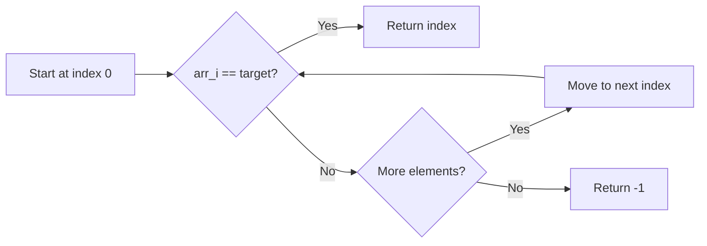
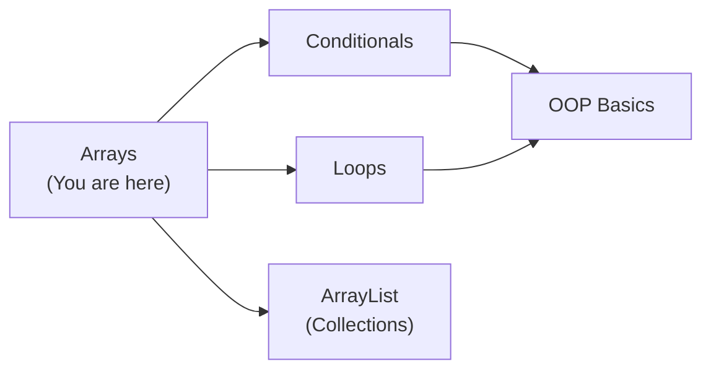
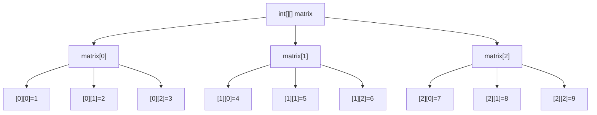

# Java Arrays — Junior Level

## Table of Contents

1. [Introduction](#introduction)
2. [Prerequisites](#prerequisites)
3. [Glossary](#glossary)
4. [Core Concepts](#core-concepts)
5. [Real-World Analogies](#real-world-analogies)
6. [Mental Models](#mental-models)
7. [Pros & Cons](#pros--cons)
8. [Use Cases](#use-cases)
9. [Code Examples](#code-examples)
10. [Coding Patterns](#coding-patterns)
11. [Clean Code](#clean-code)
12. [Product Use / Feature](#product-use--feature)
13. [Error Handling](#error-handling)
14. [Security Considerations](#security-considerations)
15. [Performance Tips](#performance-tips)
16. [Metrics & Analytics](#metrics--analytics)
17. [Best Practices](#best-practices)
18. [Edge Cases & Pitfalls](#edge-cases--pitfalls)
19. [Common Mistakes](#common-mistakes)
20. [Common Misconceptions](#common-misconceptions)
21. [Tricky Points](#tricky-points)
22. [Test](#test)
23. [Tricky Questions](#tricky-questions)
24. [Cheat Sheet](#cheat-sheet)
25. [Self-Assessment Checklist](#self-assessment-checklist)
26. [Summary](#summary)
27. [What You Can Build](#what-you-can-build)
28. [Further Reading](#further-reading)
29. [Related Topics](#related-topics)
30. [Diagrams & Visual Aids](#diagrams--visual-aids)

---

## Introduction

> Focus: "What is it?" and "How to use it?"

An **array** in Java is a fixed-size, ordered collection of elements that share the same data type. Arrays are one of the most fundamental data structures in programming — they let you store multiple values in a single variable rather than declaring separate variables for each value.

Every Java developer needs to understand arrays because they are the backbone of many higher-level data structures (like `ArrayList`, `HashMap`, etc.) and are used extensively in algorithms, APIs, and everyday coding tasks.

---

## Prerequisites

What you should know before studying this topic:

- **Required:** Java basic syntax — you need to know how to write a class with a `main` method
- **Required:** Data types — you need to understand primitive types (`int`, `double`, `char`, etc.) and reference types
- **Required:** Variables and scopes — you should know how to declare and use variables
- **Helpful but not required:** Loops — `for` and `while` loops are used heavily with arrays

---

## Glossary

Key terms used in this topic:

| Term | Definition |
|------|-----------|
| **Array** | A fixed-size container that holds elements of the same type, stored in contiguous memory |
| **Index** | The position of an element in an array, starting from 0 |
| **Element** | A single value stored inside an array |
| **Length** | The total number of elements an array can hold (accessed via `.length`) |
| **Declaration** | Telling the compiler you want an array variable (e.g., `int[] nums`) |
| **Initialization** | Actually creating the array and (optionally) assigning values |
| **Multidimensional Array** | An array of arrays — used for grids, matrices, tables |
| **Jagged Array** | A multidimensional array where inner arrays can have different lengths |
| **ArrayIndexOutOfBoundsException** | Runtime error thrown when you access an invalid index |

---

## Core Concepts

### Concept 1: Declaring Arrays

An array declaration tells Java the type of elements and the variable name. You do NOT allocate memory yet.

```java
int[] numbers;        // preferred Java style
String[] names;       // array of Strings
double temperatures[]; // C-style — valid but not recommended
```

### Concept 2: Initializing Arrays

You can initialize arrays in several ways:

```java
// Method 1: new keyword with size
int[] numbers = new int[5]; // creates [0, 0, 0, 0, 0]

// Method 2: array literal
int[] primes = {2, 3, 5, 7, 11};

// Method 3: new keyword with values
int[] scores = new int[]{90, 85, 78};
```

### Concept 3: Accessing Elements

Use the index (0-based) to read or write elements:

```java
int[] arr = {10, 20, 30, 40, 50};
int first = arr[0];   // 10
int last = arr[4];    // 50
arr[2] = 99;          // arr is now {10, 20, 99, 40, 50}
```

### Concept 4: Array Length

Every array has a `.length` property (not a method — no parentheses):

```java
int[] data = {1, 2, 3, 4};
System.out.println(data.length); // 4
```

### Concept 5: Iterating Over Arrays

```java
int[] nums = {10, 20, 30};

// for loop
for (int i = 0; i < nums.length; i++) {
    System.out.println(nums[i]);
}

// enhanced for-each loop
for (int n : nums) {
    System.out.println(n);
}
```

### Concept 6: Multidimensional Arrays

A 2D array is an array of arrays — think of it as a grid:

```java
int[][] matrix = {
    {1, 2, 3},
    {4, 5, 6},
    {7, 8, 9}
};
System.out.println(matrix[1][2]); // 6
```

### Concept 7: Jagged Arrays

Inner arrays can have different lengths:

```java
int[][] jagged = new int[3][];
jagged[0] = new int[]{1, 2};
jagged[1] = new int[]{3, 4, 5};
jagged[2] = new int[]{6};
```

### Concept 8: Arrays Utility Class

`java.util.Arrays` provides useful static methods:

```java
import java.util.Arrays;

int[] arr = {5, 3, 1, 4, 2};
Arrays.sort(arr);                        // [1, 2, 3, 4, 5]
int idx = Arrays.binarySearch(arr, 3);   // 2
Arrays.fill(arr, 0);                     // [0, 0, 0, 0, 0]
int[] copy = Arrays.copyOf(arr, 3);      // [0, 0, 0]
String s = Arrays.toString(arr);         // "[0, 0, 0, 0, 0]"
```

---

## Real-World Analogies

| Concept | Analogy |
|---------|--------|
| **Array** | A row of mailboxes in an apartment building — each mailbox has a fixed number (index), and they all hold the same type of item (letters). You can't add more mailboxes after construction. |
| **Index** | A seat number in a theater — seat 0 is the first seat, and you go directly to your seat without walking through others. |
| **Multidimensional Array** | A spreadsheet — rows and columns form a grid. `matrix[row][col]` is like pointing to a specific cell. |
| **Fixed Size** | A parking lot — once built, it has a fixed number of spots. To add more, you need to build a new, bigger lot and move the cars. |

---

## Mental Models

**The intuition:** Think of a Java array as a numbered row of boxes sitting side by side in memory. Each box holds one value. The boxes are numbered starting from 0. Once built, you cannot add or remove boxes — only change what is inside them.

**Why this model helps:** It explains why arrays are fast (go directly to box #N), why they are fixed-size (boxes are physical), and why going past the last box causes an error.

---

## Pros & Cons

| Pros | Cons |
|------|------|
| Very fast random access — O(1) by index | Fixed size — cannot grow or shrink after creation |
| Low memory overhead | No built-in methods for insert/remove |
| Type-safe — compiler enforces element type | Searching unsorted arrays is O(n) |
| Works with both primitives and objects | No bounds checking at compile time |
| Simple syntax | Printing requires `Arrays.toString()` |

### When to use:
- You know the number of elements in advance
- You need fast access by position
- You are working with primitive types and want best performance

### When NOT to use:
- You need a dynamically resizable collection — use `ArrayList`
- You need frequent insertions/deletions — use `LinkedList`

---

## Use Cases

- **Use Case 1:** Storing student grades — you know exactly how many students are in the class
- **Use Case 2:** Representing a game board — a 2D array for tic-tac-toe or chess
- **Use Case 3:** Reading command-line arguments — `String[] args` in `main`
- **Use Case 4:** Buffer for file I/O — `byte[]` for reading files

---

## Code Examples

### Example 1: Basic Array Operations

```java
public class ArrayBasics {
    public static void main(String[] args) {
        // Declare and initialize
        int[] scores = {95, 87, 73, 91, 68};

        // Access elements
        System.out.println("First score: " + scores[0]);  // 95
        System.out.println("Last score: " + scores[scores.length - 1]); // 68

        // Modify an element
        scores[2] = 80;

        // Iterate with for-each
        int sum = 0;
        for (int score : scores) {
            sum += score;
        }
        double average = (double) sum / scores.length;
        System.out.println("Average: " + average); // 84.2
    }
}
```

**What it does:** Creates an array of scores, modifies one, calculates the average.
**How to run:** `javac ArrayBasics.java && java ArrayBasics`

### Example 2: 2D Array — Multiplication Table

```java
public class MultiplicationTable {
    public static void main(String[] args) {
        int size = 5;
        int[][] table = new int[size][size];

        // Fill the table
        for (int i = 0; i < size; i++) {
            for (int j = 0; j < size; j++) {
                table[i][j] = (i + 1) * (j + 1);
            }
        }

        // Print the table
        for (int[] row : table) {
            for (int val : row) {
                System.out.printf("%4d", val);
            }
            System.out.println();
        }
    }
}
```

**What it does:** Builds and prints a 5x5 multiplication table using a 2D array.
**How to run:** `javac MultiplicationTable.java && java MultiplicationTable`

### Example 3: Using Arrays Utility Class

```java
import java.util.Arrays;

public class ArraysUtilDemo {
    public static void main(String[] args) {
        int[] data = {42, 17, 93, 5, 68, 31};

        // Print before sorting
        System.out.println("Original: " + Arrays.toString(data));

        // Sort
        Arrays.sort(data);
        System.out.println("Sorted:   " + Arrays.toString(data));

        // Binary search (array must be sorted)
        int index = Arrays.binarySearch(data, 42);
        System.out.println("42 is at index: " + index);

        // Copy first 3 elements
        int[] partial = Arrays.copyOf(data, 3);
        System.out.println("First 3:  " + Arrays.toString(partial));

        // Fill with a value
        int[] filled = new int[5];
        Arrays.fill(filled, 7);
        System.out.println("Filled:   " + Arrays.toString(filled));

        // Compare two arrays
        int[] a = {1, 2, 3};
        int[] b = {1, 2, 3};
        System.out.println("Equal? " + Arrays.equals(a, b)); // true
    }
}
```

**What it does:** Demonstrates sorting, searching, copying, filling, and comparing arrays.
**How to run:** `javac ArraysUtilDemo.java && java ArraysUtilDemo`

---

## Coding Patterns

### Pattern 1: Linear Search

**Intent:** Find an element in an unsorted array.
**When to use:** Small arrays or when the array is not sorted.

```java
public class LinearSearch {
    public static int find(int[] arr, int target) {
        for (int i = 0; i < arr.length; i++) {
            if (arr[i] == target) {
                return i; // found at index i
            }
        }
        return -1; // not found
    }

    public static void main(String[] args) {
        int[] data = {4, 7, 2, 9, 1};
        int index = find(data, 9);
        System.out.println("Found at: " + index); // 3
    }
}
```

**Diagram:**



**Remember:** Linear search is O(n) — every element may need to be checked.

---

### Pattern 2: Accumulator Pattern

**Intent:** Compute a single result from all elements (sum, max, min, count).

```java
public class AccumulatorPattern {
    public static void main(String[] args) {
        int[] nums = {3, 7, 1, 9, 4, 6};

        // Sum
        int sum = 0;
        for (int n : nums) {
            sum += n;
        }

        // Max
        int max = nums[0];
        for (int n : nums) {
            if (n > max) max = n;
        }

        System.out.println("Sum: " + sum); // 30
        System.out.println("Max: " + max); // 9
    }
}
```

**Diagram:**

```mermaid
sequenceDiagram
    participant Init as Initialize accumulator
    participant Loop as For each element
    participant Update as Update accumulator
    participant Result as Return result

    Init->>Loop: sum = 0
    Loop->>Update: sum += element
    Update->>Loop: next element
    Loop->>Result: return sum
```

---

## Clean Code

### Naming (Java conventions)

```java
// ❌ Bad
int[] a = new int[10];
int[] data123 = {1, 2, 3};

// ✅ Clean Java naming
int[] studentScores = new int[10];
int[] fibonacciNumbers = {1, 1, 2, 3, 5};
```

### Short Methods

```java
// ❌ Too long — search + compute + print in one method
public void processScores(int[] scores) { /* 40 lines */ }

// ✅ Each method does one thing
private int findMax(int[] scores) { ... }
private double computeAverage(int[] scores) { ... }
private void printResults(int max, double avg) { ... }
```

### Javadoc Comments

```java
// ❌ Noise
// finds the max
public int max(int[] a) { ... }

// ✅ Explains contract
/**
 * Returns the maximum value in the array.
 *
 * @param values non-empty array of integers
 * @return the largest element
 * @throws IllegalArgumentException if the array is empty
 */
public int findMax(int[] values) { ... }
```

---

## Product Use / Feature

### 1. Java Standard Library (Collections Framework)

- **How it uses Arrays:** `ArrayList` internally uses an `Object[]` array. When it grows, it copies data to a larger array.
- **Why it matters:** Understanding arrays helps you understand `ArrayList` performance.

### 2. String class

- **How it uses Arrays:** Internally, a `String` is backed by a `char[]` (Java 8) or `byte[]` (Java 9+).
- **Why it matters:** String operations (substring, charAt) map directly to array operations.

### 3. I/O Streams

- **How it uses Arrays:** File and network I/O uses `byte[]` buffers for reading and writing data.
- **Why it matters:** Efficient I/O depends on proper buffer (array) sizing.

---

## Error Handling

### Error 1: ArrayIndexOutOfBoundsException

```java
int[] arr = {1, 2, 3};
System.out.println(arr[3]); // BOOM! Index 3 doesn't exist (valid: 0-2)
```

**Why it happens:** Arrays are 0-indexed, so the last valid index is `length - 1`.
**How to fix:**

```java
// Always check bounds
if (index >= 0 && index < arr.length) {
    System.out.println(arr[index]);
}
```

### Error 2: NullPointerException

```java
int[] arr = null;
System.out.println(arr.length); // NullPointerException
```

**Why it happens:** The array variable was declared but never initialized.
**How to fix:**

```java
int[] arr = null;
if (arr != null) {
    System.out.println(arr.length);
}
// or initialize: int[] arr = new int[0];
```

### Error 3: NegativeArraySizeException

```java
int size = -1;
int[] arr = new int[size]; // NegativeArraySizeException
```

**Why it happens:** Array size must be >= 0.
**How to fix:**

```java
if (size >= 0) {
    int[] arr = new int[size];
}
```

---

## Security Considerations

### 1. Buffer Overflows (conceptual)

```java
// ❌ Trusting user input as index
int index = Integer.parseInt(userInput);
data[index] = value; // could be negative or too large

// ✅ Validate first
if (index >= 0 && index < data.length) {
    data[index] = value;
}
```

**Risk:** While Java prevents actual memory corruption (unlike C), out-of-bounds access throws exceptions that can crash your application.
**Mitigation:** Always validate indices from external sources.

### 2. Exposing Internal Arrays

```java
// ❌ Returning internal array — caller can modify your data
public int[] getScores() {
    return this.scores;
}

// ✅ Return a defensive copy
public int[] getScores() {
    return Arrays.copyOf(this.scores, this.scores.length);
}
```

**Risk:** Callers can mutate your object's internal state unexpectedly.
**Mitigation:** Return copies of arrays, not the originals.

---

## Performance Tips

### Tip 1: Prefer `System.arraycopy` for Copying

```java
// ❌ Manual copy — slow
for (int i = 0; i < src.length; i++) {
    dest[i] = src[i];
}

// ✅ Native method — fast
System.arraycopy(src, 0, dest, 0, src.length);
```

**Why it's faster:** `System.arraycopy` is a native method that copies memory blocks directly.

### Tip 2: Pre-size Arrays When Possible

```java
// ❌ Growing via copy on every addition
// (simulating dynamic array manually)

// ✅ Allocate the right size upfront
int[] result = new int[knownSize];
```

**Why it's faster:** Avoids repeated memory allocation and copying.

---

## Metrics & Analytics

### What to Measure

| Metric | Why it matters | Tool |
|--------|---------------|------|
| **Array size** | Large arrays use significant heap memory | VisualVM, JConsole |
| **Access patterns** | Sequential vs random affects CPU cache performance | JFR (Java Flight Recorder) |

### Basic Measurement

```java
// Measure array creation time
long start = System.nanoTime();
int[] large = new int[1_000_000];
long elapsed = System.nanoTime() - start;
System.out.println("Creation time: " + elapsed + " ns");
```

---

## Best Practices

- **Use `int[]` style, not `int arr[]`:** The Java convention places brackets with the type, not the variable name.
- **Use `Arrays.toString()` for printing:** `System.out.println(arr)` prints a memory address, not contents.
- **Use for-each when you don't need the index:** It's cleaner and less error-prone.
- **Check `length` before accessing elements:** Prevents `ArrayIndexOutOfBoundsException`.
- **Prefer `ArrayList` for dynamic collections:** Only use arrays when size is fixed and performance matters.

---

## Edge Cases & Pitfalls

### Pitfall 1: Empty Arrays

```java
int[] empty = new int[0]; // valid! length is 0
// empty[0] = 1;          // ArrayIndexOutOfBoundsException
```

**What happens:** An empty array is legal but has no accessible elements.
**How to fix:** Always check `arr.length > 0` before accessing elements.

### Pitfall 2: Default Values

```java
int[] nums = new int[3];
System.out.println(nums[0]); // 0 — not garbage!

String[] names = new String[3];
System.out.println(names[0]); // null — not empty string!
```

**What happens:** Java initializes arrays with default values (`0`, `false`, `null`).

---

## Common Mistakes

### Mistake 1: Off-by-one error

```java
// ❌ Wrong — causes ArrayIndexOutOfBoundsException
for (int i = 0; i <= arr.length; i++) {
    System.out.println(arr[i]);
}

// ✅ Correct — use < not <=
for (int i = 0; i < arr.length; i++) {
    System.out.println(arr[i]);
}
```

### Mistake 2: Printing arrays directly

```java
int[] arr = {1, 2, 3};

// ❌ Prints something like "[I@15db9742"
System.out.println(arr);

// ✅ Prints "[1, 2, 3]"
System.out.println(Arrays.toString(arr));
```

### Mistake 3: Comparing arrays with ==

```java
int[] a = {1, 2, 3};
int[] b = {1, 2, 3};

// ❌ Compares references, not contents
System.out.println(a == b); // false

// ✅ Compares contents
System.out.println(Arrays.equals(a, b)); // true
```

---

## Common Misconceptions

### Misconception 1: "Arrays in Java are like arrays in C"

**Reality:** Java arrays are objects. They are allocated on the heap, have a `.length` field, and are bounds-checked at runtime. You cannot have buffer overflows like in C.

**Why people think this:** Both use bracket syntax (`arr[i]`), so they look similar.

### Misconception 2: "You can resize an array after creating it"

**Reality:** Arrays in Java have a fixed size. Once created, you cannot add or remove slots. If you need dynamic sizing, use `ArrayList`.

**Why people think this:** Other languages (JavaScript, Python) have "arrays" that grow dynamically.

### Misconception 3: "`.length` is a method"

**Reality:** `.length` is a field (no parentheses), unlike `String.length()` which is a method.

**Why people think this:** `String.length()` uses parentheses, causing confusion.

---

## Tricky Points

### Tricky Point 1: Array covariance

```java
Object[] objects = new String[3]; // compiles!
objects[0] = 42; // compiles but throws ArrayStoreException at runtime!
```

**Why it's tricky:** Java allows assigning a `String[]` to an `Object[]` variable (covariance), but storing a non-String value throws a runtime exception.
**Key takeaway:** Array covariance can lead to runtime errors. Generics (like `List<String>`) are type-safe.

### Tricky Point 2: Arrays.asList returns a fixed-size list

```java
String[] arr = {"a", "b", "c"};
List<String> list = Arrays.asList(arr);
list.set(0, "x"); // OK — modifies the original array too!
list.add("d");     // UnsupportedOperationException!
```

**Why it's tricky:** `Arrays.asList()` returns a fixed-size list backed by the array. You can modify elements but not add/remove.
**Key takeaway:** Use `new ArrayList<>(Arrays.asList(arr))` for a fully mutable list.

---

## Test

### Multiple Choice

**1. What is the default value of elements in `new int[5]`?**

- A) `null`
- B) `-1`
- C) `0`
- D) Garbage values

<details>
<summary>Answer</summary>

**C) `0`** — Java initializes all numeric primitive arrays to 0. `null` is for object arrays. Java never has garbage values like C.
</details>

**2. What does `arr.length` return for `int[] arr = {10, 20, 30}`?**

- A) 2
- B) 3
- C) 30
- D) Compilation error

<details>
<summary>Answer</summary>

**B) 3** — `.length` returns the number of elements, not the last index or the last value.
</details>

### True or False

**3. `int arr[] = new int[5];` and `int[] arr = new int[5];` are both valid.**

<details>
<summary>Answer</summary>

**True** — Both syntaxes are valid in Java. However, `int[] arr` is the preferred Java style.
</details>

**4. You can change the length of an array after creation.**

<details>
<summary>Answer</summary>

**False** — Arrays have a fixed size. To "resize," you must create a new array and copy elements.
</details>

### What's the Output?

**5. What does this code print?**

```java
int[] a = {1, 2, 3};
int[] b = a;
b[0] = 99;
System.out.println(a[0]);
```

<details>
<summary>Answer</summary>

Output: `99`

Explanation: `b = a` copies the reference, not the array. Both `a` and `b` point to the same array in memory. Modifying through `b` also changes `a`.
</details>

**6. What does this code print?**

```java
int[][] grid = new int[2][3];
System.out.println(grid.length + " " + grid[0].length);
```

<details>
<summary>Answer</summary>

Output: `2 3`

Explanation: `grid.length` is the number of rows (2). `grid[0].length` is the number of columns in the first row (3).
</details>

---

## "What If?" Scenarios

**What if you create an array of size 0?**
- **You might think:** It throws an exception.
- **But actually:** `new int[0]` is perfectly valid. It creates an empty array with `.length == 0`. Useful as a return value when there are no results.

**What if you assign a `String[]` to an `Object[]` and add an `Integer`?**
- **You might think:** Java's type system prevents it.
- **But actually:** It compiles but throws `ArrayStoreException` at runtime. This is array covariance — a known design flaw that generics fix.

---

## Tricky Questions

**1. What does `System.out.println(new int[3])` print?**

- A) `[0, 0, 0]`
- B) `0 0 0`
- C) Something like `[I@15db9742`
- D) Compilation error

<details>
<summary>Answer</summary>

**C)** — Printing an array directly calls its `toString()` method which returns the type code (`[I` for int array) and hash code. Use `Arrays.toString()` for readable output.
</details>

**2. What is the type of `args` in `public static void main(String[] args)`?**

- A) `String`
- B) `String[]`
- C) `ArrayList<String>`
- D) `Object`

<details>
<summary>Answer</summary>

**B) `String[]`** — The `main` method receives command-line arguments as an array of Strings.
</details>

**3. Can you create an array of interfaces?**

- A) No, interfaces cannot be instantiated
- B) Yes, but only with `new`
- C) Yes, and the elements must be objects implementing that interface
- D) Yes, but only if the interface has default methods

<details>
<summary>Answer</summary>

**C)** — You can create `Comparable[] arr = new Comparable[5]`. The array can hold any object that implements `Comparable`. This is valid because arrays hold references, not instances of the declared type directly.
</details>

---

## Cheat Sheet

| What | Syntax | Example |
|------|--------|---------|
| Declare | `type[] name` | `int[] nums` |
| Create with size | `new type[size]` | `new int[5]` |
| Create with values | `{val1, val2, ...}` | `{1, 2, 3}` |
| Access element | `arr[index]` | `arr[0]` |
| Get length | `arr.length` | `nums.length` |
| Sort | `Arrays.sort(arr)` | `Arrays.sort(nums)` |
| Search | `Arrays.binarySearch(arr, key)` | `Arrays.binarySearch(nums, 5)` |
| Copy | `Arrays.copyOf(arr, len)` | `Arrays.copyOf(nums, 3)` |
| Print | `Arrays.toString(arr)` | `Arrays.toString(nums)` |
| Compare | `Arrays.equals(a, b)` | `Arrays.equals(arr1, arr2)` |
| Fill | `Arrays.fill(arr, val)` | `Arrays.fill(nums, 0)` |

---

## Self-Assessment Checklist

### I can explain:
- [ ] What an array is and why it has a fixed size
- [ ] The difference between declaration and initialization
- [ ] How 0-based indexing works
- [ ] When to use arrays vs `ArrayList`
- [ ] What multidimensional and jagged arrays are

### I can do:
- [ ] Create arrays using all three initialization methods
- [ ] Iterate arrays with both `for` and `for-each`
- [ ] Use `Arrays.sort()`, `Arrays.toString()`, and `Arrays.copyOf()`
- [ ] Create and access elements in 2D arrays
- [ ] Handle `ArrayIndexOutOfBoundsException` properly

### I can answer:
- [ ] All multiple choice questions in this document
- [ ] "What's the output?" questions correctly

---

## Summary

- Arrays are fixed-size, 0-indexed containers for elements of the same type
- Use `int[] arr = {1, 2, 3}` for literal initialization or `new int[size]` for dynamic creation
- Access elements with `arr[index]`, get size with `arr.length`
- Use `java.util.Arrays` for sorting, searching, copying, and printing
- Default values: `0` for numbers, `false` for booleans, `null` for objects
- Use `ArrayList` when you need dynamic sizing

**Next step:** Learn about Loops to combine with arrays for powerful data processing.

---

## What You Can Build

### Projects you can create:
- **Grade calculator:** Store student scores and compute statistics (min, max, average)
- **Tic-tac-toe game:** Use a 2D array for the game board
- **Simple image processor:** Represent pixel data as 2D arrays of integers

### Technologies / tools that use this:
- **Spring Boot** — request parameters and headers are often arrays
- **JDBC** — result sets map to arrays of data
- **Android** — layout adapters work with arrays of data items

### Learning path — what to study next:



---

## Further Reading

- **Official docs:** [Java Arrays Tutorial](https://docs.oracle.com/javase/tutorial/java/nutsandbolts/arrays.html)
- **Official docs:** [Arrays API](https://docs.oracle.com/en/java/javase/21/docs/api/java.base/java/util/Arrays.html)
- **Book chapter:** Effective Java (Bloch), Item 28 — "Prefer lists to arrays"

---

## Related Topics

- **[Loops](../10-loops/)** — loops are essential for processing array elements
- **[Conditionals](../09-conditionals/)** — used with arrays for filtering and decision-making
- **[Data Types](../03-data-types/)** — arrays hold typed elements
- **[Strings and Methods](../06-strings-and-methods/)** — strings are internally backed by arrays

---

## Diagrams & Visual Aids

### Mind Map

```mermaid
mindmap
  root((Java Arrays))
    Declaration
      int[] nums
      String[] names
    Initialization
      Literal: curly braces
      new keyword
    Operations
      Access by index
      Iteration
      Sort and Search
    Types
      Single-dimensional
      Multidimensional
      Jagged
    Utility
      Arrays.sort
      Arrays.toString
      Arrays.copyOf
```

### Array Memory Layout

```
Array: int[] arr = {10, 20, 30, 40, 50}

Index:    [0]   [1]   [2]   [3]   [4]
        +-----+-----+-----+-----+-----+
Value:  | 10  | 20  | 30  | 40  | 50  |
        +-----+-----+-----+-----+-----+

arr.length = 5
Valid indices: 0 to 4
```

### 2D Array Layout


