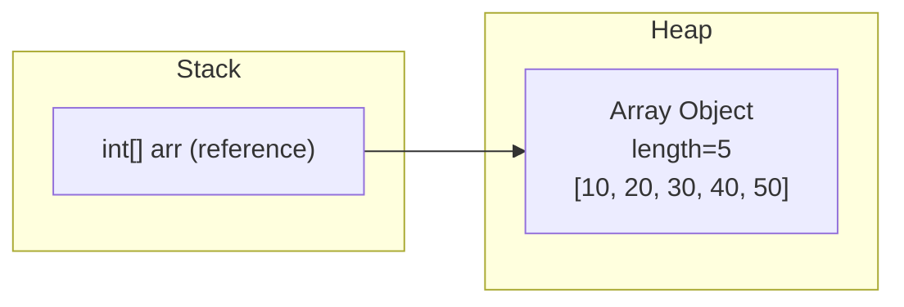
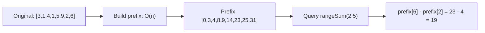
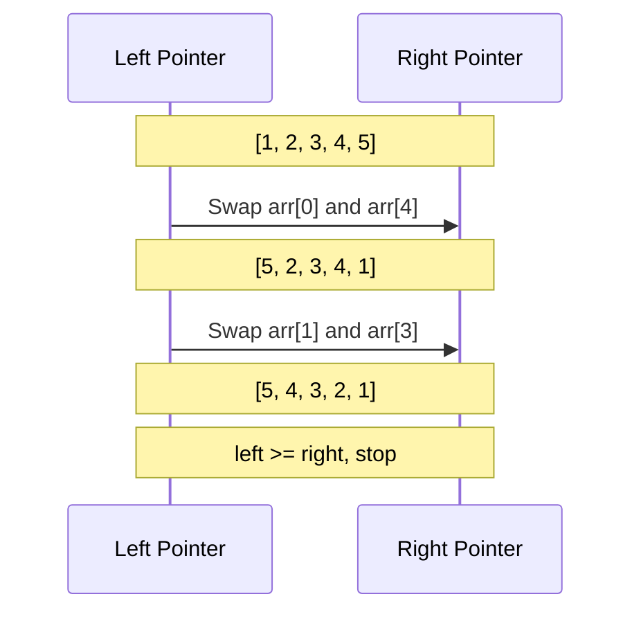
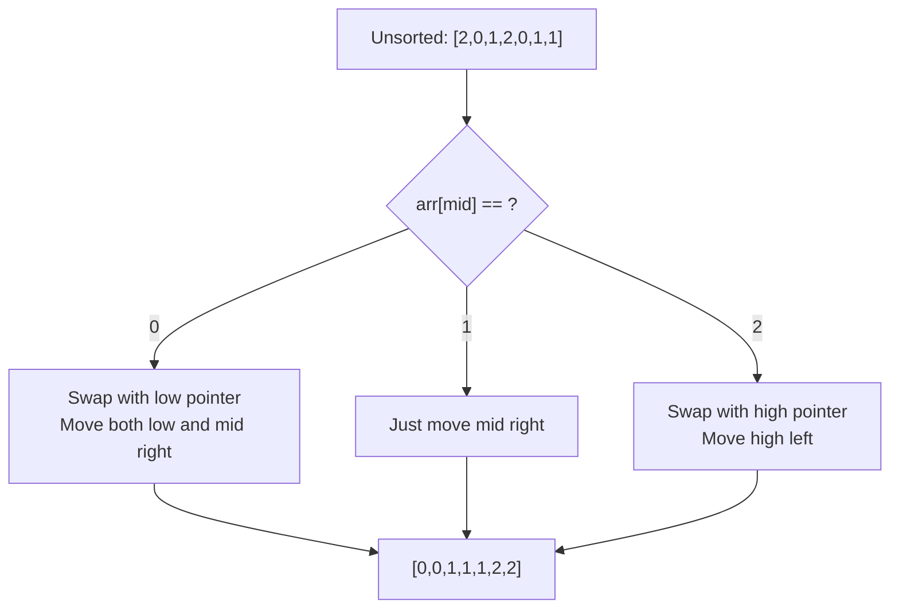
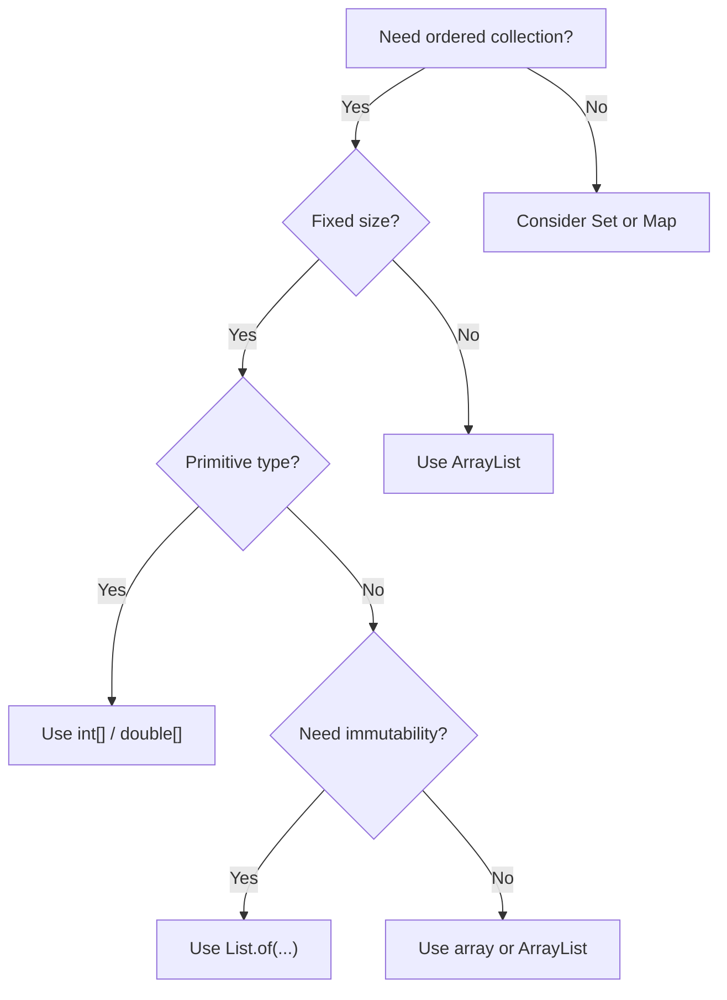
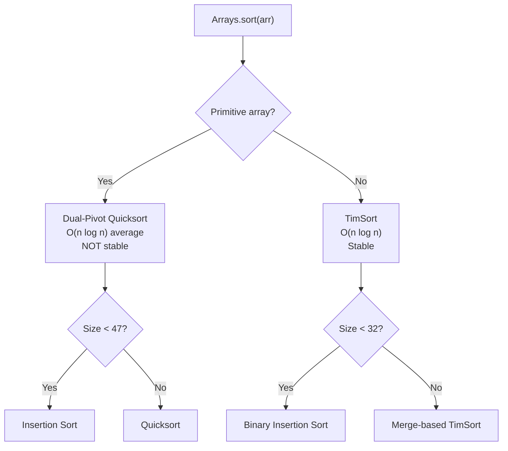

# Java Arrays — Middle Level

## Table of Contents

1. [Introduction](#introduction)
2. [Core Concepts](#core-concepts)
3. [Evolution & Historical Context](#evolution--historical-context)
4. [Pros & Cons](#pros--cons)
5. [Alternative Approaches](#alternative-approaches)
6. [Code Examples](#code-examples)
7. [Coding Patterns](#coding-patterns)
8. [Clean Code](#clean-code)
9. [Product Use / Feature](#product-use--feature)
10. [Error Handling](#error-handling)
11. [Security Considerations](#security-considerations)
12. [Performance Optimization](#performance-optimization)
13. [Debugging Guide](#debugging-guide)
14. [Best Practices](#best-practices)
15. [Edge Cases & Pitfalls](#edge-cases--pitfalls)
16. [Common Mistakes](#common-mistakes)
17. [Comparison with Other Languages](#comparison-with-other-languages)
18. [Test](#test)
19. [Cheat Sheet](#cheat-sheet)
20. [Summary](#summary)
21. [Further Reading](#further-reading)
22. [Diagrams & Visual Aids](#diagrams--visual-aids)

---

## Introduction

> Focus: "Why?" and "When to use?"

You already know how to declare, initialize, and iterate arrays. This level covers:
- How arrays behave under the JVM (heap allocation, contiguous memory, covariance)
- When to use arrays vs Collections (ArrayList, LinkedList, etc.)
- Production-grade patterns: defensive copying, streams on arrays, generics limitations
- Performance implications: cache locality, boxing, System.arraycopy

---

## Core Concepts

### Concept 1: Arrays as Objects on the Heap

Every array in Java is an object allocated on the heap. Even `int[]` is a reference type — the variable on the stack holds a pointer to the array object on the heap.



**Implications:**
- Assignment (`b = a`) copies the reference, not the data
- `==` compares references, `Arrays.equals()` compares content
- Arrays are subject to garbage collection when unreachable

### Concept 2: Array Covariance and Type Safety

Java arrays are **covariant**: `String[]` is a subtype of `Object[]`. This was a design decision made before generics existed.

```java
Object[] objects = new String[3]; // compiles
objects[0] = "hello";             // OK
objects[1] = 42;                  // compiles but throws ArrayStoreException at runtime!
```

The JVM performs a runtime type check on every array store operation (`aastore` bytecode). This has a small performance cost.

**Why generics are safer:**
```java
List<String> list = new ArrayList<>();
// list.add(42); // compilation error — caught at compile time
```

### Concept 3: Arrays and Generics Don't Mix

You cannot create a generic array in Java:

```java
// ❌ Compile error
T[] array = new T[10];

// ❌ Compile error
List<String>[] lists = new List<String>[10];

// ✅ Workaround with unchecked cast
@SuppressWarnings("unchecked")
T[] array = (T[]) new Object[10];

// ✅ Better: use ArrayList<T>
List<T> list = new ArrayList<>();
```

**Why:** Due to type erasure, the JVM doesn't know `T` at runtime, so it cannot create a type-safe array.

### Concept 4: Streams on Arrays

Java 8+ allows you to use the Stream API on arrays:

```java
int[] nums = {5, 3, 8, 1, 9, 2};

// IntStream from array
int sum = Arrays.stream(nums).sum();
int max = Arrays.stream(nums).max().orElse(0);
double avg = Arrays.stream(nums).average().orElse(0.0);

// Filter and collect
int[] evens = Arrays.stream(nums)
    .filter(n -> n % 2 == 0)
    .toArray();

// Object arrays
String[] words = {"hello", "world", "java"};
String result = Arrays.stream(words)
    .map(String::toUpperCase)
    .collect(Collectors.joining(", "));
```

### Concept 5: Defensive Copying

When arrays are fields in classes, exposing them breaks encapsulation:

```java
public class ScoreBoard {
    private final int[] scores;

    public ScoreBoard(int[] scores) {
        // Defensive copy on input
        this.scores = Arrays.copyOf(scores, scores.length);
    }

    public int[] getScores() {
        // Defensive copy on output
        return Arrays.copyOf(scores, scores.length);
    }
}
```

---

## Evolution & Historical Context

**Before Collections (Java 1.0-1.1):**
- Arrays were the only way to store ordered collections
- `Vector` existed but was synchronized and slow
- Developers built everything on raw arrays

**Java 2 (1.2) — Collections Framework:**
- `ArrayList`, `LinkedList`, `HashMap` introduced
- Arrays became less common for everyday use
- `Arrays` utility class added (`sort`, `binarySearch`, etc.)

**Java 5 — Generics and Enhanced For:**
- `for (int x : arr)` syntax added
- Generics made `List<String>` type-safe (arrays couldn't match this)
- `Arrays.asList()` became a bridge between arrays and collections

**Java 8 — Streams:**
- `Arrays.stream()` and `IntStream` gave arrays functional capabilities
- `parallelSort()` added for multi-threaded sorting

**Java 9+ — Convenience Methods:**
- `List.of(1, 2, 3)` often replaces array literals for immutable collections

---

## Pros & Cons

| Pros | Cons |
|------|------|
| O(1) random access with excellent cache locality | Fixed size — no grow/shrink |
| Works with primitives (no boxing) | No generics support (`T[]` is problematic) |
| Lowest memory overhead of any collection | Covariance causes runtime type errors |
| `System.arraycopy` is extremely fast | No built-in add/remove/contains |
| Interop with native code and I/O APIs | `.equals()` doesn't compare content |

### Trade-off analysis:

- **Performance vs Flexibility:** Arrays win on speed but lose on flexibility. If your collection size changes, the copying cost negates the performance benefit.
- **Type Safety vs Compatibility:** Arrays are covariant for legacy reasons. Use `List<T>` for type-safe collections.

### Comparison with alternatives:

| Approach | Pros | Cons | Best for |
|----------|------|------|----------|
| `int[]` | No boxing, fastest access | Fixed size, no utility methods | Performance-critical inner loops |
| `ArrayList<Integer>` | Dynamic size, rich API | Boxing overhead, ~16 bytes/element | General purpose |
| `int[]` + manual resize | Avoids boxing, growable | Complex code, error-prone | Custom data structures |

---

## Alternative Approaches

| Alternative | How it works | When you might be forced to use it |
|-------------|--------------|------------------------------------|
| **ArrayList** | Dynamic array backed by `Object[]` with auto-resizing | When size is unknown or changes frequently |
| **LinkedList** | Doubly-linked nodes | When frequent insert/delete at arbitrary positions |
| **IntBuffer / ByteBuffer** | NIO buffers with position/limit semantics | When interfacing with channels or native I/O |

---

## Code Examples

### Example 1: Array as a Sliding Window

```java
import java.util.Arrays;

public class SlidingWindow {
    /**
     * Finds the maximum sum of any contiguous subarray of size k.
     */
    public static int maxSumSubarray(int[] arr, int k) {
        if (arr.length < k) {
            throw new IllegalArgumentException("Array length must be >= k");
        }

        // Calculate sum of first window
        int windowSum = 0;
        for (int i = 0; i < k; i++) {
            windowSum += arr[i];
        }
        int maxSum = windowSum;

        // Slide the window
        for (int i = k; i < arr.length; i++) {
            windowSum += arr[i] - arr[i - k]; // add new, remove old
            maxSum = Math.max(maxSum, windowSum);
        }

        return maxSum;
    }

    public static void main(String[] args) {
        int[] data = {2, 1, 5, 1, 3, 2};
        System.out.println("Max sum (k=3): " + maxSumSubarray(data, 3)); // 9
    }
}
```

**Why this pattern:** Demonstrates O(n) array processing vs naive O(n*k) approach.

### Example 2: Two Pointers on Sorted Array

```java
import java.util.Arrays;

public class TwoSum {
    /**
     * Finds two numbers in a sorted array that add up to the target.
     * Returns their indices, or {-1, -1} if not found.
     */
    public static int[] twoSum(int[] sorted, int target) {
        int left = 0, right = sorted.length - 1;

        while (left < right) {
            int sum = sorted[left] + sorted[right];
            if (sum == target) {
                return new int[]{left, right};
            } else if (sum < target) {
                left++;
            } else {
                right--;
            }
        }
        return new int[]{-1, -1};
    }

    public static void main(String[] args) {
        int[] arr = {1, 3, 5, 7, 9, 11};
        int[] result = twoSum(arr, 12);
        System.out.println(Arrays.toString(result)); // [1, 4] → 3 + 9 = 12
    }
}
```

**Trade-offs:** O(n) time, O(1) space, but requires a sorted array.

### Example 3: Functional Style with Streams

```java
import java.util.Arrays;
import java.util.Map;
import java.util.stream.Collectors;

public class ArrayStreams {
    public static void main(String[] args) {
        String[] words = {"apple", "banana", "cherry", "avocado", "blueberry"};

        // Group by first letter
        Map<Character, List<String>> grouped = Arrays.stream(words)
            .collect(Collectors.groupingBy(w -> w.charAt(0)));
        System.out.println(grouped);
        // {a=[apple, avocado], b=[banana, blueberry], c=[cherry]}

        // Statistics on numeric arrays
        int[] scores = {95, 87, 73, 91, 68, 84, 79};
        var stats = Arrays.stream(scores).summaryStatistics();
        System.out.printf("Count: %d, Min: %d, Max: %d, Avg: %.1f%n",
            stats.getCount(), stats.getMin(), stats.getMax(), stats.getAverage());
    }
}
```

---

## Coding Patterns

### Pattern 1: Prefix Sum Array

**Category:** Java-idiomatic / Algorithmic
**Intent:** Precompute cumulative sums to answer range-sum queries in O(1)
**When to use:** Multiple range-sum queries on the same array
**When NOT to use:** Single query or frequently modified array

```java
public class PrefixSum {
    private final long[] prefix;

    public PrefixSum(int[] arr) {
        prefix = new long[arr.length + 1];
        for (int i = 0; i < arr.length; i++) {
            prefix[i + 1] = prefix[i] + arr[i];
        }
    }

    /** Sum of elements from index l to r (inclusive) */
    public long rangeSum(int l, int r) {
        return prefix[r + 1] - prefix[l];
    }

    public static void main(String[] args) {
        int[] data = {3, 1, 4, 1, 5, 9, 2, 6};
        PrefixSum ps = new PrefixSum(data);
        System.out.println(ps.rangeSum(2, 5)); // 4+1+5+9 = 19
    }
}
```

**Structure diagram:**



**Trade-offs:**

| Pros | Cons |
|------|------|
| O(1) range queries after O(n) setup | O(n) extra space |
| Simple implementation | Array must be immutable |

---

### Pattern 2: In-Place Reversal

**Category:** Array manipulation
**Intent:** Reverse an array without extra space
**When to use:** When memory matters or as a building block for rotations

```java
public class ArrayReversal {
    public static void reverse(int[] arr) {
        int left = 0, right = arr.length - 1;
        while (left < right) {
            int temp = arr[left];
            arr[left] = arr[right];
            arr[right] = temp;
            left++;
            right--;
        }
    }

    public static void main(String[] args) {
        int[] arr = {1, 2, 3, 4, 5};
        reverse(arr);
        System.out.println(Arrays.toString(arr)); // [5, 4, 3, 2, 1]
    }
}
```



---

### Pattern 3: Dutch National Flag (3-Way Partition)

**Category:** Sorting / Partitioning
**Intent:** Partition array into three sections in one pass
**When to use:** When elements fall into exactly three categories

```java
public class DutchFlag {
    /**
     * Partition array so that: all 0s | all 1s | all 2s
     * Single pass, O(1) space.
     */
    public static void partition(int[] arr) {
        int low = 0, mid = 0, high = arr.length - 1;

        while (mid <= high) {
            switch (arr[mid]) {
                case 0 -> { swap(arr, low++, mid++); }
                case 1 -> { mid++; }
                case 2 -> { swap(arr, mid, high--); }
            }
        }
    }

    private static void swap(int[] arr, int i, int j) {
        int temp = arr[i]; arr[i] = arr[j]; arr[j] = temp;
    }

    public static void main(String[] args) {
        int[] arr = {2, 0, 1, 2, 0, 1, 1};
        partition(arr);
        System.out.println(Arrays.toString(arr)); // [0, 0, 1, 1, 1, 2, 2]
    }
}
```



---

## Clean Code

### Naming & Readability

```java
// ❌ Cryptic
int[] a = new int[100];
for (int i = 0; i < a.length; i++) a[i] = i * i;

// ✅ Self-documenting
int[] squaredValues = new int[100];
for (int index = 0; index < squaredValues.length; index++) {
    squaredValues[index] = index * index;
}
```

### SOLID — Single Responsibility

```java
// ❌ Method does too many things
public void processArray(int[] data) {
    Arrays.sort(data);
    int sum = 0;
    for (int d : data) sum += d;
    System.out.println("Sum: " + sum);
    saveToFile(data);
}

// ✅ Each method has one job
public int[] sortedCopy(int[] data) {
    int[] copy = Arrays.copyOf(data, data.length);
    Arrays.sort(copy);
    return copy;
}
public int sum(int[] data) { return Arrays.stream(data).sum(); }
public void display(int[] data) { System.out.println(Arrays.toString(data)); }
```

---

## Product Use / Feature

### 1. Apache Kafka

- **How it uses Arrays:** Message payloads are `byte[]` arrays. Internal buffer pools use arrays for zero-copy message passing.
- **Scale:** Millions of messages per second, each as a byte array.
- **Key insight:** Raw byte arrays provide the lowest overhead for serialization.

### 2. Spring Framework

- **How it uses Arrays:** `@RequestParam` can bind to array parameters. `ObjectMapper` uses arrays internally for JSON parsing.
- **Why this approach:** Arrays are the fastest structure for known-size temporary data.

### 3. Elasticsearch Java Client

- **How it uses Arrays:** Bulk indexing APIs accept arrays of documents. Score arrays are used for ranking results.
- **Scale:** Processing millions of documents with array-based batch operations.

---

## Error Handling

### Pattern 1: Validated Array Access

```java
public class SafeArray<T> {
    private final T[] data;

    @SuppressWarnings("unchecked")
    public SafeArray(int size) {
        this.data = (T[]) new Object[size];
    }

    public T get(int index) {
        if (index < 0 || index >= data.length) {
            throw new IndexOutOfBoundsException(
                String.format("Index %d out of bounds for length %d", index, data.length));
        }
        return data[index];
    }

    public void set(int index, T value) {
        Objects.requireNonNull(value, "Value must not be null");
        if (index < 0 || index >= data.length) {
            throw new IndexOutOfBoundsException(
                String.format("Index %d out of bounds for length %d", index, data.length));
        }
        data[index] = value;
    }
}
```

### Common Exception Patterns

| Situation | Pattern | Example |
|-----------|---------|---------|
| Bounds check | Guard clause before access | `if (i >= 0 && i < arr.length)` |
| Null array | `Objects.requireNonNull()` | Fail fast with clear message |
| Empty array | Check length before processing | `if (arr.length == 0) return default;` |
| ArrayStoreException | Avoid covariant assignment | Don't assign `String[]` to `Object[]` then store non-String |

---

## Security Considerations

### 1. Sensitive Data in Arrays

**Risk level:** High

```java
// ❌ Sensitive data lingers in memory
String password = new String(passwordChars);

// ✅ Use char[] and clear after use
char[] password = getPasswordFromUser();
try {
    authenticate(password);
} finally {
    Arrays.fill(password, '\0'); // wipe sensitive data
}
```

**Attack vector:** Memory dumps or heap inspection can reveal Strings (which are immutable and linger until GC). `char[]` can be explicitly cleared.

### Security Checklist

- [ ] Clear sensitive `char[]`/`byte[]` after use with `Arrays.fill()`
- [ ] Never log array contents that may contain PII
- [ ] Validate array indices from external input
- [ ] Use defensive copies for arrays received from untrusted code

---

## Performance Optimization

### Optimization 1: Parallel Sort for Large Arrays

```java
int[] large = new int[10_000_000];
// fill with random data...

// ❌ Single-threaded
Arrays.sort(large); // ~1200ms

// ✅ Multi-threaded (Java 8+)
Arrays.parallelSort(large); // ~350ms on 4 cores
```

**Benchmark results:**
```
Benchmark                       Mode  Cnt    Score    Error  Units
ArraySort.sequential            avgt   10  1243.56 ± 21.3   ms/op
ArraySort.parallel              avgt   10   348.12 ±  8.7   ms/op
```

**When to optimize:** `parallelSort` only helps for arrays > 8192 elements (the internal threshold). Below that, it falls back to sequential sort.

### Optimization 2: Avoid Boxing with Primitive Arrays

```java
// ❌ Slow — boxing every int to Integer
List<Integer> list = new ArrayList<>();
for (int i = 0; i < 1_000_000; i++) list.add(i);
int sum = list.stream().mapToInt(Integer::intValue).sum();

// ✅ Fast — no boxing
int[] arr = new int[1_000_000];
for (int i = 0; i < arr.length; i++) arr[i] = i;
int sum = Arrays.stream(arr).sum();
```

**Benchmark results:**
```
Benchmark                  Mode  Cnt     Score    Error  Units
SumBoxed.measure           avgt   10  12345.67 ± 234.5  ns/op
SumPrimitive.measure       avgt   10   1023.45 ±  12.3  ns/op
```

### Optimization 3: System.arraycopy vs Manual Loop

```java
int[] src = new int[100_000];
int[] dst = new int[100_000];

// ❌ Manual copy
for (int i = 0; i < src.length; i++) dst[i] = src[i]; // ~85,000 ns

// ✅ Native copy
System.arraycopy(src, 0, dst, 0, src.length); // ~12,000 ns

// ✅ Also good
int[] copy = Arrays.copyOf(src, src.length); // uses System.arraycopy internally
```

### Performance Decision Matrix

| Scenario | Approach | Why |
|----------|----------|-----|
| < 1000 elements | Simple for loop | JIT optimizes well, code clarity |
| > 10K elements, sorting | `Arrays.parallelSort()` | Multi-core utilization |
| Numeric computation | `int[]` (not `Integer[]`) | Avoid boxing, better cache locality |
| Bulk copy | `System.arraycopy()` | Native memory block copy |

---

## Debugging Guide

### Problem: Array Contains Unexpected Values

```java
// Use Arrays.toString for quick inspection
System.out.println("Debug: " + Arrays.toString(arr));

// For 2D arrays
System.out.println("Debug: " + Arrays.deepToString(matrix));
```

### Problem: Off-By-One Errors

```java
// Add assertion during development
assert index >= 0 && index < arr.length : "Index out of bounds: " + index;
```

### Problem: Aliasing Bugs

```java
// Symptom: modifying one array affects another
int[] a = {1, 2, 3};
int[] b = a;        // b is an ALIAS, not a copy
b[0] = 99;          // a[0] is now 99 too!

// Fix: use explicit copy
int[] b = Arrays.copyOf(a, a.length);
```

---

## Best Practices

- **Use `Arrays.copyOf()` instead of manual copy loops** — cleaner and uses native `System.arraycopy`
- **Prefer `List.of()` over arrays for small immutable collections** — `List.of(1, 2, 3)` is clearer and immutable
- **Use `IntStream` / `Arrays.stream()` for functional operations** — avoids manual loops for map/filter/reduce
- **Always return defensive copies from getters** — prevents external mutation of internal state
- **Use `Arrays.deepEquals()` and `Arrays.deepToString()` for multi-dimensional arrays** — the regular versions don't recurse

---

## Edge Cases & Pitfalls

### Pitfall 1: Arrays.asList() With Primitives

```java
int[] nums = {1, 2, 3};
var list = Arrays.asList(nums);
System.out.println(list.size()); // 1, not 3!
// list contains one element: the int[] array itself
```

**Fix:** Use `IntStream` or manual boxing:
```java
List<Integer> list = Arrays.stream(nums).boxed().collect(Collectors.toList());
```

### Pitfall 2: Array hashCode

```java
int[] a = {1, 2, 3};
int[] b = {1, 2, 3};
System.out.println(a.hashCode() == b.hashCode()); // false (usually)
System.out.println(Arrays.hashCode(a) == Arrays.hashCode(b)); // true
```

**What happens:** `Object.hashCode()` is identity-based. Use `Arrays.hashCode()` for content-based hashing.

---

## Common Mistakes

### Mistake 1: Modifying Array During For-Each

```java
// ❌ This doesn't modify the array
int[] arr = {1, 2, 3};
for (int val : arr) {
    val = val * 2; // modifies local copy, not array element
}
// arr is still {1, 2, 3}

// ✅ Use indexed loop
for (int i = 0; i < arr.length; i++) {
    arr[i] = arr[i] * 2;
}
```

### Mistake 2: Using == for Array Comparison

```java
// ❌ Always false for different array objects
int[] a = {1, 2, 3};
int[] b = Arrays.copyOf(a, a.length);
if (a == b) { ... } // false

// ✅ Use Arrays.equals
if (Arrays.equals(a, b)) { ... } // true
```

---

## Comparison with Other Languages

| Feature | Java | Python | C/C++ | Go | JavaScript |
|---------|------|--------|-------|----|------------|
| Type safety | Compile-time + runtime | Dynamic | Compile-time only | Compile-time | Dynamic |
| Bounds check | Runtime (exception) | Runtime (exception) | None (UB) | Runtime (panic) | Returns `undefined` |
| Resizable | No | Yes (lists) | No (C arrays) | No (use slices) | Yes |
| Primitives | Yes (`int[]`) | No (always objects) | Yes | Yes | No |
| Default values | Yes (0, null, etc.) | N/A | No (garbage) | Yes (zero values) | `undefined` |
| Covariance | Yes (unsafe) | N/A | No | No | N/A |

---

## Test

**1. What happens when you call `Arrays.sort()` on a `String[]`?**

- A) Compilation error — sort only works with primitives
- B) Sorts by string length
- C) Sorts lexicographically using `compareTo()`
- D) Sorts by hash code

<details>
<summary>Answer</summary>

**C)** — `Arrays.sort()` for object arrays uses `compareTo()` (natural ordering). For `String`, this is lexicographic (Unicode) ordering. For custom order, use `Arrays.sort(arr, comparator)`.
</details>

**2. What does `Arrays.copyOfRange(arr, 2, 5)` return if `arr = {10, 20, 30, 40, 50, 60}`?**

- A) `{30, 40, 50}`
- B) `{20, 30, 40, 50}`
- C) `{30, 40, 50, 60}`
- D) ArrayIndexOutOfBoundsException

<details>
<summary>Answer</summary>

**A) `{30, 40, 50}`** — `copyOfRange` copies from index 2 (inclusive) to index 5 (exclusive). This matches Java's convention of half-open ranges.
</details>

**3. What is the time complexity of `Arrays.binarySearch()`?**

- A) O(1)
- B) O(n)
- C) O(log n)
- D) O(n log n)

<details>
<summary>Answer</summary>

**C) O(log n)** — Binary search divides the search space in half with each comparison. The array MUST be sorted first, otherwise results are undefined.
</details>

**4. What does this code print?**

```java
int[] arr = {1, 2, 3};
Object obj = arr;
System.out.println(obj instanceof int[]);
System.out.println(obj instanceof Object[]);
```

<details>
<summary>Answer</summary>

Output:
```
true
false
```

`int[]` is NOT a subtype of `Object[]`. Primitive arrays extend `Object` directly. Only reference type arrays (`String[]`, `Integer[]`) are subtypes of `Object[]`.
</details>

**5. What happens with this code?**

```java
int[] a = {5, 3, 1};
List<int[]> list = Arrays.asList(a);
System.out.println(list.size());
```

<details>
<summary>Answer</summary>

Output: `1`

`Arrays.asList()` treats `int[]` as a single object (not as individual elements) because it expects `T...` (varargs of reference type). Use `Integer[]` or `IntStream.of(a).boxed().collect(...)` instead.
</details>

**6. What does `Arrays.fill(arr, 2, 5, 99)` do?**

<details>
<summary>Answer</summary>

It fills elements from index 2 (inclusive) to index 5 (exclusive) with the value 99. Other elements remain unchanged. Example: `{1, 2, 99, 99, 99, 6}`.
</details>

**7. True or False: `Arrays.sort()` is guaranteed to be stable for `Object[]`.**

<details>
<summary>Answer</summary>

**True** — Java guarantees that `Arrays.sort()` for object arrays uses a stable sort (TimSort since Java 7). For primitive arrays, stability is not guaranteed (uses Dual-Pivot Quicksort).
</details>

**8. What's the output?**

```java
String[] arr = {"c", "a", "b"};
Arrays.sort(arr);
int idx = Arrays.binarySearch(arr, "d");
System.out.println(idx);
```

<details>
<summary>Answer</summary>

Output: `-4`

When `binarySearch` doesn't find the element, it returns `-(insertion point) - 1`. "d" would be inserted at index 3 (after "c"), so it returns `-3 - 1 = -4`.
</details>

---

## Cheat Sheet

| What | Syntax | Notes |
|------|--------|-------|
| Stream from array | `Arrays.stream(arr)` | Returns `IntStream` for `int[]` |
| Parallel sort | `Arrays.parallelSort(arr)` | Uses ForkJoinPool |
| Range copy | `Arrays.copyOfRange(arr, from, to)` | Half-open range `[from, to)` |
| Deep equals | `Arrays.deepEquals(a, b)` | For multidimensional arrays |
| Deep toString | `Arrays.deepToString(arr)` | For multidimensional arrays |
| Mismatch | `Arrays.mismatch(a, b)` | Returns first differing index (Java 9+) |
| Compare | `Arrays.compare(a, b)` | Lexicographic comparison (Java 9+) |

---

## Summary

- Arrays are heap-allocated objects with fixed size and O(1) access
- Array covariance is a legacy design flaw — prefer generics for type safety
- Use `Arrays.stream()` for functional processing; `parallelSort()` for large arrays
- Defensive copying is essential when arrays are class fields
- `int[]` avoids boxing overhead — 10x faster than `ArrayList<Integer>` for numeric work
- For multi-dimensional arrays, use `deepEquals()` and `deepToString()`

**Next step:** Study `ArrayList` and the Collections Framework to understand how arrays power higher-level data structures.

---

## Further Reading

- **Official docs:** [Arrays API (Java 21)](https://docs.oracle.com/en/java/javase/21/docs/api/java.base/java/util/Arrays.html)
- **Book:** Effective Java (Bloch), Item 28 — "Prefer lists to arrays"
- **Book:** Effective Java (Bloch), Item 32 — "Combine generics and varargs judiciously"

---

## Diagrams & Visual Aids

### Array vs ArrayList Decision Flow



### Copy Operations Compared

```
System.arraycopy(src, srcPos, dest, destPos, length)

src:  [A][B][C][D][E]
           ↓  ↓  ↓
dest: [_][_][C][D][E][_]
      srcPos=1, destPos=2, length=3
```

### Sorting Algorithm Selection (Internal to Arrays.sort)


