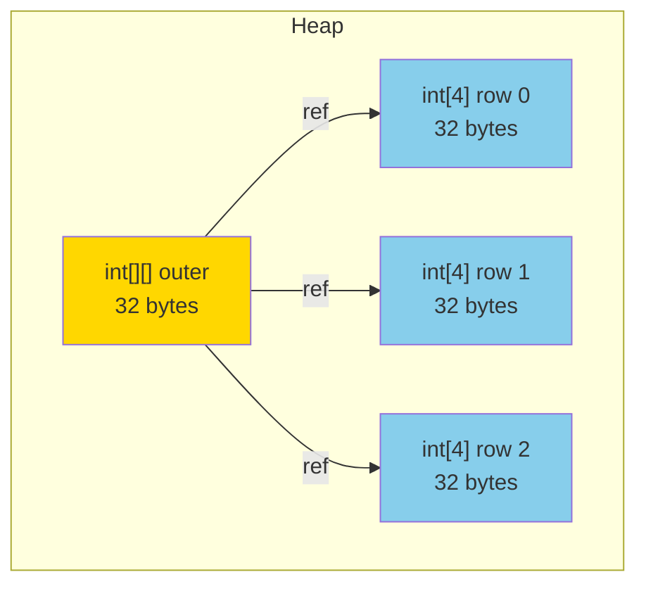
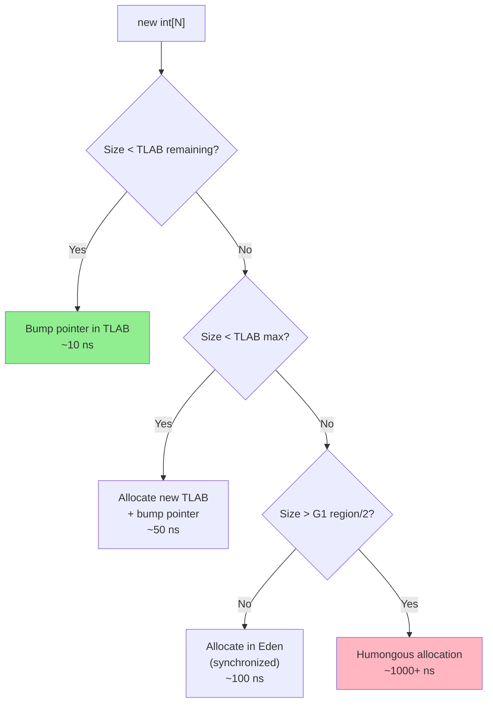
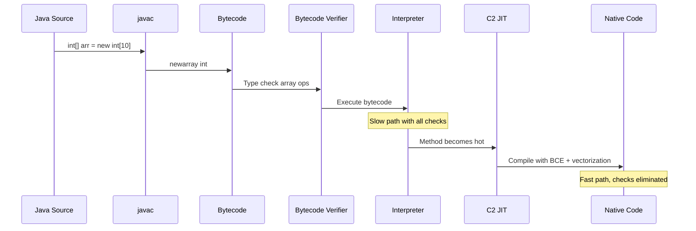
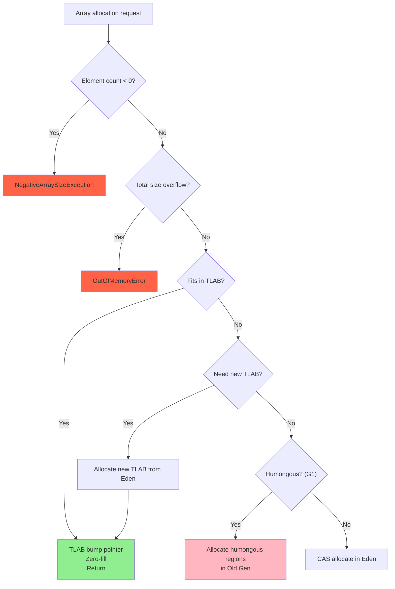

# Java Arrays — Professional Level

## Table of Contents

1. [Introduction](#introduction)
2. [JVM Bytecode Analysis](#jvm-bytecode-analysis)
3. [Memory Layout Deep Dive](#memory-layout-deep-dive)
4. [JIT Compilation and Arrays](#jit-compilation-and-arrays)
5. [SIMD Vectorization](#simd-vectorization)
6. [Garbage Collection Impact](#garbage-collection-impact)
7. [Unsafe and Off-Heap Arrays](#unsafe-and-off-heap-arrays)
8. [Project Valhalla and Future](#project-valhalla-and-future)
9. [Diagrams & Visual Aids](#diagrams--visual-aids)
10. [Summary](#summary)
11. [Further Reading](#further-reading)

---

## Introduction

> Focus: "What happens under the hood?" — JVM bytecode, memory model, GC, JIT

At the professional level, you understand arrays at the JVM implementation level. This covers:
- Bytecode instructions for array creation and access (`newarray`, `aaload`, `aastore`, etc.)
- Exact memory layout with object headers, alignment, and padding
- How the JIT compiler optimizes array operations (bounds check elimination, loop vectorization)
- GC interaction with large arrays and the humongous object threshold
- `sun.misc.Unsafe` for direct memory manipulation
- Project Valhalla's impact on array performance

---

## JVM Bytecode Analysis

### Array Creation Bytecode

```java
// Source
int[] arr = new int[10];
```

```
Bytecode:
  0: bipush        10        // push constant 10
  2: newarray      int       // allocate int array of size 10
  4: astore_1                // store reference in local variable 1
```

The `newarray` instruction is used for primitive arrays. For reference arrays, `anewarray` is used:

```java
// Source
String[] names = new String[5];
```

```
Bytecode:
  0: iconst_5                // push constant 5
  1: anewarray     #2        // class java/lang/String
  4: astore_1
```

For multidimensional arrays:

```java
// Source
int[][] matrix = new int[3][4];
```

```
Bytecode:
  0: iconst_3
  1: iconst_4
  2: multianewarray #3, 2    // class [[I, 2 dimensions
  5: astore_1
```

### Array Access Bytecode

```java
// Source
int value = arr[5];
arr[3] = 42;
```

```
Bytecode:
  // Read: arr[5]
  0: aload_1                 // load array reference
  1: iconst_5                // push index 5
  2: iaload                  // load int from array (includes bounds check)
  3: istore_2                // store result

  // Write: arr[3] = 42
  4: aload_1                 // load array reference
  5: iconst_3                // push index 3
  6: bipush        42        // push value 42
  8: iastore                 // store int to array (includes bounds check + type check)
```

### Bytecode Instructions by Array Type

| Instruction | Description | Array Type |
|-------------|-------------|------------|
| `newarray` | Create primitive array | `byte[]`, `int[]`, `float[]`, etc. |
| `anewarray` | Create reference array | `String[]`, `Object[]`, etc. |
| `multianewarray` | Create multi-dim array | `int[][]`, `String[][][]` |
| `iaload/iastore` | Load/store int | `int[]` |
| `laload/lastore` | Load/store long | `long[]` |
| `faload/fastore` | Load/store float | `float[]` |
| `daload/dastore` | Load/store double | `double[]` |
| `aaload/aastore` | Load/store reference | `Object[]`, `String[]` |
| `baload/bastore` | Load/store byte/boolean | `byte[]`, `boolean[]` |
| `caload/castore` | Load/store char | `char[]` |
| `saload/sastore` | Load/store short | `short[]` |
| `arraylength` | Get array length | Any array |

### ArrayStoreException Bytecode Check

For `aastore` (storing into reference arrays), the JVM performs a runtime type check:

```java
Object[] arr = new String[3];
arr[0] = new Integer(42); // ArrayStoreException
```

```
Bytecode for aastore:
  1. Check index >= 0 && index < array.length (ArrayIndexOutOfBoundsException)
  2. Check value == null || value.getClass().isAssignableTo(array.componentType)
     (ArrayStoreException if fails)
  3. Store the reference
```

This type check on every `aastore` is a performance cost unique to reference arrays. Primitive arrays (`iastore`, etc.) skip it.

---

## Memory Layout Deep Dive

### Object Header (HotSpot, 64-bit, Compressed Oops)

```
Array Object Layout:

+0   +-----------------------------------------------+
     | Mark Word (64 bits)                            |
     |  - bits [0:2]   lock state                     |
     |  - bits [3:7]   GC age (max 15)                |
     |  - bits [8:38]  identity hash (if computed)     |
     |  - bits [39:63] thread ID (biased locking)      |
+8   +-----------------------------------------------+
     | Klass Pointer (32 bits, compressed)             |
     |  - Points to array class metadata ([I, [B, etc) |
+12  +-----------------------------------------------+
     | Array Length (32 bits)                          |
     |  - Maximum: Integer.MAX_VALUE - 8              |
+16  +-----------------------------------------------+
     | Element 0                                      |
     | Element 1                                      |
     | ...                                            |
     | Element N-1                                    |
+16+N*sizeof(element) +-------------------------------+
     | Padding (to 8-byte alignment)                  |
     +-----------------------------------------------+
```

### Exact Sizes Using JOL

You can verify with Java Object Layout tool:

```java
import org.openjdk.jol.info.ClassLayout;

public class ArrayLayout {
    public static void main(String[] args) {
        int[] intArr = new int[10];
        byte[] byteArr = new byte[10];
        Object[] objArr = new Object[10];
        int[][] arr2d = new int[3][4];

        System.out.println(ClassLayout.parseInstance(intArr).toPrintable());
        System.out.println(ClassLayout.parseInstance(byteArr).toPrintable());
        System.out.println(ClassLayout.parseInstance(objArr).toPrintable());
    }
}
```

**Expected output (64-bit, compressed oops):**

```
int[10]:
  OFFSET  SIZE   TYPE DESCRIPTION
       0     4        (object header - mark)
       4     4        (object header - mark)
       8     4        (object header - klass)
      12     4        (array length = 10)
      16    40   int  [I.<elements>
Instance size: 56 bytes (aligned to 8)

byte[10]:
  OFFSET  SIZE   TYPE DESCRIPTION
       0    12        (object header + length)
      12    10   byte [B.<elements>
Instance size: 24 bytes (padded from 22)

Object[10]:
  OFFSET  SIZE               TYPE DESCRIPTION
       0    12                     (object header + length)
      12     4                     (alignment gap)
      16    40   java.lang.Object  [Ljava.lang.Object;.<elements>
Instance size: 56 bytes
```

### Memory Comparison Table

| Array Declaration | Header | Data | Padding | Total |
|-------------------|--------|------|---------|-------|
| `new byte[0]` | 16 | 0 | 0 | 16 |
| `new byte[1]` | 16 | 1 | 7 | 24 |
| `new byte[8]` | 16 | 8 | 0 | 24 |
| `new int[0]` | 16 | 0 | 0 | 16 |
| `new int[1]` | 16 | 4 | 4 | 24 |
| `new int[10]` | 16 | 40 | 0 | 56 |
| `new long[1]` | 16 | 8 | 0 | 24 |
| `new Object[0]` | 16 | 0 | 0 | 16 |
| `new Object[10]` | 16 | 40 | 0 | 56 |

### 2D Array Memory Layout

A `int[3][4]` is NOT a contiguous block of 12 ints. It's 4 separate heap objects:

```
int[][] matrix = new int[3][4]

Heap Object 1: int[][] (outer array)
  +-- header (16 bytes) --+
  | ref to int[4] #1      |  4 bytes (compressed)
  | ref to int[4] #2      |  4 bytes
  | ref to int[4] #3      |  4 bytes
  +-- padding (4 bytes) ---+
  Total: 32 bytes

Heap Object 2: int[4] (row 0) — 16 + 16 = 32 bytes
Heap Object 3: int[4] (row 1) — 32 bytes
Heap Object 4: int[4] (row 2) — 32 bytes

Grand total: 32 + 32 + 32 + 32 = 128 bytes
(vs 48 bytes for a flat int[12])
```



---

## JIT Compilation and Arrays

### Bounds Check Elimination (BCE)

The C2 JIT compiler can eliminate redundant bounds checks in common loop patterns:

```java
// The JIT recognizes this canonical loop pattern
for (int i = 0; i < arr.length; i++) {
    sum += arr[i]; // bounds check ELIMINATED by JIT
}
```

The compiler proves: if `i >= 0` and `i < arr.length` (from loop condition), then `arr[i]` cannot throw `ArrayIndexOutOfBoundsException`. The bounds check is removed from the compiled native code.

**When BCE fails:**

```java
// JIT cannot eliminate bounds check here
for (int i = 0; i < someOtherLength; i++) {
    sum += arr[i]; // bounds check KEPT — compiler can't prove safety
}

// Also fails with non-standard loop patterns
int i = 0;
while (hasMore()) {
    sum += arr[i++]; // bounds check KEPT
}
```

### Verifying BCE with PrintCompilation

```bash
java -XX:+PrintCompilation -XX:+UnlockDiagnosticVMOptions \
     -XX:+PrintInlining -XX:+TraceClassLoading ArrayBenchmark
```

Or use `-XX:+PrintAssembly` (requires hsdis plugin):

```bash
java -XX:+UnlockDiagnosticVMOptions -XX:+PrintAssembly \
     -XX:CompileCommand=print,*ArraySum.compute ArrayBenchmark
```

### Loop Unrolling

The JIT compiler unrolls array processing loops:

```java
// Original
for (int i = 0; i < arr.length; i++) {
    sum += arr[i];
}

// After JIT unrolling (conceptual)
int len = arr.length;
int i = 0;
for (; i + 3 < len; i += 4) {
    sum += arr[i] + arr[i+1] + arr[i+2] + arr[i+3];
}
for (; i < len; i++) {
    sum += arr[i]; // handle remainder
}
```

---

## SIMD Vectorization

### Auto-Vectorization in HotSpot

Starting with Java 9, and significantly improved in later versions, the C2 compiler can auto-vectorize simple array operations using SIMD instructions (SSE, AVX on x86):

```java
// This loop CAN be auto-vectorized
public static void addArrays(int[] a, int[] b, int[] result) {
    for (int i = 0; i < a.length; i++) {
        result[i] = a[i] + b[i]; // vectorized to PADDD (4 ints at once with SSE)
    }
}
```

**With AVX2 (256-bit registers):** processes 8 ints per instruction.
**With AVX-512 (512-bit registers):** processes 16 ints per instruction.

### Vector API (JEP 338, Incubator)

Java 16+ provides an explicit Vector API for guaranteed SIMD:

```java
import jdk.incubator.vector.*;

public class VectorSum {
    static final VectorSpecies<Integer> SPECIES = IntVector.SPECIES_PREFERRED;

    public static int vectorSum(int[] arr) {
        int sum = 0;
        int i = 0;
        int bound = SPECIES.loopBound(arr.length);

        // Vectorized main loop
        for (; i < bound; i += SPECIES.length()) {
            IntVector v = IntVector.fromArray(SPECIES, arr, i);
            sum += v.reduceLanes(VectorOperators.ADD);
        }

        // Scalar tail
        for (; i < arr.length; i++) {
            sum += arr[i];
        }
        return sum;
    }
}
```

### Vectorization Blockers

Operations that prevent auto-vectorization:

| Blocker | Example | Why |
|---------|---------|-----|
| Method calls in loop | `arr[i] = Math.random()` | Can't prove no side effects |
| Data dependencies | `arr[i] = arr[i-1] * 2` | Each iteration depends on previous |
| Non-contiguous access | `arr[indices[i]]` | Gather/scatter not always available |
| Exception handlers | `try { arr[i]... }` | Exception paths block vectorization |

---

## Garbage Collection Impact

### Large Array Allocation and G1GC

In G1GC, objects larger than **half a region** (default region = 1-32 MB, typically 1 MB for < 4 GB heap) are classified as **humongous objects**:

```java
// Assuming 1 MB region size:
// int[262144] = 16 + 262144*4 = 1,048,592 bytes > 512 KB → HUMONGOUS
int[] huge = new int[262_144];
```

**Humongous allocation problems:**
1. Allocated directly in old generation — skips young gen
2. Each humongous object gets its own region(s)
3. Can cause premature Full GC if regions fragment
4. Not collected until a concurrent marking cycle completes

**Mitigation:**
```bash
# Increase region size to make arrays fit in regular regions
-XX:G1HeapRegionSize=4m

# Or use ZGC which handles large allocations better
-XX:+UseZGC
```

### Array Zeroing Cost

`new int[N]` must zero-initialize all elements (JLS requirement). For large arrays, this is measurable:

```
Array Size    Zeroing Time (approx)
1 KB          ~50 ns
1 MB          ~100 μs
100 MB        ~10 ms
1 GB          ~100 ms
```

HotSpot optimizes zeroing with:
- `rep stosq` on x86 (optimized memory fill)
- TLAB pre-zeroing (amortizes cost for small allocations)

### TLAB and Array Allocation

```
Thread-Local Allocation Buffer (TLAB):

Thread 1 TLAB:
  [....allocated....|free space remaining............]
                     ^
                     allocation pointer

Small array (fits in TLAB):
  → Bump pointer allocation (~10 ns)

Large array (exceeds TLAB):
  → Slow path: allocate directly in Eden or Humongous region (~100-1000 ns)
```



---

## Unsafe and Off-Heap Arrays

### sun.misc.Unsafe Array Operations

`Unsafe` provides raw memory access, bypassing bounds checks and type checks:

```java
import sun.misc.Unsafe;
import java.lang.reflect.Field;

public class UnsafeArrayDemo {
    private static final Unsafe UNSAFE;
    static {
        try {
            Field f = Unsafe.class.getDeclaredField("theUnsafe");
            f.setAccessible(true);
            UNSAFE = (Unsafe) f.get(null);
        } catch (Exception e) {
            throw new RuntimeException(e);
        }
    }

    public static void main(String[] args) {
        int[] arr = {10, 20, 30, 40, 50};

        // Array base offset and index scale
        int baseOffset = UNSAFE.arrayBaseOffset(int[].class);  // 16
        int indexScale = UNSAFE.arrayIndexScale(int[].class);   // 4

        // Direct memory read (no bounds check)
        int value = UNSAFE.getInt(arr, baseOffset + 2L * indexScale);
        System.out.println(value); // 30

        // Direct memory write (no bounds check, no type check)
        UNSAFE.putInt(arr, baseOffset + 2L * indexScale, 999);
        System.out.println(arr[2]); // 999

        // Volatile read/write for thread safety
        UNSAFE.putIntVolatile(arr, baseOffset + 0L * indexScale, 42);
        int vol = UNSAFE.getIntVolatile(arr, baseOffset + 0L * indexScale);
    }
}
```

### Off-Heap Memory (DirectByteBuffer)

For arrays that should not be GC-managed:

```java
import java.nio.ByteBuffer;
import java.nio.IntBuffer;

public class OffHeapArray {
    public static void main(String[] args) {
        // Allocate 40 bytes off-heap (10 ints)
        ByteBuffer bb = ByteBuffer.allocateDirect(10 * Integer.BYTES);
        IntBuffer intBuffer = bb.asIntBuffer();

        // Write
        intBuffer.put(0, 42);
        intBuffer.put(1, 99);

        // Read
        System.out.println(intBuffer.get(0)); // 42

        // No GC pressure — memory is freed when ByteBuffer is collected
        // or explicitly: ((DirectBuffer) bb).cleaner().clean();
    }
}
```

**When to use off-heap:**
- Very large arrays (> 100 MB) that would cause GC pauses
- Memory-mapped files for shared state
- Native interop (JNI, Panama)

---

## Project Valhalla and Future

### Value Types and Flat Arrays

Project Valhalla (in development) will introduce **value types** (primitive classes) that can be stored flat in arrays:

```java
// Future Java (Valhalla)
primitive class Point {
    int x;
    int y;
}

// Today: Point[] creates array of references → pointer chasing
// Valhalla: Point[] stores x,y inline → contiguous memory

Point[] points = new Point[1000];
// Memory layout:
// [x0,y0,x1,y1,x2,y2,...,x999,y999]
// vs today:
// [ref0,ref1,...,ref999] → each ref points to separate heap object
```

**Performance impact:**
- Eliminates pointer chasing (each access today requires following a reference)
- Better cache locality (data is contiguous)
- Less GC pressure (no individual object headers per element)
- Estimated 3-10x improvement for scientific computing workloads

### Specialized Generics

Valhalla will also enable:

```java
// Future Java
List<int> intList = new ArrayList<int>(); // no boxing!
// Backed by int[] internally, not Integer[]
```

---

## Diagrams & Visual Aids

### Array Bytecode Execution Flow



### Memory Hierarchy and Array Access

```
Access Latency:
┌──────────────────────────────┐
│ L1 Cache: ~1 ns  (32 KB)    │ ← Sequential int[] iteration hits here
│ L2 Cache: ~4 ns  (256 KB)   │ ← Small arrays fit entirely
│ L3 Cache: ~12 ns (8-32 MB)  │ ← Medium arrays
│ Main RAM: ~100 ns            │ ← Random access to large Integer[]
│ SSD:      ~100 μs            │ ← Memory-mapped file arrays
└──────────────────────────────┘

int[] sequential:  L1 hit rate > 95% (prefetcher works perfectly)
Integer[] random:  L1 hit rate < 10% (pointer chasing defeats prefetcher)
```

### HotSpot Array Allocation Decision Tree



---

## Summary

- Array bytecode uses specialized instructions (`iaload`, `iastore`, `newarray`) for each primitive type
- Object header is 16 bytes (mark + klass + length); total size is header + elements + padding to 8-byte alignment
- C2 JIT eliminates bounds checks for canonical `for (i < arr.length)` loops
- Auto-vectorization uses SSE/AVX SIMD instructions for simple array arithmetic
- G1GC treats arrays > half a region as humongous — prefer ZGC for large arrays
- `Unsafe` bypasses all checks for maximum performance (at the cost of safety)
- Project Valhalla will enable flat array storage for value types — eliminating the biggest remaining performance gap between Java and C/C++

---

## Further Reading

- **JEP 338:** Vector API (Incubator) — explicit SIMD for Java
- **JEP 401:** Value Classes and Objects (Valhalla)
- **Tool:** JOL (Java Object Layout) — `org.openjdk.jol:jol-core`
- **Tool:** JITWatch — visualize JIT compilation decisions
- **Book:** Java Performance (Scott Oaks), 2nd Edition — deep dive into JVM internals
- **Source:** OpenJDK HotSpot `arrayOop.hpp` — array object header implementation
