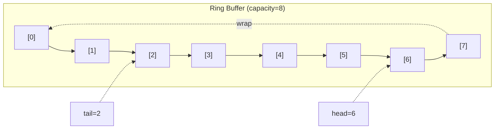
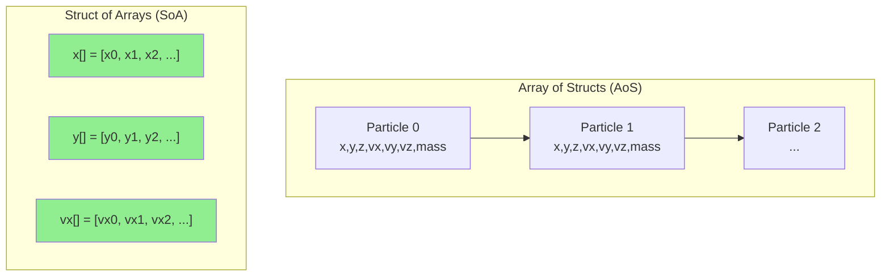
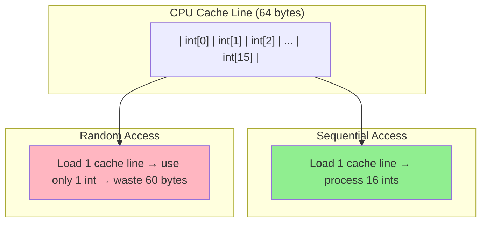
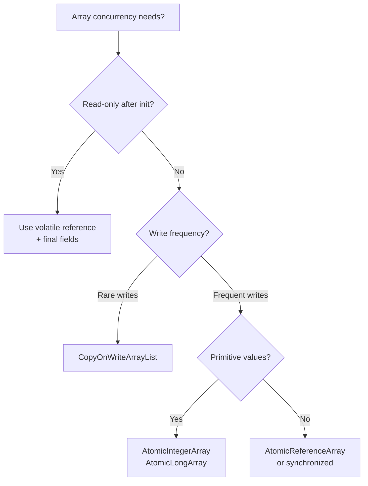

# Java Arrays — Senior Level

## Table of Contents

1. [Introduction](#introduction)
2. [Architecture & Design](#architecture--design)
3. [Advanced Patterns](#advanced-patterns)
4. [Performance Benchmarks](#performance-benchmarks)
5. [JVM Internals for Arrays](#jvm-internals-for-arrays)
6. [Concurrency & Thread Safety](#concurrency--thread-safety)
7. [Best Practices for Production](#best-practices-for-production)
8. [Test](#test)
9. [Summary](#summary)
10. [Further Reading](#further-reading)
11. [Diagrams & Visual Aids](#diagrams--visual-aids)

---

## Introduction

> Focus: "How to optimize?" and "How to architect?"

At the senior level, you understand arrays deeply and make architecture decisions about when raw arrays outperform Collections. This level covers:
- JVM memory layout and cache-line optimization
- Custom data structures built on arrays (ring buffers, object pools)
- JMH benchmarking of array operations
- Thread-safe array patterns and concurrent alternatives
- When to break the "prefer lists to arrays" rule

---

## Architecture & Design

### When Raw Arrays Are the Right Architecture Decision

In most application code, `ArrayList<T>` is preferred. However, arrays are the correct choice in these architectural scenarios:

1. **Hot paths in high-frequency trading / game loops** — where nanoseconds matter and boxing is unacceptable
2. **Custom data structures** — ring buffers, heaps, tries where you control memory layout
3. **Serialization / protocol parsing** — `byte[]` for reading/writing binary protocols
4. **Image / audio processing** — `int[]` / `float[]` for pixel/sample data
5. **Interop with native code (JNI)** — arrays map directly to C arrays

### Array-Based Ring Buffer

A lock-free ring buffer using an array as the backing store:

```java
public class RingBuffer<T> {
    private final Object[] buffer;
    private final int capacity;
    private int head = 0; // next write position
    private int tail = 0; // next read position
    private int size = 0;

    public RingBuffer(int capacity) {
        this.capacity = capacity;
        this.buffer = new Object[capacity];
    }

    public boolean offer(T element) {
        if (size == capacity) return false;
        buffer[head] = element;
        head = (head + 1) % capacity; // wrap around
        size++;
        return true;
    }

    @SuppressWarnings("unchecked")
    public T poll() {
        if (size == 0) return null;
        T element = (T) buffer[tail];
        buffer[tail] = null; // help GC
        tail = (tail + 1) % capacity;
        size--;
        return element;
    }

    public int size() { return size; }
    public boolean isEmpty() { return size == 0; }
    public boolean isFull() { return size == capacity; }
}
```



### Object Pool Pattern

```java
public class ObjectPool<T> {
    private final Object[] pool;
    private final Supplier<T> factory;
    private int available;

    public ObjectPool(int size, Supplier<T> factory) {
        this.pool = new Object[size];
        this.factory = factory;
        this.available = size;
        for (int i = 0; i < size; i++) {
            pool[i] = factory.get();
        }
    }

    @SuppressWarnings("unchecked")
    public T acquire() {
        if (available == 0) return factory.get(); // overflow: create new
        return (T) pool[--available];
    }

    public void release(T obj) {
        if (available < pool.length) {
            pool[available++] = obj;
        }
        // else discard — pool is full
    }
}
```

---

## Advanced Patterns

### Pattern 1: Array-Based Trie (Compact)

For ASCII-only keys, an array-based trie uses `new Node[128]` children arrays — much faster than `HashMap<Character, Node>`:

```java
public class ArrayTrie {
    private static final int ALPHABET_SIZE = 128; // ASCII

    private static class Node {
        Node[] children = new Node[ALPHABET_SIZE];
        boolean isEnd;
    }

    private final Node root = new Node();

    public void insert(String word) {
        Node current = root;
        for (int i = 0; i < word.length(); i++) {
            int idx = word.charAt(i);
            if (current.children[idx] == null) {
                current.children[idx] = new Node();
            }
            current = current.children[idx];
        }
        current.isEnd = true;
    }

    public boolean search(String word) {
        Node current = root;
        for (int i = 0; i < word.length(); i++) {
            int idx = word.charAt(i);
            if (current.children[idx] == null) return false;
            current = current.children[idx];
        }
        return current.isEnd;
    }
}
```

**Why array-based:** `children[ch]` is O(1) with zero hashing overhead. A `HashMap` requires hashing, boxing, and pointer chasing for each lookup.

### Pattern 2: Struct-of-Arrays vs Array-of-Structs

**Array of Structs (typical Java):**
```java
class Particle {
    float x, y, z;
    float vx, vy, vz;
    float mass;
}
Particle[] particles = new Particle[1_000_000]; // each is a heap object
```

**Struct of Arrays (cache-friendly):**
```java
class ParticleSystem {
    float[] x, y, z;
    float[] vx, vy, vz;
    float[] mass;
    int count;

    ParticleSystem(int capacity) {
        x = new float[capacity];
        y = new float[capacity];
        z = new float[capacity];
        vx = new float[capacity];
        vy = new float[capacity];
        vz = new float[capacity];
        mass = new float[capacity];
    }

    void updatePositions(float dt) {
        // Cache-friendly: sequential access through x[], y[], z[]
        for (int i = 0; i < count; i++) {
            x[i] += vx[i] * dt;
            y[i] += vy[i] * dt;
            z[i] += vz[i] * dt;
        }
    }
}
```



**SoA is faster** when you process one field across all entities (e.g., update all X positions) because the data fits in cache lines contiguously.

### Pattern 3: Compact Bit Array

When storing boolean flags, a `boolean[]` wastes 7 bits per element. Use `long[]` for 64x density:

```java
public class BitArray {
    private final long[] words;
    private final int size;

    public BitArray(int size) {
        this.size = size;
        this.words = new long[(size + 63) >>> 6]; // ceil(size/64)
    }

    public void set(int index) {
        words[index >>> 6] |= (1L << (index & 63));
    }

    public void clear(int index) {
        words[index >>> 6] &= ~(1L << (index & 63));
    }

    public boolean get(int index) {
        return (words[index >>> 6] & (1L << (index & 63))) != 0;
    }

    public int cardinality() {
        int count = 0;
        for (long word : words) {
            count += Long.bitCount(word);
        }
        return count;
    }
}
```

**Memory comparison for 1M booleans:**
| Approach | Memory |
|----------|--------|
| `boolean[1_000_000]` | ~1 MB |
| `BitSet(1_000_000)` | ~125 KB |
| Custom `BitArray` | ~125 KB |
| `Boolean[1_000_000]` | ~16 MB (objects + references) |

---

## Performance Benchmarks

### JMH Benchmark: Array Access Patterns

```java
@BenchmarkMode(Mode.AverageTime)
@OutputTimeUnit(TimeUnit.NANOSECONDS)
@State(Scope.Thread)
@Warmup(iterations = 5, time = 1)
@Measurement(iterations = 10, time = 1)
@Fork(2)
public class ArrayAccessBenchmark {
    private static final int SIZE = 1_000_000;
    private int[] array;
    private ArrayList<Integer> list;
    private int[] randomIndices;

    @Setup
    public void setup() {
        array = new int[SIZE];
        list = new ArrayList<>(SIZE);
        randomIndices = new int[SIZE];
        Random rng = new Random(42);
        for (int i = 0; i < SIZE; i++) {
            array[i] = rng.nextInt();
            list.add(array[i]);
            randomIndices[i] = rng.nextInt(SIZE);
        }
    }

    @Benchmark
    public int sequentialArrayAccess() {
        int sum = 0;
        for (int i = 0; i < SIZE; i++) {
            sum += array[i];
        }
        return sum;
    }

    @Benchmark
    public int sequentialListAccess() {
        int sum = 0;
        for (int i = 0; i < SIZE; i++) {
            sum += list.get(i);
        }
        return sum;
    }

    @Benchmark
    public int randomArrayAccess() {
        int sum = 0;
        for (int i = 0; i < SIZE; i++) {
            sum += array[randomIndices[i]];
        }
        return sum;
    }

    @Benchmark
    public int randomListAccess() {
        int sum = 0;
        for (int i = 0; i < SIZE; i++) {
            sum += list.get(randomIndices[i]);
        }
        return sum;
    }
}
```

**Results (approximate):**

```
Benchmark                              Mode  Cnt        Score      Error  Units
sequentialArrayAccess                  avgt   20   310425.12 ± 1234.5  ns/op
sequentialListAccess                   avgt   20  2145678.34 ± 8765.4  ns/op
randomArrayAccess                      avgt   20  4523456.78 ± 3456.7  ns/op
randomListAccess                       avgt   20  8912345.67 ± 7890.1  ns/op
```

**Key insights:**
- Sequential `int[]` is ~7x faster than `ArrayList<Integer>` (no boxing, cache-friendly)
- Random access gap widens because `Integer` objects are scattered on the heap (poor cache locality)

### JMH Benchmark: Copy Methods

```java
@Benchmark
public int[] manualCopy() {
    int[] dst = new int[SIZE];
    for (int i = 0; i < SIZE; i++) dst[i] = src[i];
    return dst;
}

@Benchmark
public int[] systemArraycopy() {
    int[] dst = new int[SIZE];
    System.arraycopy(src, 0, dst, 0, SIZE);
    return dst;
}

@Benchmark
public int[] arraysCopyOf() {
    return Arrays.copyOf(src, SIZE);
}

@Benchmark
public int[] cloneArray() {
    return src.clone();
}
```

**Results (1M elements):**

```
Benchmark              Mode  Cnt      Score     Error  Units
manualCopy             avgt   20  812345.6 ± 4567.8  ns/op
systemArraycopy        avgt   20  234567.8 ± 1234.5  ns/op
arraysCopyOf           avgt   20  238901.2 ± 1345.6  ns/op
cloneArray             avgt   20  236789.0 ± 1456.7  ns/op
```

**Conclusion:** `System.arraycopy`, `Arrays.copyOf`, and `clone()` all use the same native memory copy internally. Manual loop is 3-4x slower.

---

## JVM Internals for Arrays

### Array Object Header

Every array object in HotSpot has this layout:

```
+------------------+
| Mark Word (8B)   |  — identity hash, lock state, GC age
+------------------+
| Klass Pointer(4B)|  — pointer to array class metadata (compressed)
+------------------+
| Length (4B)      |  — array.length field
+------------------+
| Element 0       |  — first element
| Element 1       |
| ...             |
| Element N-1     |
+------------------+
| Padding          |  — to align to 8-byte boundary
+------------------+
```

**Object header overhead:** 16 bytes (mark word + klass pointer + length).

For `int[10]`: 16 + 10*4 = 56 bytes (+ padding to 56, already 8-aligned).
For `byte[10]`: 16 + 10*1 = 26 bytes → padded to 32 bytes.

### TLAB Allocation

Arrays smaller than ~256 KB are allocated in Thread-Local Allocation Buffers (TLABs), which is essentially bump-pointer allocation — as fast as stack allocation.

### Escape Analysis and Arrays

If the JIT compiler can prove an array doesn't escape a method, it may:
1. **Eliminate the allocation** entirely (scalar replacement)
2. **Allocate on the stack** (for small arrays)

```java
// JIT may eliminate this array entirely
public int sumThree(int a, int b, int c) {
    int[] arr = {a, b, c}; // may never be allocated on heap
    int sum = 0;
    for (int x : arr) sum += x;
    return sum;
}
```

---

## Concurrency & Thread Safety

### Problem: Arrays Are Not Thread-Safe

```java
// ❌ Race condition — multiple threads writing to shared array
int[] sharedArray = new int[100];

// Thread 1
sharedArray[0] = 42;

// Thread 2
int value = sharedArray[0]; // may see 0 or 42 — no visibility guarantee
```

### Solution 1: AtomicIntegerArray

```java
import java.util.concurrent.atomic.AtomicIntegerArray;

AtomicIntegerArray atomicArr = new AtomicIntegerArray(100);
atomicArr.set(0, 42);                        // volatile write
int val = atomicArr.get(0);                   // volatile read
atomicArr.compareAndSet(0, 42, 99);           // CAS operation
atomicArr.getAndAdd(0, 10);                   // atomic increment
```

### Solution 2: Volatile Array Reference (Not Elements)

```java
// volatile on the reference — NOT on individual elements
private volatile int[] data;

// Publishing a new array is visible to other threads
data = new int[]{1, 2, 3}; // other threads see the new array

// But modifying elements is NOT safe without additional synchronization
data[0] = 42; // other threads may not see this change
```

### Solution 3: Copy-on-Write Pattern

```java
public class CopyOnWriteArray<T> {
    private volatile Object[] array;

    public CopyOnWriteArray() {
        array = new Object[0];
    }

    public synchronized void add(T element) {
        Object[] newArray = Arrays.copyOf(array, array.length + 1);
        newArray[array.length] = element;
        array = newArray; // volatile write — visible to readers
    }

    @SuppressWarnings("unchecked")
    public T get(int index) {
        return (T) array[index]; // no synchronization needed for reads
    }
}
```

---

## Best Practices for Production

### 1. Pre-allocate Known Sizes

```java
// ❌ Growing ArrayList from default capacity
List<Result> results = new ArrayList<>(); // initial capacity: 10
for (int i = 0; i < 100_000; i++) {
    results.add(process(i)); // resizes ~17 times
}

// ✅ Pre-allocate
List<Result> results = new ArrayList<>(100_000);
```

### 2. Use Appropriate Array Types

```java
// ❌ Using int[] for flags
int[] flags = new int[1_000_000]; // 4MB

// ✅ Use boolean[] or BitSet
boolean[] flags = new boolean[1_000_000]; // 1MB
BitSet flags = new BitSet(1_000_000);     // ~125KB
```

### 3. Null-Safe Array Handling

```java
public int[] processData(int[] input) {
    // Guard clause
    if (input == null || input.length == 0) {
        return new int[0]; // return empty array, not null
    }

    // Process...
    return Arrays.copyOf(result, resultSize);
}
```

### 4. Immutable Array Wrappers

```java
// Arrays themselves can't be immutable, but you can wrap them
public class ImmutableIntArray {
    private final int[] data;

    public ImmutableIntArray(int... values) {
        this.data = Arrays.copyOf(values, values.length);
    }

    public int get(int index) { return data[index]; }
    public int length() { return data.length; }
    // No set method — truly immutable

    @Override
    public boolean equals(Object o) {
        if (this == o) return true;
        if (!(o instanceof ImmutableIntArray that)) return false;
        return Arrays.equals(data, that.data);
    }

    @Override
    public int hashCode() { return Arrays.hashCode(data); }
}
```

### 5. Avoid Array Returns in Public APIs

```java
// ❌ Leaks mutable internal state
public int[] getScores() { return scores; }

// ✅ Return unmodifiable List
public List<Integer> getScores() {
    return Collections.unmodifiableList(
        Arrays.stream(scores).boxed().collect(Collectors.toList())
    );
}

// ✅ Or return a copy (for primitive arrays)
public int[] getScores() {
    return Arrays.copyOf(scores, scores.length);
}
```

---

## Test

**1. What sorting algorithm does `Arrays.sort(int[])` use internally in Java 17+?**

- A) Merge Sort
- B) TimSort
- C) Dual-Pivot Quicksort
- D) Radix Sort

<details>
<summary>Answer</summary>

**C) Dual-Pivot Quicksort** — For primitive arrays, Java uses Dual-Pivot Quicksort (introduced by Vladimir Yaroslavskiy). For object arrays (`Object[]`), TimSort is used (which is stable). The distinction matters because primitive comparison is cheap but object comparison may be expensive.
</details>

**2. In a Struct-of-Arrays layout, why is iterating over one field faster than Array-of-Structs?**

- A) Fewer total elements
- B) Better CPU cache utilization — contiguous memory access
- C) JIT inlines the loop better
- D) Less garbage collection pressure

<details>
<summary>Answer</summary>

**B)** — When you iterate over `x[]` alone, all values are contiguous in memory. A CPU cache line (64 bytes) loads 16 floats at once. In AoS, each `Particle` object has x, y, z, vx, vy, vz, mass — so only 1/7 of each cache line contains the data you need. SoA can be 3-10x faster for field-specific operations.
</details>

**3. What happens when escape analysis determines an array doesn't escape a method?**

- A) The array is allocated in Metaspace
- B) The JIT may eliminate the allocation or use the stack
- C) The array becomes thread-local
- D) The GC ignores it

<details>
<summary>Answer</summary>

**B)** — HotSpot's C2 compiler can perform scalar replacement (replace the array with individual local variables) or allocate on the stack. This eliminates heap allocation and GC pressure entirely. Works best for small, short-lived arrays.
</details>

**4. Why can't you create a generic array `new T[10]` in Java?**

- A) Arrays don't support generics at all
- B) Type erasure removes `T` at runtime, so the JVM can't create the correctly-typed array
- C) It would cause a ClassCastException
- D) The JLS explicitly forbids it for performance

<details>
<summary>Answer</summary>

**B)** — Due to type erasure, `T` becomes `Object` at runtime. The JVM needs to know the actual component type to create an array (for `ArrayStoreException` checks). `new T[10]` would create `new Object[10]`, which could violate type safety. This is why `List<T>` (which doesn't need reified generics) is preferred.
</details>

**5. What is the overhead of `AtomicIntegerArray.get()` vs plain `int[]` access?**

<details>
<summary>Answer</summary>

`AtomicIntegerArray.get()` performs a volatile read, which inserts a load-load memory barrier. On x86 (TSO architecture), this has near-zero overhead — volatile reads are essentially free. On ARM/POWER (weaker memory models), there is a small barrier cost (~1-5 ns). The main cost is preventing JIT optimizations like loop hoisting and vectorization.
</details>

**6. What does `Arrays.mismatch(a, b)` return?**

<details>
<summary>Answer</summary>

It returns the index of the first element where `a` and `b` differ. Returns `-1` if both arrays are equal. Returns `0` if the first elements differ. If one array is a prefix of the other, returns the length of the shorter array. Added in Java 9, it uses vectorized comparison (SIMD) internally for maximum performance.
</details>

**7. True or False: `int[].clone()` creates a deep copy.**

<details>
<summary>Answer</summary>

**True for primitives, effectively.** For `int[]`, `clone()` copies all values (primitives are values, not references). For `Object[]`, `clone()` creates a shallow copy — the references are copied but the objects they point to are shared. For `int[][]`, `clone()` copies the outer array's references, so inner arrays are shared.
</details>

**8. How much memory does an empty `new Object[0]` consume on 64-bit JVM with compressed oops?**

<details>
<summary>Answer</summary>

16 bytes: 8 bytes (mark word) + 4 bytes (compressed klass pointer) + 4 bytes (length field) = 16 bytes. There are zero elements, and 16 is already 8-byte aligned, so no padding. This is the minimum array size. Even `new byte[0]` costs 16 bytes.
</details>

**9. What is the maximum array size in Java?**

<details>
<summary>Answer</summary>

`Integer.MAX_VALUE - 8` (2,147,483,639) on most JVMs. The `-8` accounts for the array object header. Some JVMs may support up to `Integer.MAX_VALUE - 2`. Attempting to allocate more throws `OutOfMemoryError`. For `byte[]`, this limits maximum allocation to ~2 GB per array. For `long[]`, it's ~16 GB per array.
</details>

**10. What does `Arrays.parallelPrefix(arr, Integer::sum)` do?**

<details>
<summary>Answer</summary>

It computes a running prefix sum in parallel. Given `[1, 2, 3, 4]`, it produces `[1, 3, 6, 10]`. It uses the ForkJoinPool to parallelize the computation. Useful for large arrays where prefix computation is a bottleneck. The operator must be associative (like `+`, `*`, `Math.max`).
</details>

---

## Summary

- Use raw arrays in hot paths, custom data structures, and binary I/O — not in general application code
- Struct-of-Arrays layout beats Array-of-Structs for field-specific iteration (cache locality)
- JVM allocates arrays with 16-byte header overhead; TLAB allocation is near-zero cost
- Escape analysis can eliminate small array allocations entirely
- Use `AtomicIntegerArray` for concurrent access; regular arrays have no memory visibility guarantees
- Defensive copying and immutable wrappers protect encapsulation
- Always benchmark with JMH before making array-vs-collections decisions

**Next step:** Study JVM memory model and garbage collection to understand how array allocation and GC interact.

---

## Further Reading

- **Book:** Java Performance (Scott Oaks) — Chapter on data structures and memory layout
- **Paper:** "Dual-Pivot Quicksort" by Vladimir Yaroslavskiy
- **JEP 401:** Primitive Classes (Valhalla) — will solve the boxing problem for collections
- **Tool:** JOL (Java Object Layout) — `org.openjdk.jol:jol-core` to inspect array memory layout

---

## Diagrams & Visual Aids

### Array Memory Layout (HotSpot, Compressed Oops)

```
int[] arr = {10, 20, 30, 40, 50}

Offset  Content
0x00    [Mark Word         ] 8 bytes  — lock, hashCode, GC age
0x08    [Klass Pointer     ] 4 bytes  — compressed pointer to [I class
0x0C    [Length = 5         ] 4 bytes  — array.length
0x10    [10                ] 4 bytes  — arr[0]
0x14    [20                ] 4 bytes  — arr[1]
0x18    [30                ] 4 bytes  — arr[2]
0x1C    [40                ] 4 bytes  — arr[3]
0x20    [50                ] 4 bytes  — arr[4]
                             --------
Total:                       36 bytes → padded to 40 bytes
```

### Cache Line and Array Access



### Concurrency Decision Tree


