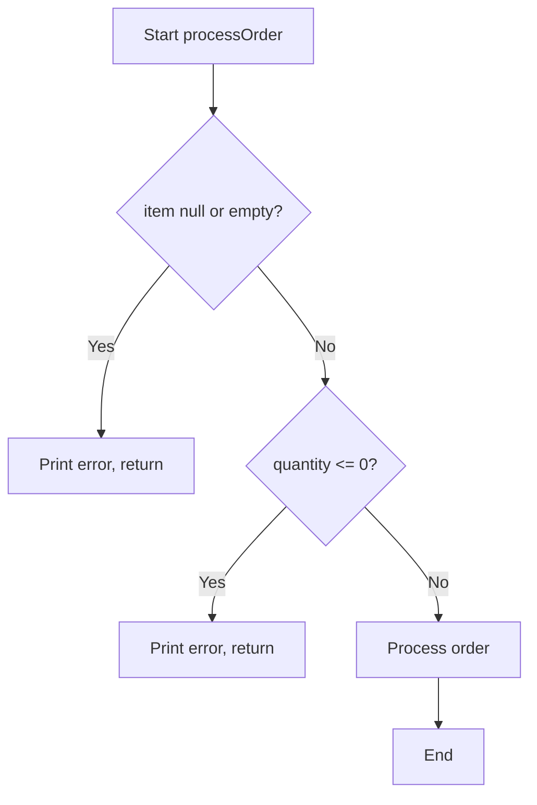
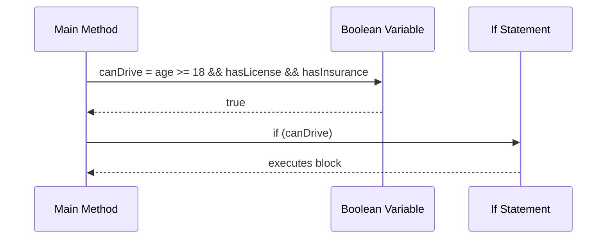
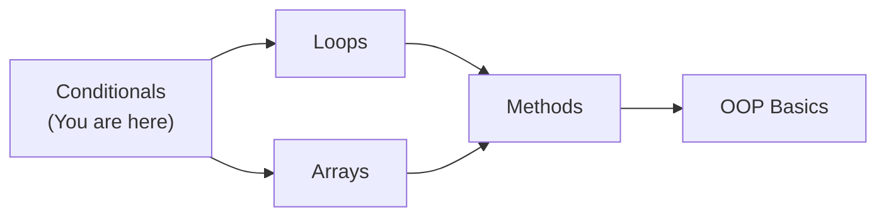
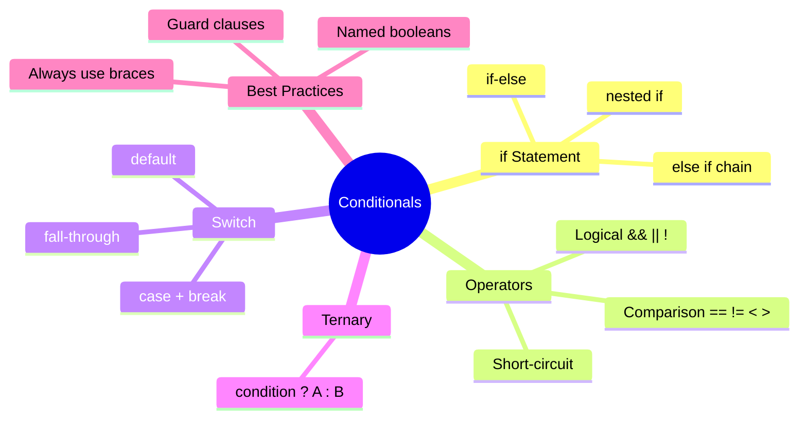
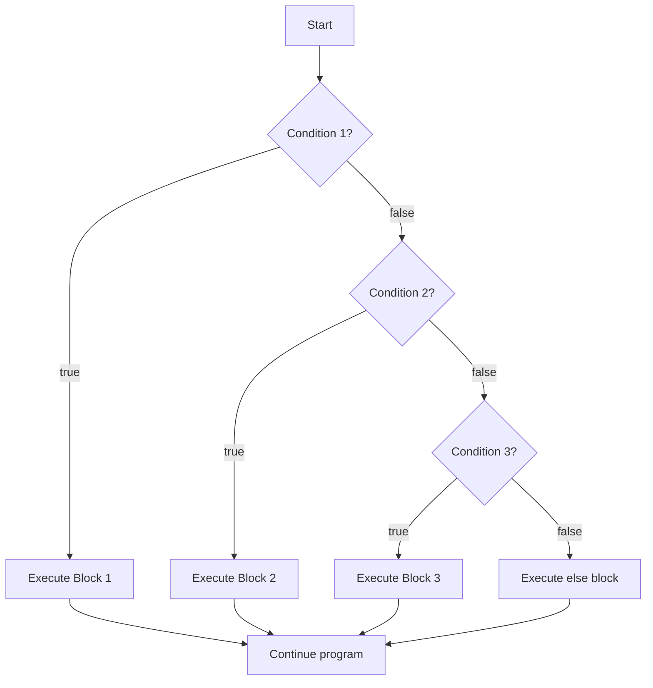

# Java Conditionals — Junior Level

## Table of Contents

1. [Introduction](#introduction)
2. [Prerequisites](#prerequisites)
3. [Glossary](#glossary)
4. [Core Concepts](#core-concepts)
5. [Real-World Analogies](#real-world-analogies)
6. [Mental Models](#mental-models)
7. [Pros & Cons](#pros--cons)
8. [Use Cases](#use-cases)
9. [Code Examples](#code-examples)
10. [Coding Patterns](#coding-patterns)
11. [Clean Code](#clean-code)
12. [Product Use / Feature](#product-use--feature)
13. [Error Handling](#error-handling)
14. [Security Considerations](#security-considerations)
15. [Performance Tips](#performance-tips)
16. [Metrics & Analytics](#metrics--analytics)
17. [Best Practices](#best-practices)
18. [Edge Cases & Pitfalls](#edge-cases--pitfalls)
19. [Common Mistakes](#common-mistakes)
20. [Common Misconceptions](#common-misconceptions)
21. [Tricky Points](#tricky-points)
22. [Test](#test)
23. [Tricky Questions](#tricky-questions)
24. [Cheat Sheet](#cheat-sheet)
25. [Self-Assessment Checklist](#self-assessment-checklist)
26. [Summary](#summary)
27. [What You Can Build](#what-you-can-build)
28. [Further Reading](#further-reading)
29. [Related Topics](#related-topics)
30. [Diagrams & Visual Aids](#diagrams--visual-aids)

---

## Introduction

> Focus: "What is it?" and "How to use it?"

**Conditionals** in Java allow your program to make decisions. Instead of executing every line of code from top to bottom, conditionals let you choose which code to run based on whether a condition is `true` or `false`.

Every real-world program needs decision-making. Whether you are checking if a user entered the correct password, determining if a number is even or odd, or deciding which discount to apply to a shopping cart — conditionals are the tool that makes it all possible.

Java provides several conditional constructs: `if`, `if-else`, `else if`, the ternary operator `? :`, `switch` statements, and modern `switch` expressions (Java 14+). This document covers each of them from the ground up.

---

## Prerequisites

What you should know before studying this topic:

- **Required:** Java basic syntax — you need to know how to write a class with a `main` method
- **Required:** Data types — you need to understand `int`, `double`, `boolean`, `String`, and how they work
- **Required:** Variables and scopes — declaring and assigning values to variables
- **Helpful but not required:** Operators — arithmetic (`+`, `-`, `*`, `/`) and assignment (`=`) operators

---

## Glossary

Key terms used in this topic:

| Term | Definition |
|------|-----------|
| **Condition** | A boolean expression that evaluates to `true` or `false` |
| **if statement** | Executes a block of code only when the condition is `true` |
| **else clause** | Executes when the `if` condition is `false` |
| **else if** | Chains multiple conditions together for sequential checking |
| **Nested if** | An `if` statement placed inside another `if` statement |
| **Ternary operator** | A shorthand `condition ? valueIfTrue : valueIfFalse` for simple if-else |
| **switch statement** | Selects one of many code blocks to execute based on a variable's value |
| **Comparison operator** | Operators like `==`, `!=`, `<`, `>`, `<=`, `>=` that compare values |
| **Logical operator** | Operators `&&` (AND), `\|\|` (OR), `!` (NOT) that combine boolean expressions |
| **Short-circuit evaluation** | Java stops evaluating a logical expression as soon as the result is determined |

---

## Core Concepts

### Concept 1: The `if` Statement

The simplest conditional. If the condition inside the parentheses is `true`, the code block runs. Otherwise, it is skipped.

```java
int temperature = 35;
if (temperature > 30) {
    System.out.println("It's hot outside!");
}
```

### Concept 2: The `if-else` Statement

When you need to handle both outcomes — when the condition is `true` AND when it is `false`.

```java
int age = 16;
if (age >= 18) {
    System.out.println("You can vote.");
} else {
    System.out.println("You cannot vote yet.");
}
```

### Concept 3: The `else if` Chain

When you have more than two possible outcomes, chain multiple conditions using `else if`.

```java
int score = 85;
if (score >= 90) {
    System.out.println("Grade: A");
} else if (score >= 80) {
    System.out.println("Grade: B");
} else if (score >= 70) {
    System.out.println("Grade: C");
} else {
    System.out.println("Grade: F");
}
```

### Concept 4: Nested `if` Statements

An `if` inside another `if`. Useful when the second condition only matters after the first is true.

```java
boolean hasLicense = true;
int age = 20;
if (age >= 18) {
    if (hasLicense) {
        System.out.println("You can drive.");
    } else {
        System.out.println("Get a license first.");
    }
}
```

### Concept 5: Ternary Operator

A compact one-line replacement for simple `if-else`. The syntax is `condition ? valueIfTrue : valueIfFalse`.

```java
int age = 20;
String status = (age >= 18) ? "Adult" : "Minor";
System.out.println(status); // Adult
```

### Concept 6: Comparison Operators

Used to compare two values and produce a `boolean` result:

| Operator | Meaning | Example | Result |
|:--------:|---------|---------|--------|
| `==` | Equal to | `5 == 5` | `true` |
| `!=` | Not equal to | `5 != 3` | `true` |
| `<` | Less than | `3 < 5` | `true` |
| `>` | Greater than | `5 > 3` | `true` |
| `<=` | Less than or equal | `5 <= 5` | `true` |
| `>=` | Greater than or equal | `5 >= 3` | `true` |

### Concept 7: Logical Operators

Combine multiple boolean expressions:

| Operator | Name | Behavior |
|:--------:|------|----------|
| `&&` | AND | `true` only if BOTH sides are `true` |
| `\|\|` | OR | `true` if AT LEAST ONE side is `true` |
| `!` | NOT | Flips `true` to `false` and vice versa |

```java
int age = 25;
boolean hasID = true;
if (age >= 18 && hasID) {
    System.out.println("Entry allowed.");
}
```

### Concept 8: Switch Statement

When you compare one variable against many possible constant values, `switch` is cleaner than a long `else if` chain.

```java
int day = 3;
switch (day) {
    case 1:
        System.out.println("Monday");
        break;
    case 2:
        System.out.println("Tuesday");
        break;
    case 3:
        System.out.println("Wednesday");
        break;
    default:
        System.out.println("Other day");
        break;
}
```

### Concept 9: Short-Circuit Evaluation

Java evaluates `&&` and `||` from left to right and stops as soon as the outcome is determined:
- `&&` — if the left side is `false`, the right side is **never evaluated**
- `||` — if the left side is `true`, the right side is **never evaluated**

```java
String name = null;
// Safe because the right side is not evaluated when name is null
if (name != null && name.length() > 5) {
    System.out.println("Long name");
}
```

---

## Real-World Analogies

Everyday analogies to help you understand conditionals intuitively:

| Concept | Analogy |
|---------|--------|
| **if statement** | A traffic light: if the light is green, you go. Otherwise, you stand still. |
| **if-else** | A fork in the road: you must choose either the left path or the right path. There is no third option. |
| **else if chain** | A restaurant menu with prices: if you have $50 you order steak, if $30 you order chicken, if $10 you order soup, otherwise you leave. |
| **switch** | An elevator panel: you press a button (1, 2, 3...) and the elevator goes directly to that floor. |
| **Ternary operator** | A yes/no question: "Is it raining? Grab umbrella : Leave it at home." |
| **Short-circuit** | Checking your phone battery before checking WiFi: if the battery is dead, there is no point checking WiFi. |

---

## Mental Models

How to picture conditionals in your head:

**The intuition:** Think of your code as a river flowing downhill. A conditional is like a dam with gates — depending on which gate is open (which condition is true), the water flows in a different direction. Only one gate opens at a time in an `if-else if-else` chain.

**Why this model helps:** It prevents the common mistake of thinking multiple branches can execute simultaneously. In an `if-else if-else` chain, exactly ONE branch runs — the first one whose condition is true.

**The switch mental model:** Picture a jukebox. You select a song number (the variable), the jukebox finds the matching slot (the `case`), and plays that song. If no number matches, it plays the default song.

---

## Pros & Cons

| Pros | Cons |
|------|------|
| Simple and readable for 1-3 conditions | Long `if-else if` chains become hard to read |
| `switch` is clear for many discrete values | `switch` only works with certain types (int, String, enum) |
| Ternary operator is concise for assignments | Nested ternary operators are very confusing |
| Short-circuit evaluation prevents runtime errors | Short-circuit can hide bugs if you rely on side effects |
| Every Java developer understands if-else | Complex nested conditions reduce code maintainability |

### When to use:
- `if-else` for 1-3 conditions based on boolean expressions
- `switch` for comparing one variable against many known constant values
- Ternary for simple value-or-other-value assignments

### When NOT to use:
- Avoid deeply nested if statements (more than 3 levels deep) — refactor into methods
- Avoid ternary when the logic is complex or has side effects
- Avoid `switch` for range-based comparisons (use `if-else if` instead)

---

## Use Cases

When and where you would use this in real projects:

- **Use Case 1:** User login — checking if the username and password match
- **Use Case 2:** Form validation — verifying that an email contains `@` and the password is at least 8 characters
- **Use Case 3:** Pricing engine — calculating discounts based on customer tier (gold, silver, bronze)
- **Use Case 4:** Menu navigation — directing the user to different screens based on their selection

---

## Code Examples

### Example 1: Grade Calculator

```java
public class Main {
    public static void main(String[] args) {
        int score = 78;

        // Determine the letter grade using else-if chain
        char grade;
        if (score >= 90) {
            grade = 'A';
        } else if (score >= 80) {
            grade = 'B';
        } else if (score >= 70) {
            grade = 'C';
        } else if (score >= 60) {
            grade = 'D';
        } else {
            grade = 'F';
        }

        System.out.println("Score: " + score);
        System.out.println("Grade: " + grade);
    }
}
```

**What it does:** Takes a numeric score and converts it to a letter grade.
**How to run:** `javac Main.java && java Main`

### Example 2: Day of Week with Switch

```java
public class Main {
    public static void main(String[] args) {
        int dayNumber = 5;

        // Use switch to convert day number to name
        String dayName;
        switch (dayNumber) {
            case 1: dayName = "Monday"; break;
            case 2: dayName = "Tuesday"; break;
            case 3: dayName = "Wednesday"; break;
            case 4: dayName = "Thursday"; break;
            case 5: dayName = "Friday"; break;
            case 6: dayName = "Saturday"; break;
            case 7: dayName = "Sunday"; break;
            default: dayName = "Invalid day"; break;
        }

        System.out.println("Day " + dayNumber + " is " + dayName);
    }
}
```

**What it does:** Converts a day number (1-7) to the day name.
**How to run:** `javac Main.java && java Main`

### Example 3: Login Validator with Logical Operators

```java
public class Main {
    public static void main(String[] args) {
        String username = "admin";
        String password = "secret123";

        // Validate using logical AND (&&)
        if (username.equals("admin") && password.equals("secret123")) {
            System.out.println("Login successful!");
        } else {
            System.out.println("Invalid credentials.");
        }

        // Ternary operator to get status
        String status = (username.equals("admin") && password.equals("secret123"))
                ? "Authenticated" : "Denied";
        System.out.println("Status: " + status);
    }
}
```

**What it does:** Validates username and password, demonstrates both if-else and ternary.
**How to run:** `javac Main.java && java Main`

### Example 4: Nested If — ATM Withdrawal

```java
public class Main {
    public static void main(String[] args) {
        double balance = 500.0;
        double withdrawAmount = 200.0;
        boolean isAccountActive = true;

        // Nested if: check account status first, then balance
        if (isAccountActive) {
            if (withdrawAmount <= balance) {
                balance -= withdrawAmount;
                System.out.println("Withdrawal successful. Remaining: $" + balance);
            } else {
                System.out.println("Insufficient funds.");
            }
        } else {
            System.out.println("Account is not active.");
        }
    }
}
```

**What it does:** Simulates ATM logic with nested conditions.
**How to run:** `javac Main.java && java Main`

### Example 5: Short-Circuit Evaluation

```java
public class Main {
    public static void main(String[] args) {
        String text = null;

        // Without short-circuit: NullPointerException!
        // if (text.length() > 5) { ... }

        // With short-circuit: safe
        if (text != null && text.length() > 5) {
            System.out.println("Text is long: " + text);
        } else {
            System.out.println("Text is null or too short.");
        }

        // Short-circuit with OR
        boolean hasPermission = false;
        boolean isAdmin = true;
        if (hasPermission || isAdmin) {
            System.out.println("Access granted.");
        }
    }
}
```

**What it does:** Demonstrates safe null checks using short-circuit evaluation.
**How to run:** `javac Main.java && java Main`

---

## Coding Patterns

Common patterns beginners encounter when working with conditionals:

### Pattern 1: Guard Clause (Early Return)

**Intent:** Eliminate deep nesting by returning early when a condition fails.
**When to use:** When validating input at the start of a method.

```java
public class Main {
    // With guard clauses (clean)
    static void processOrder(String item, int quantity) {
        if (item == null || item.isEmpty()) {
            System.out.println("Error: Item is required.");
            return;
        }
        if (quantity <= 0) {
            System.out.println("Error: Quantity must be positive.");
            return;
        }
        // Main logic here — no nesting
        System.out.println("Processing " + quantity + "x " + item);
    }

    public static void main(String[] args) {
        processOrder(null, 5);
        processOrder("Laptop", 0);
        processOrder("Laptop", 3);
    }
}
```

**Diagram:**



**Remember:** Guard clauses make your code flat instead of deeply nested. Each guard exits early.

---

### Pattern 2: Boolean Variable for Clarity

**Intent:** Make complex conditions readable by storing the result in a descriptive boolean.

```java
public class Main {
    public static void main(String[] args) {
        int age = 25;
        boolean hasLicense = true;
        boolean hasInsurance = true;

        // Instead of this:
        // if (age >= 18 && hasLicense && hasInsurance) { ... }

        // Use a descriptive boolean:
        boolean canDrive = age >= 18 && hasLicense && hasInsurance;
        if (canDrive) {
            System.out.println("You can drive.");
        }
    }
}
```

**Diagram:**



---

## Clean Code

Basic clean code principles when working with conditionals in Java:

### Naming (Java conventions)

```java
// Bad: unclear condition
if (x > 18 && y == true && z != null) { ... }

// Clean: descriptive booleans
boolean isAdult = age > 18;
boolean isVerified = verificationStatus == true;
boolean hasProfile = profile != null;
if (isAdult && isVerified && hasProfile) { ... }
```

**Java naming rules for booleans:**
- Use `is`, `has`, `can` prefixes: `isValid`, `hasPermission`, `canProceed`
- Variable names should read like a question: `if (isReady)` reads naturally

---

### Short Methods

```java
// Bad: all logic in one method
public void processUser(User user) {
    if (user != null) {
        if (user.getAge() >= 18) {
            if (user.getEmail() != null) {
                // 30 lines of processing
            }
        }
    }
}

// Clean: each check is a method
private boolean isValidUser(User user) {
    return user != null && user.getAge() >= 18 && user.getEmail() != null;
}

public void processUser(User user) {
    if (!isValidUser(user)) {
        return;
    }
    // clean processing logic
}
```

---

### Avoid Redundant Comparisons

```java
// Bad: comparing boolean to true/false
if (isReady == true) { ... }
if (isEmpty == false) { ... }

// Clean: use the boolean directly
if (isReady) { ... }
if (!isEmpty) { ... }
```

---

## Product Use / Feature

How conditionals are used in real-world products and tools:

### 1. Spring Security

- **How it uses conditionals:** Every HTTP request passes through security filters that use conditionals to check if the user is authenticated, authorized, and not blocked.
- **Why it matters:** Without conditionals, there would be no access control.

### 2. Android Apps

- **How it uses conditionals:** Android apps use if-else to handle different screen sizes, OS versions, and user permissions.
- **Why it matters:** Apps must adapt to thousands of different device configurations.

### 3. Game Engines (LibGDX, LWJGL)

- **How it uses conditionals:** Game logic is driven by conditionals — collision detection, player state (alive, dead, powered-up), level transitions.
- **Why it matters:** Every frame, hundreds of conditions are checked to determine what to draw and how to respond to input.

---

## Error Handling

How to handle errors when working with conditionals:

### Error 1: NullPointerException

```java
// Code that crashes
String name = null;
if (name.equals("John")) { // NullPointerException!
    System.out.println("Hello John");
}
```

**Why it happens:** Calling `.equals()` on a `null` reference.
**How to fix:**

```java
// Option 1: null check first (short-circuit)
if (name != null && name.equals("John")) {
    System.out.println("Hello John");
}

// Option 2: reverse the comparison
if ("John".equals(name)) { // never throws NPE
    System.out.println("Hello John");
}
```

### Error 2: Unreachable Code After Return

```java
// This will NOT compile
if (x > 0) {
    return x;
    System.out.println("Done"); // Compile error: unreachable statement
}
```

**Why it happens:** Code after `return` can never execute.
**How to fix:** Remove the unreachable code or move the print before the return.

---

## Security Considerations

Security aspects to keep in mind when using conditionals:

### 1. Input Validation

```java
// Bad: trusting user input without validation
String role = getUserRole(); // from HTTP request
if (role.equals("admin")) {
    deleteAllRecords();
}

// Better: validate and sanitize
String role = getUserRole();
if (role != null && allowedRoles.contains(role) && role.equals("admin")) {
    deleteAllRecords();
}
```

**Risk:** An attacker can manipulate the role value if not validated.
**Mitigation:** Always validate inputs before using them in conditionals.

### 2. String Comparison for Sensitive Data

```java
// Bad: timing-attack vulnerable
if (userToken.equals(expectedToken)) { ... }

// Better for security-sensitive comparisons:
// Use MessageDigest.isEqual() or similar constant-time comparison
```

**Risk:** Standard `.equals()` returns early on the first non-matching character, leaking information about the expected value.
**Mitigation:** For tokens and passwords, use constant-time comparison functions.

---

## Performance Tips

Basic performance considerations for conditionals:

### Tip 1: Put the Most Likely Condition First

```java
// If 90% of users are logged in, check that first
if (isLoggedIn) {
    // fast path
} else {
    // slow path: redirect to login
}
```

**Why it's faster:** The CPU branch predictor works better when the most likely branch comes first.

### Tip 2: Prefer `switch` Over Long `else-if` Chains

```java
// Slower for many values
if (day == 1) { ... }
else if (day == 2) { ... }
else if (day == 3) { ... }
// ... up to 7

// Faster: switch uses a jump table internally
switch (day) {
    case 1: ...; break;
    case 2: ...; break;
    case 3: ...; break;
}
```

**Why it's faster:** The compiler can optimize `switch` into a jump table (O(1) lookup) instead of sequential comparisons.

---

## Metrics & Analytics

Key metrics to track when using conditionals:

### What to Measure

| Metric | Why it matters | Tool |
|--------|---------------|------|
| **Branch coverage** | Ensures all conditional paths are tested | JaCoCo, IntelliJ |
| **Cyclomatic complexity** | Measures how many independent paths exist | SonarQube, PMD |

### Basic Instrumentation

```java
// Track which branch executes (useful for A/B testing)
public class Main {
    static int branchACount = 0;
    static int branchBCount = 0;

    public static void main(String[] args) {
        for (int i = 0; i < 100; i++) {
            if (Math.random() > 0.5) {
                branchACount++;
            } else {
                branchBCount++;
            }
        }
        System.out.println("Branch A: " + branchACount);
        System.out.println("Branch B: " + branchBCount);
    }
}
```

---

## Best Practices

- **Always use braces `{}`:** Even for single-line if statements. Prevents bugs when adding lines later.
- **Use `.equals()` for Strings:** Never compare strings with `==` (it compares references, not values).
- **Avoid magic numbers:** Use named constants instead of raw numbers in conditions.
- **Keep conditions simple:** Extract complex conditions into named boolean variables or methods.
- **Use guard clauses:** Return early to avoid deep nesting.

---

## Edge Cases & Pitfalls

### Pitfall 1: Missing `break` in Switch (Fall-Through)

```java
int day = 2;
switch (day) {
    case 1:
        System.out.println("Monday");
    case 2:
        System.out.println("Tuesday");
    case 3:
        System.out.println("Wednesday");
}
// Output: Tuesday AND Wednesday (fall-through!)
```

**What happens:** Without `break`, execution "falls through" to the next case.
**How to fix:** Always add `break` after each case, or use Java 14+ switch expressions.

### Pitfall 2: Comparing Floating-Point Numbers

```java
double a = 0.1 + 0.2;
if (a == 0.3) { // FALSE! Because 0.1 + 0.2 = 0.30000000000000004
    System.out.println("Equal");
}
```

**What happens:** Floating-point arithmetic is imprecise.
**How to fix:** Use a tolerance: `if (Math.abs(a - 0.3) < 0.0001)`

---

## Common Mistakes

### Mistake 1: Using `=` Instead of `==`

```java
// Wrong: assignment, not comparison
int x = 5;
if (x = 10) { // Compile error in Java (int is not boolean)
    System.out.println("ten");
}

// Correct: comparison
if (x == 10) {
    System.out.println("ten");
}
```

### Mistake 2: Comparing Strings with `==`

```java
// Wrong
String a = new String("hello");
String b = new String("hello");
if (a == b) { // false — compares memory addresses
    System.out.println("Equal");
}

// Correct
if (a.equals(b)) { // true — compares content
    System.out.println("Equal");
}
```

### Mistake 3: Forgetting `break` in Switch

```java
// Wrong: falls through to default
switch (color) {
    case "red":
        System.out.println("Stop");
    case "green":
        System.out.println("Go");
    default:
        System.out.println("Unknown");
}

// Correct
switch (color) {
    case "red":
        System.out.println("Stop");
        break;
    case "green":
        System.out.println("Go");
        break;
    default:
        System.out.println("Unknown");
}
```

---

## Common Misconceptions

Things people often believe about conditionals that are not true:

### Misconception 1: "`==` works for all comparisons"

**Reality:** `==` compares primitive values correctly, but for objects (including `String`), it compares memory references, not content. Use `.equals()` for object comparison.

**Why people think this:** In other languages like Python, `==` compares values for strings. Java treats strings as objects.

### Misconception 2: "Both sides of `&&` always execute"

**Reality:** Java uses short-circuit evaluation. If the left side of `&&` is `false`, the right side is never evaluated. Similarly, if the left side of `||` is `true`, the right side is skipped.

**Why people think this:** Mathematically, AND evaluates both operands. Java optimizes this for performance and safety.

### Misconception 3: "`else if` is a single keyword"

**Reality:** There is no `elseif` or `elif` keyword in Java. `else if` is simply an `else` clause containing another `if` statement. The compiler treats them separately.

**Why people think this:** Languages like Python have `elif` as a keyword.

---

## Tricky Points

Things that look simple but have subtle behavior:

### Tricky Point 1: Integer Caching and `==`

```java
Integer a = 127;
Integer b = 127;
System.out.println(a == b); // true (cached)

Integer c = 128;
Integer d = 128;
System.out.println(c == d); // false (new objects!)
```

**Why it's tricky:** Java caches `Integer` objects for values -128 to 127. Outside this range, `==` compares different objects.
**Key takeaway:** Always use `.equals()` for `Integer` comparisons.

### Tricky Point 2: Dangling Else

```java
if (x > 0)
    if (y > 0)
        System.out.println("Both positive");
else
    System.out.println("Which if does this else belong to?");
// Answer: the INNER if (closest unmatched if)
```

**Why it's tricky:** Without braces, `else` binds to the nearest `if`.
**Key takeaway:** Always use braces to avoid ambiguity.

---

## Test

### Multiple Choice

**1. What is the output of this code?**

```java
int x = 10;
if (x > 5) {
    System.out.print("A");
} else if (x > 8) {
    System.out.print("B");
} else {
    System.out.print("C");
}
```

- A) AB
- B) A
- C) B
- D) ABC

<details>
<summary>Answer</summary>

**B) A** — The first condition `x > 5` is `true`, so "A" prints. The `else if` and `else` are skipped entirely because the first branch already matched. Only one branch in an if-else-if chain executes.

</details>

**2. Which operator should you use to compare two `String` values?**

- A) `==`
- B) `.equals()`
- C) `<`
- D) `.compareTo()`

<details>
<summary>Answer</summary>

**B) .equals()** — In Java, `==` compares references (memory addresses), not content. `.equals()` compares the actual string content. `.compareTo()` works but returns an int, not a boolean.

</details>

### True or False

**3. In Java, `switch` can be used with `double` values.**

<details>
<summary>Answer</summary>

**False** — `switch` supports `byte`, `short`, `char`, `int`, `String`, `enum`, and their wrapper types. It does NOT support `float`, `double`, `long`, or `boolean`.

</details>

**4. Short-circuit evaluation means `&&` always evaluates both sides.**

<details>
<summary>Answer</summary>

**False** — Short-circuit means the opposite: if the left side of `&&` is `false`, the right side is NOT evaluated. This is a key safety feature for null checks.

</details>

### What's the Output?

**5. What does this code print?**

```java
int a = 5;
int b = 10;
System.out.println(a > 3 && b < 5);
System.out.println(a > 3 || b < 5);
System.out.println(!(a > 3));
```

<details>
<summary>Answer</summary>

Output:
```
false
true
false
```
- `a > 3` is `true`, `b < 5` is `false`. `true && false` = `false`
- `true || false` = `true`
- `!true` = `false`

</details>

**6. What does this code print?**

```java
int x = 2;
switch (x) {
    case 1:
        System.out.print("One ");
    case 2:
        System.out.print("Two ");
    case 3:
        System.out.print("Three ");
        break;
    default:
        System.out.print("Default ");
}
```

<details>
<summary>Answer</summary>

Output: `Two Three `
Explanation: Case 2 matches. Since there is no `break` after case 2, execution falls through to case 3. Case 3 has a `break`, so it stops there. "Default" is not printed.

</details>

---

## "What If?" Scenarios

**What if you forget `break` in every case of a switch?**
- **You might think:** Only the matching case runs.
- **But actually:** ALL cases after the matching one execute (fall-through), including `default`. This is one of the most common Java bugs.

**What if the condition in an `if` is not a boolean?**
- **You might think:** Java will auto-convert it like JavaScript does (`if (1)` is truthy).
- **But actually:** Java requires the condition to be a strict `boolean`. `if (1)` is a compile error. No truthy/falsy concept in Java.

---

## Tricky Questions

Questions designed to confuse — with misleading options:

**1. What is the output?**

```java
String s1 = "hello";
String s2 = "hello";
if (s1 == s2) {
    System.out.println("Same");
} else {
    System.out.println("Different");
}
```

- A) Different
- B) Same
- C) Compile error
- D) Runtime error

<details>
<summary>Answer</summary>

**B) Same** — This is tricky because `==` on strings usually compares references. But string literals in Java are interned (stored in the String Pool), so `s1` and `s2` point to the same object. If you used `new String("hello")`, the answer would be "Different".

</details>

**2. What is the value of `result`?**

```java
int x = 5;
int result = (x > 3) ? (x > 10) ? 100 : 50 : 0;
```

- A) 100
- B) 50
- C) 0
- D) Compile error

<details>
<summary>Answer</summary>

**B) 50** — This is a nested ternary. `x > 3` is `true`, so we evaluate the inner ternary: `x > 10` is `false`, so the result is `50`. Nested ternaries are legal but strongly discouraged for readability.

</details>

**3. Does this code compile?**

```java
switch (true) {
    case true: System.out.println("Yes"); break;
    case false: System.out.println("No"); break;
}
```

- A) Yes, prints "Yes"
- B) Yes, prints "No"
- C) Compile error
- D) Runtime error

<details>
<summary>Answer</summary>

**C) Compile error** — `switch` does not support `boolean` type. Even though `boolean` has only two values, Java does not allow it as a switch argument. Use `if-else` instead.

</details>

---

## Cheat Sheet

Quick reference for this topic:

| What | Syntax | Example |
|------|--------|---------|
| Simple if | `if (cond) { }` | `if (x > 0) { print("pos"); }` |
| If-else | `if (cond) { } else { }` | `if (x > 0) { ... } else { ... }` |
| Else-if | `if (c1) { } else if (c2) { }` | `if (x>90) A; else if (x>80) B;` |
| Ternary | `cond ? val1 : val2` | `String s = (x>0) ? "pos" : "neg";` |
| Switch | `switch(var) { case v: ...; break; }` | `switch(day) { case 1: ...; break; }` |
| AND | `&&` | `if (a && b) { }` |
| OR | `\|\|` | `if (a \|\| b) { }` |
| NOT | `!` | `if (!done) { }` |
| Equality | `==` (primitives) / `.equals()` (objects) | `if (s.equals("yes"))` |
| Null-safe check | `obj != null && obj.method()` | `if (s != null && s.length() > 0)` |

---

## Self-Assessment Checklist

Check your understanding of Java Conditionals:

### I can explain:
- [ ] What conditionals are and why they exist
- [ ] The difference between `if`, `if-else`, `else if`, and `switch`
- [ ] What short-circuit evaluation is and how it prevents NullPointerException
- [ ] Why `==` is dangerous for String comparison

### I can do:
- [ ] Write `if-else-if` chains from scratch
- [ ] Use `switch` statements correctly with `break`
- [ ] Use the ternary operator for simple assignments
- [ ] Write null-safe conditions using short-circuit `&&`
- [ ] Debug common conditional errors (missing break, `==` vs `.equals()`)

### I can answer:
- [ ] All multiple choice questions in this document
- [ ] "What's the output?" questions correctly

---

## Summary

- **Conditionals** let Java programs make decisions based on boolean expressions
- Use `if` for simple checks, `if-else` for two-way decisions, `else if` for multiple conditions
- `switch` is ideal for comparing one variable against many discrete values (remember `break`!)
- The **ternary operator** `? :` is a one-line if-else for simple assignments
- **Comparison operators** (`==`, `!=`, `<`, `>`, `<=`, `>=`) produce boolean results
- **Logical operators** (`&&`, `||`, `!`) combine conditions; `&&` and `||` use short-circuit evaluation
- Always use `.equals()` for String comparisons, never `==`
- Favor guard clauses and named booleans for clean, readable conditions

**Next step:** Learn about loops (`for`, `while`, `do-while`, enhanced `for`) to combine with conditionals for powerful programs.

---

## What You Can Build

Now that you understand conditionals, here is what you can build:

### Projects you can create:
- **Calculator app:** Use conditionals to determine which arithmetic operation to perform (+, -, *, /)
- **Quiz game:** Ask multiple-choice questions and check answers with if-else
- **Simple ATM:** Deposit, withdraw, check balance — all driven by switch and if conditions
- **Number guessing game:** Compare user input against a random number

### Technologies / tools that use this:
- **Spring Boot** — every request handler uses conditionals for routing and validation
- **Android Development** — UI state management depends heavily on conditionals
- **JUnit Testing** — assertions are conditionals under the hood

### Learning path — what to study next:



---

## Further Reading

- **Official docs:** [Java Tutorial - Control Flow Statements](https://docs.oracle.com/javase/tutorial/java/nutsandbolts/flow.html)
- **Book chapter:** Head First Java, Chapter 4 — Methods use conditionals
- **Video:** [Java Conditionals Full Tutorial](https://www.youtube.com/results?search_query=java+conditionals+tutorial) — search for beginner-level tutorials
- **Practice:** [CodingBat Java Conditionals](https://codingbat.com/java/Logic-1) — interactive logic exercises

---

## Related Topics

Topics to explore next or that connect to this one:

- **[Loops](../10-loops/)** — conditionals decide IF something runs; loops decide HOW MANY TIMES
- **[Data Types](../03-data-types/)** — understanding `boolean`, `int`, `String` is essential for conditions
- **[Arrays](../08-arrays/)** — combining arrays with conditionals lets you filter and search data
- **[Basics of OOP](../11-basics-of-oop/)** — methods encapsulate conditional logic into reusable units

---

## Diagrams & Visual Aids

### Mind Map



### If-Else Decision Flow



### Switch Statement Flow

```mermaid
flowchart TD
    A[switch variable] --> B{case 1?}
    B -->|match| C[Execute case 1]
    C --> D{break?}
    D -->|yes| Z[Exit switch]
    D -->|no| E[Fall to case 2]
    B -->|no match| F{case 2?}
    F -->|match| G[Execute case 2]
    G --> H{break?}
    H -->|yes| Z
    H -->|no| I[Fall to case 3]
    F -->|no match| J{default?}
    J --> K[Execute default]
    K --> Z
