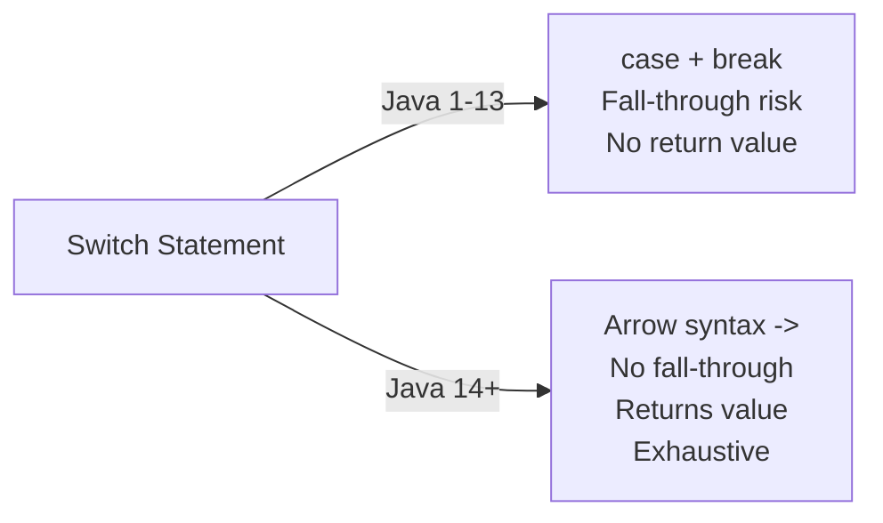
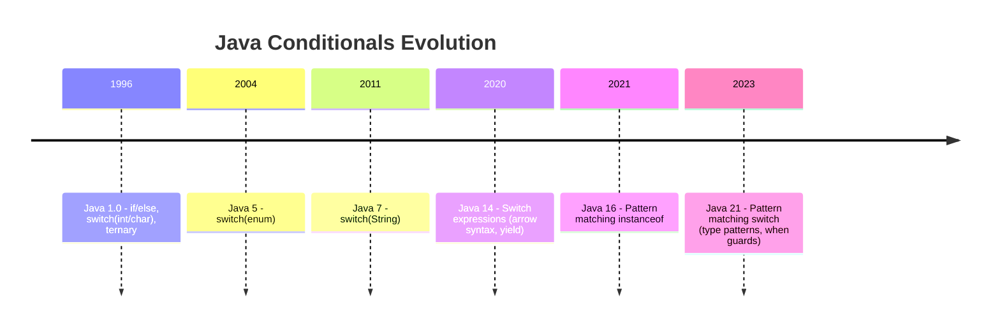
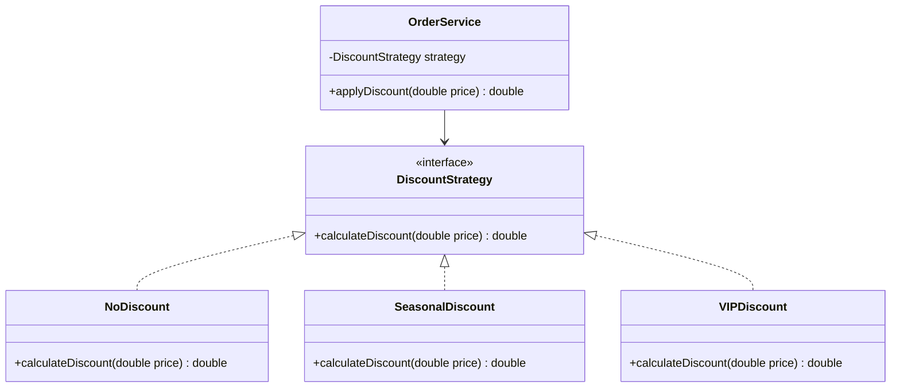
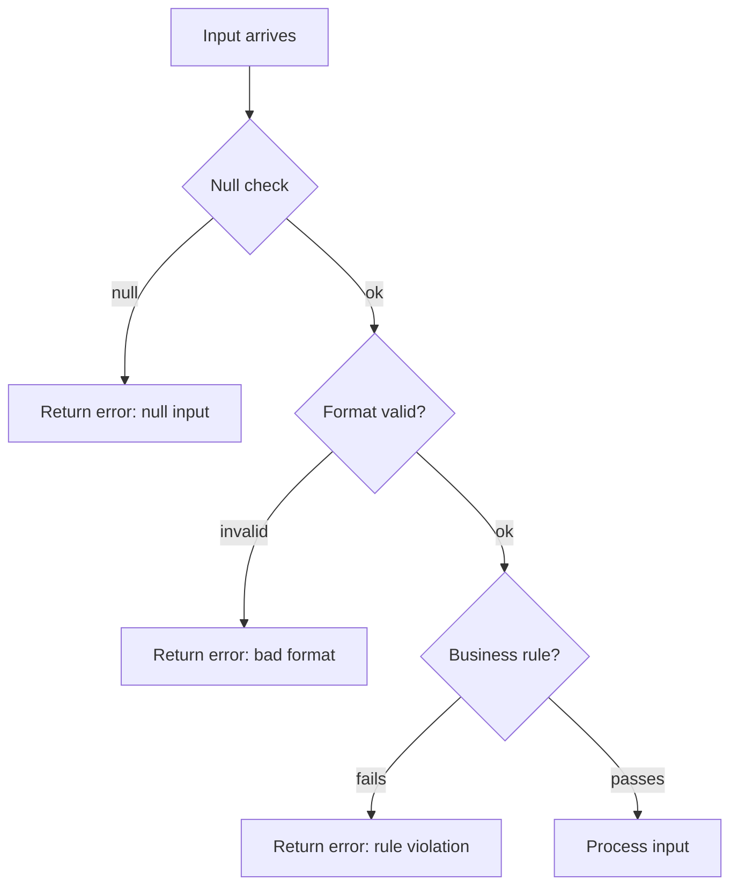
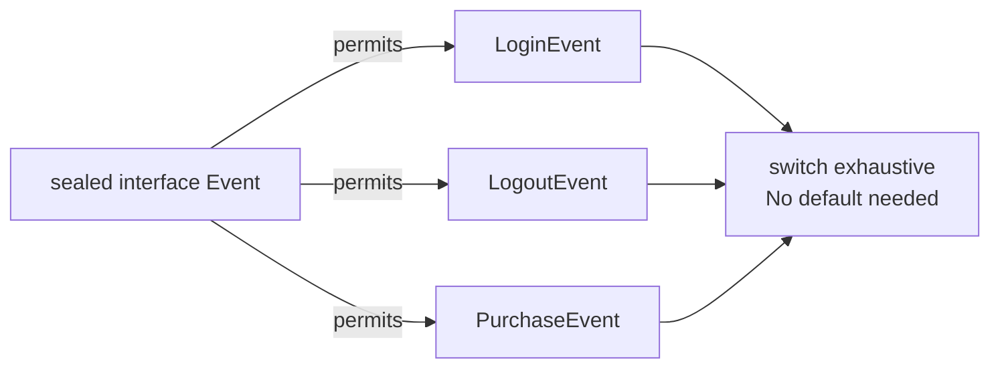
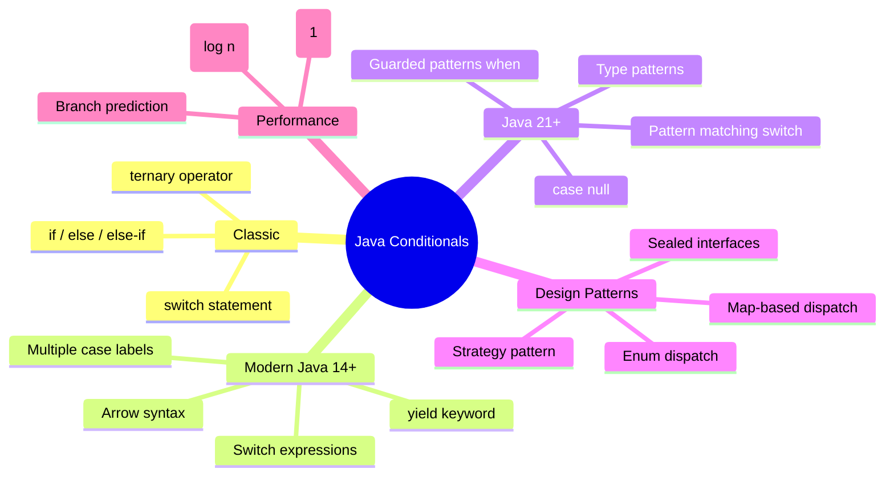
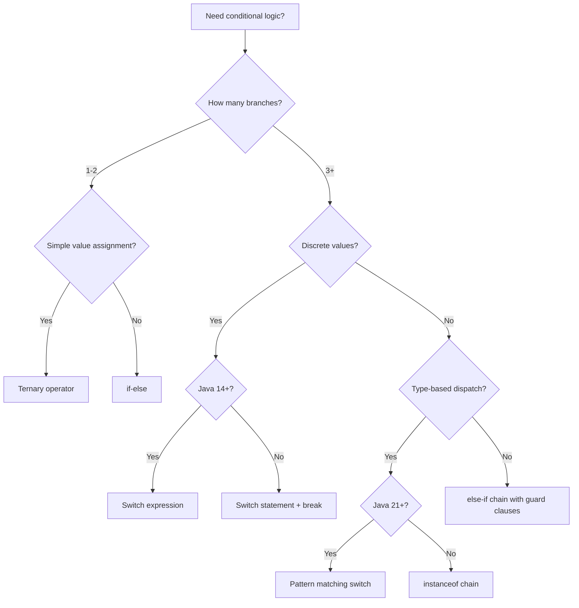
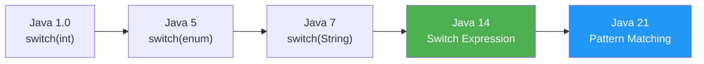

# Java Conditionals — Middle Level

## Table of Contents

1. [Introduction](#introduction)
2. [Core Concepts](#core-concepts)
3. [Evolution & Historical Context](#evolution--historical-context)
4. [Pros & Cons](#pros--cons)
5. [Alternative Approaches](#alternative-approaches)
6. [Use Cases](#use-cases)
7. [Code Examples](#code-examples)
8. [Coding Patterns](#coding-patterns)
9. [Clean Code](#clean-code)
10. [Product Use / Feature](#product-use--feature)
11. [Error Handling](#error-handling)
12. [Security Considerations](#security-considerations)
13. [Performance Optimization](#performance-optimization)
14. [Debugging Guide](#debugging-guide)
15. [Best Practices](#best-practices)
16. [Edge Cases & Pitfalls](#edge-cases--pitfalls)
17. [Common Mistakes](#common-mistakes)
18. [Comparison with Other Languages](#comparison-with-other-languages)
19. [Test](#test)
20. [Tricky Questions](#tricky-questions)
21. [Cheat Sheet](#cheat-sheet)
22. [Summary](#summary)
23. [Further Reading](#further-reading)
24. [Diagrams & Visual Aids](#diagrams--visual-aids)

---

## Introduction

> Focus: "Why?" and "When to use?"

You already know `if-else`, `switch`, ternary, and logical operators. This level covers:
- **Switch expressions** (Java 14+) — how they differ from switch statements and why they are superior
- **Pattern matching for switch** (Java 21+) — switching on types, guarded patterns
- How the JVM compiles conditionals to bytecode (`tableswitch`, `lookupswitch`, branch instructions)
- Replacing conditionals with polymorphism, strategy pattern, and functional design
- Production-ready patterns: enum-based dispatching, validation chains, Spring-specific conditional logic

---

## Core Concepts

### Concept 1: Switch Expressions (Java 14+)

Switch expressions use the arrow `->` syntax, return a value, do not require `break`, and are exhaustive (compiler enforces all cases).

```java
public class Main {
    public static void main(String[] args) {
        int dayNumber = 3;

        // Switch expression — returns a value, no fall-through
        String dayName = switch (dayNumber) {
            case 1 -> "Monday";
            case 2 -> "Tuesday";
            case 3 -> "Wednesday";
            case 4 -> "Thursday";
            case 5 -> "Friday";
            case 6, 7 -> "Weekend";  // multiple values per case
            default -> "Invalid";
        };

        System.out.println(dayName); // Wednesday
    }
}
```



**Key differences from switch statements:**

| Feature | Switch Statement | Switch Expression (14+) |
|---------|-----------------|------------------------|
| Fall-through | Yes (needs `break`) | No (arrow syntax) |
| Returns value | No | Yes (assigned to variable) |
| Exhaustive check | No | Yes (compiler enforces) |
| Multiple labels | Separate `case` | `case 1, 2, 3 ->` |
| Block body | `case:` block | `case -> { yield value; }` |

### Concept 2: Pattern Matching for `switch` (Java 21+)

Java 21 allows switching on **types** (instanceof patterns), **null**, and **guarded patterns** with `when`.

```java
public class Main {
    static String formatValue(Object obj) {
        return switch (obj) {
            case null -> "null value";
            case Integer i when i < 0 -> "Negative int: " + i;
            case Integer i -> "Positive int: " + i;
            case String s when s.isEmpty() -> "Empty string";
            case String s -> "String: " + s;
            case double[] arr -> "Double array of length " + arr.length;
            default -> "Unknown: " + obj.getClass().getSimpleName();
        };
    }

    public static void main(String[] args) {
        System.out.println(formatValue(42));          // Positive int: 42
        System.out.println(formatValue(-7));           // Negative int: -7
        System.out.println(formatValue("Hello"));      // String: Hello
        System.out.println(formatValue(""));           // Empty string
        System.out.println(formatValue(null));          // null value
        System.out.println(formatValue(3.14));          // Unknown: Double
    }
}
```

### Concept 3: The `yield` Keyword

When a switch expression case needs multiple statements, use a block with `yield`:

```java
public class Main {
    public static void main(String[] args) {
        int score = 85;

        String grade = switch (score / 10) {
            case 10, 9 -> "A";
            case 8 -> {
                System.out.println("Good job!");
                yield "B";  // yield returns the value from the block
            }
            case 7 -> "C";
            case 6 -> "D";
            default -> {
                System.out.println("Need improvement.");
                yield "F";
            }
        };

        System.out.println("Grade: " + grade);
    }
}
```

### Concept 4: Enum-Based Conditional Dispatch

Replace long if-else chains with enums that carry behavior:

```java
public class Main {
    enum Operation {
        ADD {
            public double apply(double a, double b) { return a + b; }
        },
        SUBTRACT {
            public double apply(double a, double b) { return a - b; }
        },
        MULTIPLY {
            public double apply(double a, double b) { return a * b; }
        },
        DIVIDE {
            public double apply(double a, double b) {
                if (b == 0) throw new ArithmeticException("Division by zero");
                return a / b;
            }
        };

        public abstract double apply(double a, double b);
    }

    public static void main(String[] args) {
        // No if-else needed — enum dispatches behavior
        Operation op = Operation.ADD;
        System.out.println(op.apply(10, 3)); // 13.0

        // With switch expression on enum
        Operation op2 = Operation.MULTIPLY;
        String description = switch (op2) {
            case ADD -> "Addition";
            case SUBTRACT -> "Subtraction";
            case MULTIPLY -> "Multiplication";
            case DIVIDE -> "Division";
        };
        System.out.println(description); // Multiplication
    }
}
```

### Concept 5: Short-Circuit Side Effects and `&` vs `&&`

Java has both short-circuit (`&&`, `||`) and non-short-circuit (`&`, `|`) logical operators:

```java
public class Main {
    static boolean checkA() {
        System.out.println("checkA called");
        return false;
    }

    static boolean checkB() {
        System.out.println("checkB called");
        return true;
    }

    public static void main(String[] args) {
        System.out.println("--- Short-circuit && ---");
        if (checkA() && checkB()) { }
        // Output: checkA called (checkB NOT called)

        System.out.println("--- Non-short-circuit & ---");
        if (checkA() & checkB()) { }
        // Output: checkA called AND checkB called
    }
}
```

**When `&` is useful:** When both sides have important side effects that must always execute. In practice, this is rare — prefer `&&`.

---

## Evolution & Historical Context

Why does Java have so many conditional constructs?

**Java 1.0 (1996):** `if-else`, `switch` (int, char only), ternary, logical operators. `switch` required `break` and had fall-through — a design borrowed from C.

**Java 5 (2004):** `switch` gained `enum` support. Before this, enums were faked with `int` constants.

**Java 7 (2011):** `switch` gained `String` support. Before this, String-based routing required ugly if-else chains.

**Java 14 (2020):** Switch expressions with `->` syntax — no fall-through, returns values, `yield` keyword. This was the biggest conditional improvement since Java 1.0.

**Java 16 (2021):** Pattern matching for `instanceof` — `if (obj instanceof String s)` extracts the variable in one step.

**Java 21 (2023):** Pattern matching for `switch` — type patterns, guarded patterns with `when`, null handling. This transformed `switch` into a powerful pattern-matching tool comparable to Scala/Kotlin `when`.



---

## Pros & Cons

| Pros | Cons |
|------|------|
| Switch expressions eliminate fall-through bugs | Requires Java 14+ (not available in legacy codebases) |
| Pattern matching reduces instanceof chains | Pattern matching requires Java 21+ |
| Enum dispatch provides type-safe conditional logic | Enum approach requires more upfront design |
| `yield` allows complex logic in switch expressions | `yield` is unfamiliar to many developers |
| Exhaustiveness checking catches missing cases at compile time | Exhaustive switches require `default` for non-sealed types |

### Trade-off analysis:

- **Readability vs brevity:** Switch expressions are more concise but unfamiliar to developers on older Java versions
- **Flexibility vs safety:** If-else is flexible (any boolean expression) but switch expressions enforce exhaustiveness

### Comparison with alternatives:

| Approach | Pros | Cons | Best for |
|----------|------|------|----------|
| If-else chain | Flexible, works with any boolean | Verbose, easy to miss a case | Range checks, complex conditions |
| Switch statement | Clear for discrete values | Fall-through bugs, no return | Legacy code, Java < 14 |
| Switch expression | No fall-through, returns value | Requires Java 14+ | Modern Java, enum dispatch |
| Enum with methods | Type-safe, no conditional at all | More code to write | Fixed set of behaviors |
| Strategy pattern | Open/closed principle, extensible | Over-engineering for simple cases | Frequently changing behavior sets |

---

## Alternative Approaches (Plan B)

| Alternative | How it works | When you might be forced to use it |
|-------------|--------------|-------------------------------------|
| **Map-based dispatch** | `Map<String, Runnable>` replaces switch on strings | When conditions are dynamic and loaded at runtime |
| **Polymorphism** | Override methods in subclasses instead of if-else on type | When you control the class hierarchy |
| **Optional + map/orElse** | `Optional.ofNullable(x).map(...).orElse(...)` | When the condition is "null or not" |
| **Predicate chains** | `List<Predicate<T>>` for rule-based evaluation | When rules are configurable and change frequently |

---

## Use Cases

Real-world production scenarios:

- **Use Case 1:** Spring MVC request routing — `@RequestMapping` dispatches based on HTTP method and path, but within handlers, conditionals validate inputs and direct business logic
- **Use Case 2:** Feature flags — `if (featureFlags.isEnabled("new-checkout"))` toggles between old and new code paths in production
- **Use Case 3:** API version handling — switch expressions to return different response formats based on `Accept` header version
- **Use Case 4:** State machines — order processing (CREATED -> PAID -> SHIPPED -> DELIVERED) with switch on enum state

---

## Code Examples

### Example 1: Feature Flag with Switch Expression

```java
public class Main {
    enum Feature { NEW_UI, DARK_MODE, BETA_SEARCH, LEGACY }

    static String getFeatureConfig(Feature feature) {
        return switch (feature) {
            case NEW_UI -> "React frontend v2";
            case DARK_MODE -> "CSS dark theme enabled";
            case BETA_SEARCH -> "Elasticsearch v8 backend";
            case LEGACY -> "Classic JSP rendering";
        };  // exhaustive — no default needed for enum
    }

    public static void main(String[] args) {
        for (Feature f : Feature.values()) {
            System.out.println(f + " -> " + getFeatureConfig(f));
        }
    }
}
```

**Why this pattern:** Compile-time exhaustiveness means adding a new enum constant forces you to handle it everywhere.
**Trade-offs:** You gain safety but lose flexibility — adding values requires code changes.

### Example 2: Pattern Matching for Polymorphic Processing (Java 21+)

```java
public class Main {
    sealed interface Shape permits Circle, Rectangle, Triangle {}
    record Circle(double radius) implements Shape {}
    record Rectangle(double width, double height) implements Shape {}
    record Triangle(double base, double height) implements Shape {}

    static double area(Shape shape) {
        return switch (shape) {
            case Circle c -> Math.PI * c.radius() * c.radius();
            case Rectangle r -> r.width() * r.height();
            case Triangle t -> 0.5 * t.base() * t.height();
            // No default needed — sealed interface is exhaustive
        };
    }

    public static void main(String[] args) {
        Shape[] shapes = {
            new Circle(5),
            new Rectangle(4, 6),
            new Triangle(3, 8)
        };

        for (Shape s : shapes) {
            System.out.printf("%s -> area = %.2f%n", s, area(s));
        }
    }
}
```

**When to use which:** Use sealed interfaces + pattern matching when your type hierarchy is closed and fixed. Use polymorphism (abstract methods) when subclasses should define their own behavior.

### Example 3: Map-Based Dispatch (No Conditionals)

```java
import java.util.Map;
import java.util.function.Function;

public class Main {
    public static void main(String[] args) {
        // Replace switch/if-else with a Map
        Map<String, Function<Double, Double>> converters = Map.of(
            "km_to_miles", km -> km * 0.621371,
            "miles_to_km", miles -> miles * 1.60934,
            "c_to_f", c -> c * 9.0 / 5.0 + 32,
            "f_to_c", f -> (f - 32) * 5.0 / 9.0
        );

        String conversion = "km_to_miles";
        double input = 100;

        Function<Double, Double> converter = converters.get(conversion);
        if (converter != null) {
            System.out.printf("%.2f %s = %.2f%n", input, conversion, converter.apply(input));
        } else {
            System.out.println("Unknown conversion: " + conversion);
        }
    }
}
```

---

## Coding Patterns

### Pattern 1: Strategy Pattern Replacing Conditionals

**Category:** Behavioral / Java-idiomatic
**Intent:** Replace a growing if-else/switch chain with pluggable strategy objects
**When to use:** When you find yourself adding new `else if` branches for every new type
**When NOT to use:** When there are only 2-3 simple conditions that rarely change

**Structure diagram:**



**Implementation:**

```java
public class Main {
    interface DiscountStrategy {
        double apply(double price);
    }

    static class NoDiscount implements DiscountStrategy {
        public double apply(double price) { return price; }
    }

    static class PercentDiscount implements DiscountStrategy {
        private final double percent;
        PercentDiscount(double percent) { this.percent = percent; }
        public double apply(double price) { return price * (1 - percent / 100); }
    }

    static class FixedDiscount implements DiscountStrategy {
        private final double amount;
        FixedDiscount(double amount) { this.amount = amount; }
        public double apply(double price) { return Math.max(0, price - amount); }
    }

    public static void main(String[] args) {
        DiscountStrategy strategy = new PercentDiscount(20);
        double finalPrice = strategy.apply(100.0);
        System.out.printf("Final price: $%.2f%n", finalPrice); // $80.00
    }
}
```

**Trade-offs:**

| Pros | Cons |
|------|------|
| Open/Closed principle — add new discounts without changing existing code | More classes to write for simple cases |
| Easy to test each strategy in isolation | Indirection makes code harder to follow for newcomers |

---

### Pattern 2: Validation Chain with Early Return

**Flow diagram:**



```java
public class Main {
    static String validateEmail(String email) {
        if (email == null) return "Error: email is null";
        if (email.isBlank()) return "Error: email is blank";
        if (!email.contains("@")) return "Error: missing @";
        if (email.length() > 254) return "Error: too long";
        return "Valid: " + email;
    }

    public static void main(String[] args) {
        System.out.println(validateEmail(null));         // Error: email is null
        System.out.println(validateEmail(""));           // Error: email is blank
        System.out.println(validateEmail("invalid"));    // Error: missing @
        System.out.println(validateEmail("a@b.com"));    // Valid: a@b.com
    }
}
```

---

### Pattern 3: Sealed Interface + Exhaustive Switch



```java
public class Main {
    sealed interface Event permits LoginEvent, LogoutEvent, PurchaseEvent {}
    record LoginEvent(String user) implements Event {}
    record LogoutEvent(String user) implements Event {}
    record PurchaseEvent(String user, double amount) implements Event {}

    static String handleEvent(Event event) {
        return switch (event) {
            case LoginEvent e -> "User " + e.user() + " logged in";
            case LogoutEvent e -> "User " + e.user() + " logged out";
            case PurchaseEvent e -> "User " + e.user() + " purchased $" + e.amount();
        };
    }

    public static void main(String[] args) {
        Event[] events = {
            new LoginEvent("alice"),
            new PurchaseEvent("alice", 49.99),
            new LogoutEvent("alice")
        };
        for (Event e : events) {
            System.out.println(handleEvent(e));
        }
    }
}
```

---

## Clean Code

### Naming & Readability

```java
// Bad: unclear abbreviations and magic numbers
if (u.getA() >= 18 && u.getS() == 1 && u.getL() > 0) { ... }

// Good: self-documenting
boolean isAdult = user.getAge() >= 18;
boolean isActive = user.getStatus() == UserStatus.ACTIVE;
boolean hasLoyaltyPoints = user.getLoyaltyPoints() > 0;
if (isAdult && isActive && hasLoyaltyPoints) { ... }
```

| Element | Java Rule | Example |
|---------|-----------|---------|
| Boolean variables | `is/has/can/should` prefix | `isEligible`, `hasDiscount` |
| Validation methods | `validate` or `is` prefix | `isValidEmail()`, `validateInput()` |
| Condition extraction | Method name as documentation | `canUserPurchase(user)` |

---

### Replace Nested If with Early Return

```java
// Bad: deep nesting
public double calculateDiscount(User user, Order order) {
    if (user != null) {
        if (user.isPremium()) {
            if (order.getTotal() > 100) {
                if (!order.hasExistingDiscount()) {
                    return order.getTotal() * 0.20;
                }
            }
        }
    }
    return 0;
}

// Good: guard clauses
public double calculateDiscount(User user, Order order) {
    if (user == null) return 0;
    if (!user.isPremium()) return 0;
    if (order.getTotal() <= 100) return 0;
    if (order.hasExistingDiscount()) return 0;
    return order.getTotal() * 0.20;
}
```

---

### Replace Type Checking with Polymorphism

```java
// Bad: instanceof chain (violates Open/Closed principle)
if (shape instanceof Circle) {
    return calculateCircleArea((Circle) shape);
} else if (shape instanceof Rectangle) {
    return calculateRectangleArea((Rectangle) shape);
} else if (shape instanceof Triangle) {
    return calculateTriangleArea((Triangle) shape);
}

// Good: polymorphism
interface Shape {
    double area();
}
// Each Shape implementation defines its own area()
```

---

## Product Use / Feature

### 1. Spring Framework

- **How it uses conditionals:** `@Conditional` annotations (e.g., `@ConditionalOnProperty`, `@ConditionalOnClass`) determine which beans are loaded at startup. These are compile-time and runtime conditional checks built into the framework.
- **Scale:** Every Spring Boot application uses conditional bean loading.
- **Key insight:** Conditional logic is not just in your business code — frameworks use it to configure themselves.

### 2. Apache Kafka Consumer

- **How it uses conditionals:** Message routing uses switch/pattern matching on message type to dispatch to the correct handler.
- **Why this approach:** Avoids a monolithic handler with hundreds of if-else branches.

### 3. Netflix Zuul / Spring Cloud Gateway

- **How it uses conditionals:** Request filters use chained conditional logic (predicates) to route, rate-limit, and authenticate incoming requests.
- **Why this approach:** Predicates are composable and reusable across different routes.

---

## Error Handling

### Pattern 1: Null-Safe Conditional Chains

```java
public class Main {
    record User(String name, String email) {}

    static String getUserGreeting(User user) {
        // Guard clauses prevent NullPointerException
        if (user == null) return "Hello, Guest";
        if (user.name() == null || user.name().isBlank()) return "Hello, User";
        return "Hello, " + user.name();
    }

    public static void main(String[] args) {
        System.out.println(getUserGreeting(null));                    // Hello, Guest
        System.out.println(getUserGreeting(new User(null, null)));    // Hello, User
        System.out.println(getUserGreeting(new User("Alice", "a@b.com"))); // Hello, Alice
    }
}
```

### Pattern 2: Switch Expression with Exception

```java
public class Main {
    enum Status { ACTIVE, SUSPENDED, DELETED }

    static void processUser(Status status) {
        switch (status) {
            case ACTIVE -> System.out.println("Processing active user");
            case SUSPENDED -> System.out.println("User is suspended, skipping");
            case DELETED -> throw new IllegalStateException("Cannot process deleted user");
        }
    }

    public static void main(String[] args) {
        try {
            processUser(Status.ACTIVE);
            processUser(Status.DELETED);
        } catch (IllegalStateException e) {
            System.out.println("Error: " + e.getMessage());
        }
    }
}
```

---

## Security Considerations

### 1. Time-Constant Comparison

**Risk level:** High

```java
// Bad: timing-attack vulnerable — early exit reveals length/prefix
if (inputToken.equals(expectedToken)) {
    grantAccess();
}

// Better: constant-time comparison
import java.security.MessageDigest;

boolean isTokenValid = MessageDigest.isEqual(
    inputToken.getBytes(), expectedToken.getBytes()
);
if (isTokenValid) {
    grantAccess();
}
```

**Attack vector:** Attacker measures response time to guess characters one-by-one.
**Impact:** Credential theft, token forgery.
**Mitigation:** Use `MessageDigest.isEqual()` for security-sensitive comparisons.

### 2. Avoid Conditional Logic Based on Untrusted Input

```java
// Bad: user controls the code path
String action = request.getParameter("action");
switch (action) {
    case "delete" -> deleteAllUsers();    // dangerous!
    case "export" -> exportDatabase();    // dangerous!
}

// Better: validate against allowed actions
Set<String> allowedActions = Set.of("view", "edit");
if (!allowedActions.contains(action)) {
    throw new SecurityException("Unauthorized action: " + action);
}
```

### Security Checklist

- [ ] Never use user input directly in conditional dispatch without validation
- [ ] Use constant-time comparison for tokens, passwords, API keys
- [ ] Sanitize all inputs before using them in conditions
- [ ] Log failed conditional checks (failed logins, unauthorized access attempts)

---

## Performance Optimization

### Optimization 1: `tableswitch` vs `lookupswitch` in Bytecode

The JVM compiles switch statements differently based on case values:

```java
public class Main {
    // Compiled to tableswitch (O(1) — jump table)
    // Cases are dense/consecutive: 1, 2, 3, 4, 5
    static String denseSwitch(int x) {
        return switch (x) {
            case 1 -> "one";
            case 2 -> "two";
            case 3 -> "three";
            case 4 -> "four";
            case 5 -> "five";
            default -> "other";
        };
    }

    // Compiled to lookupswitch (O(log n) — binary search)
    // Cases are sparse: 1, 100, 1000, 10000
    static String sparseSwitch(int x) {
        return switch (x) {
            case 1 -> "one";
            case 100 -> "hundred";
            case 1000 -> "thousand";
            case 10000 -> "ten-thousand";
            default -> "other";
        };
    }

    public static void main(String[] args) {
        System.out.println(denseSwitch(3));    // three
        System.out.println(sparseSwitch(100)); // hundred
    }
}
```

**Benchmark insight:** For dense integer cases, switch is ~2-5x faster than equivalent if-else because `tableswitch` is a direct O(1) jump.

### Optimization 2: Avoid String Switch When Possible

```java
// Slower: String.hashCode() + equals() comparison
switch (command) {
    case "start" -> startService();
    case "stop" -> stopService();
}

// Faster: Enum switch (direct ordinal comparison)
enum Command { START, STOP }
Command cmd = Command.valueOf(command.toUpperCase());
switch (cmd) {
    case START -> startService();
    case STOP -> stopService();
}
```

### Performance Decision Matrix

| Scenario | Approach | Why |
|----------|----------|-----|
| Dense int values (1-10) | `switch` | `tableswitch` = O(1) jump table |
| Sparse int values | `switch` or `if-else` | `lookupswitch` = O(log n), similar to if-else |
| String matching | Enum + switch | Enum ordinal is faster than String.hashCode |
| Complex boolean conditions | `if-else` with guard clauses | Switch cannot express arbitrary boolean logic |
| Type checking | Pattern matching `switch` (21+) | Cleaner than instanceof chains |

---

## Debugging Guide

### Problem 1: Switch Fall-Through Producing Wrong Output

**Symptoms:** Multiple case blocks execute when only one should.

**Diagnostic steps:**
```bash
# Check bytecode for missing tableswitch/lookupswitch entries
javac Main.java
javap -c Main.class
# Look for: goto instructions (break) vs continuous flow (fall-through)
```

**Root cause:** Missing `break` in traditional switch statement.
**Fix:** Migrate to switch expressions (arrow syntax) which have no fall-through.

### Problem 2: Pattern Matching Order Matters

**Symptoms:** Compiler error "this pattern is dominated by a previous pattern".

```java
// ERROR: Integer pattern dominates the Integer-with-guard pattern
return switch (obj) {
    case Integer i -> "int: " + i;
    case Integer i when i < 0 -> "negative";  // unreachable!
    default -> "other";
};
```

**Fix:** Put the more specific (guarded) pattern FIRST:

```java
return switch (obj) {
    case Integer i when i < 0 -> "negative";  // specific first
    case Integer i -> "int: " + i;            // general second
    default -> "other";
};
```

### Useful Tools

| Tool | Command | What it shows |
|------|---------|---------------|
| `javap` | `javap -c Main.class` | Bytecode — shows tableswitch/lookupswitch |
| IntelliJ Inspection | "Constant conditions" | Highlights always-true/false conditions |
| SonarQube | Rule `java:S1301` | Flags switch with fewer than 3 cases |

---

## Best Practices

- **Prefer switch expressions over switch statements:** Eliminates fall-through bugs and enforces exhaustiveness (Effective Java Item 34)
- **Extract complex conditions into methods:** `if (isEligibleForDiscount(user, order))` is more readable than inline logic
- **Use sealed interfaces with pattern matching:** Compiler catches missing cases when you add new subtypes
- **Never use nested ternary operators:** They are technically valid but nearly impossible to read
- **Use enum for fixed sets of values:** Enum + switch expression with exhaustiveness is the safest conditional pattern in Java
- **Put the common case first in if-else chains:** Helps both readability and branch prediction
- **Limit cyclomatic complexity to 10:** If a method has more than 10 conditional branches, refactor into smaller methods

---

## Edge Cases & Pitfalls

### Pitfall 1: `switch` on `null` (Before Java 21)

```java
String s = null;
switch (s) { // NullPointerException at runtime!
    case "hello": break;
    default: break;
}
```

**Impact:** Crashes the application.
**Detection:** Static analysis tools (SpotBugs, SonarQube) can flag this.
**Fix:** Check for null before switch, or use Java 21+ pattern matching which supports `case null ->`.

### Pitfall 2: Enum Switch Not Exhaustive After Adding New Constant

```java
enum Color { RED, GREEN, BLUE }

// This compiles fine today
String name = switch (color) {
    case RED -> "Red";
    case GREEN -> "Green";
    case BLUE -> "Blue";
};

// But if someone adds YELLOW to the enum...
// Compile error: "switch expression does not cover all possible input values"
// This is GOOD — the compiler catches it!
```

**Fix:** The compiler forces you to handle the new case. This is why exhaustive switches are safer than if-else.

---

## Common Mistakes

### Mistake 1: Using `==` for Enum Comparison (It Actually Works!)

```java
// This works correctly for enums!
Color c = Color.RED;
if (c == Color.RED) { } // correct — enums are singletons

// But this is wrong for Strings
String s = new String("RED");
if (s == "RED") { } // may be false — reference comparison
```

**Why it's confusing:** `==` is wrong for most objects, but correct for enums.

### Mistake 2: Forgetting `yield` in Switch Expression Block

```java
// Compile error: missing yield
String result = switch (x) {
    case 1 -> {
        System.out.println("One");
        // return "One";  // ERROR: can't use return in switch expression
        // must use: yield "One";
    }
    default -> "Other";
};

// Correct
String result = switch (x) {
    case 1 -> {
        System.out.println("One");
        yield "One";
    }
    default -> "Other";
};
```

---

## Common Misconceptions

### Misconception 1: "Switch expressions and switch statements are the same thing"

**Reality:** They are fundamentally different constructs. Switch expressions return a value, use `->` syntax, have no fall-through, and are checked for exhaustiveness. Switch statements use `:` syntax, require `break`, allow fall-through, and do not return values.

**Evidence:**
```java
// Statement — no return value
switch (x) { case 1: System.out.println("one"); break; }

// Expression — returns a value, assigned to variable
String s = switch (x) { case 1 -> "one"; default -> "other"; };
```

### Misconception 2: "Pattern matching switch replaces polymorphism"

**Reality:** Pattern matching is for external dispatch (when you do NOT control the class hierarchy). Polymorphism is for internal dispatch (when each class defines its own behavior). They serve different purposes and often complement each other.

---

## Anti-Patterns

### Anti-Pattern 1: The "Boolean Parameter" Anti-Pattern

```java
// Bad: boolean parameter creates hidden conditional
void processOrder(Order order, boolean isPriority) {
    if (isPriority) {
        // 20 lines of priority logic
    } else {
        // 20 lines of normal logic
    }
}

// Better: separate methods or strategy pattern
void processPriorityOrder(Order order) { ... }
void processNormalOrder(Order order) { ... }
```

**Why it's bad:** Boolean parameters hide behavior and make calling code unclear: `processOrder(order, true)` — what does `true` mean?

---

## Comparison with Other Languages

| Aspect | Java | Kotlin | Go | C# | Python |
|--------|------|--------|-----|-----|--------|
| if-else | `if (cond) {}` | `if (cond) {}` | `if cond {}` | `if (cond) {}` | `if cond:` |
| Switch | `switch` stmt/expr | `when` expression | `switch` (no fall-through) | `switch` with pattern matching | `match` (3.10+) |
| Ternary | `cond ? a : b` | `if (cond) a else b` | No ternary | `cond ? a : b` | `a if cond else b` |
| Pattern matching | Java 21+ switch | `when (x) { is Type -> }` | Type assertion | C# 8+ switch | `match` + `case` |
| Null in switch | Java 21+ | `when (x) { null -> }` | N/A (no null) | C# 7+ | `case None:` |
| Fall-through | Yes (stmt) / No (expr) | No | No | No | No |

### Key differences:

- **Java vs Kotlin:** Kotlin's `when` has been expression-based since day one. Java caught up with switch expressions in Java 14, but Kotlin's syntax is still more concise.
- **Java vs Go:** Go's switch has no fall-through by default (opposite of Java statements). Go uses `fallthrough` keyword explicitly — a much safer default.

---

## Test

### Multiple Choice

**1. What is the output of this switch expression (Java 14+)?**

```java
int x = 2;
String result = switch (x) {
    case 1, 2 -> "low";
    case 3, 4 -> "mid";
    default -> "high";
};
System.out.println(result);
```

- A) low
- B) mid
- C) lowhigh
- D) Compile error

<details>
<summary>Answer</summary>

**A) low** — Case `1, 2` matches `x = 2`. Arrow syntax has no fall-through, so only "low" is assigned.

</details>

**2. Which Java version introduced pattern matching for `switch`?**

- A) Java 14
- B) Java 17
- C) Java 21
- D) Java 11

<details>
<summary>Answer</summary>

**C) Java 21** — Pattern matching for switch became a final feature in Java 21 (JEP 441). It was a preview feature in Java 17-20.

</details>

### Code Analysis

**3. Does this code compile on Java 21?**

```java
sealed interface Animal permits Dog, Cat {}
record Dog(String name) implements Animal {}
record Cat(String name) implements Animal {}

String sound = switch (animal) {
    case Dog d -> "Woof";
    case Cat c -> "Meow";
};
```

- A) Yes, and no `default` is needed
- B) No, missing `default`
- C) No, records cannot be used in switch
- D) Yes, but `default` is recommended

<details>
<summary>Answer</summary>

**A) Yes, and no default is needed** — The interface is sealed with only `Dog` and `Cat` as permitted subtypes. The switch is exhaustive, so `default` is not required (and adding one would suppress "missing case" warnings for future subtypes).

</details>

### Debug This

**4. This code has a bug. Find it.**

```java
public class Main {
    public static void main(String[] args) {
        Object value = Integer.valueOf(200);
        if (value instanceof Integer) {
            Integer num = (Integer) value;
            if (num == 200) {
                System.out.println("Found 200");
            } else {
                System.out.println("Not 200");
            }
        }
    }
}
```

<details>
<summary>Answer</summary>

**Bug:** `num == 200` uses autoboxing comparison. Since 200 is outside the Integer cache range (-128 to 127), `==` compares references and returns `false`. The output is "Not 200".

**Fix:** Use `num.equals(200)` or `num.intValue() == 200`.

</details>

**5. What does this print?**

```java
String s = null;
String result = switch (s) {
    case null -> "null";
    case "hello" -> "greeting";
    default -> "other";
};
System.out.println(result);
```

- A) NullPointerException
- B) "null"
- C) Compile error
- D) "other"

<details>
<summary>Answer</summary>

**B) "null"** — Java 21+ pattern matching switch handles `case null` explicitly. Without `case null`, it would throw NullPointerException. This is one of the most important improvements in Java 21.

</details>

---

## Tricky Questions

**1. What is the output?**

```java
boolean a = true;
boolean b = false;
boolean c = true;
System.out.println(a || b && c);
```

- A) true
- B) false
- C) Compile error
- D) Depends on JVM

<details>
<summary>Answer</summary>

**A) true** — Operator precedence: `&&` binds tighter than `||`. So this is evaluated as `a || (b && c)` = `true || (false && true)` = `true || false` = `true`. Many developers incorrectly expect left-to-right evaluation: `(a || b) && c`.

</details>

**2. Can you use `yield` outside a switch expression?**

- A) Yes, it is a keyword like `return`
- B) No, `yield` only works inside switch expression blocks
- C) Yes, in lambda expressions
- D) Yes, in any block statement

<details>
<summary>Answer</summary>

**B) No** — `yield` is a context-sensitive keyword that only works inside switch expression blocks. It was designed specifically for switch expressions (Java 14+). Notably, `yield` is not a reserved keyword — you can still use it as a variable name (though it is discouraged).

</details>

---

## Cheat Sheet

### Quick Reference

| Pattern | Syntax | Java Version |
|---------|--------|:----------:|
| If-else | `if (cond) { } else { }` | 1.0+ |
| Ternary | `cond ? a : b` | 1.0+ |
| Switch statement | `switch(x) { case 1: ...; break; }` | 1.0+ |
| Switch on String | `switch(str) { case "a": ...; break; }` | 7+ |
| Switch expression | `var r = switch(x) { case 1 -> ...; };` | 14+ |
| yield in block | `case 1 -> { yield val; }` | 14+ |
| Pattern matching instanceof | `if (obj instanceof String s)` | 16+ |
| Pattern matching switch | `case String s when s.isEmpty() ->` | 21+ |
| Null case in switch | `case null ->` | 21+ |

### Decision Matrix

| If you need... | Use... | Because... |
|----------------|--------|------------|
| Simple true/false | `if-else` | Simplest construct |
| Value-based assignment | Switch expression or ternary | Returns value directly |
| Multiple discrete values | Switch expression | Exhaustive, no fall-through |
| Type-based dispatch | Pattern matching switch (21+) | Cleaner than instanceof chains |
| Null handling in switch | Java 21+ `case null ->` | Prevents NPE |
| Extensible behavior | Strategy pattern | Open/Closed principle |

---

## Summary

- **Switch expressions** (Java 14+) are a strict upgrade over switch statements — no fall-through, return values, exhaustiveness
- **Pattern matching switch** (Java 21+) enables type-based dispatch with guarded conditions (`when`)
- The JVM compiles switch to `tableswitch` (O(1) for dense values) or `lookupswitch` (O(log n) for sparse values)
- Replace growing conditional chains with **Strategy pattern**, **enum dispatch**, or **Map-based dispatch**
- **Sealed interfaces** + switch expressions = compile-time exhaustive type matching
- `yield` returns a value from a block inside a switch expression

**Key difference from Junior:** Understanding WHEN each conditional pattern is appropriate, Java version requirements, and how to replace conditionals with better designs.
**Next step:** Explore how conditionals interact with generics (type-safe dispatch), streams (filter/map predicates), and Spring's `@Conditional` annotations.

---

## Further Reading

- **Official docs:** [JEP 361 — Switch Expressions](https://openjdk.org/jeps/361)
- **Official docs:** [JEP 441 — Pattern Matching for switch](https://openjdk.org/jeps/441)
- **Book:** Effective Java (Bloch), 3rd edition — Item 34: Use enums instead of int constants
- **Blog:** [Baeldung — Java Switch Statement](https://www.baeldung.com/java-switch) — comprehensive guide with examples
- **Conference talk:** [Java 21 Pattern Matching — Inside Java](https://inside.java/) — Oracle's official Java content

---

## Related Topics

- **[Loops](../10-loops/)** — conditionals often live inside loops (filter, search, validate)
- **[Basics of OOP](../11-basics-of-oop/)** — polymorphism replaces conditionals for type-based dispatch
- **[Data Types](../03-data-types/)** — understanding which types are valid in switch statements
- **[Type Casting](../05-type-casting/)** — pattern matching switch eliminates manual casting

---

## Diagrams & Visual Aids

### Mind Map



### Conditional Construct Selection Guide



### Switch Evolution


