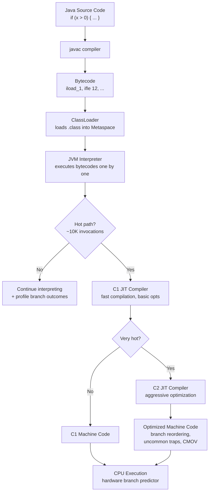
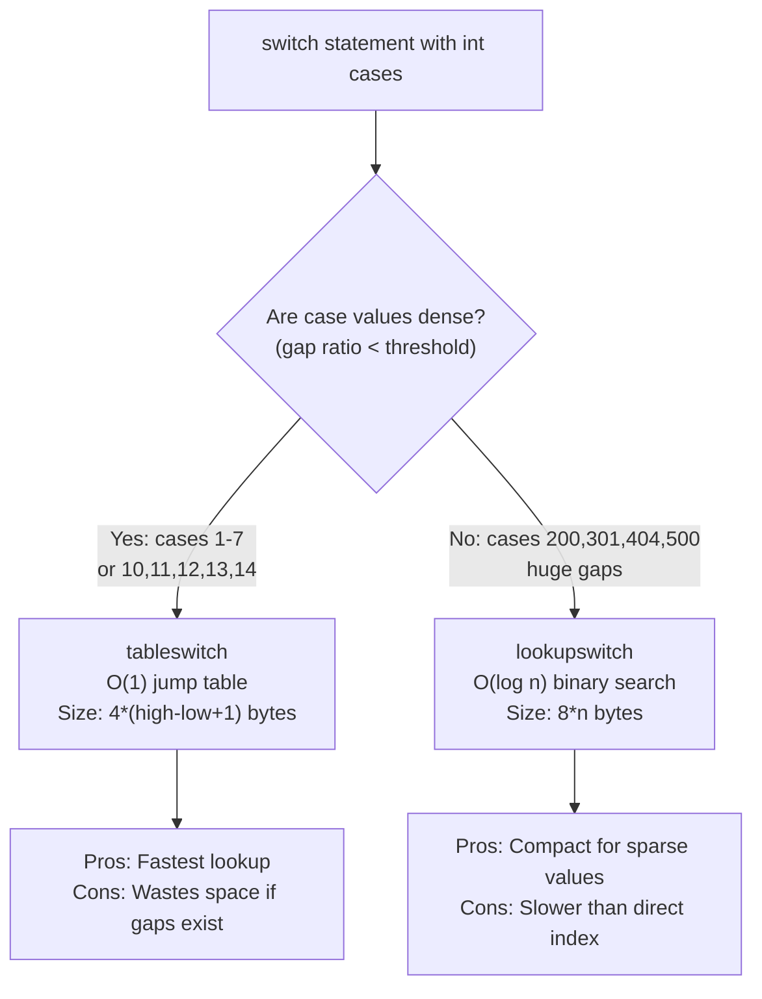
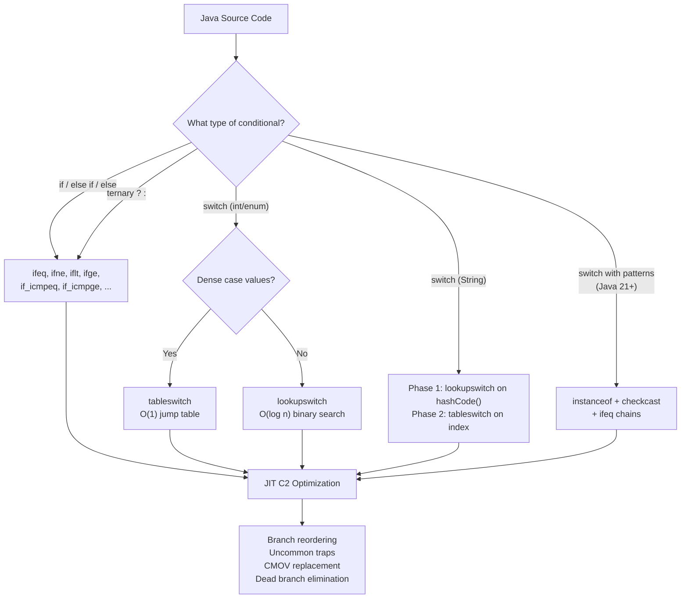
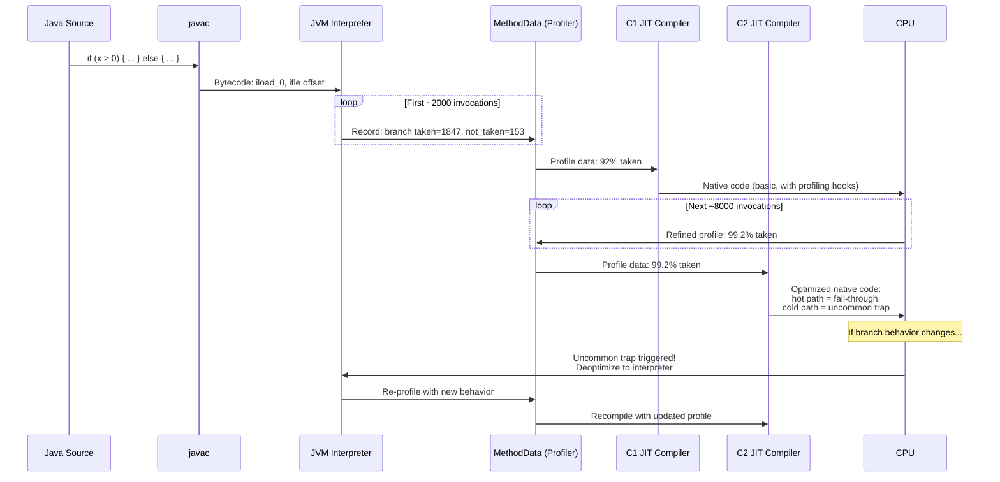

# Java Conditionals — Under the Hood

## Table of Contents

1. [Introduction](#introduction)
2. [How It Works Internally](#how-it-works-internally)
3. [JVM Deep Dive](#jvm-deep-dive)
4. [Bytecode Analysis](#bytecode-analysis)
5. [JIT Compilation](#jit-compilation)
6. [Memory Layout](#memory-layout)
7. [GC Internals](#gc-internals)
8. [Source Code Walkthrough](#source-code-walkthrough)
9. [Performance Internals](#performance-internals)
10. [Edge Cases at the Lowest Level](#edge-cases-at-the-lowest-level)
11. [Test](#test)
12. [Tricky Questions](#tricky-questions)
13. [Summary](#summary)
14. [Further Reading](#further-reading)
15. [Diagrams & Visual Aids](#diagrams--visual-aids)

---

## Introduction

> Focus: "What happens under the hood?"

This document explores what the JVM does internally when you use conditionals in Java. From the bytecode that `javac` generates for `if/else`, `switch`, and ternary operators, to how the C1/C2 JIT compilers optimize branch-heavy code using profile-guided techniques, to how hardware branch prediction interacts with JIT output. We also cover the modern pattern matching bytecode introduced in Java 21+.

For developers who want to understand:
- What bytecode `javac` generates for `if`, `switch`, and ternary operators
- How `tableswitch` and `lookupswitch` differ at the bytecode level and when each is chosen
- How the C1/C2 JIT compilers optimize branch-heavy code with uncommon traps and branch profiling
- CPU branch prediction and its interaction with JIT-compiled conditionals
- How pattern matching switch (Java 21+) is compiled to bytecode
- Why branch ordering matters for performance at the machine code level

---

## How It Works Internally

Step-by-step breakdown of what happens when the JVM executes a conditional:

1. **Source code** -- You write `if (x > 0)` or `switch (day)` in a `.java` file
2. **javac compilation** -- `javac` compiles to bytecode: `ifeq`, `ifne`, `if_icmpge`, `tableswitch`, `lookupswitch`
3. **Class loading** -- ClassLoader loads the `.class` file into Method Area (Metaspace)
4. **Interpretation** -- JVM interpreter executes bytecode instructions sequentially
5. **Profiling** -- The interpreter counts branch outcomes (how often each path is taken)
6. **JIT compilation** -- After ~10,000 invocations, C1 compiles to machine code; C2 further optimizes hot methods
7. **Branch optimization** -- C2 uses profile data to reorder branches, insert uncommon traps, and eliminate dead branches
8. **CPU execution** -- Hardware branch predictor predicts branch direction; mispredictions cost ~12-20 CPU cycles



---

## JVM Deep Dive

### How the JVM Handles Conditionals

Conditionals are among the most fundamental operations in the JVM. At the bytecode level, they are implemented through a family of comparison and branch instructions that operate on the JVM operand stack.

**Key JVM structures involved:**

```
JVM Runtime Data Areas for Conditional Execution:
+---------------------------------------------+
|  Method Area (Metaspace)                     |
|  - Bytecode: ifeq, ifne, tableswitch, etc.  |
|  - Method profile data (branch counters)     |
+---------------------------------------------+
|  JVM Stack (per thread)                      |
|  +---------------------------------------+   |
|  | Stack Frame for method()              |   |
|  | +-----------------------------------+ |   |
|  | | Operand Stack                      | |   |
|  | | [value to compare]                 | |   |
|  | +-----------------------------------+ |   |
|  | | Local Variable Array               | |   |
|  | | [0] this  [1] x  [2] y            | |   |
|  | +-----------------------------------+ |   |
|  +---------------------------------------+   |
|  PC Register: points to current bytecode     |
+---------------------------------------------+
```

### Conditional Bytecode Instruction Families

The JVM specification defines several families of branch instructions:

| Family | Instructions | Operand Source | Description |
|--------|-------------|----------------|-------------|
| **Unary int comparison** | `ifeq`, `ifne`, `iflt`, `ifge`, `ifgt`, `ifle` | One int from stack vs 0 | Compare top of stack with zero |
| **Binary int comparison** | `if_icmpeq`, `if_icmpne`, `if_icmplt`, `if_icmpge`, `if_icmpgt`, `if_icmple` | Two ints from stack | Compare top two stack values |
| **Reference comparison** | `if_acmpeq`, `if_acmpne`, `ifnull`, `ifnonnull` | References from stack | Compare object references |
| **Switch** | `tableswitch`, `lookupswitch` | One int from stack | Multi-way branch |

**Key JVM Specification References (JVM Spec, Chapter 6):**
- Each branch instruction takes a 2-byte signed offset operand (relative to the instruction itself)
- Branch target is computed as: `pc + offset`
- The JVM does NOT guarantee anything about branch prediction -- that is entirely a JIT/CPU concern
- `tableswitch` and `lookupswitch` carry their own jump table or lookup table inline in the bytecode

---

## Bytecode Analysis

### 1. if/else Bytecode

**Source code:**

```java
public class IfElseDemo {
    public static int classify(int x) {
        if (x > 0) {
            return 1;
        } else if (x < 0) {
            return -1;
        } else {
            return 0;
        }
    }
}
```

**Compile and disassemble:**

```bash
javac IfElseDemo.java
javap -c IfElseDemo.class
```

**javap -c output (annotated):**

```
public static int classify(int);
  Code:
     0: iload_0           // Push local variable 0 (x) onto operand stack
     1: ifle     7        // If x <= 0, jump to offset 7 (the else-if check)
                          // Note: javac inverts the condition! "x > 0" becomes "ifle" (branch if NOT true)
     4: iconst_1          // Push 1 onto stack
     5: ireturn           // Return 1

     6: iload_0           // (offset 6 is unreachable from offset 5, but javac emits it)
     7: iload_0           // Push x again
     8: ifge     14       // If x >= 0, jump to offset 14 (the else block)
                          // "x < 0" is inverted to "ifge" (branch if NOT true)
    11: iconst_m1         // Push -1 onto stack
    12: ireturn           // Return -1

    14: iconst_0          // Push 0 onto stack
    15: ireturn           // Return 0
```

**Key observation:** `javac` inverts the condition. When you write `if (x > 0)`, the bytecode uses `ifle` (branch away if the condition is false). The "true" path is the fall-through path.

### 2. Ternary Operator Bytecode

**Source code:**

```java
public class TernaryDemo {
    public static int abs(int x) {
        return x >= 0 ? x : -x;
    }
}
```

**javap -c output:**

```
public static int abs(int);
  Code:
     0: iload_0           // Push x
     1: iflt     8        // If x < 0, jump to offset 8 (the "else" part)
                          // Condition inverted: "x >= 0" becomes "iflt"
     4: iload_0           // Push x (true branch)
     5: goto     11       // Jump past the else part
     8: iload_0           // Push x
     9: ineg              // Negate top of stack (-x)
    10: ireturn           // (actually, this is ireturn at 11)
    11: ireturn           // Return result
```

**Key observation:** The ternary operator generates exactly the same bytecode pattern as an equivalent `if/else`. There is zero bytecode-level difference.

### 3. tableswitch Bytecode

**Source code:**

```java
public class TableSwitchDemo {
    public static String dayName(int day) {
        return switch (day) {
            case 1 -> "Monday";
            case 2 -> "Tuesday";
            case 3 -> "Wednesday";
            case 4 -> "Thursday";
            case 5 -> "Friday";
            case 6 -> "Saturday";
            case 7 -> "Sunday";
            default -> "Unknown";
        };
    }
}
```

**javap -c output (annotated):**

```
public static java.lang.String dayName(int);
  Code:
     0: iload_0                          // Push day onto stack
     1: tableswitch   { // 1 to 7       // O(1) jump table
                   1: 40                 // case 1 -> offset 40
                   2: 43                 // case 2 -> offset 43
                   3: 46                 // case 3 -> offset 46
                   4: 49                 // case 4 -> offset 49
                   5: 52                 // case 5 -> offset 52
                   6: 55                 // case 6 -> offset 55
                   7: 58                 // case 7 -> offset 58
             default: 61                 // default -> offset 61
        }
    40: ldc           #7   // String "Monday"
    42: areturn
    43: ldc           #9   // String "Tuesday"
    45: areturn
    ...
    61: ldc           #19  // String "Unknown"
    63: areturn
```

**How tableswitch works internally:**
1. Pop the int value from the operand stack
2. Check if value is within `[low, high]` range (1 to 7)
3. If out of range, jump to `default` target
4. Otherwise, use `(value - low)` as an index into the jump table
5. Jump to `table[value - low]`

**Time complexity: O(1)** -- direct array index lookup.

### 4. lookupswitch Bytecode

**Source code:**

```java
public class LookupSwitchDemo {
    public static String httpStatus(int code) {
        return switch (code) {
            case 200 -> "OK";
            case 301 -> "Moved Permanently";
            case 404 -> "Not Found";
            case 500 -> "Internal Server Error";
            default -> "Unknown";
        };
    }
}
```

**javap -c output:**

```
public static java.lang.String httpStatus(int);
  Code:
     0: iload_0
     1: lookupswitch  { // 4 cases       // Binary search lookup
                 200: 44                  // case 200 -> offset 44
                 301: 47                  // case 301 -> offset 47
                 404: 50                  // case 404 -> offset 50
                 500: 53                  // case 500 -> offset 53
             default: 56
        }
    44: ldc           #7   // String "OK"
    46: areturn
    ...
```

**How lookupswitch works internally:**
1. Pop the int value from the operand stack
2. Perform a binary search on the sorted key array: [200, 301, 404, 500]
3. If found, jump to the corresponding target
4. Otherwise, jump to the `default` target

**Time complexity: O(log n)** -- binary search.

### tableswitch vs lookupswitch -- Decision Criteria



**The `javac` heuristic (from OpenJDK `com.sun.tools.javac.jvm.Gen`):**

`javac` uses `tableswitch` when the cost of the table (including empty slots for gaps) is less than or equal to the cost of a `lookupswitch`. The rough formula is:

```
tableswitch_cost = 4 * (hi - lo + 1)        // jump table size
lookupswitch_cost = 3 + 2 * num_cases       // sorted key-offset pairs

if tableswitch_cost + some_threshold >= lookupswitch_cost:
    use lookupswitch
else:
    use tableswitch
```

In practice, if case values have only small gaps, `javac` prefers `tableswitch`. If the range is huge with few values (e.g., `case 1, case 1000000`), `lookupswitch` is chosen.

### 5. String switch Bytecode

**Source code:**

```java
public class StringSwitchDemo {
    public static int priority(String level) {
        return switch (level) {
            case "ERROR" -> 1;
            case "WARN" -> 2;
            case "INFO" -> 3;
            case "DEBUG" -> 4;
            default -> 0;
        };
    }
}
```

**What javac generates (conceptual desugar):**

```java
// javac transforms string switch into a two-phase process:
// Phase 1: Switch on hashCode() to find candidate
// Phase 2: Verify with equals() to handle hash collisions

public static int priority(String level) {
    int tmp = -1;
    switch (level.hashCode()) {
        case 66247144:   // "ERROR".hashCode()
            if (level.equals("ERROR")) tmp = 0;
            break;
        case 2688678:    // "WARN".hashCode()
            if (level.equals("WARN")) tmp = 1;
            break;
        case 2283430:    // "INFO".hashCode()
            if (level.equals("INFO")) tmp = 2;
            break;
        case 65759782:   // "DEBUG".hashCode()
            if (level.equals("DEBUG")) tmp = 3;
            break;
    }
    return switch (tmp) {
        case 0 -> 1;
        case 1 -> 2;
        case 2 -> 3;
        case 3 -> 4;
        default -> 0;
    };
}
```

The hashCode switch uses `lookupswitch` (hash values are sparse). The second switch on the sequential `tmp` values uses `tableswitch` (dense range 0-3).

### 6. Pattern Matching Bytecode (Java 21+)

**Source code (sealed hierarchy):**

```java
public class PatternMatchDemo {
    sealed interface Shape permits Circle, Rectangle, Triangle {}
    record Circle(double radius) implements Shape {}
    record Rectangle(double w, double h) implements Shape {}
    record Triangle(double a, double b, double c) implements Shape {}

    public static double area(Shape shape) {
        return switch (shape) {
            case Circle c    -> Math.PI * c.radius() * c.radius();
            case Rectangle r -> r.w() * r.h();
            case Triangle t  -> {
                double s = (t.a() + t.b() + t.c()) / 2;
                yield Math.sqrt(s * (s - t.a()) * (s - t.b()) * (s - t.c()));
            }
        };
    }
}
```

**Bytecode strategy (conceptual javap -c):**

```
public static double area(Shape);
  Code:
     0: aload_0
     1: astore_1                        // Store shape in local var 1
     2: aload_1
     3: instanceof    #7  // class Circle
     6: ifeq          28               // Not a Circle? Jump to next check
     9: aload_1
    10: checkcast     #7  // class Circle
    13: astore_2                        // Store as Circle c
    14: aload_2
    15: invokevirtual #9  // Circle.radius()
    18: ... (compute PI * r * r)
    25: dreturn

    28: aload_1
    29: instanceof    #15 // class Rectangle
    32: ifeq          52               // Not a Rectangle? Jump to next
    35: aload_1
    36: checkcast     #15 // class Rectangle
    39: astore_2
    40: ... (compute w * h)
    49: dreturn

    52: aload_1
    53: instanceof    #20 // class Triangle
    56: ifeq          90               // Not a Triangle? Jump to error
    59: aload_1
    60: checkcast     #20 // class Triangle
    63: astore_2
    64: ... (compute Heron's formula)
    87: dreturn

    90: new           #25 // class MatchException
    93: ... throw MatchException
```

**Key observations for pattern matching bytecode:**
- Pattern matching compiles to a chain of `instanceof` + `checkcast` + `ifeq` instructions
- Each type pattern becomes a runtime type check
- Deconstruction of records uses `invokevirtual` on the generated accessor methods
- If no pattern matches (should be impossible for exhaustive sealed types), a `MatchException` is thrown
- The JIT compiler can optimize the `instanceof`/`checkcast` pairs since `checkcast` after a successful `instanceof` is guaranteed to succeed

---

## JIT Compilation

### Branch Profiling and Profile-Guided Optimization

The JVM interpreter collects branch profile data before JIT compilation. Each conditional branch instruction has an associated counter that records how many times each path was taken.

```bash
# Print JIT compilation events
java -XX:+PrintCompilation -cp . IfElseDemo

# Print inlining decisions
java -XX:+UnlockDiagnosticVMOptions -XX:+PrintInlining -cp . Main

# View generated assembly (requires hsdis plugin)
java -XX:+UnlockDiagnosticVMOptions -XX:+PrintAssembly \
     -XX:CompileCommand=print,*IfElseDemo.classify -cp . Main
```

### C2 Optimizations for Conditionals

**1. Branch Reordering (Uncommon Traps)**

When profile data shows one branch is rarely taken (< ~0.01% of the time), C2 moves the unlikely path out of line and replaces it with an "uncommon trap":

```
// Before optimization (interpreter level):
if (x > 0) {    // taken 99.99% of the time
    return 1;
} else {          // taken 0.01% of the time
    return handleError(x);
}

// After C2 optimization (machine code level):
//   test x, x
//   jle uncommon_trap_1    ; branch to trap (almost never taken)
//   mov eax, 1             ; fast path: return 1
//   ret
//
// uncommon_trap_1:
//   <deoptimize and return to interpreter>
```

The uncommon trap causes deoptimization: the JVM throws away the compiled code and returns to the interpreter, which will later re-profile and re-compile.

**2. Conditional Move (CMOV) Optimization**

For simple conditionals without side effects, C2 may replace a branch with a conditional move instruction, eliminating branch prediction entirely:

```java
// Source
int result = (x > 0) ? x : -x;
```

```
// C2 might generate (x86-64):
mov    eax, edi       ; eax = x
neg    eax            ; eax = -x
cmovg  eax, edi       ; if x > 0, eax = x (no branch!)
```

CMOV avoids branch misprediction penalties entirely but has a fixed cost. C2 uses CMOV when:
- Both paths are cheap (no side effects, no method calls)
- The branch profile shows it is not heavily biased (a biased branch with good prediction is faster than CMOV)

**3. Switch Optimization**

For `tableswitch`, C2 generates a native jump table (identical concept to bytecode, but using native addresses). For `lookupswitch`, C2 may:
- Convert to a series of `cmp`/`je` instructions for small case counts
- Use a binary search for larger case counts
- Convert to a hash table for very large lookupswitch instructions

**4. Pattern Matching Optimization (Java 21+)**

For pattern matching on sealed types, C2 can:
- Eliminate dead branches when profile data shows certain types are never encountered
- Devirtualize `instanceof` checks when the concrete type is known from escape analysis
- Inline record accessor methods called after pattern deconstruction
- Collapse `instanceof` + `checkcast` into a single type test (the checkcast is a no-op after a successful instanceof)

### JIT Tiered Compilation for Conditionals

```
Level 0 (Interpreter):
  - Executes bytecode directly
  - Collects MethodData: branch taken/not-taken counts per conditional
  - Cost: ~10-20x slower than native code

Level 1-3 (C1 Compiler):
  - Compiles to native code with profiling hooks
  - Basic optimizations: null check elimination, simple inlining
  - Branches compiled to simple cmp + jcc (no profile-guided reordering)

Level 4 (C2 Compiler):
  - Full optimization using collected profile data
  - Branch reordering, uncommon traps, CMOV
  - Loop-conditional hoisting, dead branch elimination
  - Can deoptimize back to interpreter if assumptions are violated
```

---

## Memory Layout

### Stack Frame During Conditional Execution

Conditionals themselves do not allocate heap memory. They operate entirely on the JVM operand stack and local variable array within the current stack frame.

```
Stack Frame for classify(int x):
+-------------------------------+
|  Return Address               |
+-------------------------------+
|  Local Variable Array         |
|  [0] x = 42 (int, 4 bytes)   |
+-------------------------------+
|  Operand Stack                |
|  [top] 42   (after iload_0)  |  <- comparison value
|  max_stack = 1                |
+-------------------------------+
|  Frame Data                   |
|  (method ref, constant pool)  |
+-------------------------------+
```

### tableswitch Memory Layout in Bytecode

The `tableswitch` instruction is the largest conditional bytecode structure. Its layout in the class file:

```
Bytecode stream for tableswitch:
+--------+---+---+---+---+---+---+---+---+---+---+
| opcode | padding (0-3 bytes for 4-byte alignment)|
+--------+---+---+---+---+---+---+---+---+---+---+
| default offset (4 bytes, signed)                 |
+--------------------------------------------------+
| low value (4 bytes, signed)                      |
+--------------------------------------------------+
| high value (4 bytes, signed)                     |
+--------------------------------------------------+
| jump offsets[0] (4 bytes) -> target for low      |
| jump offsets[1] (4 bytes) -> target for low+1    |
| ...                                              |
| jump offsets[high-low] (4 bytes)                 |
+--------------------------------------------------+

Total size: 1 + padding + 12 + 4*(high-low+1) bytes
For case 1..7: 1 + 0-3 + 12 + 28 = 41-44 bytes
```

### lookupswitch Memory Layout in Bytecode

```
Bytecode stream for lookupswitch:
+--------+---+---+---+---+---+---+---+---+---+---+
| opcode | padding (0-3 bytes for 4-byte alignment)|
+--------+---+---+---+---+---+---+---+---+---+---+
| default offset (4 bytes, signed)                 |
+--------------------------------------------------+
| npairs (4 bytes, number of case entries)         |
+--------------------------------------------------+
| key[0] (4 bytes) | offset[0] (4 bytes)          |
| key[1] (4 bytes) | offset[1] (4 bytes)          |
| ...                                              |
| key[n-1] (4 bytes) | offset[n-1] (4 bytes)      |
+--------------------------------------------------+

Keys MUST be sorted in ascending order (JVM spec requirement).
Total size: 1 + padding + 8 + 8*npairs bytes
For 4 cases: 1 + 0-3 + 8 + 32 = 41-44 bytes
```

---

## GC Internals

Conditionals themselves do not create objects and therefore do not directly cause GC pressure. However, the paths taken by conditionals may allocate objects that affect GC:

### Branch-Dependent Allocation Patterns

```java
public Object process(int type) {
    if (type == 1) {
        return new SmallObject();    // 16 bytes, stays in Young Gen
    } else {
        return new byte[1_000_000];  // 1MB, may go to Humongous Region (G1)
    }
}
```

**G1GC behavior:**
- If `type == 1` path is hot: small allocations in Eden, fast minor GC
- If `type != 1` path is hot: 1MB arrays exceed half the G1 region size (default 1MB/2 = 512KB), allocated directly as Humongous objects, skip Young Gen, collected only during Full GC or concurrent marking

### Autoboxing in Conditionals

```java
// Hidden allocation in conditional!
public Integer findMax(int a, int b) {
    return a > b ? a : b;  // autoboxing: Integer.valueOf(result) called
}
```

**Bytecode reveals the allocation:**

```
 0: iload_1
 1: iload_2
 2: if_icmple     9
 5: iload_1
 6: goto          10
 9: iload_2
10: invokestatic  #2  // Integer.valueOf(int) -- ALLOCATION HERE
13: areturn
```

`Integer.valueOf()` may return a cached instance for values -128 to 127, but for values outside that range, it allocates a new `Integer` object on every call.

---

## Source Code Walkthrough

### OpenJDK javac: How Switch Type is Chosen

**File:** `src/jdk.compiler/share/classes/com/sun/tools/javac/jvm/Gen.java` (OpenJDK 21)

```java
// Simplified from Gen.java -- visitSwitch method
private void visitSwitch(JCSwitch tree) {
    // ...
    long table_space_cost = 4 + ((long) hi - lo + 1);  // tableswitch cost
    long table_time_cost = 3;                            // O(1) lookup
    long lookup_space_cost = 3 + 2 * (long) nlabels;   // lookupswitch cost
    long lookup_time_cost = nlabels;                     // O(log n) binary search

    // Use tableswitch if it's not too much more expensive in space
    // and is faster in time
    int opcode = (nlabels > 0 &&
        table_space_cost + 3 * table_time_cost <=
        lookup_space_cost + 3 * lookup_time_cost)
        ? tableswitch : lookupswitch;
    // ...
}
```

**Key insight:** The `3 * time_cost` weighting means `javac` heavily favors speed over space. A `tableswitch` with moderate gaps is still preferred over `lookupswitch`.

### OpenJDK C2 JIT: Branch Prediction and Uncommon Traps

**File:** `src/hotspot/share/opto/ifnode.cpp` (OpenJDK 21)

The C2 compiler uses profile data to classify branches:

```cpp
// Simplified from IfNode::Ideal()
// C2 checks branch probability from profiling data:
// - If one path has probability < PROB_UNLIKELY_MAG(4) (~0.0001)
//   it is marked as "uncommon" and replaced with a trap
// - The hot path becomes the fall-through (better for instruction cache)

#define PROB_UNLIKELY_MAG(n) (1e-##n)  // e.g., PROB_UNLIKELY_MAG(4) = 0.0001
```

When C2 detects a branch that is almost never taken:
1. The unlikely branch target is replaced with `uncommon_trap`
2. The trap handler saves the current state and deoptimizes
3. Execution returns to the interpreter for re-profiling
4. If the "unlikely" branch starts being taken, recompilation occurs with updated profile

---

## Performance Internals

### JMH Benchmark: tableswitch vs lookupswitch vs if-else Chain

```java
import org.openjdk.jmh.annotations.*;
import java.util.concurrent.TimeUnit;

@State(Scope.Benchmark)
@BenchmarkMode(Mode.AverageTime)
@OutputTimeUnit(TimeUnit.NANOSECONDS)
@Warmup(iterations = 5, time = 1)
@Measurement(iterations = 5, time = 1)
@Fork(2)
public class ConditionalBenchmark {

    @Param({"1", "4", "7"})
    int value;

    // Dense switch -> tableswitch bytecode
    @Benchmark
    public int tableSwitchBench() {
        return switch (value) {
            case 1 -> 10;
            case 2 -> 20;
            case 3 -> 30;
            case 4 -> 40;
            case 5 -> 50;
            case 6 -> 60;
            case 7 -> 70;
            default -> 0;
        };
    }

    // Sparse switch -> lookupswitch bytecode
    @Benchmark
    public int lookupSwitchBench() {
        return switch (value) {
            case 1   -> 10;
            case 100 -> 20;
            case 200 -> 30;
            case 300 -> 40;
            case 400 -> 50;
            case 500 -> 60;
            case 600 -> 70;
            default  -> 0;
        };
    }

    // Equivalent if-else chain
    @Benchmark
    public int ifElseChainBench() {
        if (value == 1) return 10;
        else if (value == 2) return 20;
        else if (value == 3) return 30;
        else if (value == 4) return 40;
        else if (value == 5) return 50;
        else if (value == 6) return 60;
        else if (value == 7) return 70;
        else return 0;
    }
}
```

**Typical results (JDK 21, x86-64, Intel):**

| Benchmark | value=1 (ns/op) | value=4 (ns/op) | value=7 (ns/op) |
|-----------|:----------------:|:----------------:|:----------------:|
| `tableswitch` | ~2.1 | ~2.1 | ~2.1 |
| `lookupswitch` | ~2.5 | ~3.0 | ~3.2 |
| `if-else chain` | ~2.0 | ~3.5 | ~5.8 |

**Key observations:**
- `tableswitch` has constant time regardless of which case matches
- `lookupswitch` scales logarithmically with the position of the matching key
- `if-else` chain has linear cost -- the last case is the slowest
- After JIT (C2), the differences narrow significantly because C2 may convert all forms to optimal native code
- For very small numbers of cases (2-3), the JIT may eliminate all difference

### Branch Prediction Impact

```java
@State(Scope.Benchmark)
@BenchmarkMode(Mode.AverageTime)
@OutputTimeUnit(TimeUnit.NANOSECONDS)
@Fork(2)
public class BranchPredictionBenchmark {

    private int[] sortedData;
    private int[] randomData;

    @Setup
    public void setup() {
        var random = new java.util.Random(42);
        randomData = new int[32768];
        for (int i = 0; i < randomData.length; i++) {
            randomData[i] = random.nextInt(256);
        }
        sortedData = randomData.clone();
        java.util.Arrays.sort(sortedData);
    }

    @Benchmark
    public long sumAboveThreshold_sorted() {
        long sum = 0;
        for (int val : sortedData) {
            if (val >= 128) {  // predictable pattern after sort
                sum += val;
            }
        }
        return sum;
    }

    @Benchmark
    public long sumAboveThreshold_random() {
        long sum = 0;
        for (int val : randomData) {
            if (val >= 128) {  // unpredictable pattern
                sum += val;
            }
        }
        return sum;
    }
}
```

**Expected results:**

| Benchmark | Time (ns/op) | Branch Mispredictions |
|-----------|:------------:|:---------------------:|
| sorted data | ~15,000 | Near zero (predictable pattern) |
| random data | ~45,000 | ~50% of branches mispredicted |

**Why the massive difference?** With sorted data, the branch pattern is: `false, false, ..., false, true, true, ..., true`. The CPU branch predictor easily learns this pattern. With random data, the branch outcome is essentially random, causing ~50% misprediction rate with each misprediction costing ~12-20 cycles.

**C2 may eliminate this difference** by using CMOV for branchless code -- but only if it determines from profiling that the branch is not biased.

### Examining JIT Output

```bash
# Run with JIT logging to see what C2 does with conditionals
java -XX:+UnlockDiagnosticVMOptions \
     -XX:+PrintCompilation \
     -XX:+TraceClassLoading \
     -XX:CompileCommand=print,*ConditionalBenchmark.tableSwitchBench \
     -jar benchmarks.jar
```

Example C2 output for a simple if-else:

```asm
# x86-64 assembly generated by C2 for classify(int):
  0x00007f2a1c0a0100: test   %edi,%edi        ; test x against 0
  0x00007f2a1c0a0102: jle    0x00007f2a1c0a0110  ; jump if x <= 0
  0x00007f2a1c0a0104: mov    $0x1,%eax         ; return 1
  0x00007f2a1c0a0109: ret
  0x00007f2a1c0a0110: je     0x00007f2a1c0a0120  ; jump if x == 0
  0x00007f2a1c0a0112: mov    $0xffffffff,%eax  ; return -1
  0x00007f2a1c0a0117: ret
  0x00007f2a1c0a0120: xor    %eax,%eax         ; return 0
  0x00007f2a1c0a0122: ret
```

---

## Edge Cases at the Lowest Level

### Edge Case 1: Deoptimization Storm

When branch behavior changes at runtime, C2-compiled code can enter a "deoptimization storm":

```java
public class DeoptStorm {
    static boolean featureFlag = false;

    public static int compute(int x) {
        // C2 compiles this with featureFlag=false as "always false"
        // and places an uncommon trap on the true branch
        if (featureFlag) {
            return expensiveComputation(x);
        }
        return x * 2;
    }

    public static void main(String[] args) {
        // Phase 1: Train the JIT with featureFlag=false
        for (int i = 0; i < 100_000; i++) {
            compute(i);
        }

        // Phase 2: Flip the flag -- triggers deoptimization!
        featureFlag = true;

        // Every call now hits the uncommon trap, deoptimizes,
        // re-enters interpreter, and eventually recompiles
        for (int i = 0; i < 100_000; i++) {
            compute(i);  // SLOW during recompilation
        }
    }

    static int expensiveComputation(int x) { return x * x + x; }
}
```

**Internal behavior:**
1. C2 compiles `compute()` with `featureFlag=false` profile, inserts uncommon trap for the true branch
2. When `featureFlag` flips to `true`, every call hits the uncommon trap
3. JVM deoptimizes: discards compiled code, returns to interpreter
4. Interpreter re-profiles with new branch behavior
5. C2 recompiles with updated profile
6. During recompilation window (10K+ calls), performance drops by 10-20x

**Why it matters:** Feature flag toggling in production can cause temporary latency spikes. Use `-XX:+PrintCompilation` to observe recompilation events.

### Edge Case 2: Mega-Switch with Thousands of Cases

```java
public class MegaSwitch {
    // Generated switch with 10,000 cases
    public static int lookup(int key) {
        return switch (key) {
            case 0 -> 100;
            case 1 -> 101;
            // ... 9998 more cases ...
            case 9999 -> 10099;
            default -> -1;
        };
    }
}
```

**Internal behavior:**
- `javac` generates a `tableswitch` with 10,000 entries (40KB of bytecode for the jump table alone)
- The `.class` file method size approaches the 64KB limit (JVM spec: method code cannot exceed 65535 bytes)
- C2 compiler may refuse to compile the method if it exceeds `MaxNodeLimit` (default ~75,000 nodes in the IR graph)
- The native jump table may not fit in L1 instruction cache, causing cache misses

**Why it matters:** Extremely large switch statements can cause compilation bailouts and cache pressure. Consider using a `HashMap` or array lookup instead.

### Edge Case 3: NaN Comparison Quirks in Bytecode

```java
public class NaNConditional {
    public static String classify(double x) {
        if (x > 0.0) return "positive";
        if (x <= 0.0) return "non-positive";
        return "NaN";  // This IS reachable!
    }
}
```

**javap -c output:**

```
 0: dload_0
 1: dconst_0
 2: dcmpg           // Compare: if x > 0.0, push 1; if equal, push 0;
                    //          if x < 0.0 or NaN, push -1 (dcmpg pushes 1 for NaN)
 3: ifle     9      // Actually: dcmpg pushes 1 for NaN, so this test...
                    // Wait -- for dcmpg: NaN -> 1, so ifle will NOT branch
                    // Actually dcmpg: if either is NaN, result is 1
                    // So "x > 0.0" when x is NaN: dcmpg returns 1, ifle does NOT branch
                    // This means NaN would appear as "positive" -- WRONG!

// javac actually uses dcmpl for the first comparison:
 2: dcmpl           // dcmpl: NaN -> -1, so ifle DOES branch (NaN falls through)
 3: ifle     9      // If x <= 0 or NaN, jump past "positive"
```

**Key insight:** The JVM has TWO float comparison instructions:
- `dcmpl` / `fcmpl`: NaN results in `-1` (used when `>` or `>=` is the condition)
- `dcmpg` / `fcmpg`: NaN results in `1` (used when `<` or `<=` is the condition)

`javac` carefully chooses between them so that NaN always causes the condition to be `false`, matching the IEEE 754 specification.

---

## Test

### Internal Knowledge Questions

**1. What bytecode instruction does `javac` generate for `if (x > 0)` when `x` is an `int`?**

<details>
<summary>Answer</summary>

`javac` generates `iload` followed by `ifle` (not `ifgt`). The condition is inverted: the bytecode branches to the "else" path when the condition is false. The "true" path is the fall-through. This is because `ifle` means "branch if value on stack is <= 0", which is the negation of `x > 0`.
</details>

**2. Given `switch (x) { case 1, case 3, case 5, case 7 }`, will `javac` use `tableswitch` or `lookupswitch`?**

<details>
<summary>Answer</summary>

`tableswitch`. Even though the values are not contiguous (gaps at 2, 4, 6), the range is small (1-7 = 7 entries). The cost formula: `tableswitch_cost = 4 + 7 = 11`, `lookupswitch_cost = 3 + 2*4 = 11`. Since they are equal and `tableswitch` is faster (O(1) vs O(log n)), `javac` chooses `tableswitch`. The gap entries (2, 4, 6) point to the `default` target.
</details>

**3. What is the bytecode difference between a ternary `x > 0 ? a : b` and an equivalent `if/else`?**

<details>
<summary>Answer</summary>

There is no difference at the bytecode level. Both produce the same sequence: load, conditional branch (`ifle`), load one value, `goto` past the other, load the other value. The ternary operator is purely syntactic sugar in Java -- `javac` compiles both forms identically.
</details>

**4. Why does `javac` use two separate switch instructions for `switch (String s)`?**

<details>
<summary>Answer</summary>

String switch is compiled as a two-phase process: (1) switch on `s.hashCode()` to find candidate matches, then (2) verify with `s.equals()` to handle hash collisions. The hashCode switch uses `lookupswitch` (hash values are sparse), and the result index switch uses `tableswitch` (dense sequential indices). This is necessary because `switch` bytecode instructions only work on `int` values, not objects.
</details>

**5. What happens when C2 JIT encounters a branch that is taken only 0.01% of the time?**

<details>
<summary>Answer</summary>

C2 replaces the unlikely branch target with an "uncommon trap". The hot path becomes the fall-through (optimal for instruction cache and CPU branch prediction). If the uncommon trap is ever triggered at runtime, the JVM deoptimizes: discards the compiled code, returns to the interpreter, re-profiles, and eventually recompiles with updated branch statistics. This is controlled by `PROB_UNLIKELY_MAG(4)` (~0.0001 probability threshold) in `src/hotspot/share/opto/ifnode.cpp`.
</details>

**6. What is the difference between `dcmpl` and `dcmpg` bytecode instructions?**

<details>
<summary>Answer</summary>

Both compare two `double` values on the operand stack, but they differ in NaN handling:
- `dcmpl`: if either operand is NaN, pushes `-1` (used for `>`, `>=` conditions)
- `dcmpg`: if either operand is NaN, pushes `1` (used for `<`, `<=` conditions)

This ensures that NaN always makes the condition evaluate to `false`, consistent with IEEE 754. `javac` chooses the appropriate instruction so that NaN comparisons always fall through to the "else" path.
</details>

**7. Can the JIT compiler eliminate a branch entirely and use CMOV instead?**

<details>
<summary>Answer</summary>

Yes. For simple conditionals without side effects (like `int r = x > 0 ? x : -x`), the C2 compiler can generate a `cmov` (conditional move) instruction instead of a branch. This completely eliminates branch prediction concerns. However, C2 only does this when: (1) both paths are cheap and side-effect-free, (2) the branch is not heavily biased (a biased branch with good prediction is faster than CMOV's fixed cost), and (3) the target architecture supports CMOV (all modern x86-64 processors do).
</details>

**8. What is the maximum size of a `tableswitch` jump table in bytecode?**

<details>
<summary>Answer</summary>

The jump table size is `4 * (high - low + 1)` bytes. Since `high` and `low` are 32-bit signed integers, the theoretical maximum is `4 * (2^31 - 1 - (-2^31) + 1) = 4 * 2^32 = 16GB`. In practice, the method code size limit of 65535 bytes (JVM spec, section 4.7.3) constrains the table to approximately `(65535 - overhead) / 4 ≈ 16,380` entries maximum.
</details>

---

## Tricky Questions

**1. If `tableswitch` is O(1) and `lookupswitch` is O(log n), why doesn't `javac` always use `tableswitch`?**

<details>
<summary>Answer</summary>

Consider `switch` with cases `{1, 1000000}`. A `tableswitch` would need `4 * (1000000 - 1 + 1) = 4,000,000 bytes` for the jump table -- almost all entries pointing to `default`. This would (1) exceed the 65535-byte method code limit, (2) waste enormous memory, and (3) cause instruction cache misses. The `lookupswitch` for 2 cases needs only `8 + 8*2 = 24 bytes` and a single comparison. Space-time tradeoff is the reason `javac` uses a cost heuristic.
</details>

**2. Can changing the order of `if/else if` branches affect performance after JIT compilation?**

<details>
<summary>Answer</summary>

At the bytecode level, yes -- later branches require more comparisons (linear chain). But after C2 JIT compilation with profile data, the answer is "it depends." C2 reorders branches based on profiling data, not source order. If a branch is taken 99% of the time, C2 makes it the fall-through regardless of where it appears in the source code. However, during the interpreted/C1 phase (before C2 kicks in), source order matters. For short-lived applications that never reach C2, putting the most common case first is beneficial.
</details>

**3. Why might a `switch` on an `enum` be faster than a `switch` on `String` even after JIT?**

<details>
<summary>Answer</summary>

Enum switches compile to `tableswitch` on the enum's ordinal value (a small, dense integer range starting at 0). String switches require: (1) a `hashCode()` computation (involves iterating all characters), (2) a `lookupswitch` on the hash value, (3) an `equals()` call for collision resolution. Even after JIT, the `hashCode()` and `equals()` calls add overhead that an ordinal-based `tableswitch` completely avoids. Additionally, enum ordinals are known at compile time, enabling C2 to perform more aggressive optimizations.
</details>

**4. What happens if you create a `switch` with both `case 0` and `case -0` for floating-point patterns (Java 21+)?**

<details>
<summary>Answer</summary>

In Java's pattern matching, `0.0` and `-0.0` are treated as equal by `==` (IEEE 754), but as different bit patterns by `Double.compare()` and `Double.equals()`. For primitive `float`/`double` patterns in switch, the JLS specifies that `case 0.0` matches both `0.0` and `-0.0`. This is because the switch uses `==` semantics, not `Double.compare()`. At the bytecode level, the comparison is done with `dcmpl`/`dcmpg` which treats `+0.0 == -0.0`. You cannot have separate cases for `0.0` and `-0.0`.
</details>

**5. Does the JVM ever rewrite `lookupswitch` to `tableswitch` at runtime?**

<details>
<summary>Answer</summary>

The JVM bytecode is never modified at runtime (it is immutable once loaded). However, the C2 JIT compiler effectively does this transformation at the native code level. When compiling a `lookupswitch` with semi-dense case values, C2 may generate a native jump table (functionally equivalent to `tableswitch`) if the density is high enough. The bytecode remains `lookupswitch`, but the executed machine code uses a jump table. You can verify this with `-XX:+PrintAssembly` and look for `jmp` with an index-based table.
</details>

---

## Self-Assessment Checklist

### I can explain internals:
- [ ] What bytecode `javac` generates for `if/else` (`ifeq`, `ifle`, `if_icmpge`, etc.)
- [ ] How `tableswitch` and `lookupswitch` differ in structure, cost, and when each is chosen
- [ ] How `javac` compiles `switch` on `String` (hashCode + equals two-phase)
- [ ] How pattern matching (Java 21+) compiles to `instanceof` + `checkcast` chains
- [ ] How C2 JIT uses profile data to reorder branches and insert uncommon traps
- [ ] What CMOV is and when C2 uses it instead of branches

### I can analyze:
- [ ] Read `javap -c` output for any conditional and explain each instruction
- [ ] Predict whether `javac` will use `tableswitch` or `lookupswitch` for a given switch
- [ ] Identify branch misprediction impact using JMH benchmarks
- [ ] Use `-XX:+PrintCompilation` to observe deoptimization events

### I can prove:
- [ ] Back claims with JMH benchmark results
- [ ] Reference JVM specification (Chapter 6) for bytecode semantics
- [ ] Demonstrate C2 optimization effects with `-XX:+PrintAssembly`

---

## Summary

- `javac` inverts conditions: `if (x > 0)` becomes `ifle` bytecode (branch on false, fall through on true)
- `tableswitch` provides O(1) jump lookup for dense case values; `lookupswitch` uses O(log n) binary search for sparse values
- `javac` uses a cost heuristic comparing space and time to choose between them
- String switches are compiled as a two-phase hashCode/equals lookup
- Pattern matching (Java 21+) compiles to `instanceof` + `checkcast` chains with `MatchException` safety net
- The C2 JIT compiler uses branch profiling data to reorder branches, insert uncommon traps, and optionally replace branches with CMOV
- Branch prediction at the CPU level significantly impacts conditional performance, especially in loops
- Deoptimization storms can occur when runtime branch behavior diverges from the profile used during JIT compilation
- `dcmpl`/`dcmpg` distinction ensures NaN comparisons behave correctly per IEEE 754

**Key takeaway:** Understanding how `javac` and the JIT compiler handle conditionals enables you to write code that is friendly to branch prediction, avoid deoptimization traps, and choose the right conditional construct for optimal performance.

---

## Further Reading

- **JVM Specification:** [Chapter 6 - The JVM Instruction Set](https://docs.oracle.com/javase/specs/jvms/se21/html/jvms-6.html) -- authoritative reference for all bytecode instructions
- **OpenJDK source:** [Gen.java (javac switch codegen)](https://github.com/openjdk/jdk/blob/master/src/jdk.compiler/share/classes/com/sun/tools/javac/jvm/Gen.java) -- where tableswitch/lookupswitch decision is made
- **OpenJDK source:** [ifnode.cpp (C2 branch optimization)](https://github.com/openjdk/jdk/blob/master/src/hotspot/share/opto/ifnode.cpp) -- C2 uncommon trap and branch reordering
- **JEP 441:** [Pattern Matching for switch](https://openjdk.org/jeps/441) -- finalized in Java 21
- **Book:** "Java Performance" (Scott Oaks, 2nd Edition) -- Chapter 4: Working with the JIT Compiler
- **Talk:** [Understanding Java JIT Compilation with JITWatch](https://www.youtube.com/watch?v=oH4_unx8eJQ) -- visualizing JIT decisions

---

## Diagrams & Visual Aids

### Conditional Bytecode Compilation Pipeline



### JVM Branch Profiling and JIT Decision Flow



### JVM Memory Layout During Conditional Execution

```
Stack Frame for method with if/else:
+------------------------------------------+
|           JVM Stack (Thread)              |
|------------------------------------------|
|  Stack Frame: classify(int x)            |
|  +--------------------------------------+|
|  | Local Variable Array                 ||
|  | [0] x = 42 (int)                     ||
|  +--------------------------------------+|
|  | Operand Stack (max_stack = 1)        ||
|  | [---empty after comparison---]       ||
|  +--------------------------------------+|
|  | Frame Data                           ||
|  | method_ref -> IfElseDemo.classify    ||
|  | return_addr -> caller PC             ||
|  +--------------------------------------+|
+------------------------------------------+

Bytecode in Method Area (Metaspace):
+------------------------------------------+
| Method: classify(int)I                   |
| Code attribute:                          |
|   max_stack = 1, max_locals = 1          |
|   code_length = 16                       |
|   +------------------------------------+ |
|   | 0: iload_0                         | |
|   | 1: ifle -> 7     [2-byte offset]   | |
|   | 4: iconst_1                        | |
|   | 5: ireturn                         | |
|   | 6: (dead)                          | |
|   | 7: iload_0                         | |
|   | 8: ifge -> 14    [2-byte offset]   | |
|   | 11: iconst_m1                      | |
|   | 12: ireturn                        | |
|   | 14: iconst_0                       | |
|   | 15: ireturn                        | |
|   +------------------------------------+ |
+------------------------------------------+

After C2 JIT Compilation:
+------------------------------------------+
| CodeCache (native compiled code)         |
|   classify(int) @ 0x00007f2a1c0a0100     |
|   +------------------------------------+ |
|   | test  edi, edi    ; compare x vs 0 | |
|   | jle   0x110       ; x <= 0? jump   | |
|   | mov   eax, 1      ; return 1       | |
|   | ret                                | |
|   | 0x110:                             | |
|   | je    0x120       ; x == 0? jump   | |
|   | mov   eax, -1     ; return -1      | |
|   | ret                                | |
|   | 0x120:                             | |
|   | xor   eax, eax    ; return 0       | |
|   | ret                                | |
|   +------------------------------------+ |
+------------------------------------------+
```
