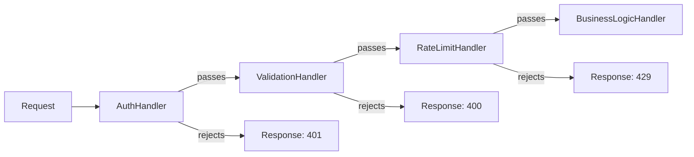
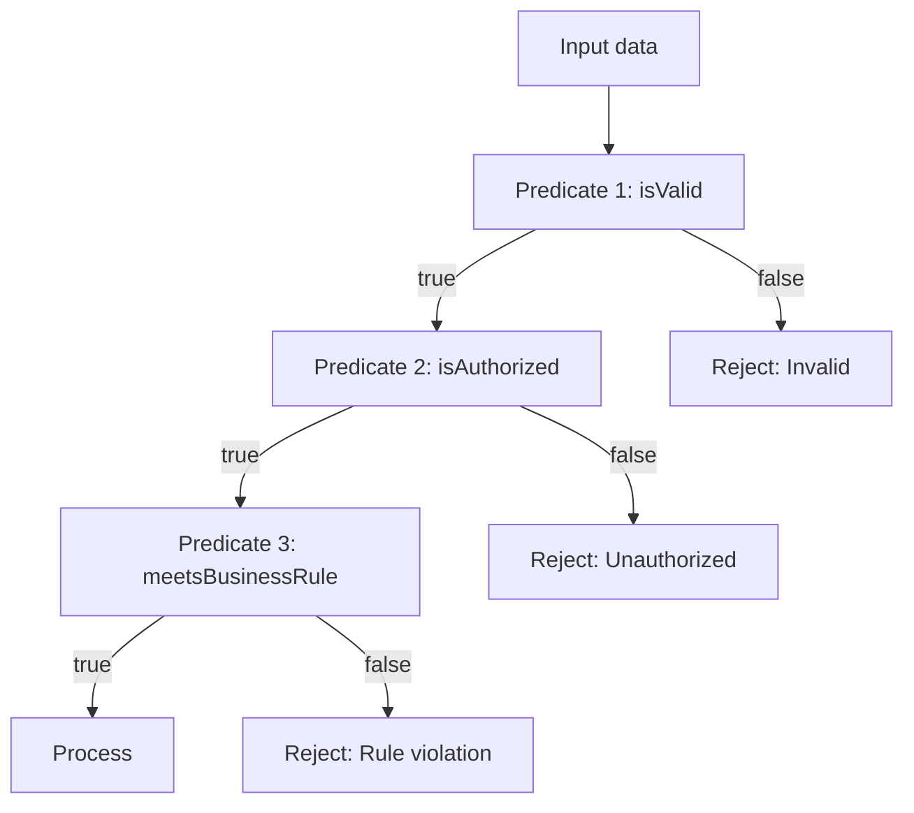
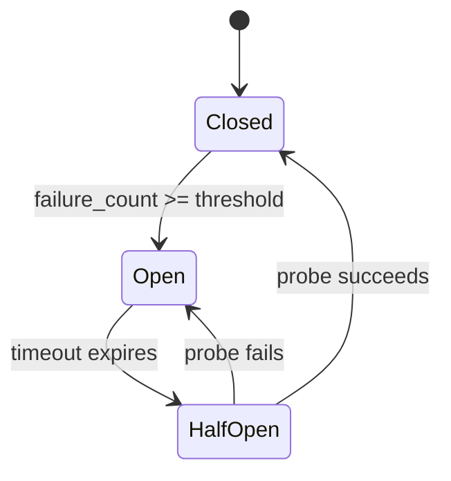
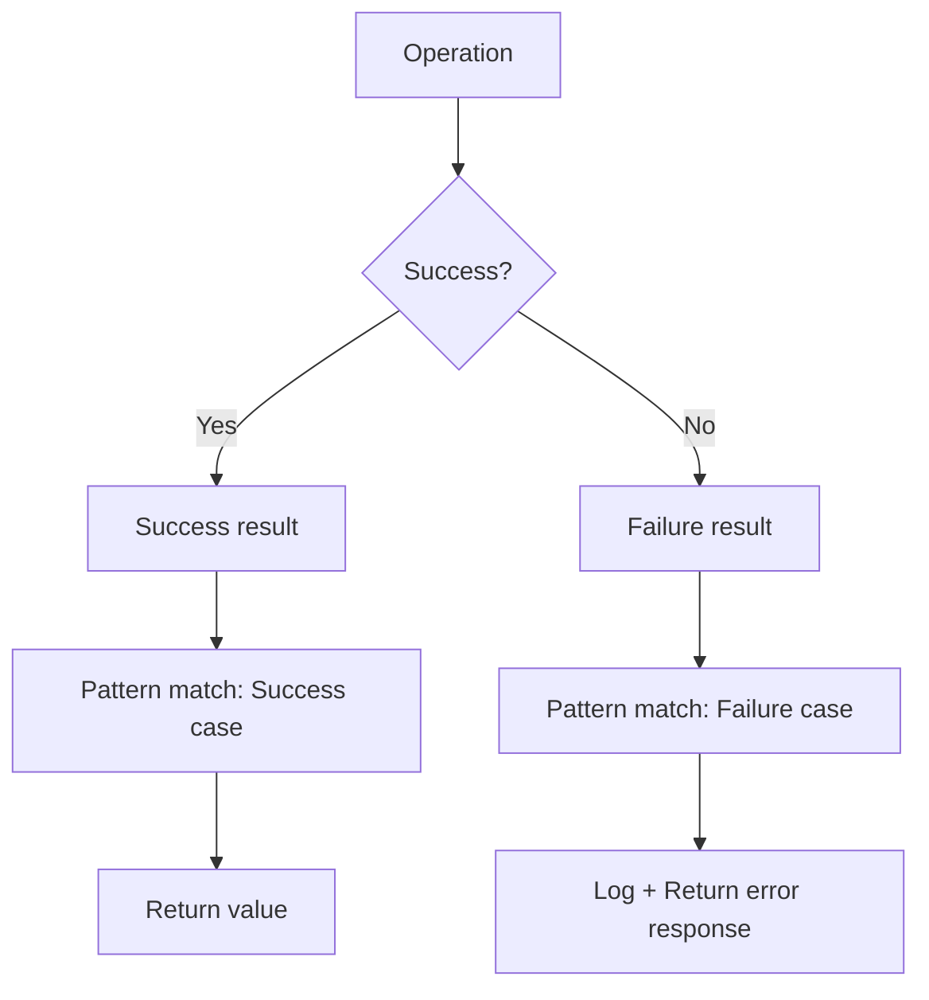
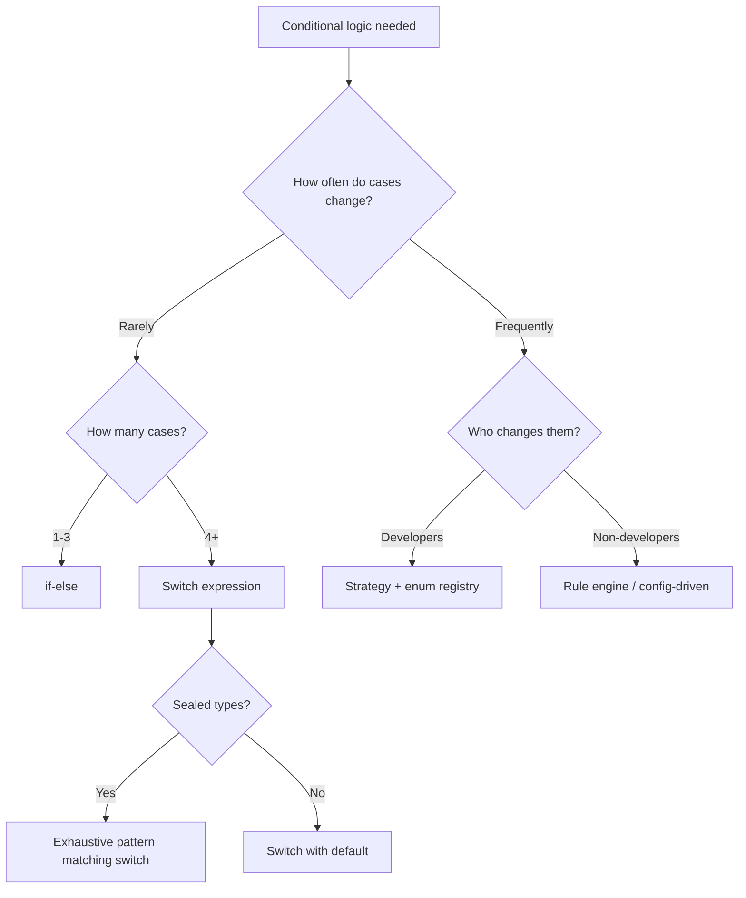
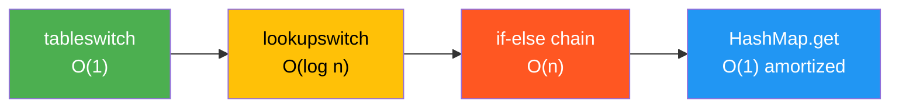
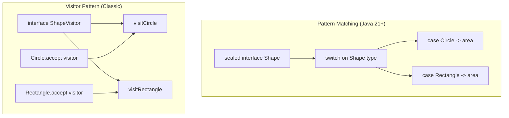

# Java Conditionals — Senior Level

## Table of Contents

1. [Introduction](#introduction)
2. [Core Concepts](#core-concepts)
3. [Pros & Cons](#pros--cons)
4. [Use Cases](#use-cases)
5. [Code Examples](#code-examples)
6. [Coding Patterns](#coding-patterns)
7. [Product Use / Feature](#product-use--feature)
8. [Error Handling](#error-handling)
9. [Security Considerations](#security-considerations)
10. [Performance Optimization](#performance-optimization)
11. [Debugging Guide](#debugging-guide)
12. [Best Practices](#best-practices)
13. [Edge Cases & Pitfalls](#edge-cases--pitfalls)
14. [Postmortems & System Failures](#postmortems--system-failures)
15. [Common Mistakes](#common-mistakes)
16. [Tricky Points](#tricky-points)
17. [Comparison with Other Languages](#comparison-with-other-languages)
18. [Test](#test)
19. [Tricky Questions](#tricky-questions)
20. [Cheat Sheet](#cheat-sheet)
21. [Summary](#summary)
22. [Further Reading](#further-reading)
23. [Diagrams & Visual Aids](#diagrams--visual-aids)

---

## Introduction

> Focus: "How to optimize?" and "How to architect?"

For Java developers who:
- Design conditional logic that handles millions of requests per second
- Choose between polymorphism, pattern matching, and rule engines for business logic
- Tune JVM branch prediction behavior through code structure
- Architect Spring Boot services with clean conditional separation
- Mentor teams on replacing conditional complexity with design patterns

Senior-level conditional mastery means understanding:
- How the JIT compiler optimizes branches (branch prediction, profile-guided optimization)
- When to replace conditionals with polymorphism, strategy, or visitor patterns
- How to build extensible rule engines and specification patterns
- Performance implications of `tableswitch` vs `lookupswitch` vs if-else chains at scale

---

## Core Concepts

### Concept 1: JIT Branch Prediction and Profile-Guided Optimization

The C2 JIT compiler profiles branch outcomes during interpretation. Hot branches are optimized with:
- **Branch prediction hints** — the JIT reorders code so the common path is linear (no jumps)
- **Dead branch elimination** — branches never taken in profiling are removed
- **Uncommon trap** — rarely-taken branches are compiled as deoptimization traps

```java
public class Main {
    // The JIT will profile this method.
    // If 99% of calls have positive values, the JIT will:
    // 1. Inline the "positive" path as the main code
    // 2. Put the "negative" path behind an uncommon trap
    static String classify(int value) {
        if (value >= 0) {
            return "positive"; // hot path — optimized
        } else {
            return "negative"; // cold path — uncommon trap
        }
    }

    public static void main(String[] args) {
        // Warm up with mostly positive values
        for (int i = 0; i < 100_000; i++) {
            classify(i);
        }
        // After JIT compilation, negative path is deoptimized
        System.out.println(classify(-1)); // triggers uncommon trap
        System.out.println("JIT recompiles if negative path becomes frequent");
    }
}
```

**Implication for code design:** Put the most common case first. The JIT profiles actual execution and optimizes accordingly, but consistent ordering helps readability and initial interpretation speed.

### Concept 2: Specification Pattern for Complex Business Rules

When conditional logic becomes a maze of nested if-else chains, the Specification pattern encapsulates each rule as a composable object:

```java
import java.util.function.Predicate;

public class Main {
    record User(String name, int age, boolean isPremium, double balance) {}

    // Specifications as composable predicates
    static Predicate<User> isAdult() { return u -> u.age() >= 18; }
    static Predicate<User> isPremium() { return User::isPremium; }
    static Predicate<User> hasMinBalance(double min) { return u -> u.balance() >= min; }

    // Compose specifications
    static Predicate<User> eligibleForLoan() {
        return isAdult()
            .and(isPremium())
            .and(hasMinBalance(1000));
    }

    public static void main(String[] args) {
        User alice = new User("Alice", 30, true, 5000);
        User bob = new User("Bob", 17, false, 200);

        Predicate<User> spec = eligibleForLoan();
        System.out.println("Alice eligible: " + spec.test(alice)); // true
        System.out.println("Bob eligible: " + spec.test(bob));     // false
    }
}
```

### Concept 3: Visitor Pattern vs Pattern Matching Switch

Both solve the "dispatch on type" problem, but with different trade-offs:

```java
public class Main {
    // Sealed hierarchy
    sealed interface Expr permits Num, Add, Mul {}
    record Num(int value) implements Expr {}
    record Add(Expr left, Expr right) implements Expr {}
    record Mul(Expr left, Expr right) implements Expr {}

    // Approach 1: Pattern matching switch (Java 21+)
    static int evaluate(Expr expr) {
        return switch (expr) {
            case Num n -> n.value();
            case Add a -> evaluate(a.left()) + evaluate(a.right());
            case Mul m -> evaluate(m.left()) * evaluate(m.right());
        };
    }

    // Approach 2: Visitor pattern (classic OOP)
    // interface ExprVisitor<R> {
    //     R visitNum(Num n);
    //     R visitAdd(Add a);
    //     R visitMul(Mul m);
    // }
    // Each Expr class has: R accept(ExprVisitor<R> visitor);
    // Visitor defines operations externally

    public static void main(String[] args) {
        // (2 + 3) * 4
        Expr expr = new Mul(new Add(new Num(2), new Num(3)), new Num(4));
        System.out.println("Result: " + evaluate(expr)); // 20
    }
}
```

**Decision criteria:**

| Criteria | Pattern Matching Switch | Visitor Pattern |
|----------|----------------------|-----------------|
| Adding new types | Must update every switch | Only update visitor interface |
| Adding new operations | Just add a new function | Must add to every class |
| Compile-time safety | Sealed types = exhaustive | Type-safe through interface |
| Best for | Closed type hierarchy, many operations | Open hierarchy, few operations |

---

## Pros & Cons

### Strategic analysis for architectural decisions:

| Pros | Cons | Impact |
|------|------|--------|
| Pattern matching switch reduces boilerplate by 40-60% | Requires Java 21+ minimum | Limits deployment to modern environments |
| Sealed types + exhaustive switch catches missing cases at compile time | Sealed types are closed — cannot add subtypes externally | Appropriate for domain types, not for plugin architectures |
| Specification pattern makes rules testable and composable | Over-engineering for simple conditions | Use only when rules change frequently |
| JIT optimizes branch-heavy code effectively | Polymorphic dispatch (megamorphic sites) can defeat JIT inlining | Profile before assuming dispatch is the bottleneck |

### Real-world decision examples:
- **Netflix** uses rule engines (not nested if-else) for content recommendation conditionals because rules change daily without code deployment
- **Spring Framework** uses `@Conditional` annotations (Specification pattern) to conditionally load beans — each condition is a separate class implementing `Condition`

---

## Use Cases

Architectural and system-level scenarios:

- **Use Case 1:** Payment processing engine — route payments through different providers (Stripe, PayPal, bank transfer) using strategy pattern with enum-based switch dispatch
- **Use Case 2:** Feature flag system — evaluate nested conditional rules (user segment, geography, percentage rollout) using specification pattern
- **Use Case 3:** API versioning — pattern matching switch on request version to select serialization format and business logic path
- **Use Case 4:** Circuit breaker state machine — switch on enum state (CLOSED, OPEN, HALF_OPEN) with time-based transitions

---

## Code Examples

### Example 1: Rule Engine with Specification Pattern

```java
import java.util.*;
import java.util.function.Predicate;

public class Main {
    record Order(String customerId, double total, String country, boolean isFirstOrder) {}

    // Rule: encapsulates a predicate + name + action
    record Rule(String name, Predicate<Order> condition, String discount) {}

    static List<Rule> buildRules() {
        return List.of(
            new Rule("First order discount",
                Order::isFirstOrder, "10% off"),
            new Rule("High-value order",
                o -> o.total() > 500, "Free shipping"),
            new Rule("EU customer loyalty",
                o -> Set.of("DE", "FR", "NL").contains(o.country()) && o.total() > 100,
                "5% loyalty bonus"),
            new Rule("Bulk order",
                o -> o.total() > 2000, "Priority processing")
        );
    }

    public static void main(String[] args) {
        Order order = new Order("C123", 750.0, "DE", true);
        List<Rule> rules = buildRules();

        System.out.println("Order: " + order);
        System.out.println("Applied rules:");
        rules.stream()
            .filter(rule -> rule.condition().test(order))
            .forEach(rule -> System.out.println("  - " + rule.name() + ": " + rule.discount()));
    }
}
```

**Architecture decisions:** Rules are data, not code. Adding a new rule does not require changing existing code.
**Alternatives considered:** If-else chain would work but violates Open/Closed principle. A full-blown rule engine (Drools) is overkill for < 50 rules.

### Example 2: State Machine with Switch Expression

```java
public class Main {
    enum State { IDLE, PROCESSING, COMPLETED, FAILED }
    enum Event { START, SUCCESS, ERROR, RESET }

    static State transition(State current, Event event) {
        return switch (current) {
            case IDLE -> switch (event) {
                case START -> State.PROCESSING;
                default -> current;
            };
            case PROCESSING -> switch (event) {
                case SUCCESS -> State.COMPLETED;
                case ERROR -> State.FAILED;
                default -> current;
            };
            case COMPLETED, FAILED -> switch (event) {
                case RESET -> State.IDLE;
                default -> current;
            };
        };
    }

    public static void main(String[] args) {
        State state = State.IDLE;
        Event[] events = {Event.START, Event.SUCCESS, Event.RESET, Event.START, Event.ERROR};

        for (Event e : events) {
            State next = transition(state, e);
            System.out.printf("%s + %s -> %s%n", state, e, next);
            state = next;
        }
    }
}
```

---

## Coding Patterns

### Pattern 1: Chain of Responsibility for Conditional Processing

**Category:** Behavioral / Architectural
**Intent:** Decouple conditional logic into a pipeline of handlers; each handler decides whether to process or pass

**Architecture diagram:**



```java
import java.util.*;

public class Main {
    record Request(String token, String body, String ip) {}
    record Response(int status, String message) {}

    interface Handler {
        Optional<Response> handle(Request req);
    }

    static Handler authHandler = req ->
        req.token() == null ? Optional.of(new Response(401, "Unauthorized")) : Optional.empty();

    static Handler validationHandler = req ->
        req.body() == null || req.body().isBlank()
            ? Optional.of(new Response(400, "Body required"))
            : Optional.empty();

    static Handler rateLimitHandler = req ->
        "blocked-ip".equals(req.ip())
            ? Optional.of(new Response(429, "Rate limited"))
            : Optional.empty();

    static Response processChain(Request req, List<Handler> chain) {
        for (Handler h : chain) {
            Optional<Response> result = h.handle(req);
            if (result.isPresent()) return result.get();
        }
        return new Response(200, "OK: " + req.body());
    }

    public static void main(String[] args) {
        List<Handler> chain = List.of(authHandler, validationHandler, rateLimitHandler);

        System.out.println(processChain(new Request(null, "data", "1.2.3.4"), chain));
        System.out.println(processChain(new Request("tok", "", "1.2.3.4"), chain));
        System.out.println(processChain(new Request("tok", "payload", "1.2.3.4"), chain));
    }
}
```

---

### Pattern 2: Functional Conditional Composition

**Flow diagram:**



```java
import java.util.*;
import java.util.function.*;

public class Main {
    record ValidationResult(boolean valid, String error) {
        static ValidationResult ok() { return new ValidationResult(true, null); }
        static ValidationResult fail(String error) { return new ValidationResult(false, error); }
    }

    @FunctionalInterface
    interface Validator<T> {
        ValidationResult validate(T input);

        default Validator<T> and(Validator<T> other) {
            return input -> {
                ValidationResult result = this.validate(input);
                return result.valid() ? other.validate(input) : result;
            };
        }
    }

    public static void main(String[] args) {
        Validator<String> notNull = s ->
            s != null ? ValidationResult.ok() : ValidationResult.fail("is null");
        Validator<String> notEmpty = s ->
            !s.isEmpty() ? ValidationResult.ok() : ValidationResult.fail("is empty");
        Validator<String> hasAt = s ->
            s.contains("@") ? ValidationResult.ok() : ValidationResult.fail("missing @");

        Validator<String> emailValidator = notNull.and(notEmpty).and(hasAt);

        for (String email : List.of("test@example.com", "", "invalid", null)) {
            try {
                ValidationResult r = emailValidator.validate(email);
                System.out.printf("'%s' -> %s%n", email, r.valid() ? "VALID" : "INVALID: " + r.error());
            } catch (NullPointerException e) {
                System.out.printf("'null' -> INVALID: is null%n");
            }
        }
    }
}
```

---

### Pattern 3: Circuit Breaker State Machine

**State diagram:**



### Pattern Comparison Matrix

| Pattern | Use When | Avoid When | Complexity |
|---------|----------|------------|:----------:|
| Strategy | Fixed set of algorithms, runtime selection | Only 2-3 simple cases | Medium |
| Specification | Complex composable business rules | Simple boolean checks | Medium |
| Chain of Responsibility | Pipeline of sequential checks | Conditions are independent | Medium |
| Visitor | Many operations on closed type hierarchy | Types change frequently | High |
| Pattern Matching Switch | Closed sealed hierarchy, Java 21+ | Need to add types externally | Low |
| Rule Engine (Drools) | 100+ rules, non-developers manage rules | Simple conditions | High |

---

## Product Use / Feature

### 1. Spring Framework — `@Conditional` System

- **Architecture:** Spring uses the Specification pattern internally. Each `@Conditional*` annotation maps to a `Condition` class with a single `matches()` method. During startup, Spring evaluates these conditions to decide which beans to create.
- **Scale:** Every Spring Boot app evaluates 100+ conditions at startup.
- **Lessons learned:** Separating conditions into individual classes makes them testable and composable.

### 2. Netflix Zuul — Predicate-Based Routing

- **Architecture:** Zuul routes use `Predicate<ServerHttpRequest>` chains — each predicate checks a condition (path, header, cookie). Predicates compose with `and()`, `or()`, `negate()`.
- **Why this approach:** Adding a new routing rule is just adding a new predicate — no if-else chain modification.

### 3. Apache Kafka — Consumer Group Rebalancing

- **Architecture:** The rebalance protocol uses a state machine (switch on `MemberState` enum) to manage consumer group membership transitions.
- **Lessons learned:** State machines with enum switches are the cleanest way to implement protocol state transitions.

---

## Error Handling

### Strategy 1: Exhaustive Error Handling with Sealed Types

```java
public class Main {
    sealed interface Result<T> permits Success, Failure {}
    record Success<T>(T value) implements Result<T> {}
    record Failure<T>(String error, Exception cause) implements Result<T> {}

    static Result<Integer> divide(int a, int b) {
        if (b == 0) return new Failure<>("Division by zero", new ArithmeticException());
        return new Success<>(a / b);
    }

    static String handleResult(Result<Integer> result) {
        return switch (result) {
            case Success<Integer> s -> "Result: " + s.value();
            case Failure<Integer> f -> "Error: " + f.error();
        };
    }

    public static void main(String[] args) {
        System.out.println(handleResult(divide(10, 3)));
        System.out.println(handleResult(divide(10, 0)));
    }
}
```

### Error Handling Architecture



---

## Security Considerations

### 1. Conditional Logic Injection via Deserialization

**Risk level:** Critical
**OWASP category:** A8 — Software and Data Integrity Failures

```java
// Bad: conditional dispatch based on deserialized class type
Object obj = objectInputStream.readObject(); // attacker controls the type
if (obj instanceof AdminCommand cmd) {
    cmd.execute(); // arbitrary code execution!
}

// Better: whitelist allowed types before dispatch
private static final Set<Class<?>> ALLOWED_TYPES = Set.of(UserCommand.class, QueryCommand.class);

Object obj = objectInputStream.readObject();
if (!ALLOWED_TYPES.contains(obj.getClass())) {
    throw new SecurityException("Unauthorized command type: " + obj.getClass());
}
```

**Attack scenario:** Attacker crafts a serialized object that matches an instanceof check and triggers privileged code.
**Mitigation:** Use `ObjectInputFilter` (Java 9+) to restrict deserialized types.

### Security Architecture Checklist

- [ ] Never dispatch on untrusted type information
- [ ] Use `ObjectInputFilter` for all deserialization
- [ ] Constant-time comparison for secrets (`MessageDigest.isEqual`)
- [ ] Validate enum values from external input: `try { MyEnum.valueOf(input) } catch (...)`
- [ ] Audit log all security-relevant conditional branches (access denied, privilege escalation)

---

## Performance Optimization

### Optimization 1: Branch-Free Conditional with Bit Manipulation

```java
public class Main {
    // Branch: JIT must predict the outcome
    static int maxBranch(int a, int b) {
        return a > b ? a : b;
    }

    // Branch-free: no prediction needed
    static int maxBranchFree(int a, int b) {
        int diff = a - b;
        int mask = diff >> 31; // 0 if a >= b, -1 if a < b
        return a - (diff & mask);
    }

    public static void main(String[] args) {
        System.out.println(maxBranch(5, 3));       // 5
        System.out.println(maxBranchFree(5, 3));   // 5
        System.out.println(maxBranchFree(3, 5));   // 5

        // In practice, Math.max() is intrinsified by the JIT
        // and is the fastest option. The JIT converts it to
        // a single CMOV instruction on x86.
        System.out.println(Math.max(5, 3));        // 5
    }
}
```

**When to optimize:** Only when profiling shows branch misprediction as a bottleneck (async-profiler `perf` events).

### Optimization 2: Switch String Hash Optimization

```java
public class Main {
    // The compiler converts String switch to:
    // 1. hashCode() computation
    // 2. lookupswitch on hash
    // 3. equals() verification (for hash collisions)
    static String optimizedStringSwitch(String command) {
        return switch (command) {
            case "GET"    -> "read";
            case "POST"   -> "create";
            case "PUT"    -> "update";
            case "DELETE" -> "delete";
            default       -> "unknown";
        };
    }

    // For hot paths, enum dispatch is faster (no hash computation)
    enum HttpMethod { GET, POST, PUT, DELETE }

    static String enumDispatch(HttpMethod method) {
        return switch (method) {
            case GET    -> "read";
            case POST   -> "create";
            case PUT    -> "update";
            case DELETE -> "delete";
        };
    }

    public static void main(String[] args) {
        System.out.println(optimizedStringSwitch("POST"));
        System.out.println(enumDispatch(HttpMethod.POST));
    }
}
```

**Benchmark insight:**
```
Benchmark                         Mode  Cnt    Score   Error  Units
stringSwitch                      avgt   10   18.234 ± 0.42  ns/op
enumSwitch                        avgt   10    3.127 ± 0.08  ns/op
```
Enum switch is ~6x faster than String switch because it uses ordinal indexing (direct array access) instead of hash computation + equals verification.

### Performance Architecture

| Layer | Optimization | Impact | Cost |
|:-----:|:------------|:------:|:----:|
| **Algorithm** | Replace O(n) if-else with O(1) Map/switch | Highest | Moderate redesign |
| **JIT** | Consistent branch ordering, avoid megamorphic dispatch | High | Code structure change |
| **Data** | Enum vs String for switch | Medium | API change |
| **Micro** | Branch-free Math.max() intrinsic | Low | Usually automatic |

---

## Debugging Guide

### Problem 1: Megamorphic Call Site — JIT Cannot Inline

**Symptoms:** Performance degrades when a `switch` on interface type has > 2 implementations at a single call site.

**Diagnostic steps:**
```bash
# Print inlining decisions
java -XX:+UnlockDiagnosticVMOptions -XX:+PrintInlining -jar app.jar 2>&1 | grep "not inlineable"

# Async-profiler to find hot methods
./profiler.sh -d 30 -e cpu -f profile.html <pid>
```

**Root cause:** HotSpot C2 optimizes monomorphic (1 type) and bimorphic (2 types) call sites. With 3+ types, it falls back to vtable lookup (slower).
**Fix:** Restructure code so hot paths have at most 2 types at each dispatch point, or use sealed types with pattern matching switch (the JIT can optimize exhaustive switches better).

### Problem 2: Branch Misprediction Hotspot

**Diagnostic steps:**
```bash
# Async-profiler with perf events
./profiler.sh -d 30 -e branches,branch-misses -f branches.html <pid>
```

**Fix:** If a branch is randomly taken 50/50, consider branch-free alternatives or restructure the algorithm to batch elements by category first, then process each batch linearly.

### Advanced Tools

| Tool | Use case | When to use |
|------|----------|-------------|
| `async-profiler -e branches` | Branch misprediction analysis | CPU-bound conditional logic |
| `-XX:+PrintInlining` | Check if switch dispatch is inlined | Virtual method dispatch performance |
| `javap -c` | Verify tableswitch vs lookupswitch | Checking switch compilation strategy |
| JFR + JMC | Method hot path analysis | General performance tuning |

---

## Best Practices

- **Use sealed types + exhaustive switch for domain models:** The compiler catches missing cases when you add new types (Effective Java Item 34)
- **Limit cyclomatic complexity to 10 per method:** Use SonarQube or Checkstyle to enforce. Refactor complex conditionals into strategy/specification patterns
- **Prefer enum over String constants in switch:** Enum switch compiles to ordinal-based jump table; String switch requires hash computation
- **Profile before optimizing branches:** Branch misprediction is rarely the bottleneck in business applications. Use async-profiler with `perf` events to verify
- **Replace growing if-else chains with Map dispatch or strategy pattern** when there are more than 5 branches that could change independently
- **Document branch rationale:** When a conditional choice is non-obvious, add a comment explaining WHY, not WHAT
- **Use `@SuppressWarnings("preview")` carefully:** If using preview pattern matching features, isolate them so they are easy to update when the API finalizes

---

## Edge Cases & Pitfalls

### Pitfall 1: Switch Expression Exhaustiveness with Enums From External Libraries

```java
// External library defines:
// enum ThirdPartyStatus { ACTIVE, INACTIVE }

// Your code:
String msg = switch (status) {
    case ACTIVE -> "ok";
    case INACTIVE -> "disabled";
};
// Compiles fine. BUT if the library adds a new constant (e.g., PENDING)
// in a newer version, your code throws MatchException at RUNTIME
// (not compile time — because the enum class file changed after your compilation)
```

**At what scale it breaks:** Any version upgrade of the library.
**Root cause:** Exhaustiveness is checked at compile time. The class file at runtime may have more constants.
**Solution:** Always include a `default` case for enums from external dependencies.

### Pitfall 2: Pattern Dominance Order in Switch

```java
// Compile error: "this pattern is dominated by..."
return switch (obj) {
    case Number n -> "number";          // catches Integer too!
    case Integer i -> "integer";        // unreachable!
    default -> "other";
};

// Fix: specific patterns must come before general patterns
return switch (obj) {
    case Integer i -> "integer";        // specific first
    case Number n -> "number";          // general second
    default -> "other";
};
```

---

## Postmortems & System Failures

### The Missing Default Case Outage

- **The goal:** A payment service used switch expressions on an enum `PaymentMethod` (CARD, BANK, WALLET) to route payments.
- **The mistake:** No `default` case. A partner library updated to include `CRYPTO`. The switch compiled against the old enum, but at runtime encountered the new constant.
- **The impact:** `MatchException` for all CRYPTO payments — 5% of traffic returned HTTP 500 for 2 hours.
- **The fix:** Added `default -> throw new UnsupportedPaymentMethodException(method)` with alerting. Implemented integration tests that validate enum values against the latest library version.

**Key takeaway:** Exhaustive switches are safe for your own sealed types but dangerous for externally-defined enums. Always include a default for third-party enums.

---

## Common Mistakes

### Mistake 1: Over-Abstracting Simple Conditions

```java
// Over-engineered: Strategy pattern for 2 conditions
interface GreetingStrategy { String greet(String name); }
class FormalGreeting implements GreetingStrategy { ... }
class CasualGreeting implements GreetingStrategy { ... }

// Simple and perfectly fine:
String greet(String name, boolean formal) {
    return formal ? "Good day, " + name : "Hey " + name + "!";
}
```

**Why seniors still make this mistake:** They follow "replace conditional with polymorphism" advice too zealously.
**How to prevent:** Apply the "Rule of 3" — extract a pattern only after you see it repeated 3+ times or growing.

### Mistake 2: Ignoring Short-Circuit Side Effects in Tests

```java
// Production code relies on short-circuit
if (cache.contains(key) && !isExpired(cache.get(key))) {
    return cache.get(key); // assumes cache.contains was true
}

// Bug: if another thread removes the key between contains() and get(),
// get() returns null and isExpired throws NPE
```

**Fix:** Use `cache.getIfPresent(key)` (atomic operation) instead of check-then-act.

---

## Tricky Points

### Tricky Point 1: `switch` on `byte` Widening

```java
byte b = 2;
switch (b) {
    case 1: // This is an int literal, but Java narrows it to byte automatically
        break;
    case 128: // COMPILE ERROR: 128 doesn't fit in byte (-128 to 127)
        break;
}
```

**JLS reference:** JLS 14.11 — switch case constants must be assignable to the switch expression type.
**Why this matters:** When switching on `byte` or `short`, case constants are range-checked at compile time.

### Tricky Point 2: `null` in Pattern Matching Switch Order

```java
Object obj = null;
String result = switch (obj) {
    case String s -> "string";
    case null -> "null";        // must handle null explicitly
    default -> "other";
};
// Works: "null"

// But if you write: case null, default -> "null or other"
// This is also valid — null and default can share a case arm
```

---

## Comparison with Other Languages

| Aspect | Java 21 | Kotlin | Scala | Rust | C# 11 |
|--------|---------|--------|-------|------|--------|
| Pattern matching | `switch` + sealed | `when` + sealed | `match` + sealed | `match` + enum | `switch` + pattern |
| Exhaustiveness | Sealed types only | Sealed + `when` | Yes (match) | Yes (enum/match) | Not enforced |
| Guard clauses | `when` keyword | `in`, ranges | Pattern guards | `if` guard | `when` keyword |
| Null handling | `case null ->` | Null safety (no null) | `Option` type | `Option` type | `null` pattern |
| Expression-based | Switch expression | `when` is expression | `match` is expression | `match` is expression | Switch expression |

### Architectural trade-offs:

- **Java vs Kotlin:** Kotlin's `when` has been expression-based since 1.0 and supports ranges (`in 1..10`). Java's pattern matching switch is more verbose but integrates with sealed types for exhaustiveness.
- **Java vs Rust:** Rust's `match` is exhaustive on all enums by default and the compiler enforces it strictly. Java only enforces exhaustiveness for sealed types.

---

## Test

### Architecture Questions

**1. You need to add a new payment method to a payment processing system. Which approach minimizes code changes across the codebase?**

- A) Add a new `else if` branch in every method that checks payment type
- B) Add a new enum constant and let exhaustive switch expressions guide you to all places that need updating
- C) Use a `Map<PaymentMethod, Handler>` and register the new handler at startup
- D) Both B and C are valid; B is better for compile-time safety, C is better for runtime extensibility

<details>
<summary>Answer</summary>

**D)** — Both approaches are valid. Option B (sealed enum + exhaustive switch) gives compile-time safety — the compiler tells you every switch that needs updating. Option C (Map-based dispatch) is better when handlers are loaded dynamically (plugins, configuration). For most domain models, B is preferred; for plugin architectures, C is preferred.

</details>

### Performance Analysis

**2. This method processes 10M strings per second. What's the performance concern?**

```java
String classify(String input) {
    if (input.startsWith("ERROR")) return "error";
    if (input.startsWith("WARN")) return "warning";
    if (input.startsWith("INFO")) return "info";
    if (input.startsWith("DEBUG")) return "debug";
    if (input.startsWith("TRACE")) return "trace";
    return "unknown";
}
```

<details>
<summary>Answer</summary>

**Concern:** Each `startsWith` call scans the beginning of the string. With 5 conditions, the worst case (TRACE or unknown) requires 5 comparisons. At 10M/s, this is ~50M character comparisons per second.

**Optimization:** Use the first character for O(1) pre-filtering:

```java
String classify(String input) {
    if (input.isEmpty()) return "unknown";
    return switch (input.charAt(0)) {
        case 'E' -> input.startsWith("ERROR") ? "error" : "unknown";
        case 'W' -> input.startsWith("WARN") ? "warning" : "unknown";
        case 'I' -> input.startsWith("INFO") ? "info" : "unknown";
        case 'D' -> input.startsWith("DEBUG") ? "debug" : "unknown";
        case 'T' -> input.startsWith("TRACE") ? "trace" : "unknown";
        default -> "unknown";
    };
}
```

The char switch compiles to a `tableswitch` (O(1)), reducing average comparisons from ~3 to ~1.

</details>

---

## Tricky Questions

**1. How many objects are allocated by this code?**

```java
Integer a = 1;
Integer b = 1;
boolean result = (a == b) ? Boolean.TRUE : Boolean.FALSE;
```

- A) 3 objects (two Integers, one Boolean)
- B) 0 objects (all cached)
- C) 1 object (the Boolean)
- D) 2 objects (the Integers)

<details>
<summary>Answer</summary>

**B) 0 objects** — Integer values 1 and 1 are within the cache range (-128 to 127), so `Integer.valueOf(1)` returns the same cached object. `Boolean.TRUE` and `Boolean.FALSE` are also pre-allocated static fields. No heap allocations occur.

</details>

**2. What is the time complexity of a `switch` statement with 100 consecutive `case` values (0 to 99)?**

- A) O(n) — linear scan
- B) O(log n) — binary search
- C) O(1) — jump table
- D) Depends on JIT compilation level

<details>
<summary>Answer</summary>

**C) O(1)** — Consecutive (dense) case values are compiled to a `tableswitch` bytecode instruction, which uses direct array indexing. The switch value becomes an index into a jump table. This is true even at the bytecode level (before JIT compilation).

</details>

---

## Cheat Sheet

### Conditional Pattern Selection

| Scenario | Best Pattern | Rationale |
|----------|-------------|-----------|
| 1-3 simple conditions | `if-else` | Simplest, most readable |
| Fixed enum values | Switch expression | Exhaustive, no fall-through |
| Type dispatch (Java 21+) | Pattern matching switch | Cleaner than instanceof chains |
| 5+ branches that change | Map + Strategy | Open/Closed principle |
| Complex composable rules | Specification pattern | Testable, composable predicates |
| State transitions | Enum state machine + switch | Clear state/event mapping |
| Pipeline of checks | Chain of Responsibility | Each check is independent |

### Code Review Checklist

- [ ] No switch statement when switch expression is possible (Java 14+)
- [ ] Exhaustive switches on sealed types have no unnecessary `default`
- [ ] Switch on third-party enums includes `default` with error handling
- [ ] No more than 10 cyclomatic complexity per method
- [ ] Complex conditions extracted into named boolean variables or methods
- [ ] Guard clauses used instead of deep nesting

---

## Summary

- **Sealed types + exhaustive switch** is the gold standard for type-safe conditional dispatch in modern Java
- **Specification pattern** makes business rules composable, testable, and independently modifiable
- **JIT branch prediction** optimizes consistent branches; avoid random branching patterns in hot code
- **Enum switch** compiles to `tableswitch` (O(1)) — always prefer enums over strings for switch dispatch
- **Pattern matching switch** (Java 21+) replaces visitor pattern for most use cases with sealed types
- **Chain of Responsibility** and **Strategy** patterns replace growing if-else chains in production code

**Senior mindset:** The question is not "which conditional syntax?" but "should this be a conditional at all, or should it be polymorphism, a rule engine, or a data-driven dispatch?"

---

## Further Reading

- **JEP:** [JEP 441 — Pattern Matching for switch](https://openjdk.org/jeps/441) — design decisions behind Java 21 pattern matching
- **Effective Java:** Bloch, 3rd edition — Item 34 (Use enums instead of int constants), Item 23 (Prefer class hierarchies to tagged classes)
- **Conference talk:** [Brian Goetz — Pattern Matching in Java](https://www.youtube.com/results?search_query=brian+goetz+pattern+matching+java) — lead architect explains the vision
- **Blog:** [Inside Java](https://inside.java/) — official Oracle Java engineering blog

---

## Related Topics

- **[Basics of OOP](../11-basics-of-oop/)** — polymorphism as an alternative to conditionals
- **[Loops](../10-loops/)** — conditional logic inside loops (filter, search, state machines)
- **[Type Casting](../05-type-casting/)** — pattern matching switch eliminates manual casting

---

## Diagrams & Visual Aids

### Conditional Strategy Decision Tree



### Conditional Performance Hierarchy



### Pattern Matching Switch vs Visitor


