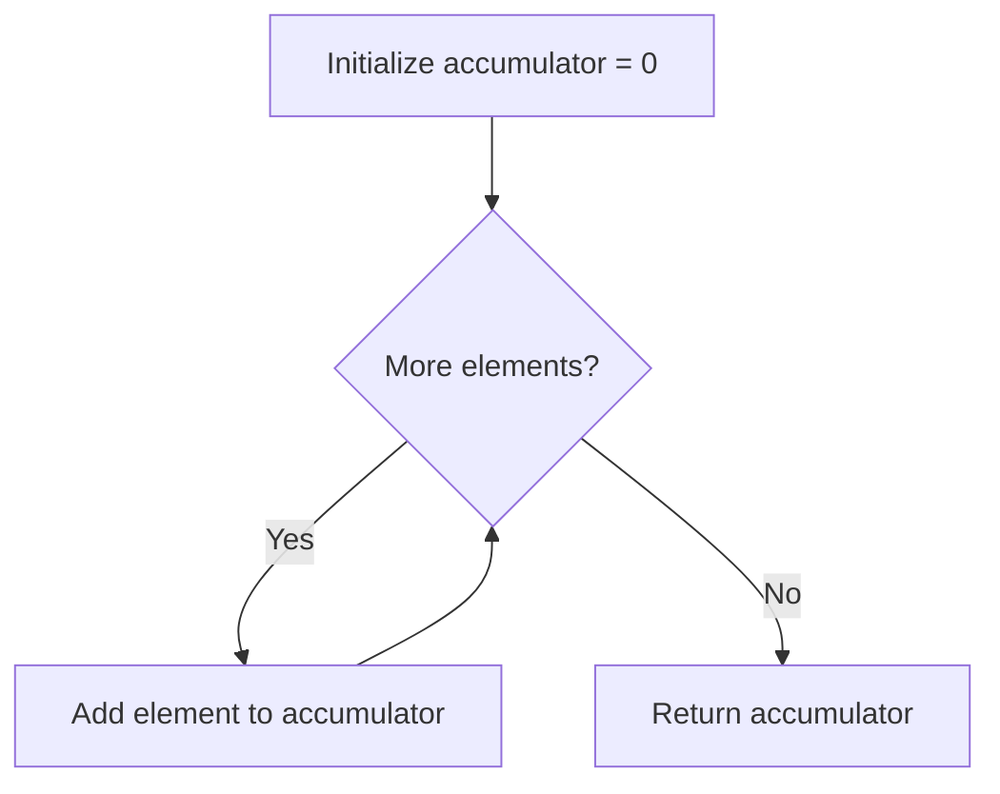
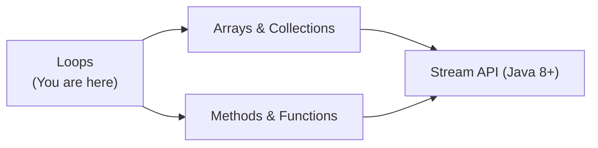
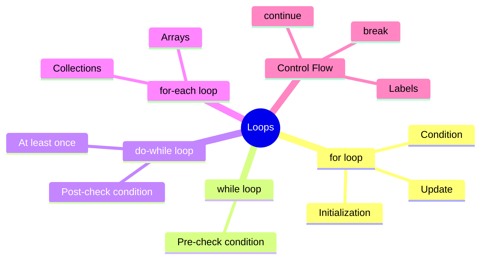
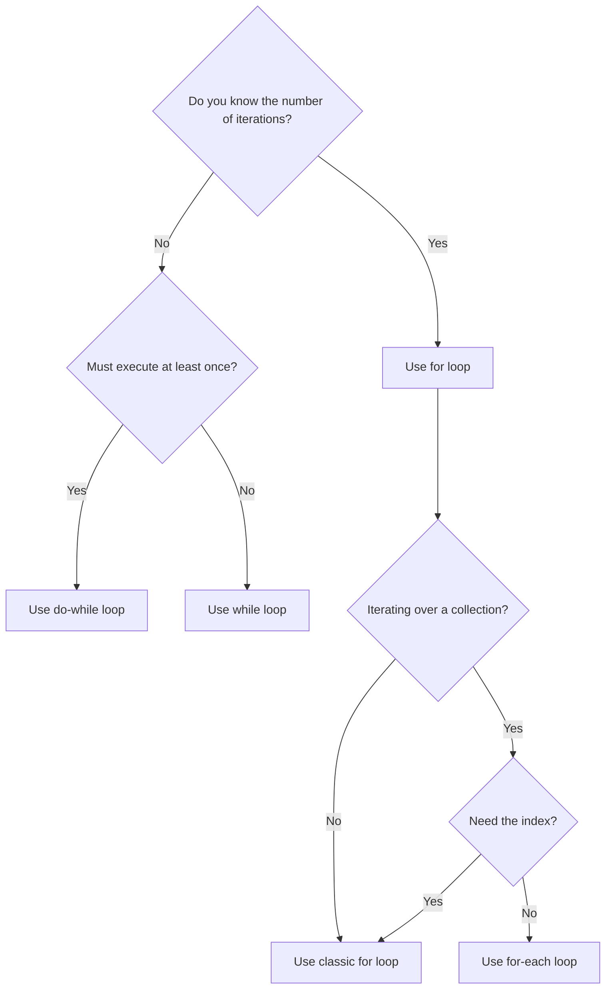
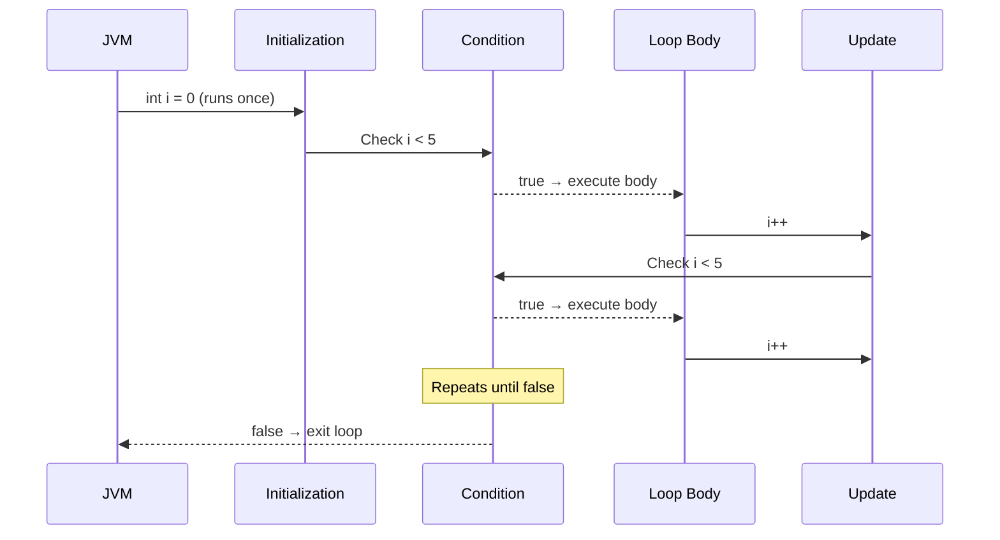

# Loops — Junior Level

## Table of Contents

1. [Introduction](#introduction)
2. [Prerequisites](#prerequisites)
3. [Glossary](#glossary)
4. [Core Concepts](#core-concepts)
5. [Real-World Analogies](#real-world-analogies)
6. [Mental Models](#mental-models)
7. [Pros & Cons](#pros--cons)
8. [Use Cases](#use-cases)
9. [Code Examples](#code-examples)
10. [Coding Patterns](#coding-patterns)
11. [Clean Code](#clean-code)
12. [Product Use / Feature](#product-use--feature)
13. [Error Handling](#error-handling)
14. [Security Considerations](#security-considerations)
15. [Performance Tips](#performance-tips)
16. [Metrics & Analytics](#metrics--analytics)
17. [Best Practices](#best-practices)
18. [Edge Cases & Pitfalls](#edge-cases--pitfalls)
19. [Common Mistakes](#common-mistakes)
20. [Common Misconceptions](#common-misconceptions)
21. [Tricky Points](#tricky-points)
22. [Test](#test)
23. [Tricky Questions](#tricky-questions)
24. [Cheat Sheet](#cheat-sheet)
25. [Self-Assessment Checklist](#self-assessment-checklist)
26. [Summary](#summary)
27. [What You Can Build](#what-you-can-build)
28. [Further Reading](#further-reading)
29. [Related Topics](#related-topics)
30. [Diagrams & Visual Aids](#diagrams--visual-aids)

---

## Introduction

> Focus: "What is it?" and "How to use it?"

Loops are one of the most fundamental constructs in programming. A **loop** lets you execute a block of code repeatedly — either a fixed number of times or until a condition becomes false. In Java, there are four main loop types: `for`, `while`, `do-while`, and the enhanced `for-each`. Understanding loops is essential because almost every program needs to iterate over data, repeat actions, or process collections.

---

## Prerequisites

What you should know before studying this topic:

- **Required:** Basic Java syntax — how to write a class with a `main` method and compile/run it
- **Required:** Variables and data types — you need to declare loop counters and store results
- **Required:** Conditionals (`if`/`else`) — loops rely on boolean conditions to decide when to stop
- **Helpful but not required:** Arrays — many loop examples iterate over arrays

---

## Glossary

Key terms used in this topic:

| Term | Definition |
|------|-----------|
| **Iteration** | A single execution of the loop body |
| **Loop counter** | A variable that tracks how many times the loop has run |
| **Loop condition** | A boolean expression evaluated before (or after) each iteration |
| **Infinite loop** | A loop whose condition never becomes false — it runs forever |
| **Break** | A keyword that immediately exits the loop |
| **Continue** | A keyword that skips the rest of the current iteration and jumps to the next one |
| **Enhanced for-each** | A simplified `for` loop syntax for iterating over arrays and collections |
| **Nested loop** | A loop placed inside another loop |
| **Label** | A named marker placed before a loop, used with `break` or `continue` to target a specific loop |

---

## Core Concepts

### Concept 1: `for` Loop

The classic `for` loop has three parts: initialization, condition, and update. It is best when you know exactly how many times to iterate.

```java
for (int i = 0; i < 5; i++) {
    System.out.println("i = " + i);
}
```

- **Initialization** (`int i = 0`) runs once before the loop starts.
- **Condition** (`i < 5`) is checked before every iteration.
- **Update** (`i++`) runs after every iteration.

### Concept 2: `while` Loop

The `while` loop checks the condition first, then executes the body. Use it when you do not know in advance how many iterations you need.

```java
int count = 0;
while (count < 3) {
    System.out.println("count = " + count);
    count++;
}
```

### Concept 3: `do-while` Loop

The `do-while` loop executes the body first, then checks the condition. This guarantees at least one execution.

```java
int x = 10;
do {
    System.out.println("x = " + x);
    x++;
} while (x < 5); // Prints "x = 10" once, then stops
```

### Concept 4: Enhanced `for-each` Loop

Java's enhanced for loop simplifies iteration over arrays and `Iterable` collections. You cannot access the index directly.

```java
String[] fruits = {"Apple", "Banana", "Cherry"};
for (String fruit : fruits) {
    System.out.println(fruit);
}
```

### Concept 5: `break` and `continue`

- `break` exits the loop immediately.
- `continue` skips the remaining body and goes to the next iteration.

```java
for (int i = 0; i < 10; i++) {
    if (i == 3) continue; // Skip 3
    if (i == 7) break;    // Stop at 7
    System.out.println(i); // Prints 0, 1, 2, 4, 5, 6
}
```

### Concept 6: Labeled `break` and `continue`

Labels let you control which loop `break` or `continue` targets in nested loops.

```java
outer:
for (int i = 0; i < 3; i++) {
    for (int j = 0; j < 3; j++) {
        if (j == 1) continue outer; // Skip to next i
        System.out.println("i=" + i + " j=" + j);
    }
}
```

---

## Real-World Analogies

| Concept | Analogy |
|---------|--------|
| **`for` loop** | A teacher calling roll for 30 students — you know exactly how many names to call |
| **`while` loop** | Waiting for a bus — you keep waiting until the bus arrives, but you do not know how long |
| **`do-while` loop** | Tasting food while cooking — you taste at least once, then keep tasting until the seasoning is right |
| **`break`** | A fire alarm during class — everyone leaves immediately regardless of where they are in the lesson |
| **`continue`** | Skipping a song on a playlist — you move to the next song without listening to the current one |

---

## Mental Models

**The intuition:** Think of a loop as a hamster wheel. The hamster (your code) keeps running in circles until a condition stops the wheel. Each full spin is one iteration.

**Why this model helps:** It reminds you that every loop needs a way to stop the wheel — otherwise you get an infinite loop that runs forever and crashes your program.

---

## Pros & Cons

| Pros | Cons |
|------|------|
| Eliminates code duplication — write once, run many times | Can cause infinite loops if the exit condition is wrong |
| Makes code shorter and more readable than copy-pasting | Nested loops can become hard to read and debug |
| Works with any data size — 10 elements or 10 million | Off-by-one errors are very common |

### When to use:
- Processing every element in a collection or array
- Repeating an action a known number of times
- Waiting for user input or an external condition

### When NOT to use:
- When a Stream API call is more readable (Java 8+)
- When recursion better expresses the logic (e.g., tree traversal)

---

## Use Cases

- **Use Case 1:** Iterating over a list of users to print their names
- **Use Case 2:** Reading input from a scanner until the user types "quit"
- **Use Case 3:** Calculating the sum of numbers in an array
- **Use Case 4:** Searching for a value in an unsorted array

---

## Code Examples

### Example 1: Sum of Array Elements

```java
public class SumArray {
    public static void main(String[] args) {
        int[] numbers = {10, 20, 30, 40, 50};
        int sum = 0;

        for (int num : numbers) {
            sum += num;
        }

        System.out.println("Sum = " + sum); // Sum = 150
    }
}
```

**What it does:** Uses an enhanced for-each loop to add up all elements in an array.
**How to run:** `javac SumArray.java && java SumArray`

### Example 2: Multiplication Table with Nested Loops

```java
public class MultiplicationTable {
    public static void main(String[] args) {
        for (int i = 1; i <= 5; i++) {
            for (int j = 1; j <= 5; j++) {
                System.out.printf("%4d", i * j);
            }
            System.out.println();
        }
    }
}
```

**What it does:** Prints a 5x5 multiplication table using nested `for` loops.
**How to run:** `javac MultiplicationTable.java && java MultiplicationTable`

### Example 3: Reading Input Until Quit

```java
import java.util.Scanner;

public class InputLoop {
    public static void main(String[] args) {
        Scanner scanner = new Scanner(System.in);
        String input;

        do {
            System.out.print("Enter a command (type 'quit' to exit): ");
            input = scanner.nextLine();
            System.out.println("You entered: " + input);
        } while (!input.equals("quit"));

        scanner.close();
        System.out.println("Goodbye!");
    }
}
```

**What it does:** Uses a `do-while` loop to read user input at least once, continuing until "quit" is entered.
**How to run:** `javac InputLoop.java && java InputLoop`

### Example 4: Finding an Element with `break`

```java
public class FindElement {
    public static void main(String[] args) {
        int[] data = {3, 7, 1, 9, 4, 6};
        int target = 9;
        int index = -1;

        for (int i = 0; i < data.length; i++) {
            if (data[i] == target) {
                index = i;
                break; // No need to check remaining elements
            }
        }

        if (index != -1) {
            System.out.println("Found " + target + " at index " + index);
        } else {
            System.out.println(target + " not found");
        }
    }
}
```

**What it does:** Searches an array for a target value using `break` to exit early once found.
**How to run:** `javac FindElement.java && java FindElement`

---

## Coding Patterns

### Pattern 1: Accumulator Pattern

**Intent:** Collect or combine values across iterations into a single result.
**When to use:** Summing numbers, building strings, counting occurrences.

```java
public class Accumulator {
    public static void main(String[] args) {
        int[] values = {5, 10, 15, 20};
        int total = 0; // Accumulator initialized before the loop

        for (int v : values) {
            total += v; // Accumulate each value
        }

        System.out.println("Total: " + total); // Total: 50
    }
}
```

**Diagram:**



**Remember:** Always initialize the accumulator before the loop, not inside it.

---

### Pattern 2: Search and Exit Pattern

**Intent:** Find a value and stop searching once found.

```java
public class SearchPattern {
    public static void main(String[] args) {
        String[] names = {"Alice", "Bob", "Charlie", "Diana"};
        boolean found = false;

        for (String name : names) {
            if (name.equals("Charlie")) {
                found = true;
                break;
            }
        }

        System.out.println("Found Charlie: " + found);
    }
}
```

**Diagram:**

```mermaid
sequenceDiagram
    participant Loop
    participant Array
    participant Result
    Loop->>Array: Get next element
    Array-->>Loop: "Alice"
    Note over Loop: Not a match
    Loop->>Array: Get next element
    Array-->>Loop: "Bob"
    Note over Loop: Not a match
    Loop->>Array: Get next element
    Array-->>Loop: "Charlie"
    Note over Loop: Match! break
    Loop-->>Result: found = true
```

---

## Clean Code

### Naming (Java conventions)

```java
// ❌ Bad
for (int x = 0; x < arr.length; x++) { ... }
int t = 0;

// ✅ Clean
for (int index = 0; index < students.length; index++) { ... }
int totalScore = 0;
```

**Note:** Using `i`, `j`, `k` is acceptable for simple numeric loop counters — it is a widely understood convention. But for anything else, use descriptive names.

---

### Short Methods

```java
// ❌ Too long — loop logic mixed with business logic
public void process(List<Order> orders) {
    for (Order o : orders) {
        // 40 lines of validation + calculation + printing
    }
}

// ✅ Each method does one thing
private boolean isValid(Order order) { ... }
private double calculateTotal(Order order) { ... }
private void printReceipt(Order order) { ... }
```

---

## Product Use / Feature

### 1. Apache Kafka Consumer

- **How it uses Loops:** Kafka consumers run an infinite `while(true)` poll loop to continuously read messages from topics.
- **Why it matters:** Understanding event-driven infinite loops is fundamental to message processing systems.

### 2. Spring Batch

- **How it uses Loops:** Spring Batch iterates over datasets in chunks, processing each chunk inside a loop with configurable batch sizes.
- **Why it matters:** Shows how loops enable processing millions of records without running out of memory.

### 3. JUnit Test Runners

- **How it uses Loops:** Test runners iterate over discovered test methods, executing each one and collecting results.
- **Why it matters:** Demonstrates that loops power even the tools developers use daily.

---

## Error Handling

### Error 1: `ArrayIndexOutOfBoundsException`

```java
int[] arr = {1, 2, 3};
for (int i = 0; i <= arr.length; i++) { // Bug: <= instead of <
    System.out.println(arr[i]);
}
```

**Why it happens:** `arr.length` is 3, so `arr[3]` is out of bounds. Array indices go from 0 to `length - 1`.
**How to fix:**

```java
for (int i = 0; i < arr.length; i++) { // Use < not <=
    System.out.println(arr[i]);
}
```

### Error 2: `ConcurrentModificationException`

```java
List<String> list = new ArrayList<>(List.of("a", "b", "c"));
for (String s : list) {
    if (s.equals("b")) {
        list.remove(s); // Throws ConcurrentModificationException
    }
}
```

**Why it happens:** The enhanced for-each loop uses an iterator internally, and modifying the list during iteration breaks the iterator contract.
**How to fix:**

```java
list.removeIf(s -> s.equals("b")); // Safe removal
```

---

## Security Considerations

### 1. Denial of Service via Unbounded Loops

```java
// ❌ Insecure — user controls loop count
int count = Integer.parseInt(userInput);
for (int i = 0; i < count; i++) {
    processItem(i); // Could run billions of times
}

// ✅ Secure — cap the maximum iterations
int count = Math.min(Integer.parseInt(userInput), 10_000);
for (int i = 0; i < count; i++) {
    processItem(i);
}
```

**Risk:** An attacker can send a very large number and make your server unresponsive.
**Mitigation:** Always validate and cap user-controlled loop bounds.

### 2. Resource Exhaustion in Infinite Loops

```java
// ❌ Insecure — infinite loop without timeout
while (true) {
    data = fetchFromNetwork();
    if (data != null) break;
}

// ✅ Secure — add a timeout or max retries
int retries = 0;
while (retries < 5) {
    data = fetchFromNetwork();
    if (data != null) break;
    retries++;
    Thread.sleep(1000);
}
```

**Risk:** Network failures can cause an infinite loop that consumes CPU.
**Mitigation:** Use retry limits and timeouts.

---

## Performance Tips

### Tip 1: Prefer `for-each` over indexed access for collections

```java
// ❌ Slow for LinkedList (O(n) per get call)
for (int i = 0; i < linkedList.size(); i++) {
    process(linkedList.get(i));
}

// ✅ Fast — O(1) per iteration via iterator
for (String item : linkedList) {
    process(item);
}
```

**Why it's faster:** `LinkedList.get(i)` traverses from the head each time (O(n)), making the whole loop O(n^2). The for-each loop uses an iterator that keeps a pointer to the current node.

### Tip 2: Cache the loop bound

```java
// ❌ Calls size() every iteration
for (int i = 0; i < expensiveList.size(); i++) { ... }

// ✅ Cache the size
int size = expensiveList.size();
for (int i = 0; i < size; i++) { ... }
```

**Why it's faster:** If `size()` involves computation, you avoid recalculating it on every iteration. (Note: for `ArrayList`, `size()` is O(1) and the JIT usually optimizes this, so it matters more for custom collections.)

---

## Metrics & Analytics

### What to Measure

| Metric | Why it matters | Tool |
|--------|---------------|------|
| **Iteration count** | Ensures loops run the expected number of times | Logging, debugger |
| **Loop execution time** | Identifies slow loops that block the main thread | `System.nanoTime()`, VisualVM |

### Basic Instrumentation

```java
long start = System.nanoTime();
for (int i = 0; i < data.size(); i++) {
    process(data.get(i));
}
long elapsed = System.nanoTime() - start;
System.out.println("Loop took " + (elapsed / 1_000_000) + " ms");
```

---

## Best Practices

- **Do this:** Use enhanced for-each when you do not need the index — it is cleaner and avoids off-by-one errors
- **Do this:** Keep loop bodies short — extract complex logic into separate methods
- **Do this:** Always ensure the loop condition will eventually become false
- **Do this:** Use `break` to exit early when the goal is achieved — no need to iterate over remaining elements
- **Do this:** Prefer `List.removeIf()` over manual removal inside a for-each loop

---

## Edge Cases & Pitfalls

### Pitfall 1: Off-by-One Error

```java
// Intended to print 1 to 10, but misses 10
for (int i = 1; i < 10; i++) {
    System.out.println(i); // Prints 1 to 9
}
```

**What happens:** The loop stops when `i` reaches 10 because the condition is `< 10`, not `<= 10`.
**How to fix:** Use `i <= 10` or `i < 11`.

### Pitfall 2: Modifying the Counter Inside the Loop

```java
for (int i = 0; i < 5; i++) {
    i++; // Unintentionally skips values
    System.out.println(i); // Prints 1, 3, 5
}
```

**What happens:** `i` is incremented twice per iteration — once inside the body and once in the update expression.
**How to fix:** Do not modify the loop counter inside the body unless you have a very specific reason.

---

## Common Mistakes

### Mistake 1: Semicolon After `for`

```java
// ❌ Wrong — the semicolon makes an empty loop body
for (int i = 0; i < 5; i++);
{
    System.out.println(i); // This is NOT inside the loop
}

// ✅ Correct
for (int i = 0; i < 5; i++) {
    System.out.println(i);
}
```

### Mistake 2: Using `==` for String Comparison in Loop Condition

```java
// ❌ Wrong — compares references, not content
while (input != "quit") { ... }

// ✅ Correct — compares content
while (!input.equals("quit")) { ... }
```

### Mistake 3: Forgetting to Update the Counter in `while`

```java
// ❌ Infinite loop — counter never changes
int i = 0;
while (i < 5) {
    System.out.println(i);
    // Missing: i++;
}

// ✅ Correct
int i = 0;
while (i < 5) {
    System.out.println(i);
    i++;
}
```

---

## Common Misconceptions

### Misconception 1: "`do-while` is just a `while` loop written differently"

**Reality:** `do-while` always executes the body at least once, even if the condition is false from the start. A `while` loop might never execute.

**Why people think this:** The syntax looks similar and in many cases they produce the same output. But when the initial condition is false, the behavior differs.

### Misconception 2: "The enhanced for-each loop is always better than the classic for loop"

**Reality:** The for-each loop cannot modify the array, cannot access the index, and cannot iterate in reverse. The classic for loop is needed in those cases.

**Why people think this:** Tutorials often say "prefer for-each" without explaining its limitations.

### Misconception 3: "`break` exits all nested loops"

**Reality:** `break` only exits the innermost loop. To exit an outer loop, you need a labeled `break`.

**Why people think this:** In everyday language, "break out of the loop" sounds like it exits everything.

---

## Tricky Points

### Tricky Point 1: Variable Scope in `for` Loops

```java
for (int i = 0; i < 5; i++) {
    // i is accessible here
}
// System.out.println(i); // Compile error! i is not accessible here
```

**Why it's tricky:** The variable declared in the `for` header exists only inside the loop. This is different from a `while` loop where the variable is declared outside.
**Key takeaway:** `for` loop variables are scoped to the loop block.

### Tricky Point 2: Comma Operator in `for` Loops

```java
for (int i = 0, j = 10; i < j; i++, j--) {
    System.out.println("i=" + i + " j=" + j);
}
// Prints: i=0 j=10, i=1 j=9, ... i=4 j=6
```

**Why it's tricky:** Java allows multiple initializations and updates in a `for` loop, separated by commas. This is rarely seen in beginner tutorials.
**Key takeaway:** The comma separates multiple expressions in the init and update parts — but the condition can only have one expression.

---

## Test

### Multiple Choice

**1. How many times does this loop execute?**

```java
for (int i = 0; i < 5; i++) {
    System.out.println(i);
}
```

- A) 4 times
- B) 5 times
- C) 6 times
- D) Infinite times

<details>
<summary>Answer</summary>

**B) 5 times** — `i` goes from 0 to 4. When `i` becomes 5, the condition `i < 5` is false and the loop stops.

</details>

**2. What is the output?**

```java
int i = 0;
while (i < 3) {
    System.out.print(i + " ");
    i++;
}
```

- A) `0 1 2 3`
- B) `0 1 2`
- C) `1 2 3`
- D) `0 1 2 ` (with trailing space)

<details>
<summary>Answer</summary>

**D) `0 1 2 `** — The loop runs for i=0, 1, 2. Each print includes a trailing space. When i reaches 3, the condition is false.

</details>

### True or False

**3. A `do-while` loop always executes at least once.**

<details>
<summary>Answer</summary>

**True** — The condition is checked after the body executes, so the body runs at least once regardless of the condition.

</details>

**4. You can use a `for-each` loop to iterate over a `HashMap` directly.**

<details>
<summary>Answer</summary>

**False** — You cannot iterate over a `HashMap` directly with for-each. You must iterate over `map.entrySet()`, `map.keySet()`, or `map.values()`.

</details>

### What's the Output?

**5. What does this code print?**

```java
for (int i = 0; i < 5; i++) {
    if (i % 2 == 0) continue;
    System.out.print(i + " ");
}
```

<details>
<summary>Answer</summary>

Output: `1 3 `

Explanation: When `i` is even (0, 2, 4), `continue` skips the print. Only odd values (1, 3) are printed.

</details>

**6. What does this code print?**

```java
int x = 5;
do {
    System.out.print(x + " ");
    x--;
} while (x > 5);
```

<details>
<summary>Answer</summary>

Output: `5 `

Explanation: The body runs once (prints 5, decrements to 4), then the condition `4 > 5` is false, so the loop stops.

</details>

**7. What does this code print?**

```java
outer:
for (int i = 0; i < 3; i++) {
    for (int j = 0; j < 3; j++) {
        if (i == 1 && j == 1) break outer;
        System.out.print(i + "" + j + " ");
    }
}
```

<details>
<summary>Answer</summary>

Output: `00 01 02 10 `

Explanation: The outer loop runs for i=0 (all j values print: 00, 01, 02), then for i=1, j=0 prints 10, and at i=1, j=1, `break outer` exits both loops.

</details>

---

## Tricky Questions

**1. What does this code print?**

```java
for (int i = 0; i < 10; i++) {
    if (i == 5) break;
    if (i % 2 == 0) continue;
    System.out.print(i + " ");
}
```

- A) `1 3`
- B) `1 3 5 7 9`
- C) `0 2 4`
- D) `1 3 ` (with trailing space)

<details>
<summary>Answer</summary>

**D) `1 3 `** — Even numbers are skipped by `continue`. When `i` reaches 5, `break` exits the loop. So only 1 and 3 are printed.

</details>

**2. Does this code compile?**

```java
for (;;) {
    System.out.println("Hello");
    break;
}
```

- A) No — all three parts of `for` are required
- B) Yes — it prints "Hello" once
- C) Yes — it prints "Hello" infinitely
- D) No — empty condition is a syntax error

<details>
<summary>Answer</summary>

**B) Yes — it prints "Hello" once.** All three parts of a `for` loop are optional. `for(;;)` is a valid infinite loop. The `break` exits after one iteration.

</details>

**3. What is the value of `sum` after this code runs?**

```java
int sum = 0;
for (int i = 1; i <= 100; i++) {
    sum += i;
}
```

- A) 100
- B) 5050
- C) 5000
- D) 4950

<details>
<summary>Answer</summary>

**B) 5050** — This calculates 1 + 2 + 3 + ... + 100 = n(n+1)/2 = 100*101/2 = 5050. This is Gauss's formula.

</details>

---

## Cheat Sheet

| What | Syntax | Example |
|------|--------|---------|
| Basic for loop | `for (init; cond; update)` | `for (int i = 0; i < n; i++)` |
| While loop | `while (cond)` | `while (count > 0)` |
| Do-while loop | `do { } while (cond);` | `do { scan(); } while (!done);` |
| For-each loop | `for (Type var : collection)` | `for (String s : list)` |
| Break | `break;` | Exit innermost loop |
| Continue | `continue;` | Skip to next iteration |
| Labeled break | `label: for ... break label;` | Exit specific outer loop |
| Infinite loop | `while (true)` or `for (;;)` | Server event loops |

---

## Self-Assessment Checklist

### I can explain:
- [ ] The difference between `for`, `while`, and `do-while`
- [ ] When to use each type of loop
- [ ] How `break` and `continue` work
- [ ] What labeled `break`/`continue` does in nested loops
- [ ] Why a for-each loop cannot modify the collection

### I can do:
- [ ] Write any loop type from scratch without looking
- [ ] Convert between `for`, `while`, and `do-while`
- [ ] Use nested loops to process 2D data
- [ ] Debug infinite loops and off-by-one errors
- [ ] Choose the right loop type for a given problem

### I can answer:
- [ ] All multiple choice questions in this document
- [ ] "What's the output?" questions correctly

---

## Summary

- **`for` loop** — best when you know the number of iterations
- **`while` loop** — best when iterations depend on a runtime condition
- **`do-while` loop** — guarantees at least one execution
- **Enhanced `for-each`** — simplest syntax for arrays and collections
- **`break`** exits the loop; **`continue`** skips to the next iteration
- **Labels** let you target specific loops in nested structures
- Always ensure your loop has a valid exit condition to avoid infinite loops

**Next step:** Learn about arrays and collections in depth to combine with loops.

---

## What You Can Build

### Projects you can create:
- **Number Guessing Game:** Use a `while` loop to let the user keep guessing until they find the number
- **Simple Calculator:** Use a `do-while` loop to keep accepting expressions until the user quits
- **Pattern Printer:** Use nested `for` loops to print triangle, diamond, or pyramid patterns

### Technologies / tools that use this:
- **Spring Boot** — controllers process request collections using loops
- **Apache POI** — reading Excel rows requires iterating with loops
- **JDBC** — processing `ResultSet` rows uses a `while (rs.next())` loop

### Learning path — what to study next:



---

## Further Reading

- **Official docs:** [The for Statement](https://docs.oracle.com/javase/tutorial/java/nutsandbolts/for.html)
- **Official docs:** [The while and do-while Statements](https://docs.oracle.com/javase/tutorial/java/nutsandbolts/while.html)
- **Official docs:** [Branching Statements (break, continue)](https://docs.oracle.com/javase/tutorial/java/nutsandbolts/branch.html)
- **Book chapter:** Effective Java (Bloch) — Item 58: Prefer for-each loops to traditional for loops

---

## Related Topics

- **[Arrays](../08-arrays/)** — loops are most commonly used to iterate over arrays
- **[Conditionals](../09-conditionals/)** — loop conditions use the same boolean logic
- **[Variables and Scopes](../04-variables-and-scopes/)** — loop variables have specific scoping rules
- **Stream API** — the modern alternative to many loop patterns

---

## Diagrams & Visual Aids

### Mind Map



### Loop Decision Flowchart



### For Loop Execution Flow


