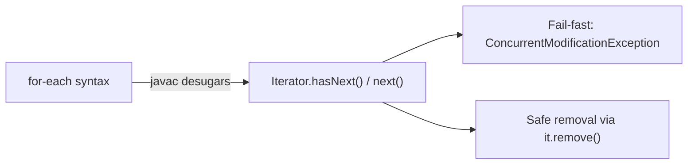
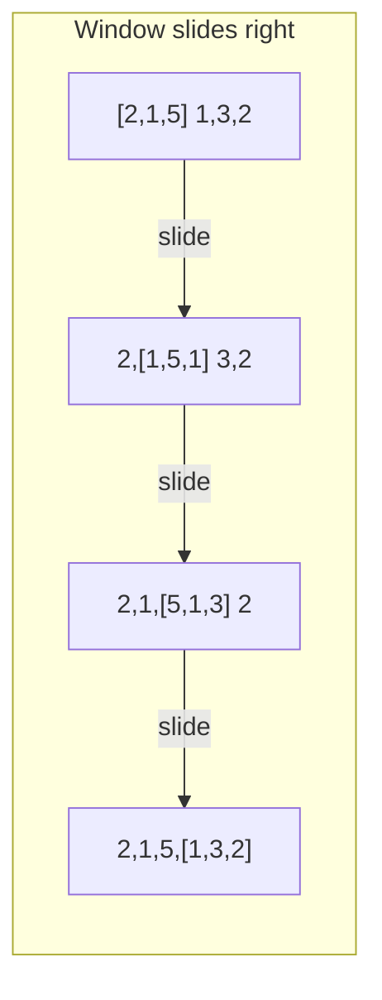
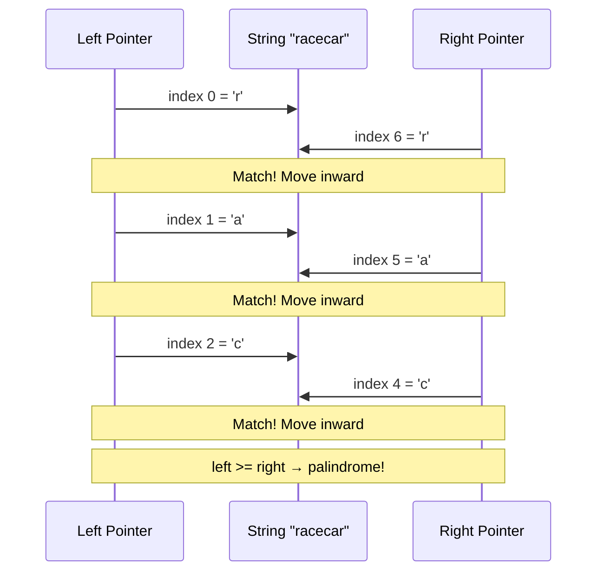
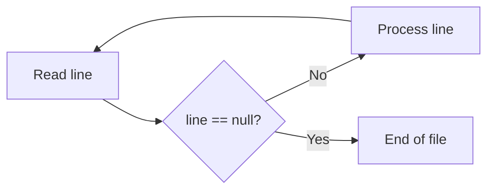
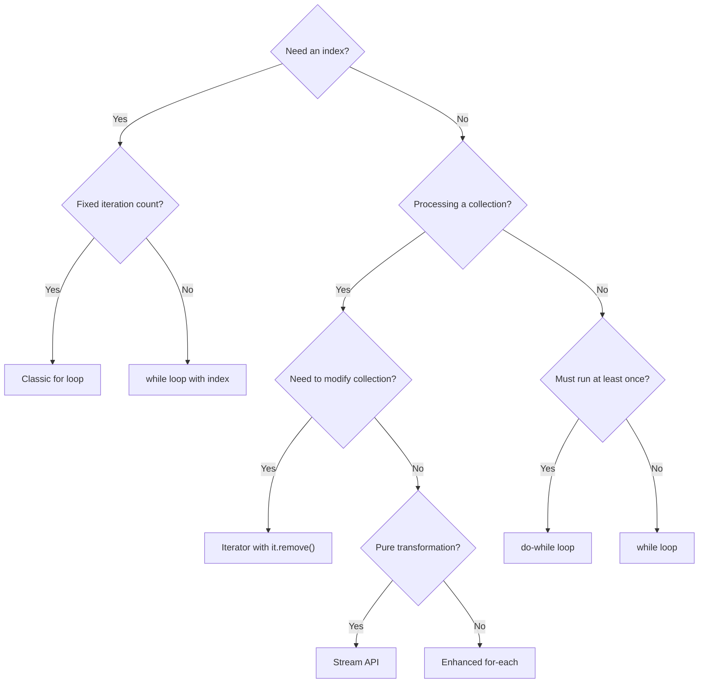
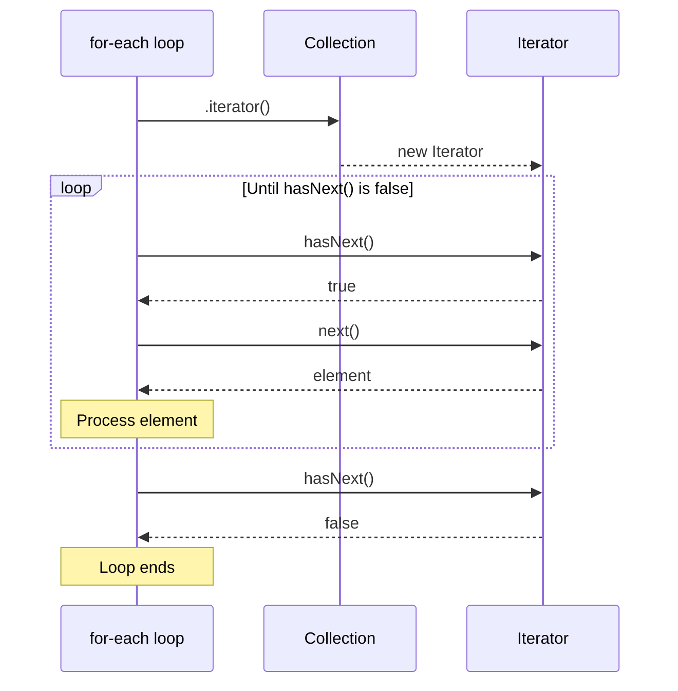

# Loops — Middle Level

## Table of Contents

1. [Introduction](#introduction)
2. [Core Concepts](#core-concepts)
3. [Evolution & Historical Context](#evolution--historical-context)
4. [Pros & Cons](#pros--cons)
5. [Alternative Approaches](#alternative-approaches)
6. [Code Examples](#code-examples)
7. [Coding Patterns](#coding-patterns)
8. [Clean Code](#clean-code)
9. [Product Use / Feature](#product-use--feature)
10. [Error Handling](#error-handling)
11. [Security Considerations](#security-considerations)
12. [Performance Optimization](#performance-optimization)
13. [Debugging Guide](#debugging-guide)
14. [Best Practices](#best-practices)
15. [Edge Cases & Pitfalls](#edge-cases--pitfalls)
16. [Comparison with Other Languages](#comparison-with-other-languages)
17. [Test](#test)
18. [Cheat Sheet](#cheat-sheet)
19. [Summary](#summary)
20. [Diagrams & Visual Aids](#diagrams--visual-aids)

---

## Introduction

> Focus: "Why?" and "When to use?"

This level covers the deeper mechanics of loops in Java — how the JVM handles them, when to choose loops over Stream API, coding patterns for production code, and performance considerations that matter at scale. You already know the syntax; now learn when each approach shines and why.

---

## Core Concepts

### Concept 1: Iterator Protocol and for-each Desugaring

The enhanced for-each loop is syntactic sugar over the `Iterator` protocol. Understanding this is critical for avoiding `ConcurrentModificationException` and writing custom iterables.

```java
// This for-each loop:
for (String item : collection) {
    System.out.println(item);
}

// Compiles to equivalent of:
Iterator<String> it = collection.iterator();
while (it.hasNext()) {
    String item = it.next();
    System.out.println(item);
}
```



- The `modCount` field in `ArrayList` tracks structural modifications.
- If `modCount` changes during iteration, the iterator throws `ConcurrentModificationException`.
- Only `Iterator.remove()` safely removes elements during iteration.

### Concept 2: Loop vs Stream API

Java 8 introduced the Stream API as a declarative alternative to imperative loops. The choice is not always obvious.

```java
// Imperative — loop
List<String> result = new ArrayList<>();
for (String name : names) {
    if (name.startsWith("A")) {
        result.add(name.toUpperCase());
    }
}

// Declarative — Stream API
List<String> result = names.stream()
    .filter(name -> name.startsWith("A"))
    .map(String::toUpperCase)
    .collect(Collectors.toList());
```

**When to prefer loops:**
- Side effects are needed (logging, counter updates)
- Performance-critical hot paths (avoids Stream pipeline overhead)
- Early exit with complex conditions (`break` is not possible in streams)
- Checked exceptions in the body (streams don't handle them cleanly)

**When to prefer streams:**
- Pure transformations (filter, map, reduce)
- Parallel processing potential (`parallelStream()`)
- Method chaining improves readability
- Collector-based aggregation

### Concept 3: Loop Invariants and Hoisting

A **loop invariant** is a condition or computation that does not change across iterations. The JIT compiler often hoists invariants out of the loop, but writing code that helps the JIT is a good practice.

```java
// ❌ Invariant computation inside the loop
for (int i = 0; i < list.size(); i++) {
    double factor = Math.sqrt(config.getScalingFactor()); // Same every iteration
    results[i] = list.get(i) * factor;
}

// ✅ Hoisted manually
double factor = Math.sqrt(config.getScalingFactor());
int size = list.size();
for (int i = 0; i < size; i++) {
    results[i] = list.get(i) * factor;
}
```

### Concept 4: Loop Unrolling (Conceptual)

Loop unrolling is an optimization where multiple iterations are combined into one to reduce loop overhead (condition check, counter update). The JIT compiler does this automatically for simple loops, but understanding it helps when reading JMH benchmarks.

```java
// Original loop
for (int i = 0; i < 8; i++) {
    sum += arr[i];
}

// Conceptually unrolled (JIT may do this)
sum += arr[0] + arr[1] + arr[2] + arr[3]
     + arr[4] + arr[5] + arr[6] + arr[7];
```

### Concept 5: Iterable vs Iterator Pattern

Understanding the difference between `Iterable` (can produce iterators) and `Iterator` (tracks position) is crucial for writing custom iterable classes.

```java
public class Range implements Iterable<Integer> {
    private final int start, end;

    public Range(int start, int end) {
        this.start = start;
        this.end = end;
    }

    @Override
    public Iterator<Integer> iterator() {
        return new Iterator<>() {
            private int current = start;

            @Override
            public boolean hasNext() { return current < end; }

            @Override
            public Integer next() {
                if (!hasNext()) throw new NoSuchElementException();
                return current++;
            }
        };
    }
}

// Usage: for-each works automatically
for (int i : new Range(1, 5)) {
    System.out.println(i); // 1, 2, 3, 4
}
```

---

## Evolution & Historical Context

**Before Java 5:**
- Only classic `for` and `while` loops existed.
- Iterating over collections required explicit `Iterator` handling with casts.

```java
// Pre-Java 5: no generics, no for-each
List list = new ArrayList();
Iterator it = list.iterator();
while (it.hasNext()) {
    String s = (String) it.next(); // Unsafe cast
}
```

**Java 5 (2004):** Enhanced for-each loop + generics eliminated boilerplate and type-safety issues.

**Java 8 (2014):** Stream API introduced a declarative alternative. `Iterable.forEach()` added as a default method.

**Java 10+ (2018):** `var` for loop variables: `for (var item : list)`.

---

## Pros & Cons

| Pros | Cons |
|------|------|
| Full control over iteration (index, direction, step) | Verbose compared to Stream API for simple transformations |
| `break`/`continue` for complex flow control | Mutable state inside loops is error-prone |
| No overhead from Stream pipeline creation | Nested loops can produce O(n^2) or worse accidentally |
| Works with checked exceptions naturally | Harder to parallelize than `parallelStream()` |

### Trade-off analysis:

- **Readability vs Control:** Streams are more readable for pipelines; loops are clearer for stateful operations
- **Performance vs Expressiveness:** Loops have less overhead for small datasets; streams can auto-parallelize

### Comparison with alternatives:

| Approach | Pros | Cons | Best for |
|----------|------|------|----------|
| Classic for loop | Full control, index access | Verbose, off-by-one risk | Known iteration count |
| Enhanced for-each | Clean syntax, safe | No index, no modification | Simple iteration |
| Stream API | Declarative, parallelizable | Overhead, no break/continue | Transformations |
| `Iterable.forEach()` | Concise | No break, limited control | Simple actions |

---

## Alternative Approaches

| Alternative | How it works | When you might be forced to use it |
|-------------|--------------|-------------------------------------|
| **Recursion** | Method calls itself with a reduced problem | Tree/graph traversal where depth is bounded |
| **Stream.iterate()** | `Stream.iterate(0, i -> i < 10, i -> i + 1)` | When you need a lazy, potentially infinite sequence |
| **IntStream.range()** | `IntStream.range(0, 10).forEach(...)` | Replacing index-based for loops in functional style |

---

## Code Examples

### Example 1: Safe Collection Modification During Iteration

```java
import java.util.*;

public class SafeRemoval {
    public static void main(String[] args) {
        List<String> names = new ArrayList<>(
            List.of("Alice", "Bob", "Charlie", "David", "Eve")
        );

        // Approach 1: Iterator.remove()
        Iterator<String> it = names.iterator();
        while (it.hasNext()) {
            if (it.next().length() <= 3) {
                it.remove(); // Safe — uses iterator's own remove
            }
        }
        System.out.println(names); // [Alice, Charlie, David]

        // Approach 2: removeIf (Java 8+) — most idiomatic
        names.removeIf(name -> name.length() > 5);
        System.out.println(names); // [Alice, David]

        // Approach 3: Reverse index loop for ArrayList
        List<Integer> nums = new ArrayList<>(List.of(1, 2, 3, 4, 5));
        for (int i = nums.size() - 1; i >= 0; i--) {
            if (nums.get(i) % 2 == 0) {
                nums.remove(i); // Safe — removing from end
            }
        }
        System.out.println(nums); // [1, 3, 5]
    }
}
```

**Why this pattern:** Modifying a collection during iteration is one of the most common sources of bugs. These three approaches are all safe alternatives.

### Example 2: Loop vs Stream Performance Comparison

```java
import java.util.*;
import java.util.stream.*;

public class LoopVsStream {
    public static void main(String[] args) {
        List<Integer> numbers = new ArrayList<>();
        for (int i = 0; i < 1_000_000; i++) {
            numbers.add(i);
        }

        // Imperative loop
        long start1 = System.nanoTime();
        long sum1 = 0;
        for (int n : numbers) {
            if (n % 2 == 0) {
                sum1 += n * 2L;
            }
        }
        long elapsed1 = System.nanoTime() - start1;

        // Stream API
        long start2 = System.nanoTime();
        long sum2 = numbers.stream()
            .filter(n -> n % 2 == 0)
            .mapToLong(n -> n * 2L)
            .sum();
        long elapsed2 = System.nanoTime() - start2;

        System.out.printf("Loop:   %d ns, sum=%d%n", elapsed1, sum1);
        System.out.printf("Stream: %d ns, sum=%d%n", elapsed2, sum2);
    }
}
```

**When to use which:** For simple numeric operations, loops are typically 2-5x faster due to no autoboxing and no pipeline overhead. For complex multi-stage transformations on large datasets, streams with `parallelStream()` can win.

---

## Coding Patterns

### Pattern 1: Sliding Window

**Category:** Algorithmic
**Intent:** Process a fixed-size window that moves across a sequence.
**When to use:** Subarray problems, moving averages, string matching.
**When NOT to use:** When window size equals the full array.

```java
public class SlidingWindow {
    public static int maxSumSubarray(int[] arr, int k) {
        int windowSum = 0;
        for (int i = 0; i < k; i++) {
            windowSum += arr[i]; // Initialize first window
        }

        int maxSum = windowSum;
        for (int i = k; i < arr.length; i++) {
            windowSum += arr[i] - arr[i - k]; // Slide: add right, remove left
            maxSum = Math.max(maxSum, windowSum);
        }
        return maxSum;
    }

    public static void main(String[] args) {
        int[] data = {2, 1, 5, 1, 3, 2};
        System.out.println(maxSumSubarray(data, 3)); // 9 (5+1+3)
    }
}
```

**Diagram:**



**Trade-offs:**

| Pros | Cons |
|------|------|
| O(n) time complexity | Only works for contiguous subarrays |
| Constant extra space | Window size must be fixed or predictable |

---

### Pattern 2: Two-Pointer Loop

**Category:** Algorithmic
**Intent:** Use two indices moving toward each other to solve problems in O(n).
**When to use:** Sorted array pair sum, palindrome check, partitioning.

```java
public class TwoPointer {
    public static boolean isPalindrome(String s) {
        int left = 0, right = s.length() - 1;
        while (left < right) {
            if (s.charAt(left) != s.charAt(right)) {
                return false;
            }
            left++;
            right--;
        }
        return true;
    }

    public static void main(String[] args) {
        System.out.println(isPalindrome("racecar")); // true
        System.out.println(isPalindrome("hello"));   // false
    }
}
```

**Diagram:**



---

### Pattern 3: Sentinel Loop

**Category:** Java-idiomatic
**Intent:** Use a special value to signal loop termination instead of a boolean flag.
**When to use:** Reading from streams, processing until end-of-data marker.

```java
import java.io.*;

public class SentinelLoop {
    public static void main(String[] args) throws IOException {
        BufferedReader reader = new BufferedReader(new FileReader("data.txt"));
        String line;
        // null is the sentinel: readLine() returns null at EOF
        while ((line = reader.readLine()) != null) {
            System.out.println(line.trim());
        }
        reader.close();
    }
}
```



---

### Pattern 4: Batch Processing Loop

**Category:** Production pattern
**Intent:** Process elements in fixed-size batches to control memory and transaction size.

```java
import java.util.*;

public class BatchProcessor {
    private static final int BATCH_SIZE = 100;

    public static <T> void processBatches(List<T> items, java.util.function.Consumer<List<T>> processor) {
        for (int i = 0; i < items.size(); i += BATCH_SIZE) {
            int end = Math.min(i + BATCH_SIZE, items.size());
            List<T> batch = items.subList(i, end);
            processor.accept(batch);
            System.out.printf("Processed batch %d-%d of %d%n", i, end - 1, items.size());
        }
    }

    public static void main(String[] args) {
        List<Integer> data = new ArrayList<>();
        for (int i = 0; i < 350; i++) data.add(i);

        processBatches(data, batch ->
            System.out.println("  Batch size: " + batch.size())
        );
    }
}
```

---

### Pattern 5: Retry Loop with Exponential Backoff

**Category:** Resilience pattern
**Intent:** Retry failed operations with increasing delays.

```java
public class RetryLoop {
    public static <T> T retryWithBackoff(java.util.concurrent.Callable<T> task,
                                          int maxRetries, long initialDelay) throws Exception {
        int attempt = 0;
        while (true) {
            try {
                return task.call();
            } catch (Exception e) {
                attempt++;
                if (attempt >= maxRetries) {
                    throw e;
                }
                long delay = initialDelay * (1L << (attempt - 1)); // Exponential
                System.out.printf("Attempt %d failed, retrying in %d ms...%n", attempt, delay);
                Thread.sleep(delay);
            }
        }
    }
}
```

---

## Clean Code

### Naming & Readability

```java
// ❌ Cryptic
for (int i = 0; i < u.size(); i++) {
    if (u.get(i).a > 18 && u.get(i).s) {
        r.add(u.get(i));
    }
}

// ✅ Self-documenting
for (User user : users) {
    if (user.getAge() > 18 && user.isActive()) {
        eligibleUsers.add(user);
    }
}
```

### SOLID: Single Responsibility in Loops

```java
// ❌ Loop doing validation + transformation + persistence
for (Order order : orders) {
    if (order.getTotal() > 0 && order.getCustomer() != null) {
        order.setTotal(order.getTotal() * 1.1); // Add tax
        database.save(order);
        emailService.sendConfirmation(order);
    }
}

// ✅ Separate concerns
List<Order> validOrders = orders.stream()
    .filter(this::isValidOrder)
    .collect(Collectors.toList());

for (Order order : validOrders) {
    applyTax(order);
    database.save(order);
    emailService.sendConfirmation(order);
}
```

---

## Product Use / Feature

### 1. Spring Data JPA — Cursor-Based Pagination

- **How it uses Loops:** Uses `Slice`-based loops to process large result sets without loading everything into memory.
- **Scale:** Can process millions of database rows with constant memory usage.
- **Key insight:** `while (slice.hasNext())` pattern avoids `OFFSET` performance degradation.

### 2. Netty — Event Loop Architecture

- **How it uses Loops:** Netty's `EventLoop` runs an infinite loop that processes I/O events, scheduled tasks, and user tasks.
- **Why this approach:** Single-threaded event loop avoids thread synchronization overhead.

### 3. Apache Spark — MapReduce Iterations

- **How it uses Loops:** Iterative machine learning algorithms (k-means, PageRank) run loops over distributed datasets.
- **Key insight:** Each iteration triggers a new Spark job; understanding loop overhead at this level is critical.

---

## Error Handling

### Pattern 1: Loop with Resource Cleanup

```java
import java.sql.*;

public class ResourceLoop {
    public void processResults(Connection conn) throws SQLException {
        try (PreparedStatement stmt = conn.prepareStatement("SELECT * FROM users");
             ResultSet rs = stmt.executeQuery()) {

            while (rs.next()) {
                try {
                    processRow(rs);
                } catch (Exception e) {
                    // Log but continue — don't let one bad row stop processing
                    System.err.println("Error processing row " + rs.getInt("id") + ": " + e.getMessage());
                }
            }
        } // Auto-closed by try-with-resources
    }

    private void processRow(ResultSet rs) throws SQLException {
        System.out.println(rs.getString("name"));
    }
}
```

### Pattern 2: Collecting Errors Across Iterations

```java
import java.util.*;

public class ErrorCollector {
    public static List<String> validateAll(List<String> inputs) {
        List<String> errors = new ArrayList<>();
        for (int i = 0; i < inputs.size(); i++) {
            String input = inputs.get(i);
            if (input == null || input.isBlank()) {
                errors.add("Input at index " + i + " is empty");
            } else if (input.length() > 100) {
                errors.add("Input at index " + i + " exceeds max length");
            }
        }
        return errors; // Return all errors, not just the first one
    }
}
```

---

## Security Considerations

### 1. ReDoS (Regular Expression Denial of Service) in Loops

```java
// ❌ Dangerous — each iteration runs a potentially catastrophic regex
for (String input : userInputs) {
    if (input.matches("(a+)+b")) { // Exponential backtracking
        process(input);
    }
}

// ✅ Safe — compile regex once, use bounded matching
Pattern pattern = Pattern.compile("a+b"); // Simplified, no catastrophic backtracking
for (String input : userInputs) {
    if (pattern.matcher(input).matches()) {
        process(input);
    }
}
```

### 2. Time-of-Check-to-Time-of-Use (TOCTOU) in Loops

```java
// ❌ Vulnerable — file could change between check and read
for (File file : directory.listFiles()) {
    if (file.exists() && file.canRead()) {
        // File might be deleted or replaced by symlink between these lines
        processFile(file);
    }
}

// ✅ Safer — handle the exception
for (File file : directory.listFiles()) {
    try {
        processFile(file);
    } catch (IOException e) {
        log.warn("Could not process file: {}", file.getName(), e);
    }
}
```

---

## Performance Optimization

### Benchmark: Loop Types Compared

```java
import org.openjdk.jmh.annotations.*;
import java.util.*;
import java.util.concurrent.TimeUnit;

@BenchmarkMode(Mode.AverageTime)
@OutputTimeUnit(TimeUnit.NANOSECONDS)
@State(Scope.Benchmark)
@Warmup(iterations = 5)
@Measurement(iterations = 10)
public class LoopBenchmark {

    private int[] array;
    private List<Integer> arrayList;

    @Setup
    public void setup() {
        array = new int[10_000];
        arrayList = new ArrayList<>(10_000);
        for (int i = 0; i < 10_000; i++) {
            array[i] = i;
            arrayList.add(i);
        }
    }

    @Benchmark
    public long classicForArray() {
        long sum = 0;
        for (int i = 0; i < array.length; i++) {
            sum += array[i];
        }
        return sum;
    }

    @Benchmark
    public long forEachArray() {
        long sum = 0;
        for (int n : array) {
            sum += n;
        }
        return sum;
    }

    @Benchmark
    public long streamArrayList() {
        return arrayList.stream()
            .mapToLong(Integer::longValue)
            .sum();
    }

    @Benchmark
    public long forEachArrayList() {
        long sum = 0;
        for (int n : arrayList) {
            sum += n;
        }
        return sum;
    }
}
```

**Typical results (JDK 17, 10,000 elements):**

```
Benchmark                         Mode  Cnt      Score     Error  Units
LoopBenchmark.classicForArray     avgt   10   3,142.3 ±   45.2  ns/op
LoopBenchmark.forEachArray        avgt   10   3,198.7 ±   52.1  ns/op
LoopBenchmark.forEachArrayList    avgt   10  12,456.8 ±  134.5  ns/op
LoopBenchmark.streamArrayList     avgt   10  28,734.2 ±  312.7  ns/op
```

**Key insight:** Primitive arrays with classic/for-each loops are ~4x faster than `ArrayList<Integer>` due to autoboxing. Streams add further overhead from pipeline setup.

---

## Debugging Guide

### Common Loop Debugging Techniques

| Problem | Debugging Approach |
|---------|--------------------|
| Infinite loop | Add `System.out.println(counter)` or use debugger breakpoint with hit count |
| Off-by-one | Print first and last iteration values; verify boundary conditions |
| Wrong results | Print accumulator after each iteration |
| `ConcurrentModificationException` | Check if collection is modified inside for-each |
| Slow loop | Use VisualVM or `System.nanoTime()` to measure per-iteration time |

### Using IntelliJ Debugger for Loops

1. Set a **conditional breakpoint**: Right-click breakpoint → add condition like `i == 999`
2. Use **Evaluate Expression** to check values mid-loop
3. Use **Run to Cursor** to skip ahead to a specific line
4. Check the **Variables** panel for loop counter and accumulator values

---

## Best Practices

- **Do this:** Extract loop body into a method when it exceeds 5-7 lines
- **Do this:** Use `for-each` by default; switch to indexed `for` only when you need the index
- **Do this:** Pre-compile regex patterns outside the loop, not inside
- **Do this:** Use `removeIf()` instead of manual removal during iteration
- **Do this:** Consider `Stream` API when the loop is a pure filter-map-reduce pipeline
- **Do not do this:** Nest more than 3 levels deep — extract inner loops into methods

---

## Edge Cases & Pitfalls

### Pitfall 1: Integer Overflow in Loop Counter

```java
// ❌ Counter overflows — infinite loop!
for (int i = Integer.MAX_VALUE - 1; i >= 0; i++) {
    // i wraps from MAX_VALUE to MIN_VALUE, which is < 0... but wait
    // actually i goes: MAX_VALUE-1, MAX_VALUE, MIN_VALUE (< 0, loop ends)
    // But if condition were i >= Integer.MIN_VALUE, it would be truly infinite
}

// ✅ Use long for very large ranges
for (long i = 0; i < 3_000_000_000L; i++) {
    // int would overflow at ~2.1 billion
}
```

### Pitfall 2: Floating Point Loop Counter

```java
// ❌ May not terminate due to floating point precision
for (double d = 0.0; d != 1.0; d += 0.1) {
    System.out.println(d); // 0.1 + 0.1 + ... never exactly equals 1.0
}

// ✅ Use integer counter and calculate
for (int i = 0; i < 10; i++) {
    double d = i * 0.1;
    System.out.println(d);
}
```

### Pitfall 3: Null Collection in for-each

```java
List<String> items = null;
// ❌ Throws NullPointerException
for (String item : items) { ... }

// ✅ Guard against null
for (String item : (items != null ? items : Collections.emptyList())) { ... }
// Or better: ensure items is never null
```

---

## Comparison with Other Languages

| Feature | Java | Python | JavaScript | Go |
|---------|------|--------|------------|-----|
| Classic for | `for (int i=0; i<n; i++)` | `for i in range(n)` | `for (let i=0; i<n; i++)` | `for i := 0; i < n; i++` |
| For-each | `for (T x : col)` | `for x in col` | `for (const x of col)` | `for _, x := range col` |
| While | `while (cond)` | `while cond:` | `while (cond)` | `for cond { }` |
| Do-while | `do { } while (cond);` | N/A | `do { } while (cond);` | N/A (simulate with `for`) |
| Break/Continue | Yes, with labels | Yes, no labels | Yes, with labels | Yes, with labels |
| Stream/functional | `stream().filter().map()` | List comprehension | `.filter().map()` | N/A (use loops) |

**Key differences:**
- Java is the only one with `do-while` alongside Go lacking it
- Python has no classic C-style `for` loop — `range()` replaces it
- Go uses `for` for everything (no `while` keyword)
- Java's labeled break/continue is more structured than Go's equivalent

---

## Test

**1. What happens when you call `list.add(x)` inside a `for (String s : list)` loop?**

- A) The element is added after the current iteration
- B) The element is added and the loop processes it
- C) `ConcurrentModificationException` is thrown
- D) The element is silently ignored

<details>
<summary>Answer</summary>

**C)** — The fail-fast iterator detects that `modCount` changed and throws `ConcurrentModificationException`. The only safe way to modify during iteration is `Iterator.remove()`.

</details>

**2. Which approach avoids autoboxing overhead when summing an `int[]` array?**

- A) `Arrays.stream(arr).sum()`
- B) `for (int n : arr) { sum += n; }`
- C) Both A and B avoid autoboxing
- D) Neither — autoboxing always occurs

<details>
<summary>Answer</summary>

**C)** — `Arrays.stream(int[])` returns an `IntStream` (primitive stream), which avoids boxing. The for-each over `int[]` also uses primitives directly.

</details>

**3. What is the output?**

```java
List<Integer> nums = new ArrayList<>(List.of(1, 2, 3, 4, 5));
nums.removeIf(n -> n % 2 == 0);
System.out.println(nums);
```

<details>
<summary>Answer</summary>

Output: `[1, 3, 5]`

`removeIf` safely removes elements matching the predicate without `ConcurrentModificationException`.

</details>

**4. True or False: `for (;;)` and `while (true)` produce identical bytecode.**

<details>
<summary>Answer</summary>

**True** — Both compile to a `goto` instruction back to the loop start. The JVM sees no difference.

</details>

**5. What does this print?**

```java
int count = 0;
for (int i = 0; i < 10; i++) {
    for (int j = 0; j < 10; j++) {
        if (j == 5) continue;
        count++;
    }
}
System.out.println(count);
```

<details>
<summary>Answer</summary>

Output: `90`

The outer loop runs 10 times. For each outer iteration, the inner loop runs 10 times but skips when `j == 5`, so 9 increments per outer iteration. 10 * 9 = 90.

</details>

**6. Which loop is fastest for iterating a `LinkedList`?**

- A) `for (int i = 0; i < list.size(); i++) { list.get(i); }`
- B) `for (String s : list) { ... }`
- C) `list.stream().forEach(...)`
- D) All are equally fast

<details>
<summary>Answer</summary>

**B)** — The for-each loop uses a `ListIterator` which traverses sequentially (O(n) total). Option A is O(n^2) because `LinkedList.get(i)` is O(n). Stream has overhead but is still O(n).

</details>

---

## Cheat Sheet

| Pattern | Code | Use When |
|---------|------|----------|
| Safe removal | `iterator.remove()` or `removeIf()` | Removing during iteration |
| Batch processing | `for (int i=0; i<n; i+=BATCH)` | Memory-bounded processing |
| Sliding window | Add right, remove left in loop | Subarray/substring problems |
| Two-pointer | `while (left < right)` | Sorted array pair problems |
| Retry with backoff | `while (attempt < max)` with `Thread.sleep()` | Network resilience |
| Sentinel | `while ((line = reader.readLine()) != null)` | Stream processing |

---

## Summary

- The for-each loop is syntactic sugar over `Iterator` — understanding this prevents `ConcurrentModificationException`
- Loops outperform Streams for primitive operations and small datasets; Streams win for readability and parallelism
- Always guard against null collections, floating-point counters, and integer overflow in loop variables
- Use `removeIf()` for safe removal, batch processing for memory efficiency, and retry loops for resilience
- Pre-compile patterns, hoist invariants, and choose the right collection type to maximize loop performance

**Next step:** Study the Stream API in depth to know when to replace loops with functional pipelines.

---

## Diagrams & Visual Aids

### Loop Selection Decision Tree



### Iterator Protocol Sequence



### Performance Comparison

```
Loop Performance on 10,000 int elements (lower is better):
╔═════════════════════════╦═══════════════╗
║ Approach                ║ Time (ns/op)  ║
╠═════════════════════════╬═══════════════╣
║ for (int[])             ║     ~3,100    ║
║ for-each (int[])        ║     ~3,200    ║
║ for-each (ArrayList)    ║    ~12,500    ║
║ Stream (ArrayList)      ║    ~28,700    ║
╚═════════════════════════╩═══════════════╝
Note: ArrayList overhead is mostly from Integer autoboxing.
```
