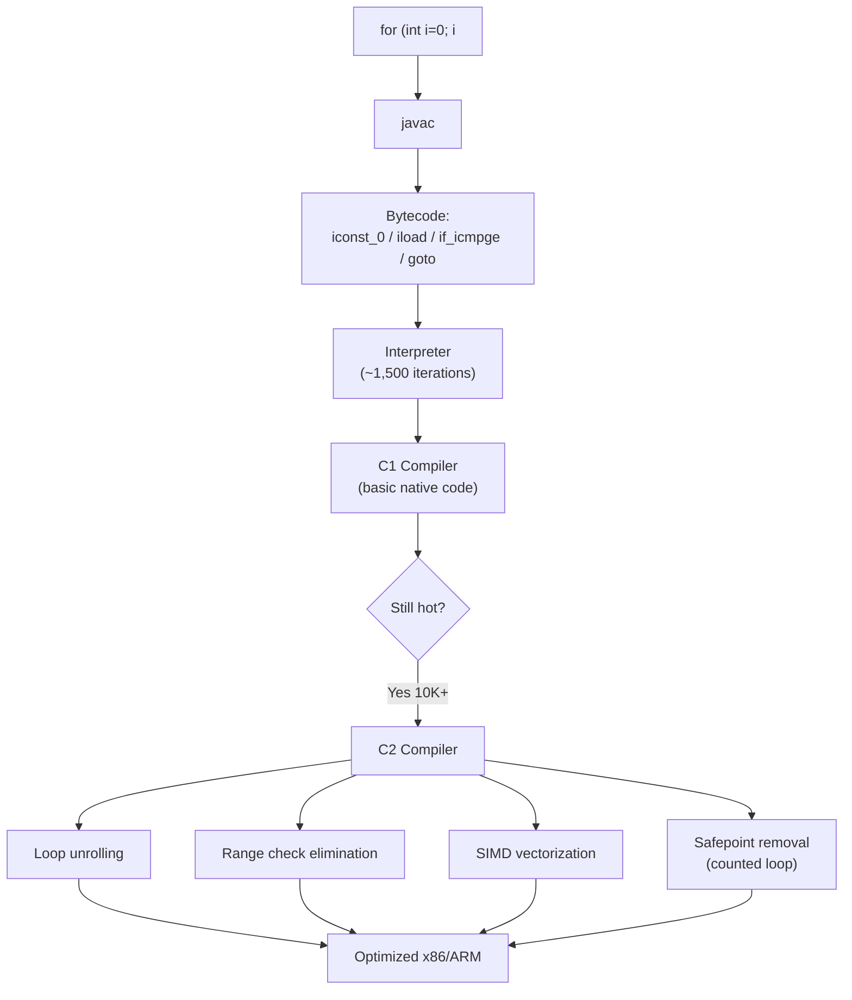
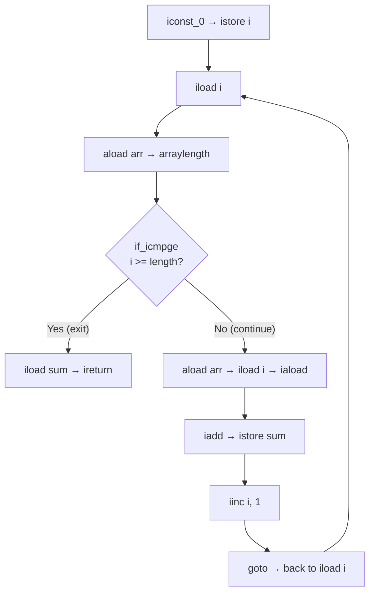
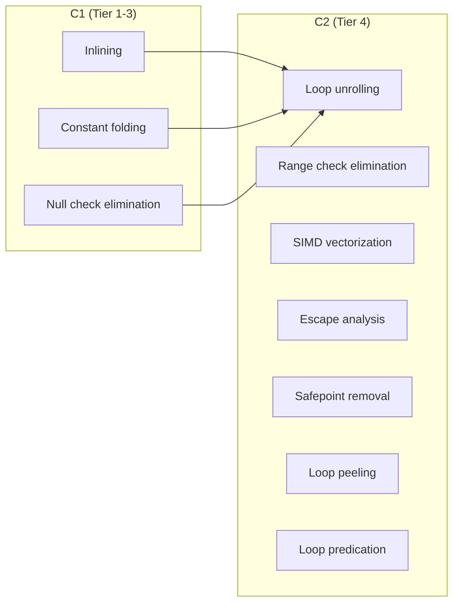

# Loops — Under the Hood

## Table of Contents

1. [Introduction](#introduction)
2. [How It Works Internally](#how-it-works-internally)
3. [JVM Deep Dive](#jvm-deep-dive)
4. [Bytecode Analysis](#bytecode-analysis)
5. [JIT Compilation](#jit-compilation)
6. [Memory Layout](#memory-layout)
7. [GC Internals](#gc-internals)
8. [Source Code Walkthrough](#source-code-walkthrough)
9. [Performance Internals](#performance-internals)
10. [Edge Cases at the Lowest Level](#edge-cases-at-the-lowest-level)
11. [Test](#test)
12. [Summary](#summary)
13. [Diagrams & Visual Aids](#diagrams--visual-aids)

---

## Introduction

> Focus: "What happens under the hood?"

This document explores what the JVM does internally when you write a loop. From the bytecode that `javac` generates, to how the C1/C2 JIT compilers transform loops into optimized machine code, to how safepoints interact with loop back-edges, and how the GC impacts loop-heavy workloads. Understanding these internals is essential for performance engineering and debugging JVM-level issues.

---

## How It Works Internally

Step-by-step breakdown of what happens when the JVM executes a `for` loop:

1. **Source code** → `for (int i = 0; i < n; i++) { arr[i] = i; }`
2. **Bytecode** → `javac` generates: `iconst_0`, `istore`, `iload`, `if_icmpge` (branch), `goto` (back-edge)
3. **Class Loading** → The ClassLoader loads the `.class` file, verifies the bytecode stack map frames
4. **Interpretation** → The first ~10,000 executions run in the interpreter, one bytecode at a time
5. **C1 compilation** → After ~1,500 invocations, C1 compiles with basic optimizations (inlining, constant folding)
6. **C2 compilation** → After ~10,000 invocations, C2 compiles with aggressive loop optimizations
7. **Machine code** → The loop runs as native x86/ARM instructions with SIMD, unrolling, eliminated bounds checks



---

## JVM Deep Dive

### How the JVM Handles Loop Execution

**Stack frame layout during a loop:**

```
JVM Stack Frame for method with loop:
┌─────────────────────────────────────┐
│  Local Variables                     │
│  [0] this (if non-static)            │
│  [1] i       ← loop counter         │
│  [2] arr     ← array reference      │
│  [3] n       ← loop bound           │
├─────────────────────────────────────┤
│  Operand Stack                       │
│  [top] current computation value     │
│  Stack depth varies per instruction  │
├─────────────────────────────────────┤
│  PC Register → current bytecode     │
│  Points to the branch/goto instr.   │
└─────────────────────────────────────┘
```

**Key JVM specifications for loops:**

- **JLS 14.14.1:** The `for` statement's `ForInit`, `Expression`, and `ForUpdate` parts
- **JLS 14.14.2:** The enhanced `for` statement desugars to an `Iterator` pattern
- **JVMS 3.2:** The bytecode verifier checks that the operand stack is consistent at all branch targets (stack map frames)

### Counted Loop Detection

The C2 compiler classifies loops into **counted** and **non-counted**:

```
Counted loop requirements (HotSpot C2):
1. Single int/short/byte/char loop variable
2. Constant stride (typically +1 or -1)
3. Known bounds (loop limit is loop-invariant or provably bounded)
4. No side-exits other than the loop test
5. No calls to methods that are not inlined

→ If ALL conditions met: NO safepoint poll at back-edge
→ If ANY condition fails: safepoint poll IS inserted
```

---

## Bytecode Analysis

### `for` Loop Bytecode

```java
public class ForLoopDemo {
    public static int sumArray(int[] arr) {
        int sum = 0;
        for (int i = 0; i < arr.length; i++) {
            sum += arr[i];
        }
        return sum;
    }
}
```

```bash
javac ForLoopDemo.java && javap -c -verbose ForLoopDemo.class
```

```
public static int sumArray(int[]);
  Code:
     0: iconst_0          // Push 0 (for sum)
     1: istore_1          // Store to local var 1 (sum = 0)
     2: iconst_0          // Push 0 (for i)
     3: istore_2          // Store to local var 2 (i = 0)
     4: iload_2           // Load i                          ─┐
     5: aload_0           // Load arr reference               │ Loop condition
     6: arraylength       // Push arr.length                  │
     7: if_icmpge     20  // If i >= arr.length, goto 20     ─┘
    10: iload_1           // Load sum                        ─┐
    11: aload_0           // Load arr                         │
    12: iload_2           // Load i                           │ Loop body
    13: iaload            // Load arr[i] (with bounds check!) │
    14: iadd              // sum + arr[i]                     │
    15: istore_1          // Store back to sum               ─┘
    16: iinc     2, 1     // i++                              ← Update
    19: goto     4        // Jump back to condition           ← Back-edge
    22: iload_1           // Load sum
    23: ireturn           // Return sum
```

**Key observations:**
- `arraylength` is called every iteration (line 6) — the JIT will hoist this
- `iaload` at line 13 includes an implicit bounds check — the JIT will eliminate it
- `goto 4` at line 19 is the back-edge — safepoint poll location for non-counted loops
- `iinc` is a special bytecode that increments a local variable in place (no push/pop)

### Enhanced `for-each` Bytecode (Array)

```java
public static int sumForEach(int[] arr) {
    int sum = 0;
    for (int n : arr) {
        sum += n;
    }
    return sum;
}
```

```
public static int sumForEach(int[]);
  Code:
     0: iconst_0          // sum = 0
     1: istore_1
     2: aload_0           // Load arr
     3: astore_2          // Store arr copy to local var 2
     4: aload_2           // Load arr copy
     5: arraylength       // arr.length
     6: istore_3          // Store length to local var 3 (cached!)
     7: iconst_0          // i = 0
     8: istore     4      // Store i to local var 4
    10: iload      4      // Load i                        ─┐
    12: iload_3           // Load cached length              │
    13: if_icmpge  29     // If i >= length, exit           ─┘
    16: aload_2           // Load arr copy
    17: iload      4      // Load i
    19: iaload            // arr[i]
    20: istore     5      // n = arr[i]
    22: iload_1           // Load sum
    23: iload      5      // Load n
    24: iadd              // sum + n
    25: istore_1          // Store sum
    26: iinc     4, 1     // i++
    29: goto     10       // Back-edge
    32: iload_1
    33: ireturn
```

**Key difference:** The compiler generates **almost identical** bytecode for array for-each as for classic `for`. Notice that `arraylength` is called once and cached in local var 3 — this is better than the classic `for` loop bytecode above.

### Enhanced `for-each` Bytecode (Collection)

```java
public static int sumList(List<Integer> list) {
    int sum = 0;
    for (int n : list) {  // Note: auto-unboxing
        sum += n;
    }
    return sum;
}
```

```
Code:
     0: iconst_0
     1: istore_1
     2: aload_0
     3: invokeinterface #2 (Iterator List.iterator())  ← Creates Iterator
     8: astore_2
     9: aload_2
    10: invokeinterface #3 (boolean Iterator.hasNext()) ← Virtual dispatch
    15: ifeq          36
    18: aload_2
    19: invokeinterface #4 (Object Iterator.next())     ← Virtual dispatch
    24: checkcast      #5 (Integer)                     ← Type check
    27: invokevirtual  #6 (int Integer.intValue())      ← Auto-unboxing
    30: istore_3
    31: iload_1
    32: iload_3
    33: iadd
    34: istore_1
    35: goto           9
    38: iload_1
    39: ireturn
```

**Key observations:**
- Three `invokeinterface` calls per iteration — much more expensive than `iaload`
- `checkcast` for the generic type parameter (type erasure)
- `invokevirtual` for `intValue()` — auto-unboxing creates `Integer` objects on each `next()` call
- This is a **non-counted** loop — safepoint poll is inserted at the `goto` back-edge

---

## JIT Compilation

### C2 Loop Optimizations in Detail

```bash
# Print compilation events
java -XX:+PrintCompilation -XX:+UnlockDiagnosticVMOptions \
     -XX:+PrintInlining ForLoopDemo

# Output shows:
# 1234  b  4  ForLoopDemo::sumArray (24 bytes)
# @ 13  iaload          ← bounds check eliminated
#        loop unrolled 4x
```

**Optimization 1: Range Check Elimination**

The C2 compiler proves that `0 <= i < arr.length` for all iterations:

```
Before optimization:
  if (i < 0 || i >= arr.length) throw AIOOBE;
  val = arr[i];

After range check elimination:
  val = arr[i];  // bounds check removed — proven safe
```

**Optimization 2: Loop Unrolling**

C2 unrolls counted loops by default (controlled by `-XX:LoopUnrollLimit`):

```
Before unrolling:
  loop:
    sum += arr[i]; i++;
    if (i < n) goto loop;

After 4x unrolling:
  loop:
    sum += arr[i];
    sum += arr[i+1];
    sum += arr[i+2];
    sum += arr[i+3];
    i += 4;
    if (i < n-3) goto loop;
  // Handle remaining elements
```

**Optimization 3: Auto-Vectorization (SIMD)**

For simple arithmetic loops, C2 generates SIMD instructions:

```
Before vectorization (scalar):
  movl  (%rdi,%rsi,4), %eax    ; Load arr[i]
  addl  %eax, %ecx             ; sum += arr[i]

After vectorization (AVX2):
  vmovdqu (%rdi,%rsi,4), %ymm0  ; Load 8 ints at once (256-bit)
  vpaddd  %ymm0, %ymm1, %ymm1  ; Add 8 ints in parallel
```

```bash
# View generated assembly (requires hsdis-amd64.so)
java -XX:+UnlockDiagnosticVMOptions -XX:+PrintAssembly \
     -XX:CompileCommand=print,*ForLoopDemo.sumArray ForLoopDemo
```

### JIT Compilation Tiers

```
Tier 0: Interpreter         (~0-1,500 invocations)
Tier 1: C1 (simple)         (~1,500-10,000 invocations)
Tier 2: C1 (full profile)
Tier 3: C1 (with counters)
Tier 4: C2 (optimized)      (10,000+ invocations — loop optimizations kick in)
```

---

## Memory Layout

### Stack vs Heap During Loop Execution

```
Thread Stack (per loop iteration):
┌────────────────────────────────┐
│  Stack Frame: sumArray()       │
│  ┌──────────────────────────┐  │
│  │ Local Vars:              │  │
│  │  [0] arr → [Heap ref]   │  │ ← 4 bytes (compressed oop)
│  │  [1] sum = 150           │  │ ← 4 bytes (int, on stack)
│  │  [2] i = 3               │  │ ← 4 bytes (int, on stack)
│  ├──────────────────────────┤  │
│  │ Operand Stack:           │  │
│  │  (varies per instruction)│  │
│  └──────────────────────────┘  │
└────────────────────────────────┘

Heap (array object):
┌────────────────────────────────────────┐
│  Object Header (Mark Word)  │ 8 bytes  │
│  Class Pointer (Klass*)     │ 4 bytes  │ (compressed)
│  Array Length               │ 4 bytes  │
│  int[0] = 10                │ 4 bytes  │
│  int[1] = 20                │ 4 bytes  │
│  int[2] = 30                │ 4 bytes  │
│  int[3] = 40                │ 4 bytes  │
│  int[4] = 50                │ 4 bytes  │
│  Padding                    │ 0-4 bytes│
└────────────────────────────────────────┘
Total: 16 (header) + 20 (data) + padding = 40 bytes
```

**Key insight:** The loop counter `i` and accumulator `sum` live on the stack — no GC involvement. The array is on the heap but is only read, not modified structurally, so no GC barriers are triggered.

### Escape Analysis and Loops

When an object is created inside a loop, the JIT checks if it "escapes" the loop:

```java
// Scenario: Object created in loop
for (int i = 0; i < n; i++) {
    Point p = new Point(i, i * 2);  // Does p escape?
    sum += p.distance();
}
```

**If `p` does NOT escape:**
- C2 applies **scalar replacement** — `p.x` and `p.y` become local variables on the stack
- No heap allocation, no GC pressure
- The `new Point()` constructor is inlined and the object is eliminated

**If `p` DOES escape (stored in a list, returned, etc.):**
- Normal heap allocation per iteration
- N objects created → GC pressure

---

## GC Internals

### GC Interaction with Loops

**Safepoint poll at loop back-edge (non-counted loops):**

```
Compiled code for non-counted loop:
  loop_start:
    ... loop body ...
    test  %eax, (%r15)          ; Safepoint poll — read from polling page
    jmp   loop_start            ; Back-edge

; When GC needs a safepoint:
; 1. GC thread unmaps the polling page
; 2. The 'test' instruction triggers a page fault (SEGV)
; 3. Signal handler suspends the thread
; 4. GC proceeds
; 5. After GC, polling page is remapped, thread resumes
```

**Counted loops — no safepoint poll:**

```
Compiled code for counted loop:
  loop_start:
    ... loop body ...
    incl  %ecx                  ; i++
    cmpl  %edx, %ecx            ; i < n?
    jl    loop_start            ; Back-edge — NO safepoint poll
```

### Allocation Rate in Loops

```java
// High allocation rate — triggers frequent young GC
for (int i = 0; i < 1_000_000; i++) {
    String s = "value_" + i;  // Creates new String + StringBuilder each iteration
    process(s);
}

// Allocation rate: ~80 bytes/iteration * 1M = ~80 MB
// With 256 MB young gen, this triggers ~0-1 minor GCs
// With 32 MB young gen, this triggers ~2-3 minor GCs
```

Monitor allocation rate:
```bash
java -Xlog:gc*:file=gc.log -XX:+PrintGCDetails -jar app.jar
# Look for: "Allocation rate: XX MB/s"
```

---

## Source Code Walkthrough

### HotSpot C2 Loop Optimization Source

The relevant C2 source files in OpenJDK:

```
hotspot/src/share/vm/opto/
├── loopnode.hpp      ← Loop node representation (IdealLoopTree)
├── loopTransform.cpp ← Loop unrolling, peeling, pre/main/post
├── loopPredicate.cpp ← Loop predication (range check elimination)
├── superword.cpp     ← Auto-vectorization (SLP algorithm)
└── cfgnode.cpp       ← Control flow graph — back-edge handling
```

**Key data structures:**

```cpp
// From loopnode.hpp (simplified)
class IdealLoopTree {
    Node* _head;          // Loop header node
    Node* _tail;          // Back-edge source
    bool  _has_call;      // True if loop body contains a call
    bool  _has_sfpt;      // True if loop has safepoint
    int   _est_trip_count; // Estimated trip count for unrolling decisions

    // Counted loop detection
    bool is_counted() {
        return _head->is_CountedLoop();
    }
};

// CountedLoopNode contains:
// - init (initial value)
// - limit (upper bound)
// - stride (increment)
// - main_idx (induction variable)
```

### Iterator Implementation (ArrayList)

```java
// From java.util.ArrayList (simplified)
private class Itr implements Iterator<E> {
    int cursor;       // index of next element to return
    int lastRet = -1; // index of last element returned
    int expectedModCount = modCount; // Snapshot at creation

    public boolean hasNext() {
        return cursor != size;
    }

    public E next() {
        checkForComodification(); // ← This causes ConcurrentModificationException
        int i = cursor;
        Object[] elementData = ArrayList.this.elementData;
        cursor = i + 1;
        return (E) elementData[lastRet = i];
    }

    final void checkForComodification() {
        if (modCount != expectedModCount)
            throw new ConcurrentModificationException();
    }
}
```

---

## Performance Internals

### Instruction Cache (I-Cache) Impact

Unrolled loops have larger code size, which can cause I-cache misses:

```
Loop unroll factor vs I-cache:
┌─────────────┬────────────┬────────────────┐
│ Unroll Factor│ Code Size  │ I-Cache Effect │
├─────────────┼────────────┼────────────────┤
│ 1x (none)   │ Small      │ Fits in L1I    │
│ 4x          │ 4x larger  │ Still fits     │
│ 16x         │ 16x larger │ May spill L1I  │
│ 64x         │ 64x larger │ I-cache misses │
└─────────────┴────────────┴────────────────┘
```

The JIT balances unrolling benefit (fewer branches) vs I-cache cost (more code):
- `-XX:LoopUnrollLimit=60` (default) — maximum number of nodes to unroll
- `-XX:LoopUnrollMin=4` — minimum unroll factor

### Branch Prediction and Loops

```
Loop back-edge branch prediction:
- Modern CPUs predict "taken" for backward branches (loop continues)
- The LAST iteration causes a misprediction (loop exits)
- Cost: ~15-20 cycles per misprediction on modern x86

For a loop with 1,000 iterations:
- 999 correct predictions (taken)
- 1 misprediction (not taken — loop exits)
- Misprediction rate: 0.1% — negligible

For a loop with 3 iterations:
- 2 correct predictions
- 1 misprediction
- Misprediction rate: 33% — significant overhead
```

---

## Edge Cases at the Lowest Level

### Case 1: On-Stack Replacement (OSR)

When a loop is "hot" but the enclosing method was never called enough for full compilation:

```java
public static void main(String[] args) {
    // main is called only once — not hot
    long sum = 0;
    for (int i = 0; i < 100_000_000; i++) {
        sum += i; // This loop IS hot
    }
    System.out.println(sum);
}
```

The JIT uses **On-Stack Replacement (OSR)** to compile just the loop and replace the currently executing interpreter frame with compiled code mid-execution.

```bash
java -XX:+PrintCompilation OSRDemo
# Output: "@ 4  OSRDemo::main @ 7 (42 bytes)   made not entrant"
#         The "@ 7" indicates OSR at bytecode offset 7 (the loop)
```

### Case 2: Deoptimization Inside Loops

If a class is loaded that invalidates JIT assumptions (e.g., new subclass breaks devirtualization), the JIT deoptimizes:

```
1. JIT compiled loop with inlined method call
2. New class loaded → assumption violated
3. Deoptimization: transfer from compiled code back to interpreter
4. Loop restarts from interpreter (significant performance drop)
5. After re-profiling, JIT recompiles with updated assumptions
```

### Case 3: Safepoint Bias with Thread.sleep()

```java
// This thread is "stuck" in a counted loop — won't reach safepoint
Thread t = new Thread(() -> {
    long sum = 0;
    for (int i = 0; i < Integer.MAX_VALUE; i++) {
        sum += i;  // No safepoint — counted loop
    }
});
t.start();

// GC must wait for t to finish the loop before it can proceed
// TTSP (Time To Safepoint) could be several seconds!
```

**Fix in JDK 17+:** Use `-XX:+UseCountedLoopSafepoints` to force safepoint polls even in counted loops (at a small performance cost).

---

## Test

**1. What bytecode instruction represents the back-edge of a `for` loop?**

<details>
<summary>Answer</summary>

`goto` — it jumps back to the loop condition check. For example, `goto 4` jumps back to the `iload` instruction that starts the condition evaluation. This is where safepoint polls are inserted for non-counted loops.

</details>

**2. Why does `for (int n : intArray)` generate different bytecode than `for (int n : integerList)`?**

<details>
<summary>Answer</summary>

For `int[]`, the compiler generates direct array access with `iaload` — no virtual dispatch, no boxing. For `List<Integer>`, it generates `invokeinterface` for `iterator()`, `hasNext()`, and `next()`, plus `checkcast` for the generic type and `invokevirtual` for `intValue()` (unboxing). The collection version has ~5x more bytecode instructions per iteration.

</details>

**3. What is On-Stack Replacement (OSR)?**

<details>
<summary>Answer</summary>

OSR is a JIT compilation technique where a loop running in the interpreter is compiled to native code, and the interpreter frame is replaced with a compiled frame mid-execution. This happens when the loop becomes hot but the enclosing method has not been called enough times for normal compilation. The compiled code resumes execution at the exact point where the interpreter left off.

</details>

**4. What CPU instruction does `Thread.onSpinWait()` emit on x86?**

<details>
<summary>Answer</summary>

The `PAUSE` instruction. It is a hint to the CPU that this is a spin-wait loop, which:
1. Reduces power consumption (avoids speculative execution)
2. Improves SMT (Hyper-Threading) performance by yielding pipeline resources to the sibling thread
3. Prevents memory order violations that would trigger expensive pipeline flushes

</details>

**5. How does the JIT's escape analysis affect objects created inside loops?**

<details>
<summary>Answer</summary>

If escape analysis proves that an object created inside a loop does not escape (not stored in a field, not passed to a non-inlined method, not returned), the JIT applies **scalar replacement**: the object's fields become local variables on the stack. No heap allocation occurs, no GC is triggered. The `new` instruction is effectively eliminated.

</details>

**6. Why is `-XX:+UseCountedLoopSafepoints` not enabled by default?**

<details>
<summary>Answer</summary>

Because inserting safepoint polls in counted loops reduces performance by 5-10% for tight numeric loops. The safepoint poll (`test %eax, (%r15)`) is cheap but not free — it consumes an instruction slot, can prevent loop vectorization, and adds a memory read per iteration. The JVM designers chose performance by default, leaving latency-sensitive applications to opt in.

</details>

---

## Summary

- `javac` generates simple bytecode for loops: `iconst/iload/if_icmpge/goto` for `for` loops, `invokeinterface` for collection for-each
- The C2 JIT compiler applies loop unrolling, range check elimination, SIMD vectorization, and escape analysis
- Counted loops (int counter, known bounds) skip safepoint polls — faster but can delay GC
- Array for-each compiles to nearly identical bytecode as classic `for`; collection for-each has significant overhead from virtual dispatch and autoboxing
- On-Stack Replacement allows the JIT to compile a hot loop even when the enclosing method is cold
- Escape analysis can eliminate object allocations inside loops via scalar replacement
- Use `-XX:+PrintCompilation`, `-XX:+PrintAssembly`, and `-XX:+TraceLoopOpts` to observe JIT loop optimizations

---

## Diagrams & Visual Aids

### Loop Bytecode Flow



### JIT Optimization Layers



### Memory Layout: Array Iteration

```
CPU Cache Hierarchy during array loop:
┌──────────────────────────────────────────┐
│ L1 Data Cache (32 KB, ~4 cycle latency)  │
│  ┌──────────────────────────────────┐    │
│  │ Cache line 0: arr[0..15]        │    │ ← Prefetcher loads
│  │ Cache line 1: arr[16..31]       │    │    next line automatically
│  │ Cache line 2: arr[32..47]       │    │
│  └──────────────────────────────────┘    │
├──────────────────────────────────────────┤
│ L2 Cache (256 KB, ~12 cycle latency)     │
├──────────────────────────────────────────┤
│ L3 Cache (8 MB, ~40 cycle latency)       │
├──────────────────────────────────────────┤
│ Main Memory (~200 cycle latency)         │
│  Full array: int[1000] = 4000 bytes      │
└──────────────────────────────────────────┘

Sequential access: ~4 cycles/element (L1 hit + prefetch)
Random access:    ~40-200 cycles/element (L3/memory)
```
