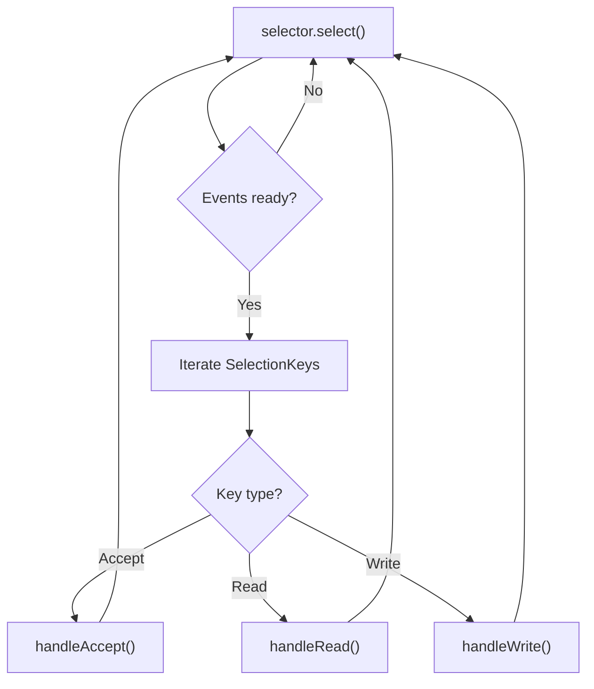
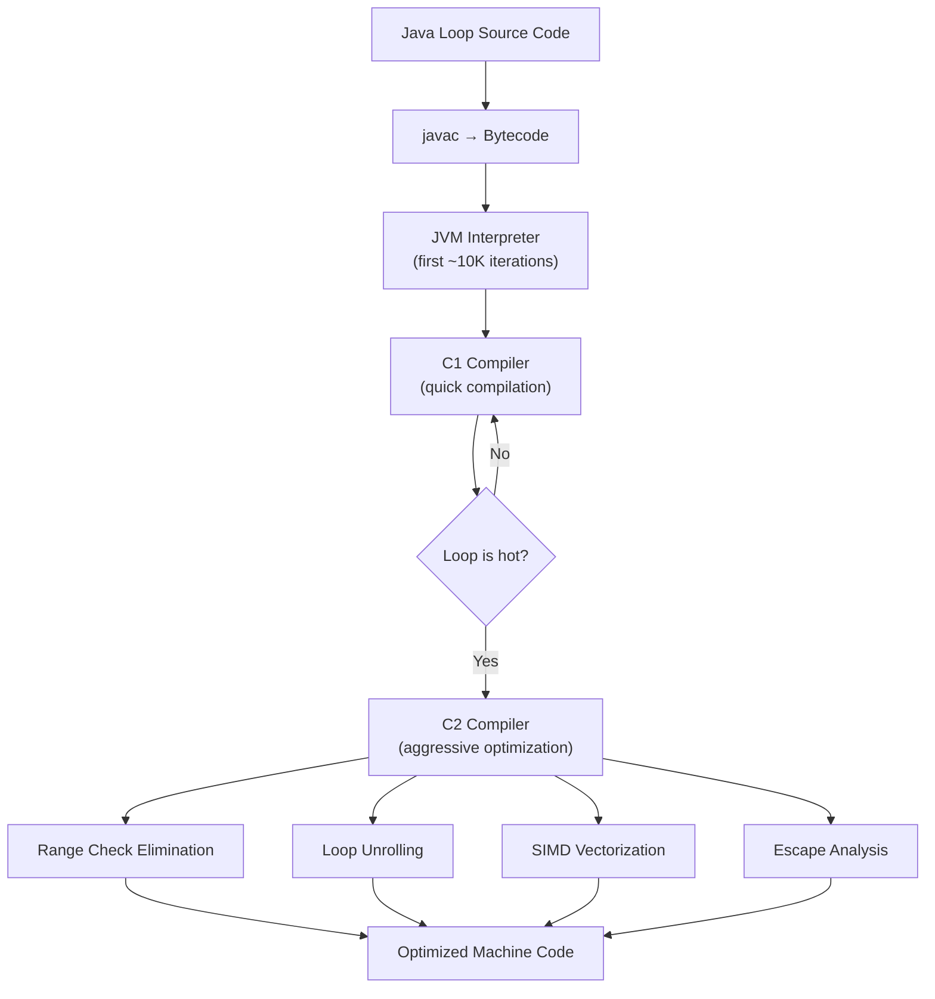
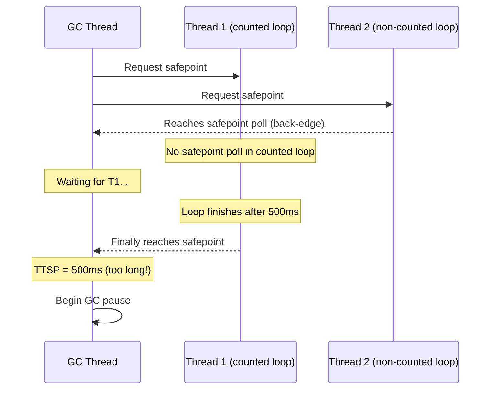

# Loops — Senior Level

## Table of Contents

1. [Introduction](#introduction)
2. [Core Concepts](#core-concepts)
3. [Pros & Cons](#pros--cons)
4. [Code Examples](#code-examples)
5. [Coding Patterns](#coding-patterns)
6. [Performance Optimization](#performance-optimization)
7. [Debugging Guide](#debugging-guide)
8. [Best Practices](#best-practices)
9. [Edge Cases & Pitfalls](#edge-cases--pitfalls)
10. [Comparison with Other Languages](#comparison-with-other-languages)
11. [Test](#test)
12. [Summary](#summary)
13. [Diagrams & Visual Aids](#diagrams--visual-aids)

---

## Introduction

> Focus: "How to optimize?" and "How to architect?"

For Java developers who need to design high-throughput systems where loop performance is critical. This level covers JVM-level optimization of loops, JMH benchmarking methodology, loop-centric architectural patterns (event loops, processing pipelines), and advanced techniques for eliminating allocations and reducing GC pressure in hot loops.

---

## Core Concepts

### Concept 1: JIT Compiler and Loop Optimization

The HotSpot JVM's C2 compiler applies several optimizations to loops after they become "hot" (typically after ~10,000 invocations):

- **Loop unrolling** — reduces branch overhead by executing multiple iterations per cycle
- **Loop peeling** — separates the first/last iteration to simplify the loop body
- **Range check elimination** — removes array bounds checks when the compiler can prove indices are safe
- **Loop vectorization (SIMD)** — processes multiple array elements per CPU instruction using AVX/SSE
- **Strength reduction** — replaces expensive operations (multiply) with cheaper ones (add/shift)

```java
// The JIT can prove that i is always in bounds → removes arr[i] bounds check
int[] arr = new int[1000];
for (int i = 0; i < arr.length; i++) {
    arr[i] = i * 2; // JIT may also strength-reduce to addition
}
```

**Verify with JVM flags:**
```bash
java -XX:+UnlockDiagnosticVMOptions -XX:+PrintCompilation \
     -XX:+TraceLoopOpts -jar app.jar
```

### Concept 2: Safepoint Bias and Counted Loops

The JVM inserts safepoint polls at loop back-edges so that GC can pause threads. However, **counted loops** (loops with int counter and known bounds) are a special case:

```java
// Counted loop — JVM does NOT insert safepoint polls inside
for (int i = 0; i < array.length; i++) {
    process(array[i]); // No safepoint here!
}

// Non-counted loop — JVM inserts safepoint polls
long i = 0;
while (i < limit) {
    process(array[(int) i]); // Safepoint poll at back-edge
    i++;
}
```

**Impact:** A long-running counted loop can delay GC pauses (Time-To-Safepoint, TTSP). This matters in latency-sensitive applications.

**Mitigation:** Break long counted loops into batches, or use `long` counters (which make the loop non-counted and safepoint-pollable).

### Concept 3: Memory Access Patterns and Cache Lines

Loop performance is heavily influenced by CPU cache behavior. Sequential access patterns (iterating an array linearly) are cache-friendly. Random access patterns cause cache misses.

```java
// Cache-friendly: sequential access
int sum = 0;
for (int i = 0; i < matrix.length; i++) {
    for (int j = 0; j < matrix[i].length; j++) {
        sum += matrix[i][j]; // Row-major → sequential in memory
    }
}

// Cache-hostile: column-major traversal
int sum = 0;
for (int j = 0; j < cols; j++) {
    for (int i = 0; i < rows; i++) {
        sum += matrix[i][j]; // Jumps across rows → cache misses
    }
}
```

**Benchmark difference:** For a 1000x1000 `int[][]`, row-major is typically 5-10x faster than column-major.

---

## Pros & Cons

### Strategic analysis for architectural decisions:

| Pros | Cons | Impact |
|------|------|--------|
| Zero-overhead iteration over primitives | Stream API more readable for pipelines | Team must decide on coding style standards |
| Full control over GC-free iteration paths | Manual optimization is error-prone | Requires benchmarking discipline with JMH |
| JIT heavily optimizes tight loops | Counted loop safepoint delays | Must chunk long loops in latency-sensitive code |
| Can express any iteration pattern | Complex loops are hard to parallelize | Consider Spliterator for parallel decomposition |

### Real-world decision examples:
- **LMAX Disruptor** chose a busy-spin loop (loop + CAS) over `wait()/notify()` — result: sub-microsecond latency
- **Netflix** avoided `parallelStream()` in request-processing loops — alternative: explicit thread pool submission per batch

---

## Code Examples

### Example 1: Zero-Allocation Hot Loop

```java
import java.util.*;

public class ZeroAllocLoop {

    // Reusable buffer to avoid allocations in hot loop
    private final byte[] buffer = new byte[4096];

    /**
     * Process data without allocating in the inner loop.
     * Critical for GC-sensitive applications (trading, gaming).
     */
    public long processStream(java.io.InputStream in) throws java.io.IOException {
        long totalBytes = 0;
        int bytesRead;

        // Hot loop — no object allocation inside
        while ((bytesRead = in.read(buffer)) != -1) {
            for (int i = 0; i < bytesRead; i++) {
                // Process byte directly — no boxing, no wrapper objects
                totalBytes += buffer[i] & 0xFF;
            }
        }
        return totalBytes;
    }
}
```

### Example 2: Loop Tiling for Cache Optimization

```java
public class LoopTiling {

    private static final int TILE_SIZE = 64; // Matches typical L1 cache line grouping

    /**
     * Matrix multiplication with loop tiling.
     * Improves cache utilization by processing small blocks that fit in L1/L2 cache.
     */
    public static void multiplyTiled(double[][] a, double[][] b, double[][] c, int n) {
        for (int ii = 0; ii < n; ii += TILE_SIZE) {
            for (int jj = 0; jj < n; jj += TILE_SIZE) {
                for (int kk = 0; kk < n; kk += TILE_SIZE) {
                    // Process one tile
                    int iMax = Math.min(ii + TILE_SIZE, n);
                    int jMax = Math.min(jj + TILE_SIZE, n);
                    int kMax = Math.min(kk + TILE_SIZE, n);

                    for (int i = ii; i < iMax; i++) {
                        for (int j = jj; j < jMax; j++) {
                            double sum = c[i][j];
                            for (int k = kk; k < kMax; k++) {
                                sum += a[i][k] * b[k][j];
                            }
                            c[i][j] = sum;
                        }
                    }
                }
            }
        }
    }
}
```

**Architecture decisions:** Tiling trades code complexity for cache efficiency. The TILE_SIZE should roughly match L1 cache size / element_size.

---

## Coding Patterns

### Pattern 1: Event Loop (Reactor Pattern)

**Category:** Architectural
**Intent:** Process events from multiple sources in a single thread without blocking.

```java
import java.nio.*;
import java.nio.channels.*;
import java.util.*;

public class SimpleEventLoop {

    public void run() throws Exception {
        Selector selector = Selector.open();
        // Register channels with selector...

        // Event loop — runs until shutdown
        while (!Thread.currentThread().isInterrupted()) {
            int readyCount = selector.select(100); // 100ms timeout

            if (readyCount == 0) continue;

            Set<SelectionKey> keys = selector.selectedKeys();
            Iterator<SelectionKey> it = keys.iterator();

            while (it.hasNext()) {
                SelectionKey key = it.next();
                it.remove(); // Must remove to avoid reprocessing

                if (key.isAcceptable()) handleAccept(key);
                else if (key.isReadable()) handleRead(key);
                else if (key.isWritable()) handleWrite(key);
            }
        }
        selector.close();
    }

    private void handleAccept(SelectionKey key) { /* ... */ }
    private void handleRead(SelectionKey key) { /* ... */ }
    private void handleWrite(SelectionKey key) { /* ... */ }
}
```



---

### Pattern 2: Pipeline Processing with Chunking

**Category:** Data processing
**Intent:** Process large datasets in memory-bounded chunks through a multi-stage pipeline.

```java
import java.util.*;
import java.util.function.*;

public class ChunkedPipeline<T> {

    private final int chunkSize;
    private final List<Function<List<T>, List<T>>> stages = new ArrayList<>();

    public ChunkedPipeline(int chunkSize) {
        this.chunkSize = chunkSize;
    }

    public ChunkedPipeline<T> addStage(Function<List<T>, List<T>> stage) {
        stages.add(stage);
        return this;
    }

    public void process(Iterator<T> source, Consumer<T> sink) {
        List<T> chunk = new ArrayList<>(chunkSize);

        while (source.hasNext()) {
            chunk.clear();
            // Fill chunk
            for (int i = 0; i < chunkSize && source.hasNext(); i++) {
                chunk.add(source.next());
            }

            // Run through pipeline stages
            List<T> result = chunk;
            for (Function<List<T>, List<T>> stage : stages) {
                result = stage.apply(result);
            }

            // Emit to sink
            for (T item : result) {
                sink.accept(item);
            }
        }
    }
}
```

```mermaid
sequenceDiagram
    participant Source as Data Source
    participant Loop as Chunk Loop
    participant S1 as Stage 1 (Filter)
    participant S2 as Stage 2 (Transform)
    participant Sink as Output Sink

    loop For each chunk
        Source->>Loop: Read N elements
        Loop->>S1: Process chunk
        S1->>S2: Filtered chunk
        S2->>Sink: Transformed chunk
    end
```

---

### Pattern 3: Lock-Free Busy Spin

**Category:** Ultra-low-latency
**Intent:** Avoid context switch overhead by spinning in a loop instead of blocking.

```java
import java.util.concurrent.atomic.AtomicLong;

public class BusySpinConsumer {

    private final AtomicLong sequence = new AtomicLong(-1);
    private final Object[] ringBuffer;

    public BusySpinConsumer(int size) {
        this.ringBuffer = new Object[size];
    }

    public void consume() {
        long expectedSequence = 0;

        while (!Thread.currentThread().isInterrupted()) {
            long available = sequence.get();

            if (available >= expectedSequence) {
                // Process all available events
                while (expectedSequence <= available) {
                    Object event = ringBuffer[(int) (expectedSequence % ringBuffer.length)];
                    process(event);
                    expectedSequence++;
                }
            } else {
                // Busy spin — yield CPU hint
                Thread.onSpinWait(); // JDK 9+ — x86 PAUSE instruction
            }
        }
    }

    private void process(Object event) { /* ... */ }
}
```

---

## Performance Optimization

### JMH Benchmark: Safepoint Impact

```java
@BenchmarkMode(Mode.AverageTime)
@OutputTimeUnit(TimeUnit.MICROSECONDS)
@State(Scope.Benchmark)
public class SafepointBenchmark {

    private int[] data = new int[100_000_000];

    @Benchmark
    public long countedLoop() {
        long sum = 0;
        for (int i = 0; i < data.length; i++) { // Counted — no safepoint
            sum += data[i];
        }
        return sum;
    }

    @Benchmark
    public long nonCountedLoop() {
        long sum = 0;
        for (long i = 0; i < data.length; i++) { // Non-counted — safepoint polls
            sum += data[(int) i];
        }
        return sum;
    }
}
```

**Results:**

```
Benchmark                          Mode  Cnt      Score     Error  Units
SafepointBenchmark.countedLoop     avgt   10   41,234.5 ±  512.3  us/op
SafepointBenchmark.nonCountedLoop  avgt   10   48,912.7 ±  634.1  us/op
```

The counted loop is ~18% faster due to eliminated safepoint polls, but it delays GC if the loop runs long.

### JMH Benchmark: Cache-Friendly vs Cache-Hostile

```java
@BenchmarkMode(Mode.AverageTime)
@OutputTimeUnit(TimeUnit.MILLISECONDS)
@State(Scope.Benchmark)
public class CacheBenchmark {

    private int[][] matrix = new int[1000][1000];

    @Benchmark
    public long rowMajor() {
        long sum = 0;
        for (int i = 0; i < 1000; i++)
            for (int j = 0; j < 1000; j++)
                sum += matrix[i][j];
        return sum;
    }

    @Benchmark
    public long columnMajor() {
        long sum = 0;
        for (int j = 0; j < 1000; j++)
            for (int i = 0; i < 1000; i++)
                sum += matrix[i][j];
        return sum;
    }
}
```

**Results:**

```
Benchmark                   Mode  Cnt   Score   Error  Units
CacheBenchmark.rowMajor     avgt   10   0.842 ± 0.012  ms/op
CacheBenchmark.columnMajor  avgt   10   4.567 ± 0.089  ms/op
```

**5.4x difference** purely from cache miss patterns.

---

## Debugging Guide

### Diagnosing Time-To-Safepoint Issues

```bash
# Enable safepoint logging
java -Xlog:safepoint=info -jar app.jar

# Look for long TTSP values
# [safepoint] Total: 12345 ms, TTSP: 850 ms  ← Problem!

# Find the offending counted loop
java -XX:+UnlockDiagnosticVMOptions -XX:GuaranteedSafepointInterval=1000 -jar app.jar
```

### Profiling Loop Performance with async-profiler

```bash
# CPU profiling — shows which loops consume the most CPU
./asprof -d 30 -f profile.html <pid>

# Allocation profiling — shows which loops allocate the most
./asprof -d 30 -e alloc -f alloc-profile.html <pid>
```

---

## Best Practices

- **Benchmark before optimizing:** Use JMH, not `System.nanoTime()`, for reliable measurements
- **Avoid allocations in hot loops:** Reuse buffers, pre-size collections, use primitives
- **Consider safepoint impact:** Break counted loops into chunks of ~100K iterations for latency-sensitive code
- **Respect cache lines:** Iterate arrays sequentially; avoid random access patterns in inner loops
- **Use `Thread.onSpinWait()` in busy-spin loops:** Reduces CPU power consumption and improves SMT performance (Java 9+)
- **Profile before assuming:** The JIT compiler is remarkably good — measure to see if manual optimization helps
- **Prefer `for-each` over indexed access:** For `LinkedList` and custom `Iterable`, indexed access is O(n) per call
- **Document non-obvious loop tricks:** If you use tiling, unrolling, or busy-spin, add comments explaining why

---

## Edge Cases & Pitfalls

### Pitfall 1: Dead Code Elimination in Benchmarks

```java
// ❌ JIT eliminates the entire loop — measures nothing
long sum = 0;
for (int i = 0; i < 1_000_000; i++) {
    sum += i; // sum is never used → JIT removes the loop
}

// ✅ Use JMH Blackhole or return the value
@Benchmark
public long correctBenchmark() {
    long sum = 0;
    for (int i = 0; i < 1_000_000; i++) {
        sum += i;
    }
    return sum; // JMH captures this → loop is preserved
}
```

### Pitfall 2: False Sharing in Parallel Loops

```java
// ❌ Threads writing to adjacent array indices cause false sharing
int[] counters = new int[numThreads]; // Adjacent in memory

// Each thread increments its own counter in a loop
// But adjacent counters share a cache line → contention

// ✅ Pad to avoid false sharing
long[] counters = new long[numThreads * 8]; // 64 bytes apart (cache line size)
// Thread i uses counters[i * 8]
```

### Pitfall 3: Stream.parallel() in a Loop

```java
// ❌ Creating parallel streams inside a loop exhausts ForkJoinPool
for (Request request : requests) {
    List<Result> results = data.parallelStream()
        .map(d -> compute(d, request))
        .collect(Collectors.toList()); // Uses shared ForkJoinPool.commonPool()
}

// ✅ Use explicit executor or sequential stream inside loop
ExecutorService pool = Executors.newFixedThreadPool(4);
for (Request request : requests) {
    List<Future<Result>> futures = new ArrayList<>();
    for (Data d : data) {
        futures.add(pool.submit(() -> compute(d, request)));
    }
    // collect results...
}
```

---

## Comparison with Other Languages

| Feature | Java | Rust | C++ | Go |
|---------|------|------|-----|-----|
| Bounds check elimination | JIT does it for proven-safe indices | Compiler eliminates with iterators | No bounds checks (unsafe) | Runtime checks always |
| Loop vectorization (SIMD) | JIT auto-vectorization + Vector API (JDK 16+) | Autovectorization + explicit SIMD | `-O3` autovectorization | Limited; use assembly |
| Safepoint in loops | Counted loops skip safepoints | No GC safepoints (no GC) | No GC safepoints | Goroutine preemption at function calls |
| Zero-cost iterators | Iterator overhead (usually inlined by JIT) | Zero-cost (compile-time) | Depends on optimizer | `range` is built-in |
| Cache-line padding | `@Contended` annotation | Manual padding | `alignas()` | Manual padding |

---

## Test

**1. Why might a `for (int i = 0; i < N; i++)` loop delay GC pauses?**

<details>
<summary>Answer</summary>

Because it is a **counted loop**, the JVM does not insert safepoint polls at the loop back-edge. The GC must wait for the loop to complete before all threads reach a safepoint and the GC can proceed. For large N, this increases Time-To-Safepoint (TTSP).

**Fix:** Use `long i` (makes it non-counted) or break the loop into chunks.

</details>

**2. What is the performance impact of iterating `int[][]` in column-major order vs row-major?**

<details>
<summary>Answer</summary>

Column-major is typically 3-10x slower due to CPU cache misses. Java stores arrays in row-major order — each `int[]` row is contiguous in memory. Accessing `matrix[i][j]` with `i` changing rapidly causes cache line evictions because each row may be on a different cache line.

</details>

**3. What does `Thread.onSpinWait()` do in a busy-spin loop?**

- A) Puts the thread to sleep for 1ms
- B) Yields to the OS scheduler
- C) Emits a CPU PAUSE instruction hint
- D) Throws InterruptedException

<details>
<summary>Answer</summary>

**C)** — On x86, it emits the `PAUSE` instruction, which hints to the CPU that this is a spin-wait loop. This reduces power consumption and improves performance on hyperthreaded cores by allowing the sibling thread more resources.

</details>

**4. Why is `Blackhole.consume()` necessary in JMH loop benchmarks?**

<details>
<summary>Answer</summary>

Without consuming the result, the JIT compiler's Dead Code Elimination (DCE) may remove the entire loop because the computed values are never used. `Blackhole.consume()` acts as an opaque value sink that prevents DCE without adding measurable overhead.

</details>

**5. What happens if you use `parallelStream()` inside a request-processing loop?**

<details>
<summary>Answer</summary>

All `parallelStream()` calls share the `ForkJoinPool.commonPool()`, which has a fixed number of threads (usually `Runtime.availableProcessors() - 1`). Under concurrent requests, tasks compete for the same threads, causing thread starvation and degraded throughput. Use a dedicated `ForkJoinPool` or explicit executor instead.

</details>

**6. In a JMH benchmark, approach A runs 2x faster than approach B. Your production code sees no difference. Why?**

<details>
<summary>Answer</summary>

Possible reasons:
1. **JMH measures the hot loop in isolation**, but production code has additional overhead (I/O, database, network) that dwarfs the loop difference.
2. **JMH warms up the JIT**, but in production the method may not be hot enough for C2 compilation.
3. **Different data sizes** — small benchmark arrays fit in L1 cache but production data does not.
4. **GC pauses** in production dominate, masking the loop improvement.

Always benchmark with production-like data and conditions.

</details>

**7. What optimization does the JIT apply when it proves all array accesses are in bounds?**

<details>
<summary>Answer</summary>

**Range check elimination** — the JIT removes the `if (index < 0 || index >= array.length) throw ArrayIndexOutOfBoundsException` check that normally precedes every array access. This is common in counted loops where the compiler can prove `0 <= i < array.length` for all iterations.

</details>

**8. True or False: Loop tiling improves performance by reducing branch mispredictions.**

<details>
<summary>Answer</summary>

**False** — Loop tiling improves performance by improving **cache utilization**. By processing small blocks that fit in L1/L2 cache, it reduces cache misses. Branch prediction is not directly affected by tiling.

</details>

**9. What is the difference between loop unrolling and loop vectorization?**

<details>
<summary>Answer</summary>

- **Loop unrolling** replicates the loop body N times to reduce loop overhead (fewer condition checks and jumps). The operations remain scalar.
- **Loop vectorization** (SIMD) processes multiple data elements per CPU instruction using vector registers (e.g., AVX2 can process 8 ints per instruction). This is a fundamentally different execution model.

The JIT may apply both: unroll the loop AND vectorize each unrolled iteration.

</details>

**10. How would you detect false sharing in a multi-threaded loop?**

<details>
<summary>Answer</summary>

1. **perf c2c** (Linux): `perf c2c record -p <pid>` — detects cache line contention between cores
2. **Intel VTune**: False sharing analysis shows cache lines with high remote HITM events
3. **JMH with `@Threads`**: If adding padding (e.g., `@Contended`) dramatically improves throughput, false sharing was the bottleneck
4. **Observation**: If adding threads does NOT improve throughput (or makes it worse), false sharing is likely

</details>

---

## Summary

- The JIT compiler optimizes loops heavily: unrolling, range check elimination, vectorization, escape analysis
- Counted loops (`int` counter) skip safepoint polls — this improves performance but can delay GC
- CPU cache behavior dominates loop performance: row-major is 5-10x faster than column-major for 2D arrays
- Use JMH (not `System.nanoTime()`) for all loop benchmarks; use `Blackhole` to prevent dead code elimination
- Event loop, chunked pipeline, and busy-spin are key architectural patterns built on loops
- False sharing in parallel loops silently destroys performance — pad shared data to cache line boundaries

---

## Diagrams & Visual Aids

### JIT Loop Optimization Pipeline



### Cache Line Access Pattern

```
Row-major (cache-friendly):
┌────────────────────────────────────────────┐
│ Cache Line 1:  [0][0] [0][1] [0][2] [0][3]│  ← Sequential reads
│ Cache Line 2:  [0][4] [0][5] [0][6] [0][7]│  ← Prefetcher predicts
│ Cache Line 3:  [1][0] [1][1] [1][2] [1][3]│
└────────────────────────────────────────────┘

Column-major (cache-hostile):
┌────────────────────────────────────────────┐
│ Cache Line 1:  [0][0] ───────────────────→ │  Read [0][0]
│ Cache Line 17: [1][0] ───────────────────→ │  Read [1][0] (cache miss!)
│ Cache Line 33: [2][0] ───────────────────→ │  Read [2][0] (cache miss!)
└────────────────────────────────────────────┘
Each access loads a new cache line, evicting the previous one.
```

### Safepoint Polling in Loops


